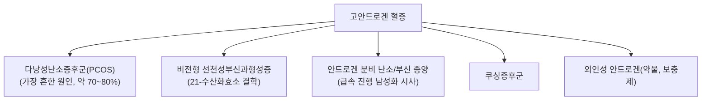

---
aliases:
  - Hyperandrogenism
  - 고안드로겐혈증
  - 高雄激素血症
  - 다모증
tags:
  - 질환
  - 내분비질환
  - 부인과
  - 다낭성난소증후군
---

# 🩺 고안드로겐 혈증 (高雄激素血症, Hyperandrogenism)

> **핵심 3줄 요약 (Key Summary)**:
> - 📍 정의 & 병태생리: 여성에서 테스토스테론·DHEA-S·안드로스텐디온 등 남성호르몬(안드로겐)이 정상 범위 이상으로 상승한 상태 또는 그로 인한 임상 징후를 통칭. 가장 흔한 원인은 다낭성난소증후군(PCOS)이며, 그 외 선천성부신과형성증(CAH), 안드로겐 분비 종양, 쿠싱증후군 등이 있음.
> - 🚩 전형적 임상 양상: 다모증(hirsutism, 남성형 체모 분포), 여드름, 남성형 탈모, 희발월경·무월경. 급격히 진행하는 심한 다모증·음핵비대·목소리 변화 등 남성화(virilization) 소견은 안드로겐 분비 종양을 강력히 시사하므로 즉각적 정밀검사가 필요.
> - 🛠️ 핵심 검사: 총/유리 테스토스테론, DHEA-S, 17-하이드록시프로게스테론(비전형 CAH 배제), 골반초음파(다낭성 난소 소견 확인). 로테르담 기준(2003)으로 PCOS 진단 시 희발배란·고안드로겐증·다낭성난소 소견 중 2가지 이상 충족.
> - ⚠️ 응급 레드플래그: 수개월 내 급속히 진행하는 심한 남성화 징후는 안드로겐 분비 난소·부신 종양을 시사하는 위험신호로, 즉시 영상검사 및 전문의 의뢰가 필요.

---

## 📌 목차
1. [정의 및 병태생리](#1-정의-및-병태생리)
2. [주요 원인 질환](#2-주요-원인-질환)
3. [임상 증상 & 평가](#3-임상-증상--평가)
4. [진단 검사 및 감별](#4-진단-검사-및-감별)
5. [치료 원칙](#5-치료-원칙)
6. [한의학적 연계](#6-한의학적-연계)
7. [출처 및 학술 참고 문헌 (References)](#7-출처-및-학술-참고-문헌-references)

---

## 1. 정의 및 병태생리

고안드로겐 혈증은 여성에서 난소 또는 부신에서 생성되는 안드로겐(테스토스테론, 안드로스텐디온, DHEA-S 등)이 과다하게 생성·분비되어 혈중 농도가 상승한 상태를 말하며, 이로 인해 다모증·여드름·남성형 탈모 등 임상적 남성화 징후가 동반될 수 있습니다.

---

## 2. 주요 원인 질환

* **다낭성난소증후군(PCOS)**: 가임기 여성 고안드로겐 혈증의 가장 흔한 원인으로, 만성 무배란·고안드로겐증·다낭성 난소 형태를 특징으로 하는 내분비대사 질환입니다.
* **비전형 선천성부신과형성증(Non-classic CAH)**: 21-하이드록실화효소 결핍의 경증형으로, 사춘기 이후 발현하며 임상적으로 PCOS와 유사하게 나타날 수 있어 감별이 중요합니다.
* **안드로겐 분비 종양**: 난소 또는 부신의 안드로겐 분비 종양은 드물지만, 수개월 내 급속히 진행하는 심한 남성화 소견을 보이는 경우 반드시 배제해야 합니다.

---

## 3. 임상 증상 & 평가

* **다모증(Hirsutism)**: 안면·흉부·복부 등 남성형 체모 분포로, Ferriman-Gallwey 점수로 평가합니다.
* **피부**: 여드름, 지루성 피부.
* **탈모**: 남성형 탈모 양상(안드로겐성 탈모).
* **생식 기능**: 희발월경·무월경, 배란장애로 인한 불임.
* **남성화(Virilization) — 중증 소견**: 음핵비대, 목소리가 굵어짐, 근육량 증가, 유방 위축 — 이러한 소견은 안드로겐 분비 종양을 강력히 시사합니다.

---

## 4. 진단 검사 및 감별

* **호르몬 검사**: 총 테스토스테론·유리 테스토스테론, DHEA-S(부신 기원 안드로겐 지표), 17-하이드록시프로게스테론(비전형 CAH 배제).
* **로테르담 기준(2003, PCOS 진단)**: ① 희발배란/무배란, ② 임상적/생화학적 고안드로겐증, ③ 초음파상 다낭성 난소 소견 — 이 3가지 중 2가지 이상을 충족하고 다른 원인을 배제할 때 진단합니다.
* **영상검사**: 골반초음파로 다낭성 난소 소견 확인, 급속 진행성 남성화 시 부신/난소 CT·MRI로 종양 배제.

---

## 5. 치료 원칙

* **PCOS 관련 고안드로겐증**: 경구피임제(에스트로겐-프로게스틴 복합제)가 1차 치료로 안드로겐 생성을 억제하고 월경 주기를 조절합니다. 항안드로겐제(스피로놀락톤 등)를 다모증 치료에 병용하기도 합니다.
* **생활습관 개선**: 체중 감량이 인슐린 저항성 및 고안드로겐증 개선에 도움이 될 수 있습니다(특히 PCOS).
* **비전형 CAH**: 저용량 글루코코르티코이드로 부신 안드로겐 과다 생성을 억제.
* **종양성 원인**: 수술적 절제가 원칙.

---

## 6. 한의학적 연계

고안드로겐 혈증, 특히 PCOS와 관련된 다모증·희발월경·불임은 한의학적으로 신허(腎虛), 담습(痰濕), 어혈(瘀血) 등으로 변증하는 경우가 많으며, 보신조경(補腎調經)·화담화어(化痰化瘀) 등의 치법이 임상에서 활용됩니다. 다만 개별 한약 처방이 혈중 안드로겐 수치를 직접 낮춘다는 주장은 연구마다 근거 수준이 상이하므로, 이 노트에서는 일반적 개념만 제시하고 ⚠️ 내용 검토 필요로 남겨둡니다.

---

## 7. 출처 및 학술 참고 문헌 (References)

1. **Diagnostic Criteria and Genetic Basis of Polycystic Ovary Syndrome: A Narrative Review**. PMID: [42042922](https://pubmed.ncbi.nlm.nih.gov/42042922/)
   - **[연구 요약]**: 로테르담 기준을 포함한 PCOS 진단 기준 및 유전적 배경을 정리한 최신 리뷰.
2. **American Academy of Family Physicians (AAFP)**. Diagnosis and Treatment of Polycystic Ovary Syndrome. [https://www.aafp.org/pubs/afp/issues/2016/0715/p106.html](https://www.aafp.org/pubs/afp/issues/2016/0715/p106.html)
   - **[요약]**: PCOS 및 고안드로겐혈증의 진단·감별진단·치료 원칙을 정리한 임상 참고 자료.
