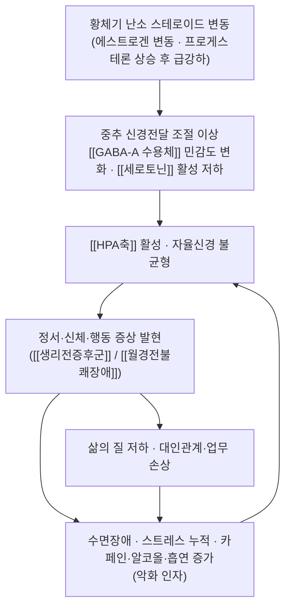

# 🩺 [[생리전증후군]] (Premenstrual Syndrome / 經前症候群, ICD-10 N94.3 / KCD-10 N94.3)

> **핵심 3줄 요약 (Key Summary)**:
> - 📍 병소 부위 & 해부·병태생리: 특정 해부학적 병소를 갖는 국소 질환이 아니라 **[[시상하부-뇌하수체-난소축]](HPA–HPO axis)** 과 중추신경전달계([[GABA-A 수용체]], [[세로토닌]]계)의 **황체기 [[프로게스테론]]·[[알로프레그나놀론]] 변동에 대한 이상 반응**으로 이해되는 주기성 전신 증후군이다. 표적 조직은 중추신경계·[[자궁내막]]·[[유방]]·위장관·신장(수분저류) 등 다기관이다.
> - 🚩 전형적 임상 양상 & 3대 징후: ① **정서 증상**(과민·분노·우울·불안·눈물), ② **신체 증상**([[유방창통]], 복부팽만, 부종·체중 증가, 두통, 근육통), ③ **행동·인지 증상**(식욕·식탐 변화, 불면, 집중력 저하). **황체기 후반에 나타나 월경 시작 후 수일 내 소실**되는 것이 진단의 핵심 축이다.
> - 🛠️ 핵심 감별 검사 & 한·양방 다각적 치료 전략: **[[증상일기]](전향적 2주기 기록, [[DRSP]])** 가 진단의 표준이며, [[갑상선기능검사]](TSH)·임신 검사로 기질 질환을 배제한다. 한방은 [[변증]](肝鬱氣滯·肝脾不和·心脾兩虛·腎虛 등)에 따라 [[소요산]]·[[가미소요산]]·[[당귀작약산]]·[[귀비탕]] 등과 [[침]]([[삼음교]]·[[태충]]·[[관원]]·[[신문]])·[[약침]]·복부/골반 [[추나]]를 병용하고, 양방은 SSRI·복합경구피임약·NSAIDs·칼슘 보충 등을 병행한다.
> - ⚠️ 응급 의뢰 레드플래그 & 악화 요인: **자살 사고·자해 충동·정신증적 증상**은 즉시 정신건강의학과 의뢰. 비정상 자궁출혈·무월경·급성 골반통·발열은 [[자궁내막증]]·[[골반염증질환]]·임신 관련 질환 감별이 우선. 임신 가능성 환자에서 [[합곡]]·[[삼음교]] 및 복부·요천부 강자극, 활혈거어(活血祛瘀) 한약은 금기.

---

## 📌 목차
1. [질환 개요 & 해부학적 병태생리](#1-질환-개요--해부학적-병태생리)
2. [병태생리 메커니즘 & 생체역학적 악순환 네트워크](#2-병태생리-메커니즘--생체역학적-악순환-네트워크)
3. [임상 증상 & 이학적 검사(Physical Exam) 알고리즘](#3-임상-증상--이학적-검사physical-exam-알고리즘)
4. [감별 진단 매트릭스 (Differential Diagnosis)](#4-감별-진단-매트릭스-differential-diagnosis)
5. [한의 통합 치료 프로토콜 (침·약침·추나·한약)](#5-한의-통합-치료-프로토콜-침약침추나한약)
6. [재활 운동 & 생활습관 티칭 가이드](#6-재활-운동--생활습관-티칭-가이드)
7. [💡 사용자 진료실 핵심 필기 & 임상 노하우 (Melt-In 잔여 심화 집약)](#7--사용자-진료실-핵심-필기--임상-노하우-melt-in-잔여-심화-집약)
8. [출처 및 학술 참고 문헌 (References)](#8-출처-및-학술-참고-문헌-references)

---

## 1. 질환 개요 & 해부학적 병태생리

* **질환 정의 및 분류**:
  * **[[생리전증후군]](PMS)** 은 가임기 여성에서 **월경 주기의 황체기(luteal phase) 후반에 반복적으로 출현하는 정서·행동·신체 증상 군**으로, 월경 개시 후 수일 이내에 소실되어 **주기 후반에만 증상이 존재하는 시간적 패턴(timing)** 을 진단의 필수 조건으로 삼는다. 개별 증상의 종류보다 **"증상이 붙었다 떨어지는 주기성"** 이 정의의 본질이다 (Hofmeister & Bodden, 2016; Dickerson & Mazyck, 2003).
  * **[[월경전불쾌장애]](PMDD)** 는 PMS의 중증 아형으로, DSM-5에서는 독립 진단 범주로 분류되어 **정서 증상(과민·분노·우울·불안·절망감)이 두드러지고 일상 기능(직업·학업·대인관계)을 현저히 손상**시키는 경우로 정의된다. 즉 **정도의 축(severity)** 과 **증상 영역의 축(정서 우세)** 이 PMS와 PMDD를 가르는 실질적 기준이다 (Hofmeister & Bodden, 2016; Takeda, 2023).
  * **코드 체계**: ICD-10 / KCD-10 모두 **N94.3 월경전긴장증후군(premenstrual tension syndrome)** 으로 분류한다. PMDD는 ICD-10/KCD-10에 PMS와 구분되는 단일 전용 코드가 마련되어 있지 않아 기관·청구 관행에 따라 N94.3 또는 기분장애 코드로 기재되며, **국내 PMDD 전용 상병 코드 부여 여부는 근거 미확인(청구 지침 확인 필요)**.
  * **호발 연령·역학**: 가임기 여성 전체에서 가장 흔한 부인과적 주기성 증상 군이며, 초경 이후부터 폐경 이전까지 폭넓게 발생하고 **30~40대에서 호소가 가장 많은 경향**을 보인다. 유병률은 **문헌별 진단 기준과 정의의 차이 때문에 20%대에서 최대 75%까지 매우 넓게 보고**되며, 이는 "일상적으로 경험하는 경증 월경전 불편감"과 "진단 기준을 충족하는 PMS"가 문헌마다 다르게 계수되기 때문이다. PMDD는 **약 3~8% 정도로 보고**된다 (Hofmeister & Bodden, 2016; Takeda, 2023). 진료실에서는 "가임기 여성의 상당수가 경험하되, **기능 손상을 동반한 치료 대상은 그보다 훨씬 적다**"는 감각으로 접근하는 것이 실제적이다.
  * **직업·생활 관련성**: 증상이 주기적으로 반복되므로 시험 기간, 발표·업무 마감, 육아 등 **고부하 시기와 황체기가 겹칠 때 호소 강도가 급격히 커지는 양상**을 보인다. 따라서 병력 청취 시 **증상의 강도뿐 아니라 "월경 주기 중 언제, 얼마 동안"** 을 반드시 달력에 붙여 확인해야 한다.

* **관련 해부학적·생리적 구조물**:
  * **중추 조절축(핵심 병소)**: [[시상하부]](GnRH 분비) → [[뇌하수체 전엽]](LH·FSH) → [[난소]]([[에스트로겐]]·[[프로게스테론]])로 이어지는 **[[시상하부-뇌하수체-난소축]]** 이 주기성을 만들어내는 상위 구조이며, 동시에 **[[HPA축]](시상하부-뇌하수체-부신축)** 과 **자율신경계**가 스트레스 반응과 증상 강도를 조절한다.
  * **중추신경전달계(증상 발현의 실질 표적)**: [[GABA-A 수용체]] (프로게스테론 대사물인 [[알로프레그나놀론]]의 작용 표적) 와 [[세로토닌]]계가 정서·수면·식욕 조절을 담당하며, 이 두 계통의 **황체기 변동에 대한 개인별 민감도 차이**가 PMS/PMDD 취약성의 중심 가설로 제시된다 (Haußmann & Goeckenjan, 2024).
  * **말초 표적 조직**:
    * **[[자궁내막]]**: 주기적 탈락·재생, 프로스타글란딘 생성과 월경통의 연관.
    * **[[유방]]**: 황체기 유방조직 팽창·통증([[유방창통]]) — 대개 양측성·미만성.
    * **위장관·신장**: 복부팽만, 변비·설사 교대, 수분저류·부종·체중 증가(레닌-안지오텐신-알도스테론계 및 프로스타글란딘 관련 가설).
    * **근골격계**: 두통·요통·근육통·관절통 등 비특이적 통증 — **본 질환에서 근골격계는 원발 병소가 아니라 증상 발현 부위**라는 점을 구분해야 한다.
  * **관련 신경**: 중추 조절에는 시상하부·변연계(편도체·해마)·전전두엽 네트워크가 관여하며, 말초 통증 인지에는 삼차신경(두통)·척수 후근신경절 경로가 관여한다. **특정 단일 말초신경 포착이 PMS의 원인이라는 근거는 없음(근거 미확인)**.

---

## 2. 병태생리 메커니즘 & 생체역학적 악순환 네트워크

### 1) 황체기 스테로이드 변동 & 중추 신경전달 기전 (핵심 가설)
* **기본 전제**: PMS/PMDD의 병태생리는 **아직 완전히 규명되지 않았으며**, 단일 원인보다 **다인성·다축성 모델**로 설명된다 (Takeda, 2023; Haußmann & Goeckenjan, 2024).
* **"호르몬 자체의 이상"보다 "변동에 대한 반응의 이상"**: 황체기 말기 프로게스테론·에스트로겐의 **급격한 하강(변동 폭)** 이 증상 출현과 시간적으로 일치하며, 정상 호르몬 수치를 보이는 환자에서도 증상이 나타나므로 **절대 농도보다 변동에 대한 중추 민감도**가 핵심으로 본다.
* **GABA-A 계 가설**: 프로게스테론의 신경활성 대사물인 **[[알로프레그나놀론]]** 은 정상적으로 GABA-A 수용체를 양성 조절하여 진정·항불안 작용을 나타낸다. PMS/PMDD에서는 황체기 후반 알로프레그나놀론 변동에 대한 수용체 민감도가 달라져 **불안·과민·불면**이 유발된다는 가설이 제시된다 (Haußmann & Goeckenjan, 2024). **개인별 민감도 차이를 사전에 측정할 수 있는 임상 검사는 없음(근거 미확인)**.
* **[[세로토닌]]계 가설**: 황체기 세로토닌 활성 저하가 **우울·식탐(특히 탄수화물 갈망)·과민**과 연관된다는 설명이며, 이것이 **SSRI가 황체기에만 간헐 투여되어도 효과를 보이는 임상 관찰**의 이론적 배경이 된다 (Hofmeister & Bodden, 2016).
* **기타 가설**: 프로스타글란딘(월경통·복부증상), 레닌-안지오텐신-알도스테론계(부종·체중 증가), 칼슘·마그네슘 등 미량 무기질 균형(칼슘 보충이 증상 완화에 도움이 된다는 보고가 있으며, **기전 수준의 확정은 근거 미확인**) 등이 복합적으로 거론된다.

### 2) 한의학적 병기 해석 (변증 축)
* **肝鬱氣滯(간울기체)**: 월경 전 기혈 순환이 정체되어 **유방창통·복부팽만·과민·한숨·울체감**이 나타나는 가장 흔한 축. 주기성·긴장성 증상의 기본 골격에 해당한다.
* **肝鬱化火(간울화화)**: 기체가 오래되어 열로 변해 **분노 폭발·두통·홍조·구고(口苦)·불면**이 두드러지는 양상.
* **肝脾不和 / 脾虛濕盛(비허습성)**: 간의 소설(疏泄) 실조가 비위(脾胃)에 파급되어 **복부팽만·설사·식욕 변화·부종·체중 증가**가 나타나는 양상.
* **心脾兩虛(심비양허)**: **불면·심계·건망·피로·눈물** 등 정서 안정성 저하가 중심이 되는 허증 축.
* **腎陰虛 / 腎陽虛(신음허/신양허)**: 요통·냉감·하복부 냉통·야간뇨 등 골반·요부 증상이 동반되는 축.
* **氣滯血瘀(기체혈어)**: 하복부 자통·혈괴 동반 월경통 등 통증 양상이 날카로운 축.
> 위 변증 체계는 **한의학 전통 이론(교과서적 변증)** 에 근거한 것으로, **PMS 특정 변증-치법 조합의 RCT 근거 수준은 본 노트에서 확인되지 않음(근거 미확인)**. 다만 변증에 따른 처방 선택은 임상적 의사결정 도구로서 실용적 가치가 크다.

### 3) 악순환 연쇄 (Cycle of Aggravation)
* 황체기 증상 발현 → **수면 단절·예민함 증가** → 카페인·당분·알코올 섭취 증가 및 활동량 감소 → **HPA축 활성·자율신경 교란 심화** → 다음 주기 증상 강도 증가. 따라서 치료의 절반은 **이 악순환의 고리(수면·카페인·알코올)를 끊는 생활 개입**이다 (Hofmeister & Bodden, 2016).

---

## 3. 임상 증상 & 이학적 검사(Physical Exam) 알고리즘

### 1) 주소증 및 증상군 (3대 축)
* **정서·인지 증상 (진단적 비중 최대)**: 과민·분노 폭발, 우울감·절망감, 불안·긴장, 눈물, 흥미 저하, **집중력 저하·머릿속이 멍한 느낌**. 특히 PMDD에서는 이 축이 **기능 손상의 주 원인**이다.
* **신체 증상**: **[[유방창통]]**(압통·팽만), 복부팽만·가스, 체중 증가(수분저류), 말초 부종(손·발), 두통·편두통, 근육통·관절통, 여드름 악화, 식욕 증가·음식 갈망(특히 단 음식·탄수화물).
* **행동·자율신경 증상**: 불면 또는 과다수면, 피로감, 성욕 변화, 사회적 회피, 폭식, 복부 불편·변비/설사 교대.
* **시간적 패턴 (필수 소견)**: **황체기(배란 후 ~ 월경 직전)에 시작 → 월경 시작 후 2~3일 내 소실 → 난포기에는 무증상 또는 최소 증상**. 이 "무증상 구간이 존재하는가"가 기분장애·만성피로와의 감별에서 가장 강력한 단서다.
  * ※ 소실 시점을 "수일"로 정확히 특정하지 않는 경우가 많아, **일기 기록으로 무증상 구간의 존재를 확인하는 것**이 실질적으로 더 신뢰도가 높다.

### 2) 진단적 평가 알고리즘 (핵심 검사)
* **[[증상일기]] / [[DRSP]](Daily Record of Severity of Problems)**: **최소 2회의 연속 월경 주기에 걸친 전향적(prospective) 기록**이 표준이다. 회고적 문진만으로는 과대·과소 보고가 흔하므로, **"지난달 어땠어요?"가 아니라 "이번 주기에 매일 체크해 오세요"** 로 바꾸는 순간 진단 정확도가 크게 올라간다 (Hofmeister & Bodden, 2016; Dickerson & Mazyck, 2003).
  * 실전 운영: 증상 3~5개를 환자 본인이 직접 선택하게 하고(주관적 중요도 반영), **0~10 NRS로 매일 아침 체크**, 월경 시작일 표시. 2주기 후 **황체기 점수 상승-월경 후 하강 패턴**을 눈으로 확인시켜 주면 진단 설명과 치료 순응도가 동시에 올라간다.
* **진단 기준 적용**: ACOG 진단 기준(황체기 증상 + 기능 손상 + 전향적 기록에서 확인) 또는 DSM-5 PMDD 기준(증상 항목 수 + 기능 손상 + 시간적 패턴)을 적용한다. **진단은 임상적·시간적 기준으로 이루어지며, 확진용 혈액 검사는 존재하지 않는다** (Hofmeister & Bodden, 2016).
* **기질 질환 배제를 위한 이학적 검사 (PMS 자체의 이학적 소견은 대개 정상)**:
  * **[[골반검진]]**: 자궁·부속기 압통, 종괴, 자궁경부 자극통 — [[자궁내막증]]·[[자궁근종]]·[[골반염증질환]] 감별.
  * **[[갑상선 촉진]] 및 [[갑상선기능검사]](TSH)**: 갑상선기능저하증·항진증은 월경 이상과 기분 증상을 모두 유발하므로 **반드시 배제**한다.
  * **[[유방 검진]]**: 국소성 종괴·단일 유방 압통·피부 변화가 있으면 유방 병변 평가 우선(주기성 양측 미만성 통증은 PMS와 부합).
  * **부종·체중 측정**: 주기별 체중 변화(수 kg 수준)를 기록하면 수분저류 축 평가에 도움 — **체중 증가폭의 진단적 컷오프는 근거 미확인**.
  * **[[임신검사]](hCG) 및 [[CBC]]**: 가임기 여성에서 무월경·비정상 출혈·심한 피로 동반 시 필수. 빈혈은 피로·과민 증상을 악화시킨다.
  * **[[자궁경부 세포검사]]·[[초음파]]**: 정기 검진 주기 도래 시 또는 이상 출혈 동반 시 시행.

---

## 4. 감별 진단 매트릭스 (Differential Diagnosis)

| 감별 질환 | 호발 병소 및 원인 | 주소증 차이점 | 특이적 이학적·검사 소견 |
| :--- | :--- | :--- | :--- |
| [[생리전증후군]] (본 질환) | 황체기 스테로이드 변동 + 중추 GABA/세로토닌 조절 이상 | 황체기 시작 → 월경 후 소실. 정서+신체 증상 혼재, **난포기 무증상 구간 존재** | 이학적 검사 대개 정상. **[[증상일기]] 2주기에서 황체기 상승-월경 후 하강 패턴 확인** |
| [[월경전불쾌장애]] (PMDD) | 동일 축(중증형) | PMS와 증상 종류는 유사하나 **정서 증상이 압도적이고 기능 손상이 현저**(직장·학업·대인관계 붕괴) | 이학적 검사 정상. **기능 손상 정도 + DSM-5 항목 수**로 구분 |
| [[원발성 월경통]] | 월경 시 자궁내막 프로스타글란딘 과다 | 통증이 **월경 시작 직후~1일차에 집중**, 황체기에는 없음 | 하복부 압통, NSAIDs 반응 양호 |
| [[자궁내막증]] / [[자궁선근증]] | 자궁내막 조직의 이소 착상·침윤 | 통증이 **월경 중·성교 시 심하고 점진 악화**, 황체기 국한 패턴은 아님 | 골반검진 압통·결절, 초음파·MRI 이상 |
| [[우울장애]] / [[불안장애]] | 지속적 신경전달 이상 | **주기와 무관하게 만성 지속**, 월경 후에도 증상 잔존 | 정신건강의학과 평가, PHQ-9/GAD-7 지속 상승 |
| [[갑상선기능저하증]] | 대사 저하 | 월경 불순·피로·냉감·체중 증가가 **비주기적** | **TSH 상승, T4 저하** |
| [[폐경이행기]] | 난소 기능 저하·호르몬 변동 | 증상의 **주기성이 소실**되고 열성 홍조·야간 발한 동반 | FSH 상승, 월경 주기 불규칙 |
| [[기분순환장애]](월경 관련) | 기분 삽화가 월경 주기와 동기화 | 증상은 유사하나 **삽화성 기분 변화가 주기당 1회 이상·주기 전반부에도 존재** | 기분 일기에서 주기 비동기 구간 확인 |

---

## 5. 한의 통합 치료 프로토콜 (침·약침·추나·한약)

* **치료 원칙**: ① 황체기 전(배란기 직후) **선제적 개입**으로 증상 강도 자체를 낮추고, ② 난포기(무증상기)에는 **체질·변증 교정과 생활 관리**에 집중하며, ③ 2주기 이상 기록으로 **반응을 객관적으로 추적**한다. 증상 강도가 PMDD 수준이거나 자살 사고가 있으면 **정신건강의학과 병행이 원칙**이다.

* **침구 치료 (Acupuncture)**:
  * **기본 방향**: 疏肝解鬱(소간해울)·調和氣血(조화기혈)·安神(안신). 황체기 전후 **주 1~2회, 최소 2~3주기 지속**을 권한다.
  * **주요 혈위**:
    * [[태충]](LR3) — 疏肝理氣, 과민·분노·두통 조절의 대표혈.
    * [[삼음교]](SP6) — 肝·脾·腎 三經 교회혈. 부인과 조절의 기본혈(임신 시 금기/주의).
    * [[관원]](CV4)·[[기해]](CV6) — 하복부 氣血 조절, 냉감·요통 동반 시.
    * [[혈해]](SP10) — 혈분 조절, 氣滯血瘀 양상.
    * [[족삼리]](ST36) — 기혈 보충, 피로·식욕 변동.
    * [[신문]](HT7)·[[내관]](PC6)·[[백회]](GV20)·[[인당]](EX-HN3) — 불면·불안·심계 등 정서 증상 축.
    * 배수혈 [[간수]](BL18)·[[비수]](BL20)·[[신수]](BL23)·[[차료]](BL32) — 변증에 따라 선택.
  * **전침(電鍼) 세팅**: 정서 증상 우세 시 **저주파(2~4 Hz) 위주로 15~20분**, 통증·긴장 우세 시 저주파-고주파 교대. **PMS에 대한 최적 주파수·자극량 프로토콜은 근거 미확인**이므로 환자 반응에 맞춘 임상적 조정이 필요하다.
  * **이침(耳鍼)**: 神門·內分泌·肝·腎 대응점 자극을 **황체기 불안·불면 관리의 보조**로 응용.

* **약침 치료 (Pharmacopuncture)**:
  * **응용 개념**: 하복부·요천부의 긴장 완화와 정서 축 안정을 목표로 [[관원]]·[[기해]]·[[삼음교]]·[[태충]]·[[간수]]·[[신수]] 주위에 소량 자극.
  * **선택 약침(전통적·임상적 응용)**: [[당귀약침]](補血活血), [[천궁약침]], [[향부자약침]](理氣解鬱), 加味逍遙散 기반 약침 등이 부인과 영역에서 응용되어 왔다.
  * ⚠️ **PMS/PMDD에 대한 약침의 유효성·용량·주입 심도를 확립한 근거는 본 노트에서 확인되지 않음(근거 미확인)**. 알레르기 병력, 피부 감염, 항응고제 복용 여부를 반드시 확인하고, **임신 가능성 환자에게는 복부·요천부 및 활혈거어 약침을 금기**한다.

* **추나 치료 (Chuna Manipulation)**:
  * **위치 설정**: PMS는 관절 아탈구성 질환이 아니므로 추나는 **원인 치료가 아닌 동반 근골격 증상(요통·골반 긴장·흉추 가동성 저하·복부 긴장) 완화를 위한 보조 수단**으로 한정해 접근한다.
  * **적용 가능 기법**: 복부 이완 수기(경복부 압통·긴장 완화), 흉추·요추 가동 추나, 천장관절·골반 정렬 교정, 筋膜 이완(JS) 수기로 전신 긴장도 하향.
  * ⚠️ **금기·주의**: 임신 가능성 또는 임신 확인 시 **복부·요천부 강압 수기 절대 금기**. 급성 골반통·발열·비정상 자궁출혈 동반 시 추나보다 **기질 질환 평가가 우선**. PMS에서 추나 단독의 증상 개선 근거는 **근거 미확인**.

* **한약 치료 (Herbal Medicine)** — 변증별 접근:

| 변증 | 대표 증상 양상 | 대표 처방(전통적 응용) | 치료법 |
| :--- | :--- | :--- | :--- |
| 肝鬱氣滯 | 유방창통, 복부팽만, 과민·울체감 | [[소요산]](逍遙散), [[시호소간산]](柴胡疏肝散) | 疏肝解鬱 |
| 肝鬱化火 | 분노 폭발, 두통, 홍조, 구고, 불면 | [[가미소요산]](加味逍遙散), [[단치소요산]](丹梔逍遙散) | 疏肝淸熱 |
| 肝脾不和·脾虛濕盛 | 복부팽만·설사, 부종·체중 증가 | [[당귀작약산]](當歸芍藥散), [[오령산]](五苓散) | 抑肝扶脾·健脾利濕 |
| 氣滯血瘀 | 하복부 자통, 혈괴 동반 월경통 | [[계지복령환]](桂枝茯苓丸), [[온경탕]](溫經湯) | 活血祛瘀·溫經 |
| 心脾兩虛 | 불면·심계·건망·눈물, 피로 | [[귀비탕]](歸脾湯), [[감맥대조탕]](甘麥大棗湯) | 補益心脾·安神 |
| 腎虛(陰虛/陽虛) | 요통, 냉감, 하복부 냉통, 야간뇨 | [[육미지황환]](六味地黃丸), [[우귀음]](右歸飮) | 補腎(滋陰/溫陽) |

  * **복용 타이밍 팁**: 변증 처방은 **황체기 1~2주 전부터 월경 개시까지 집중 투여**하고, 난포기에는 용량을 줄이거나 補益 위주로 전환하는 방식이 주기성 질환 관리에 부합한다. 단, 이 스케줄의 우월성은 **근거 미확인**이며 환자 반응 기반 조정이 필요하다.
  * ⚠️ **금기**: 임신 가능성·임신 중에는 活血祛瘀(활혈거거) 계열(계지복령환·온경탕 등) 및 천궁·홍화 등 활혈 약재를 **금기 또는 극도로 주의**한다. 항응고제·항혈소판제 복용 환자도 출혈 위험을 확인한다.

* **양방 치료 병용 (근거 기반 요약)**:
  * **SSRI**: PMS 및 PMDD에서 **1차 약물**로 정리되며, 황체기 간헐 투여 또는 지속 투여가 사용된다 (Hofmeister & Bodden, 2016; Dickerson & Mazyck, 2003).
  * **복합경구피임약(COCs)**: 배란 및 주기적 호르몬 변동을 억제하는 접근으로, 특히 신체 증상(월경통·유방통) 동반 시 선택된다 (Hofmeister & Bodden, 2016).
  * **NSAIDs**: 월경통·두통·근육통 등 통증 축에 사용 (Dickerson & Mazyck, 2003).
  * **칼슘 보충·비타민 B6 등**: 일부 연구에서 증상 완화가 보고되었으나 **효과 크기와 대상 선정 기준은 문헌별 이견**이 있어 한의 치료와 병용 시 환자에게 "보조적 접근"임을 설명한다.
  * **CBT·이완 요법**: 정서 축에 대한 비약물적 근거가 축적된 영역으로, 한의 치료와 병행 시 상승 효과를 기대할 수 있다 (Hofmeister & Bodden, 2016).

---

## 6. 재활 운동 & 생활습관 티칭 가이드

* **이완 및 스트레칭 (Stretching)**:
  * 황체기를 포함해 **매일 10~15분**: ① 골반·요부 이완(누워서 무릎 좌우 흔들기, 고양이-소 자세), ② 흉추 회전 스트레칭, ③ 복식호흡(4초 들이쉬고 6초 내쉬기) — 자율신경 안정을 목표로 한다.
  * 유방창통 시 **가슴 앞쪽(대흉근·소흉근) 벽 스트레칭**과 편안한 지지 브래지어 착용이 도움이 된다.
* **강화 및 안정화 운동 (Strengthening)**:
  * 유산소 운동(빠르게 걷기·자전거·수영)을 **주 3~5회, 회당 20~30분** 규칙적으로 시행하는 것이 PMS 증상 완화에 권장된다 (Hofmeister & Bodden, 2016).
  * 복부·골반 심부 안정화(플랭크 변형, 힙 브리지, 케겔)로 요통·골반 긴장을 줄인다. 단, **증상의 원인이 골반저 기능 이상이라는 근거는 없음(근거 미확인)**.
* **신경 활주 운동 (Neurodynamics)**: 
  * PMS는 신경 포착 질환이 아니므로 **특정 신경 활주 프로토콜은 적용 대상이 아니다.** 다만 두통·어깨 긴장 동반 시 경추·흉곽출구 주변 이완 운동을 보조적으로 활용한다(짧은 목 근육 스트레칭, 어깨 윤곽 돌리기).
* **일상생활 자세 티칭 (Ergonomics & Lifestyle)**:
  * **수면 위생**: 취침·기상 시간 고정, 황체기에는 **카페인을 오후 이후 전면 제한**하고 알코올을 줄인다(수면 구조와 불안 모두에 영향).
  * **염분 조절**: 가공식품·국물·짠 간식 줄이기 → 복부팽만·부종 감소.
  * **규칙적 소량 다식**: 혈당 변동을 줄여 식탐·과민 완화. 정제당·야식 최소화.
  * **기록 습관**: [[증상일기]]를 생활화하여 **자기 증상의 예측 가능성**을 높이는 것 자체가 치료 개입이다(불확실성이 불안을 키우므로).
  * **금연**: 흡연은 증상 악화와 연관된다고 정리된다 (Dickerson & Mazyck, 2003).
  * **계획 조정**: 시험·발표·이사 등 고부하 일정을 **난포기에 배치**하는 주기 기반 일정 관리(cycle syncing)를 권장하면 체감 개선이 크다.

---

## 7. 💡 사용자 진료실 핵심 필기 & 임상 노하우 (Melt-In 잔여 심화 집약)

> [!IMPORTANT]
> 아래는 상부 1~6번 섹션에 이미 융합한 기본 이론·진단·치료 프로토콜을 **중복 기재하지 않고**, 진료실에서 즉시 쓰이는 실전 문진·손기술·환자 설명 자산만 별도 집약한 것이다.

* **상부 섹션에 미처 다 담지 못한 고유 임상 관점**:
  * **"증상의 종류"가 아니라 "증상의 달력"을 먼저 본다**: PMS 환자의 상당수는 이미 자신의 증상 이름을 알고 내원한다. 진료의 승부는 **"언제 시작해서 언제 꺼지는가"를 시각화해 주는 것**에서 갈린다. 2주기 기록을 뜯어보며 **난포기의 빈칸(무증상 구간)** 을 손가락으로 짚어주면, 환자는 "내 몸이 이상한 게 아니라 주기가 있는 거구나"라는 **낙인 완화 효과**를 즉시 경험한다.
  * **주기성 판정의 함정**: 월경 직전 증상만 묻고 "월경 시작 후에도 3일 이상 지속됩니까?"를 확인하지 않으면 **월경 전 악화형 우울삽화**를 PMS로 오분류한다. 반대로 "월경 중에도 계속 아프다"는 호소는 **월경통·자궁내막증 축으로 무게중심이 이동**한다는 신호다.
  * **한방 변증과 양방 축의 대응 직관**: ① 유방창통·과민·울체 = 肝鬱 축(SSRI 반응군과 겹치는 경우가 많음), ② 부종·팽만·설사 = 脾濕 축(COC·이뇨·식이 조절 반응군), ③ 불면·심계·눈물 = 心脾兩虛 축(CBT·이완 반응군), ④ 하복부 자통·혈괴 = 血瘀 축(NSAIDs·온경 반응군). **축을 먼저 정하고 치료 도구를 배분**하면 과잉 중재를 줄일 수 있다.
  * **추적 지표는 환자가 정한다**: 치료 전 환자에게 "이번 주기에 이 3개만 0~10으로 적어보세요"라고 **환자 본인이 항목을 고르게** 한다. 의사가 정한 지표는 환자가 잘 체크하지 않는다.

* **진료실 실전 감별 & 치료 노하우**:
  * **1. 실전 문진 체크리스트 (내원 5분 안에 확인)**
    1. "증상이 **월경 시작 며칠 전**에 시작해서 **월경 시작 후 며칠**에 꺼집니까?" → 무증상 구간 유무 확정.
    2. "**난포기(월경 끝난 직후~배란 전)** 에는 정말 괜찮습니까?" → 기분장애·만성피로 감별의 핵심.
    3. "**직장·학업·대인관계**에서 실제로 망가진 일이 있습니까?" → PMDD 선별 및 정신건강의학과 의뢰 기준.
    4. "**자살·자해 생각**, 극단적 선택을 고민한 적이 있습니까?" → 있으면 그 자리에서 의뢰. 예외 없음.
    5. "임신 가능성, 마지막 월경일, 피임 방법은?" → 모든 치료(침·약침·한약·추나)의 금기 판단 전제.
    6. "카페인 하루 몇 잔, 술·담배, 평균 수면시간은?" → 악화 인자 목록화.
    7. "갑상선·빈혈·유방·부인과 진단을 받은 적이 있습니까?" → 기질 질환 배제.
  * **2. 치료 순서 및 손맛 노하우**
    * **자침 순서**: 환자를 먼저 눕히고 **복식호흡 3회** 시킨 뒤 자침. 순서는 ① 원위혈([[태충]]·[[삼음교]]·[[족삼리]]) → ② 국소·복부혈([[관원]]·[[기해]]) → ③ 안신혈([[신문]]·[[인당]]). **안신혈을 마지막에 두면 환자가 긴장을 풀고 유침을 견디는 시간이 늘어난다.**
    * **유침 중 개입**: 유침 15~20분 동안 조명을 낮추고 **말을 걸지 않는다.** PMS 환자는 유침 시간을 "쉬는 시간"으로 인식할 때 만족도가 높다.
    * **약침 각도**: 복부 혈위는 **피하 0.3~0.5 cm 천자 후 소량(0.1~0.2 mL)**, 요배부 배수혈은 근육층까지. **복직근 초음파 유도는 본 질환에서 표준이 아님(근거 미확인)**.
    * **추나 체위**: 복부 이완 수기는 **무릎 세운 앙와위**에서 호흡에 맞춰 시행. 환자가 배에 힘을 주면 즉시 중단하고 호흡을 다시 유도한다. 천장관절 교정은 **측와위**가 편안하다.
    * **반응 평가 타이밍**: 첫 1주기에는 "좋아졌다/나빠졌다"를 묻지 말고 **기록지 숫자 변화**만 본다. 체감은 후광효과가 크기 때문이다.
  * **3. 환자 티칭 스크립트 (그대로 읽어도 되는 문장)**
    * 도입: "이건 몸이 약해서 생기는 게 아니라, **배란 후 호르몬이 떨어지는 시기에 뇌가 예민하게 반응하는 주기성 증상**입니다. 그래서 증상이 붙었다 떨어지는 게 정상적인 패턴이고, 좋아지는지 나빠지는지는 **달력으로만 판단**합니다."
    * 기록: "다음 두 번의 생리 동안, 본인이 고른 증상 3개만 매일 0~10점으로 적어 오세요. 제가 보는 건 점수의 높낮이가 아니라 **꺼지는 시점**입니다."
    * 생활: "① 오후엔 커피를 끊고, ② 짠 국물과 가공식품을 줄이고, ③ 주 3회 30분 걷기, ④ 잠드는 시간을 고정하세요. 이 네 가지만 해도 다음 주기 체감이 달라집니다."
    * 한약 복용: "이 약은 생리 전 1~2주에 집중해서 먹습니다. **임신 가능성이 있으면 복용을 멈추고 바로 알려주세요.**"
    * 재발·악화 대비: "자해나 극단적 생각이 들면 다음 예약까지 기다리지 말고 **바로 연락하세요.** 그건 기다리는 증상이 아닙니다."
    * 예후 설명: "주기마다 정도는 달라집니다. 목표는 증상이 0이 되는 게 아니라 **생활이 무너지지 않는 수준까지 낮추는 것**입니다."

---

## 8. 출처 및 학술 참고 문헌 (References)

1. **Hofmeister S, Bodden S (2016)**. *Premenstrual Syndrome and Premenstrual Dysphoric Disorder*. **Am Fam Physician**. PMID: 27479626.
   - **[연구 요약]**: PMS/PMDD의 정의·역학·진단·치료를 정리한 일차진료 지향 종설. 정의상 **황체기에 국한되어 월경 후 소실되는 주기성**이 진단의 축이며, PMS는 가임기 여성에서 흔하고(문헌 정의에 따라 최대 75% 수준까지 보고) PMDD는 약 3~8%로 정리된다. 진단은 **전향적 증상 기록**에 근거하며, 치료는 생활습관·유산소 운동·SSRI·복합경구피임약·NSAIDs·칼슘 등을 포함한다.
2. **Dickerson LM, Mazyck PJ (2003)**. *Premenstrual Syndrome*. **Am Fam Physician**. PMID: 12725453.
   - **[연구 요약]**: PMS의 진단 접근과 치료 옵션을 정리한 종설. **증상 일기를 통한 황체기 패턴 확인**의 필요성, SSRI·NSAIDs·경구피임약·비타민 B6·칼슘 등의 활용, 생활습관(흡연·카페인·염분 조절, 규칙적 운동)의 중요성을 제시한다.
3. **Tucker JS, Whalen RE (1991)**. *Premenstrual syndrome*. **Int J Psychiatry Med**. PMID: 1774124.
   - **[연구 요약]**: PMS의 정신의학적 측면과 진단·평가 논의를 다룬 초기 종설. 당시의 병태생리 가설과 평가 도구 논의를 반영하며, **현재의 진단 기준·치료 지침과는 시대적 차이**가 있으므로 역사적·개념적 참고로 인용한다.
4. **Takeda T (2023)**. *Premenstrual disorders: Premenstrual syndrome and premenstrual dysphoric disorder*. **J Obstet Gynaecol Res**. PMID: 36317488.
   - **[연구 요약]**: PMS와 PMDD를 아우르는 최신 종설. **병태생리가 단일 원인으로 규명되지 않았음**을 명시하고, 난소 스테로이드 변동에 대한 중추 신경전달(GABA계·세로토닌계) 반응, 진단적 평가(전향적 기록), 치료 옵션(SSRI, 호르몬 요법, 비약물적 접근)을 정리한다.
5. **Haußmann J, Goeckenjan M (2024)**. *[Premenstrual syndrome and premenstrual dysphoric disorder—Overview on pathophysiology, diagnostics and treatment]*. **Nervenarzt**. PMID: 38393358.
   - **[연구 요약]**: 병태생리·진단·치료를 개관한 최신 독일어 종설. **알로프레그나놀론–GABA-A 수용체 민감도 변화 가설**과 세로토닌계 조절 이상 등 중추 기전을 중심으로 정리하며, 진단에서 시간적 패턴 확인과 전향적 기록의 중요성, SSRI 및 호르몬 치료 전략을 제시한다.
6. *(중복)* Takeda T (2023). *Premenstrual disorders: Premenstrual syndrome and premenstrual dysphoric disorder*. **J Obstet Gynaecol Res**. PMID: 36317488. — 참고문헌 목록 4번과 동일 문헌.

> **근거 표기 원칙 안내**: 본 노트에서 **한약 처방·약침·추나·이침의 PMS/PMDD 특이적 유효성**은 위 6편의 서양의학 종설에서 다루지 않은 영역으로, 각 항목에 **"근거 미확인 / 전통적 응용"** 으로 표기하였다. 반면 **역학·진단 기준·시간적 패턴·SSRI/COC/NSAIDs/칼슘·운동** 관련 서술은 위 논문들에서 확인된 범위 내에서 기술하였다.

<!-- 보관 태그(1회용·링크오류, 필요시 복원): 생리전증후군 -->
