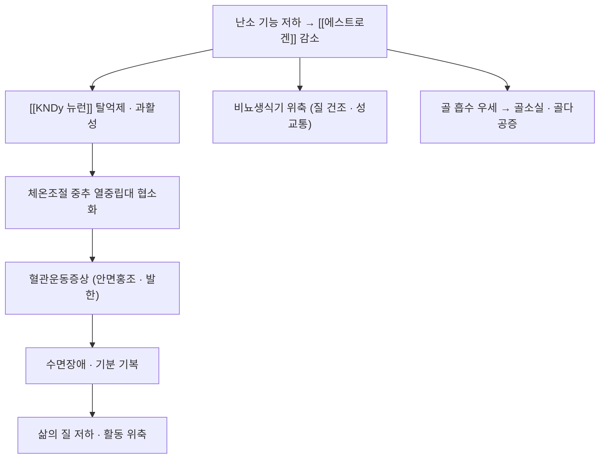

# 🩺 폐경전후증후군 (Perimenopausal Syndrome, 更年期)

> **핵심 3줄 요약 (Key Summary)**:
> - 📍 병소 부위 & 해부·병태생리: 난소 기능 저하로 [[에스트로겐]]이 줄면서 시상하부 [[KNDy 뉴런]]이 과활성해진다. 체온조절 중추의 열중립대가 좁아져 혈관운동증상(홍조·발한)이 나타나고, 골소실·생식기 위축이 동반된다.
> - 🚩 전형적 임상 양상: 안면홍조·야간 발한(혈관운동증상), 수면장애, 기분 기복, 질 건조·성교통, 골밀도 감소.
> - 🛠️ 핵심 검사 & 치료 전략: 진단은 임상(폐경 이행기 + 전형 증상)이며, 호르몬 요법(MHT)이 표준이나 금기·선호에 따라 [[페졸리네탄트]] 같은 비호르몬 대안을 쓴다. 한의는 補陰潛陽·調和營衛 축.
> - ⚠️ 응급 의뢰 레드플래그: 폐경 후 출혈, 체중 감소, 국소화된 야간 발한은 자궁내막·혈액 종양을 먼저 감별한다.

---

## 📌 목차
1. [질환 개요 & 병태생리](#1-질환-개요--병태생리)
2. [병태생리 메커니즘 & 악순환 네트워크](#2-병태생리-메커니즘--악순환-네트워크)
3. [임상 증상 & 평가 알고리즘](#3-임상-증상--평가-알고리즘)
4. [감별 진단 매트릭스 (Differential Diagnosis)](#4-감별-진단-매트릭스-differential-diagnosis)
5. [한의 통합 치료 프로토콜 (침·약침·추나·한약)](#5-한의-통합-치료-프로토콜-침약침추나한약)
6. [양방 치료 & 병용·의뢰 기준 (Conventional Treatment & Referral)](#6-양방-치료--병용의뢰-기준-conventional-treatment--referral)
7. [생활습관 & 자가관리 티칭 가이드](#7-생활습관--자가관리-티칭-가이드)
8. [💡 진료실 핵심 필기 & 임상 노하우](#8--진료실-핵심-필기--임상-노하우)
9. [출처 및 학술 참고 문헌 (References)](#9-출처-및-학술-참고-문헌-references)

---

## 1. 질환 개요 & 병태생리

![[폐경_01_혈관운동증상_에스트라디올용량.png|450]]
> [그림 1: 폐경 여성의 주당 중등도~중증 홍조 횟수 변화 — 위약 대비 에스트라디올 경구 용량별 감소(용량 의존) (Wikimedia Commons, CC BY-SA 4.0)]

![[폐경_02_골다공증_도해.jpg|400]]
> [그림 2: 폐경 후 골밀도 감소(골다공증) 진행 도해 — 척추 후만 증가와 고관절·대퇴골두 변화 (Smart-Servier Medical Art, Wikimedia Commons, CC BY-SA 3.0)]

* **질환 정의 및 분류**:
  * 폐경은 난소 기능 소실로 **12개월 연속 무월경**이 지속된 상태다. 폐경 이행기(perimenopause)와 폐경 후(postmenopause)를 포함해 **폐경전후증후군**으로 부른다.
  * 발생은 대개 45~55세이며, 증상은 폐경 전후 수년간 지속된다.
  * **증상 축**: ① 혈관운동증상(홍조·발한) ② 수면·기분 증상 ③ 비뇨생식기 위축 증상 ④ 장기적 골소실·심혈관 위험 변화.
* **관련 장기 및 조절계**:
  * **중추**: [[시상하부]] [[KNDy 뉴런]]·[[시상하부-뇌하수체-난소축]] — [[GnRH]]·[[LH]]·[[FSH]] 상승.
  * **난소·스테로이드**: [[에스트로겐]]·[[에스트라디올]]·[[프로게스테론]] 감소.
  * **표적 장기**: 뼈(골밀도), 비뇨생식기 점막, 피부·혈관.

---

## 2. 병태생리 메커니즘 & 악순환 네트워크

### 1) 중추·체온조절 기전
* 폐경으로 스테로이드 되먹임이 줄면 [[KNDy 뉴런]] 억제가 풀려 과활성해지고, GnRH 맥동 증가(LH 상승)와 함께 체온조절 중추의 열중립대가 좁아진다 → 미세 체온 변동에도 말초 혈관 확장(홍조)·발한이 유발된다.
* 이 경로가 뉴로키닌 3 수용체(NK3R) 길항제의 약리 표적이다 → [[페졸리네탄트]]

### 2) 장기 결과
* [[에스트로겐]] 결핍은 파골세포 작용 억제 소실로 **골소실(골다공증·골절 위험)** 을 촉진하고, 질·요도 점막 위축과 심혈관 위험 변화를 동반한다.

---

## 3. 임상 증상 & 평가 알고리즘

### 1) 주소증 및 핵심 증상
* **혈관운동증상**: 안면홍조·발한, 야간 발한 — 폐경 전후 수년 지속.
* **수면·기분**: 입면·유지 불면, 기분 기복, 불안.
* **비뇨생식기**: 질 건조, 성교통, 반복 요로감염.
* **장기**: 골밀도 감소, 심혈관 위험 인자 변화.

### 2) 객관적 소견 및 평가
* **진단**: 대개 임상 진단. FSH 상승이 보조적이다.
* **중증도 기록**: 홍조·발한 일지(회수·중증도)로 자가 기록하게 한다.
* **추적**: 골밀도(DXA), 대사 지표.

### 3) 중증도 판정
* VMS 하루 평균 횟수와 중증도가 치료 선택의 기준이 된다(중등도~중증 = 하루 평균 ≥7회 수준이 임상시험 기준).

> 🖼️ 이미지 미확보 — 한의 술기 실사·골밀도 영상은 이번 회차에 확보하지 못했다. VMS 그래프·골다공증 도해 2장만 수록했다.

---

## 4. 감별 진단 매트릭스 (Differential Diagnosis)

| 감별 질환 | 원인 | 주소증 차이점 | 특이 소견 |
| :--- | :--- | :--- | :--- |
| 폐경전후증후군 (본 질환) | 난소 기능 저하 | 홍조·발한·수면장애 | 폐경 이행기, FSH 상승 |
| 갑상샘 기능 항진 | 갑상샘 | 홍조·발한·체중 감소 | TSH 억제·FT4 상승 |
| [[결핵]] | 결핵균 | 야간 발한·미열 | 발열·영상 소견 |
| 림프종 | 혈액 종양 | B 증상(발열·발한·체중감소) | 림프절종대·혈액 검사 |
| 자궁내막 병변 | 자궁내막 | 폐경 후 출혈 | 자궁내막 검사 |

> 🚩 **레드플래그**: 폐경 후 출혈, 국소화된 야간 발한, 설명되지 않는 체중 감소 → 종양 감별 우선.

---

## 5. 한의 통합 치료 프로토콜 (침·약침·추나·한약)

* **변증 분류**: 陰虛火旺 / 肝腎陰虛 / 心腎不交 / 脾腎陽虛.
* **한약 치료**: 補陰潛陽·調和營衛 축 — 當歸六黃湯·二仙湯·加減逍遙散類를 변증에 따라 운용한다.
* **침구 치료**: 이침(신문)·체침(삼음교·태계·신문·조해 등)을 조합한다. 4주간 반응을 본 뒤 약물 병용 여부를 결정하는 순차 접근이 안전하다.
* **뜸·부항**: 脾腎陽虛 변증에서 온구를 보조로 고려한다.

---

## 6. 양방 치료 & 병용·의뢰 기준 (Conventional Treatment & Referral)

* **약물 치료 (Medication)**:
  * **호르몬 요법(MHT)** — VMS의 표준. 유방암·혈전 위험, 금기, 개인 선호를 고려한다.
  * **비호르몬 NK3R 길항제([[페졸리네탄트]])** — 호르몬 요법을 꺼리거나 금기인 환자의 대안. **첫 3개월 매월 간기능 추적**이 필수다.
  * **SSRI·SNRI(파록세틴 등)** — VMS 보조.
* **한의 병용 판단 (Combination Therapy)**: 한약·건강기능식품을 병용 중인 환자가 [[페졸리네탄트]]를 시작하면 간수치 감시가 더 중요해진다. 여러 제품을 겹쳐 쓰는 시기에 시작하지 않도록 순차 조정한다.
* **의뢰 기준 (Referral Criteria)**: 폐경 후 출혈·종양 의심 소견, 호르몬 요법 금기·복잡 사례는 산부인과 의뢰.

---

## 7. 생활습관 & 자가관리 티칭 가이드

* **체온 관리**: 트리거(카페인·알코올·매운 음식·더운 환경) 회피, 층별 옷차림.
* **운동**: 유산소+저항운동 — 골소실·체중·기분에 도움.
* **식이**: [[칼슘]]·[[비타민 D]] 충분 섭취, 골 건강 관리.
* **수면 위생**: 규칙적 기상·침실 환경 조정.
* **자가 기록**: 홍조·발한 일지로 치료 반응 판정.

---

## 8. 💡 진료실 핵심 필기 & 임상 노하우

* **상담 포인트**: 비호르몬 신약이라는 선택지를 알려주되, 첫 3개월 매월 간기능 추적이라는 부담과 비용을 함께 설명한다.
* **감별 경고**: "갱년기라서 그렇다"로 넘기지 말 것 — 폐경 후 출혈·체중 감소·국소 야간 발한은 자궁내막·혈액 종양을 먼저 감별한다.
* **문헌 인용 주의**: 일부 VMS 계열 메타분석에 표현 우려(expression of concern)가 붙은 사례가 있으니, 임상 결론은 **약물별 개별 3상 시험**을 근거로 삼는다.
* **환자 티칭 스크립트**: "홍조·식은땀에 쓰는 비호르몬 약이 있습니다. 하루 한 알로 횟수와 강도를 줄이는 것이 확인되었지만, 드물게 간 수치가 오를 수 있어 정기 피검사가 필요합니다. 눈이나 피부가 노래지거나 소변이 진해지면 즉시 알려주세요."

---

## 9. 출처 및 학술 참고 문헌 (References)

1. **Yoon JA 등 (2023)**. *Efficacy and Safety of Fezolinetant in Moderate to Severe Vasomotor Symptoms Associated With Menopause: A Phase 3 RCT (SKYLIGHT 2)*. **J Clin Endocrinol Metab**, 108(8):1981-1997. [PMID 36734148](https://pubmed.ncbi.nlm.nih.gov/36734148/) · [PMC10348473](https://pmc.ncbi.nlm.nih.gov/articles/PMC10348473/)
   - **[연구 요약]** 페졸리네탄트 30·45 mg가 위약 대비 VMS 빈도·중증도를 유의하게 감소, 1주차부터 52주까지 유지.
2. **Neurokinin receptor antagonists for vasomotor symptoms: from KNDy neurons to clinical translation (2026)**. **Nat Rev Endocrinol**. [PMID 41981275](https://pubmed.ncbi.nlm.nih.gov/41981275/)
   - **[연구 요약]** KNDy 뉴런·NK3 수용체 축에서 VMS 치료로 이어지는 기전 정리.
3. **Neurokinin 3 Receptor Antagonists for Menopause Symptom Management (2026)**. **Obstet Gynecol Clin North Am**. [PMID 42508870](https://pubmed.ncbi.nlm.nih.gov/42508870/)
   - **[연구 요약]** 폐경 증상 관리에서 NK3 수용체 길항제의 위치 정리.
4. **MSD 매뉴얼 전문가용 — 폐경** — [링크](https://www.msdmanuals.com/professional)
   - **[연구 요약]** 폐경 이행기·폐경 후 증상과 관리 개요.

## 관련 노트
- [[KNDy 뉴런]] · [[페졸리네탄트]] · [[에스트로겐]] · [[에스트라디올]] · [[프로게스테론]]
- [[시상하부-뇌하수체-난소축]] · [[골다공증]] · [[골밀도]] · [[조기 폐경]]
- [[2026-10-04_부인과소아과_심층리뷰]] 3번

## 📎 통합 이관 — 부인과/월경·내분비/갱년기 증후군

> 2026-10-08 중복 통합으로 이 노트에 흡수. 원본은 `_중복통합_백업_20261008/`에 보존.

# 🩺 갱년기 증후군

> **핵심 3줄 요약 (Key Summary)**:
> - 📍 병소 부위 & 해부·병태생리: (작성 필요)
> - 🚩 전형적 임상 양상: (작성 필요)
> - 🛠️ 핵심 검사 & 치료 전략: (작성 필요)
> - ⚠️ 응급 의뢰 레드플래그: (작성 필요)

> 📌 **골격(스텁) 노트입니다.** MSD 매뉴얼 주제에서 추출했고, 내용은 후속 배치에서 채웁니다.

---

## 📌 목차
1. [질환 개요 & 해부학적 병태생리](#1--질환-개요---해부학적-병태생리)
2. [병태생리 메커니즘 & 생체역학적 악순환 네트워크](#2--병태생리-메커니즘---생체역학적-악순환-네트워크)
3. [임상 증상 & 이학적 검사(Physical Exam) 알고리즘](#3--임상-증상---이학적-검사-physical-exam--알고리즘)
4. [감별 진단 매트릭스 (Differential Diagnosis)](#4--감별-진단-매트릭스--differential-diagnosis-)
5. [한의 통합 치료 프로토콜 (침·약침·추나·한약)](#5--한의-통합-치료-프로토콜--침-약침-추나-한약-)
6. [양방 치료 & 병용·의뢰 기준 (Conventional Treatment & Referral)](#6-양방-치료--병용의뢰-기준-conventional-treatment--referral)
7. [재활 운동 & 생활습관 티칭 가이드](#6--재활-운동---생활습관-티칭-가이드)
8. [💡 사용자 진료실 핵심 필기 & 임상 노하우 (Melt-In 잔여 심화 집약)](#7----사용자-진료실-핵심-필기---임상-노하우--melt-in-잔여-심화-집약-)
9. [출처 및 학술 참고 문헌 (References)](#8--출처-및-학술-참고-문헌--references-)

---

## 1. 질환 개요 & 해부학적 병태생리

(작성 필요)

---

## 2. 병태생리 메커니즘 & 생체역학적 악순환 네트워크

(작성 필요)

---

## 3. 임상 증상 & 이학적 검사(Physical Exam) 알고리즘

(작성 필요)

---

## 4. 감별 진단 매트릭스 (Differential Diagnosis)

(작성 필요)

---

## 5. 한의 통합 치료 프로토콜 (침·약침·추나·한약)

(작성 필요)

---

## 6. 양방 치료 & 병용·의뢰 기준 (Conventional Treatment & Referral)

> 🎯 **이 섹션의 목적**: 환자가 **양방약을 이미 복용 중인 경우가 많다.** 한의원 1차 진료에서 양방 치료를 이해하고, 병용 가능·주의·금기를 판단하며, 언제 의뢰할지 결정한다.

* **약물 치료 (Medication)**:
  * 계열별 약물·용량·기간 — 국내 처방 관행 반영.
  * 작용 기전과 한의 치료와의 상호작용.
* **비약물 시술 (Procedures)**:
  * 주사·차단술·물리치료·보조기 등.
* **수술·시술 적응증 (Surgical Indication)**:
  * 언제 수술로 가는가 — 절대·상대 적응증, 수술 후 경과.
* **한의 병용 판단 (Combination Therapy)**:
  * 병용 가능 / 주의 / 금기. 복용 중 환자의 감량 타이밍·반동 현상.
* **양방·전문과 의뢰 기준 (Referral Criteria)**:
  * 응급 의뢰 트리거와 전문과 의뢰 기준(정형외과·신경외과·내과 등).

	(작성 필요)

---

## 7. 재활 운동 & 생활습관 티칭 가이드

(작성 필요)

---

## 8. 💡 사용자 진료실 핵심 필기 & 임상 노하우 (Melt-In 잔여 심화 집약)

(작성 필요)

---

## 9. 출처 및 학술 참고 문헌 (References)

(작성 필요)

---

## 관련 노트

-
