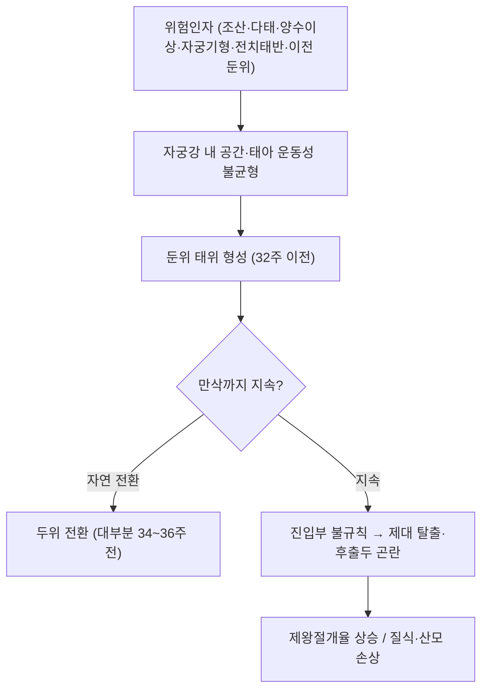

# 🩺 둔위 (Breech presentation, 臀位, ICD-10 O32.1)

> **핵심 3줄 요약 (Key Summary)**:
> - 📍 병소 부위 & 해부·병태생리: 만삭에서 태아의 둔부 또는 하지가 골반 입구(자궁 하단)에 위치한 태위(태아, 자궁경부 내구와의 관계) — 두위에 비해 진입부 단면이 불규칙해 **제대 탈출·후출두 곤란·질식** 위험이 커진다
> - 🚩 전형적 임상 양상 & 핵심 소견: Leopold 촉진에서 자궁저부에 단단하고 둥근 **머리**가, 하복부에 불규칙한 둔부가 만져지고, 초음파로 확진한다. 32주 이전은 자연 두위 전환이 흔해 **34~36주 이후에야 임상적 의미**가 확정된다
> - 🛠️ 핵심 감별 & 한·양방 치료 전략: 뜸(지음 BL67) 보조 → [[체외회전술]](ECV, 성공률 약 50%) → 분만 방식은 산과가 결정. 뜸은 **비두위 잔존 RR 0.87(중등도 확실성)** 이나 **제왕절개율 개선은 없었다**
> - ⚠️ 응급 의뢰 레드플래그: 질출혈·규칙적 자궁수축·태동 감소·양막 파수, 그리고 **제대 탈출 의심(질 내에서 끈이 만져지거나 태아 서맥)** 은 즉시 응급 산과 이송 대상이다.

---

## 📌 목차
1. [질환 개요 & 해부학적 병태생리](#1-질환-개요--해부학적-병태생리)
2. [병태생리 메커니즘 & 위험 악순환 네트워크](#2-병태생리-메커니즘--위험-악순환-네트워크)
3. [임상 증상 & 진단 알고리즘](#3-임상-증상--진단-알고리즘)
4. [감별 진단 매트릭스 (Differential Diagnosis)](#4-감별-진단-매트릭스-differential-diagnosis)
5. [한의 통합 치료 프로토콜 (뜸·침·한약)](#5-한의-통합-치료-프로토콜-뜸침한약)
6. [양방 치료 & 병용·의뢰 기준 (Conventional Treatment & Referral)](#6-양방-치료--병용의뢰-기준-conventional-treatment--referral)
7. [식이·생활습관 & 자가관리 티칭 가이드](#7-식이생활습관--자가관리-티칭-가이드)
8. [💡 진료실 핵심 필기 & 임상 노하우](#8--진료실-핵심-필기--임상-노하우)
9. [출처 및 학술 참고 문헌 (References)](#9-출처-및-학술-참고-문헌-references)

---

## 1. 질환 개요 & 해부학적 병태생리

![[둔위_01_정상두위_대조도해.png|450]]
> [그림 1: 정상 두위(vertex presentation, 후두 전방) 도해 — 둔위와 대조되는 기준 태위. William Smellie 산과학 도해(1792, 퍼블릭 도메인) — 출처: Wikimedia Commons]

![[둔위_02_완전둔위.png|350]]
> [그림 2: 완전둔위(frank breech) — 둔부가 선진하고 하지가 몸통 쪽으로 신전된 형태. 선화 도해(CC BY-SA 4.0, Bonnie Urquhart Gruenberg) — 출처: Wikimedia Commons]

![[둔위_03_족위.png|350]]
> [그림 3: 족위(footling breech) — 하지(발)가 먼저 진입하는 형태로 제대 탈출 위험이 가장 높다. 선화 도해(CC BY-SA 4.0, Bonnie Urquhart Gruenberg) — 출처: Wikimedia Commons]

* **질환 정의 및 분류**:
  * 만삭에서 태아의 **둔부 또는 하지가 골반 입구에 위치**한 태위. 만삭 단태 임신의 약 3~4%에서 관찰된다.
  * 분류 — ① **완전둔위(frank/extended breech, 약 65~70%)**: 둔부 선진, 고관절 굴곡·슬관절 신전 ② **혼합둔위(complete breech)**: 둔부와 하지가 함께 진입 ③ **불완전둔위·족위(footling, 약 10~30%)**: 발 또는 무릎이 먼저 진입 → **제대 탈출 위험이 가장 높다**
* **관련 장기 및 조직**:
  * **주 이환 구조**: 자궁 하단·자궁경부 내구, 태아 둔부·하지, 제대(제대 탈출 시 압박)
  * **연관계**: 양수량(과다·과소), 태반 위치, 자궁 형태
  * **합병증 표적**: 태아 질식·두개내 출혈, 산모 연조직·골반 손상

---

## 2. 병태생리 메커니즘 & 위험 악순환 네트워크

![[둔위_04_고전산과학_도해.jpg|450]]
> [그림 4: 고전 산과학서의 둔위 도해(Hermann F. Kilian 산과학 아틀라스) — 둔위 진입·분만 기전을 다룬 역사적 삽화(CC BY 4.0, Wellcome Collection) — 출처: Wikimedia Commons]

### 1) 태위가 결정되는 요인
* 만삭까지 둔위가 지속되는 기전은 **자궁강 내 공간과 태아의 회전 운동성의 불균형**으로 설명된다. 조산·다태·양수 이상·자궁 기형·[[전치 태반]]·이전 둔위 분만력·태아 기형이 위험인자로 정리된다
* 32주 이전에는 둔위 비율이 훨씬 높고 **대부분 자연적으로 두위로 전환**된다 — 그래서 32주 이전의 교정 중재는 자연 전환과 구분하기 어렵다
### 2) 분만 위험의 구조
* 두위에서는 **머리(가장 단단하고 둥근 부위)가 진입부를 균일하게 확장**하지만, 둔위에서는 둔부·하지가 불규칙하게 진입해 ① **제대 탈출**(특히 족위) ② **후출두(head entrapment) 곤란** ③ 분만 중 태아 질식의 위험이 커진다
* 이러한 위험 구조가 **둔위에서 제왕절개율이 높아지는 근본 이유**다
### 3) 진행 단계
* 위험인자 → 32주 이전 둔위 → 자연 전환 또는 지속 → 임신 말기 태위 확정(34~36주) → 분만 방식 결정(ECV 시도 여부 포함)

---

## 3. 임상 증상 & 진단 알고리즘

### 1) 산모 자각 증상
* 자궁저부(상복부)의 **단단하고 둥근 머리** 촉지, 늑골 하방 압박감, 하복부의 불규칙한 둔부 감촉
* 태동 위치의 변화(하지가 아래쪽에서 느껴짐) — 단독으로는 신뢰도가 낮다
### 2) 객관적 소견 (Signs & Exams)
* **Leopold 촉진 4단계**: 자궁저부·양측 복부·골반 입구의 태아 부위를 순차적으로 확인
* **초음파**: 태위 확진의 표준. 두부 위치·둔부 위치·하지 자세·양수량·태반 위치를 함께 확인한다 → [[전치 태반]]
* **질검사**: 진입부 촉지(둔부·족부). 양막 파수 후 시행 시 제대 탈출을 반드시 확인한다
### 3) 병기·중증도 판정
* ① 32주 이전 둔위(자연 전환 가능) ② 34~36주 지속 둔위(교정 중재 대상) ③ 만삭 둔위(분만 방식 결정) ④ **족위·고위험 동반(전치 태반·다태·조산)** — 마지막 군은 교정 중재 자체가 제한된다

---

## 4. 감별 진단 매트릭스 (Differential Diagnosis)

| 감별 | 특징적 양상 | 감별 포인트 |
| :--- | :--- | :--- |
| [[둔위]] (본 질환) | 자궁저부 머리 촉지, 하복부 둔부 | 초음파 태위 확인 |
| 횡위(transverse lie) | 태아 장축이 자궁 장축과 직각 | 초음파, 다산·자궁기형·전치태반 동반 |
| 복합 태위(compound) | 사지가 진입부에 동시 진입 | 질검사·초음파 |
| 태아 기형에 의한 태위 이상 | 수두증·무뇌 등 | 초음파 정밀검사 |

> 🚩 **레드플래그 감별**: **제대 탈출**은 즉시 응급이다 — 양막 파수 후 질 내에서 끈이 만져지거나 태아 서맥이 있으면 태아를 밀어 올리는 체위(무릎-가슴 자세)를 유지한 채 즉시 이송한다. 질출혈·규칙적 자궁수축·태동 감소도 같은 긴급도로 다룬다.

---

## 5. 한의 통합 치료 프로토콜 (뜸·침·한약)

* **변증 관점**: 태위부정·난산의 전통 병기로 접근한다. 하복 냉감·腎氣 부족·기혈 허약 변증을 함께 본다.
* **뜸 치료 (핵심 중재)**:
  * 지음(至陰, BL67) 좌우 양측에 **무연 애조(艾條)** 사용, 피부 1~2 cm 상방, **회당 15~30분·1일 1회·최소 10일**(합의 프로토콜은 34~35주 시작·30분·최소 10일) → [[뜸]] · [[지음(BL67)]]
  * 온도 기준은 **따뜻하되 뜨겁지 않은 정도(온감)**. 보호자 자가 시행 교육이 실제로 쓰인 형태라는 점을 활용하고, 화상 예방을 최우선으로 가르친다 → [[애엽]]
* **침구 치료 (보조)**:
  * 산모 요통·수면·불안 관리 목적으로 배수혈·아시혈 중심의 저자극 배혈을 운용한다 → [[요통]] · [[아시혈]] · [[전침]]
* **한약 치료 (보조)**:
  * 임신부 안태·보기 목적의 처방은 **산과 협진 하에** 운용하며, 임신 중 금기 본초를 반드시 배제한다 → [[애엽]]
* **체위요법**: Cochrane 고찰에서 근거가 불충분했던 접근이다 — 주된 권고로 제시하지 않는다.

> 이 섹션 이미지는 0장(술기 도해 미확보). 시행 사진 확보 시 추가한다.

---

## 6. 양방 치료 & 병용·의뢰 기준 (Conventional Treatment & Referral)

> 🎯 **이 섹션의 목적**: 둔위는 **한의원에서 해결하는 질환이 아니라, 조기 인지 후 산과로 정확히 연결하는 질환**으로 다루는 것이 안전하다.

* **비약물 중재 (Procedures)**:
  * **[[체외회전술]](ECV)**: 만삭 **37주 0일 이후** 표준(초산부는 36주 0일부터 고려), 성공률 약 **50%**, 시도 **4회 이내·10분 이내**, tocolysis 병용이 성공률을 높인다. **초음파·태아심박감시·수술 분만이 가능한 시설에서 교육받은 시술자만** 시행한다
  * 뜸은 가이드라인에서도 **33~35주에 교육받은 시술자의 지도 아래 고려할 수 있는 옵션**으로 명시된다
* **수술·시술 적응증 (Surgical Indication)**:
  * 둔위에서 제왕절개 또는 둔위 질식분만 중 어느 쪽을 택할지는 산과의 고유 판단이다(태아 크기·족위 여부·골반 조건·산모 선호)
* **한의 병용 판단 (Combination Therapy)**:
  * 병용 가능: 뜸·침·산전 관리(안전 조건 충족 시)
  * 금기·주의: 고위험 임신([[전치 태반]]·임신성 당뇨·전자간증)·다태·분만 시설 미확보 — 모두 뜸 시험의 **배제 기준**이다
* **양방·전문과 의뢰 기준 (Referral Criteria)**:
  * 태위 확진 즉시 산과 협진 체계를 문서화하고, 34~36주 재평가 결과를 산과에 전달한다
  * 응급 트리거: 제대 탈출 의심, 질출혈, 규칙적 자궁수축, 태동 감소, 양막 파수

---

## 7. 식이·생활습관 & 자가관리 티칭 가이드

* **뜸 자가 시행 교육 (핵심)**:
  * 거리 조절(피부 1~2 cm)과 **'뜨거우면 잘못된 것'** 원칙을 먼저 가르친다. 시행 중 환기, 화상 발생 시 즉시 중단
  * 매일 시행 시간·온도 감각·태동을 **기록지에 남기게** 한다 — 재평가 때 판단 근거가 된다
* **감시 항목(중단 기준)**: 자궁수축감(규칙적·통증 동반), 복통, 질출혈, 태동 감소, 오심·어지럼 — 하나라도 있으면 중단 후 산부인과 즉시 연락
* **정기 추적**: 시행 전·후 초음파로 태위 확인, **10~14일째 재평가**
* **환자 교육 스크립트**:
  * "아기가 엉덩이 쪽으로 내려와 있어 새끼발가락 바깥쪽에 쑥을 띄워 하루 한 번 30분 정도, 10일 이상 따뜻하게 뜸을 뜨는 방법입니다. 연구를 모아 보니 아기가 머리를 아래로 돌리는 비율이 조금 좋아졌고 분만 중 옥시토신을 쓰는 경우도 줄었지만, **제왕절개를 하는 비율은 그대로였습니다**. 뜸은 산과 진료를 대체하는 것이 아니라 보조하는 방법입니다."

---

## 8. 💡 진료실 핵심 필기 & 임상 노하우

* **시작 시점과 종료 판정이 핵심**: 임신 34~35주에 무연 애조로 시작해 1일 1회 30분·최소 10일(2주 이내) 시행, **10~14일째 초음파 재평가**. 32주 이전 시작은 자연 전환과 섞여 효과 판정이 어렵다
* **상담 목표 설정**: 기대할 수 있는 것은 **태위 교정률 개선·옥시토신 사용 감소**이고, **제왕절개율 감소는 아니다**. "뜸 뜨면 제왕절개를 피할 수 있다"는 설명은 근거를 벗어난다
* **기록 원칙**: "근거 수준 중등도, 제왕절개율 개선 없음, 이상반응 감시 필수"를 환자 기록에 남긴다. 이상반응 보고 체계가 부실한 근거를 그대로 반영한다
* **이상반응 재확인 수치**: 재분석 가능했던 1개 시험에서 중재군 27/65 vs 대조군 0/57(RR 48.33, 근거확실성 매우 낮음) — 이상반응은 오심·불쾌한 냄새·복통·자궁수축으로 보고되었다
* **의뢰 문서화**: 고위험 임신·다태·분만 시설 미확보 여부를 초진에 확인해 기록해 두면 교정 중재의 상한선이 명확해진다
* **연기 노출의 태아 영향은 근거가 없다** — 무연 애조를 선택하는 이유를 환자에게 설명할 수 있어야 한다

---

## 9. 출처 및 학술 참고 문헌 (References)

1. **Cochrane Database of Systematic Reviews** — Cephalic version by moxibustion for breech presentation. 2023;2023(5):CD003928. [PMID 37158339](https://pubmed.ncbi.nlm.nih.gov/37158339/)
   - [연구 요약] 무작위·준무작위 대조시험 13편(2,181명). 뜸 병용은 비두위 잔존 RR 0.87(95% CI 0.78~0.99, 중등도 확실성), 옥시토신 사용 RR 0.28(0.13~0.60). 제왕절개율은 RR 0.94(0.83~1.05)로 차이 없음, 이상반응 보고는 불충분.
2. **RCOG Green-top Guideline No. 20a** — External Cephalic Version and Reducing the Incidence of Term Breech Presentation (2017). [링크](https://www.rcog.org.uk/guidance/browse-all-guidance/green-top-guidelines/external-cephalic-version-and-reducing-the-incidence-of-term-breech-presentation-green-top-guideline-no-20a/)
   - [연구 요약] 만삭 ECV의 시점(37주 0일 이후)·성공률(약 50%)·시설 요건·시도 횟수와 함께, 뜸을 33~35주에 교육받은 시술자의 지도 아래 고려 가능한 옵션으로 명시.
3. **MSD 매뉴얼 전문가용** — 둔위(Breech Presentation). [링크](https://www.msdmanuals.com/professional)
   - [연구 요약] 둔위의 위험인자·분류·진단(Leopold·초음파)과 제대 탈출 등 합병증의 임상 개요.
4. **Cochrane 일반인 요약** — 둔위 태아를 돌리기 위한 뜸 (2023-05-09). [링크](https://www.cochrane.org/evidence/CD003928_moxibustion-turning-baby-breech-position)
   - [연구 요약] 산모 상담에 그대로 쓸 수 있는 환자 언어 요약문(태위 교정·옥시토신 감소·제왕절개 차이 없음·이상반응 보고 미비).

---

## 관련 노트
- [[뜸]] · [[지음(BL67)]] · [[체외회전술]] · [[전치 태반]] · [[옥시토신]] · [[애엽]] · [[요통]] · [[임신 오조]] · 자궁경부 · 제대
- [[2026-09-27_부인과소아과_심층리뷰]] · [[2026-09-27_부인과소아과_개념학습]]

<!-- 보관 태그(1회용·링크오류, 필요시 복원): 둔위, 역아, frankbreech, footling, O32.1, 제대탈출 -->
