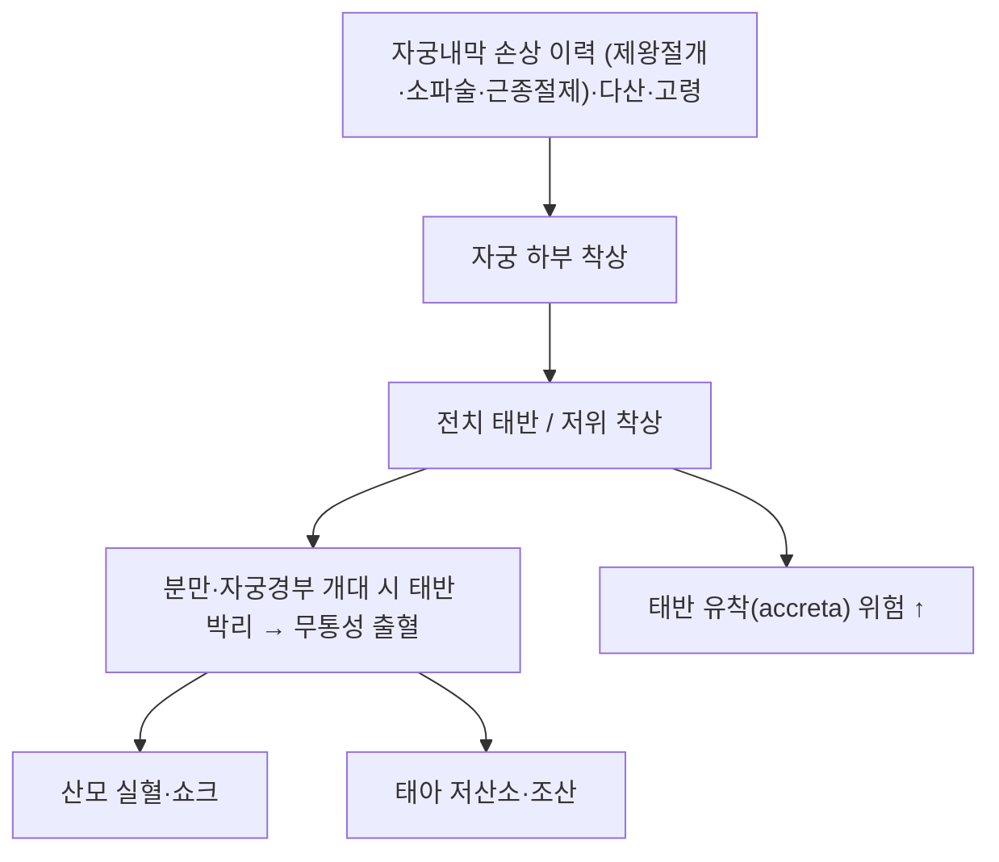

# 🩺 전치 태반 (Placenta previa, 前置胎盤)

> **핵심 3줄 요약 (Key Summary)**:
> - 📍 병소 부위 & 병태생리: 태반이 **자궁경부 내구를 덮거나 매우 근접**해 착상한 상태 — 분만이 진행되면 자궁경부가 열리며 태반이 박리되어 **대량 출혈**이 발생한다
> - 🚩 전형적 임상 양상: 임신 제3삼분기의 **무통성 질출혈(painless vaginal bleeding)** — 자궁은 이완되어 있고 통증이 없는 것이 특징이다
> - 🛠️ 핵심 감별 & 치료 전략: **질검사 금지**, 경질 초음파로 진단하고 안정·활동 제한·필요 시 제왕절개로 관리한다. 한의 임상에서는 **모든 복부 압박·수기치료·뜸의 절대 배제 기준**이다
> - ⚠️ 응급 의뢰 레드플래그: 임신 중 질출혈은 양과 무관하게 즉시 산과 평가 대상이다. 대량 출혈·복통 동반·태동 감소·자궁 경화는 초응급이다.

---

## 📌 목차
1. [질환 개요 & 병태생리](#1-질환-개요--병태생리)
2. [병태생리 메커니즘 & 악순환 네트워크](#2-병태생리-메커니즘--악순환-네트워크)
3. [임상 양상 & 진단 알고리즘](#3-임상-양상--진단-알고리즘)
4. [감별 진단 매트릭스 (Differential Diagnosis)](#4-감별-진단-매트릭스-differential-diagnosis)
5. [한의 통합 치료 프로토콜 (적응·한계)](#5-한의-통합-치료-프로토콜-적응한계)
6. [양방 치료 & 병용·의뢰 기준 (Conventional Treatment & Referral)](#6-양방-치료--병용의뢰-기준-conventional-treatment--referral)
7. [생활습관 & 자가관리 티칭 가이드](#7-생활습관--자가관리-티칭-가이드)
8. [💡 진료실 핵심 필기 & 임상 노하우](#8--진료실-핵심-필기--임상-노하우)
9. [출처 및 학술 참고 문헌 (References)](#9-출처-및-학술-참고-문헌-references)

---

## 1. 질환 개요 & 병태생리

![[전치태반_01_태반위치도해.png|440]]
> [그림 1: 정상 태반 위치(상)와 전치 태반(하) 비교 도해 — 하단에서 태반이 자궁경부 내구를 덮고 있는 형태. (CC BY-SA 4.0, BruceBlaus) — 출처: Wikimedia Commons]

![[전치태반_02_정상위치_대비.jpg|440]]
> [그림 2: 정상 태반(좌, "Cervix is not obstructed")과 전치 태반(우, "Placenta is covering cervix preventing a proper birth") 비교 — 내구(internal os) 표기 포함. (CC BY 3.0, OpenStax College) — 출처: Wikimedia Commons]

* **정의 및 분류**:
  * 태반이 자궁경부 내구를 **완전히 덮은 경우(complete/totalis)**, **부분적으로 덮은 경우(partial)**, **변연이 내구에 닿는 경우(marginal)**, 내구 2 cm 이내에 근접한 경우(low-lying)로 나눈다 — 분만 방식 결정에 직결된다
* **관련 구조**:
  * **주 이환 구조**: 태반 착상부(자궁 하부), 자궁경부 내구, 자궁 하부 근층
  * **합병증 표적**: 태반 유착(accreta spectrum), 자궁 하부 수축 불량 → 산후 출혈
* **역학·위험인자**: 이전 제왕절개·자궁 내 수술(소파술·근종 절제), 다산, 고령 임신, 다태, 흡연, 보조생식 시술

---

## 2. 병태생리 메커니즘 & 악순환 네트워크

### 1) 기전
* 자궁 상부 내막이 손상되면 착상 적합성이 떨어져 **자궁 하부로 착상이 이동**한다는 설명이 위험인자 구조를 가장 잘 반영한다
* 자궁경부 개대·자궁 하부 신장 시 **태반이 먼저 박리**되어 출혈이 시작된다. 자궁 하부는 수축력이 약해 **지혈이 잘 되지 않는다** — 산후 출혈의 구조적 이유다
* 이전 제왕절개 반흔이 있는 전치 태반은 **태반 유착 스펙트럼** 위험이 크게 올라간다

### 2) 위험 구조
* 출혈 → 빈혈·쇼크(산모) / 조산·저산소(태아) → 응급 제왕절개. 이 경로가 **한의원 1차 진료에서 다룰 수 없는 영역**인 이유다

---

## 3. 임상 양상 & 진단 알고리즘

### 1) 전형적 양상
* **무통성 질출혈** — 통증 없이 갑자기 피가 나오는 것이 특징이며, 출혈량은 다양하다
* 일부는 자궁수축을 동반하기도 한다(전치 태반 + 자궁수축은 감별이 어렵다)
* 태동 감소·복부 경화·어지럼은 실혈을 시사한다

### 2) 진단
* **경질(transvaginal) 초음파**: 진단의 표준이자 안전한 방법 — 태반 변연과 내구의 관계를 정확히 본다. **경복부 초음파는 정확도가 낮다**
* **질검사는 금지**된다 — 태반을 건드려 대량 출혈을 유발할 수 있다. 내진·자궁경부 검사도 하지 않는다
* 혈색소·혈소판·혈액형(Rh)·항체 검사, 태아 상태 평가(EFM·초음파)

### 3) 판정
* ① 무증상 전치 태반(경과 관찰) ② 출혈 1회(입원·안정) ③ 반복 출혈·대량 출혈(응급 분만 고려) ④ 태반 유착 동반(수술 계획)

---

## 4. 감별 진단 매트릭스 (Differential Diagnosis)

| 감별 | 특징적 양상 | 감별 포인트 |
| :--- | :--- | :--- |
| [[전치 태반]] (본 질환) | 무통성 질출혈, 자궁 이완 | 경질 초음파로 태반 위치 확인 |
| 태반 조기 박리 | **통증 동반** 출혈, 자궁 경화·압통 | 임상 양상 + 초음파 |
| 자궁 파열 | 격심한 복통, 태아 서맥, 반흔 자궁 | 응급 개복 |
| 질·자궁경부 병변 | 국소 출혈·종괴 | **질검사 금지** — 영상으로 접근 |
| 혈관 전치(vasa previa) | 무통성 출혈 + 태아 서맥 | 태아 혈관이 내구를 지남 |

> 🚩 **레드플래그**: 임신 중 질출혈은 양과 무관하게 산과 평가 대상이다. 대량 출혈·복통 동반·태동 감소는 초응급이다.

---

## 5. 한의 통합 치료 프로토콜 (적응·한계)

* **원칙**: 전치 태반은 **한의 중재의 적응증이 아니라 절대 배제 기준**이다. 진단되면 복부 압박·복부 자극·수기치료·뜸을 시행하지 않는다
  * **금지 중재**: 복부 추나·도수, 강한 회전, 골반환 교정(HVLA 포함), 복부 온구·뜸, 복부 자극 전침 → [[도수치료]] · [[뜸]] · [[근막이완술]] · [[근에너지기법]]
  * **이유**: 자궁 하부·경부 자극이 태반 박리를 유발할 수 있고, 자궁 하부는 수축 지혈 능력이 약하다
* **허용 범위(산과 허가 시)**: 출혈이 없고 상태가 안정적이며 산과가 허용한 경우에 한해 **안정·이완 목적의 아주 저강도 접촉(원위부 침 자극, 호흡 이완)** 정도로 제한한다. 판단은 항상 산과가 우선한다
* **안태(安胎) 처방**: 전통적으로 안태·보기 처방이 쓰여 왔으나, 전치 태반 자체에 대한 근거는 없다. **반드시 산과 협진 하에** 운용하며 임신 금기 본초를 배제한다 → [[애엽]]
* **환자 기대 관리**: "한약·침으로 태반 위치가 올라간다"는 설명을 하지 않는다. 태반 위치는 임신 진행에 따라 상대적으로 이동할 수 있으나 이는 자연 경과다

---

## 6. 양방 치료 & 병용·의뢰 기준 (Conventional Treatment & Referral)

* **비약물·생활 관리**: 활동 제한·안정, 성교 금지, 질 내 조작 금지, 빈혈 관리(철분 보충)
* **약물**:
  * 자궁수축 억제가 필요한 경우 산과에서 판단한다(조기진통·출혈 동반 시)
  * **Rh 음성 산모**: 출혈 시 항D면역글로불린 투여 검토
  * 빈혈 교정(철분·필요 시 수혈)
* **분만 방법**:
  * **완전 전치 태반은 제왕절개가 원칙**이다. 저위 착상은 변연과 내구 거리(통상 2 cm 기준)에 따라 질식 분만 가능성을 산과가 판단한다
  * 예정 제왕절개 시점·수술 범위는 출혈 병력·태반 유착 여부에 따라 결정된다
* **한의 병용 판단**: 병용은 **산과 허가 범위에서 저강도 접촉·내복 처방**으로 제한한다. 병용 금기: 복부 수기·복부 온열·강한 자극
* **의뢰 기준**: 진단 즉시 산과 이관. 임신 중 질출혈, 대량 출혈, 복통 동반, 태동 감소는 즉시 응급 이송

---

## 7. 생활습관 & 자가관리 티칭 가이드

* **반드시 가르칠 4가지**: ① 출혈이 있으면 즉시 병원 ② 성교·질 세정 금지 ③ 무거운 들기·격한 운동 회피 ④ 빈혈 관리(철분제 복용 확인)
* **기록**: 출혈량(패드 사용량)·색, 통증 유무, 태동 횟수를 기록하게 한다
* **주의 증상**: 갑작스러운 다량 출혈, 어지럼·실신, 복부 경화, 태동 감소 — **즉시 119 또는 응급 산과**
* **정기 추적**: 초음파로 태반 위치·태아 성장 추적, 혈색소 확인

---

## 8. 💡 진료실 핵심 필기 & 임상 노하우

* **한의원 진료의 최우선 확인 항목**: 임신부 첫 방문에서 **출혈 병력·태반 위치(초음파 소견)** 를 반드시 확인한다. 전치 태반·저위 착상이면 추나·복부 뜸·복부 온열은 계획에서 제외한다
* **"무통성 출혈"은 함정이다**: 통증이 없다고 가벼운 출혈로 넘기면 안 된다. 통증 없는 질출혈이야말로 전치 태반의 전형이다
* **감별 문진**: 통증 동반 여부(전치 태반=무통, 태반 조기 박리=통증·경화), 출혈 색·양, 태동 변화
* **배제 기준으로서의 가치**: 뜸 시험(둔위 교정)에서도 전치 태반은 배제 기준이었고, 임신부 도수치료 시험에서도 동일하게 배제되었다 — **"임신부 중재를 설계할 때 가장 먼저 확인하는 한 줄"** 로 기억한다
* **환자 스크립트**: "태반이 아기 나오는 길 쪽에 붙어 있는 상태입니다. 이 경우 배를 누르거나 자극하는 치료는 절대 하지 않고, 출혈이 있으면 곧바로 산부인과로 가야 합니다. 한약과 침은 산부인과 선생님과 상의한 범위에서만 하겠습니다."

---

## 9. 출처 및 학술 참고 문헌 (References)

1. **MSD 매뉴얼 전문가용** — 전치 태반(Placenta Previa). [링크](https://www.msdmanuals.com/professional)
   - [연구 요약] 전치 태반의 위험인자·분류·무통성 질출혈의 특징·질검사 금지·제왕절개 원칙을 정리한 임상 개요.
2. **Am J Obstet Gynecol** — Osteopathic manipulative treatment of back pain and related symptoms during pregnancy: a randomized controlled trial. 2010;202(1):43.e1-8. [PMID 19766977](https://pubmed.ncbi.nlm.nih.gov/19766977/)
   - [연구 요약] 임신부 도수치료 3군 RCT에서 **전치 태반을 고위험 배제 기준**으로 명시하고, HVLA(고속저진폭 교정)와 CV-4 두개골 기법을 금지했다 — 임신부 수기치료 안전 규칙의 근거.
3. **Cochrane Database of Systematic Reviews** — Cephalic version by moxibustion for breech presentation. 2023;2023(5):CD003928. [PMID 37158339](https://pubmed.ncbi.nlm.nih.gov/37158339/)
   - [연구 요약] 둔위 교정 뜸 시험들에서도 **전치 태반을 포함한 고위험 임신**이 배제 기준이었다 — 뜸·도수 등 임신부 비약물 중재의 공통 상한선.
4. **Williams Obstetrics** — Placenta Previa 장
   - [연구 요약] 착상 기전(자궁내막 손상 → 자궁 하부 착상)·태반 유착 스펙트럼·분만 시점 결정과 산후 출혈 관리 원칙.

---

## 관련 노트
- [[둔위]] · [[뜸]] · [[체외회전술]] · [[골반대 통증]] · [[요통]] · [[근막이완술]] · [[근에너지기법]] · [[릴랙신]] · [[애엽]] · [[임신 초기 출혈]] · [[임신 후기 질 출혈]] · [[태반 조기 박리]]
- [[2026-09-27_부인과소아과_심층리뷰]] 1·2번 · [[2026-09-27_부인과소아과_개념학습]]
