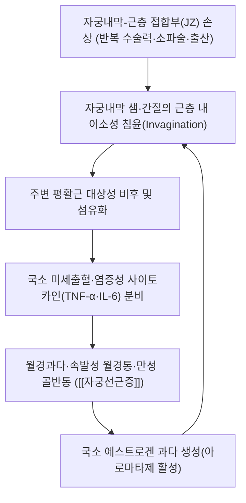

---
aliases:
  - Adenomyosis
  - 子宮腺筋症
tags:
  - 이론
  - 질환
  - 부인과
created: 2026-09-23
updated: 2026-09-23
status: complete
title: 자궁선근증
date: 2026-09-24
출처: "https://pubmed.ncbi.nlm.nih.gov/33105509/"
---

# 🩺 [[자궁선근증]] (Adenomyosis / 子宮腺筋症, ICD-10 N80.0)

> **핵심 3줄 요약 (Key Summary)**:
> - 📍 병소 부위 & 해부·병태생리: 자궁내막샘·간질이 자궁근층(myometrium) 내부로 침윤해 이소성으로 증식하며 주변 평활근이 대상성으로 비후되는 질환. [[자궁]]이 미만성 또는 국소성으로 비대·압통.
> - 🚩 전형적 임상 양상 & 3대 징후: 월경과다(menorrhagia)·속발성 월경통(dysmenorrhea)·만성 골반통이 3대 주소증이며, 40대 다산력 여성에서 호발.
> - 🛠️ 핵심 감별 검사 & 한·양방 다각적 치료 전략: 경질 초음파·MRI(T2 강조 접합부 비후 ≥12mm)로 진단, 활혈거어·자음 중심 한약([[계지복령환]]·[[대황자충환]]·[[삼릉봉출산]])과 대증적 양방 치료(호르몬 요법·자궁동맥 색전술) 병행.
> - ⚠️ 응급 의뢰 레드플래그 & 악화 요인: 급성 심한 골반통·다량 출혈로 인한 빈혈·쇼크 징후, 폐경 후 신규 발생 증상(악성 감별 필요)은 즉시 산부인과 의뢰.

---

## 📌 목차
1. [질환 개요 & 해부학적 병태생리](#1-질환-개요--해부학적-병태생리)
2. [병태생리 메커니즘 & 생체역학적 악순환 네트워크](#2-병태생리-메커니즘--생체역학적-악순환-네트워크)
3. [임상 증상 & 이학적 검사(Physical Exam) 알고리즘](#3-임상-증상--이학적-검사physical-exam-알고리즘)
4. [감별 진단 매트릭스 (Differential Diagnosis)](#4-감별-진단-매트릭스-differential-diagnosis)
5. [한의 통합 치료 프로토콜 (침·약침·추나·한약)](#5-한의-통합-치료-프로토콜-침약침추나한약)
6. [재활 운동 & 생활습관 티칭 가이드](#6-재활-운동--생활습관-티칭-가이드)
7. [💡 사용자 진료실 핵심 필기 & 임상 노하우 (Melt-In 잔여 심화 집약)](#7--사용자-진료실-핵심-필기--임상-노하우-melt-in-잔여-심화-집약)
8. [출처 및 학술 참고 문헌 (References)](#8-출처-및-학술-참고-문헌-references)

---

## 1. 질환 개요 & 해부학적 병태생리

![[자궁선근증_자궁비대_육안소견_병태생리_일러스트.jpg|450]]
> [그림 1: ① 자궁선근증 병태생리 — 자궁선근증으로 비대해진 자궁의 절단면(좌)과 자궁근층 내 병소 확대(우) 육안 소견. 출처: Wikimedia Commons, Gross pathology of a uterus with extensive adenomyosis (CC0)]

* **질환 정의 및 분류**:
  * 자궁내막의 샘(gland)과 간질(stroma)이 정상 위치인 자궁내막-근층 접합부(endometrial-myometrial junction, JZ)를 넘어 자궁근층 내부로 이소성 침윤하여 성장하는 양성 질환. 전통적으로 미만성(diffuse)과 국소성(focal, adenomyoma)으로 분류하며, 최근 FIGO/MUSA 초음파 합의안은 병변 위치(내막 접합부성·외측근층성·자궁선근종)에 따라 세분화한다.
  * 호발 연령은 40~50대이나 최근 고해상도 영상 보급으로 20~30대 비출산 여성에서의 진단도 증가하고 있다. 유병률 추정치는 진단 기준(조직검사 vs 영상)에 따라 5~70%로 보고 편차가 크며, 자궁내막증·자궁근종과 30~80% 동반이환한다[1][8].
  * 위험인자: 다산력, 제왕절개·소파술 등 자궁 수술력, 흡연력과는 역상관, 이른 초경.
* **관련 해부학적 구조물**:
  * **자궁 접합부(Junctional Zone, JZ)**: 자궁내막과 근층 사이 저신호 강도 이행대. MRI에서 JZ 두께 ≥12mm 또는 JZ/전체 근층 두께 비 ≥40%가 진단 기준.
  * **[[자궁]] 근층**: 이소성 내막조직 주위로 평활근이 비후·증식(smooth muscle hyperplasia)하여 미만성 자궁비대를 유발.
  * **혈관 및 신경**: 자궁동맥 분지의 국소 충혈, 주변 통각 신경 말단 자극이 만성 골반통에 관여.

---

## 2. 병태생리 메커니즘 & 생체역학적 악순환 네트워크

![[자궁선근증_자궁해부_근층구조_해부도해.jpg|450]]
> [그림 2: ② 자궁 해부 구조 — (A) 자궁체부·자궁내막(endometrium)·자궁근층(myometrium) 및 난관·난소, (B) 월경주기에 따른 자궁내막층 변화. 출처: Wikimedia Commons, Uterine anatomy (CC BY 3.0)]

### 1) 자궁내막-근층 접합부(JZ) 손상 및 이소성 침윤 기전
* 최신 가설(Tissue Injury and Repair, TIAR)은 반복적 자궁 수축·미세외상이 JZ의 상피-간엽 이행(EMT)을 촉발해 내막 조직이 근층으로 파고든다고 설명한다[3].
* 국소적으로 아로마타제(CYP19A1) 발현이 증가해 에스트로겐 자가생성 루프가 형성되고, 이는 다시 병변 증식을 촉진하는 악순환을 만든다.
### 2) 생체역학적 연쇄 반응
* 자궁근층 비후로 인한 자궁 용적 증가 → 골반강 내 압박감·빈뇨·배변통 등 인접 장기 압박 증상으로 확산.

---

## 3. 임상 증상 & 이학적 검사(Physical Exam) 알고리즘

### 1) 주소증 및 신경학적 증상
* **월경 증상**: 월경과다(menorrhagia), 부정출혈, 속발성·진행성 월경통(생리 시작 전부터 시작해 점차 악화되는 양상이 특징적).
* **통증 양상**: 만성 골반통, 성교통(deep dyspareunia), 하복부 압통 및 묵직함.
* **전신 증상**: 만성 실혈로 인한 철결핍성 빈혈 증상(피로, 어지럼).

### 2) 필수 이학적 검사법 (Physical Examination)
* **양수진찰(bimanual exam)**: 미만성으로 비대·압통이 있는 부드럽고 둥근 자궁("boggy uterus") 촉지 — 자궁근종의 국소적 단단한 결절과 감별.
* **경질 초음파(TVUS)**: 1차 선별 검사. 비대칭적 근층 비후, 근층 낭종(myometrial cyst), 부채꼴 그림자(fan-shaped shadowing) 소견.

---

## 4. 감별 진단 매트릭스 (Differential Diagnosis)

| 감별 질환 | 호발 병소 및 원인 | 주소증 차이점 | 특이적 이학적 검사 소견 |
| :--- | :--- | :--- | :--- |
| [[자궁선근증]] (본 질환) | 자궁내막-근층 접합부 침윤, 미만성 비대 | 진행성 월경통, 월경과다, 미만성 압통 | 경질초음파 JZ 비후·부채꼴 그림자 |
| [[자궁근종]] | 근층 내 국소 평활근 종양 | 압박 증상 위주, 통증은 상대적으로 경미할 수 있음 | 경계 명확한 국소 결절(단단) |
| [[자궁내막증]] | 자궁강 외 이소성 내막조직(난소·복막) | 원발성 월경통, 만성 골반통, 불임 동반多 | 초음파상 난소 자궁내막종(초콜릿 낭종) |
| [[골반염증성질환]] | 상행 감염 | 발열·질 분비물 동반, 급성 경과 | 자궁경부 운동통(CMT) 양성 |

---

## 5. 한의 통합 치료 프로토콜 (침·약침·추나·한약)

![[자궁선근증_자궁동맥혈관분포_시술타겟_해부도해.png|450]]
> [그림 3: ③ 자궁동맥(uterine artery) 혈관 분포 — 자궁동맥색전술(UAE)의 타겟 혈관 및 자궁체부·경부·난소·질로의 분지 경로. 출처: Gray's Anatomy, Plate 1170, Wikimedia Commons (Public domain)]

* **침구 치료 (Acupuncture)**: 관원(關元)·기해(氣海)·삼음교(三陰交)·혈해(血海) 등 하복부·하지 경혈 위주 자침으로 골반강 혈류 개선 및 진통 도모(⚠️ 침구 개입의 자궁선근증 직접 효과에 대한 대조군 임상연구는 상대적으로 희박 — 추정).
* **약침 치료**: 하복부 압통점·자궁 인대 부착부 주변 소염·활혈 목적 약침 고려.
* **한약 치료**: 활혈거어(活血祛瘀)·자음양혈(滋陰養血) 병행이 핵심 치법. 어혈이 뚜렷한 실증에는 [[계지복령환]]·[[대황자충환]]·[[삼릉봉출산]], 허증 겸 어혈에는 [[조경종옥탕]] 계통을 변증에 따라 선방(볼트 내 기존 처방 노트에서 확인되는 실제 적용 사례).

---

## 6. 재활 운동 & 생활습관 티칭 가이드

* **온열 요법**: 하복부 온찜질로 골반강 혈류 개선 및 통증 완화.
* **일상생활 티칭**: 월경 중 과도한 냉방·찬 음식 자제, 카페인·알코올 섭취 절제(전신 어혈 악화 요인으로 임상적으로 설명).
* **철분 보충 티칭**: 만성 월경과다로 인한 빈혈 예방을 위한 철분 섭취 및 정기 혈액검사 권고.

---

## 7. 💡 사용자 진료실 핵심 필기 & 임상 노하우 (Melt-In 잔여 심화 집약)

* **⚠️ 내용 검토 필요**: 본 노트는 2026-09-23 다빈치가 미노트화 대기열 순번에 따라 신규 생성한 노트로, 원장님의 진료실 실전 노하우·문진 체크리스트는 아직 반영되지 않았습니다. 실제 진료 경험이 쌓이면 이 섹션에 채워 주시기 바랍니다.

---

## 8. 출처 및 학술 참고 문헌 (References)

1. **Vannuccini S, Petraglia F, et al. (2021)**. *Epidemiology of Adenomyosis*. **Fertility and Sterility / F S Rev**. PMID: [33105509](https://pubmed.ncbi.nlm.nih.gov/33105509/)
   - **[연구 요약]**: 진단 기준에 따른 유병률 편차(5~70%)와 위험인자(다산력, 자궁 수술력)를 정리한 역학 리뷰.
2. **Vannuccini S, et al. (2023)**. *Guideline No. 437: Diagnosis and Management of Adenomyosis*. **J Obstet Gynaecol Can (SOGC)**. PMID: [37244746](https://pubmed.ncbi.nlm.nih.gov/37244746/)
   - **[연구 요약]**: MRI·경질초음파 진단 기준(JZ 두께 ≥12mm 등)과 단계별 치료(호르몬 요법·수술·색전술) 가이드라인.
3. **Chapron C, Vannuccini S, et al. (2023)**. *Adenomyosis: An Updated Review on Diagnosis and Classification*. **Diagnostics (Basel)**. PMID: [37510943](https://pubmed.ncbi.nlm.nih.gov/37510943/)
   - **[연구 요약]**: FIGO/MUSA 기반 최신 초음파 분류체계 및 조직 손상-복구(TIAR) 병인 가설 정리.
4. **(2021)**. *Adenomyosis pathogenesis: insights from next-generation sequencing*. **Hum Reprod Update**. PMID: [34131719](https://pubmed.ncbi.nlm.nih.gov/34131719/)
   - **[연구 요약]**: 차세대 시퀀싱 기반 분자병리 기전(상피-간엽 이행, 국소 에스트로겐 자가생성) 고찰.

<!-- 보관 태그(1회용·링크오류, 필요시 복원): 여성질환 -->
