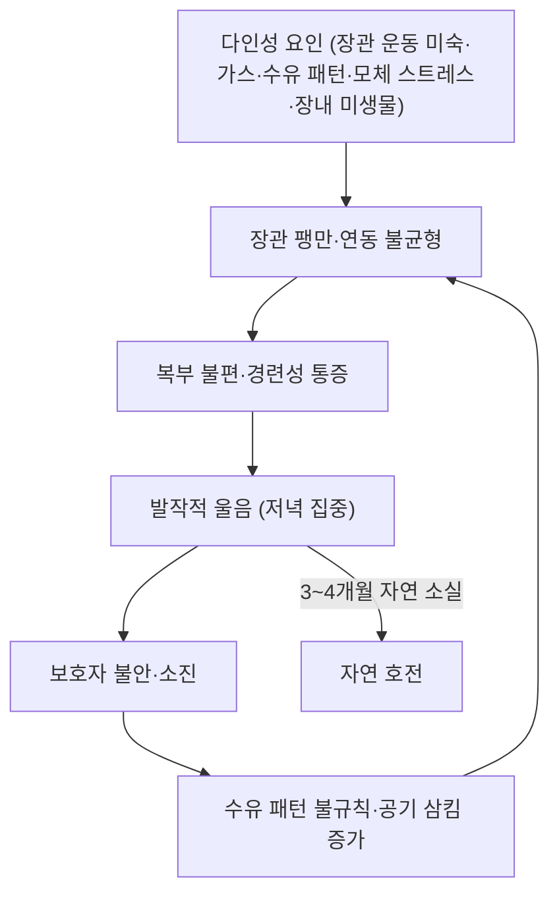

# 🩺 영아 산통 (Infantile colic, 嬰兒腹痛)

> **핵심 3줄 요약 (Key Summary)**:
> - 📍 병소 부위 & 병태생리: 건강한 영아의 **발작적·지속적 울음 증후군**([[장관]] 운동 이상·가스·[[위식도 역류]]·수유 패턴·모체 스트레스·장내 미생물이 얽힌 다인성) — 기질적 원인이 배제되어야 진단된다
> - 🚩 전형적 임상 양상: 늦은 오후·저녁에 몰리는 발작적 울음, 얼굴 붉힘·다리 굽힘·복부 팽만. **성장·체중 증가는 정상**이고 야간 수면은 유지된다
> - 🛠️ 핵심 감별 & 한·양방 치료 전략: 기질적 원인(역류·단백 불내성·장중첩증·유문협착·감돈 탈장)을 먼저 배제하고, **보호자 교육·안정화·마사지가 치료의 절반**. 도수치료는 울음·역류 축에서만 근거가 있고 **전체 산통 중증도는 유의하지 않았다**
> - ⚠️ 응급 의뢰 레드플래그: 발열, 담즙성(초록) 구토, 혈변, 체중 감소·성장 부진, 무기력·경련·호흡 이상, 6주 미만 영아의 발열 — **도수치료·마사지 대상이 아니라 소아과 응급 평가 대상**이다.

---

## 📌 목차
1. [질환 개요 & 병태생리](#1-질환-개요--병태생리)
2. [병태생리 메커니즘 & 악순환 네트워크](#2-병태생리-메커니즘--악순환-네트워크)
3. [임상 양상 & 감별 알고리즘](#3-임상-양상--감별-알고리즘)
4. [감별 진단 매트릭스 (Differential Diagnosis)](#4-감별-진단-매트릭스-differential-diagnosis)
5. [한의 통합 치료 프로토콜 (마사지·온열·한약)](#5-한의-통합-치료-프로토콜-마사지온열한약)
6. [양방 치료 & 병용·의뢰 기준 (Conventional Treatment & Referral)](#6-양방-치료--병용의뢰-기준-conventional-treatment--referral)
7. [수유·생활습관 & 보호자 티칭 가이드](#7-수유생활습관--보호자-티칭-가이드)
8. [💡 진료실 핵심 필기 & 임상 노하우](#8--진료실-핵심-필기--임상-노하우)
9. [출처 및 학술 참고 문헌 (References)](#9-출처-및-학술-참고-문헌-references)

---

## 1. 질환 개요 & 병태생리

![[영아산통_02_영아_마사지.jpg|420]]
> [그림 1: 보호자가 영아를 마사지하는 장면 — 수건 위에 누운 영아의 하지를 잡고 부드럽게 접촉하는 형태. (CC BY-SA 3.0 de, Andreas Bohnenstengel) — 출처: Wikimedia Commons]

![[영아산통_03_보호자교육.jpg|420]]
> [그림 2: 영아 마사지 보호자 교육 현장 — 강사가 인형과 영아에게 시범을 보이고 신생아 어머니들이 함께 따라 하는 모습. (U.S. Navy photo, 퍼블릭 도메인) — 출처: Wikimedia Commons]

* **질환 정의**:
  * 건강한 영아에서 **설명되지 않는 발작적·지속적 울음**이 반복되는 증후군. 전통적 진단 기준(Wessel)은 **하루 3시간 이상 · 주 3일 이상 · 3주 이상**이며, 최근에는 시간 기준을 완화해 '영아 소화불량'의 범주로 접근한다
  * **기질적 원인과 위험 신호가 배제된 상태**에서만 진단된다 — 즉 산통은 배제 진단이다
* **역학·경과**: 생후 2개월 미만에서 흔하고 **생후 6주경 정점**을 지나 **3~4개월에 자연 소실**된다. 소아과 외래 상담의 10~20%를 차지하고 보호자 소진·응급실 방문의 주요 원인이다
* **관련 구조**:
  * **주 이환계**: [[장관]] 운동·가스, 위식도 경계부 → [[영아의 위식도 역류]]
  * **조절계**: 자율신경([[미주신경]] 계열 긴장), [[장-뇌축]], 복압 조절([[횡격막]])

---

## 2. 병태생리 메커니즘 & 악순환 네트워크

### 1) 기전 가설
* **장관 운동 이상·가스**: 장관 발달이 미숙해 가스 이동이 느리고 팽만이 반복된다는 설명(가장 오래된 축)
* **위식도 역류·수유 연관**: 역류·과수유·공기 삼킴이 산통성 울음과 겹친다 → [[영아의 위식도 역류]]
* **자율신경·장-뇌축**: 장관 자극과 중추 조절의 상호작용, 모체 스트레스의 영향이 함께 거론된다 → [[장-뇌축]] · [[미주신경]]
* **미생물·불내성**: 장내 미생물 구성과 단백 불내성 가설 — 프로바이오틱스·분유 조정의 근거 축
* ⚠️ 어떤 단일 기전도 확립되지 않았고, **자연 경과가 워낙 좋아 중재 효과를 분리하기 어렵다**는 점이 이 질환 연구의 구조적 한계다

### 2) 악순환 고리
* 울음 → 보호자 불안·수유 패턴 변화 → 공기 삼킴·과수유 → 장관 팽만 → 다시 울음. 이 고리를 끊는 것이 중재의 목표이며, 그래서 **보호자 교육이 치료의 절반**이 된다

---

## 3. 임상 양상 & 감별 알고리즘

### 1) 전형적 양상
* 늦은 오후·저녁에 몰리는 발작적 울음, 얼굴 붉힘, 다리를 배 쪽으로 굽힘, 주먹 쥠, 복부 팽만
* **성장·체중 증가는 정상**, 야간 수면은 비교적 유지, 낮 동안은 비교적 평온
* 증상은 예측 가능한 시간대에 반복되지만 발작 사이에는 정상 상태다

### 2) 객관적 평가 (반드시 확인할 항목)
* **체중·성장곡선**: 체중 증가가 멈추면 산통이 아니라 다른 질환을 먼저 본다
* 신체검사: 복부 팽만·압통, **서혜부·배꼽 탈장 감돈**, 항문(치열·혈변), 귀(중이염), 피부, 각막(찰과상·머리카락 감김), 신경학적 이상
* 필요 시 소변검사·영상검사(구토 양상·성장 부진 시)

### 3) 판정
* ① 단순 산통(성장 정상·위험 신호 없음) ② 감별 필요(역류·불내성·수유 문제) ③ **응급(장중첩증·감돈 탈장·감염·신경계 이상)**

---

## 4. 감별 진단 매트릭스 (Differential Diagnosis)

| 감별 | 특징적 양상 | 감별 포인트 |
| :--- | :--- | :--- |
| [[영아 산통]] (본 질환) | 저녁 집중 발작적 울음, 성장 정상 | 위험 신호 없음, 자연 경과 |
| [[영아의 위식도 역류]] | 수유 직후 게움·사레, 보챔 | 수유 연관성, 체중 추이 |
| 장중첩증 | 간헐적 심한 통증 발작 + 창백·무기력, 젤리 모양 혈변 | 응급 초음파 |
| 유문 협착 | 생후 2~6주 **사출성 비담즙성 구토**, 체중 감소 | 복부 종괴 촉지, 초음파 |
| 감돈 탈장 | 서혜부·배꼽 부위 단단한 종괴, 압통 | 즉시 정복 시도·응급 |
| 우유단백 불내성 | 구토·설사·혈변·습진 동반 | 식이 조정 반응 |
| 감염(요로·중이) | 발열, 보챔 지속 | 소변검사·고막 확인 |

> 🚩 **레드플래그**: 발열, 담즙성 구토, 혈변, 체중 감소, 무기력·경련, 호흡 이상, 6주 미만 발열 — **마사지·도수치료를 멈추고 즉시 소아과로 의뢰**한다.

---

## 5. 한의 통합 치료 프로토콜 (마사지·온열·한약)

* **소아 복부 마사지·온열 (한의원 번안의 중심)**: 시계방향 복부 마사지 → 하지 굴곡-신전(자전거 동작) → 발바닥 원형 자극 → 저온 온구(스티커형) 순으로 구성한다. **수유 후 30~45분 뒤** 시행한다 → [[뜸]]
* **자세·복압 관리**: 횡격막 이완과 복부 압을 낮추는 접촉적 접근이 같은 치료 목표를 공유한다 → [[횡격막]] · [[도수치료]]
* **침구 치료**: 영아에서는 자침을 원칙적으로 피하고 **비침습 자극(지압·첩부·온열)** 을 우선한다 → [[경혈 첩부요법]]
* **한약 치료**: 소아 한약은 용량·안전 문제로 **소아과 협진 하에** 제한적으로 접근하며, 수유부 복약 경로도 함께 검토한다. 消食導滯·健脾 화담 계열이 관례적으로 쓰여 왔으나 이번 논문 근거와는 직접 연결되지 않는다 → [[영아의 위식도 역류]]
* **기대치 관리**: 이 시험에서 **양군 모두 상담·교육만으로 상당히 호전**되었고, Cochrane 고찰은 부모 눈가림이 확보된 시험만 모으면 도수치료 효과가 유의하지 않았다고 지적했다. "도수치료로 산통이 완치된다"는 설명은 근거를 넘는다

---

## 6. 양방 치료 & 병용·의뢰 기준 (Conventional Treatment & Referral)

* **비약물 우선 (1차)**:
  * 보호자 교육·안정화(포대기·백색소음·규칙적 진정 루틴), 수유 후 트림, 반응적 수유
  * 마사지·접촉 중재는 보호자-영아 상호작용 개선이라는 부수 이득이 있다
* **약물·보충제**: 시메티콘 등 가스 완화제·진경제·허브차의 근거는 약하고 안전성 문제가 있어 1차 선택이 아니다. 프로바이오틱스는 연구마다 결과가 갈린다
* **비약물 시술**:
  * **도수치료(오스테파시)**: 두개골·흉요추·[[횡격막]]·내장 기법을 15일 간격 2회·회당 약 60분. 이번 시험에서 **울음 점수는 7일(P=.03)·15일(P=.04)에 유의 감소, 역류 점수는 1·2·3주 내내 유의 감소**(P=.05, .05, .04)였으나 **전체 산통 중증도는 유의차에 이르지 못했다**(군간 P=.18). 이상반응은 보고되지 않았다 → [[도수치료]]
* **수술·시술 적응증**: 기질적 원인이 확인된 경우(장중첩증 정복, 유문 협착 수술, 탈장 정복)가 해당되며 산통 진단 자체로는 없다
* **한의 병용 판단**: 마사지·온열·첩부는 병용 가능. 단 **경추 회전 도수는 영아에서 절대 시행하지 않는다**
* **소아과 의뢰 기준**: 레드플래그 전부 + 보호자 소진이 심해 안전이 우려되는 경우(흔들린 아이 증후군 예방)

---

## 7. 수유·생활습관 & 보호자 티칭 가이드

* **수유·자세**: 수유 후 **30~45분 뒤** 마사지·복부 접촉. 수유 시 공기 삼킴 방지 자세, 수유 후 트림을 반드시 시행
* **발작 시 이완 반응 유도**: 배 위에 손 얹기 → 하행 쓸어내리기 → 가벼운 포대기 → 백색소음 순서로 알려 준다
* **보호자 소진 관리(핵심 안전 이슈)**: "울음은 아기의 잘못이 아니라 발달 과정"이라고 설명하고, 교대·휴식 계획을 세우게 한다. **절대 흔들지 않도록** 명확히 교육한다
* **기록지**: 발작 시간대·수유량·배변·체중을 **기록하게** 해 다음 회차 조정 근거로 삼는다
* **정기 추적**: 2주 간격 체중·성장곡선 확인, 3~4개월 자연 소실 여부 확인

---

## 8. 💡 진료실 핵심 필기 & 임상 노하우

* **첫 질문 순서**: ① 체중이 늘고 있는가 ② 발열·구토·혈변이 있는가 ③ 언제(시간대) 우는가 ④ 수유 후 양상인가 — 이 네 가지로 응급과 단순 산통이 대부분 갈린다
* **"울음·역류는 좋아지고, 산통 점수는 그대로"** — 이번 시험의 결과 구조를 그대로 기억한다. 기대치를 울음·역류 축에 맞춘다
* **부모 눈가림 Cochrane 고찰의 교훈**: 부모가 배정을 모르는 시험만 보면 도수치료 효과가 유의하지 않았다 — **비특이적 접촉·상담 효과가 크다는 뜻**이며, 이는 곧 한의원에서도 접촉·교육만으로 상당한 도움을 줄 수 있다는 의미다
* **안전 상한선**: 생후 6주 미만, 체중 증가가 멈춘 영아, 발열·담즙성 구토·혈변·경련·무기력 — 도수치료 대상이 아니라 소아과 응급 평가 대상
* **보호자 교육 자료로 그대로 쓰는 문장**: "아기가 아무 이유 없이 저녁마다 우는 것은 배 속 장운동이 아직 서툴고 가스가 잘 빠지지 않아 생깁니다. 대부분 3개월쯤이면 자연히 좋아집니다. 집에서는 수유 30~45분 뒤 배를 시계 방향으로 부드럽게 쓸어주고 다리를 자전거 타듯 천천히 움직여 주세요."

---

## 9. 출처 및 학술 참고 문헌 (References)

1. **Healthcare (Basel)** — Osteopathic Manual Therapy for Infant Colic: A Randomised Clinical Trial. 2023;11(18):2600. [PMID 37761797](https://pubmed.ncbi.nlm.nih.gov/37761797/)
   - [연구 요약] 생후 2개월 미만 영아 84명·2군 RCT. 울음 점수는 7일(P=.03)·15일(P=.04) 유의 감소, 역류 점수는 1·2·3주 내내 유의 감소(P=.05, .05, .04). 전체 산통 중증도는 군간 유의차 없음(P=.18), 이상반응 보고 없음.
2. **Cochrane Database of Systematic Reviews** — Manipulative therapies for infantile colic. 2012:CD004796. [PMID 23235617](https://pubmed.ncbi.nlm.nih.gov/23235617/)
   - [연구 요약] 부모 눈가림이 확보된 시험만 모아 분석하면 조작치료의 효과가 유의하지 않았다 — 비특이적 접촉·상담 효과가 크다는 해석을 뒷받침한다.
3. **NHS** — Colic (영아 산통 안내). [링크](https://www.nhs.uk/conditions/colic/)
   - [연구 요약] 언제 병원에 가야 하는지(발열·혈변·담즙성 구토·체중 감소 등)를 보호자 언어로 정리한 공신력 있는 안내문 — 도수치료 전 안전 교육 자료로 병용하기 좋다.
4. **American Academy of Pediatrics** — 5 Baby Massage Strokes to Soothe Colic in Newborns and Infants (영상). [링크](https://www.youtube.com/watch?v=zSTZ_2ECpSE)
   - [연구 요약] 보호자 대상 5단계 마사지(손 얹기 → 물레방아 → 무릎 굴곡 → 하행 이완 → 시계방향 원형)를 시연 — 복부 압력 강도와 시행 순서를 그대로 처방할 수 있다.

---

## 관련 노트
- [[영아의 위식도 역류]] · [[미주신경]] · [[횡격막]] · [[도수치료]] · [[뜸]] · [[장-뇌축]] · [[경혈 첩부요법]] · [[프로바이오틱스]] · [[기능성 복통]]
- [[2026-09-27_부인과소아과_심층리뷰]] · [[2026-09-27_부인과소아과_개념학습]]

<!-- 보관 태그(1회용·링크오류, 필요시 복원): colic, 산통, Wessel, 영아마사지, 오스테파시소아 -->
