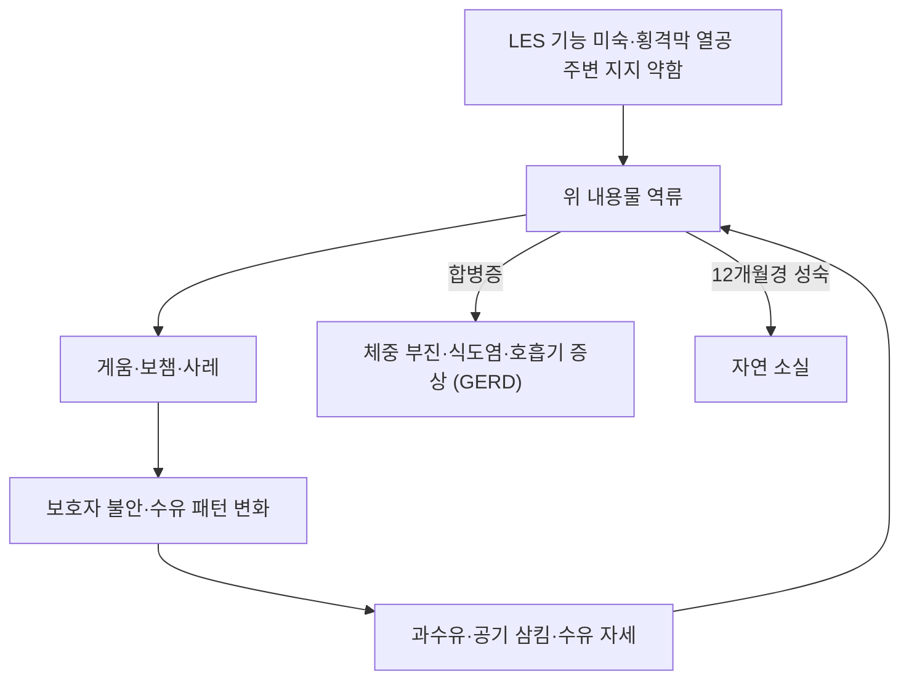

# 🩺 영아의 위식도 역류 (Infant gastroesophageal reflux, GER / GERD)

> **핵심 3줄 요약 (Key Summary)**:
> - 📍 병소 부위 & 해부·병태생리: **하부식도괄약근(LES) 기능 미숙**과 위 배출 지연으로 위 내용물이 식도로 역류한다. 대부분 **생리적 역류**이고 생후 12개월경 자연 호전된다
> - 🚩 전형적 임상 양상: 수유 직후의 **게움(regurgitation)** 과 보챔, 사레·기침. 성장이 정상이고 전반적으로 편안하면 '단순 역류(happy spitter)'로 본다
> - 🛠️ 핵심 감별 & 치료 전략: 체중 부진·반복 폐렴·식도염 등 **합병증이 동반된 GERD**와 단순 역류를 구분하는 것이 핵심이며, 1차 치료는 약물이 아니라 **수유·자세 관리 + 보호자 교육**이다
> - ⚠️ 응급 의뢰 레드플래그: 담즙성(초록) 또는 사출성 구토, 혈변, 체중 감소·성장 부진, 무기력·경련, 발열, 청색증·호흡 정지 — 즉시 소아과 응급 평가.

---

## 📌 목차
1. [질환 개요 & 병태생리](#1-질환-개요--병태생리)
2. [병태생리 메커니즘 & 악순환 네트워크](#2-병태생리-메커니즘--악순환-네트워크)
3. [임상 양상 & 진단 알고리즘](#3-임상-양상--진단-알고리즘)
4. [감별 진단 매트릭스 (Differential Diagnosis)](#4-감별-진단-매트릭스-differential-diagnosis)
5. [한의 통합 치료 프로토콜 (마사지·온열·첩부)](#5-한의-통합-치료-프로토콜-마사지온열첩부)
6. [양방 치료 & 병용·의뢰 기준 (Conventional Treatment & Referral)](#6-양방-치료--병용의뢰-기준-conventional-treatment--referral)
7. [수유·생활습관 & 보호자 티칭 가이드](#7-수유생활습관--보호자-티칭-가이드)
8. [💡 진료실 핵심 필기 & 임상 노하우](#8--진료실-핵심-필기--임상-노하우)
9. [출처 및 학술 참고 문헌 (References)](#9-출처-및-학술-참고-문헌-references)

---

## 1. 질환 개요 & 병태생리

> 🖼️ 이미지 미확보 — 영아 상부 소화관 해부 도해·역류 기전 도식은 확보 시 추가한다(이번 회차 확보 실패 기록).

* **정의 및 분류**:
  * **단순 역류(GER)**: 건강한 영아에서 나타나는 생리적 게움 — 성장 정상, 합병증 없음
  * **역류 질환(GERD)**: 역류로 **합병증**(체중 부진·식도염·반복 호흡기 증상)이 발생한 상태
  * **분비성 반사(silent reflux)** 성 양상: 게움 없이 보챔·사레·기침만 나타나는 경우
* **관련 구조**:
  * **주 이환 구조**: 하부식도괄약근(LES), 식도·[[횡격막]] 열공, 위 분문부
  * **조절계**: 자율신경·[[미주신경]] 긴장, 위 배출 속도
* **역학·경과**: 영아기에 매우 흔하고 **생후 12개월경 대부분 자연 소실**된다. 자연 경과가 좋기 때문에 중재 효과와 자연 호전을 구분하기 어렵다

---

## 2. 병태생리 메커니즘 & 악순환 네트워크

### 1) 핵심 기전
* **LES 성숙 미숙**: 하부식도괄약근의 기저압과 일시적 이완 조절이 미숙해 위 내용물이 역류한다
* **해부학적 지지**: [[횡격막]] 열공 주변 구조가 약해 역류 저항이 낮다 → [[횡격막]]
* **수유 요인**: 과수유·빠른 수유·수유 중 공기 삼킴이 위내압을 높여 역류를 악화시킨다
* **자율신경·장-뇌축**: 역류 자극이 보챔·수면 불안정을 만들고, 다시 수유 패턴이 흔들리는 상호작용 → [[미주신경]] · [[장-뇌축]]
* ⚠️ '역류가 영아 산통의 원인'이라는 단정은 근거가 약하다 — 두 상태는 **겹칠 뿐 인과가 확립되지 않았다** → [[영아 산통]]

### 2) 악순환
* 역류 → 보챔 → 보호자가 달래려 추가 수유 → 위내압 상승 → 역류 악화. 그래서 **수유량·간격 조정이 약물보다 앞선다**

---

## 3. 임상 양상 & 진단 알고리즘

### 1) 전형적 양상
* 수유 직후 또는 수유 중 **게움**, 옷·침구가 젖는 정도, 트림 시 함께 나오는 경우
* 보챔·몸 젖히기·사레·기침(특히 수유 직후), 반복되는 중이염·폐렴
* **성장은 정상**, 발작 사이에는 편안함 — 단순 역류의 특징

### 2) 객관적 평가
* **체중·성장곡선이 가장 중요한 지표** — 체중 증가가 멈추면 GERD 또는 다른 질환을 먼저 본다
* 신체검사: 복부 팽만·압통, 탈장, 인후 발적, 호흡음, 신경학적 이상
* **검사 적응**: 성장 부진·호흡기 합병증·약물 반응 불충분 시 — 식도 pH/impedance 검사, 상부위장관 조영, 내시경 등
* **질검사·강제 검사는 피한다** — 기질적 폐쇄가 의심되면 영상으로 접근한다

### 3) 판정
* ① 단순 역류(성장 정상) ② GERD 의심(합병증 동반) ③ **응급(폐쇄성·감염성 원인)**

---

## 4. 감별 진단 매트릭스 (Differential Diagnosis)

| 감별 | 특징적 양상 | 감별 포인트 |
| :--- | :--- | :--- |
| [[영아의 위식도 역류]] (본 질환) | 수유 직후 게움, 성장 정상 | 수유 연관성, 자연 경과 |
| [[영아 산통]] | 저녁 집중 발작적 울음 | 게움과 무관한 시간대 |
| 유문 협착 | 생후 2~6주 **사출성 비담즙성 구토**, 체중 감소 | 복부 종괴, 초음파 |
| 우유단백 알레르기 | 구토·설사·혈변·습진·성장 부진 | 식이 조정 반응 |
| 장중첩증 | 간헐적 심한 통증 발작, 젤리 모양 혈변 | 응급 초음파 |
| 감돈 탈장 | 서혜부·배꼽 단단한 종괴 | 즉시 정복·응급 |
| 감염·대사 질환 | 발열, 무기력, 구토 지속 | 혈액·소변 검사 |

> 🚩 **레드플래그**: 담즙성(초록) 구토, 사출성 구토, 혈변, 체중 감소, 무기력·경련, 발열, 청색증·호흡 정지.

---

## 5. 한의 통합 치료 프로토콜 (마사지·온열·첩부)

* **접촉·온열 중재(한의원 번안의 중심)**: 수유 후 30~45분 뒤 시계방향 복부 마사지 → 하지 굴곡-신전 → 트림 유도 → 저온 온구. 같은 원리가 도수치료 시험의 구성(횡요추·[[횡격막]] 기법·내장 기법)과 목표를 공유한다 → [[도수치료]] · [[뜸]]
* **횡격막·복압 조절**: 횡격막 이완과 복부 압 완화가 위내압을 낮추는 방향으로 작용한다 → [[횡격막]]
* **침구·첩부**: 영아에서는 자침을 피하고 **비침습 자극(지압·첩부·온열)** 을 우선한다 → [[경혈 첩부요법]]
* **한약**: 소아 한약은 용량·안전 문제로 소아과 협진 하에 제한적으로 접근한다. 消食導滯·和胃降逆 계열이 관례적으로 쓰여 왔으나 이번 논문 근거와 직접 연결되지는 않는다
* **주의**: 게움이 잦다고 무조건 위장 운동 촉진 자극을 강하게 주는 것은 역류 악화 위험이 있다 — 강도는 항상 저자극으로 시작한다

---

## 6. 양방 치료 & 병용·의뢰 기준 (Conventional Treatment & Referral)

* **비약물 우선 (1차)**:
  * 수유량·간격 조정(과수유 회피), 수유 후 **30분 직립 자세**, 트림 철저, 수면 자세 관리
  * 필요 시 두껍게 만든(thickened) 분유, 우유단백 불내성 의심 시 식이 조정
* **약물**: 산분비 억제제(PPI·H2 수용체 길항제)는 **합병증이 확인된 GERD에서 단기간** 사용한다. 단순 역류에는 권고되지 않는다 — 영아 장기 사용의 감염·영양 위험이 논의된다
* **수술·시술**: Nissen 위저추벽성형술 등은 **약물·보존 치료에 반응하지 않는 중증 합병증**에 한정되며 매우 드물다
* **한의 병용 판단**: 마사지·온열·첩부는 병용 가능. **경추 회전 도수는 영아에서 절대 시행하지 않는다**
* **소아과 의뢰 기준**: 레드플래그 전부 + 체중 증가 정지 + 반복 폐렴·기침 + 약물 반응 불충분
* **연구 연결**: 영아 산통 도수치료 RCT에서 이 상태는 **배제 기준**으로 명시되었고, 동시에 **역류 점수가 1·2·3주 내내 유의하게 낮아진 2차 결과**가 보고되었다 → [[영아 산통]]

---

## 7. 수유·생활습관 & 보호자 티칭 가이드

* **수유 방법**: 한 번에 많이 먹이지 않고 소량씩 자주, 수유 중 공기 삼킴 최소화, 수유 후 **30분 직립**·트림
* **절대 하지 말 것**: 수유 직후 눕혀 재우기, 과도한 흔들기, 사레 들 때 무리하게 물·분유 더 먹이기
* **기록지**: 게움 횟수·양상(분수·커피색 여부), 수유량, 배변, 체중을 기록하게 한다
* **정기 추적**: 2주 간격 체중·성장곡선 확인. **생후 12개월경 자연 소실**된다는 점을 미리 알려 보호자 불안을 낮춘다
* **참고**: 수유·안정화 교육은 산통 관리와 동일한 흐름으로 묶어 지도하면 순응도가 올라간다 → [[영아 산통]]

---

## 8. 💡 진료실 핵심 필기 & 임상 노하우

* **첫 질문 3개**: ① 체중이 늘고 있는가 ② 구토가 사출성·담즙성인가 ③ 수유 직후만인가 하루 종일인가 — 이 셋으로 응급과 단순 역류가 대부분 갈린다
* **"성장이 정상이면 약을 먼저 쓰지 않는다"**: 단순 역류에서 산분비 억제제는 적응이 아니다. 대신 수유·자세·보호자 교육을 먼저 처방한다
* **게움의 색이 핵심**: 우유색이면 단순, **커피색(혈액)·초록색(담즙)** 이면 즉시 의뢰 대상이다
* **한의원에서의 역할**: 마사지·온열·첩부 + 보호자 교육. 체중 곡선이 꺾이거나 반복 폐렴이 있으면 도수·마사지를 멈추고 소아과로 넘긴다
* **감별 함정**: 산통으로 의뢰된 영아에서 게움이 주 증상이면 역류를 먼저 검토한다 — 두 상태가 겹치는 경우가 흔하다

---

## 9. 출처 및 학술 참고 문헌 (References)

1. **MSD 매뉴얼 전문가용** — 위식도 역류(GER), 소아과. [링크](https://www.msdmanuals.com/professional)
   - [연구 요약] 영아 GER/GERD의 정의·생리적 역류와 합병증 동반 역류의 구분·진단·치료 원칙.
2. **Healthcare (Basel)** — Osteopathic Manual Therapy for Infant Colic: A Randomised Clinical Trial. 2023;11(18):2600. [PMID 37761797](https://pubmed.ncbi.nlm.nih.gov/37761797/)
   - [연구 요약] 역류·Sandifer 증후군·식품 불내성·신경계 질환 영아는 배제 기준으로 명시되었고, 시험군에서 **역류 점수가 1·2·3주 추적 내내 유의하게 낮았다**(P=.05, .05, .04). 산통 중증도 전체는 유의차 없음.
3. **Nelson Textbook of Pediatrics** — Gastroesophageal Reflux in Infants (소아 소화기 장)
   - [연구 요약] LES 성숙 미숙·자연 경과(12개월경 소실)·합병증 기준과 검사 적응을 정리한 표준 교과서 기술.

---

## 관련 노트
- [[영아 산통]] · [[미주신경]] · [[횡격막]] · [[도수치료]] · [[뜸]] · [[경혈 첩부요법]] · [[장-뇌축]] · [[기능성 복통]] · [[기능성 소화불량]]
- [[2026-09-27_부인과소아과_심층리뷰]] 3번 · [[2026-09-27_부인과소아과_개념학습]]
