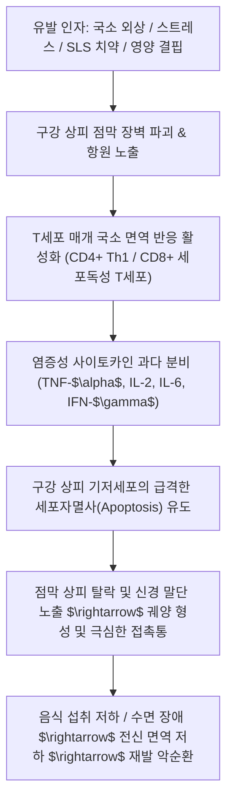

# 🩺 구내염 (口內炎, Stomatitis / KCD K12)

> **핵심 3줄 요약 (Key Summary)**:
> - 📍 병소 부위 & 병태생리: 구강 점막(협점막, 설하, 치은, 구순 등) 상피세포의 국소 괴사와 궤양을 특징으로 하는 염증성 질환; 대표적으로 T세포 매개 국소 면역 반응과 TNF-$\alpha$ 과다 분비로 인한 [[재발성 아프타성 구내염]](RAS), 단순포진바이러스(HSV-1), 진균(Candida albicans) 감염.
> - 🚩 전형적 임상 양상 & 3대 징후: 황백색 위막으로 덮인 원형~타원형 궤양, 선홍색 홍반성 달무리(Erythematous halo), 작열감 및 섭식·발화 시 극심한 접촉통.
> - 🛠️ 핵심 감별 검사 & 한·양방 치료: 단순 아프타 vs 각화점막 침범 포진(HSV) vs [[베체트병]]·[[크론병]] 전신 질환 감별; 국소 스테로이드·소독 가글, 한의학 심비적열(心脾積熱)·음허화왕(陰虛火旺) 변증에 따른 [[도적산]], [[황련해독탕]], [[감초사심탕]] 및 합곡·족삼리 침구 치료.
> - ⚠️ 악성 종양 레드플래그: 3주 이상 낫지 않는 단일 궤양, 통증 없는 단단한 경결(Induration) 동반 시 구강 편평세포암종 감별을 위한 즉각적 조직생검 의뢰 필수.

---

## 📌 목차
1. [질환 개요 & 해부학적 병태생리](#1-질환-개요--해부학적-병태생리)
2. [병태생리 메커니즘 & 생체역학적 악순환 네트워크](#2-병태생리-메커니즘--생체역학적-악순환-네트워크)
3. [임상 증상 & 이학적 검사(Physical Exam) 알고리즘](#3-임상-증상--이학적-검사physical-exam-알고리즘)
4. [감별 진단 매트릭스 (Differential Diagnosis)](#4-감별-진단-매트릭스-differential-diagnosis)
5. [한의 통합 치료 프로토콜 (침·약침·추나·한약)](#5-한의-통합-치료-프로토콜-침약침추나한약)
6. [재활 운동 & 생활습관 티칭 가이드](#6-재활-운동--생활습관-티칭-가이드)
7. [💡 사용자 진료실 핵심 필기 & 임상 노하우 (Melt-In 잔여 심화 집약)](#7--사용자-진료실-핵심-필기--임상-노하우-melt-in-잔여-심화-집약)
8. [출처 및 학술 참고 문헌 (References)](#8-출처-및-학술-참고-문헌-references)

---

## 1. 질환 개요 & 해부학적 병태생리

![[구내염_아프타성_궤양.png|500]]
> [그림 1: ① 병태생리·영상 — 하순 점막의 전형적인 재발성 아프타성 구내염(RAS): 중심부 회백색 위막 및 주변 홍반성 테두리]

* **질환 정의 및 개요**:
  * 구내염(Stomatitis)은 뺨 안쪽(협점막), 입술 안쪽(순측 점막), 혀, 잇몸, 입천장 등 구강 점막에 발생하는 모든 염증성 병변을 총칭하는 용어입니다.
  * 가장 흔한 형태는 전 인구의 약 20%가 평생 동안 반복적으로 경험하는 **재발성 아프타성 구내염(Recurrent Aphthous Stomatitis, RAS)**이며, 그 외 단순포진바이러스(HSV-1) 감염, 구강 칸디다증(Candida albicans), 외상성 점막 궤양, 전신 자가면역 질환의 구강 발현으로 분류됩니다.
* **구강 점막의 해부학적 분류와 호발 부위**:
  * **비각화 점막(Non-Keratinized Mucosa)**: 협점막(뺨 안쪽), 구순 점막(입술 안쪽), 설하면(혀 아랫면), 구강저, 연구개 등 유연한 점막 구역. **재발성 아프타성 구내염(RAS)의 절대 호발 부위**입니다.
  * **각화 점막(Masticatory / Keratinized Mucosa)**: 부착치은(잇몸), 경구개(단단한 입천장), 설배면(혀 윗면). 저작 압력을 견디도록 각화되어 있어 아프타성 궤양은 거의 발생하지 않으나, **단순포진(HSV-1)이나 대상포진 바이러스 궤양이 호발**하는 해부학적 특징을 가집니다.
* **역학적 특성**:
  * 10~40대 젊은 연령층과 여성에서 호발하며, 사회경제적 수준이 높거나 실내 근무자에서 유병률이 높게 보고됩니다. 소아에서는 원발성 포진성 치은구내염의 빈도가 높습니다.

---

## 2. 병태생리 메커니즘 & 생체역학적 악순환 네트워크

![[구내염_구강_해부도.png|450]]
> [그림 2: ② 관련 해부 구조물 — 구강 점막 및 발음·저작 구조 해부 도해]

### 1) 면역학적 세포독성 기전 (Cell-Mediated Cytotoxicity)
* 아프타성 구내염의 중심 병태는 T세포 매개 면역 반응의 조절 장애입니다.
* 유발 자극에 의해 점막 고유판에 $CD4^+$ Th1 림프구와 $CD8^+$ 세포독성 T림프구가 집결하며, 강력한 염증 유발 매개체인 **종양괴사인자(TNF-$\alpha$)**가 대량 방출되어 구강 점막 상피세포의 DNA 단편화와 세포자멸사(Apoptosis)를 촉발합니다.

### 2) 점막 미세 외상 및 물리적 요인
* 칫솔질 중 미끄러짐, 딱딱한 음식물(튀김, 뼈)에 의한 긁힘, 저작 중 뺨이나 입술 씹힘, 교정기나 보철물에 의한 만성 기계적 마찰이 점막 기저막을 손상시켜 항원 침투를 유발합니다.
* 치약에 함유된 합성 계면활성제인 **라우릴황산나트륨(Sodium Lauryl Sulfate, SLS)**은 점막 보호 뮤신(Mucin) 층을 용해시켜 점막 투과성을 비정상적으로 높입니다.

### 3) 전신 신경-내분비-영양학적 조절 장애
* **스트레스와 HPA 축**: 시험, 과로, 정서적 불안 시 시상하부-뇌하수체-부신 축이 과활성화되어 침샘 분비가 감소하고 면역글로불린(Secretory IgA)이 결핍되어 점막 저항력이 붕괴됩니다.
* **영양 결핍**: 비타민 $B_{12}$(Cobalamin), 엽산(Folate), 철분(Iron), 아연(Zinc) 결핍은 상피세포의 재생 주기를 지연시켜 미세 손상이 깊은 궤양으로 급속히 악화됩니다.

---

## 3. 임상 증상 & 이학적 검사(Physical Exam) 알고리즘

![[구내염_헤르페스_구순포진.png|450]]
> [그림 3: ① 병태생리·영상 — 입술 경계부의 단순포진바이러스(HSV-1) 구순포진(Herpes labialis) 수포성 병변]

### 1) 재발성 아프타성 구내염(RAS) 3대 임상 아형

| 임상 아형 | 발생 빈도 | 궤양 직경 및 개수 | 호발 부위 및 병변 특징 | 치유 기간 및 흉터 유무 |
| :--- | :--- | :--- | :--- | :--- |
| **소아프타 (Minor RAS)** | **80~85%** | 직경 < 10mm (보통 2~6mm), 1~5개 발생 | 협점막, 순측 점막, 구강저 등 **비각화 점막**; 얕은 타원형 궤양, 홍반 테두리 | 7~14일 내 **반흔(흉터) 없이 완전 치유** |
| **대아프타 (Major RAS)** | 10~15% | 직경 > 10mm (1~3cm), 1~3개 발생 | 연구개, 인두부, 구개수; **깊고 단단한 분화구상 궤양**, 격심한 연하통 | 2~6주 이상 지속, **치유 후 섬유성 반흔 남김** |
| **포진양 아프타 (Herpetiform)** | 5~10% | 직경 1~3mm 미세 궤양, **10~100개 집단 발생** | 구강 점막 전반; 미세 궤양들이 융합하여 크고 불규칙한 지도상 궤양 형성 | 7~15일 내 치유, 반흔 드묾 |

### 2) 전형적 주소증 및 감각 신경 증상
* **작열감(Burning sensation)**: 궤양 출현 24~48시간 전 국소 점막의 찌릿함, 가려움, 열감의 전구 증상이 선행.
* **접촉통 및 섭식 장애**: 맵거나 짠 자극성 음식 섭취 시, 양치 시, 발화(대화) 시 신경 말단 자극으로 날카로운 통증 발생.

### 3) 이학적 검사 알고리즘
* **시진(Inspection)**:
  * 궤양의 기저부(회백색 섬유소성 가막), 변연부(선홍색 홍반성 테두리), 주위 점막의 색조를 관찰합니다.
* **촉진(Palpation)**:
  * 궤양 기저부를 만져보아 부드러운지(Soft), 단단한 경결(Induration)이 만져지는지 확인합니다 (경결 동반 시 악성 종양 의심).
* **경부 림프절 촉진**:
  * 악하림프절(Submandibular), 이개전/후 림프절, 경부 림프절의 종대 및 압통 유무를 평가하여 전신 감염성 여부를 감별합니다.

---

## 4. 감별 진단 매트릭스 (Differential Diagnosis)

![[구내염_칸디다증.jpg|450]]
> [그림 4: ① 병태생리·영상 — 면역저하자 구강 점막의 칸디다증(Candida albicans / 아구창): 문지르면 벗겨지는 백색 판상 병변]

| 감별 질환 | 호발 병소 및 병인체 | 임상 병변 특징 | 감별 핵심 포인트 |
| :--- | :--- | :--- | :--- |
| **아프타성 구내염 (RAS)** | 비각화 점막 (협점막, 입술) | 황백색 위막, 둥근 궤양, 홍반 테두리 | **수포 선행 없음**, 각화 점막 침범 드묾 |
| **헤르페스 구내염 (HSV-1)** | **각화 점막 (치은, 경구개)**, 입술 | **군집된 소수포 형성 후 파열**되어 궤양화 | 전신 발열, 치은 부종·출혈 동반, Tzanck 양성 |
| **구강 칸디다증 (진균)** | 혀, 협점막, 구개 | 우유 찌꺼기 같은 백백색 가막(위막) | **거즈로 닦아내면 벗겨지며 출혈점** 노출 |
| **[[베체트병]]** | 구강, 생식기, 안구, 피부 | 재발성 아프타와 동일한 구강 궤양 | **생식기 궤양, 포도막염**, 결절성 홍반 동반 |
| **[[크론병]]** | 구강 전반, 전장관 | 깊은 선상 궤양(Linear), 자갈길(Cobblestone) | 복통, 만성 설사, 체중감소 장관 증상 선행 |
| **구강 편평상피암 (SCC)** | 혀 측면, 구강저, 치조제 | **3주 이상 불유합, 궤양 기저부 단단한 경결** | 통증 적고 출혈 경향, 조직생검 악성 확진 |

### 🚩 악성 종양 및 전신 질환 감별 경고 징후 (Red Flag Signs)
다음 소견이 관찰되면 단순 아프타성 구내염이 아니므로 즉시 구강악안면외과 또는 이비인후과 조직생검을 의뢰해야 합니다:
1. **단일 궤양이 3주 이상 자연 치유되지 않고 지속되거나 크기가 커질 때**.
2. **궤양 기저부나 변연부에 단단한 결절성 경결(Induration)이 만져질 때**.
3. **궤양 주변에 긁어도 벗겨지지 않는 백반증(Leukoplakia)이나 홍반증(Erythroplakia)이 동반될 때**.
4. **동측 경부 림프절이 단단하게 만져지고 고정(Fixed)되어 있을 때**.
5. **원인 불명의 음경/음순 생식기 궤양이나 시력 저하, 관절통이 동반될 때 (베체트병 의심)**.

---

## 5. 한의 통합 치료 프로토콜 (침·약침·추나·한약)

![[구내염_청심사화_본초_황련.jpg|400]]
> [그림 5: ③ 치료·시술점 — 청열조습·청심사화 구내염 핵심 생약 황련(Coptis japonica) 실물]

한의학에서는 구내염을 **구창(口瘡)**, **구미(口糜)**, **구설생창(口舌生瘡)**의 범주로 다루며, 심열(心熱)이 위로 타오르는 심화상염(心火上炎) 및 비열(脾熱)이 입술로 나타나는 심비적열(心脾積熱), 그리고 만성적으로 음액이 고갈된 음허화왕(陰虛火旺)을 3대 핵심 병기로 파악합니다.

### 1) 변증 분류 및 대표 처방 (Syndrome Differentiation)

| 변증 유형 | 주증 및 설맥 | 병리 기전 | 대표 방제 | 핵심 본초 구성 및 약리 기전 |
| :--- | :--- | :--- | :--- | :--- |
| **심비적열형** (급성 실화·열독) | 궤양 통증 격심, 구갈, 구취, 구설작열, 소변황적, 설홍태황, 맥삭 | 심화와 비위 열독이 경락을 따라 구강 상피를 작상 | [[도적산]] 합 [[양격산]] | [[생지황]](양혈청열), [[목통]], [[담죽엽]](도열하행), [[황련]], [[연교]](청열소염) |
| **음허화왕형** (만성 재발·허화) | 만성 반복 궤양, 오후 미열, 야간 도한, 조열, 오심번열, 설홍소태, 맥세삭 | 신음 부족으로 허화(虛火)가 상염하여 점막 손상 | [[지백지황환]] 합 [[가미청위산]] | [[숙지황]], [[산수유]], [[지모]], [[황백]](자음강화), [[단삼]](양혈), [[승마]](승산) |
| **비위습열형** (식적·비만) | 궤양 주변 황색 위막 두터움, 복부 팽만, 구점, 무른변, 설태황니, 맥활 | 과식·음주로 습열이 중초에 정체되어 구강 발현 | [[감초사심탕]] 합 [[황련해독탕]] | [[감초]](대량 12g, 점막 보호), [[황금]], [[황련]](베르베린 항균), [[반하]], [[건강]] |
| **기혈양허형** (피로·노권) | 과로 후 궤양 발현, 창면 담백색, 피로무력, 식욕부진, 설담태백, 맥침세 | 기혈 부족으로 점막 상피 세포의 자가 재생능 상실 | [[보중익기탕]] 합 [[탁리소독음]] | [[황기]](탁창생기), [[당귀]], [[인삼]], [[백출]], [[금은화]](소염해독) |

### 2) 침구 및 약침 치료 프로토콜
* **원위 사지 및 경락 청열 배혈**:
  * **합곡(LI4, 수양명대장경 원혈)**: 구면부 질환의 절대 요혈로 안면 및 구강 점막의 급성 염증과 극심한 진통 제어.
  * **노궁(PC8, 수궐음심포경 형혈) / 소충(HT9, 수소음심경 정혈)**: 심화(心火)를 사하여 혓바늘과 혀끝 궤양 통증을 신속 경감.
  * **내정(ST44, 족양명위경 형혈)**: 위열(胃熱)을 청열하여 잇몸 및 협점막 궤양 완화.
  * **족삼리(ST36) 및 삼음교(SP6)**: 비위 기혈 순환 촉진 및 점막 상피 회복력 강화.
* **약침 치료 (Pharmacopuncture)**:
  * **황련해독탕 약침**: 급성 화농성 위막 형성 시 합곡(LI4), 풍지(GB20)에 각 0.3cc 시술하여 전신 염증 반응 진정.
  * **자하거(Hominis Placenta) 약침**: 만성 허증 재발성 아프타 환자의 족삼리(ST36), 비수(BL20)에 주입하여 점막 면역력 증강.
* **한방 외용제 (Topical Applications)**:
  * **청대산(靑黛散) / 황백 분말**: 청대, 황백, 빙편을 미세 분말로 조제하여 궤양 부위에 직접 분무 도포(청열해독, 진통, 수렴 촉진).
  * **천연 봉밀(꿀) 도포**: 꿀의 고삼투압 및 천연 플라보노이드 항균 작용으로 점막 궤양 피복.

### 3) 양방 치료 약리 비교
* **국소 스테로이드**: 트리암시놀론 아세토니드(Triamcinolone acetonide, 오라메디 연고) 도포 - 초기 염증 세포 침윤 및 부종 차단.
* **국소 진통 소독제**: 벤지다민(Benzydamine 가글), 클로르헥시딘(Chlorhexidine 0.12% 가글) - 2차 세균 감염 방지.
* **전신 면역조절제**: 중증 대아프타(Major RAS) 시 콜히친(Colchicine) 또는 단기 전신 스테로이드 경구 투여.

---

## 6. 재활 운동 & 생활습관 티칭 가이드

### 1) 구강 위생 및 덴탈 케어 수칙
* **SLS-Free (라우릴황산나트륨 무첨가) 치약 사용**:
  * SLS 성분이 점막 단백질을 변성시키고 보호 점액을 녹이므로, 반드시 계면활성제가 없거나 천연 계면활성제를 사용한 치약을 선택합니다.
* **미세모 칫솔 사용 및 양치 습관 교정**:
  * 단단한 칫솔모는 점막에 미세 찰과상을 유발하므로 초극세모를 사용하고, 부드러운 회전법으로 양치합니다.

### 2) 영양 보충 및 식이 가이드
* **점막 재생 필수 영양소 섭취**:
  * 비타민 $B_{12}$(육류, 조개류), 엽산(시금치, 브로콜리), 아연(굴, 호박씨), 비타민 C 섭취를 적극 권장합니다.
* **자극성 음식 철저 회피**:
  * 궤양 치유기 동안은 고추, 마늘, 후추 등 매운 음식, 레몬·토마토 등 강산성 과일, 딱딱한 스낵류 섭취를 엄격히 제한합니다.

### 3) 스트레스 관리 및 면역 리듬
* 충분한 수면(1일 7시간 이상) 확보: 수면 부족은 코르티솔 분비를 촉발하여 구강 점막 상피 세포 사멸을 촉진합니다.
* 식후 미온수 또는 생리식염수로 구강을 가볍게 헹구어 음식물 찌꺼기로 인한 세균 증식을 억제합니다.

---

## 7. 💡 사용자 진료실 핵심 필기 & 임상 노하우 (Melt-In 잔여 심화 집약)

> [!IMPORTANT]
> **🛡️ 원문 융합(Melt-In) 및 7번 섹션 특화 기록**
> 기존 필기의 핵심 요약, 병태생리, 치료 원칙 및 전신질환 연관성은 상부 1~6번 섹션에 100% 완벽히 융합되었습니다. 본 섹션에는 진료실에서 즉시 활용할 수 있는 감별 직관 팁과 한약 처방 손맛 노하우를 집약합니다.

### 1) 비각화 점막(아프타) vs 각화 점막(헤르페스) 1초 감별 직관
* 환자가 입안이 헐어서 내원했을 때 병변의 위치를 가장 먼저 확인합니다:
  * **뺨 안쪽, 입술 안쪽, 혀 밑바닥(비각화 점막)**에만 궤양이 있다 $\rightarrow$ 95% 이상 **재발성 아프타성 구내염(RAS)**.
  * **잇몸(치은)이나 단단한 입천장(경구개)**에 궤양이나 물집이 있다 $\rightarrow$ 바이러스성 **단순포진(HSV-1)** 의심 (Tzanck 검사 또는 항바이러스제 고려).

### 2) 만성 재발 환자에서 [[감초사심탕]]의 점막 치유 극대화 비결
* 만성적으로 입안이 헐어서 밥을 못 먹고 신경이 쇠약해진 환자에게 [[감초사심탕]]을 처방할 때는 **[[감초]]의 용량을 12~16g으로 대량 투여**합니다.
* 감초의 주성분인 글리시리진(Glycyrrhizin)은 국소 항염증 작용과 더불어 점막 상피세포의 EGF 수용체를 활성화하여 궤양면의 육아조직 형성을 극적으로 앞당깁니다.

### 3) 베체트병 초기 선별을 위한 진료실 3대 필수 질문
* 1년에 3회 이상 심한 아프타성 구내염이 반복되는 젊은 환자에게는 다음 3가지를 반드시 문진합니다:
  1. *"외음부나 성기 주변에 헐거나 아픈 상처가 난 적이 있습니까?"*
  2. *"눈이 충혈되거나 안개가 낀 것처럼 흐릿하게 보인 적이 있습니까?"*
  3. *"피부에 여드름 같은 뾰루지나 다리에 붉고 아픈 멍울이 만져집니까?"*
  * 하나라도 해당되면 류마티스내과 협진을 신속히 의뢰합니다.

### 4) 원장님 특화 외용 '봉밀(꿀) 도포법' 티칭
* 야간 취침 직전, 궤양 부위의 침을 깨끗한 면봉으로 살짝 닦아낸 후 **순수 천연 벌꿀(봉밀)을 궤양에 듬뿍 얹고 취침**하도록 지도합니다.
* 꿀의 고삼투압 항균 작용과 상처 치유 촉진 효과로 다음 날 아침 접촉통이 현저히 감소합니다.

---

## 8. 출처 및 학술 참고 문헌 (References)

1. **Edgar NR, Saleh D, Miller RA.** Recurrent Aphthous Stomatitis: A Review. *J Clin Aesthet Dermatol*. 2017;10(3):26-36. [PubMed (PMID: 28435777)](https://pubmed.ncbi.nlm.nih.gov/28435777/)
   - **[연구 요약]**: 재발성 아프타성 구내염의 역학, 병인론(면역학적 T세포 기전 및 유전적 감수성), 3대 임상 분류(Minor, Major, Herpetiform)와 최신 국소·전신 치료 지침을 총망라한 임상 리뷰.
2. **Plewa MC, Chatterjee K.** Aphthous Stomatitis. *StatPearls [Internet]*. Treasure Island (FL): StatPearls Publishing; 2023. [NCBI Bookshelf (NBK431059)](https://www.ncbi.nlm.nih.gov/books/NBK431059/)
   - **[연구 요약]**: 국립생명공학정보센터(NCBI)의 권위 있는 가이드로 아프타성 구내염의 병태생리, 전신 질환(베체트병, 크론병)과의 감별 포인트, 1차 및 2차 치료 전략을 체계화함.
3. **Belenguer-Guallar I, Jiménez-Soriano Y, Claramunt-Lozano A.** Treatment of recurrent aphthous stomatitis: A literature review. *J Clin Exp Dent*. 2014;6(2):e168-e174. doi:10.4317/jced.51401. [PubMed (PMID: 24790718)](https://pubmed.ncbi.nlm.nih.gov/24790718/)
   - **[연구 요약]**: 아프타성 구내염에 대한 다양한 국소 치료제(클로르헥시딘, 트리암시놀론, 레이저) 및 전신 요법의 유효성을 분석하고 통증 완화와 치유 기간 단축 효과를 검증함.
4. **Slebioda Z, Szponar E, Kowalska A.** Etiopathogenesis of recurrent aphthous stomatitis. *Postepy Dermatol Alergol*. 2014;31(2):96-102. doi:10.5114/pdia.2014.40925. [PubMed (PMID: 25254011)](https://pubmed.ncbi.nlm.nih.gov/25254011/)
   - **[연구 요약]**: RAS 환자에서 Th1 면역 반응 활성화, TNF-$\alpha$ 유전자 다형성, 국소 미세순환 장애 및 산화 스트레스의 역할을 규명한 병태생리학적 기초 연구.

<!-- 보관 태그(1회용·링크오류, 필요시 복원): 점막질환 -->
