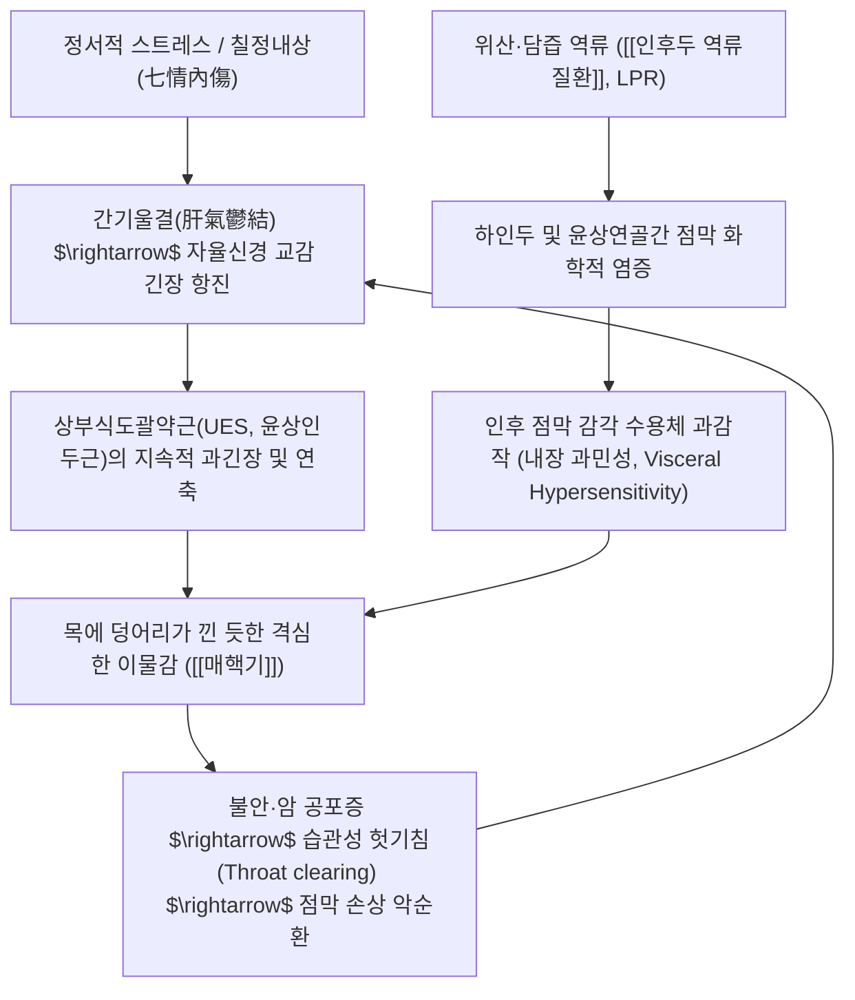

# 🩺 매핵기 (梅核氣, Globus Pharyngeus / KCD R07.0)

> **핵심 3줄 요약 (Key Summary)**:
> - 📍 병소 부위 & 병태생리: 목구멍(인후부)에 매실 씨앗(梅核)이나 구운 고기 조각(炙臠)이 걸린 듯한 이물감이 있으나 기질적 종괴나 협착 병변은 없는 기능성 식도 질환; 현대의학적으로 인후두 역류(LPR), 상부식도괄약근(UES) 과긴장, 내장 과민성 및 스트레스·불안에 의한 신체화 반응이 복합 작용.
> - 🚩 전형적 임상 양상 & 3대 징후: 공복 시 침을 삼킬 때(Dry swallow) 이물감이 극대화되고 **음식물이나 물을 삼킬 때는 오히려 이물감이 소실**되는 역설적 특징, 뱉으려 해도 나오지 않고 삼키려 해도 넘어가지 않음(喀之不出 嚥之不下), 습관성 헛기침(Throat clearing).
> - 🛠️ 핵심 감별 검사 & 한·양방 치료: 이비인후과 후두경 검사(종양 및 LPR 소견 배제); 양방 PPI·위장관운동촉진제 시도, 한의학 칠정기체(七情氣滯)·기체담응(氣滯痰凝) 변증에 따른 금궤요략 명방 [[반하후박탕]], [[가미소요산]] 및 조해(KI6)·염천(CV23)·단중(CV17) 침구 치료.
> - ⚠️ 악성 종양 레드플래그: 고형 음식물이 걸리는 진성 연하곤란, 삼킬 때 찢어지는 연하통, 2주 이상 지속되는 쉰 목소리, 체중 감소, 경부 림프절 종대 동반 시 즉각적인 두경부/식도 암 정밀검사 필수.

---

## 📌 목차
1. [질환 개요 & 해부학적 병태생리](#1-질환-개요--해부학적-병태생리)
2. [병태생리 메커니즘 & 생체역학적 악순환 네트워크](#2-병태생리-메커니즘--생체역학적-악순환-네트워크)
3. [임상 증상 & 이학적 검사(Physical Exam) 알고리즘](#3-임상-증상--이학적-검사physical-exam-알고리즘)
4. [감별 진단 매트릭스 (Differential Diagnosis)](#4-감별-진단-매트릭스-differential-diagnosis)
5. [한의 통합 치료 프로토콜 (침·약침·추나·한약)](#5-한의-통합-치료-프로토콜-침약침추나한약)
6. [재활 운동 & 생활습관 티칭 가이드](#6-재활-운동--생활습관-티칭-가이드)
7. [💡 사용자 진료실 핵심 필기 & 임상 노하우 (Melt-In 잔여 심화 집약)](#7--사용자-진료실-핵심-필기--임상-노하우-melt-in-잔여-심화-집약)
8. [출처 및 학술 참고 문헌 (References)](#8-출처-및-학술-참고-문헌-references)

---

## 1. 질환 개요 & 해부학적 병태생리

![[매핵기_위식도역류_GERD.png|500]]
> [그림 1: ① 병태생리·영상 — 위식도 역류(GERD) 및 인후두 역류(LPR)에 의한 인후 점막 자극과 이물감 유발 기전]

* **질환 정의 및 문헌적 기원**:
  * 매핵기(梅核氣)는 한의학 고전인 장중경의 《금궤요략(金匱要略)》 부인잡병맥증병치에서 **"부인 인중여유자련상, 반하후박탕주지(婦人咽中如有炙臠, 半夏厚朴湯主之)"**로 최초 기술된 병증입니다.
  * 환자는 목구멍 안에 구운 고기 조각이나 매실 씨앗이 걸려 뱉으려 해도 나오지 않고 삼키려 해도 넘어가지 않는(喀之不出 嚥之不下) 고통을 호소하지만, 내시경 및 영상 검사 상 기질적인 통로 폐쇄나 종양은 발견되지 않는 대표적 기능성 식도 질환(Functional Globus, Rome IV 기준)입니다.
* **관련 해부학적 구조물**:
  * **인두(Pharynx) 및 후두(Larynx)**: 비인두, 구인두, 하인두로 구성되며 미주신경(CN X)과 설인신경(CN IX)의 풍부한 지각 신경총이 분포하여 미세 자극에도 극도로 민감하게 반응합니다.
  * **상부식도괄약근(Upper Esophageal Sphincter, UES)**: 윤상인두근(Cricopharyngeus muscle)에 의해 형성되는 고압대(High-pressure zone)로, 안정 시 기저압(30~60mmHg)을 유지하여 공기 유입과 식도 내용물의 역류를 차단합니다.
  * **설골(Hyoid bone) 및 후두개(Epiglottis)**: 연하 시 상전방으로 이동하여 기도를 폐쇄하는 생체역학적 핵심 구조입니다.
* **역학적 특성**:
  * 일반 인구의 약 46%가 일생에 한 번 이상 경험하며, 이비인후과 및 한방소화기내과 외래 환자의 약 4~10%를 차지합니다.
  * 남녀 모두에서 발생하나 중년 여성(40~50대)에서 호발하며, 정서적 스트레스 및 폐경 전후 호르몬 변화와 밀접한 상관관계를 보입니다.

---

## 2. 병태생리 메커니즘 & 생체역학적 악순환 네트워크

![[매핵기_인후두_해부도.jpg|450]]
> [그림 2: ② 관련 해부 구조물 — 비강-인두-구강-후두의 해부학적 주행 및 윤상인두근 부위 도해]

### 1) 인후두 역류질환 (Laryngopharyngeal Reflux, LPR)
* 매핵기 환자의 50~70%에서 LPR이 동반됩니다.
* 식도 점막과 달리 인후두 상피세포는 중탄산염 분비능이나 치밀이음부 장벽이 매우 취약하여, 미량의 위산과 펩신(Pepsin)이 기화 또는 미세 분무(Aerosol) 형태로 하인두로 역류하기만 해도 중증 화학적 화상과 미세 신경염을 일으킵니다.
* 활성화된 펩신이 후두 점막 수용체(TRPV1)를 자극하여 윤상인두근의 반사적 연축(Reflex Cricopharyngeal Spasm)을 유도합니다.

### 2) 상부식도괄약근(UES) 기능 부전 및 근육 긴장
* 정서적 스트레스나 분노, 억울(抑鬱) 상태에서는 뇌간의 자율신경 중추가 교감신경 긴장도를 급격히 높입니다.
* 이로 인해 윤상인두근의 안정 시 수축압이 병적으로 상승하여 식도 입구가 꽉 조여지게 되고, 환자는 이를 "목이 조여오고 돌덩이가 낀 것 같다"고 인지하게 됩니다.

### 3) 뇌-장관 축과 내장 감각 과민성 (Visceral Hypersensitivity)
* 대뇌 전대상피질(ACC)과 도체(Insula)의 감각 필터링 기전이 손상되어, 정상인에게는 전혀 느껴지지 않는 정상 타액의 통과나 후두 연골의 미세 마찰 자극조차 "거대한 이물질"로 증폭되어 지각됩니다.

### 4) 습관성 헛기침(Throat Clearing)의 생체역학적 악순환
* 이물감을 해소하기 위해 환자는 1분에도 수차례씩 "큼-큼"거리는 헛기침을 하거나 마른침을 억지로 삼킵니다.
* 헛기침 시 발생하는 성대와 후두 점막의 강한 기계적 충돌(Mechanical trauma)은 점막 부종을 가중시켜 이물감을 더욱 증폭시키는 악순환을 만듭니다.

---

## 3. 임상 증상 & 이학적 검사(Physical Exam) 알고리즘

### 1) 전형적 증상 및 임상적 3대 특징
1. **역설적 완화 (Paradoxical Relief with Food)**:
   * **공복 시 또는 마른침을 삼킬 때(Dry swallow)**는 목에 매실 씨가 걸린 듯 답답함이 극에 달하지만, **식사 시 밥이나 국, 고형 음식을 섭취할 때는 이물감이 완전히 사라지거나 호전**됩니다. (진성 식도 폐쇄 질환과의 결정적 감별점).
2. **배출 및 연하 불능 (喀之不出 嚥之不下)**:
   * 가래인 줄 알고 아무리 기침을 하고 뱉어내려 해도 뱉어지지 않고, 삼키려 해도 위장관으로 내려가지 않음.
3. **정서 상태와의 동기화**:
   * 신경을 쓰거나 스트레스를 받으면 증상이 급격히 악화되고, 일에 몰두하거나 편안히 쉴 때는 증상을 잊고 지냄.

### 2) 이학적 검사 알고리즘
* **후두경 검사 (Laryngoscopy)**:
  * 인후두 암종, 낭종, 성대 결절, 이물 유무를 직접 확인합니다.
  * LPR 소견인 **피열연골간 홍반 및 부종(Interarytenoid erythema/edema)**, 성대 하부 가성구(Pseudosulcus vocalis)를 평가하여 역류 점수를 산출합니다.
* **경부 촉진(Palpation)**:
  * 갑상선 종대(Goiter) 및 결절 촉진.
  * 악하선, 경부 림프절의 비대 유무 확인.
  * 후두 및 설골을 좌우로 가볍게 움직일 때 딸깍거리는 정상 염발음(Laryngeal click) 확인.
* **경추 검사**:
  * 경추의 전방 굴곡 및 회전 제한 여부, 전방 골극(DISH) 유무 감별.

---

## 4. 감별 진단 매트릭스 (Differential Diagnosis)

| 감별 질환 | 호발 병소 및 병인체 | 주소증 및 양상 차이 | 특이적 검사 소견 |
| :--- | :--- | :--- | :--- |
| **매핵기 (Globus Pharyngeus)** | 인후부, UES 과긴장, LPR | **식사 시 이물감 소실**, 침 삼킬 때 악화 | 후두경 상 기질적 폐쇄 병변 없음 |
| **진성 연하장애 ([[연하장애]])** | 구강·인두 근신경 마비, 뇌졸중 | **음식물 섭취 시 사레(흡인), 삼킴 불능** | 비디오 투시 연하검사(VFSS) 흡인 확인 |
| **식도이완불능증 ([[열격]])** | 하부식도괄약근 신경절 상실 | **고형식 및 유동식 모두 연하곤란**, 구토 | 식도조영술 새부리 징후, HRM LES 불이완 |
| **후두암 / 하인두암** | 후두개, 성대, 이상와(Piriform sinus) | **진행성 연하통, 쉰 목소리 2주 이상, 혈담** | 후두경 궤양성 종괴 생검 확진, CT 병기 |
| **갑상선 결절 / 갑상선비대증** | 갑상선 협부 및 양측 엽 | 침 삼킬 때 전경부 종괴가 상하로 촉진됨 | 경부 갑상선 초음파 결절 확인, 혈액 TFT |
| **경추 전방 골극 (DISH / Forestier)** | 경추 C4~C6 전방 척추 인대 | 고형식 삼킬 때 물리적 걸림, 경부 경직 | 경추 외측 X-ray 상 거대 전방 골극 확인 |

### 🚩 기질적 질환 감별 경고 징후 (Red Flag Signs)
다음 소견이 하나라도 관찰되면 단순 기능성 매핵기가 아니므로 즉시 상부위장관 내시경, 경부 CT, 이비인후과 정밀검사를 의뢰해야 합니다:
1. **실제 고형 음식물이 목이나 식도에 걸려 넘어가지 않는 진성 연하곤란(Dysphagia)**.
2. **침이나 음식을 삼킬 때 찢어지거나 찌르는 듯한 연하통(Odynophagia)**.
3. **귀 쪽으로 방사되는 연관 이통(Referred Otalgia)** (하인두암의 강력한 경고 징후).
4. **2주 이상 지속되는 쉰 목소리(Hoarseness) 또는 발성 장애**.
5. **의도하지 않은 급격한 체중 감소 또는 피 섞인 가래(혈담)**.
6. **경부 림프절이 만져지거나 단단하게 고정된 종괴(Neck Mass)**.

---

## 5. 한의 통합 치료 프로토콜 (침·약침·추나·한약)

![[매핵기_반하_약재.jpg|400]]
> [그림 3: ③ 치료·시술점 — 조습화담·강역지구 매핵기 주약 반하(Pinellia ternata) 괴경 실물]

![[매핵기_자소엽.jpg|400]]
> [그림 4: ③ 치료·시술점 — 행기폭중·소간이기 매핵기 핵심 약재 자소엽(Perilla frutescens) 잎 실물]

한의학에서는 매핵기를 칠정(七情)의 울결로 인해 기가 뭉치고 진액이 응결되어 담이 되는 **칠정기체(七情氣滯)**와 **기체담응(氣滯痰凝)**의 병기로 파악하며, 이기화담(理氣化痰)과 강역산결(降逆散結)을 기본 치법으로 합니다.

### 1) 변증 분류 및 대표 처방 (Syndrome Differentiation)

| 변증 유형 | 주증 및 설맥 | 병리 기전 | 대표 방제 | 핵심 본초 구성 및 약리 기전 |
| :--- | :--- | :--- | :--- | :--- |
| **기체담응형** (전형적 매핵기) | 목에 매실 씨가 걸린 느낌, 가슴 답답함, 한숨, 백니태, 맥현활 | 간기울결로 진액이 정체되어 인후부에 담음이 결집 | [[반하후박탕]] (금궤요략) | [[반하]](조습화담·강역), [[후박]](하기관흉), [[복령]](영심건비), [[생강]](온위), [[자소엽]](방향선폐) |
| **간울화화형** (스트레스·작열감) | 인후부 작열감, 쓴 입맛(구고), 안면 홍조, 조급역노, 설홍태황, 맥현삭 | 울결된 간기가 화(火)로 변하여 인후 점막을 작상 | [[가미소요산]] 합 [[좌금환]] | [[시호]], [[당귀]], [[백작약]], [[치자]], [[목단피]](청열소간), [[황련]](사화제산) |
| **음허담열형** (만성 건조형) | 목구멍이 찌르는 듯 건조, 마른기침, 끈적한 소량의 가래, 설홍소태, 맥세삭 | 만성 염증으로 진액이 고갈되어 허화가 인후에 정체 | [[자음강화탕]] 합 [[맥문동탕]] | [[맥문동]], [[천문동]], [[생지황]](자음윤폐), [[패모]](청열윤폐화담), [[길경]] |
| **심비양허형** (불안·신체화) | 목 이물감과 함께 건망, 불면, 가슴 두근거림(심계), 식욕부진, 설담, 맥세약 | 지속된 걱정과 사려과다로 심혈과 비기가 모두 손상 | [[귀비탕]] | [[황기]], [[인삼]], [[백출]], [[당귀]], [[산조인]], [[원지]](보혈안신) |

### 2) 침구 및 약침 치료 프로토콜
* **인후 및 경부 국소 취혈**:
  * **염천(CV23)**: 설골 상연 중앙. 설하 신경 및 설골상근막을 자극하여 연하 반사 정상화.
  * **천돌(CV22)**: 흉골상와 중앙. 기관지 및 상부식도 입구의 기도를 소통시켜 기체 담응 해소.
  * **인영(ST9)**: 갑상연골 상연 외측 1.5촌, 총경동맥 박동부. 자율신경계 교감신경 긴장 억제.
* **원위 사지 및 기경팔맥 배혈**:
  * **조해(KI6, 족소음신경 / 음교맥 팔맥교회혈)**: "음교맥이 주관하는 인후 질환"의 절대 특효혈로, 자침 시 인후부의 건조감과 이물감을 즉각 개운하게 트이게 함.
  * **열결(LU7, 수태음폐경 / 임맥 팔맥교회혈)**: 조해와 상하 배오하여 흉격과 인후의 기체담응을 신속 개규.
  * **단중(CV17, 상초 기회혈)**: 흉중 번열과 가슴 답답함, 한숨 해소.
  * **사관혈(태충 LR3 + 합곡 LI4)**: 전신 자율신경계 이완 및 평활근 경련 해제.
* **약침 치료 (Pharmacopuncture)**:
  * **황련해독탕 약침**: LPR 성 화학적 후두염 동반 시 천돌(CV22), 단중(CV17)에 각 0.3cc 시술하여 국소 염증 완화.
  * **중성어혈 약침**: 흉쇄유돌근(SCM) 및 사각근, 설골하근군의 근막 유착 지점에 자입하여 근긴장 해제.

### 3) 양방 치료와의 비교 및 병용 전략
* 위식도 역류(LPR)가 동반된 경우 PPI(오메프라졸, 에소메프라졸)가 통상 투여되나, 임상 시험에서 식도염이 없는 구상감 환자에서 PPI 단독 치료의 반응률은 위약 대비 뚜렷하지 않은 경우가 많습니다.
* [[반하후박탕]]을 양방 약물과 병용 투여 시 위장관 상부 연동운동을 촉진하고 UES 긴장도를 물리적으로 이완시켜 유의미하게 우수한 치료율을 나타냅니다.

---

## 6. 재활 운동 & 생활습관 티칭 가이드

### 1) 헛기침(Throat Clearing) 억제 및 대체 훈련
* **헛기침 금지 지도**:
  * 환자가 목의 이물감을 털어내려고 습관적으로 "큼-큼" 기침을 하는 것은 성대 점막을 망치로 때리는 것과 같습니다.
* **침 삼키기 대신 미온수 마시기 훈련**:
  * 목에 뭔가 걸린 느낌이 들 때 기침을 하지 말고, **미온수를 한 모금 입에 물고 천천히 꿀꺽 삼키도록** 교육합니다.

### 2) 후두 및 설골 주변 근막 이완 스트레칭
* **전경부 근막 이완(Anterior Neck Stretch)**:
  * 턱을 하늘로 천천히 들어 올려 목 앞쪽 흉쇄유돌근과 설골하근군을 15초간 스트레칭합니다.
* **하품-한숨 기법(Yawn-Sigh Technique)**:
  * 부드럽게 하품하듯 입을 벌려 인후두 공간을 물리적으로 확장시킨 뒤 천천히 숨을 내쉬며 후두를 하강시킵니다.

### 3) 인후두 역류(LPR) 방지 생활 수칙
* 취침 전 3시간 이내 음식물 섭취 절대 금지.
* 목을 조이는 넥타이나 꽉 끼는 셔츠 옷깃 착용 금지.
* 카페인(커피, 홍차), 알코올, 탄산음료 섭취 중단 (상부식도괄약근 이완 유발).

---

## 7. 💡 사용자 진료실 핵심 필기 & 임상 노하우 (Melt-In 잔여 심화 집약)

> [!IMPORTANT]
> **🛡️ 원문 융합(Melt-In) 및 7번 섹션 특화 기록**
> 기존 필기의 핵심 요약, 《금궤요략》 문헌적 정의, LPR 병태 및 반하후박탕 치료 원칙은 상부 1~6번 섹션에 100% 완벽히 융합되었습니다. 본 섹션에는 진료실 현장에서 환자를 안심시키고 치료 효과를 극대화하는 원장님만의 실전 진료 노하우를 집약합니다.

### 1) "침 삼킬 땐 걸리고 밥 먹을 땐 넘어간다" - 매핵기 확진의 1초 시그니처
* 환자가 "목에 혹이 난 것 같아 암에 걸린 것 같다"며 공포에 질려 내원했을 때 단 한 가지 질문으로 1초 만에 감별합니다:
  * *"환자분, 침 삼킬 때 걸립니까, 아니면 밥이나 물을 삼킬 때 걸립니까?"*
  * 환자가 **"물이나 밥을 먹을 때는 신기하게 쑥 넘어가는데, 가만히 있거나 침을 삼킬 때만 목에 딱 걸려 있습니다"**라고 답하면 100% 기질적 종양이 아닌 기능성 **매핵기(Globus)**입니다.
  * 이 한마디로 환자의 암 공포증(Cancer Phobia)을 즉시 해소시켜 주는 것이 신경성 매핵기 치료의 결정적 시작입니다.

### 2) [[반하후박탕]] 운용 시 약재 품질과 전탕법 손맛
* **[[자소엽(Perilla frutescens)]]의 후하(後下) 전탕법**:
  * 반하후박탕에서 기(氣)를 소통시키고 울결을 뚫어주는 핵심은 자소엽의 방향성 정유(Essential oil) 성분입니다.
  * 다른 약재(반하, 후박, 복령, 생강)를 먼저 끓이고, **전탕 완료 5~10분 전에 자소엽을 넣어 살짝 끓여 향기가 날아가지 않도록** 조제해야 복용 즉시 목구멍이 시원하게 뚫리는 약효를 냅니다.
* **[[반하]]의 법제 확인**:
  * 인후 자극을 방지하기 위해 강반하(姜半夏) 또는 법반하(法半夏)를 엄선하여 조습화담 작용을 극대화합니다.

### 3) 헛기침 틱(Throat Clearing) 교정 티칭 스크립트
* *"환자분, 목에 낀 느낌은 가래 덩어리가 아니라 신경 안테나가 부어올라 생긴 가짜 감각입니다."*
* *"자꾸 큼큼거리며 기침을 하면 목 점막에 굳은살이 배겨서 이물감이 평생 안 없어집니다. 기침을 참으시고 준비해 둔 따뜻한 물을 한 모금씩 넘기세요."*

### 4) [[조해]](KI6) 자침 즉시 인후 개운함 유도 노하우
* 안쪽 복사뼈 직하부 오목한 곳의 조해혈(KI6)에 침을 0.3~0.5촌 직자한 후 염전(撚轉) 수기를 시행하면서 환자에게 **"침을 세 번 삼켜보라"**고 시킵니다.
* 음교맥(陰蹻脈)의 기운이 인후로 통하여 수초 내에 "어라, 목이 뻥 뚫리면서 침이 매끄럽게 넘어갑니다"라는 즉각적인 반응을 이끌어낼 수 있습니다.

---

## 8. 출처 및 학술 참고 문헌 (References)

1. **Kahrilas PJ, Bredenoord AJ, Carlson DA, Pandolfino JE.** Advances in Esophageal Diagnostic Testing. *Gastroenterology*. 2016;150(6):1393-1407. [PubMed (PMID: 27144623)](https://pubmed.ncbi.nlm.nih.gov/27144623/)
   - **[연구 요약]**: 전 세계 로마 기준 IV(Rome IV) 공식 문헌으로 기능성 식도 질환(Functional Esophageal Disorders) 내 기능성 구상감(Globus Pharyngeus)의 최신 진단 기준 및 식도내압검사 감별 체계를 규명함.
2. **Lee BE, Kim GH.** Globus pharyngeus: a review of its etiology, diagnosis and treatment. *World J Gastroenterol*. 2012;18(20):2462-2471. doi:10.3748/wjg.v18.i20.2462. [PubMed (PMID: 22654421)](https://pubmed.ncbi.nlm.nih.gov/22654421/)
   - **[연구 요약]**: 인후 이물감의 4대 병인(인후두 역류 LPR, UES 기능부전, 심리적 요인, 내장 과민성)과 다학제 감별 진단 및 치료 프로토콜을 체계적으로 고찰한 종설.
3. **Sun J, Yuan Y, Pei L, et al.** Banxia Houpu decoction for globus pharyngeus: a systematic review and meta-analysis of randomized controlled trials. *J Tradit Chin Med*. 2021;41(3):355-364. doi:10.19852/j.cnki.jtcm.2021.03.003. [PubMed (PMID: 34180155)](https://pubmed.ncbi.nlm.nih.gov/34180155/)
   - **[연구 요약]**: 매핵기 환자 대상 18개 RCT 메타분석으로 반하후박탕 단독 또는 서양의학 병용 요법이 통상 양방 치료(PPI, 항우울제) 대비 전반적 증상 개선율(RR 1.24)을 통계적으로 유의미하게 향상시키고 재발률을 낮춤을 규명함.
4. **Aziz Q, Fass R, Gyawali CP, Miwa H, Pandolfino JE, Zerbib F.** Esophageal Disorders. *Gastroenterology*. 2016;150(6):1368-1379. [PubMed (PMID: 27144625)](https://pubmed.ncbi.nlm.nih.gov/27144625/)
   - **[연구 요약]**: 식도 기능 장애의 뇌-장관 축 기전, 중추성 감작 및 내장 감각 과민성의 신경생리학적 매핑과 표준 치료 지침을 제시함.

<!-- 보관 태그(1회용·링크오류, 필요시 복원): 인후질환, 식도질환 -->
