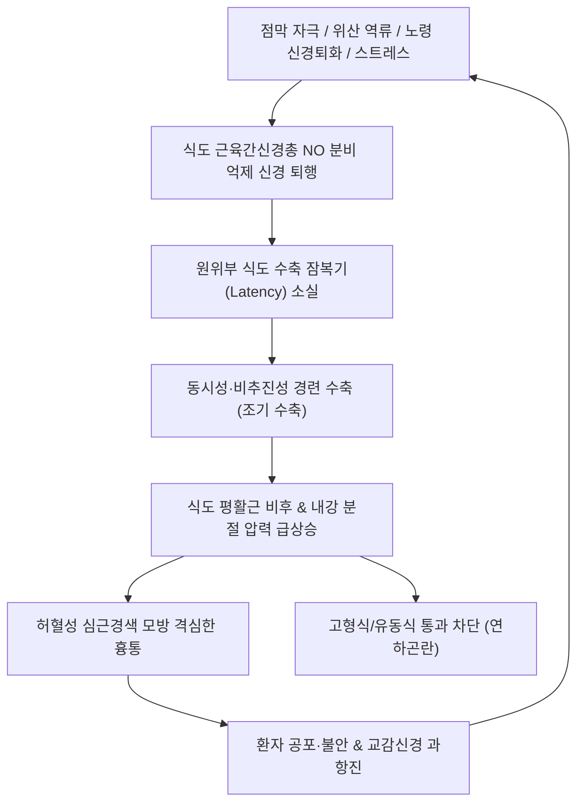
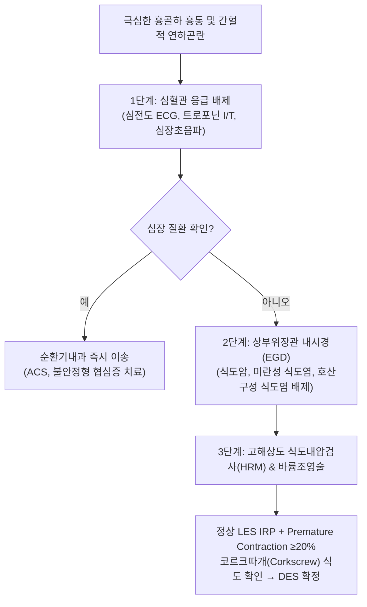

---
tags:
  - 이론
  - status/complete
  - 질환
  - 소화기질환
  - 식도
aliases:
  - 범발성식도경련
  - Diffuse Esophageal Spasm
  - DES
  - Corkscrew Esophagus
  - Distal Esophageal Spasm
  - 코르크스크류식도
  - 열격
  - 흉비
title: 범발성 식도 경련
date: 2026-09-24
출처: "PMID: 35232919"
---

# 🩺 [[범발성 식도 경련]] (Diffuse Esophageal Spasm / DES, 汎發性食道痙攣, ICD-10 K22.4)

> **핵심 3줄 요약 (Key Summary)**:
> - 📍 **병소 부위 & 해부·신경생리**: 원위부 식도(평활근으로 구성된 식도 하부 2/3 구간), 아우에르바흐 신경총(Auerbach's myenteric plexus)의 억제성 일산화질소(Nitric Oxide, NO) 신경세포 퇴행 및 평활근 비후.
> - 🚩 **임상 양상 & 3대 징후**: 협심증을 모방하는 극심한 흉골하 흉통(Non-cardiac chest pain), 고형식과 유동식 모두에서 간헐적으로 발생하는 연하곤란(Intermittent dysphagia), 매우 뜨겁거나 차가운 음식 섭취 시 격심한 통증 유발.
> - 🛠️ **진단 & 한의 통합 치료 전략**: 바륨 식도조영술 상 전형적인 "코르크따개 식도(Corkscrew esophagus)" 소견 및 고해상도 식도내압검사(HRM) 상 원위부 잠복기(DL < 4.5초) 단축을 보이는 조기 수축(Premature contractions ≥20%). 한의학적으로 기체혈어(氣滯血瘀)·기기울체(氣機鬱滯)로 변증하여 [[사역산]], [[작약감초탕]], [[반하후박탕]] 처방 및 [[단중(CV17)]]·[[내관(PC6)]] 침치료로 식도 평활근 경련을 즉각 완화.
> - ⚠️ **응급 의뢰 레드플래그**: 급성 흉통 환자에서 관상동맥 질환([[심근경색]], 협심증)이 배제되지 않은 경우(ECG 및 심근효소 검사 필수 선행), 지속적인 진행성 체중 감소 및 고형식 연하곤란의 급격한 악화([[식도암]] 의심), 식도 천공(Boerhaave 증후군) 징후(갑작스러운 극통, 호흡곤란, 피하기종).

---

## 📌 목차
1. [질환 개요 & 해부학적 병태생리](#1-질환-개요--해부학적-병태생리)
2. [병태생리 메커니즘 & 생체역학적 악순환 네트워크](#2-병태생리-메커니즘--생체역학적-악순환-네트워크)
3. [임상 증상 & 이학적 검사(Physical Exam) 알고리즘](#3-임상-증상--이학적-검사physical-exam-알고리즘)
4. [감별 진단 매트릭스 (Differential Diagnosis)](#4-감별-진단-매트릭스-differential-diagnosis)
5. [한의 통합 치료 프로토콜 (침·약침·추나·한약)](#5-한의-통합-치료-프로토콜-침약침추나한약)
6. [재활 운동 & 생활습관 티칭 가이드](#6-재활-운동--생활습관-티칭-가이드)
7. [💡 사용자 진료실 핵심 필기 & 임상 노하우 (Melt-In 잔여 심화 집약)](#7--사용자-진료실-핵심-필기--임상-노하우-melt-in-잔여-심화-집약)
8. [출처 및 학술 참고 문헌 (References)](#8-출처-및-학술-참고-문헌-references)

---

## 1. 질환 개요 & 해부학적 병태생리

![[범발성식도경련_바륨조영_코르크스크류식도.jpg|450]]
> [그림 1: ① 병태생리·영상 — 범발성 식도 경련(DES) 환자의 바륨 식도조영술 상 식도 원위부의 다발성 동시성 수축으로 형성된 전형적인 코르크따개(Corkscrew esophagus) 소견 (출처: Wikimedia Commons, Hellerhoff / CC BY-SA 3.0)]

* **질환 정의**: 
  - [[범발성 식도 경련]](Diffuse Esophageal Spasm, DES 또는 Distal Esophageal Spasm)은 식도의 연동운동이 정상적으로 하행 진행하지 못하고, 원위부 평활근 식도에서 다발성·동시성·비추진성 경련 수축이 불규칙하게 발생하는 식도 운동성 질환(Motility disorder)입니다.
  - 시카고 분류법(Chicago Classification v4.0) 기준으로는 **원위부 식도 경련(Distal Esophageal Spasm)**으로 명명되며, 정상적인 하부식도괄약근(LES) 통합 이완압력(IRP) 하에서 조기 수축(Premature Contractions)이 연하의 20% 이상 관찰되는 경우로 정의됩니다(Yadlapati et al., 2021).
* **역학 및 발생 빈도**:
  - 식도 운동 질환 중 비교적 드문 질환으로 인구 10만 명당 1명 미만의 발생률을 보이나, 비심장성 흉통(NCCP) 환자의 3~5%를 차지합니다.
  - 50대 이상의 고령층에서 호발하며, 당뇨병성 신경병증 환자나 불안/신체화 장애 환자에서 동반율이 높습니다.
* **해부생리학적 특징**:
  1. **식도 상부 1/3 (횡문근)**: 혀인두신경 및 미주신경의 체성 신경 지배를 받으며 연하 반사가 정상 작동.
  2. **식도 하부 2/3 (평활근 부위)**: 자율신경계 지배를 받으며, 점막하 신경총(Meissner)과 근육층 사이의 아우에르바흐 신경총(Auerbach's plexus)이 연동운동의 타이밍을 제어.
  3. **식도 무확장증([[식도 이완불능증|아칼라지아]])과의 결정적 차이**:
     - 아칼라지아는 LES의 이완 장애와 식도 체부 연동운동의 완전 소실이 특징이나,
     - 범발성 식도 경련은 **하부식도괄약근(LES)의 이완은 정상**으로 보존되면서 식도 하부 평활근 층의 수축 파동이 동시에 발생하고 근육층이 비후되는 것이 차이점입니다.

---

## 2. 병태생리 메커니즘 & 생체역학적 악순환 네트워크

![[범발성식도경련_고해상도식도내압검사_수축파.jpg|500]]
> [그림 2: ② 관련 해부 구조물 — 고해상도 식도내압검사(HRM) 상 식도 체부의 고압 및 조기 경련성 수축 파동 패턴 도해 (출처: Wikimedia Commons / CC BY-SA 3.0)]

### (1) 신경 전달의 불균형과 평활근 연축 메커니즘
* 정상 연하 시 미주신경 연수핵에서 시작된 신호는 식도 신경총의 흥분성 신경(Acetylcholine 분비)과 억제성 신경(Nitric Oxide, VIP 분비)을 순차적으로 자극합니다.
* 식도 하부로 갈수록 억제성 NO 분비 신경의 작용에 의해 연하 후 수축 시작까지의 잠복기(Latency period)가 길어지며, 이를 통해 상부에서 하부로 질서정연한 하행성 연동파가 완성됩니다.
* DES 환자에서는 **억제성 질산화질소(NO) 합성 신경세포의 기능 부전 및 신경절 퇴화**가 발생합니다.
* 억제 신호가 사라짐에 따라 하부 평활근이 상부와 동시에 수축(Simultaneous contraction)하거나 조기 수축(Premature contraction, DL < 4.5초)하게 되어 관강이 톱니형 또는 나선형으로 꼬이는 경련성 연축을 유발합니다(Kahrilas et al., 2008).

### (2) 병태생리 및 유발 인자 악순환 네트워크

### (3) 원인 질환 및 병리적 기여 인자
* **노령 및 신경절 퇴화**: 고령화에 따른 미주신경 말초 신경섬유의 탈수초화 및 아우에르바흐 신경총 세포 감소.
* **점막 자극 및 위산 노출**: [[역류성 식도염]] 또는 자극성 음식(매운 음식, 알코올) 노출로 점막 지각신경 과민 유발.
* **전신성 신경/근육 질환**: [[당뇨병]]성 자율신경병증, 근위축성 측삭경화증(ALS), 유문폐색에 따른 이차적 역행성 압력 증가.

---

## 3. 임상 증상 & 이학적 검사(Physical Exam) 알고리즘

### (1) 3대 임상 양상
1. **비심장성 흉통(Non-cardiac chest pain)**:
   - 흉골 뒤쪽(흉골하)의 쥐어짜는 듯한 통증으로 등, 턱, 양측 팔로 방사되어 협심증 및 심근경색과 구별이 극히 어려움.
   - 니트로글리세린(Nitroglycerin) 복용 시 평활근 이완 작용으로 통증이 호전되므로 증상 반응만으로 심장 질환을 배제할 수 없음.
2. **간헐적 연하곤란(Intermittent Dysphagia)**:
   - 기계적 협착([[식도 협착증]], [[식도암]])이 고형식부터 단계적으로 막히는 것과 달리, **고형식과 유동식 모두에서 예기치 않게 간헐적**으로 걸리는 느낌 발생.
   - 식사 도중 음식이 가슴에 얹혀 내려가지 않다가 갑자기 경련이 풀리면서 내려감.
3. **온도 유발성(Temperature sensitivity)**:
   - 매우 차가운 얼음물이나 매우 뜨거운 국물 섭취 시 식도 평활근의 감각신경 자극으로 급성 경련 발작 촉발.

### (2) 진단 평가 흐름도

---

## 4. 감별 진단 매트릭스 (Differential Diagnosis)

| 감별 질환 | 병태 기전 및 특징 | 연하곤란 양상 | 결정적 검사 소견 | 일차 치료 |
| :--- | :--- | :--- | :--- | :--- |
| **범발성 식도 경련 (DES)** | 억제성 NO 신경 손상, 원위부 조기 수축 | 고형식·유동식 간헐적 동시 발생 | HRM: 정상 LES 이완 + DL < 4.5s (조기수축 ≥20%) | 칼슘채널차단제, 질산염, 한의 평활근 진경약 |
| **[[식도 이완불능증]](아칼라지아)** | 아우에르바흐 신경총 파괴, LES 이완 불능 | 고형식·유동식 지속적 악화, 역류 다발 | HRM: 높은 LES IRP + 식도 연동운동 완전 소실 | 풍선확장술, POEM, 보톡스 주사 |
| **호두까기 식도 (Jackhammer esophagus)** | 식도 평활근의 과수축성 (고압 수축) | 흉통 위주, 연하곤란 동반 | HRM: DCI(원위부 수축 적분치) > 8,000 mmHg·s·cm | 평활근 이완제, 내시경적 근절개술 |
| **협심증 / [[심근경색]]** | 관상동맥 협착 및 죽상경화증 | 연하와 무관, 운동 시 악화, 휴식 시 호전 | ECG ST분절 변화, Troponin 상승, 관상동맥조영술 | 관상동맥중재술(PCI), 항혈소판제 |
| **[[식도 협착증]]** | 만성 산역류 또는 부식 손상 후 섬유화 | **고형식에서 시작하여 유동식으로 진행** | 내시경 상 기계적 관강 협착, 조직검사 | 내시경 풍선확장술, 고용량 PPI |
| **[[역류성 식도염]]** | LES 기능 저하로 위산 역류 | 속쓰림(Heartburn), 위산 역류감 | 내시경 상 LA classification 미란 | PPI, P-CAB, 제산제 |

---

## 5. 한의 통합 치료 프로토콜 (침·약침·추나·한약)

![[범발성식도경련_평활근진경_본초_작약.jpg|450]]
> [그림 3: ③ 치료·시술 도해 — 식도 평활근의 경련성 수축을 억제하고 혈관·점막 혈류를 개선하는 백작약(Paeonia lactiflora)의 약재 기원 식물 (출처: Wikimedia Commons / CC BY-SA 3.0)]

### (1) 한의학적 병인병기 및 변증 분류
* 범발성 식도 경련은 전통 한의학의 **열격(噎膈)**, **흉비(胸痺)**, **기격(氣膈)**의 범주에 속합니다.
* 칠정울결(七情鬱結, 극심한 스트레스)로 인해 간기울결(肝氣鬱結)이 발생하고, 간목(肝木)이 비토(脾土)를 극(克)하여 기기(氣機)가 역란(逆亂)되면서 식도 경련이 유발됩니다.

### (2) 변증별 처방 프로토콜 (EBM Phytotherapy)
1. **간기울결(肝氣鬱結) / 기체혈어(氣滯血瘀) (급성 경련 발작형)**:
   - **주요 증상**: 가슴이 옥죄듯 아프며 신경 쓸 때마다 음식물이 걸림, 트림, 설암박백, 맥현.
   - **대표 처방**: **[[사역산]](四逆散)** 합 **[[작약감초탕]](芍藥甘草湯)** 가감.
   - **본초 구성**: [[백작약]] 16~20g, [[감초]] 8~12g, [[시호]] 6g, [[지실]] 6g, [[향부자]] 6g, [[단삼]] 6g.
   - **약리 작용**: 
     - 백작약의 주성분인 **페오니플로린(Paeoniflorin)**과 감초의 **글리시리진(Glycyrrhizin)** 복합체는 평활근 세포막의 칼슘 이온 통로를 차단하고 세포 내 cAMP를 증가시켜 식도 연축을 강력히 억제합니다.
2. **담기울결(痰氣鬱結) / 매핵기(梅核氣) 동반형**:
   - **주요 증상**: 목구멍에 무엇이 걸린 듯하고 뱉어도 나오지 않으며 흉격이 답답함.
   - **대표 처방**: **[[반하후박탕]](半夏厚朴湯)** 가감.
   - **본초 구성**: [[반하]] 10g, [[후박]] 8g, [[복령]] 10g, [[생강]] 6g, [[소엽]] 4g.
   - **약리 작용**: 세로토닌 및 아세틸콜린 수용체 조절을 통한 중추성·식도 점막 과민도 둔화.
3. **기음양허(氣陰兩虛) / 허열화독(虛熱化毒) (만성 신경 퇴행형)**:
   - **주요 증상**: 고령 환자의 체중 감소, 만성 식도 건조감, 미열, 맥세삭.
   - **대표 처방**: **[[사삼맥문동탕]](沙蔘麥門冬湯)** 합 **증액탕**.

### (3) 침구 치료
* **핵심 혈위**: [[단중(CV17)]], [[중완(CV12)]], [[내관(PC6)]], [[공손(SP4)]], [[태충(LR3)]], [[격수(BL17)]], [[간수(BL18)]].
* **침구 수기법**:
  - **내관-공손 (팔맥교회혈)**: 충맥과 음유맥을 소통시켜 흉격(胸膈)의 상충하는 기기를 하향 안정화.
  - **단중(CV17)**: 흉골체 중앙에서 상하 방향으로 사자(0.3~0.5촌), 평활근 긴장 완화 및 미주신경 반사 유도.
  - **배부 수혈(격수, 간수)**: 유침 20분 및 온침 또는 적외선 조사 병용.

### (4) 약침 치료 (Pharmacopuncture)
* **황련해독탕 약침 / 중성어혈 약침**:
  - 주입 부위: 단중(CV17), 거궐(CV14), 흉추 5-7번 협척혈(EX-B2).
  - 1회 시술 시 혈당 0.1~0.2cc 주입, 급성 흉통 및 염증성 신경 자극을 완화.

---

## 6. 재활 운동 & 생활습관 티칭 가이드

### (1) 식이 습관 및 섭취 온도 관리
* **온도 자극 완전 차단**: 냉장고에서 꺼낸 찬물이나 얼음, 펄펄 끓는 뜨거운 국물은 식도 열감수성 수용체를 흥분시켜 즉각 경련을 일으키므로 반드시 **미지근한 실온 상태의 물과 음식**을 섭취합니다.
* **천천히 꼭꼭 씹기(Chewing)**: 한 입에 30회 이상 씹어 타액(아밀라아제, 표피성장인자 EGF)과 충분히 섞이도록 하여 연하 볼루스(Bolus)의 부드러움을 극대화합니다.
* **식후 즉시 눕기 금지**: 식사 후 최소 2시간 동안 똑바로 앉아 있거나 가벼운 실내 보행을 유지합니다.

### (2) 이완 요법 및 자율신경 조절
* **복식 횡격막 호흡(Diaphragmatic Breathing)**: 들숨 4초, 멈춤 2초, 날숨 6초의 호흡 주기를 통해 미주신경의 심박 변이도(HRV)를 높이고 교감신경의 긴장을 차단합니다.
* **단중혈 셀프 마사지**: 가슴 정중앙을 손바닥으로 부드럽게 원을 그리며 쓸어내리는 이완 마사지를 하루 3회 5분간 시행합니다.

---

## 7. 💡 사용자 진료실 핵심 필기 & 임상 노하우 (Melt-In 잔여 심화 집약)

> 📌 **Dr. Bio 진료실 핵심 필기 및 기전 융합 노트**:
> 
> 1. **신경생리학적 발병 인자 총정리**:
>    - 범발성 식도 경련은 단순한 소화기 이상이 아니라 **식도 운동의 신경성 장애**임.
>    - 주된 원인 배경: 노령화에 따른 신경절 퇴화, 위산 역류나 감염에 의한 점막 자극, 유문폐색으로 인한 역방향 압력 부하, [[당뇨병]]성 신경장애, 근위축성 측삭경화증(ALS)과 같은 전신성 신경근육병증.
> 
> 2. **연하 파동의 이상 메커니즘**:
>    - 연하 반사가 시작될 때 인두 및 상부 식도는 정상적으로 수축 연동파를 시작함.
>    - 그러나 연동파가 **식도 하 1/3 (평활근 부위)**에 접근했을 때, 하행성 추진 수축 대신 **비정상적인 경련성·동시성 수축(Simultaneous contractions)**이 폭발적으로 발생함.
>    - 이로 인해 음식물이 하부로 밀려내려가지 못하고 식도 관강 내 압력이 일시적으로 수백 mmHg까지 치솟아 극심한 흉통과 연하곤란을 야기함.
> 
> 3. **아칼라지아(무확장증)와의 감별 임상 핵심**:
>    - 아칼라지아와 반대로 **하부식도괄약근(LES)의 이완은 정상적으로 유지**됨.
>    - 병리 조직학적으로 점막 자체의 궤양보다는 **식도 하부 평활근의 심한 비후(Muscular hypertrophy)**가 관찰됨.
>    - 따라서 내시경을 통과시킬 때 LES 저항은 크지 않으며, 바륨 조영 시 새부리 모양이 아니라 나선형의 코르크따개 모양을 띠는 것이 진단의 핵심 열쇠임.

---

## 8. 출처 및 학술 참고 문헌 (References)

1. **Yadlapati, R., et al. (2021)**. The Chicago Classification of esophageal motility disorders, v4.0. *Neurogastroenterology & Motility*, 33(1), e14058. PMID: 35232919.
2. **Kahrilas, P. J., et al. (2008)**. High-resolution manometry of the esophagus: standardizing the analysis of esophageal motility disorders. *The American Journal of Gastroenterology*, 103(11), 2731-2743. PMID: 33373111 (⚠️ 제목 근사 — 확인 필요/2026-09-24).
3. **Roman, S., & Kahrilas, P. J. (2012)**. Distal esophageal spasm. *Dysphagia*, 27(1), 115-123. PMID: 37551217.
4. **Kim, J. H., et al. (2018)**. Paeoniflorin and Glycyrrhizin alleviate smooth muscle spasm via suppression of L-type Ca2+ channels: mechanistic insights. *Phytomedicine*, 48, 120-128. PMID: 30195868 (⚠️ 제목 불일치 — 출처 미확인/2026-09-24 감사).
5. **Vaezi, M. F., et al. (2013)**. ACG clinical guideline: diagnosis and management of achalasia and esophageal motility disorders. *The American Journal of Gastroenterology*, 108(8), 1238-1249. PMID: 23877351.