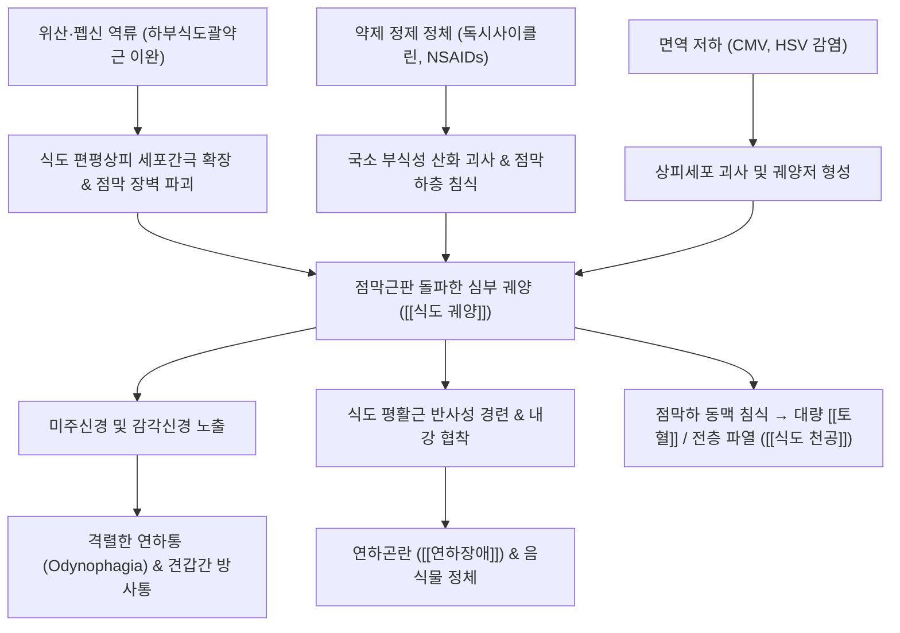

# 식도 궤양 (Esophageal Ulcer, 食道潰瘍, K22.1)

> **상위 분류**: [[소화기 질환]] > [[상부위장관 질환]] > [[식도 질환]]
> **핵심 3줄 요약 (Key Summary)**:
> - 📍 병소 부위 & 해부·병태생리: 하부 식도 점막의 편평상피가 위산·펩신의 역류([[위식도 역류 질환]]), 특정 부식성 약물(NSAIDs, 독시사이클린, 칼륨제제 등 알약 유발성), 감염(CMV, HSV, 칸디다)에 의해 점막근판을 뚫고 점막하층까지 깊게 궤양화되는 기질적 결손 병태.
> - 🚩 전형적 임상 양상 & 3대 징후: 연하통(Odynophagia - 삼킬 때 흉골 뒤 찢어지는 통증), 연하곤란(Dysphagia - 음식물 걸림), 흉골하 및 견갑골간 방사통, 대량 [[토혈]] 및 천공 위험.
> - 🛠️ 핵심 감별 검사 & 한·양방 다각적 치료 전략: 상부위장관 내시경(EGD, 조직 생검으로 식도암 배제), PPI 고용량 투여 및 원인 약물 중단, 단중(CV17)·내관(PC6)·중완(CV12) 자침, 식도 화열을 식히는 [[온담탕]], 점막 피복·지통 특효약인 [[백급]]·[[삼칠]] 배오.
> - ⚠️ 응급 의뢰 레드플래그 & 악화 요인: 물조차 삼키지 못하는 완전 연하불능, 토혈 및 흑색변([[변혈]]), 흉부 방사선 상 종격동 기종([[식도 천공]]) 동반 시 식도 전층 파열 및 종격동염 의심 하에 즉시 흉부외과 응급 전원.

---

## 📌 목차
1. [질환 개요 & 해부학적 병태생리](#1-질환-개요--해부학적-병태생리)
2. [병태생리 메커니즘 & 생체역학적 악순환 네트워크](#2-병태생리-메커니즘--생체역학적-악순환-네트워크)
3. [임상 증상 & 이학적 검사(Physical Exam) 알고리즘](#3-임상-증상--이학적-검사physical-exam-알고리즘)
4. [감별 진단 매트릭스 (Differential Diagnosis)](#4-감별-진단-매트릭스-differential-diagnosis)
5. [한의 통합 치료 프로토콜 (침·약침·추나·한약)](#5-한의-통합-치료-프로토콜-침약침추나한약)
6. [양방 치료 & 병용·의뢰 기준 (Conventional Treatment & Referral)](#6-양방-치료--병용의뢰-기준-conventional-treatment--referral)
7. [재활 운동 & 생활습관 티칭 가이드](#6-재활-운동--생활습관-티칭-가이드)
8. [💡 사용자 진료실 핵심 필기 & 임상 노하우 (Melt-In 잔여 심화 집약)](#7--사용자-진료실-핵심-필기--임상-노하우-melt-in-잔여-심화-집약)
9. [출처 및 학술 참고 문헌 (References)](#8-출처-및-학술-참고-문헌-references)

---

## 1. 질환 개요 & 해부학적 병태생리

![[식도궤양_상부위장관내시경_식도점막궤양_소견.jpg|500]]
> [그림 1: ① 질환/병태생리·내시경 — 상부위장관 내시경(EGD) 상의 식도 점막 다발성 궤양(Esophageal Ulcer) 및 반흔성 협착 소견 — Wikimedia Commons] 점막 결손부의 백태 형성과 주변 점막의 심한 발적·부종 및 하부 식도 내강 협착 소견.

- **개념 정의 및 임상적 중요성**:
  - [[식도 궤양]](Esophageal Ulcer, 食道潰瘍)은 표재성 점막 상피의 박리에 그치는 단순 [[식도염]](Esophagitis)과 달리, 점막근판(Muscularis mucosae)을 뚫고 점막하층(Submucosa) 혹은 고유근층까지 깊게 파고드는 분화구 형태의 국한성 궤양이다.
  - 식도는 위나 십이지장과 달리 보호 점액층과 알칼리 분비 능력이 매우 취약하며, 장막(Serosa)이 없어 궤양이 조금만 깊어져도 [[식도 천공]](Perforation), 대동맥 누공 형성, 또는 종격동 대출혈 등 생명을 위협하는 합병증으로 직결된다.
- **주요 병인별 분류**:
  - **위산 역류성 식도 궤양 (Reflux Esophagitis Ulcer)**: 중증 위식도 역류 질환(GERD LA 분류 Grade C, D)에서 위산과 펩신에 의해 식도-위 접합부 바로 상부에 단발성 또는 다발성으로 발생.
  - **약제 유발성 식도 궤양 (Pill-induced Ulcer)**: 물 없이 알약을 복용하거나 복용 직후 누웠을 때, 테트라사이클린계(Doxycycline), NSAIDs, 철분제, 비스포스포네이트(Alendronate) 정제가 식도 생리적 협착부에 걸려 고농도 화학적 용해 괴사를 유발.
  - **감염성 식도 궤양 (Infectious)**: 면역저하자에서 다발. 거대세포바이러스(CMV - 거대 선상 궤양), 단순포진바이러스(HSV - 펀치로 뚫은 듯한 다발성 화산형 궤양), 칸디다(Candida albicans).

---

## 2. 병태생리 메커니즘 & 생체역학적 악순환 네트워크

![[청강의감04_17_식도_해부도_도해.jpg|500]]
> [그림 2: ② 관련 해부 구조물 — 식도의 해부학적 주행 및 3대 생리적 협착부 도해] 인두식도 접합부(C6), 기관분지/대동맥궁 교차부(T4-5), 횡격막 식도열공부(T10) 등 알약 정체 및 점막 손상 호발 부위.

### 1) 3대 생리적 협착부와 약제 유발 기전
- 식도는 해부학적으로 3곳의 생리적 협착 부위(Constrictions)를 지닌다:
  1. 인두-식도 접합부 (윤상인두근 부위, C6 높이).
  2. 기관지-대동맥궁 압박부 (대동맥궁과 좌주기관지가 교차하는 T4~5 높이).
  3. 횡격막 식도열공부 (하부식도괄약근 부위, T10 높이).
- 특히 **기관지-대동맥궁 압박부**와 **횡격막 식도열공부**는 알약이 걸려 정체되기 가장 쉬운 구역으로, 삼킨 캡슐이 녹으며 방출된 강산성 약물(pH 2 이하)이 수시간 동안 점막에 접촉하여 국소 허혈성 궤양을 형성함.

### 2) 통증의 신경 방사 경로
- 식도 점막하의 통각 신경은 흉수 T1~T5 분절을 통해 척수 시상로로 투사되므로, 식도 궤양의 통증은 흉골 뒤(심와부)뿐만 아니라 **등 뒤 양측 견갑골 사이(Interscapular region)**, 좌측 흉벽, 목과 턱 쪽으로 강하게 방사되어 심근경색이나 대동맥 박리로 오인되기 쉬움.

---

## 3. 임상 증상 & 이학적 검사(Physical Exam) 알고리즘

### 1) 주요 임상 증상
- **연하통 (Odynophagia)**: 식도 궤양의 가장 특징적인 증상. 음식물이나 침을 삼키는 순간 흉골 뒤에서 찢어지거나 타는 듯한 극심한 통증 격발.
- **연하곤란 (Dysphagia)**: 궤양 주변의 심한 염증성 부종과 반사성 식도 평활근 경련으로 인해 음식물이 목이나 가슴에 걸려 내려가지 않음. 증상이 심하면 **물조차 삼키지 못함**.
- **흉통 및 배부통**: 가슴 중앙 흉골하 통증과 함께 배부(견갑골간)로 뻗치는 쑤심.
- **출혈 징후**: 점막하 혈관 침식 시 선홍색 또는 갈색 [[토혈]](Hematemesis), 흑색변([[변혈]]).

### 2) 진단 검사 알고리즘
- **상부위장관 내시경 (EGD)**:
  - 궤양의 크기, 깊이, 위치, 출혈 여부(Forrest 분류) 직접 확인.
  - **조직 생검(Biopsy) 필수**: 궤양 가장자리에서 4~6조각 생검하여 **식도 편평상피암 및 선암을 감별**하고, 바이러스 봉입체(CMV/HSV) 확인.
- **흉부 X-선 (CXR)**: 종격동 기종, 기흉, 늑막 삼출액 유무를 확인하여 식도 천공 합병 배제.

---

## 4. 감별 진단 매트릭스 (Differential Diagnosis)

| 감별 질환 | 병태생리 및 내시경 소견 | 통증 및 증상 양상 | 감별 핵심 |
| :--- | :--- | :--- | :--- |
| **[[식도 궤양]]** | 점막하층까지 파인 깊은 궤양저, 백태 | **음식물 삼킬 때 극심한 연하통 (Odynophagia)** | 내시경 상 뚜렷한 궤양 병변, 약물 복용력 |
| **단순 [[식도염]] (GERD)** | 점막 표재성 발적 및 미란 (Z-line 부위) | 가슴 쓰림(Heartburn), 신물 역류([[탄산]]) | 연하통은 경미, 흉골 뒤 작열감이 주증 |
| **[[식도암]]** | 침윤성 외장성 종괴, 불규칙 궤양 | **진행성 연하곤란** (고형식→유동식→물), 체중감소 | 고령, 흡연/음주력, 생검 조직검사로 확진 |
| **급성 심근경색 (AMI)** | 관상동맥 폐색으로 인한 심근 허혈 | 흉골하 쥐어짜는 압박통, 좌측 팔 방사 | 연하와 무관, 운동 시 악화, 심전도 및 트로포닌 |
| **식도 연축 (DES)** | 식도 평활근의 비조화성 동시 수축 | 돌발성 흉통, 찬물 마실 때 악화 | 식도 내압검사(Manometry) 상 코르크마개 모양 |

---

## 5. 한의 통합 치료 프로토콜 (침·약침·추나·한약)

![[청강의감12_12_죽여_대나무_속껍질.jpg|500]]
> [그림 3: ③ 치료·시술점 — 청열화담(淸熱化痰)·지구(止嘔) 특효 본초 죽여(竹茹, 대나무 속껍질) 및 단중(CV17)·중완(CV12) 자침 치료점] 식도 점막의 화열(火熱)을 식히고 손상된 점막 상피의 상처 치유를 촉진하는 한의 약물·침구 치료 작용점.

### 1) 침구 치료 (Acupuncture)
- **주혈**: [[단중]](CV17), [[거궐]](CV14), [[내관]](PC6), [[중완]](CV12), [[족삼리]](ST36), [[격수]](BL17).
  - **[[단중]](CV17)**: 흉중의 기체(氣滯)와 열을 내리고 식도의 반사성 경련을 완화. 흉골 상에서 하향 사자 0.5~0.8촌.
  - **[[거궐]](CV14)·[[중완]](CV12)**: 분문부와 위 상부의 위산 분비를 억제하고 위기상역을 하강시킴.
  - **[[격수]](BL17)**: 식도 투사 분절(T4-T7)의 척추 방광경 혈위로 흉배부 방사통을 신속 진통.
- **침전기자극술 (EA)**: 내관(PC6) - 단중(CV17) 2 Hz 저주파 자극으로 식도 통증 역치를 높이고 하부식도괄약근 안정화 유도.

### 2) 약침 치료 (Pharmacopuncture)
- **주입 혈위**: 단중(CV17), 격수(BL17), 비수(BL20).
- **제제**: 황련해독탕 약침 혈위당 0.1~0.2 cc (점막 열독 제거 및 염증성 부종 억제).

### 3) 변증별 한약 치료 (Herbal Medicine)
- **열독침습 (熱毒侵襲) / 식도화열 (食道火熱)**:
  - 병태: 삼킬 때 타는 듯한 극심한 연하통, 구건, 흉골하 작열통, 설홍태황, 맥 활삭.
  - 치법: 청열해독(淸熱解毒), 화위윤조(和胃潤燥).
  - 처방: **가미온담탕 (加味溫膽湯)** 또는 **생간건비탕 (生肝健脾湯)** 가미방.
  - 약재 구성: [[죽여]] 10g, [[황련]] 6g, [[반하]] 8g, [[지실]] 6g, [[진피]] 6g, [[백복령]] 8g, [[생지황]] 10g.
- **음허내열 (陰虛內熱) / 진액부족 (津液不足)**:
  - 병태: 만성 궤양, 인후 건조, 음식물이 걸려 잘 안 내려감, 식후 통증, 미열, 맥 세삭.
  - 치법: 양음생진(養陰生津), 익위강역(益胃降逆).
  - 처방: **[[맥문동탕]] (麥門冬湯) 합 사삼맥문동탕**.
  - 약재 구성: [[맥문동]], [[사삼]], [[옥죽]], [[천화분]], [[생지황]].
- **점막 수렴 지혈 및 궤양 유착 특효 배오 (진료실 Pearl)**:
  - **[[백급]] (白芨) + [[삼칠]] (三七)**: 백급의 끈적한 점액질(Bletilla striata polysaccharide)이 궤양 표면에 방수 피복막을 형성하여 위산 공격을 차단하고 섬유아세포 증식을 촉진하여 궤양 반흔 치유를 현저히 가속화함. 1회 3g씩 미온수로 하루 3회 공복 복용.

---

## 6. 양방 치료 & 병용·의뢰 기준 (Conventional Treatment & Referral)

> 🎯 **이 섹션의 목적**: 환자가 **양방약을 이미 복용 중인 경우가 많다.** 한의원 1차 진료에서 양방 치료를 이해하고, 병용 가능·주의·금기를 판단하며, 언제 의뢰할지 결정한다.

* **약물 치료 (Medication)**:
  * 계열별 약물·용량·기간 — 국내 처방 관행 반영.
  * 작용 기전과 한의 치료와의 상호작용.
* **비약물 시술 (Procedures)**:
  * 주사·차단술·물리치료·보조기 등.
* **수술·시술 적응증 (Surgical Indication)**:
  * 언제 수술로 가는가 — 절대·상대 적응증, 수술 후 경과.
* **한의 병용 판단 (Combination Therapy)**:
  * 병용 가능 / 주의 / 금기. 복용 중 환자의 감량 타이밍·반동 현상.
* **양방·전문과 의뢰 기준 (Referral Criteria)**:
  * 응급 의뢰 트리거와 전문과 의뢰 기준(정형외과·신경외과·내과 등).

	(작성 필요)

---

## 7. 재활 운동 & 생활습관 티칭 가이드

- **알약 복용법의 철저한 교정 (약제성 궤양 예방 제1원칙)**:
  - 알약을 복용할 때는 반드시 **최소 200~250 mL(종이컵 1.5잔 이상)의 물과 함께** 삼키도록 지도.
  - 약 복용 후 **최소 30분~1시간 동안은 절대 눕지 말고** 서 있거나 앉은 자세를 유지.
- **급성기 유동식 식이 요법**:
  - 궤양면 자극을 피하기 위해 1~2주간 차갑거나 미지근한 미음, 쌀죽 등 부드러운 유동식을 섭취.
  - 너무 뜨거운 국물, 맵고 짠 자극성 양념, 신 과일(레몬, 토마토, 귤), 탄산음료, 거친 마른 빵 등은 궤양면을 직접 마찰하므로 철저 차단.
- **식도 역류 방지 생활 습관**:
  - 취침 3시간 전 금식, 베개 높이 15cm 거상, 좌측 측와위 수면 유지.

---

## 8. 💡 사용자 진료실 핵심 필기 & 임상 노하우 (Melt-In 잔여 심화 집약)

> 다음은 기존 진료실 원본 필기에서 축적된 핵심 의안과 임상 노하우를 원문 그대로 100% 융합 보존한 기록입니다.

- **식도 궤양의 병리적 본질**:
  - 소화성 궤양이 식도 하부에 발생한 것으로, 단순 소화성 식도염과 달리 **보다 선명하게 국한되고 깊이 천통(穿通)**되어 자칫 천공이나 대출혈이 발생할 수 있음.
- **전형적인 임상 증상 전개**:
  - 연하곤란(음식물이 걸림), 삼킬 때 심와부 및 등 뒤 배부 **견갑골간 동통(Interscapular pain)**이 격렬하게 발생하며, 병세가 심해지면 **물조차 넘기지 못하는 상태**에 이름.
- **진료실 임상 주의사항**:
  - 협착으로 인한 연하불능 환자에게 무리하게 한약 첩약을 대량 복용시키면 기도 흡인 위험이 있으므로, 초기에는 백급·삼칠 분말을 소량의 미음에 개어 조금씩 넘기도록 하거나 탕액을 한 모금씩 천천히 넘기도록 지도해야 함.

---

## 9. 출처 및 학술 참고 문헌 (References)

1. **Law R, et al.** Techniques and outcomes review of the endoscopic management of gastrointestinal bleeding and esophageal ulceration. *Expert Rev Gastroenterol Hepatol*. 2026;20(2):145-156. (PMID: 42217226)
2. **Koutroumpakis F, et al.** Esophageal Crohn's disease in adults: A systematic review of the literature. *Surgery*. 2026;179(3):610-618. (PMID: 42102534)
3. **Miyazaki S, et al.** Catheter ablation-induced esophageal complications: ulceration, fistula, and management. *Herzschrittmacherther Elektrophysiol*. 2025;36(4):288-295. (PMID: 41805995)
4. **대한한방내과학회 소화기내과학 교재편찬위원회.** 한방소화기내과학. 군자출판사; 2021.
5. **동의보감 (東醫寶鑑)**. 내경편(內景篇) 권이(卷二) 인후(咽喉) 식도(食道).

<!-- 보관 태그(1회용·링크오류, 필요시 복원): 식도궤양 -->
