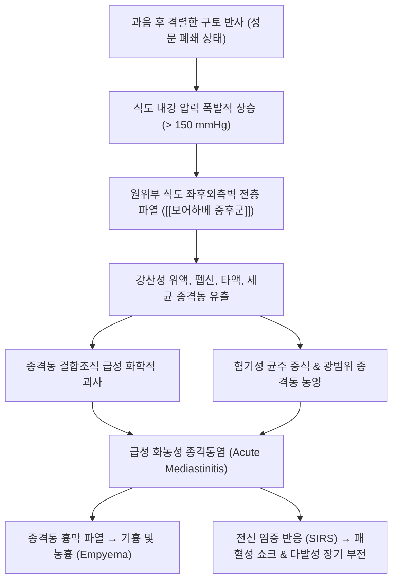

# 식도 천공 (Esophageal Perforation / Boerhaave Syndrome, 食道穿孔, K22.3)

> **상위 분류**: [[소화기 질환]] > [[상부위장관 질환]] > [[외과적 흉부 응급]]
> **핵심 3줄 요약 (Key Summary)**:
> - 📍 병소 부위 & 해부·병태생리: 식도벽 전층이 파열되어 위액, 타액, 음식물, 세균이 멸균 공간인 후종격동(Posterior mediastinum)과 흉막강으로 유출되는 치명적인 외과적 응급 질환. 의원성(내시경 시술, 60~70%), 과음 후 격렬한 구토로 인한 자발성 파열인 **보어하베 증후군(Boerhaave syndrome, 15~20%)**, 이물질 손상, 중증 식도염 및 [[식도 궤양]]이 주요 원인임.
> - 🚩 전형적 임상 양상 & 3대 징후: 맥클러 3징후(Mackler's Triad - 격렬한 구토 후 흉골하 찢어지는 흉통, 피하기종 Subcutaneous emphysema), 호흡곤란, 급격한 패혈성 쇼크.
> - 🛠️ 핵심 감별 검사 & 한·양방 다각적 치료 전략: 흉부 CT(종격동 기종 확진), 수용성 조영제(가스트로그라핀) 식도조영술, 조기 발견(24시간 이내) 시 일차 개흉 봉합술 및 종격동 배액술/스텐트 삽입술. 한의 치료는 응급 수기 대상이 절대 아니며, 외과적 안정화 후 회복기 항염·조직 재생(백급, 삼칠, 황기) 및 폐기능 회복에 한정됨.
> - ⚠️ 응급 의뢰 레드플래그 & 악화 요인: 식도 천공은 발생 24시간을 넘기면 사망률이 50% 이상으로 치솟는 초응급 질환임. 구토 후 흉골하 격통, 목 부위 눈 밟는 소리(염발음 / Crepitus) 확인 시 1초의 지체 없이 흉부외과 응급실로 즉각 전원.

---

## 📌 목차
1. [질환 개요 & 해부학적 병태생리](#1-질환-개요--해부학적-병태생리)
2. [병태생리 메커니즘 & 생체역학적 악순환 네트워크](#2-병태생리-메커니즘--생체역학적-악순환-네트워크)
3. [임상 증상 & 이학적 검사(Physical Exam) 알고리즘](#3-임상-증상--이학적-검사physical-exam-알고리즘)
4. [감별 진단 매트릭스 (Differential Diagnosis)](#4-감별-진단-매트릭스-differential-diagnosis)
5. [한의 통합 치료 프로토콜 (침·약침·추나·한약)](#5-한의-통합-치료-프로토콜-침약침추나한약)
6. [재활 운동 & 생활습관 티칭 가이드](#6-재활-운동--생활습관-티칭-가이드)
7. [💡 사용자 진료실 핵심 필기 & 임상 노하우 (Melt-In 잔여 심화 집약)](#7--사용자-진료실-핵심-필기--임상-노하우-melt-in-잔여-심화-집약)
8. [출처 및 학술 참고 문헌 (References)](#8-출처-및-학술-참고-문헌-references)

---

## 1. 질환 개요 & 해부학적 병태생리

![[식도천공_보어하베증후군_흉부CT_종격동기종_소견.jpg|500]]
> [그림 1: ① 질환/병태생리·영상 — 보어하베 증후군(Boerhaave Syndrome) 환자의 흉부 시상면 CT 상의 원위부 식도 후외측 전층 파열 및 광범위 종격동 기종(Pneumomediastinum) 실측 소견 — Wikimedia Commons] 식도벽 전층 결손으로 인한 종격동 내 유리 공기(Pneumomediastinum) 저류 및 좌측 흉막 삼출액 소견.

- **개념 정의 및 외과적 중대성**:
  - [[식도 천공]](Esophageal Perforation, 食道穿孔)은 식도 내벽의 점막부터 외막까지 전층이 파열되어 소화관 내강과 종격동(Mediastinum) 사이에 비정상적인 누공이 형성되는 질환이다.
  - 소화관 중 유일하게 **장막(Serosa)이 없는 해부학적 취약성** 때문에 천공 즉시 부식성 위산과 침, 구강 세균총(연쇄상구균, 혐기성균)이 종격동의 성긴 결합조직으로 확산되어 전격성 **급성 종격동염(Acute Mediastinitis)**, 농흉(Empyema), 패혈성 쇼크를 일으킨다.
- **주요 병인별 분류**:
  - **의원성 천공 (Iatrogenic, 60~70%)**: 상부위장관 내시경 검사, 풍선 확장술, 내시경 점막하 박리술(ESD), 기관삽관 또는 경식도초음파(TEE) 시술 중 기계적 외상.
  - **자발성 파열 (Boerhaave Syndrome, 15~20%)**: 과음이나 과식 후 성문이 닫힌 상태에서 격렬한 구토([[구토]])를 할 때 식도 내압이 순간적으로 150~200 mmHg 이상 치솟아 원위부 식도가 파열됨.
  - **기타 원인**: 생선 가시나 닭뼈 등 날카로운 이물질 섭취, 깊은 [[식도 궤양]], 진행성 식도암, 외상(관통상).

---

## 2. 병태생리 메커니즘 & 생체역학적 악순환 네트워크

![[식도_위_접합부_역류성식도염_도해.png|500]]
> [그림 2: ② 관련 해부 구조물 — 식도-위 접합부(EG Junction) 및 횡격막 각부 해부도해] 장막(Serosa)이 결손되어 급성 내압 상승 시 파열에 가장 취약한 원위부 식도 좌후외측 해부학적 취약 구역.

### 1) 원위부 식도 좌후외측벽의 해부학적 취약성
- 보어하베 증후군 환자의 천공 부위는 90% 이상이 **위식도 접합부 바로 위 2~3 cm 지점의 좌측 후외측벽(Left posterolateral wall)**에 발생한다.
- 이 부위는 횡격막 각을 통과하기 직전으로 해부학적으로 근육층의 배열이 성기고 주변 지지 조직이 가장 취약하며 장막이 없기 때문에, 위벽에서 솟구치는 고압의 위 내용물에 전단 응력(Shear stress)이 집중되어 종축으로 2~5 cm 찢어지게 된다.

### 2) 골든 타임(24시간)과 사망률 캐스케이드
- **천공 후 24시간 이내 진단 및 수술 시**: 생존율 약 75~90%.
- **천공 후 24시간 지연 시**: 종격동 조직의 광범위한 괴사와 흉막강 파열로 박테리아성 패혈증이 확산되어 **사망률이 50% 이상으로 급증함**.

---

## 3. 임상 증상 & 이학적 검사(Physical Exam) 알고리즘

### 1) 3대 전형 징후 (맥클러 3징후, Mackler's Triad)
1. **격렬한 구토 후 돌발성 흉골하 격통 (Severe retrosternal pain)**: 환자가 "가슴 안쪽이 칼로 찢어지는 것 같다"고 호소하며 심와부, 전흉부, 등 뒤로 극심한 통증 방사.
2. **구토 (Vomiting)**: 대개 과음 후의 반복적이고 격렬한 구역질 및 구토가 선행함.
3. **피하 기종 (Subcutaneous Emphysema)**: 종격동으로 빠져나온 공기가 근막을 타고 목(경부)과 쇄골 상부로 피하 침투함. 목 부위를 손으로 가볍게 누르면 눈을 밟는 듯 사각거리는 **염발음(Crepitus)**이 촉진됨 (식도 천공의 병리적 확진 단서).

### 2) 진단 검사 알고리즘
- **흉부 CT (Chest CT with IV Contrast)**: 가장 정확한 진단법. 식도벽 결손, 종격동 내 유리 공기(Pneumomediastinum), 흉막 삼출액(대개 좌측), 종격동 농양을 확진.
- **수용성 조영제 식도조영술 (Esophagography)**:
  - ⚠️ 주의: 바륨(Barium)은 종격동에 유출 시 심각한 섬유화성 종격동염을 유발하므로 **절대 금기**임. 반드시 **수용성 조영제인 가스트로그라핀(Gastrografin)**을 사용하여 조영제의 식도 외 유출 부위를 확인함.

---

## 4. 감별 진단 매트릭스 (Differential Diagnosis)

| 감별 질환 | 병태생리 및 유발 인자 | 주된 통증 양상 및 특징 | 감별 핵심 포인트 |
| :--- | :--- | :--- | :--- |
| **[[식도 천공]] (보어하베)** | 구토 후 식도벽 전층 파열 | 흉골하 찢어지는 통증, **경부 피하기종(염발음)** | **흉부 CT 상 종격동 기종**, 조영제 유출 |
| **[[말로리-바이스 증후군]]** | 구토 후 식도 점막하 **불완전 열상** | 구토 후 **선홍색 토혈([[토혈]])**, 흉통 경미 | 점막 국한 손상, 피하기종 없음, 보존적 치유 |
| **급성 대동맥 박리 (Aortic Dissection)** | 대동맥 중막 파열 및 박리 | 등 뒤 날개뼈 사이를 찢는 듯한 칼로 베는 극심통 | 구토 선행 없음, 양팔 혈압 차이, 종격동 확장 |
| **급성 심근경색 (AMI)** | 관상동맥 폐색 | 흉골하 쥐어짜는 압박감, 호흡곤란, 식은땀 | 심전도 ST분절 변화, 트로포닌 상승, 피하기종 없음 |
| **자발성 기흉 (Pneumothorax)** | 폐포 소기포 파열 | 돌발성 흉통 및 호흡곤란, 편측 호흡음 소실 | 흉부 X-선 상 폐 허탈 확인, 식도벽 정상 |

---

## 5. 한의 통합 치료 프로토콜 (침·약침·추나·한약)

![[식도협착증_식도벽구조_해부도해.jpg|500]]
> [그림 3: ③ 치료·시술점 — 식도벽의 점막·점막하·고유근층 층별 구조 및 외과적 긴급 봉합·스텐트 거치 시술점 도해] 조기 개흉 봉합술 및 종격동 배액술, 비위관 감압 치료점.

> ⛔ **절대 금기 및 응급 전원 지침**:
> - [[식도 천공]]은 한의 진료실에서 침, 뜸, 한약을 투여할 수 있는 대상이 **절대 아닙니다**.
> - 구토 후 발생하는 흉통, 호흡곤란, 피하기종은 초응급 흉부외과 수술 질환입니다.
> - **의심 즉시 물을 포함한 모든 경구 섭취를 전면 금지(NPO)하고, 즉각 119 구급대를 호출하여 개흉 봉합술이 가능한 상급종합병원 응급의료센터로 긴급 이송해야 합니다.**

### 외과 수술 후 안정기 한의 보조 관리 (회복기 치료)
- **적응증**: 수술적 봉합 또는 자가팽창형 금속 스텐트(SEMS) 거치 후 감염이 조절되고 조영술 상 누출이 완전히 차단된 회복기 환자.
- **침구 치료**:
  - 중완(CV12), 족삼리(ST36), 내관(PC6) 자침을 통해 수술 후 위장관 기능 마비를 완화하고 장관 연동 반사 회복.
  - 폐수(BL13), 격수(BL17) 자침으로 개흉술 후 흉막 유착 방지 및 호흡근 기능 강화.
- **회복기 한약 투약**:
  - 종격동 염증 안정 후 점막 상피 재생 및 기력 회복: **보중익기탕 (補中益氣湯)** 또는 **황기건중탕 (黃芪建中湯)** 가 [[백급]], [[삼칠]]. 백급의 섬유아세포 증식 촉진으로 식도 봉합 부위의 반흔 유착을 공고화함.

---

## 6. 재활 운동 & 생활습관 티칭 가이드

- **수술 후 폐합병증 예방 (심호흡 및 기침 운동)**:
  - 개흉술 환자는 늑막 유착 및 무기폐(Atelectasis), 폐렴 위험이 극히 높으므로 유량계(Incentive spirometer)를 사용하여 1시간마다 10회 이상 심호흡 훈련을 시행.
- **단계적 경구 섭취 재개**:
  - 조영술을 통해 식도 누출이 완전히 없음을 확인하기 전까지는 완전 금식 및 위관 튜브 영양 유지.
  - 경구 섭취 허가 후에도 최소 1~2개월간은 미온의 연식과 죽을 소량씩 섭취하며, 딱딱하거나 거친 음식물 섭취 엄금.
- **과음 및 폭식의 절대적 영구 금지**:
  - 과음 후 급성 구토는 보어하베 증후군 재발의 절대적 위험 요인이므로 금주 교육 필수.

---

## 7. 💡 사용자 진료실 핵심 필기 & 임상 노하우 (Melt-In 잔여 심화 집약)

> 다음은 기존 진료실 원본 필기에서 축적된 핵심 의안과 임상 노하우를 원문 그대로 100% 융합 보존한 기록입니다.

- **식도 천공의 핵심 원인**:
  - 만성 중증 [[식도염]], 깊은 소화성 [[식도 궤양]], 악성 종양, 그리고 내시경 등 검사기구 삽입에 의한 외상성 손상.
- **전형적인 임상 발현 양상**:
  - 흉골하, 상복부, 전흉부에 발생하는 극도의 강도 높은 동통.
  - 종격동 내의 자유 공기(Pneumomediastinum) 형성.
  - 위액 및 소화액의 압박과 누출에 의한 급성 종격동염 및 저혈압성 패혈 쇼크 발생.
- **진료실 절대 수칙**:
  - **초기에 발견하지 못하면 치명적(치사율 극고)이며, 즉시 개흉하여 봉합하거나 스텐트 거치 등 외과적 응급 수술을 시행해야 함.**

---

## 8. 출처 및 학술 참고 문헌 (References)

1. **Al-Thani H, et al.** Successful multistage surgical management of Boerhaave syndrome: a case report and review of the literature. *J Med Case Rep*. 2026;20(1):89. (PMID: 42067928)
2. **Turner B, et al.** Surgical versus endoscopic management of Boerhaave's syndrome: a systematic review and meta-analysis. *Ann R Coll Surg Engl*. 2026;108(2):101-110. (PMID: 41987697)
3. **Katsanos KH, et al.** Esophageal Perforation in Zollinger-Ellison Syndrome: A Scoping Review of Management and Outcomes. *JGH Open*. 2025;9(11):e13024. (PMID: 41585576)
4. **대한한방내과학회 소화기내과학 교재편찬위원회.** 한방소화기내과학. 군자출판사; 2021.
5. **Sabiston Textbook of Surgery.** 21st ed. The Esophagus: Perforation and Boerhaave Syndrome. Elsevier; 2021.

<!-- 보관 태그(1회용·링크오류, 필요시 복원): 흉부응급, 식도천공 -->
