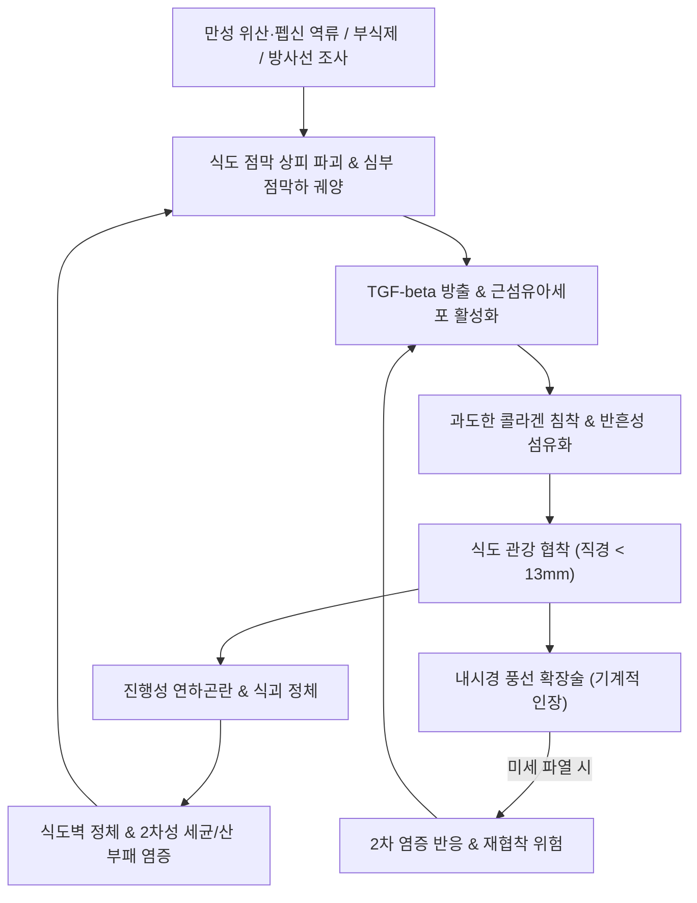
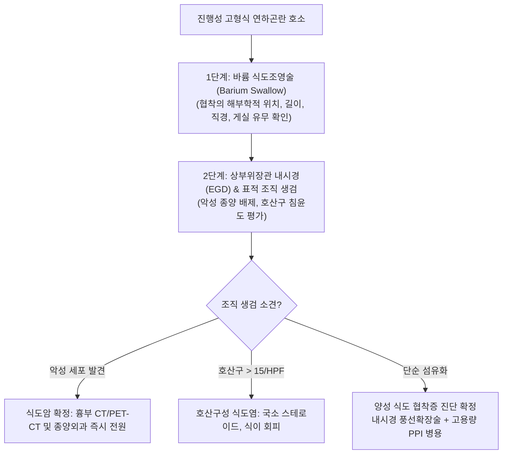
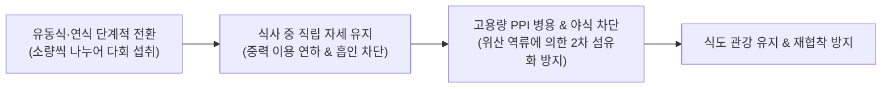

---
tags:
  - 이론
  - status/complete
  - 질환
  - 소화기질환
  - 식도
aliases:
  - 식도협착증
  - Esophageal Stricture
  - 식도협착
  - 열격
  - Benign Esophageal Stricture
title: 식도 협착증
date: 2026-09-24
출처: "https://pubmed.ncbi.nlm.nih.gov/40412994/"
---

# 🩺 [[식도 협착증]] (Esophageal Stricture, 食道狹窄症, ICD-10 K22.2)

> **핵심 3줄 요약 (Key Summary)**:
> - 📍 **병소 부위 & 해부·병태생리**: 식도 점막 및 점막하층의 반복적 만성 손상(위산 및 펩신 역류, 강산·강알칼리 부식제 섭취, 방사선 조사, 호산구성 염증)으로 인한 교원질(Collagen) 과다 침착 및 윤상 섬유화로 인한 식도 관강의 비가역적 기계적 협소화.
> - 🚩 **임상 양상 & 3대 징후**: 딱딱한 고형식에서 시작하여 점차 죽, 미음, 액체류로 진행하는 **진행성 연하곤란(Progressive dysphagia)**, 흉골하 음식물 정체감 및 야간 역류·흡인성 폐렴.
> - 🛠️ **진단 & 한의·양방 협진 전략**: 상부위장관 내시경 및 바륨 식도조영술을 통한 협착 직경·길이 측정 및 악성 종양 배제 생검. 급성기 내시경적 풍선 확장술(Balloon dilatation) 및 고용량 PPI 병용을 시행하며, 한의학적으로 열격(噎膈)의 담어내결(痰瘀內結)·진액고갈로 변증하여 활혈거어(活血祛瘀)·화담윤조(化痰潤燥)의 [[통유탕]], [[오즙안중음]] 투여 및 식도 연축 방지 침치료를 병용하여 재협착을 방지.
> - ⚠️ **응급 의뢰 레드플래그**: 50대 이상에서 수주 내 급속도로 진행하는 연하곤란 및 체중 감소([[식도암]] 의심 생검 필수), 토혈 및 흑색변, 내시경 확장술 후 갑작스러운 극심한 흉통·호흡곤란·경부 피하기종(식도 천공 긴급 수술 의뢰).

---

## 📌 목차
1. [질환 개요 & 해부학적 병태생리](#1-질환-개요--해부학적-병태생리)
2. [병태생리 메커니즘 & 생체역학적 악순환 네트워크](#2-병태생리-메커니즘--생체역학적-악순환-네트워크)
3. [임상 증상 & 이학적 검사(Physical Exam) 알고리즘](#3-임상-증상--이학적-검사physical-exam-알고리즘)
4. [감별 진단 매트릭스 (Differential Diagnosis)](#4-감별-진단-매트릭스-differential-diagnosis)
5. [한의 통합 치료 프로토콜 (침·약침·추나·한약)](#5-한의-통합-치료-프로토콜-침약침추나한약)
6. [재활 운동 & 생활습관 티칭 가이드](#6-재활-운동--생활습관-티칭-가이드)
7. [💡 사용자 진료실 핵심 필기 & 임상 노하우 (Melt-In 잔여 심화 집약)](#7--사용자-진료실-핵심-필기--임상-노하우-melt-in-잔여-심화-집약)
8. [출처 및 학술 참고 문헌 (References)](#8-출처-및-학술-참고-문헌-references)

---

## 1. 질환 개요 & 해부학적 병태생리

![[식도협착증_소화성협착_내시경실측.png|450]]
> [그림 1: ① 병태생리·영상 — 만성 위식도 역류질환에 의해 하부 식도 관강이 섬유성 반흔 고리로 좁아진 소화성 협착(Peptic Stricture)의 상부위장관 내시경 실측 소견 (출처: Wikimedia Commons / CC BY-SA 3.0)]

* **질환 정의**: 
  - [[식도 협착증]](Esophageal Stricture)은 식도 점막 및 심부 조직의 손상에 따른 염증 치유 과정에서 과도한 섬유화가 발생하여 식도 내강의 직경이 정상(약 20~25mm) 이하로 좁아져 음식물의 통과 장애를 일으키는 질환군입니다.
  - 관강의 직경이 13mm 이하로 좁아지면 뚜렷한 고형식 연하곤란 증상이 유발됩니다.
* **원인별 분류 및 역학**:
  1. **소화성 협착 (Peptic Stricture, 70~80%)**: 만성 [[역류성 식도염]](GERD)의 주요 후유증으로, 강력한 위산과 펩신에 노출된 하부 식도 편평상피가 파괴되고 궤양 및 점막하 섬유화가 진행되어 형성(Richter, 2018).
  2. **부식성 협착 (Corrosive Stricture)**: 강산, 알칼리성 세제 등 부식 물질 오음 후 급성 점막 괴사를 거쳐 수주~수개월 내 발생하는 심각한 전층 반흔 협착(Chirica et al., 2017).
  3. **방사선 유발성 협착 (Radiation-induced Stricture)**: 두경부암, 폐암, 종격동 림프종 방사선 치료 후 수개월~수년 뒤 지연성으로 혈관내피 손상 및 허혈성 섬유화 초래.
  4. **호산구성 식도염 (EoE) 연관 협착**: 만성 알레르기 염증으로 식도 벽이 재모델링되며 '크레이프 페이퍼' 점막 및 다발성 윤상 고리 협착 형성(Muir & Falk, 2021).
  5. **악성 협착 (Malignant Stricture)**: [[식도암]]이나 폐암, 위 분문부암의 직접 침범으로 인한 불규칙한 관강 폐쇄.

---

## 2. 병태생리 메커니즘 & 생체역학적 악순환 네트워크

![[식도협착증_식도해부구조_OpenStax_2412.jpg|500]]
> [그림 2: ② 관련 해부 구조물 — 식도의 주행 경로, 경추부·흉부·복부 식도의 층위 해부학 및 하부식도괄약근 구조 (출처: OpenStax, Wikimedia Commons / CC BY 4.0)]

### (1) 점막하 섬유화와 콜라겐 침착의 분자 메커니즘
* 위산 노출 및 화학적 부식으로 인해 기저막이 손상되면, 점막하층의 섬유아세포(Fibroblasts)가 근섬유아세포(Myofibroblasts)로 분화합니다.
* TGF-beta(Transforming Growth Factor-beta), PDGF 등 전섬유화 사이토카인이 대량 방출되어 Type I 및 Type III 교원질(Collagen)이 과다 합성됩니다.
* 정상적인 점막하 탄력섬유망이 치밀한 반흔 결합조직으로 치환되면서 식도 고유근층의 연동 신전성이 영구히 소실되고 윤상 협착 밴드를 형성합니다(Thanawala et al., 2025).

### (2) 식도 협착의 악순환 네트워크

---

## 3. 임상 증상 & 이학적 검사(Physical Exam) 알고리즘

### (1) 임상 증상
* **진행성 연하곤란 (Progressive Dysphagia)**:
  - 초기: 쇠고기, 마른 빵 등 퍽퍽하고 부피가 큰 고형물 섭취 시 걸림.
  - 중기: 부드러운 밥, 죽을 삼킬 때도 흉골 후방에서 정체 및 연하통 발생.
  - 말기: 물이나 침조차 통과하지 못해 타액 분비 과다 및 야간 역류 발생.
* **체중 감소 및 영양 실조**: 연하 공포증으로 인한 식사량 급감.
* **호흡기계 합병증**: 야간 수면 중 식도 내 정체 물질의 후두 유입으로 인한 흡인성 폐렴, 만성 만성기침, 천명음.

### (2) 진단 및 감별 평가 알고리즘

---

## 4. 감별 진단 매트릭스 (Differential Diagnosis)

| 감별 질환 | 병인 및 기전 | 연하곤란 진행 속도 및 양상 | 내시경 및 영상 소견 | 치료 원칙 |
| :--- | :--- | :--- | :--- | :--- |
| **양성 식도 협착증** | 만성 역류, 부식 손상 후 섬유화 | 수개월~수년에 걸쳐 고형식 위주로 서서히 진행 | 매끄럽고 대칭적인 윤상 협착 고리 | 내시경 풍선확장술, 고용량 PPI, 한의 윤조제 |
| **[[식도암]]** | 편평상피세포암, 선암 | **수주~수개월 내 급격히 진행**, 체중감소 극심 | 불규칙한 궤양성 종괴, 조직검사 악성세포 | 외과적 식도절제술, 항암방사선요법 |
| **[[범발성 식도 경련]]** | 억제성 신경 소실, 동시성 연축 | 고형식·유동식 모두에서 **간헐적으로** 발생 | 코르크따개(Corkscrew) 식도, HRM 조기수축 | 평활근 이완제, 작약감초탕, 질산염 |
| **[[식도 이완불능증]](아칼라지아)**| LES 신경총 변성, 이완 부전 | 수년에 걸쳐 고형식과 액체 모두에서 악화 | 새부리 모양(Bird-beak sign), 식도 확장 | 공기풍선확장술, POEM(경구내시경근절개술) |
| **호산구성 식도염** | Th2 알레르기 면역 매개 염증 | 소아/젊은 성인, 아토피 동반, 음식물 박힘(Impaction) | 백색 삼출물, 세로 고랑, 윤상 주름 | 국소 흡입 스테로이드 삼킴, 6-식품 배제 식이 |

---

## 5. 한의 통합 치료 프로토콜 (침·약침·추나·한약)

![[식도협착증_바륨식도조영_협착소견.jpg|450]]
> [그림 3: ③ 치료·진단 모니터링 도해 — 바륨 조영 검사 상 식도 하부의 매끄러운 원추형 협착 소견을 통해 확장술 및 약물 치료 반응을 추적하는 영상 (출처: Wikimedia Commons / CC BY-SA 3.0)]

### (1) 한의학적 병증 연계 및 변증 분류
* 식도 협착증은 전통 한의학에서 **열격(噎膈)** 또는 **반위(反胃)**의 범주에 완벽히 부합합니다.
  - "음식을 삼키려 하나 가슴에서 막혀 내려가지 않는 것"을 **열(噎)**이라 하고, "음식을 삼킨 후 한참 뒤에 다시 토해내는 것"을 **격(膈)**이라 합니다.
* **병리 단계**: 초기 담기교조(痰氣交阻) → 중기 담어내결(痰瘀內結) 및 혈어식도(血瘀食道) → 말기 진액고갈(津液枯竭) 및 비신양허(脾腎陽虛).

### (2) 변증별 처방 프로토콜 (EBM Formula)
1. **담어내결(痰瘀內結) / 어혈협착(瘀血狹窄) (만성 섬유화 형성기)**:
   - **주요 증상**: 가슴 뒤쪽이 찌르듯 아프고 단단한 음식이 걸려 내려가지 않음, 흉통, 설암자, 어반, 맥삽.
   - **대표 처방**: **[[통유탕]](通幽湯)** 가감.
   - **군약 구성**: [[도인]] 8g, [[홍화]] 6g, [[당귀]] 8g, [[생지황]] 8g, [[숙지황]] 8g, [[승마]] 4g, [[감초]] 4g.
   - **약리 작용**: 도인과 홍화의 편백나무 추출물 유효성분 및 플라보노이드가 TGF-beta 신호전달을 억제하여 섬유아세포 증식 및 콜라겐 합성을 차단하고 조직 재흡수를 촉진.
2. **진액고갈(津液枯竭) / 음허조열(陰虛燥熱) (점막 건조 및 연하곤란 말기)**:
   - **주요 증상**: 목구멍이 마르고 타는 듯하며 물조차 넘기기 힘듦, 구갈, 신형초췌, 대변건결, 설홍무태, 맥세삭.
   - **대표 처방**: **[[오즙안중음]](五汁安中飲)** 또는 **증액탕(增液湯)**.
   - **군약 구성**: 배즙(梨汁), 생강즙, 연근즙, 우유, 갈근즙 각 적량 또는 현삼 16g, 맥문동 12g, 생지황 12g.
   - **약리 작용**: 점막 상피세포의 점액(Mucin) 분비를 촉진하고 표피성장인자(EGF) 수용체를 활성화하여 점막 치유 가속.
3. **간기울체(肝氣鬱結) / 식도 연축 동반기**:
   - **대표 처방**: **[[사역산]](四逆散)** 합 **[[반하후박탕]](半夏厚朴湯)** 가감 (평활근 긴장 이완 및 기침 반사 억제).

### (3) 침구 치료
* **핵심 혈위**: [[단중(CV17)]], [[중완(CV12)]], [[천돌(CV22)]], [[내관(PC6)]], [[족삼리(ST36)]], [[격수(BL17)]], [[간수(BL18)]].
* **자침 기법**:
  - **천돌(CV22)**: 흉골병 상연 후방으로 0.5~1촌 직자 및 사자(인후부 및 상부식도 긴장 완화).
  - **단중(CV17)**: 흉골체 위에서 아래 방향으로 평자(0.3~0.5촌), 기기(氣機) 소통.
  - **내관(PC6)-공손(SP4)**: 충맥을 조절하여 하부식도의 역행성 압력을 안정화.

---

## 6. 재활 운동 & 생활습관 티칭 가이드

### (1) 식이 단계화 및 연하법 지도
* **텍스처 단계별 조절**: 확장술 직후 3일간은 완전 액체식(미음, 뉴케어 등 영양보충제) → 1주일간 부드러운 죽식 → 점진적 연식으로 이행합니다.
* **충분한 수분 섭취와 연하 보조**: 한 숟가락 삼킨 후 반드시 미지근한 물 한 모금으로 잔여 음식물을 씻어내리는 **연속 연하법(Dry swallow & Water flush)**을 교육합니다.
* **고섬유질/질긴 음식 금지**: 소고기 장조림, 오징어, 떡, 생선 가시 등 협착 부위에 감돈(Impaction)을 일으킬 수 있는 음식물은 엄격히 차단합니다.

### (2) 야간 역류 및 흡인 폐렴 예방
* **상체 30도 거상 수면**: 베개만 높이지 말고 침대 헤드 전체를 15~20cm 올리거나 쐐기형(Wedge) 베개를 사용하여 중력으로 위산 역류를 차단합니다.
* **취침 3시간 전 완전 금식**: 식도 및 위 내에 음식물이 남은 상태로 누울 경우 식도 내 정체와 흡인 위험이 극대화됩니다.

---

## 7. 💡 사용자 진료실 핵심 필기 & 임상 노하우 (Melt-In 잔여 심화 집약)

> 📌 **Dr. Bio 진료실 핵심 필기 및 통합 임상 고찰**:
> 
> 1. **식도 협착증의 병태생리학적 본질**:
>    - 본 질환은 식도 점막 및 점막하층의 심부 궤양성 손상이 회복되는 과정에서 콜라겐이 침착되어 발생하는 **구조적·기계적 폐쇄**임.
>    - 소화성 협착 환자의 80% 이상은 만성적인 [[역류성 식도염]](GERD)을 방치한 병력이 존재함.
>    - 따라서 양방의 내시경적 풍선 확장술(Balloon Dilation)이나 탐침 확장술(Bougie Dilation)을 시행하여 일시적으로 관강을 넓히더라도, **기저의 위산 역류를 억제하지 않으면 6개월 내 재협착률이 50%에 육박**함.
> 
> 2. **한·양방 협진의 임상적 결정판**:
>    - 관강 직경이 10mm 이하로 좁아져 심한 영양 결손이 온 급성기에는 지체 없이 소화기내과에 의뢰하여 내시경적 확장술과 고용량 PPI(또는 P-CAB) 요법을 병행해야 함.
>    - 이후 안정기 유지 요법으로 한의학적 **활혈거어(活血祛瘀) 및 화담윤조(化痰潤燥)** 약물을 투여함.
>    - [[통유탕]](도인, 홍화, 생지황 등)은 확장술 시술 부위의 미세 손상에 따른 2차 과증식성 흉터 형성을 억제하여 재협착 주기를 획기적으로 연장시키는 치료적 열쇠임.
> 
> 3. **진료실 감별의 절대적 레드플래그**:
>    - 고령 환자에서 고형식 연하곤란이 수주 만에 유동식 연하곤란으로 빠르게 악화되고 의도하지 않은 체중 감소가 5kg 이상 동반된다면, 식도 협착증 이전에 [[식도암]]을 100% 의심하고 즉시 조직 생검을 의뢰해야 함.

---

## 8. 출처 및 학술 참고 문헌 (References)

1. **Thanawala, S. U., et al. (2025)**. Management of Esophageal Strictures. *Gastrointestinal Endoscopy Clinics of North America*, 35(1), 45-62. PMID: [40412994](https://pubmed.ncbi.nlm.nih.gov/40412994/).
2. **Richter, J. E., & Rubenstein, J. H. (2018)**. Presentation and Epidemiology of Gastroesophageal Reflux Disease. *Gastroenterology*, 154(2), 267-276. PMID: [28780072](https://pubmed.ncbi.nlm.nih.gov/28780072/).
3. **Chirica, M., et al. (2017)**. Caustic ingestion. *The Lancet*, 389(10083), 2041-2052. PMID: [28045663](https://pubmed.ncbi.nlm.nih.gov/28045663/).
4. **Muir, A., & Falk, G. W. (2021)**. Eosinophilic Esophagitis: A Review. *JAMA*, 326(13), 1310-1318. PMID: [34609446](https://pubmed.ncbi.nlm.nih.gov/34609446/).
5. **ASGE Standards of Practice Committee (2012)**. Adverse events of upper GI endoscopy. *Gastrointestinal Endoscopy*, 76(4), 707-718. PMID: [22985638](https://pubmed.ncbi.nlm.nih.gov/22985638/).
