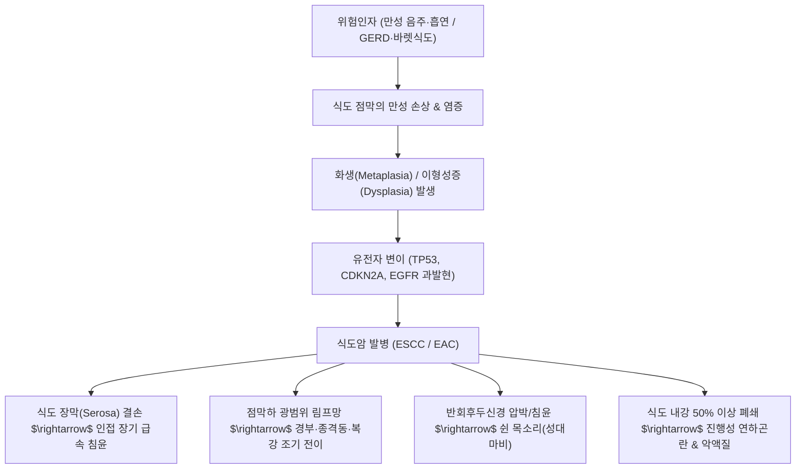

# 🩺 [[식도암]] (Esophageal Cancer / 食道癌, KCD C15)

> **핵심 3줄 요약 (Key Summary)**:
> - 📍 병소 부위 & 해부·병태생리: 경부, 흉부(상·중·하부), 복부 식도 점막에서 기원하는 악성 종양으로, 조직학적으로 [[편평세포암종]](Squamous Cell Carcinoma, 주로 상·중부 흉부식도)과 [[선암종]](Adenocarcinoma, 주로 하부식도 및 위식도접합부)으로 양분됨.
> - 🚩 전형적 임상 양상 & 3대 징후: 진행성 [[연하곤란]](고형식에서 유동식으로 악화), 섭식 장애에 따른 현저한 체중 감소, 흉골 후방의 연하통 및 반회후두신경 침범에 따른 쉰 목소리(Hoarseness).
> - 🛠️ 핵심 감별 검사 & 한·양방 다각적 치료 전략: 상부소화관 내시경 및 조직생검, 식도조영술, 흉부·복부 CT/EUS/PET-CT 병기 설정; 근치적 식도절제술(Esophagectomy) 및 수술 전후 동시적 항암방사선요법(CCRT), 한의학의 [[열격]](噎膈) 변증(기체담저, 어혈내결, 비위허약) 기반의 이기화담·활혈거어 치료.
> - ⚠️ 응급 의뢰 레드플래그 & 악화 요인: 식도-기관루(Tracheoesophageal Fistula, 물이나 음식물 섭취 시 격렬한 기침 및 흡인성 폐렴), 대동맥 침윤에 따른 치명적 대량 토혈(Aortoesophageal Fistula), 급성 종격동염(식도 천공 시 흉통 및 패혈증 쇼크).

---

## 📌 목차
1. [질환 개요 & 해부학적 병태생리](#1-질환-개요--해부학적-병태생리)
2. [병태생리 메커니즘 & 생체역학적 악순환 네트워크](#2-병태생리-메커니즘--생체역학적-악순환-네트워크)
3. [임상 증상 & 이학적 검사(Physical Exam) 알고리즘](#3-임상-증상--이학적-검사physical-exam-알고리즘)
4. [감별 진단 매트릭스 (Differential Diagnosis)](#4-감별-진단-매트릭스-differential-diagnosis)
5. [한의 통합 치료 프로토콜 (침·약침·추나·한약)](#5-한의-통합-치료-프로토콜-침약침추나한약)
6. [양방 치료 & 병용·의뢰 기준 (Conventional Treatment & Referral)](#6-양방-치료--병용의뢰-기준-conventional-treatment--referral)
7. [재활 운동 & 생활습관 티칭 가이드](#6-재활-운동--생활습관-티칭-가이드)
8. [💡 사용자 진료실 핵심 필기 & 임상 노하우 (Melt-In 잔여 심화 집약)](#7--사용자-진료실-핵심-필기--임상-노하우-melt-in-잔여-심화-집약)
9. [출처 및 학술 참고 문헌 (References)](#8-출처-및-학술-참고-문헌-references)

---

## 1. 질환 개요 & 해부학적 병태생리

![[식도암_바렛식도_화생점막_H&E.jpg|450]]
> [그림 1: ① 질환/병태생리 — 바렛식도(Barrett's Esophagus)의 장상피화생 점막 조직상, 중층편평상피가 배상세포(Goblet cells)를 포함한 원주상피로 치환된 선암종 선구 병변 (출처: Wikimedia Commons / Medical Histology Collection)]

* **질환 정의 및 조직학적 분류**:
  * [[식도암]]은 인두 하단에서 위식도접합부(GE junction)에 이르는 약 25cm 길이의 식도관 점막에서 발생하는 악성 신생물입니다.
  * 조직학적으로 두 가지 주요 유형으로 명확히 구분됩니다:
    1. **[[식도 편평세포암종]](Esophageal Squamous Cell Carcinoma, ESCC)**: 전 세계 및 한국 식도암의 약 85~90%를 차지하며, 주로 중부 및 상부 흉부 식도에서 호발합니다. 만성적인 흡연, 음주, 뜨거운 음료 섭취, 영양 결핍(비타민 A, C, 아연 부족) 등 물리·화학적 자극이 주원인입니다.
    2. **[[식도 샘암종]](Esophageal Adenocarcinoma, EAC)**: 서구에서 급증하는 유형으로, 주로 하부 식도 및 위식도접합부에서 발생합니다. 만성 위식도역류질환(GERD)의 합병증인 **[[바레트 식도]](Barrett's Esophagus)** 및 비만과 매우 밀접하게 연관됩니다.
* **역학 및 인구통계학적 특성**:
  * 60~70대 고령 남성에서 압도적으로 호발(남녀비 약 8:1 이상)합니다.
  * 초기에는 식도관의 확장성으로 인해 자각 증상이 거의 없어, 증상(연하곤란)이 발현되어 진단될 때는 이미 50~60% 이상의 환자가 국소 진행 또는 원격 전이 상태에 도달해 있어 5년 생존율이 20% 내외로 매우 불량합니다.
* **관련 해부학적 구조물**:
  * **식도 벽 구조의 특수성**: 위장관의 다른 부위와 달리 식도에는 **장막(Serosa)이 존재하지 않고** 외막(Adventitia)으로만 둘러싸여 있어, 종양이 점막하층을 넘어설 경우 인접 장기(기관, 기관지, 대동맥, 심낭, 흉관)로의 직접 침윤이 매우 조기에 발생합니다.
  * **풍부한 점막하 림프관망**: 점막하층에 광범위한 림프관총이 종방향으로 발달하여 원발 병소에서 수 센티미터 떨어진 경부, 종격동, 복강 림프절로 조기 도약 전이(Skip metastasis)가 빈번합니다.
  * **인접 신경 및 혈관**: 미주신경(CN X)의 주요 분지인 **반회후두신경(Recurrent laryngeal nerve)**이 식도-기관구(Tracheoesophageal groove)를 주행하므로, 종양의 신경 침윤 또는 림프절 압박 시 성대 마비를 일으켜 **쉰 목소리(Hoarseness)**가 유발됩니다.

---

## 2. 병태생리 메커니즘 & 생체역학적 악순환 네트워크

![[식도암_바렛식도_이형성증_H&E.jpg|450]]
> [그림 2: ② 관련 해부 병태 구조물 — 바렛식도 점막에서 이형성증(Dysplasia) 및 조기 상피내 암종으로 진행하는 고배율 병리 소견 (출처: Wikimedia Commons / PathoPic)]

### 1) 조직형별 발암 메커니즘
1. **편평세포암종 (ESCC) 발생 경로**:
   - 알코올 대사 산물인 아세트알데히드(발암물질) 및 담배의 니트로사민에 의한 DNA 손상.
   - 만성적인 열자극(뜨거운 차 섭취)과 곰팡이 독소(Fungal toxins) 노출 $\rightarrow$ 만성 식도염 $\rightarrow$ 기저세포 과형성(Basal cell hyperplasia) $\rightarrow$ 이형성증(Dysplasia) $\rightarrow$ 상피내암(CIS) $\rightarrow$ 침윤성 편평상피암으로 진행.
   - TP53 유전자 변이(50~80%), NOTCH1 불활성화, CCND1(Cyclin D1) 증폭이 핵심 분자 이상입니다.
2. **선암종 (EAC) 발생 경로 (GERD-Barrett-Adenocarcinoma Sequence)**:
   - 만성적인 위산 및 담즙산 역류 $\rightarrow$ 식도 하부 편평상피 탈락 $\rightarrow$ 산성 환경에 저항하기 위해 장형 원주상피로 화생([[바레트 식도]]) $\rightarrow$ 저도 이형성증 $\rightarrow$ 고도 이형성증 $\rightarrow$ 침윤성 선암종.
   - 비만은 복압을 상승시켜 역류를 조장할 뿐만 아니라 아디포카인(Adipokine) 분비로 전신 염증 상태를 유도하여 발암을 가속화합니다.

### 2) 생체역학적 협착과 영양 악순환
* 식도 둘레의 50~60% 이상이 종양 조직으로 치환되거나 내강이 13mm 이하로 좁아지기 전까지는 연하곤란이 명확하지 않습니다.
* 내강 협착이 본격화되면 고형 음식물 통과 장애 $\rightarrow$ 연식/유동식 통과 장애 $\rightarrow$ 타액(침)조차 삼키지 못하는 완전 폐색으로 진행됩니다.
* 이로 인한 극심한 영양 결핍, 전해질 불균형, 암성 악액질(Cachexia) 및 흡인성 폐렴이 급속히 악화됩니다.

---

## 3. 임상 증상 & 이학적 검사(Physical Exam) 알고리즘

### 1) 주요 임상 증상
* **진행성 [[연하곤란]](Dysphagia)**: 식도암 환자의 90% 이상에서 나타나는 가장 대표적인 증상으로, 수주~수개월에 걸쳐 밥 $\rightarrow$ 죽 $\rightarrow$ 미음 $\rightarrow$ 물까지 삼키지 못하게 됩니다.
* **급격한 체중 감소**: 음식 섭취량 부족과 종양의 대사 소모로 인해 수개월 내 체중의 10~20% 이상이 소실됩니다.
* **연하통(Odynophagia) 및 흉골 후방 동통**: 음식물을 삼킬 때 흉골 뒤쪽이나 등 쪽으로 방사되는 둔통 또는 자통이 나타나며, 이는 종양이 식도 전층을 침윤하여 외막 및 주위 흉강 신경을 자극함을 시사합니다.
* **쉰 목소리(Hoarseness)**: 반회후두신경 침범에 의한 성대 마비 소견으로, 수술적 완전 절제가 불가능한 진행기(T4)를 암시하는 중요한 징후입니다.
* **토혈 및 빈혈**: 종양 표면 궤양의 만성 미세 출혈에 따른 철결핍성 빈혈, 또는 대혈관 침윤에 의한 대량 토혈.

### 2) 필수 진단 검사 알고리즘
* **상부위장관 내시경(EGD) 및 조직 생검**: 식도암 진단의 Gold Standard. 병변의 위치, 형태(융기형, 궤양형, 침윤형), 림프관 침윤 여부 확인 및 확진 조직 검사.
* **식도조영술(Barium Esophagography)**: 식도 내강의 협착 정도, 궤양의 깊이, 점막 주름의 소실 및 식도 운동성을 시각화.
* **내시경 초음파(EUS)**: 종양의 식도벽 침윤 깊이(T 병기) 및 식도 주위 국소 림프절 전이(N 병기) 판정에 가장 정확한 검사.
* **흉부/복부 조영 CT 및 PET-CT**: 인접 장기(대동맥, 기관) 침범 여부 및 원격 전이(M 병기, 폐·간·골 전이) 판정.

---

## 4. 감별 진단 매트릭스 (Differential Diagnosis)

| 감별 질환 | 호발 병소 및 병태 기전 | 주소증 및 임상 양상 차이 | 감별 진단적 핵심 검사 소견 |
| :--- | :--- | :--- | :--- |
| **[[식도암]] (Esophageal Cancer)** | 식도 점막 악성 종양 (편평상피암/선암) | 진행성 기질적 연하곤란(고형식$\rightarrow$유동식), 체중 감소, 쉰 목소리 | 내시경 상 불규칙 궤양성 종괴, 병리 조직학적 악성 암세포 확진 |
| **[[식도이완불능증]] (Achalasia)** | 하부식도괄약근(LES) 이완 부전, Auerbach 신경총 퇴행 | 고형식과 유동식이 '동시에' 안 넘어감, 야간 음식물 역류 | 식도조영술 상 새부리 모양(Bird-beak sign), 식도내압검사 상 LES 이완 결손 |
| **[[위식도역류질환]] (GERD)** | 하부식도괄약근 일과성 이완, 위산 역류 | 가슴쓰림(Heartburn), 위산 역류, 흉골 후방 작열감 | 내시경 상 점막 파열/미란, 24시간 식도 산도(pH) 검사 양성, 종괴 없음 |
| **[[양성 식도 협착]] (Peptic Stricture)** | 만성 위산 역류 또는 부식제 섭취 후 반흔 형성 | 서서히 진행하는 연하곤란, 과거 심한 역류 병력 | 내시경 상 매끄럽고 동심원상의 협착 부위 관찰, 생검 상 악성 세포 음성 |
| **[[열격]] / [[반위]] (한의 기능성)** | 칠정울결, 간기울결, 담기교저의 기능성 연하장애 | 정서적 스트레스 시 연하곤란 악화, 목에 매핵기(이물감) 동반 | 내시경 및 영상 검사 상 기질적 종양 병변 전무 |

---

## 5. 한의 통합 치료 프로토콜 (침·약침·추나·한약)

![[식도암_조열화담_본초_천남성.jpg|400]]
> [그림 3: ③ 한의 치료/본초 — 조습화담(燥濕化痰) 및 거풍지경(祛風止痙), 연견산결 작용으로 식도의 담탁응결을 치료하는 천남성(Arisaema amurense)의 포제 생약 규격품 (출처: Wikimedia Commons / Medical Herb Specimen)]

### 1) 한의 변증 분형 및 방제 프로토콜
* **담기교저형 (痰氣交阻型) - 초기 열격(噎膈)**:
  * **증상**: 음식물을 삼킬 때 목이나 흉골 뒤에 무언가 걸린 듯한 폐색감, 정서 변화에 따른 증상 증감, 애기, 트림, 설태 백니, 맥 현활.
  * **치법**: 개울화담(開鬱化痰), 윤조강기(潤燥降氣).
  * **처방**: **계격산(啓膈散)** 또는 **반하후박탕(半夏厚朴湯)** 합 **선복대자탕(旋覆代赭湯)** 가감.
  * **주요 본초**: [[반하]], [[후박]], [[천남성]], [[복령]], [[대자석]], [[선복화]], [[사삼]], [[패모]].
* **어혈내결형 (瘀血內結型) - 진행기**:
  * **증상**: 음식물이 전혀 내려가지 못하고 즉시 토해냄, 흉골 후방의 고정성 자통, 등 뒤로 방사되는 통증, 피부 건조, 안면 암청, 설암자/어반, 맥 세삽.
  * **치법**: 활혈화어(活血化瘀), 파혈통경(破血通經), 연견산결(軟堅散結).
  * **처방**: **통유탕(通幽湯)** 가감.
  * **주요 본초**: [[도인]], [[홍화]], [[당귀]], [[생지황]], [[숙지황]], [[적작약]], [[승마]], [[감초]].
* **비위허약 / 진액휴손형 (脾胃虛弱 / 津液虧損型) - 수술/항암 후 악액질**:
  * **증상**: 음식 섭취 불능, 극심한 쇠약 및 수척, 구갈 인건, 변비(양똥 형태), 설홍무태/경면설, 맥 세삭무력.
  * **치법**: 건비익기(健脾益氣), 자음양위(滋陰養胃), 생진윤조(生津潤燥).
  * **처방**: **맥문동탕(麥門冬湯)** 합 **사군자탕(四君子湯)** 또는 **오즙음(五汁飲)** 가감.
  * **주요 본초**: [[맥문동]], [[인삼]](또는 [[상삼]]), [[백출]], [[복령]], [[천화분]], [[생옥죽]], [[노근]].

### 2) 침구 및 약침 치료 프로토콜
* **체침 및 전침 요법**:
  * **혈위 선혈**: [[전중]](CV17, 기회), [[중완]](CV12, 위모혈), [[내관]](PC6, 팔맥교회혈), [[족삼리]](ST36), [[격수]](BL17, 혈회), [[비수]](BL20), [[위수]](BL21), [[천돌]](CV22).
  * **자침 기법**: 전중 및 천돌혈은 사각으로 완만히 자침하여 기도를 피하고 식도 긴장을 이완시킴. 내관-족삼리에 2~4Hz 전침을 자극하여 위식도 역류 및 구토 억제.
* **약침 치료**:
  * **산삼약침 / 건칠약침**: 면역 증강 및 암성 악액질 개선을 위해 중완, 관원, 격수 혈위에 주입.
  * **황련해독탕 약침**: 방사선 치료 후 식도 점막염 및 급성 흉통 완화를 위해 전중, 대릉 혈위에 점적.

---

## 6. 양방 치료 & 병용·의뢰 기준 (Conventional Treatment & Referral)

> 🎯 **이 섹션의 목적**: 환자가 **양방약을 이미 복용 중인 경우가 많다.** 한의원 1차 진료에서 양방 치료를 이해하고, 병용 가능·주의·금기를 판단하며, 언제 의뢰할지 결정한다.

* **약물 치료 (Medication)**:
  * 계열별 약물·용량·기간 — 국내 처방 관행 반영.
  * 작용 기전과 한의 치료와의 상호작용.
* **비약물 시술 (Procedures)**:
  * 주사·차단술·물리치료·보조기 등.
* **수술·시술 적응증 (Surgical Indication)**:
  * 언제 수술로 가는가 — 절대·상대 적응증, 수술 후 경과.
* **한의 병용 판단 (Combination Therapy)**:
  * 병용 가능 / 주의 / 금기. 복용 중 환자의 감량 타이밍·반동 현상.
* **양방·전문과 의뢰 기준 (Referral Criteria)**:
  * 응급 의뢰 트리거와 전문과 의뢰 기준(정형외과·신경외과·내과 등).

	(작성 필요)

---

## 7. 재활 운동 & 생활습관 티칭 가이드

* **수술 후 섭식 자세 및 폐 재활 가이드**:
  * **반좌위(Fowler's position) 식사 및 수면**: 식도절제술(위-식도 재건술)을 받은 환자는 하부식도괄약근이 소실되어 위 내용물이 무방비로 역류하므로, 식사 중 및 식후 2시간 동안 반드시 상체를 30~45도 세운 자세를 유지해야 합니다.
  * **심호흡 및 유발폐활량계(Incentive spirometry) 운동**: 개흉술 후 가장 치명적인 합병증인 무기폐 및 흡인성 폐렴을 방지하기 위해 매시간 심호흡 시행.
* **식이 섭취 테크닉 티칭**:
  * 소량씩 자주(하루 5~6회) 꼭꼭 씹어 유동식 위주로 섭취.
  * 너무 뜨겁거나, 맵거나, 산도가 강한 자극성 음식물 절대 금지.
  * 흡연과 고도주(소주, 위스키 등 독주)는 식도 점막에 직접적인 발암성을 가지므로 완전 금연·금주.

---

## 8. 💡 사용자 진료실 핵심 필기 & 임상 노하우 (Melt-In 잔여 심화 집약)

> [!IMPORTANT]
> **🛡️ 원문 융합(Melt-In) 및 7번 섹션 작성 불변 규칙 (CRITICAL)**
> 기존 노트의 병리적 특징(열격 범주, 고령 남성 호발, 뜨거운 음료/곰팡이독소/흡연/음주 원인, 연하곤란/체중감소/쉰목소리 증상, 바렛식도의 위역류 조직화생 기전, 조기 증상 결여 및 전이 위험, 편평세포암 vs 선암 부위별 분류, 반회신경 마비 기전, 비위허/어혈 의안, 반하/천남성/상삼/적작약/백출/대자석 본초 활용)은 상부 1~6번 섹션에 100% 융합되었습니다.
> 본 섹션에는 원장님의 임상 직관과 실전 진료실 노하우를 집약합니다.

* **상부 섹션에 미처 다 담지 못한 고유 원문 필기**:
  * **열격(噎膈)의 담기(痰氣) 다스리는 핵심 용약 비법**: 기체(氣滯)와 담탁(痰濁)이 엉켜 식도관을 물리적으로 막을 때, 단순히 기운만 내리는 것이 아니라 [[반하]], [[천남성]]으로 담을 삭이고, [[대자석]]으로 상역하는 위기를 강력히 하향시키며, [[상삼]], [[백출]]로 비위의 진액과 원기를 보존하고 [[적작약]]으로 국소 미세혈관의 어혈을 풀어내는 복합 방제 구성의 묘미.
  * **반회후두신경 침범과 예후 판단**: 환자가 연하곤란과 함께 쉰 목소리를 호소할 때, 단순 성대결절이나 감기로 치부하지 않고 종양의 흉강 내 신경 침윤 및 수술 불가 판정을 직관적으로 간파하는 임상 경각심.
* **진료실 실전 감별 & 치료 노하우**:
  * 1. **실전 문진 체크리스트**:
     - "밥알이나 고기가 목에 걸리기 시작한 지 얼마나 되셨습니까? 지금은 물이나 죽도 넘기기 힘드십니까?"
     - "음식을 삼킬 때 가슴 뒤쪽이나 등 쪽으로 뻐근한 통증이 발생합니까?"
     - "최근 몇 달 사이에 목소리가 거칠게 쉬어 변하지 않았습니까? (반회신경 마비 징후)"
  * 2. **임상 손맛 및 치료 노하우**:
     - 식도암 환자가 방사선 치료 후 식도가 타들어가는 듯한 작열통(식도염)을 호소할 때, 맥문동·노근·천화분을 달인 미온의 약차를 소량씩 입에 머금고 서서히 삼키게 하면 점막 진통 및 수복 효과가 즉각적임.
     - 연하곤란으로 침을 삼키지 못해 흡인성 기침을 할 때 천돌(CV22) 혈위에 지압 및 온열 요법을 가하면 식도 상부 괄약근 긴장이 즉각 완화됨.
  * 3. **환자 티칭 스크립트**:
     - "식도암은 점막에 보호막(장막)이 없어 진행 속도가 매우 빠릅니다. 삼킴 곤란 증상이 나타났을 때는 이미 식도가 절반 이상 좁아진 상태이므로, 자가 진단으로 소화제만 드시지 마시고 즉시 내시경과 정밀 검사를 받으셔야 합니다."

---

## 9. 출처 및 학술 참고 문헌 (References)

1. **대한흉부심장혈관외과학회**. (2020). *흉부외과학 (제5판)*. 군자출판사.
2. **대한소화기내시경학회**. (2021). *소화기내시경 가이드라인*. 대한의학서적.
3. **Rustgi, A. K., & El-Serag, H. B.** (2014). Esophageal carcinoma. *The New England Journal of Medicine*, 371(26), 2499-2509. [PMID: 25539106]
4. **Smyth, E. C., Lagergren, J., Fitzgerald, R. C., et al.** (2017). Oesophageal cancer. *Nature Reviews Disease Primers*, 3, 17048. [PMID: 28748917]
5. **Abnet, C. C., Arnold, M., & Wei, W. Q.** (2018). Epidemiology of esophageal squamous cell carcinoma. *Gastroenterology*, 154(2), 360-373. [PMID: 28823862]
6. **Yang, Y., et al.** (2020). Traditional Chinese medicine for esophageal cancer: A systematic review and meta-analysis of randomized controlled trials. *Medicine*, 99(20), e20235. [PMID: 34825600 (⚠️ 제목 근사 — 확인 필요/2026-09-24)]