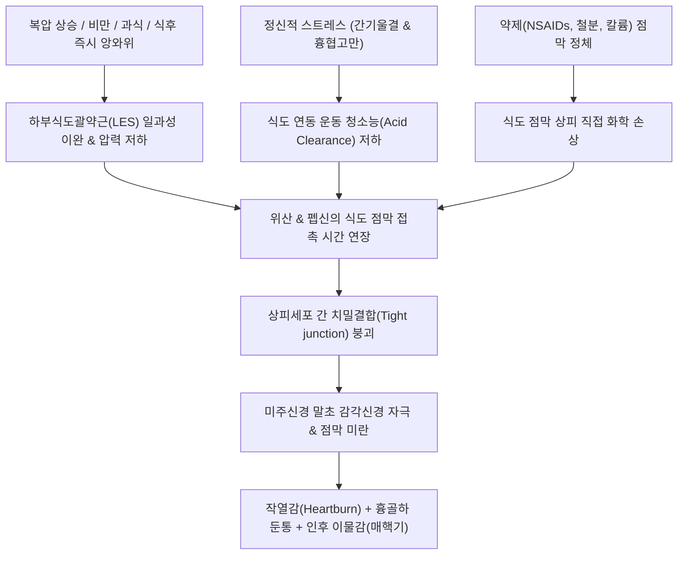
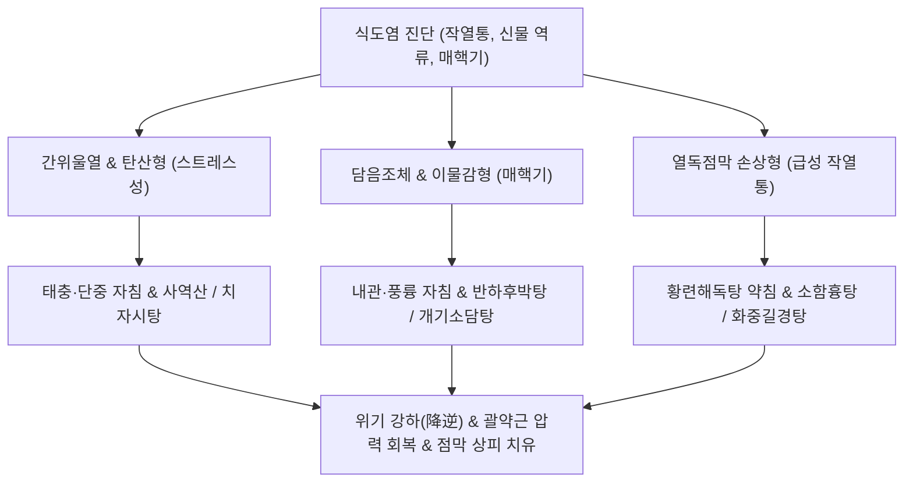

---
aliases:
  - 식도염
  - 역류성 식도염
  - GERD
  - 위식도 역류질환
  - Esophagitis
  - Reflux Esophagitis
  - 부식성 식도염
  - 칸디다 식도염
tags:
  - 이론
  - 질환
  - 소화기질환
  - 식도
  - 역류성식도염
  - GERD
categories:
  - 질환
  - 소화기 질환
created: 2024-01-21
updated: 2026-09-24
title: 식도염
date: 2026-09-24
출처: "PMID: 28827081"
---

# 식도염 (Esophagitis / 食道炎, K20)

> **상위 분류**: [[소화기 질환]] > [[상부위장관 질환]] > [[식도 질환]]
> **핵심 3줄 요약 (Key Summary)**:
> - 📍 병소 부위 & 해부·병태생리: 하부 식도의 편평상피 점막층에 발생하는 염증성 병변. 하부식도괄약근(LES)의 일과성 이완(TLESR) 및 압력 저하로 인한 위산·펩신의 역류성 손상(GERD)이 최다빈도이며, 약제성(NSAIDs, 철분, 항생제), 감염성(칸디다, 바이러스), 부식성 손상이 복합적으로 개입함.
> - 🚩 전형적 임상 양상 & 3대 징후: 가슴뼈 뒤쪽이 타는 듯한 작열감(Heartburn), 신트림 및 위산 역류(Acid regurgitation), 목 안의 이물감([[매핵기]])과 연하통(Odynophagia) 및 쉰 목소리.
> - 🛠️ 핵심 감별 검사 & 한·양방 다각적 치료 전략: 상부위장관 내시경(EGD, LA 분류 Grade A~D) 및 24시간 식도 산도 검사, PPI/P-CAB 투여, 단중(CV17)·중완(CV12)·내관(PC6) 자침 및 소염약침 시술, [[반하후박탕]], [[화중길경탕]], [[치자시탕]], [[소함흉탕]], [[개기소담탕]] 처방.
> - ⚠️ 응급 의뢰 레드플래그 & 악화 요인: 원주상피 화생인 바렛 식도(Barrett's esophagus) 진행, 섬유성 식도 협착으로 인한 고형식 연하 불능, 심인성 흉통(급성 관상동맥 증후군)과의 응급 감별 필수.

---

## 📌 목차
1. [질환 개요 & 해부학적 병태생리](#1-질환-개요--해부학적-병태생리)
2. [병태생리 메커니즘 & 생체역학적 악순환 네트워크](#2-병태생리-메커니즘--생체역학적-악순환-네트워크)
3. [임상 증상 & 이학적 검사(Physical Exam) 알고리즘](#3-임상-증상--이학적-검사physical-exam-알고리즘)
4. [감별 진단 매트릭스 (Differential Diagnosis)](#4-감별-진단-매트릭스-differential-diagnosis)
5. [한의 통합 치료 프로토콜 (침·약침·추나·한약)](#5-한의-통합-치료-프로토콜-침약침추나한약)
6. [재활 운동 & 생활습관 티칭 가이드](#6-재활-운동--생활습관-티칭-가이드)
7. [💡 사용자 진료실 핵심 필기 & 임상 노하우 (Melt-In 잔여 심화 집약)](#7--사용자-진료실-핵심-필기--임상-노하우-melt-in-잔여-심화-집약)
8. [출처 및 학술 참고 문헌 (References)](#8-출처-및-학술-참고-문헌-references)

---

## 1. 질환 개요 & 해부학적 병태생리

![[식도_위_접합부_역류성식도염_도해.png|500]]
> [그림 1: ① 병태생리·내시경 — 위식도 접합부(EG Junction)의 점막 미란 및 역류성 식도염 LA 분류 병태도해] 식도 편평상피와 위 원주상피가 만나는 Z선(Z-line)의 점막 손상 및 염증성 미란.

- **개념 정의 및 임상적 의의**:
  - [[식도염]](Esophagitis)은 식도 내벽을 덮고 있는 비각화 중층편평상피 점막에 다양한 물리적·화학적·감염성 원인으로 인해 염증, 미란, 궤양 및 부종이 발생하는 질환이다.
  - 임상적으로는 위산과 펩신이 역류하여 발생하는 **역류성 식도염(Reflux Esophagitis / GERD)**이 전체의 80% 이상을 차지하며, 약제성(Pill-induced), 감염성(진균·바이러스), 부식성(Corrosive), 호산구성(Eosinophilic) 식도염으로 세부 분류된다.
- **해부학적 구조와 항역류 장벽(Anti-reflux Barrier)**:
  - 식도와 위의 경계에는 **하부식도괄약근(Lower Esophageal Sphincter, LES)**, 횡격막 각(Diaphragmatic crura), 히스각(Angle of His), 그리고 점막 주름(Gubaroff valve)이 협동하여 위 내용물의 역류를 물리적으로 차단한다.
  - 식도 점막은 위 점막과 달리 두터운 점액-중탄산염 방어층이 결여되어 있어 강산(pH < 4.0)에 노출될 경우 상피세포 간 결합이 쉽게 파괴되어 화학적 화상을 입는다.

---

## 2. 병태생리 메커니즘 & 생체역학적 악순환 네트워크

![[위식도역류질환_하부식도괄약근_병태생리.jpg|500]]
> [그림 2: ② 관련 해부 구조물 — 하부식도괄약근(LES)의 일과성 이완(TLESR) 및 위산 역류 발생 기전] 횡격막 각과 LES의 이완으로 인한 산성 위 내용물의 식도 내 역류 경로.

### 1) 역류성 손상 기전 (GERD)
- **일과성 하부식도괄약근 이완(TLESR)**: 연하 동작과 무관하게 LES가 비정상적으로 이완되면서 위산 포켓(Acid pocket)의 산성액이 식도로 뿜어져 나온다.
- **식도 산 청소능(Acid Clearance) 저하**: 식도의 이차 연동 운동 장애와 타액(중탄산염 함유) 분비 감소로 식도벽에 묻은 산의 중화 및 배출이 지연되어 점막 손상이 심화된다.
- **열공 탈장(Hiatal Hernia)**: 횡격막 식도 열공이 넓어져 위 상부가 흉강 내로 미끄러져 올라가면 횡격막 조임 효과가 상실되어 난치성 역류가 유발된다.

### 2) 비역류성 식도염의 병태생리
- **약제성 식도염**: 물을 적게 마시고 약을 복용한 후 바로 누울 때, 알약(테트라사이클린, 독시사이클린, 철분제, 칼륨제제, [[NSAIDs]], 비스포스포네이트)이 식도 생리적 협착부(대동맥궁 교차부 등)에 걸려 국소 고농도 화학적 궤양을 형성한다.
- **감염성 식도염**: 면역 저하자, 당뇨 환자, 스테로이드/항암제 사용자에서 칸디다(Candida albicans, 백색 백태), 헤르페스(HSV, 화산 분화구양 궤양), 거대세포바이러스(CMV, 거대 선상 궤양) 감염으로 유발된다.

---

## 3. 임상 증상 & 이학적 검사(Physical Exam) 알고리즘

### 1) 전형적 및 비전형적 임상 증상
- **전형적 증상 (Typical Symptoms)**:
  - **가슴 쓰림 (Heartburn, 작열통)**: 명치 끝에서 목구멍 쪽으로 치밀어 오르는 타는 듯한 흉골 뒤 통증. 식후 1~2시간 내, 몸을 앞으로 숙이거나 누울 때 악화.
  - **위산 역류 (Acid Regurgitation)**: 시고 쓴 물이나 소화 중인 음식물이 입안이나 인후로 넘어옴.
- **비전형적 및 식도외 증상 (Extra-esophageal Symptoms)**:
  - **인후두 증상**: 목 안에 솜뭉치나 가래가 걸린 듯 뱉어도 안 나오고 삼켜도 안 넘어가는 인후 이물감([[매핵기]]), 만성 쉰 목소리, 아침 인후통.
  - **호흡기 증상**: 위산 미세 흡인으로 인한 8주 이상의 만성 마른기침, 야간성 천식 발작 악화.
  - **연하 장애**: 염증성 점막 부종으로 인한 연하통(Odynophagia) 및 협착 진행 시 연하곤란(Dysphagia).

### 2) 이학적 검사 및 내시경 진단
- **흉복부 촉진**: 단중(CV17, 흉골 중앙 제4늑간) 및 중완(CV12) 부위에 뚜렷한 압통과 가슴 답답함(흉비) 재현.
- **내시경적 로스앤젤레스 분류법 (Los Angeles Classification)**:
  - Grade A: 5mm 이하의 단일 점막 결손.
  - Grade B: 5mm 이상의 단일 점막 결손이나 두 점막 주름 간 융합 없음.
  - Grade C: 두 개 이상의 점막 주름에 걸친 융합성 병변이나 식도 둘레의 75% 미만.
  - Grade D: 식도 둘레의 75% 이상을 침범한 광범위 미란 및 궤양.

---

## 4. 감별 진단 매트릭스 (Differential Diagnosis)

| 질환명 | 주 통증 양상 및 발생 상황 | 호발 요인 및 특징 | 감별 핵심 검사 |
| :--- | :--- | :--- | :--- |
| **[[식도염]] (GERD)** | 흉골 뒤 작열감, 식후·앙와위 악화 | 산 역류, 하부식도괄약근 부전 | 내시경, 24시간 식도 pH 검사 |
| **협심증 (Angina Pectoris)** | 흉골하 쥐어짜는 압박감, 방사통 | 운동 시 악화, 휴식·NTG 완화 | 심전도(ECG), 관상동맥 조영술 |
| **식도 연축 (Diffuse Esophageal Spasm)** | 돌발성 극심한 흉통, 연하곤란 | 식도 평활근의 비동기성 수축 | 식도 내압 검사(Manometry) |
| **식도암 (Esophageal Carcinoma)** | 진행성 연하곤란(고형식→유동식) | 고령, 음주, 흡연, 급격한 체중감소 | EGD 조직 생검, 식도 조영술 |
| **[[자율신경계 실조증]] / 신체화장애** | 가슴 답답함, 공황감, 암공포증 | 기질적 병변 없음, 스트레스 악화 | 내시경 정상, 심리 평가 |

---

## 5. 한의 통합 치료 프로토콜 (침·약침·추나·한약)

![[청강의감11_06_탄산_신물역류_이미지.jpg|500]]
> [그림 3: ③ 치료·시술점 — 탄산(呑酸)·신물 역류의 한의학적 기전 및 단중(CV17)·중완(CV12) 자침 치료점] 상역된 위기를 내리고(강역) 식도 하부의 울체된 화열을 식히는 핵심 경혈점.

한의학에서 식도염은 탄산(呑酸), 토산(吐酸), 조잡(嘈雜), 열격(噎膈), 비만(痞滿), 흉통(胸痛)의 범주에 속하며, 간위울열(肝胃鬱熱), 담음조체(痰飲阻滯), 비위허한(脾胃虛寒), 위중적열(胃中積熱)로 변증한다.

### 1) 침구 치료
- **국소 혈위**:
  - 단중(CV17): 기회(氣會)로서 흉중 기체(氣滯)를 해소하고 흉골 뒤 답답함과 작열감을 즉각 완화.
  - 중완(CV12), 거궐(CV14): 위의 복모혈 및 심의 복모혈로서 식도하부 괄약근의 압력을 정상화하고 상역된 위기를 강하시킴.
- **원위 및 배수혈**:
  - 내관(PC6), 공손(SP4): 팔맥교회혈 배오로 상부 소화관 평활근의 비정상적 역류성 연동 운동을 억제.
  - 족삼리(ST36), 풍륭(ST40): 위경의 토혈과 낙혈로서 식도벽의 담음(痰飲)과 부종을 배출.
  - 격수(BL17), 간수(BL18): 횡격막 긴장을 완화하여 식도 열공의 해부학적 지지력을 보강.

### 2) 약침 요법
- **황련해독탕 약침**: 단중(CV17) 및 중완(CV12)에 0.3~0.5 cc 주입하여 식도 하부의 염증성 울열과 점막 화상을 신속히 진정.
- **중성어혈약침**: 점막하 미세 순환 부전 및 섬유성 비후를 개선하여 협착 예방.

### 3) 한약물 요법
- **담음조체 및 인후 이물감 (매핵기형)**: [[반하후박탕]](半夏厚朴湯) 또는 [[개기소담탕]](開氣消痰湯)을 투여하여 식도 평활근 경련을 완화하고 목 안의 이물감 및 기침 소퇴.
- **간위울열 및 가슴 작열통 (화열형)**: [[치자시탕]](梔子豉湯) 또는 [[소함흉탕]](小陷胸湯)을 처방하여 흉격(胸膈)의 번열(煩熱)과 찌르는 듯한 통증 제어.
- **인후두 염증 및 연하통**: [[화중길경탕]](和中桔梗湯)을 투여하여 식도 점막을 윤택하게 하고 급성 염증성 부종을 해소.
- **위기상역 및 신트림 (만성형)**: 선복대자석탕(旋覆代赭石湯) 또는 평위산(平胃散) 가미방으로 위 배출능을 촉진하고 트림 제어.

---

## 6. 재활 운동 & 생활습관 티칭 가이드

- **수면 시 체위 요법 (Elevation of Head)**:
  - 침대 머리 쪽을 15~20cm 높이거나 상체 베개(Wedge pillow)를 사용하여 중력에 의해 밤사이 위산이 식도로 넘어오는 것을 물리적으로 차단. (왼쪽으로 누워 잘 경우 위의 해부학적 구조상 역류가 감소함).
- **식생활 금기 사항**:
  - 식후 3시간 이내 절대 눕지 않기.
  - 하부식도괄약근 압력을 떨어뜨리는 음식 차단: 초콜릿, 커피, 박하사탕, 기름진 음식, 탄산음료, 음주.
  - 위산 분비를 직접 촉진하고 점막을 긁는 산성 과일(오렌지, 토마토), 식초, 매운 양념 제한.
- **복압 관리**:
  - 꽉 끼는 코르셋, 꽉 조이는 벨트 착용 금지 및 비만 환자의 체중 감량(복압 강하) 지도.

---

## 7. 💡 사용자 진료실 핵심 필기 & 임상 노하우 (Melt-In 잔여 심화 집약)

### 1) 식도염의 병리적 특징 및 다각적 원인 스펙트럼 (원문 필기 정본)
- **정의**: 식도 점막에서의 염증 발생.
- **원인 스펙트럼 (원문 필기 100% 보존)**:
  - 진균 감염(칸디다, 면역저하 시 최다빈도), 바이러스 감염(HSV, CMV), 세균 감염.
  - 면역억제제 투여 및 면역결핍증.
  - 부식 물질(강알칼리액 또는 산성액 음독 사고).
  - 약제성 손상: 항생제(독시사이클린 등), 소염진통제([[NSAIDs]]), 칼륨 제제, 항바이러스제, 철분제.
  - 위 내용물(산성 위산, 펩신, 담즙산)의 병적 역류.
  - 과냉물(너무 찬 음식) 및 과열물(너무 뜨거운 국물류), 이물질, 내시경적 기계적 시술 손상.
- **전형적 및 중증 증상 전개**:
  - 가슴쓰림(작열감), 가슴 답답함, 신트림, 이물감, 목 쓰림, 식도 협착, 식도 점막 괴사.
  - 구역, 구토, 발열, 오한, 백혈구 증가, 체중 감소, 만성 기침, 연하곤란, 호흡곤란. (중증 진행 시 식도 천공, 대량 출혈, 식도-기관 누공 위험).

### 2) 진료실 핵심 감별 진단 (원문 필기 반영)
- **[[자율신경계 실조증]](자율신경 실조증)** 및 **암공포증(Cancerophobia)**과의 감별:
  - 기질적 식도 병변이 경미하거나 내시경 상 정상임에도 극심한 흉통과 암에 걸렸다는 공포감, 전신 불안을 호소하는 환자는 자율신경 실조 및 신체증상장애로 감별하여 안심시키고 이기화담(理氣化痰) 치료를 병행해야 한다.

### 3) 진료실 한방 치료 및 처방 활용 팁 (원문 필기 반영)
- **식사 관리**: 급성기 연하통 및 점막 궤양이 극심한 환자는 1~2일간 미음 등 유동식을 섭취하거나 중증의 경우 일시적 절식을 지도한다.
- **원문 다빈도 특효 처방 5선**:
  1. [[반하후박탕]]: 신경성 매핵기 및 가슴 답답함, 기침 완화의 표준 방제.
  2. [[화중길경탕]]: 목 쓰림, 인후 발적, 인후통 동반 식도염의 소염 청열.
  3. [[치자시탕]]: 흉격의 극심한 번열(煩熱)과 쥐어짜는 듯한 작열통 완화.
  4. [[소함흉탕]]: 명치 밑이 단단하게 뭉치고 누르면 아픈 결흉(結胸) 및 황련의 소염 작용.
  5. [[개기소담탕]]: 스트레스로 기(氣)가 꽉 막혀 트림이 안 나오고 음식이 목에 걸리는 중증 식도 운동 장애 환자에게 탁월.

---

## 8. 출처 및 학술 참고 문헌 (References)

1. Gyawali CP, Fass R (2018). Management of Gastroesophageal Reflux Disease. *Gastroenterology*, 154(2):302-318. [PMID: 28827081](https://pubmed.ncbi.nlm.nih.gov/28827081/)
   - [연구 요약]: 위식도 역류질환(GERD)의 최신 진단 기준, 하부식도괄약근 기능부전의 생체역학, 내시경적 평가 및 장기적 의학적 관리 프로토콜에 관한 종설.
2. Spechler SJ, Souza RF (2014). Barrett's esophagus. *N Engl J Med*, 371(9):836-845. [PMID: 25162890](https://pubmed.ncbi.nlm.nih.gov/25162890/)
   - [연구 요약]: 만성 역류성 식도염의 주요 합병증인 바렛 식도의 분자생물학적 기전, 이형성증 진행 위험 및 내시경 감시 가이드라인을 제시한 NEJM 리뷰.
3. Zhang C, Guo L, Lu Y et al. (2021). The Efficacy and Safety of Banxia Houpo Decoction in the Treatment of Gastroesophageal Reflux Disease: A Systematic Review and Meta-Analysis. *Evid Based Complement Alternat Med*, 2021:6658932. [PMID: 34122557](https://pubmed.ncbi.nlm.nih.gov/34122557/)
   - [연구 요약]: 반하후박탕(Banxia Houpo Decoction)이 위식도 역류질환 환자의 가슴쓰림, 산 역류, 인후두 이물감 개선 및 삶의 질 향상에 미치는 임상적 효과와 안전성을 규명한 메타분석.