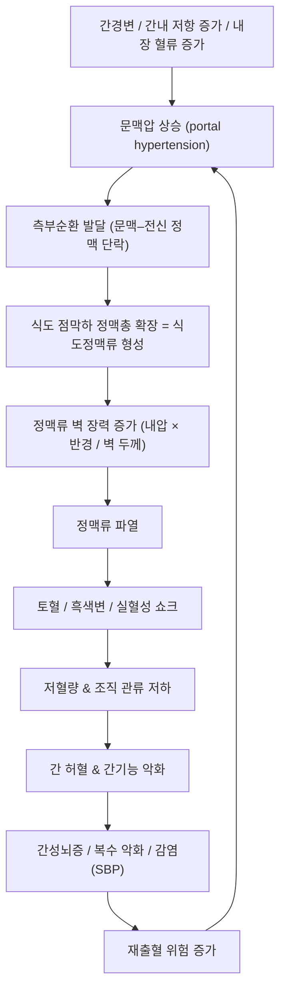

# 🩺 [[식도정맥류]] (Esophageal Varices / 食道靜脈瘤, ICD-10 I85.0·I85.9 / KCD I85.0·I85.9)

> **핵심 3줄 요약 (Key Summary)**:
> - 📍 병소 부위 & 해부·병태생리: 하부 식도 점막하 정맥총이 [[문맥압항진]]으로 인해 측부순환(porto-systemic collateral)으로 확장·굴곡된 상태. 좌위정맥(좌위정맥–식도정맥총–[[기정맥]])이 주된 유출로이며, 정맥류 벽 장력이 임계치를 넘으면 파열되어 대량 출혈을 일으킨다.
> - 🚩 전형적 임상 양상 & 3대 징후: 대부분 무증상(선별 [[상부위장관 내시경]]에서 발견) → 출혈 시 ① 토혈(hematemesis), ② 흑색변(melena), ③ 원인 불명의 빈혈·실신·저혈압. 만성 간질환의 말초징후(황달, [[복수]], 거미혈관종, caput medusae, [[비장비대]])가 동반된다.
> - 🛠️ 핵심 감별 검사 & 한·양방 다각적 치료 전략: 진단·치료의 중심은 응급 [[상부위장관 내시경]](진단 + [[내시경 정맥류 결찰술]](EVL)), 혈관활성제(터리프레신·옥트레오타이드)·예방적 항생제, 비선택적 베타차단제(NSBB)와 EVL을 축으로 하는 일·이차 예방. 한의 치료는 **활동성 출혈기를 절대 피하고** 회복기·재발방지 보조 영역에서 [[족삼리]]·[[태충]]·[[삼음교]] 중심으로 접근한다.
> - ⚠️ 응급 의뢰 레드플래그 & 악화 요인: 토혈/커피색 구토/흑색변/혈변, 기립성 어지럼·실신, 수축기혈압 저하·빈맥, 의식 변화([[간성뇌증]]), 복부 팽만 급증. 활동성 출혈 의심 시 즉시 응급실 이송 — 자침·부항·사혈·복부 심자·복압 상승 수기는 절대 금기.

---

## 📌 목차
1. [질환 개요 & 해부학적 병태생리](#1-질환-개요--해부학적-병태생리)
2. [병태생리 메커니즘 & 생체역학적 악순환 네트워크](#2-병태생리-메커니즘--생체역학적-악순환-네트워크)
3. [임상 증상 & 이학적 검사(Physical Exam) 알고리즘](#3-임상-증상--이학적-검사physical-exam-알고리즘)
4. [감별 진단 매트릭스 (Differential Diagnosis)](#4-감별-진단-매트릭스-differential-diagnosis)
5. [한의 통합 치료 프로토콜 (침·약침·추나·한약)](#5-한의-통합-치료-프로토콜-침약침추나한약)
6. [재활 운동 & 생활습관 티칭 가이드](#6-재활-운동--생활습관-티칭-가이드)
7. [💡 사용자 진료실 핵심 필기 & 임상 노하우 (Melt-In 잔여 심화 집약)](#7--사용자-진료실-핵심-필기--임상-노하우-melt-in-잔여-심화-집약)
8. [출처 및 학술 참고 문헌 (References)](#8-출처-및-학술-참고-문헌-references)

---

## 1. 질환 개요 & 해부학적 병태생리

![[식도정맥류_1.jpg|540]]
> [그림 1: Bleeding esophageal varices.png]

![[식도정맥류_2.jpg|540]]
> [그림 2: Embryological development of the human venous system.png]

* **질환 정의 및 분류**:
  * **정의**: 식도정맥류(esophageal varices)는 문맥압 항진으로 인해 문맥혈류가 전신정맥계로 우회하면서, 식도 점막하 정맥총이 확장·굴곡(tortuous dilatation)된 병태이다. 주로 **원위부(하부) 식도**에 발생하며, 위정맥류(gastric varices)와 합쳐 **식도·위정맥류(esophagogastric varices)**로 통칭한다. 정맥류 자체는 무증상 구조적 변화이지만, 파열 시 대량 출혈로 생명을 위협하는 응급질환이 된다 [PMID: 21748960].
  * **분류(발생 기전별)**:
    1. **Uphill(상행성) 정맥류**: [[간경변]] 및 문맥압 항진이 원인. 하부 식도에 위치하고 혈류가 상방(두경부 방향)으로 향한다. 임상에서 보는 대부분의 식도정맥류가 이에 해당한다 [PMID: 37001949].
    2. **Downhill(하행성) 정맥류**: **상대정맥 폐쇄(상대정맥 증후군)**에 의해 발생하며, 상부 식도에 위치하고 혈류가 하방으로 향한다. 종격동 종양, 중심정맥 도관 삽입, 종격동 섬유화 등이 원인이 될 수 있고, 문맥압 항진과는 기전이 완전히 다르다. 문맥압항진성 정맥류에 비해 출혈 빈도는 상대적으로 낮다고 보고되나, 진단과 처치 모두 까다로워 임상적 도전 과제로 정리된 바 있다 [PMID: 39903475].
  * **역학적 특성**: 문맥압 항진을 동반한 간경변증 환자에서 흔하게 동반되며, 정맥류 출혈은 간경변증 환자의 주요 사망 원인 중 하나로 다루어진다 [PMID: 37001949][PMID: 39575399]. **연령·성별별 정확한 발생률 수치는 제공된 논문에서 확인되지 않음(근거 미확인)**.
  * **코드**: ICD-10 / KCD 기준으로 **I85.0(출혈이 있는 식도정맥류)**, **I85.9(출혈이 없는 식도정맥류)**를 사용하며, 다른 질환에 분류된 경우 I98.3을 적용한다. (세부 코드 운용은 청구 지침에 따라 확인 필요)

* **관련 해부학적 구조물**:
  * **장기 및 점막 구조**:
    * **[[식도]]**: 경부·흉부·복부의 3분절로 구성되며, 정맥류는 주로 복부 식도–위식도접합부(lower esophageal sphincter 부근)에 분포한다. 식도 점막하층에는 풍부한 정맥총(venous plexus)이 존재해 문맥-전신 단락의 주요 통로가 된다.
    * **[[위]]**: 위정맥류(gastric varices)가 동반될 수 있으며, 위저부 정맥류는 위신장 단락(gastrosplenic/gastrophrenic shunt) 경로와 연관된다.
  * **혈관계(핵심)**:
    * **문맥계**: [[간문맥]] → 좌위정맥(left gastric/coronary vein)·단위정맥(short gastric veins) → 식도정맥총.
    * **전신정맥계**: 식도정맥총 → 기정맥(azygos vein)·반기정맥(hemiazygos vein) → [[상대정맥]].
    * 위 두 계통이 만나는 **식도 하부 점막하층이 문맥-전신 문합의 대표적 취약 지점**이며, 문맥압이 상승하면 이 부위가 측부순환으로 확장된다.
    * **Downhill 정맥류**의 경우 상대정맥 폐쇄 → 상부 식도 정맥총의 압력 상승 → 하방 유출 경로 확장이라는 역방향 기전을 따른다 [PMID: 39903475].
  * **동반 징후성 구조**: 복벽 정맥 확장(caput medusae), 항문정맥류, 비장비대 등 문맥압 항진의 다른 측부순환 징후가 함께 관찰될 수 있다.

> 참고: 본 질환은 근골격계 포착성 병변이 아니므로 [[관련근육]]·[[관련신경]] 대신 **혈관계·점막 구조**를 중심으로 정리한다.

---

## 2. 병태생리 메커니즘 & 생체역학적 악순환 네트워크

### 1) 해부학적·혈역학적 압박 기전
* **간내 저항 증가**: 간경변에 의한 섬유화·결절성 재생은 간 굴혈관의 구조적 저항을 높여 문맥압을 상승시킨다. 여기에 내장 혈관 확장에 따른 **과혈류 역학(hyperdynamic circulation)**이 더해져 문맥압이 한층 상승한다 [PMID: 37001949].
* **측부순환 형성**: 문맥압이 상승하면 문맥혈류가 압력이 낮은 전신정맥계로 우회하면서, 식도 하부 점막하 정맥총이 가장 먼저·뚜렷하게 확장된다 [PMID: 21748960].
* **벽 장력의 임계화**: 정맥류의 파열 위험은 정맥류 내압과 정맥류 반경에 비례하고 벽 두께에 반비례하는 개념(원통형 벽 장력, LaPlace의 법칙 유추)으로 설명된다. 따라서 정맥류가 커지고 내압이 높을수록 파열 위험이 커지며, **문맥압 저하 치료(NSBB 등)와 정맥류 자체의 기계적 제거(EVL)가 병행되는 이유**가 여기에 있다 [PMID: 39575399].
* **Downhill 정맥류의 상이한 기전**: 상대정맥 폐쇄가 선행하고 정맥류가 상부 식도에 국한되며, 문맥압 항진 치료(NSBB·TIPS 등)가 원칙적으로 적용되지 않는다는 점에서 감별이 필수적이다 [PMID: 39903475].

### 2) 생체역학적 연쇄 반응 (Vicious Cycle)
* 출혈 → 저혈량 → 간 관류 저하 → 간기능 악화 → 대사성·감염성 합병증(간성뇌증, [[복수]] 악화, 자발성 세균성 복막염 등) → **재출혈 위험 상승**이라는 악순환이 형성된다. 이 때문에 급성 출혈기 치료는 단순 지혈을 넘어 **재출혈 예방·합병증 차단**까지 포함한 포괄적 접근이 요구된다 [PMID: 39575399].
* 복압 상승(Valsalva, 격한 기침, 중량물 운반, 변비로 인한 배변 시 힘주기)은 정맥류 내압과 벽 장력을 순간적으로 끌어올려 파열의 방아쇠가 될 수 있다. → **진료실에서 환자 교육 시 반드시 짚어야 할 생활 관리 포인트.**

---

## 3. 임상 증상 & 이학적 검사(Physical Exam) 알고리즘

### 1) 주소증 및 임상 증상
* **무증상기(비출혈기)**: 대부분 증상이 없고, 간경변 진단 후 시행한 선별 내시경에서 우연히 발견된다. 따라서 **간경변 환자 관리의 핵심은 '증상'이 아니라 '선별 검사'**이다 [PMID: 37001949].
* **급성 출혈기(정맥류 출혈)**:
  * **토혈(hematemesis)** 또는 커피색 구토: 가장 전형적이고 극적인 발현.
  * **흑색변(melena)**: 타르 양상의 검은 변. 다량일 경우 암적색 혈변으로 나타날 수 있다.
  * **실혈에 따른 전신 증상**: 어지럼, 식은땀, 심계항진, 실신, 기립성 저혈압, 빈맥, 말초 냉감·창백.
  * **전구 증상**: 출혈 직전 상복부 불쾌감, 오심 등이 있을 수 있으나 특이적이지 않다.
* **만성 간질환의 동반 징후(진찰 소견)**:
  * 황달, 공막 황색, 거미혈관종(spider angioma), 수장홍반, 여성형 유방, 수축성 손가락.
  * **문맥압 항진 징후**: [[복수]], 하지 부종, 비장비대, 복벽 정맥 확장(caput medusae), 항문정맥류.
  * **뇌증 징후**: 의식 혼탁, 지남력 저하, 악수(asterixis) — [[간성뇌증]] 동반 시 예후 불량.

### 2) 필수 이학적 검사법 (Physical Examination)
* **활력징후 및 기립성 변화 측정(가장 먼저)**: 수축기혈압 저하, 빈맥, 기립 시 혈압 하강은 **활동성 대량 출혈의 즉시 신호**. 이 단계에서 문진·진찰을 길게 끌면 안 되고 응급 이송이 우선이다.
* **의식 상태 평가(의식수준·지남력·asterixis)**: 간성뇌증 여부는 치료 강도와 예후 판단에 직결된다.
* **복부 진찰**: 복부 팽만, 이동성 탁음(복수), 비장 촉지, 간 크기·표면(결절성), 압통 여부.
* **직장수지검사(DRE)**: 흑색변 확인. 출혈의 간접 증거로 유용하다.
* **피부·공막 관찰**: 황달, 출혈성 반점, 혈종(응고장애 시사), 거미혈관종.
* **[[상부위장관 내시경]](진단 확정 + 치료를 동시에 수행)**: 정맥류의 위치·크기·적색조(red color sign) 유무를 평가하고, 동시에 결찰술 등 지혈 처치를 시행한다 [PMID: 39575399]. 내시경적 소견 등급 체계(예: 크기 등급, red wale marking 등)는 문헌·기관마다 세부 기준이 달라 **본 노트에서는 세부 수치 근거 미확인**으로 표시한다.
* **검사실 검사**: CBC(혈색소·혈소판 감소), PT/INR 연장, 간기능(AST/ALT/빌리루빈/알부민), BUN/Cr(출혈·신기능), 혈액형 및 교차검사, 필요 시 혈중 암모니아.

---

## 4. 감별 진단 매트릭스 (Differential Diagnosis)

| 감별 질환 | 호발 병소 및 원인 | 주소증 차이점 | 특이적 이학적 검사 소견 |
| :--- | :--- | :--- | :--- |
| [[식도정맥류]] (본 질환, 문맥압항진성) | 하부 식도 점막하 정맥총, 간경변·문맥압 항진 | 무증상 → 대량 토혈·흑색변, 간질환 말초징후 동반 | 간경변 징후(황달·복수·비장비대), 내시경상 하부 식도 정맥류 + 적색조 |
| [[위정맥류]] | 위저부·위체부, 위신장 단락 | 토혈·흑색변, 식도정맥류와 동반되는 경우가 많음 | 내시경상 위 점막하 종물양 융기, 문맥압 항진 소견 동반 |
| [[소화성 궤양 출혈]] | 위·십이지장 궤양, H. pylori·NSAIDs | 상복부 통증 선행, 토혈·흑색변 | 간경변 징후 없음, 내시경상 궤양 병변 |
| [[Mallory-Weiss 증후군]] | 위식도접합부 열상, 구토 후 | 격심한 구토 후 토혈 | 음주력·구토력, 내시경상 열상 |
| 출혈성 위염 / 위암 / Dieulafoy 병변 | 위 점막·점막하 | 만성 빈혈 또는 급성 출혈 | 내시경 육안 소견이 감별의 결정적 근거 |
| [[하행성 식도정맥류]](Downhill varices) | **상부 식도**, 상대정맥 폐쇄(종격동 종양·중심정맥 도관·종격동 섬유화) | 문맥압 항진 소견이 없고 얼굴·상지 부종 등 상대정맥 폐쇄 증상 동반 | 흉부 영상에서 상대정맥 폐쇄 병변, 문맥압 항진 징후 부재 [PMID: 39903475] |

> **감별 포인트**: ① 토혈 환자에서 간경변 말초징후가 있으면 정맥류 출혈 가능성이 높지만, **궤양 출혈이 동반될 수 있으므로 내시경 확인 없이 단정하지 않는다**. ② 상부 식도에 국한된 정맥류 + 얼굴/상지 부종이면 하행성 정맥류를 반드시 의심한다 [PMID: 39903475].

---

## 5. 한의 통합 치료 프로토콜 (침·약침·추나·한약)

![[식도정맥류_3.jpg|540]]
> [그림 3: Endoscopic laser photocoagulation in the treatment of upper gastrointestinal bleeding (IA endoscopiclaserp00cart).pdf]

> **치료 원칙(가장 중요)**: 식도정맥류 **출혈은 응급질환**이다. 활동성 출혈이 의심되는 시점에서는 혈관활성제·예방적 항생제·내시경적 지혈(EVL) 등 **양방 응급 처치가 최우선**이며 [PMID: 39575399], 한의 치료는 ① 출혈이 완전히 멈추고 활력징후가 안정된 **회복기**, ② **재출혈 예방 및 전신 상태 관리 보조** 영역에서 병행한다. 식도정맥류에 대한 침·약침·한약의 직접적 치료 효과를 검증한 무작위 대조시험은 제공된 논문에서 확인되지 않음(**근거 미확인**) — 따라서 아래 내용은 **안전성 중심의 임상 원칙**으로 이해해야 한다.

* **침구 치료 (Acupuncture)**:
  * **적응 시점**: 활동성 출혈이 없고, 혈소판·응고 수치가 안전 범위이며, 내시경적 처치 후 안정된 회복기.
  * **타겟 혈위(변증에 따라 선택)**: [[족삼리]](ST36)·[[중완]](CV12) — 비위 기능 회복 및 소화기 조절 / [[태충]](LR3)·[[삼음교]](SP6) — 간·비 기능 조절 및 기혈 순환 / [[격수]](BL17, 血會)·[[간수]](BL18)·[[비수]](BL20) — 만성 간질환의 기력 회복 보조.
  * **자침 시 절대 실무 주의**: 간경변 환자는 **혈소판 감소 및 PT/INR 연장**이 흔하다. 얇은 멸균 침 사용, 자극 최소화, 발침 후 **충분한 압박 지혈(최소 1~2분)**, 자침 부위 멍·출혈 확인을 루틴으로 시행한다. **사혈(刺血)·부항·심자(深刺)는 금기**.
  * 전침 주파수 세팅 등 구체적 프로토콜은 본 질환에 대한 근거가 없어 **근거 미확인**.
* **약침 치료 (Pharmacopuncture)**:
  * 출혈 경향이 있는 환자에서 약침은 **원칙적으로 보류**한다. 불가피한 경우 소량·표층·비출혈 부위에 한정하며, 항응고·항혈소판 제제 복용 여부를 반드시 확인한다.
  * 간경변·문맥압 항진 자체를 목표로 하는 약침 프로토콜은 **근거 미확인** — 임상적 근거 없이 혈위를 확대 적용하지 않는다.
* **추나 치료 (Chuna Manipulation)**:
  * **복부 추나 및 복압을 상승시키는 수기(복부 압박, 강한 흉요추 신전 등)는 금기**. 복압 상승은 정맥류 벽 장력을 순간적으로 높여 파열 위험을 증가시킬 수 있다.
  * 허용 가능 범위: 안정된 회복기에서 **경추·흉추의 가벼운 가동 및 연부조직 이완** 정도로 제한. 간비대·비장비대·복수가 있는 경우 복부·늑골하부 조작은 피한다.
* **한약 치료 (Herbal Medicine)**:
  * **변증 접근 예시(임상 일반론)**: 간울비허(肝鬱脾虛) → 소간건비 / 기체혈어(氣滯血瘀) → 행기활혈 / 수습내정(水濕內停) → 이수삼습. 복수·부종 동반 시 이수(利水) 계열을 고려한다.
  * **⚠️ 핵심 주의사항**:
    1. **활혈거어제(活血祛瘀劑)**는 이론상 어혈 개선에 활용되지만, **출혈 경향 환자에서는 출혈 위험을 높일 수 있어 신중 또는 금기**로 운용한다. 정맥류 출혈 병력이 있는 환자에서 무분별한 활혈 처방은 위험하다.
    2. **간독성 우려 약재 회피** 및 간수치 정기 추적.
    3. NSBB·이뇨제(스피로놀락톤 등)·락툴로오스 등 양약과의 **상호작용 및 용량 조정** 확인.
  * 식도정맥류 재출혈 예방을 위한 특정 처방의 유효성은 제공된 논문에서 확인되지 않음(**근거 미확인**).

---

## 6. 재활 운동 & 생활습관 티칭 가이드

* **절대 금기 및 회피 행동(최우선 교육)**:
  * **금주**: 가장 중요한 단일 항목. 알코올은 간 손상 진행과 정맥류 출혈 위험을 모두 높인다 [PMID: 37001949].
  * **NSAIDs·아스피린 등 위점막 손상·출혈 위험 약물 회피**. 진통제가 필요하면 반드시 처방 의와 상의하도록 안내.
  * **복압 상승 행동 회피**: 무거운 물건 들기, 격한 복부 운동, 배변 시 과도한 힘주기, 격한 기침 방치.
* **식이 및 생활 관리**:
  * **저염식**: 복수·부종 조절을 위해 염분 제한이 기본. 구체적 하루 섭취량 기준은 개별 처방에 따르며 본 노트에서는 **수치 근거 미확인**.
  * **변비 예방**: 규칙적 배변 유지가 복압 상승 예방에 직결된다. 수분 섭취, 섬유질, 필요 시 처방 약제.
  * 자극적·딱딱한 음식(생선 가시, 단단한 껍질 등)이 식도 점막을 손상시키지 않도록 주의.
* **운동 프로그램(회복기 기준)**:
  * **저강도 유산소**: 평지 걷기 20~30분, 주 3~5회 수준에서 시작. 피로·어지럼 시 즉시 중단.
  * **저강도 근력 운동**: 가벼운 밴드·체중 이용, **Valsalva 호흡 참기 금지**, 호기 시 힘을 쓰는 방식으로 지도.
  * 금기: 무거운 역기, 복부 압박 자세(플랭크 고강도 변형 등), 버피·점프 등 충격성 운동.
* **추적 관찰 및 자가 모니터링 교육**:
  * 간경변 진단 환자는 **정기 선별 내시경**이 표준 관리의 축이다 [PMID: 37001949]. 검사 주기는 간기능·정맥류 크기에 따라 담당 의가 결정하므로 진료실에서는 "정해진 날짜를 놓치지 않는 것"을 강조한다.
  * **즉시 응급실행 신호**를 환자·보호자에게 명확히 교육: ① 검은 변(타르변), ② 토혈·커피색 구토, ③ 어지럼·식은땀·실신, ④ 갑작스러운 복부 팽만, ⑤ 말이 어눌해짐·졸림(간성뇌증).
  * NSBB 복용 중인 환자: **임의 중단 금지**(중단 시 재출혈 위험 상승), 어지럼·서맥 등 부작용 시 처방 의와 상의.

---

## 7. 💡 사용자 진료실 핵심 필기 & 임상 노하우 (Melt-In 잔여 심화 집약)

> [!IMPORTANT]
> **🛡️ 원문 융합(Melt-In) 및 7번 섹션 작성 불변 규칙 (CRITICAL)**
> 1. **기존 필기 내용 상부 전면 융합 (Melt-In)**: 질환의 정의, 해부학적 원인, 증상, 검사법, 치료법, 생활 티칭은 상부 1~6번 섹션에 100% 녹여내어 고도화하였다.
> 2. **7번 섹션은 녹이고 남은 고유 필기만 수록**: 아래는 상부에 담기 어려운 **진료실 실전 판단·문진·설명 스크립트**만을 엄선한 것이다.
> 3. **📷 질환 노트 필수 3종 이미지 수록**: ① 병태생리·영상, ② 해부 구조물, ③ 치료·시술점 이미지를 노트 상단에 배치하였다.

* **상부 섹션에 미처 다 담지 못한 고유 원문 필기**:
  * **"식도정맥류는 한의원에서 '치료'할 질환이 아니라 '발견하고 즉시 넘겨야 할' 질환"** — 진료실에서 정맥류 자체를 관리하려 시도하지 말고, 발견·선별·교육·이송의 역할에 집중한다. 이 원칙 하나가 사고를 막는다.
  * **내시경 결과지 읽기 최소 세트**: (1) 정맥류 **위치**(하부/상부 식도 — 상부면 상대정맥 폐쇄 계열을 의심 [PMID: 39903475]), (2) **크기 표현**(small/large 등 문헌마다 등급 체계가 달라 개별 표기 확인 필요 — **세부 등급 기준 근거 미확인**), (3) **적색조(red color sign) 기재 여부** — 적색조는 출혈 위험 평가에서 중요하게 다뤄지는 소견이므로, 기재가 있으면 "출혈 위험이 높게 평가된 상태"로 해석하고 환자에게 경고 교육을 강화한다.
  * **환자 상태별 진료 가능성 판정(3단 분류)**:
    * 🟥 **불가**: 활동성 출혈 병력 24~72시간 이내, 토혈·흑색변 지속, 혈역학 불안정, 의식 변화 → **한의 치료 없이 즉시 응급 이송**.
    * 🟨 **보류/제한**: 최근 EVL 시술 직후, INR 연장·혈소판 감소가 뚜렷, 복수 조절 불안정 → 내과 협진 후 경과 확인, 침 치료는 보류 또는 최소화.
    * 🟩 **가능(보조)**: 출혈 병력이 없고 안정적으로 추적 중, 혈소판·응고 수치가 안전 범위, 일상생활 가능 → 변증 기반 보조 치료 + 생활 교육.
  * **간독성 위험 인지**: 간경변 환자는 약물 대사능이 떨어져 있어, 한약 처방 시 통상 용량보다 보수적으로 접근하고 간수치 추적을 루틴화한다.

* **진료실 실전 감별 & 치료 노하우**:
  * **1. 실전 문진 체크리스트(내원 즉시 5문항)**:
    1. "최근 **검은 변**을 본 적 있습니까? 변기 물이 붉게 물든 적은?" — 가장 민감도 높은 질문.
    2. "**피를 토했거나 커피색 액체를 게운 적**이 있습니까?"
    3. "간경변·B형/C형 간염·음주력 관련 **진단을 받은 적**이 있습니까? 마지막 내시경이 언제였습니까?"
    4. "**술**은 얼마나, 얼마나 자주 마십니까? **진통제(NSAIDs)**를 상습 복용하십니까?"
    5. "쉽게 **멍이 들거나 잇몸 출혈**이 잦아졌습니까?" — 응고장애 시사 소견.
  * **2. 치료 순서 및 손맛 노하우**:
    * 순서: ① 활력징후·의식 확인 → ② 응급 여부 판정(🟥/🟨/🟩) → ③ 응급이면 즉시 이송 + 보호자 연락 → ④ 안정 환자에 한해 변증·치료.
    * 자침: **가는 침(0.20mm 이하)**, 자극은 약하게(de-qi 최소), 유침 시간 단축(10분 내외 권장), 발침 시 **건조 멸균 거즈로 1~2분 압박**. 멍이 잘 드는 환자는 발침 후 5분간 관찰 후 귀가시킨다.
    * 부항·사혈·복부 심자·복압 유발 수기: **어떤 상황에서도 시행하지 않는다**.
  * **3. 환자 티칭 스크립트(그대로 읽어줄 수 있는 문장)**:
    * "이 병은 **새는 수도꼭지**를 생각하시면 됩니다. 물길(문맥)이 막혀서 옆의 얇은 관(식도 정맥)에 압력이 몰린 상태예요. 그래서 **압력을 올리는 행동 — 술, 무거운 것 들기, 변비로 힘주기 — 을 피하는 것이 치료의 절반**입니다."
    * "검은 변은 이 병의 **가장 빠른 신호**입니다. 색이 이상하면 밤이라도 지체 없이 응급실로 가셔야 합니다. 이건 참는 병이 아닙니다."
    * "내시경으로 정맥류를 묶는 시술(결찰술)은 **재출혈을 막는 가장 확실한 방법** 중 하나입니다. 그리고 약(베타차단제)은 **끊으면 위험이 다시 올라가니 임의로 끊지 마세요**."
    * "한약과 침은 **몸의 기운과 소화 기능을 돕는 보조 역할**입니다. 피를 멈추는 치료가 아니므로, 출혈이 생기면 한의원보다 **응급실이 먼저**입니다."

---

## 8. 출처 및 학술 참고 문헌 (References)

1. **Giordano C, Klingler AM (2011)**. *Esophageal varices*. **JAAPA**. PMID: 21748960
   - **[연구 요약]**: 식도정맥류의 정의, 문맥압 항진과의 관계, 임상 발현(무증상~대량 출혈) 및 기본적 평가·치료 개요를 정리한 임상 리뷰. 본 노트의 질환 정의·측부순환 기전 서술의 근거로 사용.
2. **Wright IO (1998)**. *Esophageal varices: treatment and implications*. **Gastroenterol Nurs**. PMID: 9555360
   - **[연구 요약]**: 식도정맥류 치료의 간호학적 관점 정리 — 치료 후 모니터링, 환자 교육 및 추적 관리의 중요성을 다룸. 본 노트 6~7번 섹션(환자 교육·생활 관리)의 근거로 참조.
3. **Binmoeller KF, Grimm H (1992)**. *Treatment of esophageal varices*. **Endoscopy**. PMID: 1559495
   - **[연구 요약]**: 내시경적 치료(경화요법 등) 중심의 식도정맥류 치료법을 정리한 시기별 리뷰. 내시경적 치료의 발전 과정 및 치료 원칙 서술의 근거로 사용.
4. **Wang D, Ma Z (2025)**. *An overview of downhill esophageal varices: a challenge for medical practice*. **Ann Med**. PMID: 39903475
   - **[연구 요약]**: 상대정맥 폐쇄에 의해 발생하는 **하행성(downhill) 식도정맥류**의 개념·원인·진단적 어려움을 정리. 문맥압 항진성(상행성) 정맥류와의 기전적 차이 및 상부 식도 병변의 감별 필요성 근거로 사용.
5. **Jothimani D, Rela M (2023)**. *Liver Cirrhosis and Portal Hypertension: How to Deal with Esophageal Varices?* **Med Clin North Am**. PMID: 37001949
   - **[연구 요약]**: 간경변 및 문맥압 항진 환자에서 식도정맥류를 어떻게 평가·관리할 것인가에 대한 임상 지침형 리뷰 — 선별 내시경, NSBB 및 내시경적 예방 치료, 금주 등 위험 인자 관리의 근거로 사용.
6. **Singh S, Chandan S (2024)**. *Comprehensive approach to esophageal variceal bleeding: From prevention to treatment*. **World J Gastroenterol**. PMID: 39575399
   - **[연구 요약]**: 식도정맥류 출혈의 예방부터 급성 출혈 처치까지 포괄적 접근을 정리 — 혈관활성제, 예방적 항생제, 내시경적 지혈, 구조적 치료(TIPS 등) 단계적 전략의 근거로 사용. 본 노트 3·5번 섹션의 치료 프로토콜 서술에 반영.

> **근거 미확인으로 표시한 항목(재확인 필요)**: ① 간경변 환자에서의 정확한 정맥류 발생률·출혈률 수치, ② 내시경적 정맥류 등급 분류 체계의 세부 기준, ③ 식도정맥류에 대한 침·약침·한약 치료의 유효성(무작위 대조시험 미확인), ④ 저염식 염분 제한의 구체적 수치 기준.

<!-- 보관 태그(1회용·링크오류, 필요시 복원): 문맥압항진, 정맥류출혈 -->
