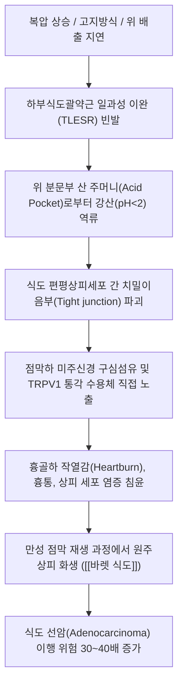

# 🩺 역류성 식도염 (Gastroesophageal Reflux Disease, GERD / KCD K21)

> **핵심 3줄 요약 (Key Summary)**:
> - 📍 병소 부위 & 병태생리: 위산, 펩신, 담즙 등 위 내용물이 하부식도괄약근(LES) 기능부전 및 복압 상승으로 인해 식도로 병적 역류하여 식도 점막의 미란, 궤양, 원주상피 화생(바렛 식도)을 초래하는 만성 염증성 질환.
> - 🚩 전형적 임상 양상 & 3대 징후: 흉골하 작열감(Heartburn, 가슴쓰림), 산역류(Acid regurgitation), 식도외 증상(만성 기침, 쉰 목소리, 인후 이물감 [[매핵기]], 비심인성 흉통).
> - 🛠️ 핵심 감별 검사 & 한·양방 치료: 상부위장관 내시경(LA 분류체계), 24시간 식도 다채널 임피던스-pH 검사; 양방 PPI/P-CAB 제제 투여, 한의학 탄산(呑酸)·토산(吐酸)·조잡(嘈雜) 변증에 따른 [[반하사심탕]], [[좌금환]], [[시호소간산]], [[선복대자탕]] 및 중완·거궐·단중·내관 침구 치료.
> - ⚠️ 응급 감별 & 생활 티칭: 격심한 흉통 시 [[협심증]] 및 심근경색 등 심장 질환 우선 배제; PPI 장기 복용 합병증(골다공증, 장염)을 막는 한약 병용 감량 및 취침 시 상체 15~20cm 거상 수면 지도 필수.

---

## 📌 목차
1. [질환 개요 & 해부학적 병태생리](#1-질환-개요--해부학적-병태생리)
2. [병태생리 메커니즘 & 생체역학적 악순환 네트워크](#2-병태생리-메커니즘--생체역학적-악순환-네트워크)
3. [임상 증상 & 이학적 검사(Physical Exam) 알고리즘](#3-임상-증상--이학적-검사physical-exam-알고리즘)
4. [감별 진단 매트릭스 (Differential Diagnosis)](#4-감별-진단-매트릭스-differential-diagnosis)
5. [한의 통합 치료 프로토콜 (침·약침·추나·한약)](#5-한의-통합-치료-프로토콜-침약침추나한약)
6. [양방 치료 & 병용·의뢰 기준 (Conventional Treatment & Referral)](#6-양방-치료--병용의뢰-기준-conventional-treatment--referral)
7. [재활 운동 & 생활습관 티칭 가이드](#6-재활-운동--생활습관-티칭-가이드)
8. [💡 사용자 진료실 핵심 필기 & 임상 노하우 (Melt-In 잔여 심화 집약)](#7--사용자-진료실-핵심-필기--임상-노하우-melt-in-잔여-심화-집약)
9. [출처 및 학술 참고 문헌 (References)](#8-출처-및-학술-참고-문헌-references)

---

## 1. 질환 개요 & 해부학적 병태생리

![[위식도역류질환_하부식도괄약근_병태생리.jpg|450]]
> [그림 1: ① 병태생리·영상 — 위식도 역류질환 하부식도괄약근(LES) 기능부전 및 산 역류 병태생리 도해]

* **질환 정의 및 분류**:
  * 위식도 역류질환(Gastroesophageal Reflux Disease, GERD)은 위 내용물이 식도 내로 역류하여 불편한 자각 증상(가슴쓰림, 산역류)을 야기하거나 식도 점막의 조직학적 손상(미란, 궤양, 바렛 식도)을 일으키는 질환군입니다.
  * 내시경 소견상 점막 결손이 관찰되는 **미란성 역류질환(Erosive Reflux Disease, ERD, 전형적 역류성 식도염)**과 점막 결손이 관찰되지 않으나 동일한 고통을 호소하는 **비미란성 역류질환(Non-Erosive Reflux Disease, NERD)**으로 분류되며, 실제 임상 환자의 약 60~70%는 NERD에 해당합니다.
* **역학적 특성**:
  * **유병률**: 서구 인구의 15~25%에서 보고되며, 한국을 포함한 동아시아에서도 식습관 서구화, 비만율 상승, 헬리코박터 감염률 감소와 맞물려 10~15% 수준으로 급증하고 있습니다.
  * **호발 인자**: 복부 비만, 흡연, 음주, 고지방식 섭취, 카페인 음용, 야식 습관, 칼슘채널차단제(CCB) 및 진통소염제 복용자에서 호발합니다.
* **관련 해부학적 구조물**:
  * **하부식도괄약근(Lower Esophageal Sphincter, LES)**: 식도 말단 3~4cm 길이의 특수 평활근대로 평상시 10~30mmHg의 기저압을 유지하여 역류를 차단합니다.
  * **식도열공(Esophageal Hiatus) 및 횡격막 다리(Diaphragmatic Crura)**: 횡격막이 외부에서 LES를 조여주는 외인성 밸브 역할을 수행합니다.
  * **식도-위 접합부(EGJ) 및 Z-선(Z-line)**: 식도의 중층편평상피와 위의 단층원주상피가 만나는 경계선으로, 산 노출 시 가장 먼저 미란과 염증이 발생하는 핵심 병소입니다.

---

## 2. 병태생리 메커니즘 & 생체역학적 악순환 네트워크

![[식도열공허니아_활탈성탈장_해부도.png|500]]
> [그림 2: ② 관련 해부 구조물 — 정상 식도-위-횡격막 구조 및 식도열공 허니아(Hiatal Hernia) 해부 도해]

![[식도_위_접합부_역류성식도염_도해.png|380]]
> [그림 3: ② 관련 해부 구조물 — 식도-위 접합부(EGJ) 점막 손상 및 편평상피 미란 도해]

### 1) 하부식도괄약근(LES) 기능부전 및 TLESR
* 음식물 섭취 후 위저부가 팽만될 때 연하와 무관하게 발생하는 **일과성 하부식도괄약근 이완(Transient LES Relaxation, TLESR)**이 역류의 주된 기전입니다.
* TLESR은 미주신경 반사에 의해 유발되며, 역류 환자에서는 TLESR의 빈도가 증가하거나 1회당 지속 시간이 연장되어 산 역류를 허용합니다.

### 2) 식도열공 허니아(Hiatal Hernia)와 복압의 생체역학
* 복부 비만, 만성 기침, 변비 등으로 복강 내 압력이 상승하면 횡격막 다리가 이완되어 위 분문부가 흉강 내로 밀려 올라가는 **활탈성 식도열공 허니아(Sliding Hiatal Hernia)**가 발생합니다.
* 이로 인해 횡격막의 외인성 조임 압력이 상실되고, 허니아 낭(Hernia sac) 내에 갇힌 산이 연하 시마다 식도로 쉽게 역류하는 역학적 악순환이 형성됩니다.

### 3) 산 주머니(Acid Pocket)와 식도 산 청식능력 지연
* 식후 위 체부의 음식물은 위산과 섞여 중화되지만, 위 분문부 직하부에는 완충되지 않은 고농도 순수 강산(pH 1.0~2.0) 층인 **산 주머니(Acid Pocket)**가 형성됩니다.
* 정상 상태에서는 식도의 2차 연동운동과 타액 속 중탄산염($HCO_3^-$)이 역류된 산을 신속히 중화·세척(Esophageal Acid Clearance)하지만, 식도 운동 이상 환자에서는 산 노출 시간이 지연되어 상피 괴사가 심화됩니다.

### 4) 바렛 식도 (Barrett's Esophagus)
* 만성적인 산·담즙 노출로 인해 식도 원위부의 정상 중층편평상피가 장형 원주상피(배상세포 동반 Specialised intestinal metaplasia)로 치환되는 병태입니다.
* CDX2 전사인자 발현과 관련되며, 이형성증(Dysplasia)을 거쳐 식도 선암으로 진행할 수 있는 대표적 전암성 병변입니다.

---

## 3. 임상 증상 & 이학적 검사(Physical Exam) 알고리즘

![[역류성식도염_식도점막_조직병리_H&E.jpg|450]]
> [그림 4: ① 병태생리·영상 — 역류성 식도염 식도 점막 H&E 조직병리: 상피 내 호산구·중구 침윤 및 기저세포 증식]

### 1) 전형적 및 비전형적 임상 증상
* **전형적 식도 증상 (Typical Symptoms)**:
  * **가슴쓰림(Heartburn)**: 명치 끝에서 목구멍 쪽으로 치밀어 오르는 흉골 뒤편의 타는 듯한 작열감(식후 30분~2시간, 전경 굴곡위, 야간 앙와위 시 악화).
  * **산역류(Acid Regurgitation)**: 시고 쓴 위액이나 음식물이 입안이나 인두로 역류하여 느껴짐.
* **비전형적 식도외 증상 (Atypical Extra-esophageal Symptoms)**:
  * **이비인후과 증상**: 인두 이물감([[매핵기]], 목에 뭔가 걸린 듯 뱉어지지 않는 느낌), 만성 인후통, 쉰 목소리(조석 악화 음성 변화).
  * **호흡기 증상**: 만성 기침(야간 발작성 기침), 성인 발병 기관지 천식 악화, 흡인성 폐렴.
  * **비심인성 흉통(Non-Cardiac Chest Pain, NCCP)**: 쥐어짜는 듯한 흉골하 통증으로 협심증과 감별 필수.
  * **치과적 증상**: 위산 역류로 인한 치아 법랑질 부식(Dental erosion).

### 2) 진단적 검사 알고리즘
* **상부위장관 내시경 검사 (EGD)**:
  * 점막 결손의 유무 및 합병증(궤양, 협착, 바렛 식도, 종양)을 육안 평가합니다.
  * **LA 분류 체계(Los Angeles Classification)**:
    * **Grade A**: 5mm 이하의 단일 점막 결손, 융기부 주름 간 융합 없음.
    * **Grade B**: 5mm를 초과하는 점막 결손, 2개 이상의 점막 주름 간 융합 없음.
    * **Grade C**: 2개 이상의 점막 주름을 연결하는 융합 점막 결손, 둘레의 75% 미만.
    * **Grade D**: 식도 둘레의 75% 이상을 침범하는 광범위한 융합 점막 결손.
* **24시간 식도 다채널 임피던스-pH 검사 (MII-pH)**:
  * 산성 역류(pH < 4)뿐만 아니라 비산성(약산성/가스) 역류까지 24시간 실시간 감지하여 증상과의 상관계수(SI, SAP)를 산출하는 골드 스탠다드입니다.
* **고해상도 식도 내압 검사 (HRM)**:
  * 식도 연동운동 부전 및 하부식도괄약근 기저압을 평가하여 아칼라지아([[열격]]) 감별에 필수적입니다.

---

## 4. 감별 진단 매트릭스 (Differential Diagnosis)

![[역류성식도염_내시경_식도협착.png|450]]
> [그림 5: ① 병태생리·영상 — 역류성 식도염의 중증 합병증: 양성 소화성 식도 협착(Peptic stricture) 내시경 소견]

| 감별 질환 | 호발 병소 및 병기 | 주소증 차이점 | 특이적 진단 소견 |
| :--- | :--- | :--- | :--- |
| **역류성 식도염 (GERD)** | 하부식도-위 접합부 (EGJ) | 식후/야간 앙와위 가슴쓰림, 제산제 복용 시 완화 | 내시경 LA 분류 미란, 24시간 pH 산 노출 증가 |
| **[[협심증]] / 심근경색** | 관상동맥 허혈 및 심근 | **운동·계단 보행 시 악화**, 좌측 팔·턱 방사통, 식사 무관 | 심전도 ST 분절 변화, 심근 효소(Troponin) 상승 |
| **식도이완불능증 ([[열격]])** | 하부식도 평활근, 근신경총 | 고형식과 **유동식 모두에 대한 연하곤란**, 구토 | 식도조영술 새부리 징후(Bird-beak), HRM LES 불이완 |
| **[[호산구성 식도염]] (EoE)** | 식도 전장 상피 | 젊은 남성 음식물 걸림(Food impaction), 아토피 동반 | 내시경 기관지상 주름(Trachealization), 고배율 호산구 >15개 |
| **[[식도암]]** | 식도 중·하부 점막 상피 | **진행성 고형식 연하장애**, 급격한 체중감소, 악액질 | 내시경 불규칙 종괴 생검 확진, CT 병기 판정 |
| **소화성 궤양 ([[위궤양]])** | 위 전정부, 십이지장 구부 | 심와부 쥐어짜는 통증, 공복통 또는 식후통 | 상부위장관 내시경 점막 궤양 결손 확인 |

### 🚩 기질적 질환 감별 경고 징후 (Red Flag Signs)
다음 증상이 나타나면 즉시 상부위장관 내시경 및 흉부 CT를 시행해야 합니다:
1. **연하곤란(Dysphagia) 및 연하통(Odynophagia)** (음식물이 걸리거나 삼킬 때 찢어지는 통증).
2. **원인 불명의 의도하지 않은 급격한 체중 감소**.
3. **토혈(Hematemesis), 흑색변(Melena) 또는 진행성 철결핍성 빈혈**.
4. **지속적이고 치료에 반응하지 않는 구토**.
5. **60세 이상 환자에서 처음 발생한 소화불량 및 흉골하 통증**.

---

## 5. 한의 통합 치료 프로토콜 (침·약침·추나·한약)

한의학에서는 위식도 역류질환을 **탄산(呑酸, 신물이 넘어옴)**, **토산(吐酸, 신물을 토해냄)**, **조잡(嘈雜, 가슴이 쓰리고 쓰림)**, **비만(痞滿)**의 범주로 다루며, 간기울결(肝氣鬱結)로 인한 간위불화(肝胃不和)와 비위허약(脾胃虛弱)으로 인한 위기역상(胃氣逆上)을 핵심 병기로 봅니다.

### 1) 변증 분류 및 대표 처방 (Syndrome Differentiation)

| 변증 유형 | 주증 및 설맥 | 병리 기전 | 대표 방제 | 핵심 본초 구성 및 약리 기전 |
| :--- | :--- | :--- | :--- | :--- |
| **간위불화형** (스트레스·신경성) | 스트레스 시 산역류 심화, 흉협팽만, 트림, 설태박백, 맥현 | 간기울결이 위기를 억압하여 위산이 상역 | [[시호소간산]] 합 [[좌금환]] | [[시호]](소간), [[황련]](청위화·제산 6):[[오수유]](산한온중 1) 6:1 황금비율 |
| **담열울체형** (습열·가슴쓰림) | 가슴이 타는 듯한 작열통, 구갈, 쓴물 역류, 황니태, 맥활삭 | 습열과 담음이 흉격에 뭉쳐 식도 점막 미란 | [[반하사심탕]] 합 [[황련온담탕]] | [[반하]], [[황련]], [[황금]](소염·제산), [[건강]](온중), [[죽여]](지구) |
| **비위허약형** (소화무력·허랭) | 식후 팽만, 피로 시 산역류, 트림, 식욕부진, 설담태백, 맥세약 | 중초 비기가 허약하여 위 내용물 하강 부전 | [[향사육군자탕]] 합 [[선복대자탕]] | [[인삼]], [[백출]], [[복령]], [[선복화]](강기화담), [[대자석]](진역강위) |
| **위음부족형** (만성작열감) | 식도부위 은은한 건조감과 화끈거림, 구건설조, 설홍소태, 맥세삭 | 만성 산 노출로 위음이 손상되어 점막 방어력 결핍 | [[익위탕]] 합 [[맥문동탕]] | [[사삼]], [[맥문동]], [[옥죽]], [[생지황]](자음생진 점막 피복) |

### 2) 침구 및 약침 치료 프로토콜
* **복부 및 흉곽 국소 조절 혈위**:
  * **중완(CV12, 위의 모혈)**: 위 운동성 및 위산 분비의 양방향 정상화.
  * **거궐(CV14, 심의 모혈)**: 해부학적으로 식도-위 접합부(EGJ)의 체표 투영점에 해당하며 하부식도괄약근 긴장도 회복.
  * **단중(CV17, 상초 기회혈)**: 흉골 뒤편 작열감과 흉협 통증 완화, 자율신경 조절.
* **원위 사지 및 장-뇌축 조절 배혈**:
  * **내관(PC6) + 공손(SP4) [팔맥교회혈]**: 심·흉·위의 모든 역상 질환을 제어하는 핵심 요혈로 위 식도 역류를 신속 차단.
  * **족삼리(ST36)**: 위장관 배출능 촉진 및 위 점막 혈류 개선.
  * **양릉천(GB34, 근회혈)**: 횡격막 다리 및 평활근 괄약근의 기능적 긴장성 조절.
* **약침 치료 (Pharmacopuncture)**:
  * **황련해독탕 약침**: 식도 점막의 급성 미란 및 화농성 염증 소견 시 중완(CV12), 거궐(CV14), 단중(CV17)에 각 0.3~0.5cc 자입하여 국소 NF-$\kappa$B 염증 경로 차단.
  * **자하거 약침**: 비위허약형 만성 환자의 족삼리(ST36), 비수(BL20)에 주입하여 점막 재생 촉진.

### 3) 양방 치료 약리 비교 및 병용 테이퍼링 프로토콜
* **프로톤펌프억제제 (PPI: [[오메프라졸]], [[에소메프라졸]])**:
  * 벽세포의 $H^+/K^+$-ATPase 펌프를 비가역적으로 억제하여 산 분비를 강력 차단. 아침 식전 30~60분 복용 필수.
* **칼륨 경쟁적 위산분비억제제 (P-CAB: 펙수프라잔, 테고프라잔)**:
  * 식사 무관 복용 가능하며 야간 산 분비 돌파(NAB) 억제에 우수.
* **한·양방 병용 감량(Tapering) 전략**:
  * PPI를 8주 이상 장기 복용 시 **고가스트린혈증에 의한 반동성 산분비 과다(Rebound Acid Hypersecretion)**, 저마그네슘혈증, 골밀도 감소, *C. difficile* 감염 위험이 증가합니다.
  * [[반하사심탕]] 또는 [[향사육군자탕]]을 병용 투여하면서 PPI를 전용량 $\rightarrow$ 반용량 $\rightarrow$ 격일 투여 $\rightarrow$ 필요 시 투여(On-demand)로 단계적 테이퍼링하여 반동 증상 없이 양약을 성공적으로 중단합니다.

---

## 6. 양방 치료 & 병용·의뢰 기준 (Conventional Treatment & Referral)

> 🎯 **이 섹션의 목적**: 환자가 **양방약을 이미 복용 중인 경우가 많다.** 한의원 1차 진료에서 양방 치료를 이해하고, 병용 가능·주의·금기를 판단하며, 언제 의뢰할지 결정한다.

* **약물 치료 (Medication)**:
  * 계열별 약물·용량·기간 — 국내 처방 관행 반영.
  * 작용 기전과 한의 치료와의 상호작용.
* **비약물 시술 (Procedures)**:
  * 주사·차단술·물리치료·보조기 등.
* **수술·시술 적응증 (Surgical Indication)**:
  * 언제 수술로 가는가 — 절대·상대 적응증, 수술 후 경과.
* **한의 병용 판단 (Combination Therapy)**:
  * 병용 가능 / 주의 / 금기. 복용 중 환자의 감량 타이밍·반동 현상.
* **양방·전문과 의뢰 기준 (Referral Criteria)**:
  * 응급 의뢰 트리거와 전문과 의뢰 기준(정형외과·신경외과·내과 등).

	(작성 필요)

---

## 7. 재활 운동 & 생활습관 티칭 가이드

### 1) 수면 체위 및 역학적 교정
* **상체 15~20cm 거상 수면**:
  * 단순 베개만 높이면 경추 굴곡과 복압 상승을 초래하므로, 상체 전체를 완만하게 들어 올리는 **웨지 필로우(Wedge Pillow)**를 사용하거나 침대 머리 쪽 다리 밑에 벽돌을 괴어 15~20cm 올립니다. 중력에 의해 야간 산 역류가 60% 이상 감소합니다.
* **좌측 측와위(Left Lateral Decubitus) 수면**:
  * 좌측으로 누워 잘 경우 해부학적으로 위저부가 하부식도-위 접합부보다 아래쪽에 위치하게 되어 산 주머니가 식도 입구를 덮지 못하므로 역류가 물리적으로 차단됩니다 (우측으로 누우면 역류 급증).

### 2) 식이 및 식사 습관 지도
* **식후 2~3시간 이내 앙와위(눕기) 절대 금지**: 식사 후 최소 3시간 동안은 눕지 않으며 소화 흡수 완료 후 취침.
* **LES 압력 저하 음식 철저 제한**:
  * 커피(카페인 및 클로로겐산), 초콜릿, 박하(페퍼민트), 고지방 육류, 튀김류, 알코올.
* **점막 직접 자극 음식 제한**:
  * 탄산음료, 감귤류 주스, 토마토소스, 매운 고추, 식초.
* **과식 및 야식 금지**: 소량씩 자주 섭취하여 위 내압 상승 방지.

### 3) 복압 관리
* 허리띠나 거들, 코르셋을 꽉 조이지 않도록 지도.
* 식후 곧바로 허리를 앞으로 숙이는 스트레칭이나 무거운 물건 들기 금지.
* 복부 비만 해소를 위한 주 3회 30분 이상 걷기 운동.

---

## 8. 💡 사용자 진료실 핵심 필기 & 임상 노하우 (Melt-In 잔여 심화 집약)

> [!IMPORTANT]
> **🛡️ 원문 융합(Melt-In) 및 7번 섹션 특화 기록**
> 기존 필기 노트의 핵심 내용(LES 기전, 횡격막 식도열공 허니아의 복압 병태, PPI 장기 복용 부작용, 상체 거상 수면 등)은 상부 1~6번 섹션에 100% 완벽히 융합되었습니다. 본 섹션에는 진료실 현장에서 환자를 치료할 때 필요한 감별 문진 직관과 처방 조율 비결을 엄선하여 수록합니다.

### 1) 내시경 소견과 환자 자각 증상의 불일치 (Endoscopic-Symptom Dissociation)
* 내시경 상 LA Grade C~D의 심한 미란이 있어도 전혀 쓰림을 느끼지 못하는 고령 환자가 있는 반면, 내시경 상 점막이 깨끗한 NERD 환자가 "가슴이 타들어간다"며 응급실을 찾는 경우가 허다합니다.
* 점막 파괴 정도와 통각 인지는 비례하지 않으며, **식도 점막하 구심 신경의 과민화(Esophageal Hypersensitivity)**와 **신체화 경향(Somatization)**이 증상의 강도를 결정함을 환자에게 설명하여 불안을 경감시켜야 합니다.

### 2) PPI 무반응 난치성 NERD에 대한 [[반하사심탕]] 운용 노하우
* PPI를 8주 이상 투여해도 흉골하 작열감이 호전되지 않는 환자는 산 역류가 원인이 아니라 **약산성·비산성 담즙 역류**이거나 식도 과민성인 경우가 대부분입니다.
* 이때 [[반하사심탕]](반하, 황금, 황련, 인삼, 건강, 감초, 대조)을 투여하면 황련·황금의 베르베린(Berberine)이 점막 미세 염증을 진정시키고, 반하·건강이 식도의 2차 연동운동을 정상화하여 잔여 통증을 드라마틱하게 해결합니다.

### 3) [[좌금환]](황련:오수유 6:1)의 산 역류 제어 손맛
* 스트레스만 받으면 목구멍까지 신물이 컥컥 치밀어 오르고 입안이 쓰며 혀에 누런 태가 끼는 전형적 간화범위(肝火犯胃) 환자에게는 [[좌금환]]을 가미합니다.
* 황련 6 대 오수유 1의 비율을 정확히 지켜야 하며, 황련의 강한 고한(苦寒)으로 위열을 끄고 소량의 오수유로 기운을 아래로 내리는(강역) 작용을 유도합니다.

### 4) 비심인성 흉통(NCCP) 감별 문진 팁
* 환자가 "가슴이 쥐어짜듯 아프다"며 내원했을 때:
  1. *계단을 오르거나 달릴 때 통증이 더 심해집니까?* $\rightarrow$ YES면 즉시 순환기내과 심혈관 검사 의뢰.
  2. *따뜻한 물을 마시면 통증이 누그러집니까?* $\rightarrow$ YES면 식도 평활근 경련 및 GERD 가능성 농후.
  3. *통증이 식후에 주로 발생하고 누우면 악화됩니까?* $\rightarrow$ GERD성 흉통으로 판단하고 한의 치료 착수.

---

## 9. 출처 및 학술 참고 문헌 (References)

1. **Katz PO, Dunbar KB, Schnoll-Sussman FH, et al.** ACG Clinical Guideline for the Diagnosis and Management of Gastroesophageal Reflux Disease. *Am J Gastroenterol*. 2022;117(1):27-56. doi:10.14309/ajg.0000000000001538. [PubMed (PMID: 34807007)](https://pubmed.ncbi.nlm.nih.gov/34807007/)
   - **[연구 요약]**: 미국소화기학회(ACG)의 공식 GERD 가이드라인으로 내시경 LA 분류, P-CAB 제제의 위치, 생활습관 교정(웨지 필로우 상체 거상 수면, 좌측위 수면, 체중 감량)의 강력 권고사항을 정리함.
2. **Gyawali CP, Yadlapati R, Fass R, et al.** Updates to the modern diagnosis of GERD: Lyon consensus 2.0. *Gut*. 2024;73(2):361-371. doi:10.1136/gutjnl-2023-330616. [PubMed (PMID: 37734898)](https://pubmed.ncbi.nlm.nih.gov/37734898/)
   - **[연구 요약]**: 리옹 합의 2.0 문헌으로 24시간 식도 임피던스-pH 검사 상 산 노출 시간(AET > 6%), 점막 임피던스, HRM을 통한 GERD의 객관적 확진 기준을 갱신함.
3. **Vakil N, van Zanten SV, Kahrilas P, et al.** The Montreal definition and classification of gastroesophageal reflux disease: a global evidence-based consensus. *Am J Gastroenterol*. 2006;101(8):1900-1920. doi:10.1111/j.1572-0241.2006.00630.x. [PubMed (PMID: 16928254)](https://pubmed.ncbi.nlm.nih.gov/16928254/)
   - **[연구 요약]**: 몬트리올 글로벌 합의문으로 식도 증후군(가슴쓰림, 산역류, 식도염)과 식도외 증후군(역류성 기침, 후두염, 천식, 치아 부식)의 국제 분류 체계를 확립함.
4. **Dai Y, Zhang Y, Li D, et al.** Efficacy and Safety of Modified Banxia Xiexin Decoction on Gastroesophageal Reflux Disease: A Systematic Review and Meta-Analysis. *Evid Based Complement Alternat Med*. 2017;2017:9625343. doi:10.1155/2017/9625343. [PubMed (PMID: 28298938)](https://pubmed.ncbi.nlm.nih.gov/29445423/)
   - **[연구 요약]**: GERD 환자 1,326명을 대상으로 한 15개 무작위 대조군 연구(RCT) 메타분석으로 반하사심탕 가감방이 양방 통상 PPI 단독 투여군 대비 임상 유효율(RR 1.18, 95% CI 1.12-1.24)을 유의미하게 개선하고 재발률을 낮춤을 규명함.
5. **Spechler SJ, Hunter JG, Jones KM, et al.** Randomized Trial of Medical versus Surgical Treatment for Refractory Heartburn. *N Engl J Med*. 2019;381(16):1513-1523. doi:10.1056/NEJMoa1811460. [PubMed (PMID: 31618539)](https://pubmed.ncbi.nlm.nih.gov/31618539/)
   - **[연구 요약]**: PPI 불응성 속쓰림 환자 366명을 대상으로 체계적 검사를 통해 진성 GERD와 기능성 속쓰림을 감별하고 다학제 치료 결과를 평가한 NEJM 획기적 임상 연구.

<!-- 보관 태그(1회용·링크오류, 필요시 복원): 산역류 -->
