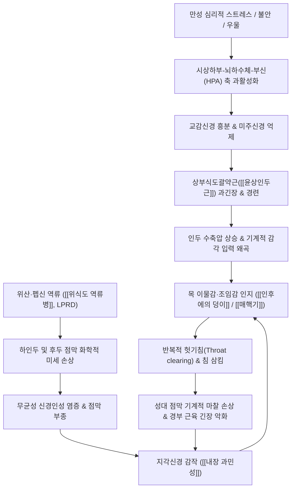

# 🩺 [[인후에의 덩이]] (Globus Pharyngeus / 梅核氣, R09.8 / F45.8)

> **핵심 3줄 요약 (Key Summary)**:
> - 📍 **병소 부위 & 병태생리**: 목구멍(하인두~식도 입구부)에 실제 기계적 폐쇄 병변 없이 무언가 걸려 있는 듯한 이물감을 지속적으로 느끼는 기능성 식도 질환으로, 상부식도괄약근([[윤상인두근]])의 과긴장, [[인후두 역류 질환]](LPRD)에 의한 점막 미세 염증, 그리고 뇌-장관 축(Brain-Gut Axis) 조절 장애에 따른 [[내장 과민성]](visceral hypersensitivity)이 복합 작용함.
> - 🚩 **전형적 임상 양상 & 3대 징후**: 침을 삼킬 때(공연하) 목에 매화 씨앗이나 가래 덩어리가 걸려 뱉어도 안 나오고 삼켜도 안 넘어가는 전형적 [[매핵기]](梅核氣) 양상이며, 식사 시(음식물 통과 시)에는 오히려 증상이 완화되거나 소실되고, 연하통(odynophagia)이나 기계적 삼킴장애([[연하장애]])가 동반되지 않음.
> - 🛠️ **핵심 감별 & 한·양방 치료 전략**: 하인두·식도암, 갑상선 종괴, Zenker 게실 등 기질적 종양성 병변을 후두경 및 식도 내시경으로 배제하고, 한의학적으로 이기화담(理氣化痰)의 대표 방제인 [[반하후박탕]]과 경항부·흉곽 이완 침구/약침 치료를 적용하며, 양방적으로 역류 제어(PPI/P-CAB) 및 신경조절제(소량 TCA/SSRI)를 선별 병용함.
> - ⚠️ **응급 의뢰 레드플래그**: 음식물이 실제로 걸려 넘어가지 않는 진행성 [[연하장애]], 연하통, 6개월 내 의도치 않은 10% 이상 체중 감소, 토혈·흑변, 경부 림프절 종창(단단하고 고정된 종괴), 쉰 목소리([[성대마비]]) 지속 시 즉시 상급병원 이비인후과·소화기내과 악성종양 정밀검사(조직검사, CT, EGD) 의뢰.

---

## 📌 목차
1. [질환 개요 & 병태생리 (Disease Overview)](#1-질환-개요--병태생리-disease-overview)
2. [병태생리 메커니즘 & 대사·장기부전 악순환 네트워크](#2-병태생리-메커니즘--대사장기부전-악순환-네트워크)
3. [임상 증상 & 환자 소견 (Clinical Presentation)](#3-임상-증상--환자-소견-clinical-presentation)
4. [감별 진단 매트릭스 (Differential Diagnosis)](#4-감별-진단-매트릭스-differential-diagnosis)
5. [한의 통합 치료 프로토콜 (침·약침·한약)](#5-한의-통합-치료-프로토콜-침약침한약)
6. [양방 치료 & 병용·의뢰 기준 (Conventional Treatment & Referral)](#6-양방-치료--병용의뢰-기준-conventional-treatment--referral)
7. [식이·생활습관 & 자가관리 티칭 가이드](#7-식이생활습관--자가관리-티칭-가이드)
8. [💡 진료실 핵심 필기 & 임상 노하우](#8--진료실-핵심-필기--임상-노하우)
9. [출처 및 학술 참고 문헌 (References)](#9-출처-및-학술-참고-문헌-references)

---

## 1. 질환 개요 & 병태생리 (Disease Overview)

![[인후에의_덩이_01_인후두해부도해.png|450]]
> [그림 1: ① 질병 개요 도해 — 비인강, 구인강, 하인두 및 후두·식도 입구부의 시상면 해부 구조도 — Gray's Anatomy Plate/Public Domain]

* **질환 정의 및 역학**:
  * [[인후에의 덩이]](Globus Pharyngeus / Globus Hystericus)는 목 부위에 실제 종괴나 물리적 협착 병변이 존재하지 않음에도 불구하고, 비통증성의 덩어리감, 이물감, 조임감, 또는 목이 메는 느낌을 지속적 혹은 간헐적으로 호소하는 질환이다.
  * 전체 일반 인구의 약 46%가 일생 중 최소 한 번 이상 경험하며, 이비인후과 외래 환자의 약 4%를 차지하는 매우 흔한 병증이다.
  * 남녀 발생 비율은 유사하나, 의료기관을 방문하여 치료를 적극 구하는 빈도는 여성에서 약 2~3배 높게 나타나며, 주로 30~50대에 호발한다.
  * 한의학에서는 한대(漢代) 장중경의 《금궤요략(金匱要略)》에 최초로 기재된 [[매핵기]](梅核氣)의 범주에 속하며, "목구멍 안에 마치 구운 고기 덩어리나 매화 씨앗이 걸려 있는 듯하여 뱉으려 해도 나오지 않고 삼키려 해도 넘어가지 않는(咽中如有炙臠, 喀之不出, 嚥之不下)" 병증으로 명문화되어 있다.

* **관련 장기 및 해부학적 조직**:
  * **주 이환 부위**:
    * 하인두(Hypopharynx) 및 [[윤상연골]](cricoid cartilage) 후방의 식도 입구부.
    * [[상부식도괄약근]](Upper Esophageal Sphincter, UES): 주동근인 [[윤상인두근]](cricopharyngeus muscle)과 하인두수축근(inferior pharyngeal constrictor)의 접경 부위.
  * **신경 조절계 및 지각 신경**:
    * 지각 신경: [[설인신경]](제9뇌신경, CN IX) 및 [[미주신경]](제10뇌신경, CN X)의 상후두신경(superior laryngeal nerve) 내지(internal branch)가 인두 및 후두 점막 감각을 담당함.
    * 운동 신경: 미주신경의 인두분지(pharyngeal branch)와 되돌이후두신경([[반회후두신경]], recurrent laryngeal nerve)이 인두수축근과 윤상인두근의 기저 수축 긴장도를 조절함.
  * **경부 근막 및 설골 골격계**:
    * 설골상근군([[악이복근]], [[악설골근]])과 설골하근군([[흉골설골근]], [[갑상설골근]]) 및 [[흉쇄유돌근]]의 만성 근막 긴장이 후두 연골의 수직 운동성을 제한하여 이물감을 증폭시킴.

---

## 2. 병태생리 메커니즘 & 대사·장기부전 악순환 네트워크

![[인후에의_덩이_02_인두근육및괄약근.png|450]]
> [그림 2: ② 인두 근육 및 상부식도괄약근 구조도 — 윤상인두근(Cricopharyngeus) 및 하인두수축근의 해부학적 배치 — Gray's Anatomy Plate/Public Domain]

![[인후에의_덩이_02_뇌장관축병태도해.png|450]]
> [그림 3: ③ 뇌-장관-미생물 축(Brain-Gut-Microbiome Axis) 및 자율신경계 과민성 병태 도해 — Commons/CC BY-SA 4.0]

![[인후에의_덩이_02_역류질환기전도해.png|450]]
> [그림 4: ③ 위식도 역류(GERD) 및 인후두 역류(LPRD)에 의한 산·펩신 점막 자극 기전 도해 — Commons/CC BY-SA 4.0]

### 1) 3대 핵심 병태생리 메커니즘
* **1. 상부식도괄약근(UES) 운동 이상 및 과긴장도 (Hypertonicity)**:
  * 고해상도 식도 내압검사(High-Resolution Manometry, HRM) 연구에 따르면, 글로부스 환자의 30~50%에서 UES의 안정 시 기저 압력이 비정상적으로 상승되어 있거나 수축 후 이완 불완전이 관찰됨.
  * [[윤상인두근]]의 지속적인 긴장과 불수의적 연축은 기저 수축압을 높여 물리적인 이물감으로 대뇌 피질에 투사됨.
* **2. 인후두 역류 질환 (Laryngopharyngeal Reflux, LPRD)**:
  * 위 내용물(위산, 펩신, 담즙산)이 상부식도괄약근을 통과하여 하인두와 후두 점막으로 역류하여 미세 점막 손상을 유발함 (환자의 약 23~68%에서 동반).
  * 후두 점막은 식도 점막에 비해 산 중화 방어벽(점막 점액층, 중탄산염 분비능)이 극히 취약하여 주 1~2회의 미세한 산 역류만으로도 피열간 점막 부종과 지각 신경 말단의 화학수용체(TRPV1 등) 활성화를 초래함.
* **3. 뇌-장관 상호작용 장애(DGBI) 및 내장 지각과민 (Visceral Hypersensitivity)**:
  * 로마 4(Rome IV) 기준상 기능성 식도 질환(Functional Esophageal Disorders)의 핵심 병전.
  * 정서적 스트레스, 불안, 공황 장애 등은 중추신경계의 하향성 통증 조절계(descending pain inhibitory pathway)를 약화시키고 미주신경 감각핵(NTS)을 감작시켜, 정상적인 생리적 타액 삼킴이나 인두 분비물조차도 극심한 이물감과 압박감으로 과도하게 증폭 인지하게 됨.

---

## 3. 임상 증상 & 환자 소견 (Clinical Presentation)

![[인후에의_덩이_03_후두경임상소견.png|420]]
> [그림 5: ④ 후두경(Laryngoscopy) 임상 소견 — 인후두 역류(LPRD)에 의한 피열연골간 점막 발적 및 성대 후방 부종 소견 — Commons/Public Domain]

### 1) 주소증 및 임상적 특징
* **전형적 주소증**:
  * "목에 알사탕, 가래, 솜뭉치, 매화 씨앗 같은 것이 걸려 있다."
  * "침을 삼킬 때는 이물감이 뚜렷하게 느껴지는데, 밥이나 물을 삼킬 때는 전혀 걸리지 않고 오히려 시원하게 내려간다."
  * 목 안이 건조하고 간질거리며, 이물질을 뱉어내기 위해 지속적으로 헛기침(Throat clearing, "큼큼"거림)을 반복함.
* **증상 변동 양상**:
  * 스트레스, 과로, 정서적 흥분, 분노 시 악화되며, 긴장이 풀리거나 집중하여 대화할 때, 식사 중에는 완화됨.
  * 아침 기상 시 경미하다가 오후나 저녁, 피로 누적 시 증상이 가중되는 경향.
* **동반 증상**:
  * 흉골 뒤 쓰림(속쓰림), 트림, 후비루(Post-nasal drip), 만성 마른기침, 경부 림프절 부위의 무거움.

### 2) 객관적 검사 소견 및 진단 기준 (Rome IV)
* **Rome IV 기능성 글로부스(Globus) 진단 기준 (아래 항목을 모두 충족)**:
  * 1) 인후부에 지속적 또는 간헐적인 비통증성 덩어리감이나 이물감이 존재함.
  * 2) 식사와 식사 사이(음식물을 삼키지 않는 동안)에 주로 발생함.
  * 3) [[연하장애]](Dysphagia)이나 연하통(Odynophagia)이 없어야 함.
  * 4) 위식도 역류 질환(GERD)이나 호산구성 식도염에 의한 기질적 병변이 배제되어야 함.
  * 5) 식도 점막이나 운동성의 이상에 기인한 병변이 없어야 함.
  * *기준: 최근 3개월간 주 1회 이상 증상이 지속되고, 최소 6개월 전에 발증.*
* **이비인후과 후두내시경(Laryngoscopy) 소견**:
  * 진성 종괴(악성종양, 유두종, 낭종)가 없음을 확인.
  * LPRD 동반 환자에서는 후두 후방 점막 홍반(erythema), 피열간 비후(interarytenoid pachydermia), 성대하 부종(pseudosulcus vocalis) 등 역류 소견 점수(RFS: Reflux Finding Score) 상승 관찰.

---

## 4. 감별 진단 매트릭스 (Differential Diagnosis)

| 감별 질환 | 호발 병소 및 원인 | 주소증 및 임상 양상 차이점 | 특이적 검사 소견 (감별 포인트) |
| :--- | :--- | :--- | :--- |
| [[인후에의 덩이]] (본 질환) | 하인두, 윤상인두근 과긴장, 기능성 | **공연하 시 악화, 식사 시 호전**, 체중 감소 없음, 통증 없음 | 후두경·식도경 정상, Rome IV 기준 충족 |
| [[하인두암]] / [[식도암]] (🚨 레드플래그) | 하인두 점막, 식도 상중부 악성 신생물 | **진행성 연하곤란**(고형식→유동식 불능), 연하통, 10% 이상 체중 감소 | 내시경하 궤양성·외장성 종괴, CT 조직생검 확진 |
| [[Zenker 게실]] | 인두후벽 Killian 삼각부 점막 탈출 | 식후 수 시간 뒤 미소화 음식물 역류, 구취, 연하 시 꾸르륵 소리(gurgling) | 식도 바륨 조영술상 하인두 후벽 낭성 돌출 |
| [[위식도 역류병]](GERD/LPRD) | 하부식도괄약근 이완, 산 역류 | 전형적 흉골하 작열감(Heartburn), 위산 역류, 쉰 목소리 | 24시간 식도 다채널 pH-임피던스 검사 양성, PPI 반응 |
| [[갑상선 질환]](종대/결절) | 갑상선 협부 및 양엽 종창 | 경부 전면부의 객관적 종괴 촉진, 연하 시 상하 이동하는 결절 | 갑상선 초음파상 결절 크기 및 기관 압박 여부 확인 |
| [[식도이완불능증]](Achalasia) | 하부식도 신경총 소실, 연동 운동 부전 | 초기부터 고형식과 유동식 삼킴장애 동반, 흉통, 야간 역류 | 식도조영술상 '새 부리(Bird's beak)' 징후, HRM 소견 |

---

## 5. 한의 통합 치료 프로토콜 (침·약침·한약)

### 1) 변증 분류 및 한약 치료 프로토콜 (Herbal Medicine)

* **1. 간기울결(肝氣鬱結) / 기체담응(氣滯痰凝)형 (가장 다빈도 - 60% 이상)**:
  * 임상 양상: 정서적 억울, 스트레스, 분노 후 목 이물감 악화, 흉협고만(胸脇苦滿), 잦은 한숨, 복부 팽만, 설담홍 태백유, 맥현(脈弦).
  * 치료 방침: 소간해울(疏肝解鬱), 행기화담(行氣化痰), 강역이기(降逆理氣).
  * 대표 처방: **[[반하후박탕]](半夏厚朴湯)** 또는 **가미사칠탕(加味四七湯)**.
    * 처방 구성: [[반하]](12g), [[후박]](9g), [[복령]](12g), [[생강]](6g), [[소엽]](6g).
    * 작용 기전: 반하와 후박은 상부식도괄약근 경련을 완화하고 소화관 평활근의 연동운동을 촉진하며, 중추신경계의 P물질(Substance P) 및 신경전달물질 분비를 조절하여 연하반사를 정상화하고 불안-신체화 회로를 안정화함(Iwasaki et al., 1999; Mantani et al., 2003).
* **2. 담열조폐(痰熱阻肺) / 위열역상(胃熱逆上)형 (LPRD 동반형)**:
  * 임상 양상: 목 이물감과 함께 목구멍 화끈거림, 구갈, 구취, 황달성 가래, 속쓰림, 산역류, 설홍 태황후, 맥활삭(脈滑數).
  * 치료 방침: 청열화담(淸熱化痰), 화위강역(和胃降逆).
  * 대표 처방: **황련온담탕(黃連溫膽湯)** 합 **반하사심탕(半夏瀉心湯)** 가미방.
* **3. 기허담울(氣虛痰鬱) / 비허불운(脾虛不運)형 (만성 쇠약형)**:
  * 임상 양상: 수개월 이상 지속된 만성 글로부스, 전신 무력, 소화불량, 식욕 부진, 대변 묽음, 안색 위황, 설담 태백창, 맥세약(脈細弱).
  * 치료 방침: 익기건비(益氣健脾), 화담이기(化痰理氣).
  * 대표 처방: **육군자탕(六君子湯)** 합 반하후박탕 가미방.

### 2) 침구 치료 (Acupuncture & Electroacupuncture)

![[인후에의_덩이_05_침구치료술기.png|400]]
> [그림 6: ⑤ 한의 술기 실사 — 경항부 및 배수혈 자침과 온열 요법을 통한 자율신경 안정 및 근막 이완 실사 — Commons/CC BY-SA 4.0]

* **주혈(근위 및 원위 배혈 원칙)**:
  * 국소 경항부 취혈: [[염천(CV23)]], [[천돌(CV22)]], [[인영(ST9)]], [[풍지(GB20)]], [[대추(GV14)]].
  * 체간 및 흉곽 취혈: [[전중(CV17)]] (흉중기체 해소의 요혈), [[중완(CV12)]].
  * 원위 조신(調神) 및 이기 취혈: [[내관(PC6)]] (심포경 락혈, 오심·역류·불안 제어), [[합곡(LI4)]], [[태충(LR3)]] (사관혈: 전신 기혈 순환 및 자율신경 조율), [[족삼리(ST36)]], [[풍륭(ST40)]] (화담 거담 요혈).
* **자침 기법 및 전침 세팅**:
  * 천돌혈: 흉골병 후면을 향해 하방으로 0.5~1촌 완만하게 사자하여 기관을 피하고 기도를 안정시킴.
  * 염천혈: 설골 상연에서 설근부를 향해 상후방으로 0.8~1.2촌 자입하여 설골근막 긴장 완화.
  * 전침 자극: 양측 내관-족삼리 또는 풍지-견정에 저주파(2Hz) 연속파 20분 적용하여 미주신경 활성도(HF HRV)를 높이고 내장 지각과민을 둔화시킴.

### 3) 약침 치료 (Pharmacopuncture)
* **제제 선택**:
  * 소염약침(황련해독탕 추출물) 또는 중성어혈약침: 인후두 점막 발적 및 열감 동반 시.
  * 신바로약침 또는 자하거약침: 만성 경부 근막 긴장 및 기허 증상 동반 시.
* **시술 부위 및 용량**:
  * 설골 주위 근막 부착부, 양측 [[인영(ST9)]] 외측, [[천돌(CV22)]] 천층 피하에 각 0.1cc씩 총 0.5~1.0cc 분주.

---

## 6. 양방 치료 & 병용·의뢰 기준 (Conventional Treatment & Referral)

### 1) 양방 약물 치료 체계
* **위산 억제 요법 (PPI / P-CAB)**:
  * 적응증: LPRD 의심 소견(후두 발적, 속쓰림, 목소리 변화)이 동반된 경우.
  * 약제: Esomeprazole 20~40mg qd, Rabeprazole 20mg qd, 또는 Tegoprazan(케이캡) 50mg qd.
  * 임상 원칙: 일반 GERD보다 고용량으로 최소 8~12주간 투여함. 단, 명확한 역류 증거가 없는 순수 기능성 글로부스 환자에서는 위약(placebo) 대비 치료 효과가 유의하지 않다는 메타분석이 보고됨.
* **신경조절제 및 항불안제 (Neuromodulators)**:
  * 적응증: 스트레스 유발성, 만성 내장 과민성이 우세한 불응성 환자.
  * 저용량 삼환계 항우울제(TCA: Amitriptyline 10~25mg qhs) 또는 가바펜티노이드(Gabapentin 100~300mg qhs): 통증 하향 경로를 강화하고 인두 감각 과민성을 억제함.
  * 단기 벤조디아제핀계(Lorazepam 0.5mg): 급성 불안 발작 및 인두 경련 시 수일간 제한 사용.

### 2) 한·양방 병용 판단 및 상호작용
* **병용 가능 (상승 효과)**:
  * PPI 복용 중에도 목 이물감이 소실되지 않는 환자에게 [[반하후박탕]]과 경항부 침치료를 병용하면, 위산 차단 효과와 인두 운동성 정상화 및 불안 조절이 결합되어 증상 관해율이 약 40% 이상 유의하게 상승함.
* **병용 주의**:
  * 신경조절제(항우울제/항불안제)와 항우울 작용을 지닌 한약재 복합 복용 시 과도한 진정, 구갈, 졸림 발생 가능성을 관찰하여 용량을 완만하게 적정함.

### 3) 양방 전문과 의뢰 기준 (Referral & Red Flags)
* **즉각 정밀검사 의뢰 (Red Flags)**:
  * 1) **연하곤란(Dysphagia)**: 특히 물보다 고형식을 삼킬 때 턱턱 걸리는 증상이 점점 심해지는 경우.
  * 2) **연하통(Odynophagia)**: 삼킬 때 찌르는 듯한 국소 통증이 지속되는 경우.
  * 3) **체중 감소**: 식이 조절 없이 최근 수개월간 체중의 10% 이상이 감소한 경우.
  * 4) **지속적 애성(Hoarseness)**: 3주 이상 쉰 목소리가 호전되지 않고 악화되는 경우 ([[반회후두신경]] 침범 암 의심).
  * 5) **경부 종괴 촉진**: 경부 림프절이 단단하고 무통성이며 고정된 상태로 만져지는 경우.

---

## 7. 식이·생활습관 & 자가관리 티칭 가이드

![[인후에의_덩이_07_복식호흡이완.png|400]]
> [그림 7: ⑦ 재활 운동 실사 — 횡격막 복식호흡 및 미주신경 자극을 통한 인후두 과긴장 이완 훈련 — Commons/Public Domain]

* **1. 헛기침(Throat Clearing) 금지 티칭 (가장 중요)**:
  * 목에 뭔가 걸린 느낌이 들 때마다 "큼큼" 하고 세게 헛기침을 하거나 억지로 침을 꿀꺽 삼키는 행위는 성대와 인두 점막에 강한 물리적 마찰을 주어 점막 부종을 악화시키는 악순환을 유발함.
  * **대체 행동 요법**: 이물감이 심할 때는 헛기침을 하지 말고, **따뜻한 물을 한 모금 천천히 머금었다가 부드럽게 삼키기(Hard swallow with warm water)** 또는 가볍게 숨을 들이마신 후 "하-" 하고 소리 없이 내쉬는 '무음 호기법'을 지도함.

* **2. 횡격막 복식호흡 및 경부 스트레칭 (그림 7)**:
  * 방법: 편안히 앉아 한 손은 복부에 대고 코로 4초간 깊게 숨을 들이마시며 복부를 부풀리고, 입으로 6~8초간 천천히 내쉬는 횡격막 호흡을 매일 아침저녁 10분씩 시행.
  * 효과: 미주신경 톤을 증가시켜 교감신경 흥분을 진정시키고, 후두거상근과 [[흉쇄유돌근]]의 불수의적 긴장을 이완시킴.

* **3. 역류 방지 식이요법 (Antireflux Lifestyle)**:
  * 식사 후 최소 3시간 이내에는 눕지 않기.
  * 위식도 괄약근을 이완시키는 카페인(커피, 홍차), 알코올, 초콜릿, 탄산음료, 기름진 튀김류, 매운 음식의 엄격한 제한.
  * 수면 시 베개 높이를 높이거나 침대 상체 쪽 머리를 15도 정도 거상하여 수면 중 위산 역류 차단.

---

## 8. 💡 진료실 핵심 필기 & 임상 노하우

* **환자 안심시키기(Reassurance)가 치료의 50%를 차지한다**:
  * 글로부스 환자들은 대부분 "혹시 목이나 식도에 암이 생겨서 걸리는 게 아닐까" 하는 극심한 암 공포증(Carcinophobia)에 사로잡혀 있다. 불안이 심해질수록 미주신경 감각핵이 감작되어 이물감이 2배로 강해진다.
  * 내시경상 실제 기계적 종양이 없음을 명확히 확인해 준 뒤, "이 병은 종양이 아니라 스트레스와 위산 자극으로 목구멍 근육이 일시적으로 긴장하여 생기는 '기능적 경련'이며, 암으로 발전하지 않는다"는 것을 차분히 설명하고 안심시키는 것만으로도 증상의 절반이 호전된다.
* **'음식물 삼킬 때의 느낌'을 반드시 물어보라 (핵심 감별 질문)**:
  * 문진 시 단 한 가지 질문: "식사할 때 밥이나 고기는 잘 넘어가나요?"
  * 환자가 "밥 먹을 때는 오히려 아무렇지도 않고 걸리지 않는데, 다 먹고 가만히 있거나 침 삼킬 때만 걸린다"고 답하면 99% 기능성 글로부스([[매핵기]])이다. 만약 "밥이나 단단한 음식이 중간에 걸려서 물로 넘겨야 한다"고 하면 기능성이 아닌 기질적 식도 협착/암이므로 지체 없이 내시경 검사를 보내야 한다.
* **반하후박탕 투여 시 생강·소엽 활용 노하우**:
  * 엑스제(보험한약) 반하후박탕을 처방할 때, 약국이나 탕전실에서 생강 2~3편을 끓인 따뜻한 생강차에 타서 복용하도록 지도하면 후박과 반하의 온화한 이기강역 작용이 극대화되어 목 안이 시원해지는 체감 효과가 훨씬 빨라진다.
  * 만약 환자가 스트레스로 인해 가슴 답답함과 상열감을 강하게 호소한다면 치자(梔子)나 향부자(香附子)를 가미한 가미사칠탕을 사용하는 것이 우수하다.

---

## 9. 출처 및 학술 참고 문헌 (References)

- Lee BE, et al. (2012). Globus pharyngeus: a review of its etiology, diagnosis and treatment. *World J Gastroenterol*. 18(20):2462-71. PMID: 22654443.

- Aziz Q, et al. (2016). Functional Esophageal Disorders. *Gastroenterology*. 150(6):1368-79. PMID: 27144625.

- Mantani N, et al. (2003). Effects of Hange-koboku-to (Banxia-houpo-tang) on neuropeptide levels in human plasma and saliva. *Biol Pharm Bull*. 26(11):1609-13. PMID: 14600411.

- Iwasaki K, et al. (1999). The traditional Chinese medicine banxia houpo tang improves swallowing reflex. *Phytomedicine*. 6(2):103-6. PMID: 10374248.

- Zhang Y, et al. (2010). Clinical observations on 46 cases of globus hystericus treated with modified Banxia Houpu decoction. *J Tradit Chin Med*. 30(2):97-9. PMID: 20653165.

- Shen H, et al. (2022). Trial of transcutaneous electrical acupoint stimulation in laryngopharyngeal reflux disease: study protocol for a randomized controlled trial. *Trials*. 23(1):272. PMID: 35395946.

---

## 관련 노트

- [[매핵기]]
- [[반하후박탕]]
- [[위식도 역류병]]
- [[윤상인두근]]
- [[상부식도괄약근]]
- [[미주신경]]
- [[설인신경]]
- [[반회후두신경]]
- [[내장 과민성]]
- [[연하장애]]
- [[천돌(CV22)]]
- [[염천(CV23)]]
- [[전중(CV17)]]
- [[내관(PC6)]]
