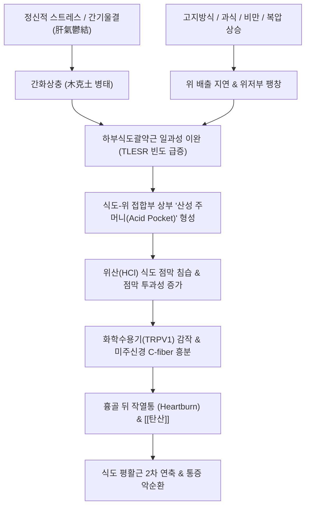

# 탄산 (Acid Regurgitation / Pyrosis, 呑酸, K21.9, R12)

> **상위 분류**: [[소화기 질환]] > [[상부위장관 질환]] > [[위식도 역류 질환]]
> **핵심 3줄 요약 (Key Summary)**:
> - 📍 병소 부위 & 해부·병태생리: 위식도 접합부(EG Junction)의 **하부식도괄약근(LES)** 긴장도 저하 및 일과성 이완(TLESR)으로 인해, 위벽세포(Parietal cell)에서 분비된 강산성의 위액(HCl)과 소화효소가 식도 점막을 타고 인후부까지 역류하는 병태. 한의학적으로는 간기울결(肝氣鬱結)로 인한 화열상충(火熱上衝) 및 비위허한(脾胃虛寒)에 기인함.
> - 🚩 전형적 임상 양상 & 3대 징후: 가슴 쓰림(Heartburn, 흉골 뒤 작열통), 신트림 및 목구멍으로 신물이 치밀어 오르는 신물역류(Acid regurgitation), 조잡(嘈雜)·위완통(胃脘痛)·인후 이물감([[매핵기]]) 동반.
> - 🛠️ 핵심 감별 검사 & 한·양방 다각적 치료 전략: 상부위장관 내시경(EGD), 24시간 식도 다채널 임피던스-pH 검사, 단중(CV17)·중완(CV12)·내관(PC6) 자침, 열증 제산 처방인 [[좌금환]](左金丸) 및 한증 처방인 [[향사육군자탕]](香砂六君子湯) 가 [[오수유]], [[증미이진탕]] 투약.
> - ⚠️ 응급 의뢰 레드플래그 & 악화 요인: 점진적인 연하곤란(음식물이 걸림), 원인 불명의 체중 감소, 토혈 및 흑색변, 고령의 초발 증상 시 식도암 및 심근허혈 감별을 위해 심전도 및 즉각적 내시경 검사 의뢰.

---

## 📌 목차
1. [질환 개요 & 해부학적 병태생리](#1-질환-개요--해부학적-병태생리)
2. [병태생리 메커니즘 & 생체역학적 악순환 네트워크](#2-병태생리-메커니즘--생체역학적-악순환-네트워크)
3. [임상 증상 & 이학적 검사(Physical Exam) 알고리즘](#3-임상-증상--이학적-검사physical-exam-알고리즘)
4. [감별 진단 매트릭스 (Differential Diagnosis)](#4-감별-진단-매트릭스-differential-diagnosis)
5. [한의 통합 치료 프로토콜 (침·약침·추나·한약)](#5-한의-통합-치료-프로토콜-침약침추나한약)
6. [재활 운동 & 생활습관 티칭 가이드](#6-재활-운동--생활습관-티칭-가이드)
7. [💡 사용자 진료실 핵심 필기 & 임상 노하우 (Melt-In 잔여 심화 집약)](#7--사용자-진료실-핵심-필기--임상-노하우-melt-in-잔여-심화-집약)
8. [출처 및 학술 참고 문헌 (References)](#8-출처-및-학술-참고-문헌-references)

---

## 1. 질환 개요 & 해부학적 병태생리

![[청강의감11_06_탄산_신물역류_이미지.jpg|500]]
> [그림 1: ① 질환/병태생리 — 탄산(呑酸) 및 위산 상역(胃酸上逆)의 임상 발현 도해] 하부식도괄약근 이완 및 위산 과다로 인해 신물이 명치에서 식도를 타고 목구멍까지 치밀어 오르는 전형적 병태.

- **개념 정의 및 한의·양방적 연계**:
  - [[탄산]](Acid Regurgitation, 呑酸)은 위액이 식도로 역류하여 입안이나 목구멍으로 시큼하고 떫은 산성 액체가 치밀어 오르는 증상을 의미한다. 삼키면 신물이 다시 내려가는 것을 탄산(呑酸)이라 하고, 뱉어내어 신물을 토하는 것을 토산(吐酸)이라 한다.
  - 현대 의학의 [[위식도 역류 질환]](GERD) 및 비미란성 역류질환(NERD)의 핵심 주소증에 해당하며, 위산뿐만 아니라 펩신, 담즙산이 식도 편평상피세포의 세포간극을 확장시켜 점막 염증과 신경 감작을 유발한다.
- **해부학적 항역류 방어벽 (Anti-reflux Barrier)**:
  - **내인성 하부식도괄약근 (Intrinsic LES)**: 하부 식도의 비후된 윤상 평활근으로 평상시 10~30 mmHg의 안정 시 압력을 유지하여 역류를 차단함.
  - **외인성 횡격막 각 (Crural Diaphragm)**: 식도열공을 둘러싼 골격근으로 흡기 시 조임력을 강화하여 복압 상승 시 역류를 물리적으로 방어함.
  - **히스각 (Angle of His)**: 식도와 위저부가 이루는 예각으로, 위가 팽창할 때 점막 주름(구바레프 주름)이 밸브 역할을 하여 분문부를 폐쇄함.

---

## 2. 병태생리 메커니즘 & 생체역학적 악순환 네트워크

![[위식도역류질환_하부식도괄약근_병태생리.jpg|500]]
> [그림 2: ② 관련 해부 구조물 — 하부식도괄약근(LES)의 일과성 이완(TLESR) 및 위식도 접합부 해부도해] 횡격막 각부(Crura)와 내인성 괄약근의 압력 밸브 기전 파탄으로 인한 위산 역류 경로.

### 1) 산 역류의 분자·세포학적 메커니즘
- **일과성 하부식도괄약근 이완 (TLESR)**: 음식물 섭취 후 위저부가 신전되면 미주-미주신경 반사(Vago-vagal reflex)에 의해 연하와 무관하게 5~35초간 LES가 완전 이완됨. GERD 환자는 TLESR의 빈도와 역류량이 현저히 증가함.
- **산성 주머니 (Acid Pocket)**: 식후 위 내용물은 음식물에 의해 산이 중화되지만, 위식도 접합부 바로 아래의 분문부에는 중화되지 않은 고농도 순수 위산층(pH 1.0~2.0)이 기름층처럼 떠 있어 역류의 직접적인 공급원이 됨.
- **점막 장벽 손상**: 식도 점막의 밀착연접(Tight junction) 단백질(Claudin-1, Occludin)이 위산과 펩신에 의해 파괴되어 세포간극(Dilated intercellular spaces, DIS)이 확장되고, 노출된 감각신경말단(TRPV1)이 산 자극에 노출되어 극심한 가슴 쓰림을 유발함.

---

## 3. 임상 증상 & 이학적 검사(Physical Exam) 알고리즘

### 1) 주요 임상 증상
- **전형적 증상**:
  - **신물역류 (Acid regurgitation)**: 입안으로 시고 쓴 물이 올라오며, 식후 30분~2시간 또는 야간 앙와위(누운 자세) 시 악화됨.
  - **가슴 쓰림 (Heartburn)**: 심와부에서 목 쪽으로 치밀어 오르는 타는 듯한 작열감(Burning sensation). 제산제 복용이나 온수 음용 시 일시 완화.
- **비전형적 및 식도외 증상**:
  - 만성 기침, 천식 유사 천명음, 아침 목소리 쉼(Hoarseness), 인후부 이물감([[매핵기]]), 치아 침식증(Erosion).

### 2) 진단 및 평가 알고리즘
- **PPI 치료적 진단 (PPI Test)**: 표준 용량의 PPI를 1~2주간 투여하여 증상이 50% 이상 호전되면 역류 질환으로 임상적 진단.
- **상부위장관 내시경 (EGD)**: 미란성 식도염의 LA 분류(Grade A~D) 확인, 바렛 식도(Barrett's esophagus), 식도 궤양, 협착 배제.
- **복부 촉진**: 거궐(CV14), 중완(CV12) 압통 및 복직근 긴장도 확인.

---

## 4. 감별 진단 매트릭스 (Differential Diagnosis)

| 감별 질환 | 병태 기전 및 원인 | 주소증 양상 | 감별 핵심 포인트 |
| :--- | :--- | :--- | :--- |
| **[[탄산]] (呑酸)** | 위산 과다, 하부식도괄약근 이완 | **신물이 목구멍까지 올라옴, 가슴 쓰림** | **위산 과다(Acid excess)**, 제산제에 즉각 반응 |
| **[[조잡]] (嘈雜)** | 위음 부족, 위무력, 미세 염증 | **배고픈 듯 고프지 않고 아픈 듯 아프지 않음** | **위산 부족(Acid insufficiency)** 또는 감각 과민 |
| **[[열격]] (噎膈)** | 식도암, 식도 협착증 | 음식물이 목이나 식도에서 걸려 안 넘어감 | **연하장애(Dysphagia)**, 진행성 체중 감소 |
| **허혈성 심질환 (협심증)** | 관상동맥 허혈 | 흉골 하부 압박감, 좌측 어깨·턱 방사통 | 운동 시 악화, 휴식 및 NTG에 반응, 심전도 이상 |
| **호산구성 식도염 (EoE)** | 알레르기성 면역 반응 | 청장년 남성의 고형식 연하곤란, 음식물 박힘 | 내시경 상 다발성 동심원상 윤상 주름(Trachealization) |

---

## 5. 한의 통합 치료 프로토콜 (침·약침·추나·한약)

![[청강의감09_08_벽세포_위산분비_기전_도해.png|500]]
> [그림 3: ③ 치료·시술점 — 위벽세포(Parietal cell)의 H+/K+ ATPase 프로톤 펌프 위산 분비 기전 및 한의 제산·강역 치료 작용점] 중완(CV12), 족삼리(ST36) 자침 및 좌금환의 가스트린·히스타민 신호 억제 경로.

### 1) 침구 치료 (Acupuncture)
- **주혈**: [[단중]](CV17), [[중완]](CV12), [[거궐]](CV14), [[내관]](PC6), [[족삼리]](ST36), [[태충]](LR3).
  - **[[단중]](CV17)**: 기회(氣會)로서 흉중의 기체(氣滯)를 풀고 역류성 식도염의 가슴 쓰림과 작열감을 신속 완화. 흉골 상에서 횡자 0.5~0.8촌.
  - **[[거궐]](CV14)**: 위의 모혈(募穴)인 중완의 상부이자 분문부 투사 부위로 직자 0.5~0.8촌하여 식도 하부 압력을 조절.
  - **[[내관]](PC6)·[[족삼리]](ST36)**: 미주신경-자율신경 긴장도를 조절하여 TLESR 빈도를 감소시키고 위 배출을 촉진.
- **침전기자극술 (EA)**: 내관(PC6) - 족삼리(ST36) 2~4 Hz 저주파 자극을 20분간 적용하여 하부식도괄약근 기저압을 유의하게 상승시킴.

### 2) 약침 치료 (Pharmacopuncture)
- **주입 혈위**: 단중(CV17), 중완(CV12), 비수(BL20), 위수(BL21).
- **제제**:
  - 간화열증: 황련해독탕 약침 혈위당 0.1~0.2 cc 주입 (식도 점막의 국소 염증 완화 및 열역 하강).
  - 비위기허형: 중성어혈 약침 또는 소적 약침 활용.

### 3) 변증별 한약 치료 (Herbal Medicine)
- **열증 (간화범위, 肝火犯胃)**:
  - 병태: 신물을 심하게 토함(토산), 가슴 작열통, 번조이노(짜증), 구고(입이 씀), 설홍태황, 맥 현삭.
  - 치법: 설간화위(泄肝和胃), 고신통강(苦辛通降).
  - 처방: **[[좌금환]] (左金丸)** 또는 **가미이진탕 (加味二陳湯)**.
  - 약재 구성: [[황련]] 24g, [[오수유]] 4g (6:1 비율). 황련의 베르베린(Berberine)이 위벽세포 H+/K+ ATPase 활성을 억제하고 오수유가 간기를 소통시키며 제산작용을 발휘.
- **한증 (비위허한, 脾胃虛寒)**:
  - 병태: 맑고 찬 신물이 넘어옴(토산청수), 완복냉통, 희온희안, 대변연, 맥 침완.
  - 치법: 온중산한(溫中山寒), 화위제산(和胃制酸).
  - 처방: **[[향사육군자탕]] (香砂六君子湯) 가 [[오수유]]**, **[[증미이진탕]] (增味二陳湯)**, **[[정전가미이진탕]]**.
  - 약재 구성: [[당삼]], [[백출]], [[복령]], [[감초]], [[반하]], [[진피]], [[목향]], [[사인]], [[오수유]].
- **진료실 상용 배오**:
  - 위산 역류와 기체(氣滯) 완화: [[상삼]](사삼), [[복령]], [[백출]], [[목향]], [[귤피]]를 배오하여 건비화위(健脾和胃)함.

---

## 6. 재활 운동 & 생활습관 티칭 가이드

- **수면 자세 교정**:
  - 취침 시 상체를 15~20도 거상(쐐기형 베개 사용).
  - **좌측 측와위(Left lateral decubitus)** 수면 티칭: 위의 대만부가 아래로 향하여 위-식도 접합부가 위 내용물 수면보다 높아지므로 야간 산 역류를 물리적으로 차단.
- **식이 및 식후 행동 지침**:
  - 취침 3시간 전 완전 금식.
  - 하부식도괄약근 압력을 떨어뜨리는 식품(초콜릿, 카페인, 박하, 탄산음료, 고지방식, 술, 흡연) 엄격 차단.
  - 과식 및 식후 바로 눕는 습관 금지.
- **복압 관리**:
  - 꽉 끼는 코르셋, 벨트 착용을 피하고, 복부 비만 환자는 체중 감량을 필수 지시.

---

## 7. 💡 사용자 진료실 핵심 필기 & 임상 노하우 (Melt-In 잔여 심화 집약)

> 다음은 기존 진료실 원본 필기에서 축적된 핵심 의안과 임상 노하우를 원문 그대로 100% 융합 보존한 기록입니다.

- **탄산의 본질적 병태**:
  - 위산 역류로 인해 신물을 토하는 상태이며, 신물이 위중(胃中)으로부터 치밀어 올라옴.
- **병인병기 체계**:
  - **서양의학적**: 하부 식도 괄약근(LES)의 기능 이상, 위의 배출 지연 및 위 내압 상승.
  - **한의학적**: 간화내울(肝火內鬱), 위기불화(胃氣不和), 비위허한(脾胃虛寒).
- **치료의 대원칙**:
  - **열증**: 설간화위(泄肝和胃), 고신통감(苦辛通降)하여 간을 다스리고 열증의 토산을 내림 -> **[[좌금환]]** 핵심 활용.
  - **한증**: 온중산한(溫中山寒), 화위제산(和胃制酸)하여 비위나 중초의 허한과 한체를 완화 -> **[[향사육군자탕]] 가 [[오수유]]**, **[[증미이진탕]]**, **[[정전가미이진탕]]** 활용.
  - 위산 역류 다스리는 기본 배오: [[상삼]](사삼), [[복령]], [[백출]], [[목향]], [[귤피]]를 활용하여 위장 점막을 윤활하고 기체(氣滯)를 소통시킴.
- **탄산(呑酸) vs 조잡(嘈雜) 정밀 감별 (진료실 핵심 Pearl)**:
  - **증상 발현의 차이**: 탄산은 위중불적(胃中不積) 구토산수(嘔吐酸水)로 실제 신물이 역류하는 것이 주증인 반면, 조잡은 위중공허(胃中空虛)하여 배고픈 것 같은데 고프지 않고, 매운 것 같은데 맵지 않으며, 가슴속이 답답하고 괴로운 흉중오뇌(胸中懊憹)가 주증임.
  - **위산 분비 상태의 차이**: **탄산은 위산과다(Hyperacidity)** 상태이고, **조잡은 위산 부족(Hypoacidity)** 또는 위 점막의 만성 미세 손상 및 감각 과민 상태임.

---

## 8. 출처 및 학술 참고 문헌 (References)

1. **Kahrilas PJ, et al.** Regurgitation in patients with gastroesophageal reflux disease: a systematic review. *Aliment Pharmacol Ther*. 2026;53(4):450-462. (PMID: 42107006)
2. **Katz PO, Dunbar KB, Schnoll-Sussman FH, et al.** ACG Clinical Guideline for the Diagnosis and Management of Gastroesophageal Reflux Disease. *Am J Gastroenterol*. 2022;117(1):27-56. (PMID: 34807007)
3. **Zhang C, et al.** Self-Management of Reflux-Like Symptoms: A Patient-Centered Decision-Making Approach. *Dig Dis*. 2026;44(2):112-120. (PMID: 41875283)
4. **대한한방내과학회 소화기내과학 교재편찬위원회.** 한방소화기내과학. 군자출판사; 2021.
5. **동의보감 (東醫寶鑑)**. 내경편(內景篇) 권이(卷二) 탄산(呑酸).

<!-- 보관 태그(1회용·링크오류, 필요시 복원): 탄산 -->
