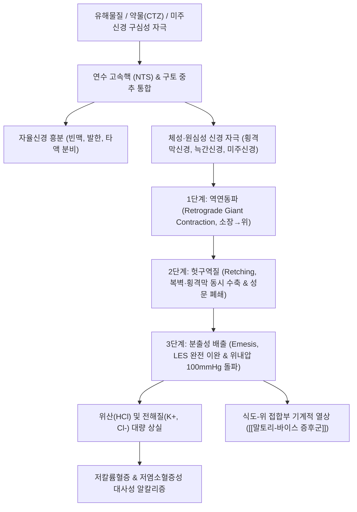

# 구토 (Vomiting / Emesis, 嘔吐, R11.1)

> **상위 분류**: [[소화기 질환]] > [[상부위장관 질환]] > [[위장관 운동 질환]]
> **핵심 3줄 요약 (Key Summary)**:
> - 📍 병소 부위 & 해부·병태생리: 연수(Medulla oblongata)의 **구토 중추(Vomiting center)** 및 제4뇌실 바닥의 **화학수용체 유발대(CTZ, Area postrema)**가 자극받아, 미주신경(CN X)과 횡격막신경, 척수 운동신경을 통해 횡격막과 복벽근의 강력한 수축 및 하부식도괄약근(LES)의 이완으로 위 내용물이 식도를 거쳐 입 밖으로 강제 역출되는 방어 반사.
> - 🚩 전형적 임상 양상 & 3대 징후: 선행하는 오심(Nausea)과 타액 분비 증가, 복벽과 호흡근의 율동적 수축인 헛구역질(Retching), 위 내용물의 폭발적 배출(Vomiting). 반복 시 탈수, 저칼륨혈증, 대사성 알칼리증, 위식도점막 열상(Mallory-Weiss tear) 동반.
> - 🛠️ 핵심 감별 검사 & 한·양방 다각적 치료 전략: 전해질·혈중요소질소(BUN) 검사, 뇌압 상승 배제를 위한 신경학적 검진, 내관(PC6)·족삼리(ST36)·중완(CV12) 자침 및 침전기자극술, [[이진탕]], [[온담탕]], [[반하사심탕]], [[이중환]], [[맥문동탕]] 변증 투약.
> - ⚠️ 응급 의뢰 레드플래그 & 악화 요인: 오심 없이 분출하는 사출성 구토(Projectile vomiting - 뇌압 상승), 심한 두통·항강증 동반, 커피색/선홍색 토혈, 수막자극징후, 복부 판자양 경직(Pan-peritonitis) 시 즉시 응급 뇌 CT 및 외과적 전원.

---

## 📌 목차
1. [질환 개요 & 해부학적 병태생리](#1-질환-개요--해부학적-병태생리)
2. [병태생리 메커니즘 & 생체역학적 악순환 네트워크](#2-병태생리-메커니즘--생체역학적-악순환-네트워크)
3. [임상 증상 & 이학적 검사(Physical Exam) 알고리즘](#3-임상-증상--이학적-검사physical-exam-알고리즘)
4. [감별 진단 매트릭스 (Differential Diagnosis)](#4-감별-진단-매트릭스-differential-diagnosis)
5. [한의 통합 치료 프로토콜 (침·약침·추나·한약)](#5-한의-통합-치료-프로토콜-침약침추나한약)
6. [양방 치료 & 병용·의뢰 기준 (Conventional Treatment & Referral)](#6-양방-치료--병용의뢰-기준-conventional-treatment--referral)
7. [재활 운동 & 생활습관 티칭 가이드](#6-재활-운동--생활습관-티칭-가이드)
8. [💡 사용자 진료실 핵심 필기 & 임상 노하우 (Melt-In 잔여 심화 집약)](#7--사용자-진료실-핵심-필기--임상-노하우-melt-in-잔여-심화-집약)
9. [출처 및 학술 참고 문헌 (References)](#8-출처-및-학술-참고-문헌-references)

---

## 1. 질환 개요 & 해부학적 병태생리

![[청강의감11_03_곽란_구토설사_이미지.jpg|500]]
> [그림 1: ① 질환/병태생리 — 토사곽란(吐瀉霍亂) 및 구토(嘔吐)의 급성 상역 병태와 복통 양상] 상부 위장관의 역연동 및 위기상역(胃氣上逆)으로 인해 체내 유해 물질이나 숙식이 강제 배출되는 생체 방어 기전.

- **개념 정의 및 생리적 의의**:
  - [[구토]](Vomiting / Emesis, 嘔吐)는 뇌간의 정밀한 신경 통합 반사에 의해 횡격막, 복부 근육, 늑간근이 일시에 강력히 수축하고 하부식도괄약근(LES)이 열리면서 상부 위장관 내용물이 식도와 구강을 통해 강제 배출되는 복합 신경-운동성 현상이다.
  - 위장 내로 유입된 세균독소, 부패물, 알코올, 화학 약물 등 유해 물질을 신속히 제거하여 생체를 보호하는 진화론적 방어 기전이나, 반복되면 심각한 체액 손실과 전해질 불균형을 초래한다.
- **신경해부학적 반사 경로**:
  - **구토 중추 (Vomiting Center)**: 연수 외측 망상체(Lateral reticular formation) 및 고속핵(Nucleus tractus solitarius, NTS)에 위치하며, 다양한 구심성 신호를 통합하여 원심성 운동 출력을 지휘한다.
  - **화학수용체 유발대 (Chemoreceptor Trigger Zone, CTZ)**: 제4뇌실 바닥의 최후구(Area postrema)에 위치한다. 혈액-뇌 장벽(BBB)이 결손되어 있어 혈액 및 뇌척수액 내의 화학물질(도파민, 세로토닌, 오피오이드, 요독, 항암제)을 직접 감지하여 NTS로 전달한다.
  - **말초 구심로 (Peripheral Afferents)**: 위장관 점막의 장크롬친화성세포(EC cell)가 기계적 신전이나 화학적 자극에 반응하여 분비한 세로토닌(5-HT)이 미주신경 감각지(5-HT3 수용체)를 자극하여 연수로 투사된다.
  - **전정계 (Vestibular System)**: 내이의 반고리관과 이석기관이 멀미(Motion sickness) 자극을 히스타민(H1) 및 무스카린(M1) 수용체를 매개로 소뇌와 전정신경핵을 거쳐 구토 중추로 보낸다.

---

## 2. 병태생리 메커니즘 & 생체역학적 악순환 네트워크

![[구토_중추_화학수용체유발대_CTZ_신경경로_도해.png|500]]
> [그림 2: ② 관련 해부 구조물 — 연수 구토 중추(Vomiting Center) 및 화학수용체 유발대(CTZ)와 미주신경-장관 세로토닌 신경경로 도해 — Wikimedia Commons]

### 1) 3단계 운동학적 추진 기전
1. **오심 (Nausea)**: 위 전정부의 수축 운동이 정지되고 근위부 위의 긴장도가 감소하며, 십이지장에서 역방향 연동파가 발생하여 내용물이 위로 역류함. 부교감 흥분으로 타액 분비가 급증함.
2. **헛구역질 (Retching)**: 성문이 닫힌 상태에서 복벽 근육과 횡격막이 격렬하게 동시 수축함. 흉강 내압은 음압이 되고 복강 내압은 양압이 되면서 위 내용물이 식도로 밀려 올라갔다가 다시 위로 떨어지는 현상이 율동적으로 반복됨.
3. **구토 배출 (Emesis/Vomiting)**: 복근의 최대 수축과 함께 횡격막이 하강하고, 하부식도괄약근(LES)과 상부식도괄약근(UES)이 완전 이완됨. 위내압이 급격히 100 mmHg 이상으로 치솟아 내용물이 비강과 구강을 통해 폭발적으로 외부 배출됨. 이때 성문 폐쇄와 비인두 차단으로 기도로의 흡인을 방지함.

### 2) 전신 대사성 합병증
- **수분 및 전해질 결핍**: 반복적인 구토는 수분과 함께 위산(HCl)을 대량 소실시켜 **저염소혈증성 저칼륨성 대사성 알칼리증(Hypochloremic hypokalemic metabolic alkalosis)**을 유발함.
- **신기능 저하**: 순환 혈장량 감소로 신혈류량이 줄어 신전성 질소혈증(Prerenal azotemia)이 발생함.
- **물리적 열상**: 식도-위 접합부 점막이 찢어져 출혈을 일으키는 [[말토리-바이스 증후군]](Mallory-Weiss syndrome)이나, 전층이 파열되는 [[식도 천공]](Boerhaave syndrome)이 유발될 수 있음.

---

## 3. 임상 증상 & 이학적 검사(Physical Exam) 알고리즘

### 1) 주요 임상 양상
- **주소증**: 오심, 헛구역질, 상복부 동통, 위 내용물 배출, 구갈, 현훈, 무력감.
- **구토물의 성상 분석**:
  - **소화되지 않은 음식물**: 식도 게실, [[식도 협착증]], 위마비(Gastroparesis).
  - **담즙 섞인 녹색·황색 구토물**: 트레이츠 인대 하부까지 열려 있음을 의미하며, 유문부 폐쇄는 배제됨.
  - **커피색(Coffee-ground) 또는 선홍색 혈액**: [[위궤양]], 급성 위염, 식도정맥류 파열 ([[토혈]]).
  - **분변성 구토물 (Feculent)**: 하부 소장 폐색, 대장 폐쇄 ([[장폐색]]), 위결장루.

### 2) 이학적 검진 및 중등도 평가
- **탈수도 평가**: 피부 긴장도(Turgor) 저하, 구강 점막 건조, 액와 건조, 안구 함몰.
- **활력징후**: 기립성 저혈압(수축기 혈압 20 mmHg 이상 강하), 안정 시 빈맥(HR > 100회/분).
- **복부 진찰**:
  - 장음 청진: 장음 항진(기계적 장폐색 초기) vs 장음 소실(마비성 장폐색, 복막염).
  - 압통 및 반발통: 맥버니점 압통([[급성 충수염]]), 머피 징후([[담낭염]]), 판자양 경직([[복막염]]).
- **신경학적 검진**: 유두부종(Papilledema), 경부 경직(Meningismus), 국소 신경 마비 검진.

---

## 4. 감별 진단 매트릭스 (Differential Diagnosis)

| 질환명 | 주된 병인 및 특징 | 구토 양상 및 동반 증상 | 핵심 감별점 |
| :--- | :--- | :--- | :--- |
| **단순 위장염 / 식중독** | 바이러스·세균 독소 점막 자극 | 급성 발열, 수양성 설사 동반 | 오염된 음식물 섭취력, 자가제한적 경과 |
| **[[반위]] (反胃)** | 비위허한, 비양부족, 유문협착 | **조식모토(朝食暮吐), 모식조토(暮食朝吐)** | 아침에 먹은 것을 저녁에 완전히 소화 안 된 채 토함 |
| **[[열격]] (噎膈)** | 식도 기질적 협착, 식도암, 음허 | 음식물이 위로 들어가지 못하고 **즉시 목에서 걸려 나옴** | 연하곤란(Dysphagia)이 주증, 식도 통과 장애 |
| **[[곽란]] (霍亂)** | 서습·예탁지기, 콜레라/세균성 감염 | **상토하사(上吐下瀉)**, 극심한 복통, 근육 경련 | 발병이 극히 급격하고 빠르게 탈수·음양망실로 진행 |
| **두개내압 상승 (IICP)** | 뇌출혈, 뇌종양, 뇌수막염 | **오심 없이 뿜어내는 사출성 구토(Projectile)** | 아침 기상 시 악화되는 두통, 유두부종, 시신경 이상 |
| **약물 유발성 구토** | NSAIDs, 항암제, 디곡신, 마약성 진통제 | 약물 복용 시점과 일치하는 구토 | 약물 투약력 확인, 혈중 농도 측정 |

---

## 5. 한의 통합 치료 프로토콜 (침·약침·추나·한약)

![[내관_심포경_경혈도.jpg|450]]
> [그림 3: ③ 치료·시술점 — 수궐음심포경 내관(PC6) 및 침구 치료점 도해] 뇌간의 구토 중추 및 미주신경-위장관 운동성을 양방향 조절하는 전 세계 표준 진토(鎭吐) 혈위.

### 1) 침구 치료 (Acupuncture)
- **주혈**: [[내관]](PC6), [[족삼리]](ST36), [[중완]](CV12), [[공손]](SP4).
  - **[[내관]](PC6)**: 직자 0.5~1.0촌 (25mm/0.25mm), 염전 제삽 보사법. 미주신경 원심성 신호를 억제하고 세로토닌 분비를 정상화하여 오심·구토를 억제 (Cochrane Review 입증).
  - **[[족삼리]](ST36)**: 직자 1.0~1.5촌, 위장의 역연동파를 억제하고 정방향 연동 운동을 유도.
  - **[[중완]](CV12)**: 사자 0.8~1.2촌, 위 완복부의 기체(氣滯)와 위기상역을 하강시킴.
- **배혈**:
  - 간화상충: [[태충]](LR3), [[양릉천]](GB34).
  - 담음구토: [[풍륭]](ST40), [[음릉천]](SP9).
  - 한음구토: 중완·신궐(CV8) 온구 요법(Moxibustion) 병용.

### 2) 약침 치료 (Pharmacopuncture)
- **주입 혈위**: 중완(CV12), 족삼리(ST36), 비수(BL20), 위수(BL21).
- **제제 및 용량**:
  - 담음·기체형: 황련해독탕 약침 또는 중성어혈 약침 혈위당 0.1~0.2 cc (총 0.5~1.0 cc).
  - 비위허한형: 자하거(Hominis Placenta) 약침 혈위당 0.2 cc 주입하여 비위 양기 보강.

### 3) 변증별 한약 치료 (Herbal Medicine)
- **담음내조 (痰飲內阻)**:
  - 병태: 구토담연(痰涎), 어지럼증, 심계, 설태 백니, 맥 활.
  - 처방: **[[이진탕]] (二陳湯) 합 [[영계출감탕]] (苓桂朮甘湯)** 또는 **[[온담탕]] (溫膽湯)**.
  - 약재 구성: [[반하]] 8g, [[진피]] 6g, [[백복령]] 6g, [[생강]] 6g, [[백출]] 6g, [[계지]] 4g, [[죽여]] 6g, [[지실]] 4g. 온화담음(溫化痰飲), 화위강역(和胃降逆).
- **간기범위 (肝氣犯胃)**:
  - 병태: 스트레스 후 구토, 트림, 협통, 매핵기, 맥 현.
  - 처방: **[[반하사심탕]] (半夏瀉心湯)** 또는 **[[사역산]] (四逆散) 합 [[좌금환]] (左金丸)**.
  - 소간이기(疏肝理氣), 강역지구(降逆止嘔).
- **비위허한 (脾胃虛寒)**:
  - 병태: 식후 완복창만, 맑은 물 구토(희토청수), 수족냉증, 맥 침세.
  - 처방: **[[이중환]] (理中丸)** 또는 **[[육군자탕]] (六君子湯)**.
  - 온중건비(溫中健脾), 화위강역(和胃降逆).
- **위음부족 (胃陰不足)**:
  - 병태: 건구(헛구역질), 구건인조, 설홍소태, 맥 세삭.
  - 처방: **[[맥문동탕]] (麥門冬湯)**.
  - 양음윤조(養陰潤燥), 강역지구(降逆止嘔).

---

## 6. 양방 치료 & 병용·의뢰 기준 (Conventional Treatment & Referral)

> 🎯 **이 섹션의 목적**: 환자가 **양방약을 이미 복용 중인 경우가 많다.** 한의원 1차 진료에서 양방 치료를 이해하고, 병용 가능·주의·금기를 판단하며, 언제 의뢰할지 결정한다.

* **약물 치료 (Medication)**:
  * 계열별 약물·용량·기간 — 국내 처방 관행 반영.
  * 작용 기전과 한의 치료와의 상호작용.
* **비약물 시술 (Procedures)**:
  * 주사·차단술·물리치료·보조기 등.
* **수술·시술 적응증 (Surgical Indication)**:
  * 언제 수술로 가는가 — 절대·상대 적응증, 수술 후 경과.
* **한의 병용 판단 (Combination Therapy)**:
  * 병용 가능 / 주의 / 금기. 복용 중 환자의 감량 타이밍·반동 현상.
* **양방·전문과 의뢰 기준 (Referral Criteria)**:
  * 응급 의뢰 트리거와 전문과 의뢰 기준(정형외과·신경외과·내과 등).

	(작성 필요)

---

## 7. 재활 운동 & 생활습관 티칭 가이드

- **급성기 섭생 프로토콜**:
  - 구토 직후 1~2시간은 위장관을 완전 휴식시키고 금식(NPO)을 유지함.
  - 구토가 진정되면 미온수나 경구수액제(ORS)를 **한 모금씩(10~15 mL) 5~10분 간격으로 천천히 복용**하여 위벽의 신전 반사를 유발하지 않도록 지도함.
- **식이 관리**:
  - 증상 호전 시 미음, 쌀죽 등 유동식부터 소량씩 섭취하며, 기름진 음식, 유제품, 탄산음료, 산도가 높은 과일주스는 엄격히 제한함.
- **자가 지압 요법**:
  - 손목 안쪽 횡문 위 2촌 부위의 [[내관]](PC6) 혈을 반대쪽 엄지손가락으로 3~5초간 지그시 누르고 떼는 동작을 5~10분간 반복하도록 티칭함 (멀미 및 오심 완화).

---

## 8. 💡 사용자 진료실 핵심 필기 & 임상 노하우 (Melt-In 잔여 심화 집약)

> 다음은 기존 진료실 원본 필기에서 축적된 핵심 의안과 임상 노하우를 원문 그대로 100% 융합 보존한 기록입니다.

- **생체 보호 작용으로서의 토혈 반응**:
  - 위장에 독소나 부패물 등 유해물질이 들어간 경우 체내 흡수를 막기 위한 방어작용으로 구토 및 점막 출혈 반응이 동반될 수 있음.
- **구토의 병리적 기저 원인 질환 스펙트럼**:
  - **복부 외과/염증 질환**: [[급성 충수염]], [[담낭염]], [[복막염]], [[소화성 궤양]], 위장관 감염.
  - **신경/이비인후과 질환**: [[메니에르병]], 동요병(멀미), 편두통, [[급성 뇌수막염]].
  - **심혈관/순환기 질환**: [[심부전]], [[급성 심근경색]] (하벽 심근경색 시 횡격막 자극으로 심한 오심·구토 빈발).
  - **내분비/대사 질환**: [[요독증]], 당뇨병성 [[케톤혈증]], [[갑상선기능저하증]], 갑상선기능항진증, 임신 초기 입덧.
- **유사 병증의 감별 포인트**:
  - **헛구역질 (Retching)**: 호흡근과 복근의 심하고 규칙적인 수축에 의해 나타나며 내용물 배출이 없는 상태.
  - **반추증 (Rumination)**: 식도 하부괄약근 압력 약화로 인해 위 수축 시 음식물이 오심이나 구역질 없이 구강으로 되올라와 다시 씹어 삼키는 현상.
  - **반복 구토의 위험성**: 식도이행부 외상파열([[말토리-바이스 증후군]]), 진액상실, 탈수, 대사성 알칼리증, 저칼륨혈증 유발.
- **처방 및 약재 운용 노하우**:
  - 위에 **열과 담**이 얽혀 있을 때: [[황련]], [[반하]]를 군약으로 배오하여 청열화담 지구함.
  - 구토하고 음양한구(陰陽寒嘔)로 **[[반위]]**하는 경우: [[소회향]], [[저향]], [[귤피]], [[반하]], [[백두구]] 등을 배오하여 중초의 한기를 흩고 기운을 소통시킴.
  - 지구약 복용 티칭: 지구약(止嘔藥)은 위벽을 자극하지 않도록 한 번에 많이 마시지 말고 **조금씩 미온으로 자주 복용(少量頻服)**해야 함.

---

## 9. 출처 및 학술 참고 문헌 (References)

1. **Lee A, Fan LTY.** Stimulation of the wrist acupuncture point P6 for preventing postoperative nausea and vomiting. *Cochrane Database of Systematic Reviews*. 2015;(11):CD003281. (PMID: 40938065)
2. **Li J, et al.** Efficacy and safety of acupuncture technique via intradermal needling to treat postoperative gastrointestinal dysfunction: study protocol for a randomized controlled trial. *Trials*. 2017;18(1):554. (PMID: 29179761)
3. **Andrews PLR, Sanger GJ.** Nausea and the quest for the perfect anti-emetic. *Eur J Pharmacol*. 2014;722:33-46.
4. **대한한방내과학회 소화기내과학 교재편찬위원회.** 한방소화기내과학. 군자출판사; 2021.
5. **동의보감 (東醫寶鑑)**. 내경편(內景篇) 권이(卷二) 구토(嘔吐).

<!-- 보관 태그(1회용·링크오류, 필요시 복원): 구토 -->
