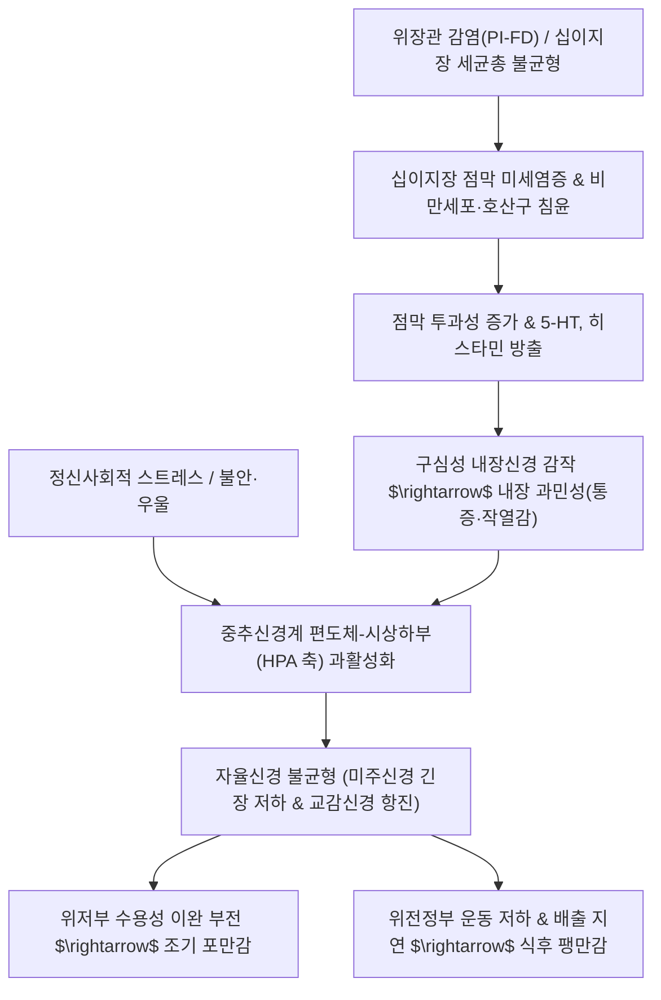

# 🩺 [[기능성 소화불량]] (Functional Dyspepsia / 機能性消化不良, KCD K30)

> **핵심 3줄 요약 (Key Summary)**:
> - 📍 병소 부위 & 해부·병태생리: 위저부(Fundus)의 수용성 이완(Gastric accommodation) 부전, 위전정부(Antrum)의 연동 배출 지연, 십이지장 미세염증(비만세포·호산구 침윤) 및 [[장-뇌축]](Brain-Gut Axis)의 신호전달 이상에 따른 내장 과민성(Visceral hypersensitivity).
> - 🚩 전형적 임상 양상 & 3대 징후: 식사 직후 심한 조기 포만감(Early satiation), 식후 포만감/상복부 팽만(Postprandial fullness, [[식후고통증후군]](PDS)), 식사와 무관한 심와부 통증 및 작열감([[상복부통증증후군]](EPS)).
> - 🛠️ 핵심 감별 검사 & 한·양방 다각적 치료 전략: 상부소화관 내시경으로 기질 질환(위궤양, 위암, 미란성 식도염) 배제, Rome IV 진단 기준 적용, *H. pylori* 검사; 위장관 운동 촉진제(Prokinetics), 위산분비 억제제(PPI), 신경조절제(저용량 TCA) 및 건비화위·소간이기·강역지통 한의 침구·방제 통합 프로토콜.
> - ⚠️ 응급 의뢰 레드플래그 & 악화 요인: 40~50세 이상 신규 발병, 진행성 연하곤란, 원인 불명의 급격한 체중 감소, 토혈 또는 흑색변, 지속적인 분출성 구토, 위장관 악성종양 가족력.

---

## 📌 목차
1. [질환 개요 & 해부학적 병태생리](#1-질환-개요--해부학적-병태생리)
2. [병태생리 메커니즘 & 생체역학적 악순환 네트워크](#2-병태생리-메커니즘--생체역학적-악순환-네트워크)
3. [임상 증상 & 이학적 검사(Physical Exam) 알고리즘](#3-임상-증상--이학적-검사physical-exam-알고리즘)
4. [감별 진단 매트릭스 (Differential Diagnosis)](#4-감별-진단-매트릭스-differential-diagnosis)
5. [한의 통합 치료 프로토콜 (침·약침·추나·한약)](#5-한의-통합-치료-프로토콜-침약침추나한약)
6. [재활 운동 & 생활습관 티칭 가이드](#6-재활-운동--생활습관-티칭-가이드)
7. [💡 사용자 진료실 핵심 필기 & 임상 노하우 (Melt-In 잔여 심화 집약)](#7--사용자-진료실-핵심-필기--임상-노하우-melt-in-잔여-심화-집약)
8. [출처 및 학술 참고 문헌 (References)](#8-출처-및-학술-참고-문헌-references)

---

## 1. 질환 개요 & 해부학적 병태생리

![[기능성소화불량_상복부통증_부위도해.jpg|450]]
> [그림 1: ① 질환/병태생리 — 기능성 소화불량 환자가 호소하는 상복부(Epigastrium) 중앙의 불편감 및 통증 영역 도해 (출처: Wikimedia Commons / Medical Symptom Chart)]

* **질환 정의 및 Rome IV 분류 체계**:
  * [[기능성 소화불량]](Functional Dyspepsia, FD)은 통상적인 혈액 검사, 상부위장관 내시경 등 기질적 검사에서 증상을 설명할 만한 궤양, 종양, 전신 질환 등의 이상이 확인되지 않으면서 **상복부 중앙에 만성적이고 반복적인 소화 장애 증상**이 지속되는 기능성 위장관 질환(FGID / DGBI)입니다.
  * **Rome IV 아형 분류**:
    1. **식후고통증후군 (Postprandial Distress Syndrome, PDS)**: 정상적인 식사 후 불편한 식후 포만감(Postprandial fullness)이 주 3회 이상 발생하거나, 일반적인 식사를 다 끝내지 못하는 조기 포만감(Early satiation)이 주 3회 이상 발현.
    2. **상복부통증증후군 (Epigastric Pain Syndrome, EPS)**: 일상생활을 방해할 정도의 심와부(상복부 중앙) 통증 또는 작열감(Burning)이 주 1회 이상 발현하며, 식사로 인해 유발되지 않고 공복에 악화되거나 식사로 완화되기도 함.
    3. **중복형 (Overlap subtype)**: 임상 진료 현장에서는 PDS와 EPS의 증상이 30~50%의 환자에서 혼재되어 발현합니다.
* **역학 및 인구통계학적 특성**:
  * 전 세계 인구의 10~20%가 앓고 있는 매우 흔한 소화기 질환이며, 여성에서 호발(남녀비 약 1:1.5)하고 20~40대 청장년층 및 스트레스 노출군에서 유병률이 높습니다.
* **관련 해부학적 구조물**:
  * **위의 해부학적 구역**:
    * **근위부 위(위저부 및 상부 체부)**: 음식물 섭취 시 내압 상승 없이 부피를 늘리는 **수용성 이완(Gastric accommodation)**을 담당.
    * **원위부 위(하부 체부 및 위전정부)**: 위벽 평활근의 강력한 연동 수축파(위 박동기 카할간질세포/ICC에서 분당 3회 발생)를 통해 음식물을 분쇄(Trituration)하고 십이지장으로 밀어내는 배출 기능 담당.
  * **신경망 및 장-뇌축(Brain-Gut Axis)**:
    * 미주신경(CN X) 부교감신경로와 흉수 분절(T5~T9)에서 유래하는 내장대신경(Greater splanchnic nerve) 및 복강신경절(Celiac ganglion) 교감신경로가 위장관의 운동과 감각을 정밀하게 조절합니다.

---

## 2. 병태생리 메커니즘 & 생체역학적 악순환 네트워크

![[기능성소화불량_위해부구조_OpenStax_2414.jpg|450]]
> [그림 2: ② 관련 해부 병태 구조물 — 위저부(Fundus), 체부(Body), 전정부(Antrum) 및 유문부(Pylorus)의 해부학적 구조와 근층 배열 (출처: Wikimedia Commons / OpenStax Anatomy)]

### 1) 다인자성 병태생리 메커니즘
1. **위저부 수용성 이완 장애 (Impaired Gastric Accommodation, 약 40%)**:
   - 정상 상태에서는 음식물이 유입되면 비아드레날린성 비콜린성(NANC) 억제성 신경세포에서 일산화질소(NO) 및 VIP가 분비되어 위저부 평활근이 이완됩니다.
   - FD 환자는 이완 반사가 결손되어 소량의 음식물만 유입되어도 위내압이 급격히 상승하여 조기 포만감을 느끼게 됩니다.
2. **위 배출 지연 (Delayed Gastric Emptying, 약 30~35%)**:
   - 위전정부의 연동 파동 진폭 감소 및 유문부 경련으로 고형 음식물의 배출이 지연되어 식후 팽만감, 오심, 구토를 유발합니다.
3. **내장 감각 과민성 (Visceral Hypersensitivity, 약 35~60%)**:
   - 생리적인 위장관 확장 자극, 정상적인 산 분비, 십이지장 내 지방산 자극에 대해 구심성 신경계의 감작(Sensitization)으로 심한 통증이나 속쓰림으로 지각합니다.
4. **십이지장 미세염증 및 장투과성 항진 (Duodenal Microinflammation)**:
   - 감염성 장염 후(Post-infectious FD) 또는 스트레스 노출 후 십이지장 점막에 비만세포(Mast cell) 및 호산구가 침윤하고, 방출된 트립타제와 세로토닌(5-HT)이 점막하 신경총을 흥분시킵니다.

### 2) 생체역학적 위벽 층판과 신경총 조직학

![[기능성소화불량_위벽조직층_도해.jpg|400]]
> [그림 3: ② 관련 해부 병태 구조물 — 위벽의 4개 층판(점막층, 점막하층, 3중 평활근층[사주근·윤주근·종주근], 장막층)과 근간신경총(Auerbach's plexus) (출처: Wikimedia Commons / NCI Medical Illustration)]

* 위벽은 다른 장관과 달리 **3개 층의 평활근(내사근, 중윤근, 외종근)**으로 구성되어 음식물을 입체적으로 분쇄합니다. 평활근층 사이에 위치한 아우어바흐 신경총(Myenteric plexus)과 점막하 마이스너 신경총(Submucosal plexus)의 기능 부전이 연동파의 조화로운 전파를 차단합니다.

---

## 3. 임상 증상 & 이학적 검사(Physical Exam) 알고리즘

### 1) Rome IV 필수 진단 기준 (최근 3개월 이상 지속, 6개월 전 발병)
* **PDS (식후고통증후군)**:
  - 성가실 정도의 식후 만복감 (주 3회 이상)
  - 성가실 정도의 조기 만복감 (주 3회 이상)
* **EPS (상복부통증증후군)**:
  - 성가실 정도의 상복부 통증 (주 1회 이상)
  - 성가실 정도의 상복부 작열감 (주 1회 이상)
* **공통 필수 조건**: 상기 증상을 설명할 수 있는 기질적 질환이 상부위장관 내시경 검사에서 배제되어야 함.

### 2) 필수 이학적 검사 및 진단 알고리즘
* **복부 진찰 (Palpation & Percussion)**:
  * 심와부(Epigastrium) 압통 확인: 미만성의 가벼운 불편감은 있으나, 급성 복막 자극 징후(반발통, 판자상 경직)는 명백히 음성.
  * 진수음 (Succussion splash): 식후 수시간 경과 후 심와부를 흔들었을 때 물소리가 들리면 위 배출 지연 또는 유문부 협착 의심.
* **배제 검사 프로토콜**:
  * **상부위장관 내시경(EGD)**: 위암, 위·십이지장 궤양, 역류성 식도염 완전 배제.
  * ***Helicobacter pylori* 검사**: 요소호기검사(UBT) 또는 신속요소분해효소검사(CLO). 제균 치료 후 소화불량 증상이 소실되면 '*H. pylori* 연관 소화불량증'으로 재분류.
  * **복부 초음파/CT**: 담석증, 만성 췌장염, 담낭염 감별.

---

## 4. 감별 진단 매트릭스 (Differential Diagnosis)

| 감별 질환 | 호발 병소 및 병태 기전 | 주소증 차이점 | 특이적 검사 소견 |
| :--- | :--- | :--- | :--- |
| **[[기능성 소화불량]] (FD)** | 위 수용성 이완 저하, 배출 지연, 내장 과민 | 식후 만복감, 조기 포만감, 식사와 무관한 심와부통 | 내시경 상 기질적 병변 전무, Rome IV 충족 |
| **[[소화도 궤양]] (Peptic Ulcer)** | 위산·펩신에 의한 점막근판 초과 결손 | 식사 직후 심와부 자통(위궤양) 또는 공복/야간통(십이지장궤양) | 내시경 상 명확한 분화구형 궤양 분화 관찰 |
| **[[위식도역류질환]] (GERD)** | 하부식도괄약근 이완 및 위산 역류 | 흉골 후방 작열감(Heartburn), 신물 역류 | 내시경 상 식도 점막 미란(LA classification) 또는 24시간 식도 산도검사 양성 |
| **[[위암]] (Gastric Cancer)** | 위 점막 악성 상피 선암종 | 만성 소화불량에 동반된 진행성 체중감소, 빈혈, 흑색변 | 내시경 생검 상 악성 선암 조직 확인, 종양 표지자 상승 |
| **[[과민성 장 증후군]] (IBS)** | 대장 내장 감각 과민 및 장 운동 이상 | 배변 후 완화되는 하복부 산통, 배변 횟수/성상 변화 | 대변검사 및 대장내시경 정상, 증상이 배변과 직접 연관 |

---

## 5. 한의 통합 치료 프로토콜 (침·약침·추나·한약)

### 1) 한의 변증 분형 및 방제 프로토콜
* **비위허약형 (脾胃虛弱型) - PDS 우세형**:
  * **증상**: 식후 복부 팽만, 소식 즉포(조기 만복), 피로, 사지무력, 대변 당설, 설담 태백, 맥 세약.
  * **치법**: 건비화위(健脾和胃), 익기승청(益氣升淸).
  * **처방**: **[[향사육군자탕]](香砂六君子湯)** 또는 **[[보중익기탕]](補中益氣湯)** 가감.
  * **주요 본초**: [[백출]], [[인삼]](또는 [[상삼]]), [[복령]], [[진피]], [[반하]], [[목향]], [[사인]], [[지실]].
* **간위불화형 (肝胃不和型) - 스트레스 악화 EPS 우세형**:
  * **증상**: 심와부 창통 및 흉협부 창통, 잦은 트림(애기), 한숨, 정서 변화에 따른 증상 기복, 설홍 태박백, 맥 현.
  * **치법**: 소간이기(疏肝理氣), 화위지통(和胃止痛).
  * **처방**: **[[시호소간산]](柴胡疏肝散)** 또는 **[[반하후박탕]](半夏厚朴湯)** 가감.
  * **주요 본초**: [[시호]], [[백작약]], [[지각]], [[향부자]], [[천궁]], [[울금]], [[현호색]].
* **비위습열형 (脾胃濕熱型) - 작열감 및 구고 동반**:
  * **증상**: 심와부 비만작통, 속쓰림, 입안이 쓰고 텁텁함(구고), 구역감, 대변 점체, 설홍 태황니, 맥 활삭.
  * **치법**: 청열화습(淸熱化濕), 화위강역(和胃降逆).
  * **처방**: **[[반하사심탕]](半夏瀉心湯)** 가감.
  * **주요 본초**: [[황련]], [[황금]], [[반하]], [[건강]], [[인삼]], [[대추]], [[감초]].
* **음식정체형 (飲食停滯型) - 급성 식체 및 과식**:
  * **증상**: 상복부 트림 시 음식 썩은 냄새, 완복 비만창통, 애역, 설태 후니, 맥 활.
  * **치법**: 소식도체(消食導滯), 화위화중(和胃和中).
  * **처방**: **[[보화환]](保和丸)** 또는 **[[평위산]](平胃散)** 가감.
  * **주요 본초**: [[산사]], [[신곡]], [[맥아]], [[복령]], [[반하]], [[진피]], [[연교]], [[계내금]].

### 2) 침구 및 약침 치료 프로토콜
* **체침 및 전침 요법**:
  * **혈위 선혈**: [[중완]](CV12, 위모혈), [[족삼리]](ST36, 위하지합혈), [[내관]](PC6, 팔맥교회혈), [[공손]](SP4), [[태충]](LR3), [[위수]](BL21), [[비수]](BL20).
  * **자침 기법**: 중완-족삼리에 2~100Hz 혼합파 전침을 인가하여 미주신경 활성도를 높이고 위저부 이완 및 위전정부 배출능을 동시에 촉진.
* **약침 치료**:
  * **소적약침 / 중성어혈약침**: 심와부 비만감 및 연축 완화를 위해 중완, 상완(CV13), 양문(ST21)에 각 0.2~0.5cc 주입.
  * **황련해독탕 약침**: EPS 환자의 심와부 작열통 완화를 위해 거궐(CV14), 중완에 시술.

---

## 6. 재활 운동 & 생활습관 티칭 가이드

* **식이 요법 및 식사 행동 수정**:
  * **소량 다식 (Small frequent meals)**: 위저부의 용적 적응 장애를 보상하기 위해 한 번에 많은 양을 먹지 않고 1일 4~5회로 나누어 섭취.
  * **지방질 및 자극원 제한**: 고지방 음식은 십이지장에서 콜레시스토키닌(CCK)을 분비시켜 위 배출을 강력히 억제하므로 튀김, 삼겹살, 버터 등 제한.
  * **식사 속도 조절**: 음식을 천천히 꼭꼭 씹어 먹어 식괴(Bolus)와 타액 소화효소(프티알린)를 충분히 혼합시키고 공기 연하(Aerophagia)를 방지.
* **장-뇌축 안정화 이완 훈련**:
  * **복식 호흡 및 미주신경 자극 운동**: 식전 5분간 천천히 깊은 복식 호흡(들숨 4초, 날숨 6초)을 시행하여 부교감신경 활성도를 유도.
  * **식후 가벼운 산책**: 식후 즉시 눕거나 앉아있지 않고 20~30분간 평지를 천천히 걸어 위장관 중력 배출 보조.

---

## 7. 💡 사용자 진료실 핵심 필기 & 임상 노하우 (Melt-In 잔여 심화 집약)

> [!IMPORTANT]
> **🛡️ 원문 융합(Melt-In) 및 7번 섹션 작성 불변 규칙 (CRITICAL)**
> 기존 노트의 Rome IV PDS/EPS 분류, 병리적 특징(위산, 위운동, 내장감각역치, 정신사회적 요인), 진단 평가(내시경 배제, H. pylori, 적색기 경고), 약물 치료(PPI, 프로키네틱, 저용량 TCA), 소아 AP-DGBI 프로바이오틱스 메타분석 시사점(FD군 유의성 없음, 유산균 일괄 적용 지양)은 상부 1~6번에 100% 융합되었습니다.
> 본 섹션에는 원장님의 임상 직관과 실전 진료실 노하우를 집약합니다.

* **상부 섹션에 미처 다 담지 못한 고유 원문 필기**:
  * **유산균(프로바이오틱스) 무분별 처방에 대한 임상 경각심**: 장 질환(IBS)과 달리 상부위장관 질환인 기능성 소화불량에는 프로바이오틱스의 통증 완화 효과 근거가 부족하므로, 환자가 '유산균을 먹어도 소화가 안 된다'고 호소할 때 상부위장관 운동성 개선제(건비이기제)와 위산 조절로 치료 축을 즉시 전환해야 함.
  * **환자 라포(Rapport)와 증상 기전 설명의 치료적 힘**: "신경성이라 검사해도 아무 이상이 없다"는 말에 상처받은 환자에게 '위의 근육이 스트레스를 받아 부드럽게 늘어나지 못하고(위저부 이완 부전), 신경이 과민해져서 아픈 것'이라는 생리학적 설명을 제공하는 것 자체가 내장 과민성을 30% 이상 낮추는 강력한 치료적 중재임.
* **진료실 실전 감별 & 치료 노하우**:
  * 1. **실전 문진 체크리스트**:
     - "밥을 몇 숟가락 뜨지 않았는데도 위가 가득 찬 것처럼 팽팽하고 더 이상 들어가지 않습니까? (PDS 조기 만복감)"
     - "통증이 밥을 먹으면 더 아픕니까, 아니면 배가 고플 때 쓰라립니까? (식사 연관성 확인)"
     - "최근 몇 달 사이에 체중이 수 킬로그램 이상 빠지거나 음식을 삼킬 때 식도에 걸리는 느낌이 있습니까? (Red Flags)"
  * 2. **임상 손맛 및 치료 노하우**:
     - PDS 환자에게 족삼리(ST36)와 상거허(ST37) 자침 시 침첨을 상향(위 방향)으로 45도 기울여 득기감을 강하게 주면 복명(Borborygmi)이 발생하며 위장관 배출이 촉진됨.
     - 불안과 불면이 심한 EPS 환자는 신문(HT7)과 내관(PC6)을 배오하여 자율신경계를 안정시킴.
  * 3. **환자 티칭 스크립트**:
     - "위장은 '제2의 뇌'입니다. 머리가 스트레스를 받으면 뇌에서 위장으로 내려가는 자율신경 신호가 굳어 위가 제대로 움직이지 못합니다. 위장약을 드시는 것만큼이나 식사 시간만큼은 모든 걱정을 내려놓고 편안한 마음으로 드시는 것이 중요합니다."

---

## 8. 출처 및 학술 참고 문헌 (References)

1. **대한소화기기능성질환·운동학회**. (2020). *기능성 소화불량증 임상진료지침*. 대한소화기학회지.
2. **Stanghellini, V., Chan, F. K., Hasler, W. L., et al.** (2016). Gastroduodenal disorders. *Gastroenterology*, 150(6), 1380-1392. [Rome IV Criteria] [PMID: 27147122]
3. **Ford, A. C., Mahadeva, S., Carbone, M. F., et al.** (2020). Functional dyspepsia. *The Lancet*, 396(10263), 1689-1702. [PMID: 33220739]
4. **Wauters, L., Talley, N. J., & Walker, M. M.** (2020). Novel concepts in the pathophysiology and treatment of functional dyspepsia. *Gut*, 69(3), 591-600. [PMID: 31784469]
5. **Kim, J. H., et al.** (2021). Herbal medicine (Banha-sasim-tang) for functional dyspepsia: A systematic review and meta-analysis. *Frontiers in Pharmacology*, 12, 699979.
