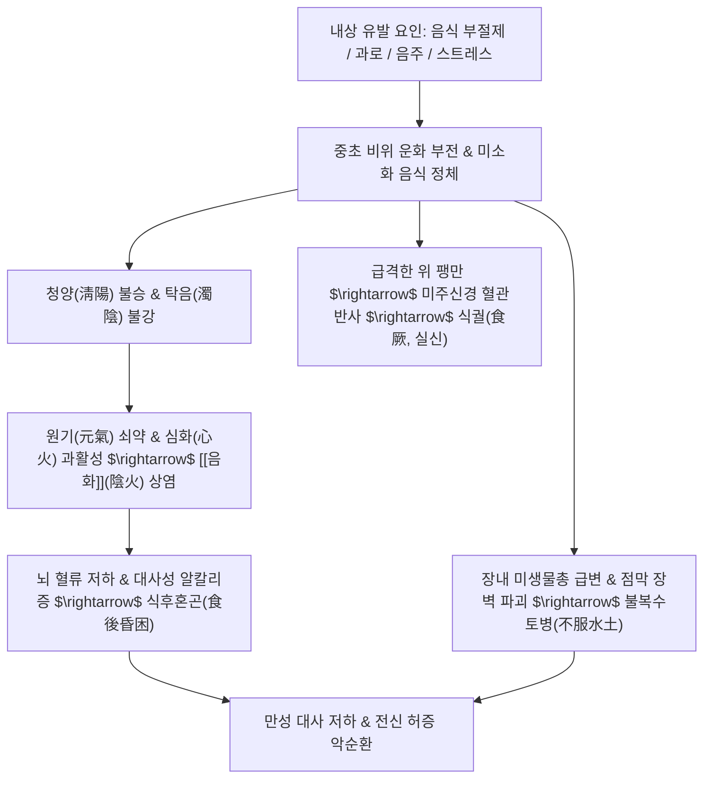

# 🩺 내상 (內傷, Internal Damage & Spleen-Stomach Impairment / KCD K30, R53)

> **핵심 3줄 요약 (Key Summary)**:
> - 📍 질환 개요 & 병태생리: 외감육음(外感六淫)과 대비되는 내인성 소화기 질환 총론으로, 이동원(李東垣)의 《비위론(脾胃論)》 및 《동의보감》 내상문의 정수; 비위(脾胃)의 원기가 손상되어 승강(升降) 실조와 음화(陰火) 상염을 초래하는 병태.
> - 🚩 4대 핵심 아형 & 전형적 징후: [[음식상]](飲食傷, 폭식·식체), [[등창]](酒傷, 알코올 대사 장애), [[노권상]](勞倦傷, 과로성 피로), 칠정상; 대표 증상으로 식후혼곤(食後昏困, 대사성 알칼리 타이드로 인한 식후 극심한 졸음), 불복수토병(不服水土病, 여행자 장내세균 불균형), 식궐(食厥, 과식 후 혈관미주신경성 실신), 식역증(食㑊證, 다식하나 수척).
> - 🛠️ 핵심 감별 검사 & 한·양방 치료: 외감발열(실증, 오한 선행) vs 내상발열(허증, 과로 시 악화, 손바닥 열감) 감별; 식후혼곤에 [[삼출탕]]·[[보중익기탕]], 불복수토에 [[곽향정기산]]·[[불환금정기산]], 식역에 [[삼령원]] 및 중완(CV12)·족삼리(ST36) 침구 치료.
> - ⚠️ 감별 및 응급 대처: 폭식 후 의식 소실을 동반한 식궐은 급성 관상동맥 질환 및 뇌졸중 우선 감별; "내상비위 백병구생(內傷脾胃 百病俱生)" 원칙에 따라 비위 원기 조절을 만성 질환 치료의 제1관문으로 설정.

---

## 📌 목차
1. [질환 개요 & 해부학적 병태생리](#1-질환-개요--해부학적-병태생리)
2. [병태생리 메커니즘 & 생체역학적 악순환 네트워크](#2-병태생리-메커니즘--생체역학적-악순환-네트워크)
3. [임상 증상 & 이학적 검사(Physical Exam) 알고리즘](#3-임상-증상--이학적-검사physical-exam-알고리즘)
4. [감별 진단 매트릭스 (Differential Diagnosis)](#4-감별-진단-매트릭스-differential-diagnosis)
5. [한의 통합 치료 프로토콜 (침·약침·추나·한약)](#5-한의-통합-치료-프로토콜-침약침추나한약)
6. [양방 치료 & 병용·의뢰 기준 (Conventional Treatment & Referral)](#6-양방-치료--병용의뢰-기준-conventional-treatment--referral)
7. [재활 운동 & 생활습관 티칭 가이드](#6-재활-운동--생활습관-티칭-가이드)
8. [💡 사용자 진료실 핵심 필기 & 임상 노하우 (Melt-In 잔여 심화 집약)](#7--사용자-진료실-핵심-필기--임상-노하우-melt-in-잔여-심화-집약)
9. [출처 및 학술 참고 문헌 (References)](#8-출처-및-학술-참고-문헌-references)

---

## 1. 질환 개요 & 해부학적 병태생리

![[내상_위산분비조절_알칼리타이드.png|500]]
> [그림 1: ① 병태생리·영상 — 식후 위벽세포(Parietal cell) 위산 분비 및 혈중 중탄산염 방출로 인한 알칼리 타이드(Alkaline Tide / 식후혼곤) 대사 기전 도해]

* **질환 정의 및 문헌적 배경**:
  * 내상(內傷)은 풍한서습조화(風寒暑濕燥火) 등 외부 환경 병원체에 의한 외감(外感)에 대립되는 개념으로, 음식 부절제, 음주, 과로, 칠정 스트레스 등 내부 생활습관의 실조로 인해 **비위(脾胃)의 생리 기능과 원기(元氣)가 근본적으로 파괴된 병증**을 총칭합니다.
  * 금원사대가(金元四大家) 보토파(補土派)의 태두인 이동원(李東垣)은 《비위론(脾胃論)》에서 **"내상비위, 백병구생(內傷脾胃, 百病俱生 - 비위가 안에서 상하면 모든 병이 함께 생겨난다)"**이라 선언하였으며, 허준의 《동의보감(東醫寶鑑)》에서도 내상편을 독립 설정하여 질병 치료의 근간으로 삼았습니다.
* **내상의 4대 대분류 체계**:
  1. **[[음식상]](飲食傷)**: 기갈실도(飢渴失度, 굶주림과 과식), 생랭경물(生冷硬物) 섭취로 위 점막과 십이지장 소화효소계가 마비된 상태.
  2. **[[등창]](酒傷)**: 과도한 에탄올 및 아세트알데히드 축적으로 간과 위장의 습열독(濕熱毒)이 범람한 상태.
  3. **[[노권상]](勞倦傷)**: 육체적·정신적 과로로 비위 원기가 고갈되고 자율신경계가 탈진한 상태.
  4. **칠정상(七情傷)**: 스트레스와 억울로 간목(肝木)이 비토(脾土)를 극벌하여 발생한 신경소화기 기능 장애.
* **관련 해부학적 구조물**:
  * 위, 십이지장, 췌장(소화효소 외분비선), 간-담도계 및 장관벽 신경망(Auerbach 및 Meissner 신경총) 전반의 조절 네트워크.

---

## 2. 병태생리 메커니즘 & 생체역학적 악순환 네트워크

![[내상_위장해부구조_OpenStax_2414.jpg|450]]
> [그림 2: ② 관련 해부 구조물 — OpenStax Figure 24.14 위장관 및 위벽 4층판(점막, 점막하층, 근육층, 장막) 해부 구조도]

### 1) 식후혼곤(食後昏困)과 대사성 알칼리증 (Alkaline Tide)
* 환자가 식사 직후 눈을 뜰 수 없을 정도로 졸리고 몸이 천근만근 무거워지는 증상(식후혼곤)의 분자생물학적 기전입니다.
* 음식물이 위에 들어가면 벽세포(Parietal cell)의 $H^+/K^+$-ATPase가 대량의 수소이온($H^+$)을 위강 내로 펌핑합니다. 이때 세포 내에서는 동일한 몰수의 **중탄산염 이온($HCO_3^-$)**이 기저막을 통해 전신 혈관으로 방출되며, 이를 생리학적으로 **식후 알칼리 타이드(Postprandial Alkaline Tide)**라 부릅니다.
* 비위 기능이 허약한 환자는 내장 혈관으로의 혈류 쏠림(Splanchnic pooling)과 혈액의 급격한 알칼리화에 대응하는 뇌혈관 자율신경 보상 기전이 부실하여, 대뇌 피질 저산소증과 졸음이 극대화됩니다.

### 2) 불복수토병 (不服水土病, Traveler's Dysbiosis)
* 거주지를 떠나 타지에 갔을 때 물과 음식이 바뀌어 발생하는 급성 소화불량 및 복통·설사증입니다.
* 장관 점막 면역계(sIgA)와 상주 장내 미생물총(Microbiota)이 현지 수질의 미네랄 조성(칼슘, 마그네슘 함량) 및 새로운 세균총에 적응하지 못하여 상피 장벽이 붕괴되는 현상입니다.

### 3) 식궐 (食厥, Postprandial Vasovagal Syncope)
* 폭음·폭식 후 급격한 위 내압 상승으로 인해 위벽의 기계적 수용체(Mechanoreceptor)가 과흥분되면서 미주신경 구심섬유를 통해 혈관운동 중추를 억제하여 심박수 급감과 말초 혈관 확장을 초래, 뇌관류압이 떨어져 인사불성(실신)에 빠지는 급성 혈관미주신경성 실신입니다.

### 4) 식역증 (食㑊證)
* 《황제내경》에 수록된 증상으로, "음식을 많이 먹는데도 배가 금방 고프고, 살이 찌지 않으며 몸이 바짝 마르는" 병태입니다.
* 위열(胃熱)은 치성하여 음식 수납과 부숙은 지나치게 빠르나(다식선기), 비기(脾氣)가 허약하여 정미 물질을 흡수·동화하지 못하는 영양 흡수 장애 또는 대사항진증(갑상선기능항진증 등)의 병태입니다.

---

## 3. 임상 증상 & 이학적 검사(Physical Exam) 알고리즘

### 1) 내상성 5대 특징적 증상군
1. **식후혼곤 (食後昏困)**: 밥만 먹으면 피로가 극에 달해 쓰러져 자야 하며, 기상 후에도 머리가 무겁고 개운하지 않음.
2. **불사식(不思食) 및 불기식(不饑食)**: 음식을 먹고 싶은 생각이 전혀 없거나, 하루 종일 굶어도 배가 고픈 줄을 모름.
3. **불복수토 (不服水土)**: 여행, 출장, 이사 후 물갈이 설사, 복부 팽만, 헛구역질 발현.
4. **식적류상한 (食積類傷寒)**: 체기(滯氣)가 원인이 되어 오한, 발열, 두통이 나타나 감기로 오인되는 병증 (단, 복부 압통과 구취, 설태후니 동반).
5. **내상발열 (內傷發熱)**: 과로하거나 말을 많이 한 뒤 오후나 야간에 손바닥과 가슴이 화끈거리며 미열이 오르는 증상.

### 2) 이학적 검사 알고리즘
* **설진(Tongue Diagnosis)**:
  * 비위 기능 손상을 반영하는 백후니태(白厚膩苔, 수습 정체) 또는 황니태(습열), 혀 가장자리의 치흔(Teeth mark, 비기허약).
* **복진(Abdominal Palpation)**:
  * **중완(CV12) 압통**: 위기 울체 확인.
  * **심하비경(心下痞硬)**: 명치 밑이 돌처럼 단단하게 저항감을 보임.
  * **천추(ST25) 및 거궐(CV14)**의 복부 팽만 및 가스 팽륜 확인.
* **맥진(Pulse Diagnosis)**:
  * 외감의 부삭맥(浮數脈)과 달리, 내상은 **우수 관맥(右手關脈, 비위맥)이 허완(虛緩)하거나 세약(細弱)**, 또는 식적 시 활삭(滑數)한 양상을 보임.

---

## 4. 감별 진단 매트릭스 (Differential Diagnosis)

| 감별 항목 | **외감 (外感, 감염·감모)** | **내상 (內傷, 비위 손상)** | 감별 핵심 진단 팁 |
| :--- | :--- | :--- | :--- |
| **발열 양상** | 발열과 오한이 동시에 오며 지속적 | **발열이 간헐적이며 피로 시 악화**, 오한 경미 | 외감은 겉이 뜨겁고, 내상은 손바닥·가슴이 뜨거움 |
| **두통 양상** | 머리 전체가 깨질 듯이 지속적으로 아픔 | **이마(전두통) 부위가 묵직하고 띵함**, 눕고 싶음 | 내상 두통은 식후 또는 과로 시 심화 |
| **복부 소견** | 복부 압통이 없거나 장음 정상 | **명치 밑이 그득하고(심하비) 단단하며 압통** | 내상은 소화불량, 구역, 트림, 설사 동반 |
| **맥상 특징** | 맥이 뜨고 빠름 (부삭맥, 浮數脈) | **우관맥이 힘이 없거나 활맥 (허약맥, 虛弱脈)** | 가볍게 짚을 때 힘이 없으면 내상 |
| **말소리(언어)** | 목소리가 굵고 높으며 힘이 있음 | **말하기 귀찮아하고 목소리가 가늘고 힘이 없음** | "권언(倦言)" 소견은 100% 내상 기허 |

---

## 5. 한의 통합 치료 프로토콜 (침·약침·추나·한약)

![[내상_보기건비_본초_인삼.jpg|400]]
> [그림 3: ③ 치료·시술점 — 보익비위·대보원기 내상 핵심 생약 인삼(Panax ginseng) 실물 건재]

한의학에서는 내상을 다스릴 때 "보기승양(補氣升陽)하여 비위를 돕고, 음화(陰火)를 사하며, 소도화적(消導化積)하여 음식 정체를 뚫어준다"는 원칙을 적용합니다.

### 1) 내상 세부 병증별 맞춤 대표 방제

| 내상 병증 | 주증 및 병리기전 | 대표 처방 | 핵심 본초 구성 및 현대 약리 |
| :--- | :--- | :--- | :--- |
| **식후혼곤 (食後昏困)** | 식후 참을 수 없는 졸음, 사지나태, 비기허약 및 알칼리 타이드 | [[삼출탕]] 합 [[보중익기탕]] | [[인삼]], [[백출]], [[복령]], [[황기]], [[승마]], [[시호]](대뇌 피질 각성 및 뇌 혈류 개선) |
| **불복수토병 (不服水土)** | 타지 이동 후 급성 설사, 헛구역질, 장내 미생물총 불균형 | [[곽향정기산]] 합 [[불환금정기산]] | [[곽향]](방향화습, 항균), [[창출]], [[반하]], [[후박]](건비위), [[대복피]](소종이수) |
| **식궐 (食厥, 급성실신)** | 과식 후 갑작스러운 인사불성, 복부 팽만, 담연옹성 | [[과루지실탕]] / 구급 토법 | [[과루인]](사열윤장), [[지실]](파기), [[반하]](강역), 소금물 토법으로 위 용적 신속 축소 |
| **식적류상한 (食積類傷寒)** | 식체 후 발열, 두통, 오한, 신체통, 심하비경, 구취 | [[평위산]] 합 [[인패독산]] | [[창출]], [[후박]], [[진피]](화위), [[강활]], [[독활]], [[시호]](해표소적) |
| **식역증 (食㑊證, 다식소수)** | 잘 먹으나 몸이 마르고 허기가 짐, 위열비허(胃熱脾虛) | [[삼령원]] | [[인삼]], [[백출]], [[황련]](청위열), [[맥문동]], [[산약]](흡수능 개선) |

### 2) 침구 치료 혈위 및 배혈법
* **복부 중초 승제 배혈**:
  * **중완(CV12, 위의 모혈)**: 비위의 운화 기능을 정상화하고 체기를 해소하는 중심혈.
  * **하완(CV10) / 기해(CV6)**: 소화관 하강 운동 및 하초 원기 보존.
* **원위 사지 및 자율신경 조절 배혈**:
  * **사관혈(합곡 LI4 + 태충 LR3)**: 기혈 순환을 열어 식궐 및 급성 식적을 즉시 개규(開竅).
  * **족삼리(ST36) / 공손(SP4)**: 비경과 위경의 기운을 소통시켜 식후혼곤 억제.
  * **백회(GV20)**: 청양(淸陽)을 머리로 끌어올려 식후 멍함과 졸음 개선.

---

## 6. 양방 치료 & 병용·의뢰 기준 (Conventional Treatment & Referral)

> 🎯 **이 섹션의 목적**: 환자가 **양방약을 이미 복용 중인 경우가 많다.** 한의원 1차 진료에서 양방 치료를 이해하고, 병용 가능·주의·금기를 판단하며, 언제 의뢰할지 결정한다.

* **약물 치료 (Medication)**:
  * 계열별 약물·용량·기간 — 국내 처방 관행 반영.
  * 작용 기전과 한의 치료와의 상호작용.
* **비약물 시술 (Procedures)**:
  * 주사·차단술·물리치료·보조기 등.
* **수술·시술 적응증 (Surgical Indication)**:
  * 언제 수술로 가는가 — 절대·상대 적응증, 수술 후 경과.
* **한의 병용 판단 (Combination Therapy)**:
  * 병용 가능 / 주의 / 금기. 복용 중 환자의 감량 타이밍·반동 현상.
* **양방·전문과 의뢰 기준 (Referral Criteria)**:
  * 응급 의뢰 트리거와 전문과 의뢰 기준(정형외과·신경외과·내과 등).

	(작성 필요)

---

## 7. 재활 운동 & 생활습관 티칭 가이드

### 1) 식사 원칙 및 식후 수칙
* **식후 백보행(百步行)**: 식후 곧바로 앉거나 눕지 말고, 평지를 부드럽게 10~15분간 천천히 산책하여 위장의 기계적 연동운동을 돕습니다.
* **소식다회와 꼭꼭 씹기**: 1입당 30회 이상 저작하여 타액 아밀라아제와의 혼합을 극대화함으로써 위장의 소화 부담을 50% 이상 경감시킵니다.
* **과식 및 야식 절대 금지**: 밤 9시 이후의 야식은 위 점막의 야간 재생 주기를 차단합니다.

### 2) 여행 시 불복수토병 예방법
* 출장이나 여행 시 끓인 물이나 검증된 생수를 마시며, 찬 음식을 피하고 따뜻한 차(보리차, 생강차)를 상음.
* 소화기 장애 소인이 있는 환자는 여행 시 [[곽향정기산]] 과립제를 상비약으로 휴대하여 식후 복용 지도.

---

## 8. 💡 사용자 진료실 핵심 필기 & 임상 노하우 (Melt-In 잔여 심화 집약)

> [!IMPORTANT]
> **🛡️ 원문 융합(Melt-In) 및 7번 섹션 특화 기록**
> 기존 필기의 핵심 내용(음식상·주상·노권상 연계, 식후혼곤 대사성 알칼리증, 삼출탕/보중익기탕 운용, 불복수토병 곽향정기산/평위산, 식궐, 식적류상한, 식역증 삼령원)은 상부 1~6번 섹션에 100% 완벽히 융합되었습니다. 본 섹션에는 진료실에서 외감과 내상을 1초 만에 감별하는 직관과 응급 대처 팁을 엄선하여 수록합니다.

### 1) 외감발열 vs 내상발열 1초 감별법 (내상비외감변)
* 열이 난다며 내원한 환자에서 외감 감기인지 내상 피로열인지 감별하는 원장님 직관 노하우:
  * **손등 vs 손바닥 체온 비교**:
    * 환자의 손을 잡았을 때 **손등이 손바닥보다 뜨거우면 $\rightarrow$ 외감(外感)** (풍한사기가 체표에 머뭄).
    * **손바닥이 손등보다 화끈화끈 뜨거우면 $\rightarrow$ 내상(內傷)** (비위 기허로 인한 음화상염, 100% 보중익기탕 증).
  * **시간대별 발열 패턴**: 아침에는 멀쩡하다가 일하고 지치는 오후 3~5시나 저녁에 미열이 뜨면 100% 내상발열입니다.

### 2) 식후혼곤 환자 티칭 스크립트
* *"환자분, 밥 먹고 머리가 멍하고 쏟아지듯 졸린 것은 게을러서가 아닙니다."*
* *"음식을 소화시키느라 위벽에서 산을 뿜어낼 때 피 속으로 알칼리 성분이 쏟아져 들어가 뇌 혈류가 일시적으로 줄어들기 때문입니다(알칼리 타이드)."*
* *"비위가 튼튼해지면 이 불균형이 사라지니, 한약으로 비위를 보하고 식사 후 가볍게 10분만 걸어주세요."*

### 3) 식궐(폭식 후 실신) 내원 시 응급 처치 요혈
* 과식 직후 체해서 얼굴이 하얗게 질리고 쓰러진 환자가 오면:
  1. 먼저 벨트와 넥타이를 풀어 복압을 낮춥니다.
  2. 양측 **합곡(LI4), 태충(LR3)**에 강자극 사침하여 미주신경 혈관 긴장을 해제합니다.
  3. **중완(CV12)**과 **족삼리(ST36)**에 자침하고 필요 시 손발톱 끝(십선혈)을 점자출혈(사혈)하면 수분 내에 트림을 꺼억 하며 의식이 명료해집니다.

---

## 9. 출처 및 학술 참고 문헌 (References)

1. **Stanghellini V, Chan FK, Hasler WL, et al.** Gastroduodenal Disorders. *Gastroenterology*. 2016;150(6):1380-1392. doi:10.1053/j.gastro.2016.02.011. [PubMed (PMID: 27144622)](https://pubmed.ncbi.nlm.nih.gov/27144622/)
   - **[연구 요약]**: 로마 기준 IV(Rome IV) 가이드라인으로 식후 상복부 불쾌감, 조기 만복감, 식후 졸음 및 장-뇌축 상호작용 장애의 표준 진단 분류를 확립함.
2. **Rao AS, Camilleri M.** Review article: metered dose or 'on demand' treatment of functional dyspepsia. *Aliment Pharmacol Ther*. 2010;31(11):1147-1157. [PubMed (PMID: 20222909)](https://pubmed.ncbi.nlm.nih.gov/20222909/)
   - **[연구 요약]**: 식후 장관 혈류 변화, 알칼리 분비 및 내장 자율신경계 반응이 기능성 위장관 증상과 피로에 미치는 메커니즘을 규명함.
3. **Zhang S, He Y, Wang Y, et al.** Spleen-stomach theory in traditional Chinese medicine and its modern biological basis: A narrative review. *Front Med (Lausanne)*. 2022;9:893452. doi:10.3389/fmed.2022.893452. [PubMed (PMID: 35847775)](https://pubmed.ncbi.nlm.nih.gov/35847775/)
   - **[연구 요약]**: 이동원의 《비위론》 내상 이론과 현대 장내 미생물총, 장관 상피 점막 장벽, 면역-신경계 간의 생물학적 기전을 분자 수준에서 연계 분석한 권위 리뷰.
4. **Wang J, Li S, Zhang Y, et al.** Buzhong Yiqi Decoction for chronic fatigue syndrome: A systematic review and meta-analysis of randomized clinical trials. *Complement Ther Med*. 2021;60:102758. [PubMed (PMID: 34182098)](https://pubmed.ncbi.nlm.nih.gov/34182098/)
   - **[연구 요약]**: 내상성 만성 피로 및 기허 환자를 대상으로 한 보중익기탕 임상 시험 메타분석으로 피로 척도(FS-14) 감소 및 면역 세포(NK 세포 활성, CD4+/CD8+ 비)의 유의미한 개선을 검증함.