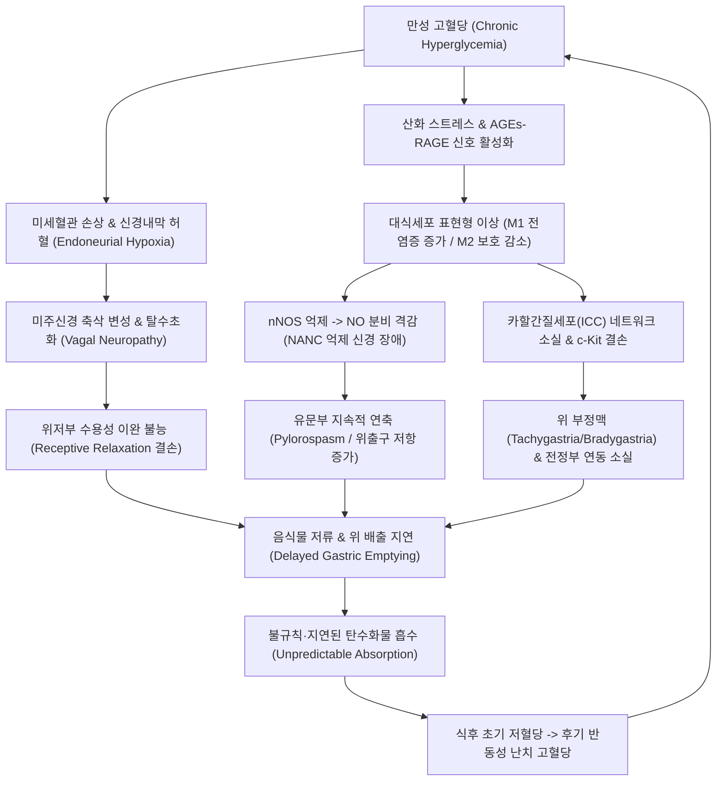

# 🩺 당뇨병성 위마비 (Diabetic Gastroparesis / 糖尿病性 胃痲痹, KCD: K31.84 / E10.4, E11.4)

> **핵심 3줄 요약 (Key Summary)**:
> - 📍 **병소 부위 & 병태생리**: 만성 고혈당에 의한 미주신경([[미주신경]]) 축삭 변성, 장신경총(ENS)의 카할간질세포(ICC) 소실 및 신경형 산화질소 합성효소([[nNOS]]) 발현 억제로 위 기계적 폐색 없이 위저부 적응성 이완 불능, 전정부 운동성 저하, 유문부 연축(Pylorospasm)이 발생하여 위 배출이 지연됨.
> - 🚩 **전형적 임상 양상 & 3대 징후**: 조기 포만감(Early satiety), 식후 수 시간 뒤 미소화 음식물 구토, 심와부 진탕음(Succussion splash) 및 **인슐린 흡수 타이밍 불일치로 인한 설명되지 않는 저혈당 후 반동성 고혈당(혈당 변동성 증폭)**.
> - 🛠️ **핵심 감별 & 한·양방 치료 전략**: 기계적 폐색(위암·소화성궤양 반흔) 배제를 위한 상부위장관 내시경 및 표준 4시간 고형식 위배출 신티그래피([[위배출 신티그래피]])로 확진. 양방 위장관운동촉진제([[Metoclopramide]], [[Domperidone]])와 병용하여 한의 [[족삼리]](ST36)·[[중완]](CV12) 전침 치료 및 비위기허·한열착잡 변증에 따른 [[육군자탕]], [[향사육군자탕]], [[반하사심탕]] 투여로 위장 운동성과 장신경망을 회복함.
> - ⚠️ **응급 의뢰 레드플래그**: 지속적 구토로 인한 중증 탈수 및 급성 신손상([[급성 신부전]]), 전해질 불균형(저칼륨혈증·대사성 알칼리증), 당뇨병 케톤산증([[당뇨병 케톤산증]]), 거대 위석(Bezoar)에 의한 장폐색, 급격한 체중 감소(악성종양 의심).

---

## 📌 목차
1. [질환 개요 & 병태생리 (Disease Overview)](#1-질환-개요--병태생리-disease-overview)
2. [병태생리 메커니즘 & 대사·장기부전 악순환 네트워크](#2-병태생리-메커니즘--대사장기부전-악순환-네트워크)
3. [임상 증상 & 환자 소견 (Clinical Presentation)](#3-임상-증상--환자-소견-clinical-presentation)
4. [감별 진단 매트릭스 (Differential Diagnosis)](#4-감별-진단-매트릭스-differential-diagnosis)
5. [한의 통합 치료 프로토콜 (침·약침·한약)](#5-한의-통합-치료-프로토콜-침약침한약)
6. [양방 치료 & 병용·의뢰 기준 (Conventional Treatment & Referral)](#6-양방-치료--병용의뢰-기준-conventional-treatment--referral)
7. [식이·생활습관 & 자가관리 티칭 가이드](#7-식이생활습관--자가관리-티칭-가이드)
8. [💡 진료실 핵심 필기 & 임상 노하우](#8--진료실-핵심-필기--임상-노하우)
9. [출처 및 학술 참고 문헌 (References)](#9-출처-및-학술-참고-문헌-references)

---

## 1. 질환 개요 & 병태생리 (Disease Overview)

![[당뇨병성_위마비_01_위장관해부구조.png|450]]
> [그림 1: ① 질병 개요 도해 — 위의 해부학적 구조(분문·위저·위체·전정·유문 및 종주근·윤상근·사주근 3층 평활근)와 위배출 병소 부위 — OpenStax Anatomy(CC BY)]

* **질환 정의 및 분류**:
  * **당뇨병성 위마비(Diabetic Gastroparesis, DGP)**는 기계적 폐색(Mechanical obstruction)이 없음에도 불구하고 위 내용물의 십이지장 배출이 지연되어 조기 포만감, 오심, 구토, 복부 팽만감을 유발하는 당뇨병의 만성 소화기 신경병증 합병증이다.
  * **역학 및 유병률**:
    * 제1형 당뇨병 환자의 약 5~12%, 제2형 당뇨병 환자의 약 1~5%에서 증상성 위마비가 발생하며, 무증상 위배출 지연까지 포함하면 당뇨병 환자의 약 30~50%에서 위 운동성 이상이 동반된다.
    * 여성 환자에서 남성에 비해 호발(약 4:1)하며, 당뇨병 유병 기간이 10년 이상이고 당뇨병성 망막병증, 신증, 말초신경병증 등 다른 미세혈관 합병증을 동반한 환자에서 발생 위험이 급격히 증가한다.
* **관련 장기 및 조직**:
  * **주 이환 장기**: [[위]](Stomach) — 특히 위저부(Fundus)의 적응성 이완 장애, 위체부(Corpus)의 전파성 연동파 약화, 위전정부(Antrum)의 분쇄능 저하, 유문부(Pylorus)의 연축.
  * **연관 조직 및 신경계**: [[미주신경]](Vagus nerve, CN X), 복강신경총([[복강신경총]]), 장신경계(Myenteric plexus / Auerbach's plexus), 카할간질세포(Interstitial Cells of Cajal, ICC).
  * **연관 호르몬 및 분자계**: [[인슐린]], [[글루카곤]], [[그렐린]](Ghrelin), [[모틸린]](Motilin), [[산화질소]](NO), 혈관활성장펩티드([[VIP]]).
  * **합병증 표적 장기**: 신장([[신장]] — 탈수 및 전해질 이상으로 급성 신손상 유발), 전신 대사계(난치성 저혈당/고혈당 변동성).

---

## 2. 병태생리 메커니즘 & 대사·장기부전 악순환 네트워크

![[당뇨병성_위마비_02_미주신경주행및지배.png|450]]
> [그림 2: ② 병태생리 구조도 — 미주신경(CN X)의 뇌간 기원 및 흉복부 주행, 위장관 부교감신경 지배 경로 — Gray's Anatomy(Public Domain)]

![[당뇨병성_위마비_02_복강신경총및위신경얼기.png|450]]
> [그림 3: ③ 병태생리 구조도 — 복강신경총(Celiac plexus) 및 위의 벽내 자율신경얼기와 장신경계 네트워크 — Gray's Anatomy(Public Domain)]

![[당뇨병성_위마비_02_카할간질세포도해.png|450]]
> [그림 4: ③ 대사·신경 조율 경로 도해 — 위 평활근층 사이에서 기계적 서파를 생성하는 카할간질세포(ICC) 네트워크 구조 — Wikimedia Commons(CC BY-SA)]

### 1) 분자·세포 수준 기전
* **미주신경 축삭 손상과 자율신경병증 (Vagal Neuropathy)**:
  * 지속적인 고혈당은 폴리올 경로(Polyol pathway) 활성화, 소르비톨 축적, 미세혈관 내피세포 기능부전을 초래하여 미주신경으로 가는 영양혈관(Vasa nervorum)의 허혈을 유발한다.
  * 이로 인해 장-뇌 축(Gut-Brain Axis)을 잇는 미주신경의 원심성 및 구심성 무수 C 섬유와 유수 A-delta 섬유가 퇴행성 탈수초화 및 축삭 위축을 겪는다.
* **장신경계 억제성 신경원 탈락 및 nNOS 발현 결손**:
  * 정상 상태에서는 비아드레날린성 비콜린성(NANC) 억제 신경원이 산화질소([[산화질소]], NO)와 [[VIP]]를 분비하여 위저부를 이완시키고 유문괄약근을 열어준다.
  * 당뇨병성 위마비에서는 신경형 산화질소 합성효소([[nNOS]])의 유전자 발현 감소 및 분해가 촉진되어 평활근 이완 신호가 차단된다. 그 결과 위저부의 순응도(Compliance)가 급감하고 유문부가 지속적으로 조여지는 유문부 연축(Pylorospasm)이 고착화된다(Vittal et al., 2007).
* **카할간질세포(ICC) 소실 및 위 부정맥 (Gastric Dysrhythmia)**:
  * 카할간질세포(ICC)는 위 체부 상외측의 조율기(Pacemaker) 영역에서 분당 3회의 자율적 서파(Slow wave)를 형성하여 전정부로 전도시키는 세포이다.
  * 당뇨병 병태에서는 미세환경 내 항염증·세포보호성 CD206+ M2 대식세포가 소실되고 전염증성 M1 대식세포가 우세해지면서 c-Kit 수용체 신호전달이 차단되어 ICC 네트워크의 광범위한 위축과 소실이 발생한다.
  * 이는 정상 3cpm 서파를 와해시켜 위 빈맥(Tachygastria, >3.7cpm) 또는 위 서맥(Bradygastria, <2.4cpm)의 위 전기 부정맥을 일으켜 기계적 연동 수축이 완전 소실된다.

### 2) 장기·계통 수준 결과 및 악순환 고리
* **위-십이지장 운동 협동성 붕괴**: 위저부가 음식을 받아들이지 못해 식사 직후 심한 조기 포만감과 압박감이 발생하고, 전정부가 직경 2mm 이상의 고형 음식물을 분쇄하지 못해 유문부를 통과하지 못한 채 장시간 잔류한다.
* **혈당 변동성과 위마비의 치명적 악순환 (Vicious Cycle)**:
  * 통상적으로 투여된 인슐린은 1~2시간 내에 최고 혈중 농도에 도달하지만, 위 배출이 지연되면 음식물의 탄수화물은 십이지장으로 흡수되지 않는다.
  * 그 결과 **식후 1~2시간에 급격한 저혈당(Hypoglycemia)**이 발생하고, 뒤늦게 수 시간 뒤 위 내용물이 장으로 배출되면서 **식후 4~6시간 뒤 원인 불명의 급격한 고혈당(Rebound Hyperglycemia)**이 발생한다.
  * 이 극심한 급성 고혈당 자체가 다시 위전정부 운동을 억제하고 유문 연축을 강화하여 위마비를 더욱 악화시키는 악순환이 고착된다.

---

## 3. 임상 증상 & 환자 소견 (Clinical Presentation)

![[당뇨병성_위마비_03_위배출신티그래피소견.png|450]]
> [그림 5: ④ 검사·영상 소견 — 99mTc 방사성 동위원소 고형식 섭취 후 0, 1, 2, 4시간 위배출 신티그래피(GES) 스캔 소견: 4시간 시점에도 위내 다량 잔류(양성) — Wikimedia Commons(CC BY-SA)]

![[당뇨병성_위마비_03_위마비단순방사선소견.png|420]]
> [그림 6: ⑤ 환자 영상 소견 — 당뇨병성 위마비 환자에서 위 확장 및 다량의 공기·음식물 음영이 저류된 단순 복부 X-선 소견 — Wikimedia Commons(CC BY-SA)]

### 1) 주소증 및 핵심 증상
* **오심 및 구토 (Nausea & Vomiting)**:
  * 환자의 90% 이상이 만성 오심을 호소하며, 전형적인 구토 양상은 **식후 수 시간이 지난 후(또는 아침 기상 시 전날 저녁에 섭취한) 소화되지 않은 음식물(Undigested food)**을 토해내는 것이다.
* **조기 포만감 및 식후 팽만감 (Early Satiety & Postprandial Fullness)**:
  * 몇 숟가락 뜨지 않았는데도 위가 가득 찬 느낌이 들며, 식후 수 시간 동안 심와부(명치)에 무거운 돌덩이가 얹혀 있는 듯한 압박감을 호소한다.
* **상복부 동통 (Epigastric Pain)**:
  * 둔통이나 작열통 양상으로 발생하며, 위 확장으로 인한 내장신경 과민성과 장신경계 염증에 기인한다.
* **체중 감소 및 영양실조 (Weight Loss & Malnutrition)**:
  * 음식 섭취에 대한 공포로 식사량이 급감하여 점진적인 체중 감소와 미량영양소 결핍이 동반된다.

### 2) 객관적 소견 (Signs & Labs)
* **신체 검진 (Physical Exam)**:
  * **심와부 진탕음(Succussion Splash)**: 식후 4시간 이상 경과한 공복 상태에서 환자의 양측 장골능을 잡고 복부를 좌우로 흔들었을 때 심와부에서 물출렁이는 소리가 청진기로 명확히 들린다(위 내 액체 및 음식물 저류의 강력한 신체 징후).
* **위배출 신티그래피 (Gastric Emptying Scintigraphy, GES — 진단 Gold Standard)**:
  * 99mTc-sulfur colloid가 포함된 표준 고형식(계란 흰자 4온스, 식빵 2조각, 잼, 물)을 10분 내 섭취한 후 감마카메라로 0, 1, 2, 4시간에 잔류율 측정.
  * **진단 기준**:
    * **4시간 잔류율 > 10%** (가장 신뢰도 높은 진단 기준).
    * 2시간 잔류율 > 60%, 1시간 잔류율 > 90%.
  * **중증도 판정 (4시간 시점 위 잔류율 기준)**:
    * 1등급(경증): 11~15%
    * 2등급(중등도): 16~35%
    * 3등급(중증): >35%
* **상부위장관 내시경 (EGD)**:
  * 12시간 이상의 충분한 금식 후 시행했음에도 불구하고 위 내에 음식물 찌꺼기나 위석(Bezoar)이 관찰되며, 십이지장 구부까지 기계적 협착이나 궤양 반흔이 없음을 증명하여 진단함.

---

## 4. 감별 진단 매트릭스 (Differential Diagnosis)

| 감별 질환 | 특징적 양상 | 감별 포인트 (검사·소견) |
| :--- | :--- | :--- |
| **당뇨병성 위마비 (DGP)** | 장기 당뇨 환자, 식후 수 시간 뒤 미소화 구토, 극심한 혈당 변동성 | **내시경 상 폐색 없음 + 4시간 GES 잔류율 > 10%**, 망막병증·신증 동반 |
| [[위암]](Gastric Cancer) / 위출구폐색 | 지속적 구토, 빈혈, 급격한 체중 감소, 토혈 또는 흑변 | **상부위장관 내시경 상 종양성 종괴 또는 유문부 반흔성 협착 확인**, 조직생검 |
| 기능성 소화불량증([[기능성 소화불량]]) | 조기 포만감, 팽만감 호소하나 구토는 드묾, 정상 혈당 | **GES 검사 상 위배출능 정상(또는 경미한 지연)**, 당뇨 병력 없음 |
| 약물유발성 위마비 | 오피오이드([[오피오이드]]), GLP-1 RA([[삭센다]]/위고비) 투약력 | **의심 약물 중단 후 수주 내 증상 및 위배출능 정상화** |
| 반추 증후군(Rumination) | 식후 수분 내 노력 없는 역류, 역류물을 다시 씹어 삼킴 | 역류성 구토 양상, 고해상도 식도내압검사(HRM) 상 위전도 이상 없음 |
| 칸나비노이드 과구토증 | 만성 대마 흡연력, 뜨거운 샤워 시 증상 극적 완화 | 온수욕 충동, 소변 약물 스크리닝 양성 |

> 🚩 **레드플래그 감별 (응급 의뢰 기준)**:
> 1. **기계적 장폐색 및 악성종양**: 경구 섭취 즉시 담즙성 또는 분변성 구토, 체중 급감, 흑변 시 즉시 소화기내과/외과 응급 의뢰.
> 2. **당뇨병 케톤산증([[당뇨병 케톤산증]], DKA)**: 복통, 호흡 시 과일향(아세톤취), Kussmaul 호흡, 혈당 > 250mg/dL, 요당/요케톤 양성 시 즉시 응급실 전원.

---

## 5. 한의 통합 치료 프로토콜 (침·약침·한약)

![[당뇨병성_위마비_05_침구치료족삼리혈위.png|450]]
> [그림 7: ⑦ 한의 치료 도해 — 위장관 자율신경 활성화 및 위 운동성 촉진의 핵심 경혈인 족삼리(ST36) 자침 부위 — Wikimedia Commons(CC BY-SA)]

### 1) 한의 변증 분류 (Syndrome Differentiation)
* **비위기허(脾胃氣虛) / 비신양허(脾腎陽虛)**: 식욕부진, 조기 포만감, 무기력, 사지냉감, 설담태백(舌淡苔白), 맥침세무력(脈沈細無力).
* **한열착잡(寒熱錯雜) / 심하비(心下痞)**: 명치 밑이 답답하고 막힌 느낌(心下痞滿), 오심, 구역, 헛구역질, 트림에서 음식 썩은 냄새, 설태백후이황(舌苔白厚而黃), 맥현세(脈弦細).
* **담음중저(痰飲中阻)**: 심와부 진탕음(위내 정수), 오심, 구토 담연(묽은 거품 침 토출), 두중감, 설태백니(舌苔白膩), 맥활(脈滑).
* **기체어혈(氣滯瘀血)**: 명치 및 상복부의 지속적 자통(刺痛), 야간 통증 악화, 정서적 스트레스 시 팽만감 악화, 설자암(舌紫暗), 맥삽(脈澁).

### 2) 침구 치료 (Acupuncture & Electroacupuncture)
* **배혈 원칙**:
  * **주혈**: [[족삼리]](ST36), [[중완]](CV12), [[내관]](PC6), [[공손]](SP4), [[위수]](BL21), [[비수]](BL20).
  * **변증 배혈**: 한열착잡 시 [[하완]](CV10)·[[천추]](ST25), 담음 정수 시 [[수분]](CV9)·[[음릉천]](SP9), 기체어혈 시 [[태충]](LR3)·[[격수]](BL17).
* **전침(Electroacupuncture) 프로토콜**:
  * **자극 부위**: 양측 [[족삼리]](ST36) - [[상거허]](ST37) 또는 [[중완]](CV12) - [[하완]](CV10).
  * **파형 및 주파수**: 저주파 연속파 또는 2/100Hz 소밀파(Dense-Disperse Wave), 강도는 근육 연축이 보이는 통증 역치 직전(1.5~2.5mA), 25~30분간 유침.
  * **작용 기전**: 미주신경 핵(Dorsal motor nucleus of vagus, DMV)을 반사적으로 흥분시켜 위 전정부 수축 파동을 재건하고 nNOS/NO 경로를 복원하여 유문 연축을 완화함(Li et al., 2023; Xu et al., 2025).

### 3) 약침 치료 (Pharmacopuncture)
* **약침 제제**: 중성어혈약침, 신바로약침, 또는 황련해독탕 약침.
* **적용 부위**:
  * 복부 복모혈: [[중완]](CV12), [[하완]](CV10) 각 0.1~0.2cc.
  * 배부 배수혈: 양측 [[비수]](BL20), [[위수]](BL21) 각 0.2cc (심도 10~15mm 자입).
  * 하지 요혈: 양측 [[족삼리]](ST36) 각 0.2cc. 총량 1.0~1.5cc, 주 2~3회 시술.

### 4) 한약 치료 (Herbal Medicine)

| 변증 유형 | 대표 처방 | 구성 약재 핵심 | 현대 약리 기전 및 근거 (참고문헌 링크) |
| :--- | :--- | :--- | :--- |
| **비위기허** | [[육군자탕]](六君子湯) / [[향사육군자탕]](香砂六君子湯) | [[인삼]], [[백출]], [[복령]], [[감초]], [[반하]], [[진피]], [[목향]], [[사인]] | 혈중 [[그렐린]](Ghrelin) 분비 촉진을 통한 위저부 적응성 이완 회복 및 전정부 운동성 개선. 체계적 문헌고찰에서 위배출 속도 및 소화불량 점수 유의 개선 확인(Tian et al., 2014; 하단 문헌 5번). |
| **한열착잡** | [[반하사심탕]](半夏瀉心湯) | [[반하]], [[황련]], [[황금]], [[건강]], [[인삼]], [[대추]], [[감초]] | PLC-IP3-Ca2+ 신호전달계 및 NO-cGMP-PKG 경로 조절을 통해 유문부 과긴장 연축 완화 및 장신경총 염증 억제(Wang et al., 2020; Zhang et al., 2023; 하단 문헌 6, 7번). |
| **담음저체** | [[평위산]](平胃散) 가미방 | [[창출]], [[후박]], [[진피]], [[감초]], [[생강]], [[복령]], [[저령]] | 위내 저류액 흡수 촉진, 위 평활근 세포막 전위 안정화 및 위 서파 부정맥 억제. |

---

## 6. 양방 치료 & 병용·의뢰 기준 (Conventional Treatment & Referral)

### 1) 양방 약물 치료
* **위장관운동촉진제 (Prokinetics)**:
  * **Metoclopramide (메토클로프라미드)**:
    * 도파민 D2 수용체 길항제이자 5-HT4 작용제. 미국 FDA가 승인한 유일한 위마비 치료제.
    * 용량: 식전 30분 5~10mg tid 또는 qid.
    * ⚠️ **블랙박스 경고 (Black Box Warning)**: 혈액-뇌 장벽(BBB)을 통과하므로 지연성 운동이상증(Tardive dyskinesia), 파킨슨양 증상, 급성 근긴장이상증 위험이 있어 **최대 투약 기간을 12주 이내로 제한**함.
  * **Domperidone (돔페리돈)**:
    * 말초 도파민 D2 수용체 길항제. BBB를 거의 통과하지 않아 추체외로 부작용은 적으나, 심실성 부정맥 및 **QTc 연장 위험**이 있어 투약 전·후 심전도(ECG) 모니터링 필수(국내 식약처 처방 제한 지침 준수).
  * **Erythromycin (에리스로마이신)**:
    * 모틸린(Motilin) 수용체 작용제. 강력한 위 전정부 수축 유발. 정맥 주사(급성 악화 시) 또는 저용량 경구(125~250mg tid). 수주 내 수용체 하향조절로 인한 약효 소실(Tachyphylaxis) 발생.
* **위장관 운동 억제 약물의 즉각 중단**:
  * [[오피오이드]] 진통제, 삼환계 항우울제([[TCA]]), 항콜린제, 칼슘채널차단제(CCB).
  * **GLP-1 수용체 작용제(GLP-1 RA)**: [[세마글루타이드]](Semaglutide), 리라글루타이드 등은 위배출을 현저히 늦추므로 위마비 증상 발현 시 즉시 중단 검토.

### 2) 비약물 및 중재적 수술 치료
* **위전기자극술 (Gastric Electrical Stimulation, GES - Enterra Device)**:
  * 위 대만부(Greater curvature)에 전극을 이식하여 고주파(12cpm) 저에너지 전기 자극을 가함. 난치성 오심·구토 증상 완화 목적.
* **G-POEM (경구 내시경 유문근절개술, Gastric Peroral Endoscopic Myotomy)**:
  * 내시경을 통해 유문괄약근을 절개하여 위출구 저항을 영구적으로 감소시키는 최소침습 시술. 유문 연축이 뚜렷한 중증 난치 환자에서 높은 배출 개선율 보고.
* **경장 영양 공급**:
  * 경구 섭취 불능 및 난치성 체중 감소 시, 위를 건너뛰는 공장루 튜브(J-tube) 설치를 통한 장관 영양 공급.

### 3) 한·양방 병용 판단 가이드
* **병용 권장**:
  * 양방 Prokinetics 복용 환자가 12주 한계로 약물을 감량·중단해야 할 때, **침구 및 한약(육군자탕·반하사심탕) 치료를 오버랩 투여**하여 약물 반동성 악화를 차단하고 자율신경 회복을 도모함.
* **병용 주의**:
  * 한약 투여 시 과도한 지질·고단백 성분의 보약(녹용, 교질류 등)은 위 배출을 더욱 지연시킬 수 있으므로 초기에는 비위 운화(運化) 위주의 소도기포(消導理氣) 처방을 선행함.

### 4) 전문과 및 응급 의뢰 기준 (Referral Criteria)
* **응급 의뢰**: 24시간 이상 지속되는 구토로 경구 수액 섭취 불능, 핍뇨, 혈압 저하, 전해질 이상(K+ < 3.0 mEq/L), 케톤산증 징후.
* **전문과(소화기내과) 의뢰**: 내시경 상 거대 위석이 발견되어 내시경적 쇄석술(Phytobezoar removal)이 필요한 경우, 내과적 치료에 반응하지 않는 중증 3등급 위마비로 G-POEM 또는 J-tube 설치가 필요한 경우.

---

## 7. 식이·생활습관 & 자가관리 티칭 가이드

* **식이 지도 핵심 수칙 (Dietary Guidelines)**:
  * **소량 분할 식사**: 하루 3끼 대량 식사를 피하고, **1일 5~6회로 나누어 소량씩 섭취**한다.
  * **저지방 식이 (<40g/일)**: 지방질은 십이지장 점막의 CCK 분비를 자극하여 생리적으로 위배출을 지연시키므로 고지방 육류, 튀김, 크림류를 엄격히 제한한다.
  * **저불용성 섬유소 식이**: 감, 오렌지, 샐러리, 브로콜리 등 질긴 불용성 식물 섬유는 위내에서 뭉쳐 **위석(Phytobezoar)**을 형성하여 급성 장폐색을 유발하므로 피한다. 채소는 반드시 푹 삶거나 으깨서 섭취한다.
  * **유동식·반유동식 비중 확대**: 고형식 배출이 심하게 지연되는 환자는 스프, 미음, 갈아 만든 죽, 영양 쉐이크 등 유동식 형태로 영양을 섭취한다(액체 배출은 중력에 의해 상대적으로 보존됨).
* **혈당 관리와 인슐린 투여 타이밍 조절**:
  * 식전 즉시 초속효성 인슐린을 주사하면 음식물 흡수 지연으로 **식후 1~2시간에 심각한 저혈당**에 빠질 수 있다.
  * 따라서 담당 내분비내과와 상의하여 인슐린 투여 시점을 **식후 20~30분 뒤(실제 음식 섭취량과 구토 여부를 확인한 후)**로 늦추거나, 인슐린 펌프의 이중 파동(Dual-wave / Square-wave) 주입법을 적용하도록 티칭한다.
* **식후 자세 및 생활 관리**:
  * 식사 후 최소 2시간 동안은 눕거나 기대지 않고 앉아 있거나, 15~20분간 가볍게 평지를 산책하여 중력과 복벽 운동으로 배출을 돕는다.
  * 취침 전 3시간 이내에는 일체의 음식 섭취를 금지한다.

---

## 8. 💡 진료실 핵심 필기 & 임상 노하우

* **실전 문진 체크리스트 (순서대로 확인)**:
  1. *"식사 후 2~3시간 뒤에 저혈당 증상(식은땀, 손떨림)이 오고, 4~5시간 뒤에 혈당을 재면 오히려 250~300으로 치솟지 않습니까?"* (DGP의 가장 전형적인 혈당 패턴).
  2. *"아침에 일어나서 토할 때, 어젯밤이나 어제 점심에 드셨던 음식물이 그대로 나오나요?"* (미소화 잔류 음식물 확인).
  3. *"현재 [[세마글루타이드]](위고비/오젬픽), 마운자로, 삭센다 등 비만·당뇨 주사제나 신경통 약을 드시고 계십니까?"* (약물 유발성 감별).
* **진료실 복진 팁 (Succussion Splash 재현)**:
  * 환자를 앙와위로 눕히고 청진기를 명치(중완혈) 부위에 댄 채, 검사자의 양손으로 환자의 복부 양옆을 가볍게 흔든다.
  * 정상인은 식후 3시간이 지나면 액체 소리가 나지 않으나, 위마비 환자는 공복 상태에서도 명확한 물출렁임(진탕음)이 청진된다. 이는 환자에게 자신의 위 기능 저하를 직관적으로 이해시키는 훌륭한 교육 도구이다.
* **초기 한약 투약 시 주의사항**:
  * 소화기 점막이 극도로 민감해져 있으므로, 탕약 복용 시에도 한 번에 120cc를 다 마시지 말고 30~50cc씩 미지근하게 데워 홀짝홀짝 나누어 복용하도록 복약 지도한다.

---

## 9. 출처 및 학술 참고 문헌 (References)

1. **Camilleri M, Kuo B, Nguyen L, et al. (2022)**. ACG Clinical Guideline: Gastroparesis. *Am J Gastroenterol*, 117(8):1197-1220. [PMID 35926490](https://pubmed.ncbi.nlm.nih.gov/35926490/)
   - **[연구 요약]**: 미국소화기학회(ACG)의 위마비 진단 및 치료 공식 임상 가이드라인으로 4시간 고형식 신티그래피 진단 기준, Metoclopramide 투약 가이드, 비약물 식이 중재 및 G-POEM 치료 적응증 제시.
2. **Galeano F, Corigliano M, et al. (2026)**. Diabetic gastroparesis: pathophysiology and impact on insulin timing choices. *Endocrine*, 84:1-12. [PMID 42334698](https://pubmed.ncbi.nlm.nih.gov/42334698/)
   - **[연구 요약]**: 당뇨병성 위마비의 병태생리, 카할간질세포(ICC) 및 미주신경 신경병증 기전, 탄수화물 흡수 지연에 따른 인슐린 투여 타이밍 조절 전략 총괄 리뷰.
3. **Vittal H, Farrugia G, Gomez G (2007)**. Mechanisms of disease: the pathological basis of gastroparesis--a review of experimental and clinical studies. *Nat Clin Pract Gastroenterol Hepatol*, 4(6):336-46. [PMID 17541447](https://pubmed.ncbi.nlm.nih.gov/17541447/)
   - **[연구 요약]**: 당뇨병성 위마비에서 장신경총 nNOS 결손, NANC 억제 신경 장애, c-Kit 결손에 의한 ICC 네트워크 붕괴 및 위 전기 부정맥의 분자 세포학적 병리 기전 규명.
4. **Li T, Yu M, Han L, et al. (2023)**. An overview of systematic reviews of acupuncture for diabetic gastroparesis. *Front Med (Lausanne)*, 10:1196357. [PMID 37583426](https://pubmed.ncbi.nlm.nih.gov/37583426/)
   - **[연구 요약]**: 당뇨병성 위마비에 대한 침구 치료 체계적 문헌고찰의 오버뷰로 족삼리(ST36)·중완(CV12) 자침이 위배출 가속화, 소화기 증상 완화 및 위 전도 활성에 위약 대비 유의한 우월성을 입증함.
5. **Zhang YX, Zhang YJ, Miao RY, et al. (2023)**. Effectiveness and safety of traditional Chinese medicine decoction for diabetic gastroparesis: A network meta-analysis. *World J Diabetes*, 14(3):313-342. [PMID 37035221](https://pubmed.ncbi.nlm.nih.gov/37035221/)
   - **[연구 요약]**: 당뇨병성 위마비 환자에 대한 한약 처방의 네트워크 메타분석으로 반하사심탕과 육군자탕 가미방이 양약 단독 투여군 대비 총유효율 증대 및 위배출 시간 단축에 탁월한 효과를 보임을 규명.
6. **Tian JX, Li M, Liao JQ, et al. (2014)**. Xiangshaliujunzi Decoction for the treatment of diabetic gastroparesis: a systematic review. *World J Gastroenterol*, 20(2):561-8. [PMID 24574726](https://pubmed.ncbi.nlm.nih.gov/24574726/)
   - **[연구 요약]**: 향사육군자탕의 당뇨병성 위마비 치료 효과에 대한 체계적 문헌고찰로 위장관 운동 촉진 및 소화불량 증상 개선과 우수한 안전성 프로파일 보고.
7. **Wang B, Zeng KW, Hong ZF, et al. (2020)**. Banxia Xiexin Decoction () Treats Diabetic Gastroparesis through PLC-IP(3)-Ca(2+)/NO-cGMP-PKG Signal Pathway. *Chin J Integr Med*, 26(11):833-838. [PMID 32418177](https://pubmed.ncbi.nlm.nih.gov/32418177/)
   - **[연구 요약]**: 반하사심탕이 PLC-IP3-Ca2+ 신호전달계 및 NO-cGMP 경로 조절을 통해 당뇨병성 위마비 모델에서 유문 평활근 수축성 조절 및 연축을 개선하는 분자 기전 규명.
8. **Lin D, Wang H, Ou Y, et al. (2024)**. The role of diet in diabetes gastroparesis treatment: a systematic review and meta-analysis. *Front Endocrinol (Lausanne)*, 15:1379398. [PMID 38957444](https://pubmed.ncbi.nlm.nih.gov/38957444/)
   - **[연구 요약]**: 당뇨병성 위마비 환자의 식이 중재에 대한 메타분석으로 저지방·저섬유소 소량 분할 식이가 위 잔류율 감소 및 혈당 변동성 완화에 미치는 임상적 효과 입증.

---

## 관련 노트

- [[위]]
- [[십이지장]]
- [[미주신경]]
- [[인슐린]]
- [[기능성 소화불량]]
- [[당뇨병 케톤산증]]
- [[육군자탕]]
- [[향사육군자탕]]
- [[반하사심탕]]
- [[족삼리]]
- [[중완]]
