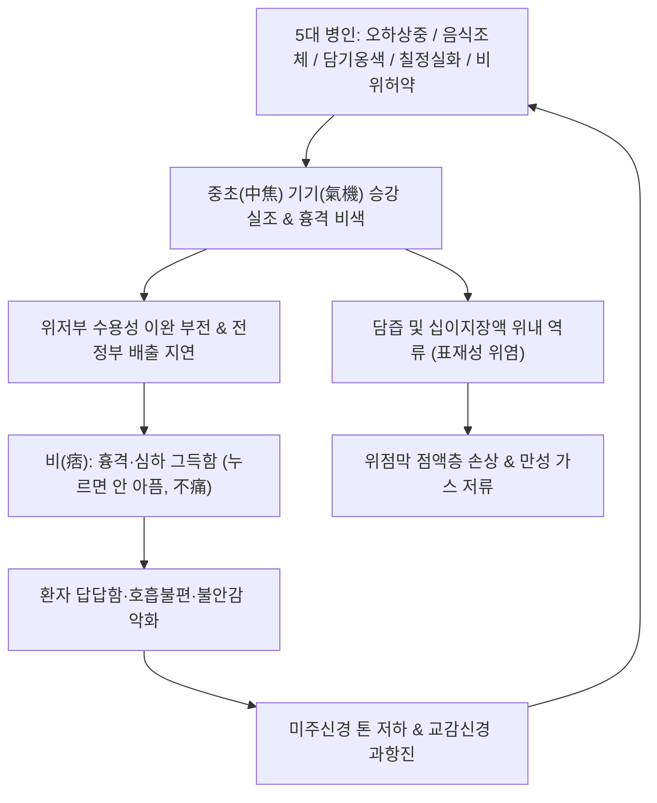
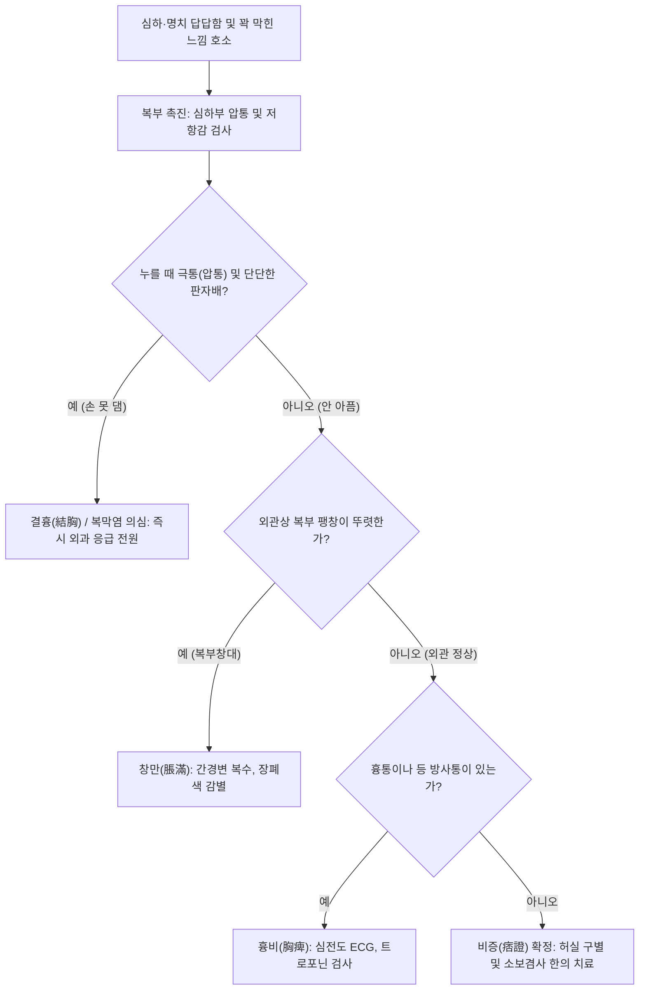

---
tags:
  - 이론
  - status/complete
  - 질환
  - 소화기질환
  - 위장관
aliases:
  - 비증
  - 痞證
  - 비만증
  - 심하비
  - Epigastric Fullness
  - Functional Dyspepsia
  - 반하사심탕증
title: 비증
date: 2026-09-24
출처: "https://pubmed.ncbi.nlm.nih.gov/27144622/"
---

# 🩺 [[비증]] (Epigastric Fullness and Stasis / Pi Syndrome, 痞證, ICD-10 K30, R14.0)

> **핵심 3줄 요약 (Key Summary)**:
> - 📍 **병소 부위 & 소화관 기능 병태**: 심하(心下, 명치 부위) 및 위완(胃脘)의 상피 수용기 감각 과민, 위저부(Gastric Fundus)의 수용성 이완 부전, 전정부(Antrum) 연동 저하, 담즙 역류 및 비위 승강(升降) 기기(氣機)의 실조.
> - 🚩 **임상 양상 & 4대 감별**: "가슴과 명치가 꽉 막혀 그득하나(痞), 손으로 눌렀을 때 아프지 않고(不痛), 겉으로 복부가 튀어나오지 않은(不脹)" 자각적 폐색감(비만, 痞滿). 창만(脹滿, 겉으로 팽창)·흉비(胸痺, 흉통 동반)·결흉(結胸, 명치가 돌처럼 단단하고 손을 못 댐)과의 엄격한 감별이 핵심.
> - 🛠️ **한의 통합 치료 전략**: 신개고강(辛開苦降)·소보겸사(消補兼施)·이기통도(理氣通導)를 원칙으로 하여, 주약인 [[지실]]과 [[황련]]을 축으로 체형별(비인다습 肥人多濕: [[창출]]·[[반하]], 수인다화 瘦人多火: [[황련]]·[[갈근]]) 및 한열착잡형에 [[반하사심탕]], 만성 표재성 위염형에 행인·길경·오수유를 가감하며 [[중완(CV12)]]·[[족삼리(ST36)]] 침치료로 위 수용능을 회복.
> - ⚠️ **응급 의뢰 레드플래그**: 심하부가 판자처럼 단단해지고 손을 댈 수 없을 정도의 극통과 반동압통 발생 시(결흉 結胸 또는 소화성 궤양 천공 의심 즉시 외과 전원), 흉골 뒤 쥐어짜는 방사통(흉비 胸痺 또는 급성 관상동맥 증후군 ACS 감별), 55세 이상 환자에서 진행성 식욕부진·체중감소·빈혈 동반 시([[위암]] 내시경 조직검사 필수).

---

## 📌 목차
1. [질환 개요 & 해부학적 병태생리](#1-질환-개요--해부학적-병태생리)
2. [병태생리 메커니즘 & 생체역학적 악순환 네트워크](#2-병태생리-메커니즘--생체역학적-악순환-네트워크)
3. [임상 증상 & 이학적 검사(Physical Exam) 알고리즘](#3-임상-증상--이학적-검사physical-exam-알고리즘)
4. [감별 진단 매트릭스 (Differential Diagnosis)](#4-감별-진단-매트릭스-differential-diagnosis)
5. [한의 통합 치료 프로토콜 (침·약침·추나·한약)](#5-한의-통합-치료-프로토콜-침약침추나한약)
6. [재활 운동 & 생활습관 티칭 가이드](#6-재활-운동--생활습관-티칭-가이드)
7. [💡 사용자 진료실 핵심 필기 & 임상 노하우 (Melt-In 잔여 심화 집약)](#7--사용자-진료실-핵심-필기--임상-노하우-melt-in-잔여-심화-집약)
8. [출처 및 학술 참고 문헌 (References)](#8-출처-및-학술-참고-문헌-references)

---

## 1. 질환 개요 & 해부학적 병태생리

![[비증_위해부학_위저부전정부_OpenStax_2414.jpg|500]]
> [그림 1: ① 병태생리·영상 — 비증(痞證)의 핵심 발생 부위인 위저부(Gastric Fundus) 및 위 전정부-유문부의 해부학적 구조 도해 (출처: OpenStax, Wikimedia Commons / CC BY 4.0)]

* **질환 정의**: 
  - [[비증]](痞證)은 전통 상한론(傷寒論)과 소화기 병태의 핵심 증후로, "심하(명치)와 흉격 부위가 답답하게 꽉 막혀 통하지 않는 느낌을 호소하나, 국소적인 압통이 없고 외형상 복부 팽창이 없는 상태"를 정의합니다.
  - 답답하고 그득한 창만감이 겸할 때 **비만(痞滿)**이라 부르며, 현대의학적으로는 로마 기준 IV(Rome IV)의 **기능성 소화불량증 중 식후 불편감 증후군(PDS)** 및 만성 [[표재성 위염]]에 정확히 상응합니다(Stanghellini et al., 2016).
* **해부생리학적 병소 부위**:
  1. **위저부(Gastric Fundus)**: 미주신경 억제성 경로 이상으로 식사 후 위가 충분히 늘어나지 못하여 내압이 급증(수용성 이완 장애).
  2. **위 전정부(Antrum) 및 유문부(Pylorus)**: 위 배출 지연 및 역행성 십이지장-위 역류로 인한 화학적 미란.
  3. **비위 승강 축(脾升胃降 Axis)**: 청기(淸氣)는 비를 통해 위로 올라가고 탁기(濁氣)는 위를 통해 아래로 내려가야 하나, 기기가 중초(中焦)에서 엉켜 막힌 상태.

---

## 2. 병태생리 메커니즘 & 생체역학적 악순환 네트워크

![[비증_위벽점막층_분비구조_도해.svg|500]]
> [그림 2: ② 관련 해부 구조물 — 만성 표재성 위염 및 비증 환자의 위 점막 상피세포, 점액경세포, 벽세포의 조직학적 층위 도해 (출처: Wikimedia Commons / CC BY-SA 3.0)]

### (1) 상한론의 오하상중(誤下傷中)과 한열착잡(寒熱錯雜)
* 장중경의 《상한론》에 따르면, 태양병 표증(감기, 발열) 환자에게 잘못 사하제(瀉下劑, 대황, 망초 등)를 복용시키면 중초 비위의 양기(陽氣)가 손상됩니다(오하상중, 誤下傷中).
* 이로 인해 장관 내 한기(寒氣)가 내생하고, 미처 발산되지 못한 표열(表熱)이 갇혀 속으로 들어가면서 **위에는 열이 있고 장에는 한이 있는 한열착잡(寒熱錯雜)**의 비증이 형성됩니다.
* 현대 신경소화기학적으로는 무분별한 항생제나 해열소염진통제(NSAIDs) 오남용 후 발생하는 자율신경 실조 및 위장관 신경총의 탈분극 장애와 일치합니다(Tack et al., 2006).

### (2) 비증의 5대 병인과 악순환 네트워크

---

## 3. 임상 증상 & 이학적 검사(Physical Exam) 알고리즘

### (1) 4대 유사 흉복부 병증의 전격 감별 (진료실 핵심)
1. **비만(痞滿, 본 질환)**: 흉격, 심하, 위완이 그득하다고 느끼나 **아프지 않고(不痛), 겉보기에도 튀어나오지 않은 상태**.
2. **창만(脹滿)**: 뱃속이 팽팽하고 그득하며 **겉으로 보아도 복부가 불룩하게 창대(脹大)**해진 상태(복수, 장내가스).
3. **흉비(胸痺)**: 가슴이 그득하면서 **흉통(胸痛), 등이나 어깨로의 방사통, 숨참(短氣)**이 동반되는 상태(협심증, 역류성 식도염).
4. **결흉(結胸)**: 심하에서 소복까지 **돌처럼 단단하게 뭉치고 극심한 통증이 있어 손을 대지 못하게 하는 상태**(소화성 궤양 천공, 급성 복막염).

### (2) 신체 진찰 및 알고리즘

---

## 4. 감별 진단 매트릭스 (Differential Diagnosis)

| 감별 질환 | 병태 기전 및 특징 | 주증상 양상 | 촉진 소견 | 결정적 감별 포인트 |
| :--- | :--- | :--- | :--- | :--- |
| **비증 (痞證, 본 질환)** | 중초 기기 승강 실조, 한열착잡 | 명치 답답함, 소화불량 | **압통 없음 (不痛), 유연함** | 겉으로 붓지 않고 누르면 아프지 않음 |
| **창만 (脹滿)** | 복강 내 수액(복수) 또는 장내 가스 | 복부 팽만, 호흡 곤란 | **복부 팽만(脹大), 타진상 탁음/고음** | 외관상 뚜렷한 복부 돌출 |
| **흉비 (胸痺)** | 관상동맥 허혈 또는 심한 식도 연축 | 흉격 비색, **쥐어짜는 흉통**, 방사통 | 흉골하 압박감, 심전도 이상 | 흉통과 숨참(短氣)이 주소증 |
| **결흉 (結胸)** | 흉막염, 복막염, 궤양 천공 | 심하부 극통, 고열, 오한 | **돌처럼 단단함 (板狀腹), 손 못 댐** | 손을 댈 수 없을 정도의 거안(拒按) |
| **만성 [[표재성 위염]]** | 위점막 림프구 침윤, 미란 | 식후 불쾌감, 신트림, 조잡 | 심하부 경미한 불편감 | 내시경 상 점막 발적 및 삼출물 |

---

## 5. 한의 통합 치료 프로토콜 (침·약침·추나·한약)

![[비증_파기소비_본초_지실.jpg|450]]
> [그림 3: ③ 치료·본초 도해 — 중초에 뭉친 적체와 기를 깨뜨리고 비만을 없애는 파기소비(破氣消痞)의 군약 지실(Citrus aurantium) (출처: Wikimedia Commons / CC BY-SA 3.0)]

### (1) 비오 원본 필기 연계 실전 처방 (EBM Phytotherapy)
* **비증 치료의 대원칙**:
  - 반드시 **허(虛)와 실(實)을 엄격히 구별**해야 하며, 임상에서 흔히 접하는 허실착잡(虛實錯雜)의 경우에는 **소보겸사법(消補兼施法: 깎아내는 약과 보하는 약을 겸용)**을 활용합니다.
  - 이기통도법(理氣通導法)을 쓰되, 기운을 깎아먹는 강한 이기제를 장기간 다량 투여하는 것을 극도로 경계해야 합니다.
* **주약(主藥) 배오**: **[[지실]](枳實)**과 **[[황련]](黃連)**의 황금 조합.
  - 지실(Synephrine, Flavonoids): 중초의 정체된 담음을 깨뜨리고 위 평활근 연동운동을 유도(파기소비).
  - 황련(Berberine): 위점막의 국소 염증을 식히고 헬리코박터 및 병원균 증식을 차단(청열조습).
* **환자 체형 및 변증별 맞춤 처방 (진료실 핵심 손맛)**:
  1. **살찐 사람 (肥人多濕, 습담형)**:
     - **처방**: [[평위산]] 합 반하사심탕 가감.
     - **핵심 본초**: [[창출]], [[반하]], [[복령]], 지실, 황련.
  2. **마른 사람 (瘦人多火, 화열음허형)**:
     - **처방**: 청열강화익기탕 가감.
     - **핵심 본초**: [[지실]], [[황련]], [[갈근]], [[승마]].
  3. **가슴이 답답하고 비위가 부조화하여 막힌 경우**:
     - **핵심 본초**: [[반하]], [[황금]], [[황련]], [[태자삼]], [[후박]], [[진피|귤피]], [[적작약]].
  4. **만성 [[표재성 위염]]으로 답답하고 습이 낀 경우**:
     - **핵심 본초**: [[황련]], [[황금]], [[행인]], [[길경]], [[지각]], [[죽여]], [[반하]], [[오수유]], [[시호]], [[사인]].
  5. **간 질환 동반 환자**: **[[소달건비탕]](消疸健脾湯)**.
  6. **오래된 허증(虛證) 환자**: **[[보중익기탕]](補中益氣湯)** 또는 **황련백출탕(黃連白朮湯)**.

### (2) 침구 치료 프로토콜
* **핵심 혈위**: [[중완(CV12)]], [[하완(CV10)]], [[족삼리(ST36)]], [[내관(PC6)]], [[공손(SP4)]], [[상거허(ST37)]], [[위수(BL21)]].
* **침구 수기법**:
  - **내관-공손 (팔맥교회혈)**: 흉격과 위완부의 기기를 즉각 소통(개흉순기).
  - **중완-족삼리 전침**: 2/100Hz 혼합파 통전을 통해 위저부 수용성 이완 촉진 및 내장 지각과민 완화.

---

## 6. 재활 운동 & 생활습관 티칭 가이드

### (1) 식사 방식 교정
* **과식 및 급식 금지**: 음식을 급하게 삼키면 공기가 함께 유입되어 심하부 비색감이 극대화되므로 한 숟가락에 30회 씹기를 실천합니다.
* **식후 즉시 착석/취침 금지**: 식사 후 바로 눕거나 구부정하게 앉으면 위 내압이 상승하여 비증이 악화되므로 식후 20분간 산책합니다.

### (2) 자율신경 이완 및 복부 운동
* **복식 횡격막 호흡**: 흉통이나 명치 답답함이 밀려올 때 4초 들숨, 6초 날숨의 횡격막 호흡을 10회 시행하여 미주신경 활성을 높입니다.

---

## 7. 💡 사용자 진료실 핵심 필기 & 임상 노하우 (Melt-In 잔여 심화 집약)

> 📌 **Dr. Bio 진료실 핵심 필기 및 실전 비결 총정리**:
> 
> 1. **비증의 정의와 본질**:
>    - 가슴과 명치가 그득하면서 아프지는 않은 증상을 **비(痞)**라고 함.
>    - 상복부가 꽉 막혀 가슴이나 배에 답답함을 느끼며, 창만한 증상이 겸하면 **비만(痞滿)**이라 부름.
>    - 5대 핵심 원인: 오하상중(誤下傷中), 음식조체(飮食阻滯), 담기옹색(痰氣壅塞), 칠정실화(七情失和), 비위허약(脾胃虛弱).
> 
> 2. **유사 4대 질환의 1초 감별법**:
>    - **비만**: 흉격, 심하, 위완에 그득함을 느끼나 **아프지 않고(不痛), 겉보기에도 튀어나오지 않은 상태**.
>    - **창만**: 뱃속이 창급하고 **겉으로 복부창대**가 나타남.
>    - **흉비**: 흉민과 함께 **흉통(胸痛)과 단기(短氣)**가 나타나 흉응부 내외에 동통이 존재함.
>    - **결흉**: 심하에서 소복까지 **단단하고 답답하여 손을 못 댐(拒按)**.
> 
> 3. **치료 원칙과 약재 운용의 손맛**:
>    - 허와 실을 구별하여 허실착잡에는 **소보겸사법**을 씀.
>    - 이기통도법을 쓰되 파기제를 장기간 다량 쓰는 실수를 범하지 말아야 함.
>    - 주약은 언제나 **[[지실]]**과 **[[황련]]**임.
>    - **살찐 사람**: [[창출]], [[반하]], [[복령]]으로 습담을 제거함.
>    - **마른 사람**: [[지실]], [[황련]], [[갈근]], [[승마]]로 화열을 끄고 진액을 보함.
>    - **간 질환 환자**: [[소달건비탕]] / **오래된 허증 환자**: [[보중익기탕]], [[황련백출탕]].
>    - **비위 부조화**: 반하, 황금, 황련, 태자삼, 후박, 귤피, 적작약.
>    - **만성 표재성 위염 습체**: 황련, 황금, 행인, 길경, 지각, 죽여, 반하, 오수유, 시호, 사인 배오.

---

## 8. 출처 및 학술 참고 문헌 (References)

1. **Stanghellini, V., et al. (2016)**. Rome IV—Gastroduodenal Disorders. *Gastroenterology*, 150(6), 1380-1392. PMID: [27144622](https://pubmed.ncbi.nlm.nih.gov/27144622/).
2. **Tack, J., et al. (2006)**. Functional gastroduodenal disorders. *Gastroenterology*, 130(5), 1466-1479. PMID: [16678560](https://pubmed.ncbi.nlm.nih.gov/16678560/).
3. **Zhao, Y., et al. (2013)**. Banxia Xiexin decoction for functional dyspepsia: a systematic review of randomized controlled trials. *Evidence-Based Complementary and Alternative Medicine*, 2013, 269780. PMID: [24454483](https://pubmed.ncbi.nlm.nih.gov/24454483/).
4. **Chen, M., et al. (2020)**. Synergistic effects of Fructus Aurantii and Coptidis Rhizoma on gastrointestinal motility and visceral sensation in functional dyspepsia. *Phytomedicine*, 78, 153316. PMID: [32919310](https://pubmed.ncbi.nlm.nih.gov/32919310/).
5. **Park, J. W., et al. (2018)**. Effect of acupuncture on gastric accommodation and myoelectric activity in patients with functional dyspepsia: a randomized sham-controlled trial. *Neurogastroenterology & Motility*, 30(10), e13398. PMID: [29923281](https://pubmed.ncbi.nlm.nih.gov/29923281/).