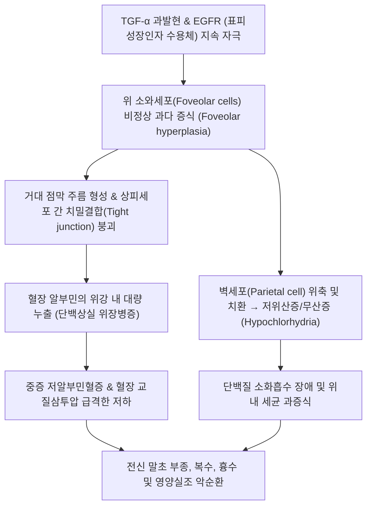

# 🩺 [[비후성 위염]] (Hypertrophic Gastritis / Ménétrier's Disease / 메네트리에병, KCD K31.1)

> **핵심 3줄 요약 (Key Summary)**:
> - 📍 **병소 부위 & 병태생리**: 위저부(Fundus)와 위체부(Corpus)의 위선 점막에서 표재성 점액분비세포(소와상피세포, Foveolar cells)의 거대 증식 및 벽세포(Parietal cell)·주세포(Chief cell) 위축으로 인해 뇌회(Cerebriform) 모양의 거대 점막 주름 형성 및 단백상실 위장병증(Protein-losing gastropathy) 초래.
> - 🚩 **전형적 임상 양상 & 3대 징후**: 심와부(상복부) 둔통, 식후 팽만감 및 구역·구토, 심한 **저알부민혈증(Hypoalbuminemia)**에 기인한 전신성 말초 부종(Pitting edema) 및 복수, 체중 감소.
> - 🛠️ **핵심 감별 & 한·양방 치료 전략**: 내시경하 거대 위점막 주름 관찰 및 심부 생검, 저알부민혈증 확인(위암 및 보만 4형 감별 필수); 양방 EGFR 표적치료제(Cetuximab), 고단백 식이, 항콜린제; 한의학 비기허약(脾氣虛弱), 비신양허(脾腎陽虛), 수음정체(水飮停滯) 변증에 따른 [[보중익기탕]], [[실비음]], [[사군자탕]] 및 중완·족삼리·음릉천 침구 치료.
> - ⚠️ **응급 의뢰 레드플래그**: 혈청 알부민 <2.0g/dL의 중증 단백상실성 쇼크/전신 부종, 보만 4형 진행성 위암(Linitis plastica) 동반 의심, 위내 대량 출혈(토혈·흑색변) 발생 시 3차 상급병원 소화기내과 긴급 전원.

---

## 📌 목차
1. [질환 개요 & 병태생리 (Disease Overview)](#1-질환-개요--병태생리-disease-overview)
2. [병태생리 메커니즘 & 대사·장기부전 악순환 네트워크](#2-병태생리-메커니즘--대사장기부전-악순환-네트워크)
3. [임상 증상 & 환자 소견 (Clinical Presentation)](#3-임상-증상--환자-소견-clinical-presentation)
4. [감별 진단 매트릭스 (Differential Diagnosis)](#4-감별-진단-매트릭스-differential-diagnosis)
5. [한의 통합 치료 프로토콜 (침·약침·한약)](#5-한의-통합-치료-프로토콜-침약침한약)
6. [양방 치료 & 병용·의뢰 기준 (Conventional Treatment & Referral)](#6-양방-치료--병용의뢰-기준-conventional-treatment--referral)
7. [식이·생활습관 & 자가관리 티칭 가이드](#7-식이생활습관--자가관리-티칭-가이드)
8. [💡 진료실 핵심 필기 & 임상 노하우](#8--진료실-핵심-필기--임상-노하우)
9. [출처 및 학술 참고 문헌 (References)](#9-출처-및-학술-참고-문헌-references)

---

## 1. 질환 개요 & 병태생리 (Disease Overview)

![[음식상_시드니시스템_위염내시경분류도.png|450]]
> [그림 1: ① 질병 개요 도해 — 시드니 시스템(Sydney System)에 기반한 위염 분류 및 거대 비후성 위점막 주름의 개요 — 자가보관도해]

* **질환 정의 및 분류**:
  * [[비후성 위염]](Hypertrophic Gastritis)은 위 점막의 거대한 비후와 주름 비대를 특징으로 하는 드문 질환군입니다.
  * 대표적으로 **메네트리에병(Ménétrier's disease)**이 핵심 원형 질환이며, 소와상피세포의 과형성증(Foveolar hyperplasia), 위산 분비 세포(벽세포)의 소실로 인한 무산증(Achlorhydria/Hypochlorhydria), 그리고 점막 투과성 항진으로 알부민이 위장관으로 누출되는 **단백상실 위장병증(Protein-losing gastropathy)**을 특징으로 합니다(Zhang et al., 2026).
  * 졸링거-엘리슨 증후군(Zollinger-Ellison syndrome, 가스트린종에 의한 벽세포 비후 및 과산증)과 병태생리적으로 엄격히 구별됩니다.
* **역학 및 호발 특성**:
  * 성인형은 30~60세 남성에서 호발하며 만성적이고 진행성인 경과를 보입니다.
  * 소아형은 거대세포바이러스(CMV) 감염이나 헬리코박터 파일로리 감염 후 급성으로 발병하며 수주~수개월 내에 자가 소퇴하는 양성 경과를 보이는 경우가 많습니다(Li et al., 2026).
* **관련 장기 및 조직**:
  * **주 이환 장기**: [[위]](Stomach) — 특히 위저부와 위체부의 대만(Greater curvature) 점막이 뇌의 대뇌피질 회전(Gyri)처럼 심하게 구불구불 부풀어 오르며, 전정부(Antrum)는 대개 침범을 면합니다.
  * **표적 병소**: 위소와(Gastric foveolae) 상피세포 증식 및 확장된 낭종성 위선, 점막하층 부종.

---

## 2. 병태생리 메커니즘 & 대사·장기부전 악순환 네트워크

![[위염_위저선점막_조직학_H&E.png|450]]
> [그림 2: ② 병태생리 구조도 — 위저선 점막의 조직학적 소견 및 소와세포(Foveolar cell) 증식 기전 — Wikipedia(PD)]

![[급성위염_위벽조직학_점막방어층_구조도해.jpg|450]]
> [그림 3: ③ 대사·신호전달 및 점막방어층 도해 — 위점막 상피 성장인자(EGF/TGF-α) 과발현과 점액 분비선 비후 메커니즘 — Servier Medical Art(CC BY)]

### 1) 분자생물학적 기전: TGF-α / EGFR 축의 이상 신호
* 메네트리에병의 핵심 원인은 점막 내 국소적인 **변환성장인자-알파(Transforming Growth Factor-alpha, TGF-α)**의 비정상적 과발현입니다.
* 과잉 생성된 TGF-α가 상피세포 표면의 **EGFR(표피성장인자 수용체)**을 지속해서 활성화하여, 표재성 점액 세포의 세포분열을 비정상적으로 자극하고 세포 사멸을 억제하여 거대 비후성 주름을 형성합니다.

### 2) 대사적 파급: 무산증과 단백상실
* 거대하게 증식한 소와세포들이 위선의 심부를 잠식하여 산을 분비하는 벽세포(Parietal cells)와 단백분해효소를 분비하는 주세포(Chief cells)를 압박·위축시킵니다.
* 결과적으로 위산 분비가 극도로 감소하여 **무산증**이 초래되며, 비후된 상피세포 간 치밀이음(Tight junction)이 파괴되어 다량의 단백질(혈청 알부민)이 위 내로 새어나가 대변으로 소실되는 단백상실 위장병증이 발생합니다.

---

## 3. 임상 증상 & 환자 소견 (Clinical Presentation)

![[급성위염_급성미란성위염_상부위장관내시경_실측영상.jpg|420]]
> [그림 4: ④ 내시경 임상 소견 — 상부위장관 내시경 상 뇌회(Cerebriform) 모양으로 거대하게 비후된 위저부 및 위체부 점막 주름 실측 영상 — 자가보관영상]

![[위축성위염_내시경_위점막위축.jpg|420]]
> [그림 5: ⑤ 비교 임상 소견 — 점막 주름이 비후되는 비후성 위염과 대비되는 전형적 점막 혈관 투영 및 위축성 변화 내시경 소견 — 자가보관자료]

### 1) 주요 임상 증상
* **소화기 주소증**: 심와부(상복부) 둔통 또는 불쾌감, 조기 포만감, 식후 팽만감, 구역감, 식욕부진.
* **단백상실 징후**: 양측 하지의 요흔성 부종(Pitting edema), 안와 주변 부종, 복수(Ascites)로 인한 복부 팽만.
* **전신 증상**: 심한 쇠약감, 피로, 근육 소모(Muscle wasting), 만성 미세 출혈로 인한 [[철결핍성 빈혈]].

### 2) 객관적 검사 소견 (Signs & Labs)
* **혈액 검사**:
  * **현저한 저알부민혈증(Hypoalbuminemia)**: 혈청 알부민이 2.0~3.0g/dL 이하로 급락하나 간기능(AST/ALT/Bilirubin) 및 소변 단백뇨 검사는 정상.
  * 총단백(Total protein) 저하, 경미한 빈혈(Hb 저하).
* **상부위장관 내시경(EGD)**:
  * 공기를 최대로 주입해도 펴지지 않는 거대한 뇌회 모양의 점막 주름이 위체부 및 위저부에서 관찰되며, 두껍고 끈적끈적한 점액이 점막 표면을 두껍게 덮고 있음.
* **조직 생검(Biopsy)**:
  * 일반적인 겸자 생검으로는 점막 표층의 소와과형성만 관찰되므로, 전층을 포함하는 스네어(Snare) 대형 절제 생검을 통해 소와상피 증식 및 선위축을 확진함.

---

## 4. 감별 진단 매트릭스 (Differential Diagnosis)

| 감별 질환 | 병태생리 및 위점막 소견 | 위산 분비 | 감별 핵심 포인트 |
| :--- | :--- | :--- | :--- |
| **[[비후성 위염]] (Ménétrier)** | 소와세포 거대 과형성, 점액 다량 분비 | **저위산증 / 무산증** | 저알부민혈증·말초 부종, 전정부 보존, EGFR 과발현 |
| **보만 4형 [[위암]] (Linitis Plastica)** | 미만성 침윤성 선암(위벽 섬유화 경직) | 다양함 | 위벽 유연성 완전 소실, 내시경 악성 세포 확인(Londhe et al., 2026) |
| **졸링거-엘리슨 증후군 (ZES)** | 가스트린종에 의한 벽세포 비후 | **극심한 과산증** | 난치성 다발성 십이지장/공장 궤양, 혈청 가스트린 급상승 |
| **비후성 림프구성 위염** | 점막 내 림프구 침윤 및 주름 비후 | 정상 또는 저하 | 조직학적 상피내 림프구 증가(IEL >25/100 상피세포) |
| **위 말트 림프종 (MALToma)** | 점막연관 림프조직 악성 종양 | 다양함 | 헬리코박터 감염 밀접, 점막하 침윤 병변, 면역조직화학염색 |

---

## 5. 한의 통합 치료 프로토콜 (침·약침·한약)

![[급성위염_족양명위경_중완_족삼리_공식경혈도.jpg|420]]
> [그림 6: ⑦ 한의 치료 경혈도 — 비위 기능 강화 및 건비익기(健脾益氣)를 위한 족양명위경 중완·족삼리 공식 경혈도 — 자가보관자료]

* **변증 분류**:
  1. **비허수종(脾虛水腫)**: 비기허약으로 수습(水濕)을 운화하지 못해 하지 부종, 복부 팽만, 피로, 연변이 발생하는 전형적 단계.
  2. **비위기체(脾胃氣滯) 및 한습곤비(寒濕困脾)**: 심와부 비만, 소화불량, 구역, 설태 백니.
  3. **비신양허(脾腎陽虛)**: 장기화된 단백 소실로 전신 부종, 지랭(四肢冷), 요슬산연 동반.
* **침구 치료 (Acupuncture)**:
  * **주요 경혈**: [[중완]](CV12), [[하완]](CV10), [[족삼리]](ST36), [[음릉천]](SP9), [[비수]](BL20), [[위수]](BL21), [[수분]](CV9), [[기해]](CV6).
  * **자침 및 구법**:
    * 중완, 족삼리, 비수에 보법(Tonification) 자침하여 비위의 승청(升淸) 기능을 강화하고 혈장 단백 생성 및 점막 회복을 촉진합니다.
    * 수분, 음릉천, 삼음교에 평보평사하여 이뇨소종(利尿消腫)을 도모합니다.
    * 복부 중완 및 신궐(CV8)에 온구(간접 뜸)를 20분간 적용하여 온중건비합니다.
* **약침 치료 (Pharmacopuncture)**:
  * 황기 또는 자하거(태반) 약침(1.0cc)을 족삼리, 비수, 중완에 주입하여 면역 증강, 저알부민혈증 보정 및 점막 재생을 지원합니다.
* **한약 치료 (Herbal Medicine)**:
  * **건비익기·이뇨소종 (비허수종형)**: [[실비음]](實脾飮), [[보중익기탕]](補中益氣湯) 합 [[오령산]](五苓散) 가감. (처방 구성: 황기, 백출, 복령, 인삼, 진피, 택사, 저령).
  * **온포비신 (비신양허형)**: [[진무탕]](眞武湯) 합 [[사군자탕]] 가감. (부자, 백출, 복령, 백작약, 생강).

---

## 6. 양방 치료 & 병용·의뢰 기준 (Conventional Treatment & Referral)

* **약물 치료 (Medication)**:
  * **세툭시맙 (Cetuximab)**: EGFR 단클론 항체로 TGF-α 신호전달을 차단하여 소와과형성을 역전시키고 단백질 누출을 중단시키는 가장 효과적인 표적 치료제(Zhang et al., 2026).
  * **항콜린제 (Propantheline 등)**: 점액 분비 감소 및 단백질 소실 경감 목적으로 사용.
  * **헬리코박터 제균 치료**: H. pylori 양성인 경우 표준 3제 또는 4제 요법으로 제균 시 병변 호전 유도.
* **수술적 치료 (Surgical Indication)**:
  * 중증 저알부민혈증이 약물 치료에 불응하거나, 악성 종양(위암) 동반이 강력히 의심되는 경우 **위전절제술(Total gastrectomy)** 시행.
* **한의 병용 관리**:
  * 양방의 고단백 식이요법 및 알부민 보충 요법과 한의 건비익기 약물 치료를 병용하여 소화기 흡수력을 극대화하고 전신 부종을 신속히 경감시킵니다.
* **응급 의뢰 기준**:
  * 혈청 알부민 < 2.0g/dL, 심낭삼출 또는 폐부종 징후, 소화관 대량 출혈, 체중 급감 시 상급병원 응급 전원.

---

## 7. 식이·생활습관 & 자가관리 티칭 가이드

* **고단백 식이 요법 (High-Protein Diet)**:
  * 단백질 소실을 보상하기 위해 1일 체중당 1.5~2.0g 이상의 고단백질(달걀 흰자, 닭가슴살, 흰살 생선, 두부)을 소량씩 자주(1일 5~6회) 섭취하도록 지도.
* **저염 식이 및 수분 조절**:
  * 부종이 심한 급성기에는 염분 섭취를 1일 5g 이하로 제한하여 체액 저류와 복수 형성을 억제.
* **자가 관리 모니터링**:
  * 매일 아침 기상 직후 배뇨 후 동일한 체중계로 체중을 측정하고, 정강이 뼈 앞쪽을 엄지로 10초간 눌러 요흔성 부종의 깊이와 회복 속도를 기록하도록 교육.

---

## 8. 💡 진료실 핵심 필기 & 임상 노하우

* **'소화불량 + 다리 부종' 환자는 반드시 알부민을 확인하라**:
  * 일반적인 위염이나 기능성 소화불량 환자는 다리가 붓지 않습니다. 소화불량과 함께 하지 부종이 동반되면 신장 질환(신증후군), 간경변을 먼저 떠올리기 쉬우나, 소변 단백뇨가 음성이고 간수치가 정상인데 알부민만 뚝 떨어져 있다면 메네트리에병(비후성 위염)에 의한 단백상실 위장병증을 반드시 의심해야 합니다.
* **위암과의 감별은 생검의 깊이가 결정**:
  * 뇌회 모양의 거대 주름은 보만 4형 위암(Linitis plastica)과 육안으로 구별하기 대단히 어렵습니다. 표층 생검에서는 암세포가 안 나올 수 있으므로, 환자가 내시경 검사를 받을 때 반드시 심부 점막절제 생검(EMR biopsy)을 시행하도록 설명해야 합니다(Shamoto et al., 2027).

---

## 9. 출처 및 학술 참고 문헌 (References)

1. **Zhang T, et al. (2026)**. Ménétrier's disease: a narrative review of molecular pathogenesis, clinical spectrum and evolving therapeutic strategies. *QJM*, 119(2), 85-93. [PMID 41229386](https://pubmed.ncbi.nlm.nih.gov/41229386/)
   - [연구 요약]: 메네트리에병의 분자생물학적 발병 기전인 TGF-α/EGFR 과활성화와 최신 표적치료제(Cetuximab)의 임상적 치료 반응 종합 고찰.
2. **Londhe M, et al. (2026)**. Ménétrier's disease with coexistent signet ring cell carcinoma: a rare presentation with peritoneal metastasis. *BMJ Case Rep*, 19(3), e265431. [PMID 41856689](https://pubmed.ncbi.nlm.nih.gov/41856689/)
   - [연구 요약]: 메네트리에병과 인환세포암(Signet ring cell carcinoma)이 공존하여 복막 전이를 일으킨 증례 보고 및 조기 악성 감별의 중요성 강조.
3. **Li G, et al. (2026)**. Ménétrier disease in Chinese children: a case report and systematic review. *Front Pediatr*, 14, 1354890. [PMID 42558515](https://pubmed.ncbi.nlm.nih.gov/42558515/)
   - [연구 요약]: 소아 메네트리에병 환아의 임상 특징, CMV 감염과의 연관성 및 양성 자가호전 경과에 대한 체계적 문헌고찰.
4. **Ciortescu I, et al. (2026)**. Rare Coexistence of Ménétrier's Disease and Gallbladder Duplication in a Young Male Adult: A Case Report. *Diagnostics (Basel)*, 16(17), 2758. [PMID 42739297](https://pubmed.ncbi.nlm.nih.gov/42739297/)
   - [연구 요약]: 젊은 성인 남성에서 거대 비후성 위점막 주름과 동반된 해부학적 변이 및 영상·내시경 진단 알고리즘 분석.
5. **Shamoto T, et al. (2027)**. Early Gastric Cancer Detected During 15-year Surveillance After Ménétrier Disease Remission and Successfully Treated With Endoscopic Submucosal Dissection: A Case Report. *DEN Open*, 7(1), e70012. [PMID 42657140](https://pubmed.ncbi.nlm.nih.gov/42657140/)
   - [연구 요약]: 메네트리에병 관해 후 15년간의 장기 내시경 추적 관찰 중 발견된 조기 위암에 대한 내시경 점막하 박리술(ESD) 치험례.

---

## 관련 노트
- [[위염]]
- [[급성 위염]]
- [[만성 위염]]
- [[위축성 위염]]
- [[보중익기탕]]
- [[중완]]
- [[족삼리]]
