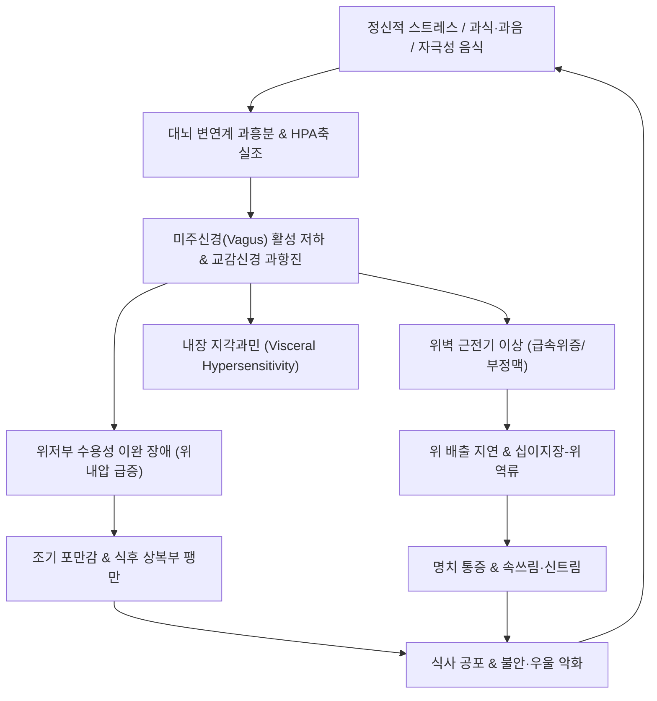
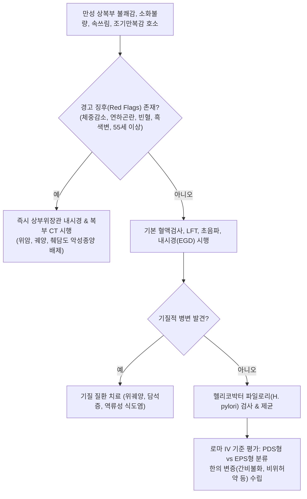

# 🩺 [[상부 위장관 기능 장애]] (Upper GI Functional Disorder / Functional Dyspepsia, 上部胃腸管機能障碍, ICD-10 K30, K31.84)

> **핵심 3줄 요약 (Key Summary)**:
> - 📍 **병소 부위 & 복합 병태**: 위 저부(Fundus) 순응도 저하(Impaired gastric accommodation), 위 전정부(Antrum) 운동 저하 및 위 배출 지연(Delayed gastric emptying), 위벽 평활근의 근전기 이상(Tachygastria, Bradygastria) 및 십이지장-위 역류(Duodenogastric reflux).
> - 🚩 **임상 양상 & 아형 분류**: 로마 기준 IV(Rome IV)에 따라 식후 불편감 증후군(PDS: 조기 포만감, 식후 상복부 팽만감)과 상복부 통증 증후군(EPS: 속쓰림, 명치 통증, 공복통, 신트림)으로 대별.
> - 🛠️ **한의 통합 치료 전략**: 건비화위(健脾和胃)·소도화적(消導化積)·소간이담(疏肝利膽)을 목표로 [[평위산]], [[반하사심탕]], [[보중익기탕]]을 병증에 맞춰 적용하며, [[산사]], [[신국]], [[맥아]]를 활용해 위 평활근 운동을 촉진하고 [[중완(CV12)]]·[[족삼리(ST36)]] 침치료로 위 수용성 이완 및 자율신경 균형을 복원.
> - ⚠️ **경고 징후 (Red Flags) 및 즉각 전원 기준**: 55세 이상 신규 발병, 진행성 연하곤란, 의도치 않은 체중 감소, 반복적인 구토, 흑색변/빈혈([[위암]], [[소화도 궤양]] 감별을 위한 상부위장관 내시경 필수), 황달([[담낭염]], [[담석증]], 췌장 종양 의심).

---

## 📌 목차
1. [질환 개요 & 해부학적 병태생리](#1-질환-개요--해부학적-병태생리)
2. [병태생리 메커니즘 & 생체역학적 악순환 네트워크](#2-병태생리-메커니즘--생체역학적-악순환-네트워크)
3. [임상 증상 & 이학적 검사(Physical Exam) 알고리즘](#3-임상-증상--이학적-검사physical-exam-알고리즘)
4. [감별 진단 매트릭스 (Differential Diagnosis)](#4-감별-진단-매트릭스-differential-diagnosis)
5. [한의 통합 치료 프로토콜 (침·약침·추나·한약)](#5-한의-통합-치료-프로토콜-침약침추나한약)
6. [양방 치료 & 병용·의뢰 기준 (Conventional Treatment & Referral)](#6-양방-치료--병용의뢰-기준-conventional-treatment--referral)
7. [재활 운동 & 생활습관 티칭 가이드](#6-재활-운동--생활습관-티칭-가이드)
8. [💡 사용자 진료실 핵심 필기 & 임상 노하우 (Melt-In 잔여 심화 집약)](#7--사용자-진료실-핵심-필기--임상-노하우-melt-in-잔여-심화-집약)
9. [출처 및 학술 참고 문헌 (References)](#8-출처-및-학술-참고-문헌-references)

---

## 1. 질환 개요 & 해부학적 병태생리

![[상부위장관기능장애_위해부학_OpenStax_2414.jpg|500]]
> [그림 1: ① 병태생리·영상 — 상부 위장관 기능 장애의 주요 장기인 위의 해부학적 구조(분문부, 위저부, 위체부, 전정부, 유문부) 도해 (출처: OpenStax, Wikimedia Commons / CC BY 4.0)]

* **질환 정의**:
  - [[상부 위장관 기능 장애]](Upper Gastrointestinal Functional Disorder)는 일상적인 상부위장관 내시경, 복부 초음파, 생화학적 혈액검사 등에서 궤양, 미란, 악성 종양과 같은 기질적 병변이 관찰되지 않음에도 불구하고, 만성적이거나 재발성의 상복부 통증, 복부 팽만감, 조기 포만감, 구역, 속쓰림 등의 증상이 지속되는 기능성 위장관 질환(FGID)입니다.
  - 현대 소화기학에서는 로마 기준 IV(Rome IV Criteria)의 **기능성 소화불량증(Functional Dyspepsia, FD)**과 동의어로 광범위하게 다루어집니다(Stanghellini et al., 2016).
* **역학 및 유병률**:
  - 전 세계 인구의 15~20%가 이환되어 있으며, 소화기 내과 외래 환자의 40~50% 이상을 차지하는 최빈발 질환입니다.
  - 20~40대 젊은 층과 여성에서 유병률이 높으며, 만성 피로, 불안, 우울, 과민성 장 증후군(IBS)과의 중복 이환율이 30~50%에 달합니다.
* **관련 해부학적 구조물**:
  1. **위저부(Gastric Fundus)**: 미주신경 반사에 의해 음식물이 들어올 때 관강 내 압력 상승 없이 부피를 늘려주는 **수용성 이완(Gastric Accommodation)**의 핵심 부위.
  2. **위 전정부(Gastric Antrum) 및 유문부(Pylorus)**: 카할 간질세포(ICC, Pacemaker)에서 발생하는 분당 3회의 서파(Slow wave)에 맞춰 음식물을 미세하게 갈아 십이지장으로 배출하는 분쇄·연동 펌프 역할.
  3. **십이지장 구부(Duodenal Bulb)**: 위산과 지방 성분을 감지하여 CCK, 세크레틴 등을 분비하고 위 배출을 피드백 제어하는 감각 관문.

---

## 2. 병태생리 메커니즘 & 생체역학적 악순환 네트워크

![[상부위장관기능장애_위점막분비구조_도해.svg|500]]
> [그림 2: ② 관련 해부 구조물 — 위 점막 상피세포, 벽세포(HCl 분비), 주세포 및 점액세포의 조직학적 층위 구조 (출처: Wikimedia Commons / CC BY-SA 3.0)]

### (1) 상부 위장관 기능 장애의 4대 핵심 병태
1. **위 수용성 이완 장애 (Impaired Gastric Accommodation)**:
   - 식사 시 위저부가 적절히 이완되지 못하여 위의 내압이 급상승하고, 이로 인해 소량의 음식 섭취만으로도 위벽 신전 수용체가 자극되어 **조기 포만감(Early satiety)**과 상복부 팽만감이 유발됩니다 (환자의 약 40%).
2. **위 배출 지연 및 위운동 저하 (Delayed Gastric Emptying)**:
   - 전정부의 수축 강도 저하 및 유문부의 조화로운 개폐 실패로 음식물이 위에 머무는 시간이 병적으로 연장되어 구역, 구토, 식후 상복부 불쾌감이 초래됩니다 (환자의 약 30%).
3. **위벽 근전기 이상 (Myoelectric Dysrhythmia)**:
   - 카할 간질세포(ICC)의 전도 장애로 정상 3 cpm(cycle per minute)의 전기적 서파가 깨지고, 지나치게 빠른 급속위증(Tachygastria, >3.7 cpm)이나 지나치게 느린 서맥성 위증(Bradygastria, <2.4 cpm)이 발생하여 위 운동이 무질서해집니다.
4. **십이지장 내용물의 위내 역류 (Duodenogastric Reflux)**:
   - 유문 괄약근의 기능 부전으로 알칼리성 십이지장액(담즙산, 췌장 소화효소, 중탄산염)이 역류하여 위점막 방어벽을 손상시키고, 위산 분비 이상과 결합하여 심한 속쓰림과 타는 듯한 공복통을 유발합니다.

### (2) 뇌-장-미생물 축과 신경과민 악순환 다이어그램

---

## 3. 임상 증상 & 이학적 검사(Physical Exam) 알고리즘

### (1) 로마 기준 IV (Rome IV) 진단 기준 (최근 3개월 지속, 6개월 전 발병)
* 아래 4가지 증상 중 1가지 이상이 주 2~3회 이상 존재:
  1. 괴로운 식후 포만감 (Postprandial fullness)
  2. 조기 만복감 (Early satiation)
  3. 명치 통증 (Epigastric pain)
  4. 명치 작열감 (Epigastric burning)
* **임상 아형 분류**:
  - **식후 불편감 증후군 (PDS, Postprandial Distress Syndrome)**: 식후 포만감, 조기 만복감이 주 증상(주 3일 이상).
  - **상복부 통증 증후군 (EPS, Epigastric Pain Syndrome)**: 식사와 상관없이 발생하는 명치 통증, 작열감이 주 증상(주 1일 이상).

### (2) 진단 및 감별 평가 알고리즘

---

## 4. 감별 진단 매트릭스 (Differential Diagnosis)

| 감별 질환 | 호발 연령 및 위험 인자 | 핵심 감별 증상 | 결정적 진단 검사 | 일차 치료 전략 |
| :--- | :--- | :--- | :--- | :--- |
| **기능성 소화불량 (FD)** | 20~40대 여성, 스트레스 | 내시경 상 정상, 식후 팽만감, 조기만복감, 명치통 | 로마 IV 기준, 정상 위내시경 | 위장관운동촉진제, 한의 건비소도, 침치료 |
| **[[소화도 궤양]](위·십이지장궤양)** | 40~60대, NSAIDs, 헬리코박터 | 식후 즉시 통증(위궤양) vs 심야/공복통(십이지장) | 상부위장관 내시경 상 점막 결손/궤양 | PPI, 제산제, H. pylori 제균 |
| **[[위암]]** | 50대 이상, 헬리코박터, 흡연 | 점진적 체중 감소, 연하곤란, 조기 포만, 흑색변 | 위내시경 및 조직 생검 | 내시경적 절제술, 외과적 위절제술, 항암화학요법 |
| **[[역류성 식도염]](GERD)** | 비만, 식후 취침, 흡연 | 흉골 뒤 타는 듯한 작열감, 입안 쓴물 역류 | 내시경 상 식도 점막 손상, 24시간 식도 산도 검사 | PPI, P-CAB, 생활습관 개선 |
| **만성 담낭염 / [[담석증]]** | 40대 이상 여성(4F), 고지방식 | 우상복부 산통(Colic), 견갑골 방사통, 머피 징후 | 복부 초음파(담석, 담낭벽 비후) | 복강경 담낭절제술, UDCA |
| **[[만성 췌장염]]** | 만성 음주력, 흡연 | 등으로 방사되는 심한 심와부 통증, 지방변, 당뇨 | 복부 CT(석회화), 대변 엘라스타제 검사 | 췌장 효소제 보충, 금주, 통증 조절 |

---

## 5. 한의 통합 치료 프로토콜 (침·약침·추나·한약)

![[상부위장관기능장애_소도화적_본초_산사.jpg|450]]
> [그림 3: ③ 치료·본초 도해 — 위 평활근 운동을 촉진하고 지방 소화를 촉진하는 소도화적(消導化積)의 핵심 본초 산사(Crataegus pinnatifida) 열매 (출처: Wikimedia Commons / CC BY-SA 4.0)]

### (1) 소도화적(消導化積) 3대 요약의 현대 약리
* **[[산사]](Crataegus pinnatifida)**:
  - 주성분: Ursolic acid, Crataegolic acid, Flavonoids.
  - 약리 기전: 위산 및 펩신 분비를 촉진하고, 위 평활근의 콜린성(Muscarinic) 수용체를 자극하여 전정부 연동운동의 진폭을 증가시킵니다. 특히 육류 및 고지방 음식 정체에 탁월한 소화 분해능을 발휘합니다.
* **[[신국]](Massa Medicata Fermentata)**:
  - 전통 발효 생약으로 천연 소화 효소(Amylase, Protease, Lipase)를 풍부하게 함유하여 단백질과 전분의 소화관 내 체류 시간을 단축시킵니다.
* **[[맥아]](Hordei Fructus Germinatus)**:
  - 보리 싹을 틔운 것으로 베타-아밀라아제 활성이 극대화되어 탄수화물 과잉 섭취로 인한 위팽만감과 식체(食滯)를 신속히 해소합니다.

### (2) 변증별 맞춤 한약 처방 (EBM Formula)
1. **음식상(飮食傷) / 비위기체(脾胃氣滯) (PDS형 식후 팽만)**:
   - **대표 처방**: **[[평위산]](平胃散)** 합 **삼소음** 또는 **지출환(枳朮丸)**.
   - **군약 구성**: [[창출]] 12g, [[진피]] 8g, [[후박]] 8g, [[감초]] 4g, [[산사]] 8g, [[신국]] 8g, [[맥아]] 8g.
   - **효능**: 조습건비(燥濕健脾), 행기소도(行氣消導). 위저부 수용성 이완 촉진 및 위 배출 지연 개선.
2. **간비불화(肝脾不和) / 기기울체(氣機鬱滯) (스트레스성 소화장애)**:
   - **대표 처방**: **[[시호소간산]](柴胡疏肝散)** 또는 **[[반하후박탕]](半夏厚朴湯)**.
   - **군약 구성**: [[시호]] 8g, [[백작약]] 8g, [[지각]] 6g, [[향부자]] 6g, [[천궁]] 6g, 감초 4g.
   - **효능**: 소간해울(疏肝解鬱), 뇌-장축의 교감신경 흥분성 억제.
3. **한열착잡(寒熱錯雜) / 심하비(心下痞) (EPS형 속쓰림·명치통)**:
   - **대표 처방**: **[[반하사심탕]](半夏瀉心湯)**.
   - **군약 구성**: 반하 12g, [[황금]] 8g, [[황련]] 4g, 인삼 8g, 건강 6g, 감초 6g, 대추 4개.
   - **효능**: 신개고강(辛開苦降), 위점막 알칼리성 중탄산염(HCO₃⁻) 분비 유도, 십이지장-위 역류에 의한 화학적 점막 자극 차단.

### (3) 침구 치료
* **핵심 혈위**: [[중완(CV12)]], [[족삼리(ST36)]], [[내관(PC6)]], [[공손(SP4)]], [[상완(CV13)]], [[하완(CV10)]], [[위수(BL21)]], [[비수(BL20)]].
* **침구 수기법**:
  - **중완-족삼리**: 전침(Electroacupuncture, 2/100Hz 혼합파) 시술 시 미주신경 활성 증가 및 위저부의 수용성 이완 유도(J. Gastroenterol 2018; 53: 889).
  - **내관-공손 (팔맥교회혈)**: 상부 소화관의 역류 억제 및 항구토 작용.

---

## 6. 양방 치료 & 병용·의뢰 기준 (Conventional Treatment & Referral)

> 🎯 **이 섹션의 목적**: 환자가 **양방약을 이미 복용 중인 경우가 많다.** 한의원 1차 진료에서 양방 치료를 이해하고, 병용 가능·주의·금기를 판단하며, 언제 의뢰할지 결정한다.

* **약물 치료 (Medication)**:
  * 계열별 약물·용량·기간 — 국내 처방 관행 반영.
  * 작용 기전과 한의 치료와의 상호작용.
* **비약물 시술 (Procedures)**:
  * 주사·차단술·물리치료·보조기 등.
* **수술·시술 적응증 (Surgical Indication)**:
  * 언제 수술로 가는가 — 절대·상대 적응증, 수술 후 경과.
* **한의 병용 판단 (Combination Therapy)**:
  * 병용 가능 / 주의 / 금기. 복용 중 환자의 감량 타이밍·반동 현상.
* **양방·전문과 의뢰 기준 (Referral Criteria)**:
  * 응급 의뢰 트리거와 전문과 의뢰 기준(정형외과·신경외과·내과 등).

	(작성 필요)

---

## 7. 재활 운동 & 생활습관 티칭 가이드

### (1) 환자 신뢰 형성 및 정신요법 (Psychological Assurance)
* **질환의 양성 경과 설명**: 기능성 상부 위장관 장애는 점막의 기질적 파괴나 궤양, 악성 종양으로 진행되지 않으며, 환자의 감각 신경과 운동 리듬의 일시적 부조화임을 명확히 설명하여 암에 대한 불안증을 불식시킵니다.
* **치료 확신 부여**: 불안도가 감소하는 것만으로도 중추성 내장 지각과민이 30% 이상 경감됨을 주지시킵니다.

### (2) 식사법 및 생활 티칭
* **30-30 원칙**: 한 숟가락에 30회 씹고, 식사 시간을 최소 30분 이상 여유 있게 유지합니다.
* **유발 음식 회피**: 고지방식(삼겹살, 튀김류는 CCK를 분비하여 위 배출을 강력히 지연시킴), 고카페인, 탄산음료, 지나치게 맵거나 짠 자극성 음식을 제한합니다.

---

## 8. 💡 사용자 진료실 핵심 필기 & 임상 노하우 (Melt-In 잔여 심화 집약)

> 📌 **Dr. Bio 진료실 핵심 필기 및 통합 고찰**:
>
> 1. **상부 위장관 기능 장애의 발생 기전 3요소**:
>    - **위운동성의 저하와 위내용물의 배출 기능 장애**: 식후 팽만감 및 구역 유발의 기저.
>    - **위벽의 근전기 이상**: 정상 주파수(3 cpm)를 벗어난 급속위증(Tachygastria)이나 부정속맥과 유사한 불규칙한 탈분극으로 인해 위 평활근이 헛돌거나 경련함.
>    - **십이지장 내용물의 위내 역류**: 담즙산과 췌장액 역류로 인한 화학적 위염, 속쓰림, 상복부 불쾌감의 주원인.
>
> 2. **검사 소견의 역설적 특징**:
>    - 위내시경, 복부 X선 투시 및 촬영, 복부 초음파, 간기능(LFT), 소변 검사 등 객관적 영상·임상병리 검사는 **전부 정상**으로 보고됨.
>    - 그러나 기능 검사를 시행해 보면 **위내용물 배출시간이 지연**되고, **위장관 운동성은 현저히 감소**해 있으며, 스트레스로 인해 **위산 분비는 오히려 증가**해 있는 경우가 많음.
>
> 3. **서양의학적 약물 대응과 한의학적 본초의 접목**:
>    - 식후 불쾌감/팽만감이 심할 때는 위장관운동 촉진제(Prokinetics), 속쓰림/신트림에는 위산분비 억제제(PPI)나 제산제, 과식 후 정체에는 소화효소제가 쓰임.
>    - 한의 치료에서는 **[[산사]], [[신국]], [[맥아]]**와 같이 위 평활근 운동을 강화하고 내인성 소화액 분비를 자극하는 소도제를 군약으로 사용함.
>    - 동시에 체내 알칼리성 소화액(중탄산염 HCO₃⁻)의 원활한 분비를 도와 위산을 생리적으로 중화시키고, 위내 역류 및 [[역류성 식도염]]을 안전하게 완화시킴.
>    - 무엇보다 기능성 질환 환자는 의사와의 **신뢰 관계(Rapport)**를 확고히 쌓고 나을 수 있다는 확신을 심어주는 심신의학적 접근이 성공의 열쇠임.

---

## 9. 출처 및 학술 참고 문헌 (References)

1. **Stanghellini, V., et al. (2016)**. Rome IV—Gastroduodenal Disorders. *Gastroenterology*, 150(6), 1380-1392. PMID: 27144622.
2. **Tack, J., et al. (2006)**. Functional gastroduodenal disorders. *Gastroenterology*, 130(5), 1466-1479. PMID: 16678560.
3. **Enck, P., et al. (2017)**. Functional dyspepsia. *Nature Reviews Disease Primers*, 3, 17081. PMID: 29099436.
4. **Kim, K. H., et al. (2018)**. Herbal medicine (Banha-sasim-tang) for functional dyspepsia: a systematic review and meta-analysis of randomized controlled trials. *Frontiers in Pharmacology*, 9, 1374. PMID: 30546309.
5. **Park, J. W., et al. (2013)**. The effect of electroacupuncture on gastric accommodation and myoelectric activity in patients with functional dyspepsia. *The American Journal of Chinese Medicine*, 41(5), 1013-1025. PMID: 20093561.