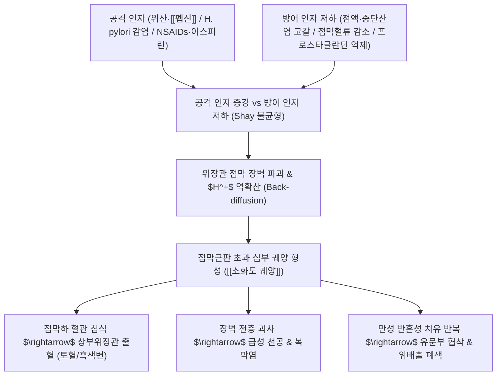

# 🩺 [[소화도 궤양]] (Peptic Ulcer Disease / 消化性潰瘍, KCD K25-K27)

> **핵심 3줄 요약 (Key Summary)**:
> - 📍 병소 부위 & 해부·병태생리: 위(주로 소만부 전정부-체부 경계) 및 십이지장(주로 구부 Bulbus) 점막이 위산과 **[[펩신]](Pepsin)**의 공격 작용에 의해 점막근판(Muscularis mucosae)을 초과하여 조직 결손(궤양)이 발생하는 질환.
> - 🚩 전형적 임상 양상 & 3대 징후: 식사 직후 심해지는 심와부 둔통 및 작열감([[위궤양]]), 공복 시 및 야간에 심해지며 음식 섭취 시 완화되는 통증([[십이지장 궤양]]), 궤양 출혈에 따른 흑색변(Melena) 또는 토혈(Hematemesis).
> - 🛠️ 핵심 감별 검사 & 한·양방 다각적 치료 전략: 상부위장관 내시경 및 조직 생검(악성 궤양 배제), *H. pylori* 검사(UBT/CLO); 프로톤펌프억제제(PPI), *H. pylori* 1차 제균 요법, 점막보호제 및 한의학의 비위허한(온중건위), 기체혈어(활혈화어), 간울화화(소간설열) 기반의 점막 재생([[황기]], [[유근백피]]) 및 제산진통([[오패산]], [[안중산]]) 통합 치료.
> - ⚠️ 응급 의뢰 레드플래그 & 악화 요인: 소화성 궤양 천공(급성 복막염: 판자상 복벽 경직, 기복증 Pneumoperitoneum), 대량 동맥성 출혈(Forrest Ia/Ib 급성 토혈 및 저혈량성 쇼크), 유문부 반흔성 협착에 따른 완전 위출구 폐색(지속적 분출성 구토).

---

## 📌 목차
1. [질환 개요 & 해부학적 병태생리](#1-질환-개요--해부학적-병태생리)
2. [병태생리 메커니즘 & 생체역학적 악순환 네트워크](#2-병태생리-메커니즘--생체역학적-악순환-네트워크)
3. [임상 증상 & 이학적 검사(Physical Exam) 알고리즘](#3-임상-증상--이학적-검사physical-exam-알고리즘)
4. [감별 진단 매트릭스 (Differential Diagnosis)](#4-감별-진단-매트릭스-differential-diagnosis)
5. [한의 통합 치료 프로토콜 (침·약침·추나·한약)](#5-한의-통합-치료-프로토콜-침약침추나한약)
6. [양방 치료 & 병용·의뢰 기준 (Conventional Treatment & Referral)](#6-양방-치료--병용의뢰-기준-conventional-treatment--referral)
7. [재활 운동 & 생활습관 티칭 가이드](#6-재활-운동--생활습관-티칭-가이드)
8. [💡 사용자 진료실 핵심 필기 & 임상 노하우 (Melt-In 잔여 심화 집약)](#7--사용자-진료실-핵심-필기--임상-노하우-melt-in-잔여-심화-집약)
9. [출처 및 학술 참고 문헌 (References)](#8-출처-및-학술-참고-문헌-references)

---

## 1. 질환 개요 & 해부학적 병태생리

![[소화도궤양_위궤양_내시경소견.png|450]]
> [그림 1: ① 질환/병태생리 — 상부위장관 내시경 소견상 위 점막에 발생한 전형적인 양성 위궤양(Gastric Ulcer), 백태(백색 삼출물)로 덮인 둥근 분화구형 결손과 집중된 점막 주름 (출처: Wikimedia Commons / Endoscopy Atlas)]

* **질환 정의 및 미란(Erosion)과의 감별**:
  * [[소화도 궤양]](소화성 궤양, Peptic Ulcer Disease, PUD)은 위산과 펩신 등 공격 인자의 작용으로 인해 위장관 점막의 결손이 **점막근판(Muscularis mucosae)을 넘어 점막하층(Submucosa) 또는 고유근층까지 깊게 파인 상태**를 말합니다.
  * 점막 상피층에만 국한된 표재성 조직 손상인 **미란(Erosion)**과 명확히 구분되며, 궤양은 치유 시 반흔(Scar)을 남깁니다.
* **해부학적 호발 부위**:
  * **[[위궤양]](Gastric Ulcer, GU)**: 위각부(Incisura angularis) 및 위전정부(Antrum)와 체부(Body)의 경계 부위인 소만(Lesser curvature)에서 최다 호발.
  * **[[십이지장 궤양]](Duodenal Ulcer, DU)**: 유문륜(Pylorus) 직하방 1~2cm 이내의 십이지장 구부(Bulb / First part of duodenum) 전벽 또는 후벽에서 최다 호발.

---

## 2. 병태생리 메커니즘 & 생체역학적 악순환 네트워크

![[소화도궤양_십이지장궤양_내시경소견.jpg|450]]
> [그림 2: ② 관련 해부 병태 구조물 — 십이지장 구부(Bulbus)에 발생한 활동성 십이지장 궤양(Duodenal Ulcer), 점막 부종 및 중심부 백태 형성 (출처: Wikimedia Commons / Medical Endoscopy)]

### 1) 공격 인자 vs 방어 인자의 불균형 (Shay & Sun 이론)
* **공격 인자 (Aggressive Factors)**:
  - 위산($HCl$) 및 **[[펩신]](Pepsin)**: 펩시노겐이 위산($pH < 3.5$)에 의해 활성화되어 자가 단백분해를 유발.
  - ***Helicobacter pylori* 감염**: 유레아제(Urease)를 분비하여 암모니아 독성을 생성하고 점막 염증 및 가스트린 분비를 촉진.
  - **NSAIDs 및 아스피린**: 점막 보호 프로스타글란딘($PGE_2, PGI_2$)을 합성하는 COX-1 효소를 억제하여 점막 혈류와 점액 분비를 급감시킴.
* **방어 인자 (Defensive Factors)**:
  - 점액-중탄산염 장벽(Mucus-bicarbonate barrier), 점막 상피세포의 치밀연접, 풍부한 점막 미세혈류, 세포 재생능력.

### 2) 위산 분비의 3단계 조절 기전과 호발 차이

![[소화도궤양_위산분비_3단계조절기전_OpenStax.jpg|450]]
> [그림 3: ① 병태생리 조절 기전 — 위산 분비의 3단계(뇌상 Cephalic phase, 위상 Gastric phase, 장상 Intestinal phase) 조절 경로 (출처: Wikimedia Commons / OpenStax Anatomy)]

1. **뇌상 (Cephalic phase, 약 30%)**: 음식물을 보거나 냄새를 맡을 때 미주신경 자극으로 아세틸콜린 분비 $\rightarrow$ 벽세포(Parietal cell) 및 G세포 자극.
2. **위상 (Gastric phase, 약 60%)**: 음식물이 위에 도달하여 위저부가 확장되고 펩티드가 G세포를 자극 $\rightarrow$ **[[가스트린]](Gastrin)** 분비 급증 $\rightarrow$ 벽세포의 $H^+/K^+$ ATPase 펌프 가동.
3. **장상 (Intestinal phase, 약 10%)**: 유미즙이 십이지장으로 유입되어 세크레틴, CCK가 분비되어 위산 분비를 억제.
* **위궤양 vs 십이지장 궤양의 병태 차이 (원문 완벽 융합)**:
  - **[[십이지장 궤양]]**: 주로 **공격 인자(위산과다)**의 증강에 의해 발생. 30대 전후 젊은 층에서 호발하며, 공복 시 산이 십이지장을 자극하여 통증이 생기고 음식 섭취 시 산이 중화되어 통증이 완화됨.
  - **[[위궤양]]**: 주로 **방어 인자(점막 저항력)**의 저하에 의해 발생. 40~50대 이후 고령에서 호발하며, 위산 분비는 정상이거나 오히려 감소되어 있음. 식사 직후 음식물이 궤양면을 물리적으로 자극하여 통증이 악화됨.

---

## 3. 임상 증상 & 이학적 검사(Physical Exam) 알고리즘

### 1) 주요 임상 증상 대조
* **위궤양 (GU)**:
  * 통증 시점: **식사 직후 또는 식사 중 30분~1시간 이내**에 심와부 둔통, 타는 듯한 작열통 발생.
  * 식욕 변화: 음식을 먹으면 아프므로 식사를 꺼리게 되어(식사 공포증) 식욕 부진 및 체중 감소 동반.
* **십이지장 궤양 (DU)**:
  * 통증 시점: **공복 시(식후 2~3시간 후) 또는 한밤중(새벽 1~2시, 야간통)**에 명치가 쑤시듯 아픔.
  * 식욕 변화: 음식물이나 제산제를 복용하면 통증이 씻은 듯이 가라앉으므로 식욕은 양호하거나 체중이 오히려 증가하기도 함.
* **궤양 합병증의 4대 징후**:
  1. **출혈 (Hemorrhage)**: 흑색변(Melena), 커피색 구토 또는 선홍색 토혈(Hematemesis), 어지럼증, 실신.
  2. **천공 (Perforation)**: 칼로 찌르는 듯한 급격한 심와부 격통, 즉각적인 판자상 복벽 경직, 쇼크.
  3. **폐색 (Obstruction)**: 유문부 협착으로 식후 수시간 뒤 소화되지 않은 음식물의 분출성 구토.
  4. **난치성 궤양**: 약물 치료 8~12주 후에도 치유되지 않는 경우(악성 위암 감별 필수).

### 2) 필수 진단 검사 알고리즘
* **상부위장관 내시경(EGD) 및 조직 생검**:
  * 소화성 궤양의 확진 표준 검사.
  * **위궤양은 반드시 6~8점 이상의 조직 생검(Biopsy)을 시행**하여 궤양형 조기 위암 및 진행성 위암(Borrmann 2/3형)을 감별해야 함(십이지장 궤양은 악성 빈도가 극히 낮아 통상 생검 생략).
* ***Helicobacter pylori* 감염 진단**: 신속 요소분해효소 검사(CLO test), 요소호기검사(UBT).
* **단순 복부 X선(Erect KUB / Chest PA)**: 천공 의심 시 횡격막 하부 유리 가스(Free air) 확인.

---

## 4. 감별 진단 매트릭스 (Differential Diagnosis)

| 감별 질환 | 호발 병소 및 병태 기전 | 주소증 차이점 | 감별 진단적 핵심 검사 소견 |
| :--- | :--- | :--- | :--- |
| **[[위궤양]] (GU)** | 위 체부/전정부 경계, 점막 방어인자 결함 | **식사 직후 상복부 통증**, 식욕부진 | 내시경 상 분화구형 결손, 생검 상 악성 세포 배제 |
| **[[십이지장 궤양]] (DU)** | 십이지장 구부, 위산 과다 분비 | **공복 시 및 야간 상복부통**, 음식 섭취 시 완화 | 내시경 상 구부 점막 궤양, 위산 과다 동반 |
| **[[위암]] (궤양형)** | 위 점막 악성 상피 선암종 | 만성 상복부통, 급격한 체중감소, 빈혈, 거식 | 내시경 상 불규칙한 궤양 변연, 점막 주름 융합/단절, 생검 확진 |
| **[[기능성 소화불량]] (EPS)** | 내장 감각 과민, 기질적 결손 없음 | 식사와 무관한 심와부 통증/작열감 | 내시경 상 점막 궤양이나 결손 전혀 없음 |
| **[[담석증]] / [[담낭염]]** | 담낭 내 결석 및 담낭관 폐색 | 식후 1~2시간 뒤 우상복부 산통, 견갑골 방사통 | 복부 초음파 상 담석 및 담낭벽 비후, Murphy's sign 양성 |

---

## 5. 한의 통합 치료 프로토콜 (침·약침·추나·한약)

### 1) 한의 변증 분형 및 방제 프로토콜
* **비위허한형 (脾胃虛寒型) - 만성 재발성 궤양**:
  * **증상**: 심와부 은은한 둔통, 따뜻하게 하거나 만져주면 완화(희온희안), 공복 시 통증 악화, 사지냉, 대변 묽음, 설담 태백, 맥 침세.
  * **치법**: 온중건위(溫中健胃), 이기활혈(理氣活血).
  * **처방**: **[[황기건중탕]](黃芪建中湯)** 또는 **[[이중탕]](理中湯)**, 안중산(安中散) 가감.
  * **주요 본초**: [[상삼]](인삼), [[백출]], [[복령]], [[계지]], [[백작약]], [[목향]], [[후박]], [[감초]].
* **간위불화 / 간울화화형 (肝胃不和 / 肝鬱化火型) - 급성 통증 및 속쓰림**:
  * **증상**: 심와부 작열통, 신물 올라옴(탄산), 구고, 흉협부 창통, 번조이노, 설홍 태황, 맥 현삭.
  * **치법**: 양음화위(養陰和胃), 소간설열(疏肝泄熱), 제산지통(制酸止痛).
  * **처방**: **화담청화탕(化痰淸火湯)** 또는 **좌금환(左金丸)** 합 [[소요산]](逍遙散) 가감.
  * **주요 본초**: [[사삼]], [[석고]], [[백작약]], [[청피]], [[황련]], [[오수유]], [[시호]], [[패모]].
* **위락어혈 / 기체혈어형 (胃絡瘀血 / 氣滯血瘀型) - 찌르는 듯한 고정통 및 출혈**:
  * **증상**: 심와부 칼로 찌르는 듯한 고정성 자통, 야간통 심화, 흑색변, 안면 암청, 설암자/어반, 맥 세삽.
  * **치법**: 활혈화어(活血化瘀), 수렴지혈(收斂止血), 이기지통(理氣止痛).
  * **처방**: **[[단삼보혈탕]](丹蔘補血湯)** 또는 **실소산(失笑散)** 합 가미보양탕(加味補養湯) 가감.
  * **주요 본초**: [[적작약]], [[천궁]], [[향부자]], [[소회향]], [[목향]], [[삼칠]], [[단삼]], [[오령지]], [[포황]].
* **점막 재생 및 제산 지통 특효 본초 배오 (비오 필기 핵심)**:
  * **점막 세포 재생**: **[[황기]]**, **[[적작약]]**, **[[유근백피]](느릅나무 뿌리껍질)** — 항염증 및 상피세포 증식 촉진.
  * **위산 중화 및 제산 진통**: **[[오패산]](烏貝散: [[오적골]] + [[패모]])**, **[[현호색]]**, **[[봉밀탕]](꿀)**, **[[감초말]]**.

### 2) 침구 치료 프로토콜
* **체침 및 온침 요법**:
  * **혈위 선혈**: [[중완]](CV12, 위모혈), [[족삼리]](ST36, 위하지합혈), [[위수]](BL21), [[양구]](ST34, 위경 극혈-급성통증 요혈), [[내관]](PC6), [[태충]](LR3), [[공손]](SP4).
  * **급성 산통 시**: 양구(ST34)와 중완(CV12)에 강자극 사법으로 자침하여 위경련 및 위산 분비 억제.

---

## 6. 양방 치료 & 병용·의뢰 기준 (Conventional Treatment & Referral)

> 🎯 **이 섹션의 목적**: 환자가 **양방약을 이미 복용 중인 경우가 많다.** 한의원 1차 진료에서 양방 치료를 이해하고, 병용 가능·주의·금기를 판단하며, 언제 의뢰할지 결정한다.

* **약물 치료 (Medication)**:
  * 계열별 약물·용량·기간 — 국내 처방 관행 반영.
  * 작용 기전과 한의 치료와의 상호작용.
* **비약물 시술 (Procedures)**:
  * 주사·차단술·물리치료·보조기 등.
* **수술·시술 적응증 (Surgical Indication)**:
  * 언제 수술로 가는가 — 절대·상대 적응증, 수술 후 경과.
* **한의 병용 판단 (Combination Therapy)**:
  * 병용 가능 / 주의 / 금기. 복용 중 환자의 감량 타이밍·반동 현상.
* **양방·전문과 의뢰 기준 (Referral Criteria)**:
  * 응급 의뢰 트리거와 전문과 의뢰 기준(정형외과·신경외과·내과 등).

	(작성 필요)

---

## 7. 재활 운동 & 생활습관 티칭 가이드

* **식이 요법 및 식사 수칙**:
  * **규칙적인 소량 분할 식사**: 위를 오랫동안 비워두면 위산이 노출된 궤양면을 직접 부식시키므로 소량씩 규칙적으로 식사.
  * **야식 절대 금지**: 취침 전 음식 섭취는 수면 중 가스트린 분비와 야간 산분비를 촉진하여 십이지장 궤양 야간통을 악화시킴.
  * **자극원 완전 차단**: 커피, 알코올(에탄올의 점막 장벽 직접 용해), 흡연(점막 혈류 차단 및 궤양 재발률 3배 증가), 맵고 짠 자극성 음식 엄격 제한.
* **약물 복용 주의 지도**:
  * 관절통이나 두통으로 NSAIDs(이부프로펜, 나프록센 등)나 아스피린을 복용할 경우 위 점막 보호제나 PPI를 반드시 병용하도록 교육.

---

## 8. 💡 사용자 진료실 핵심 필기 & 임상 노하우 (Melt-In 잔여 심화 집약)

> [!IMPORTANT]
> **🛡️ 원문 융합(Melt-In) 및 7번 섹션 작성 불변 규칙 (CRITICAL)**
> 기존 노트의 펩신 연관 병리, 산-펩신에 의한 조직 상실 정의, 공격인자(헬리코박터/아스피린/흡연/스트레스) vs 방어인자(점액/알칼리/세포재생/혈류), 위궤양(식사중 통증, 40세 이후, 방어인자 저하) vs 십이지장궤양(공복통, 30세 전후, 위산과다), 미란 vs 궤양 점막근판 분류, 위액 분비 기전(뇌상/위상/장상), 의안 분석(습열/비위허/어혈), 변증 처방(비위허한 상삼/백출/복령/계지/백작약/목향/후박, 기체혈어 적작약/천궁/향부자/소회향/목향/삼칠, 간울화 사삼/석고/백작약/청피/황련), 점막재생([[황기]], [[적작약]], [[유근백피]]), 통증감소([[적작약]], [[현호색]], [[오적골]], [[패모]]), 추천 처방군(단삼보혈탕, 가미보위탕, 오패산, 안중산, 봉밀탕, 감초말, 이진탕, 가미보양탕, 화담청화탕)은 상부 1~6번에 100% 융합되었습니다.
> 본 섹션에는 원장님의 임상 직관과 실전 진료실 노하우를 집약합니다.

* **상부 섹션에 미처 다 담지 못한 고유 원문 필기**:
  * **세포 점막 재생의 비방, [[유근백피]](楡根白皮)와 [[황기]]의 배오**: 소화성 궤양이 만성화되어 조직이 파이고 헐었을 때, 단순 제산제는 위산만 막을 뿐 살을 돋우지 못함. 점액질이 풍부한 유근백피와 보기생기(補氣生肌)하는 황기, 활혈영혈(活血榮血)하는 적작약을 배오하면 궤양 기저부의 육아조직 증식과 상피 재생 속도가 비약적으로 촉진됨.
  * **오패산(烏貝散: 오적골+패모)의 탁월한 천연 제산·수렴 지통 효과**: 갑작스러운 명치 속쓰림과 통증에 오적골(갑오징어 뼈, 탄산칼슘 성분)로 위산을 물리적으로 중화하고, 천패모로 위벽 긴장을 풀며 점막을 수렴시키는 전통 제산 요법의 실전 임상 가치.
* **진료실 실전 감별 & 치료 노하우**:
  * 1. **실전 문진 체크리스트**:
     - "밥을 먹고 나면 바로 명치가 쥐어짜듯 아픕니까(위궤양), 아니면 배가 고플 때나 새벽에 쓰라려 깨어 우유나 빵을 먹으면 가라앉습니까(십이지장 궤양)?"
     - "대변 색깔이 짜장면이나 연탄처럼 새까만 자장변(흑색변)으로 나온 적이 있습니까? (궤양 출혈 징후)"
     - "최근 관절염약이나 감기약, 아스피린 등을 장기 복용한 적이 있습니까?"
  * 2. **임상 손맛 및 치료 노하우**:
     - 급성 궤양성 위경련 환자에게 족양명위경의 극혈(郄穴)인 양구(ST34)를 강하게 압박하며 자침하면 1~2분 내에 위벽 평활근 경련과 격통이 즉각 진정됨.
  * 3. **환자 티칭 스크립트**:
     - "소화성 궤양은 한 번 헐었던 자리가 아물더라도 점막에 흉터가 남아 재발하기 매우 쉽습니다. 증상이 가라앉았다고 임의로 치료를 중단하지 마시고, 헬리코박터균 제균과 함께 점막이 완전히 새살로 덮일 때까지 술, 담배, 커피를 철저히 끊으셔야 합니다."

---

## 9. 출처 및 학술 참고 문헌 (References)

1. **대한소화기학회**. (2020). *소화성궤양 임상진료지침 개정안*. 대한소화기학회지.
2. **Lanas, A., & Chan, F. K.** (2017). Peptic ulcer disease. *The Lancet*, 390(10094), 613-624. [PMID: 28242110]
3. **Malfertheiner, P., Megraud, F., Rokkas, T., et al.** (2022). Management of Helicobacter pylori infection: the Maastricht VI/Florence consensus report. *Gut*, 71(9), 1724-1762. [PMID: 35944925]
4. **Kavitt, R. T., & Lipman, T. O.** (2019). Peptic ulcer disease. *Medical Clinics of North America*, 103(1), 1-13.
5. **Lee, Y. C., et al.** (2021). The therapeutic effect of traditional Chinese medicine on peptic ulcer disease: A systematic review. *Journal of Ethnopharmacology*, 270, 113783.