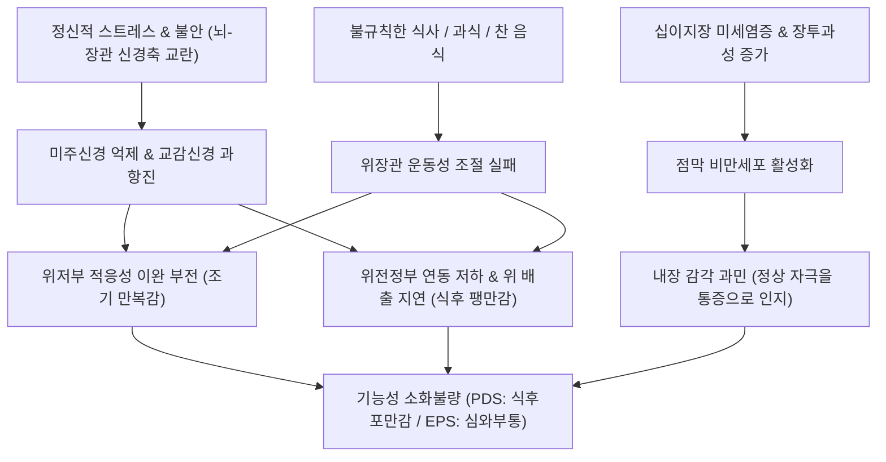
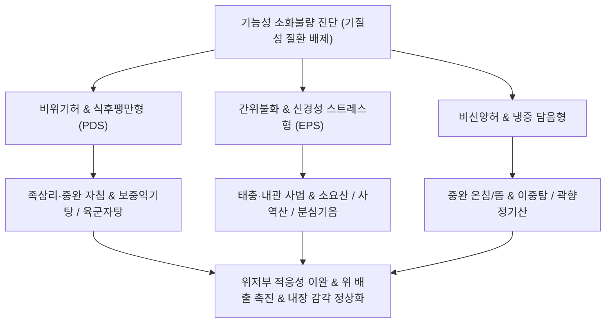

# 소화불량 (Functional Dyspepsia, FD / 消化不良, K30)

> **상위 분류**: [[소화기 질환]] > [[상부위장관 질환]] > [[기능성 위장 장애]]
> **핵심 3줄 요약 (Key Summary)**:
> - 📍 병소 부위 & 해부·병태생리: 상부 위장관(위저부, 위전정부, 십이지장 근위부)의 기질적 이상(궤양, 암, 염증) 없이 발생하는 복합 운동성·감각성 기능 장애. 위저부의 적응성 수용 이완(Accommodation) 부전, 위 배출 지연(Delayed gastric emptying), 위십이지장 점막의 내장 감각 과민(Visceral hypersensitivity) 및 뇌-장관 신경축(Brain-Gut Axis) 조절 장애에 기인함.
> - 🚩 전형적 임상 양상 & 3대 징후: 로마 기준 IV(Rome IV)에 따른 2대 대표 아형: 1) 식후포만감 증후군(PDS: 조금만 먹어도 꽉 차는 조기 만복감, 식후 불쾌한 팽만감), 2) 심와부통증 증후군(EPS: 식사와 무관하게 발생하는 명치 부위 둔통 및 작열감).
> - 🛠️ 핵심 감별 검사 & 한·양방 다각적 치료 전략: 상부위장관 내시경(EGD, 기질성 질환 배제 필수), 위장관 운동촉진제 및 신경조절제 투여, 중완(CV12)·족삼리(ST36)·내관(PC6)·태충(LR3) 자침 및 소염/봉약침, [[반하사심탕]], [[육군자탕]], [[평위산]], [[소요산]] 처방.
> - ⚠️ 응급 의뢰 레드플래그 & 악화 요인: 40세 이상 첫 발병, 의도치 않은 체중 감소, 진행성 연하곤란, 반복적인 분출성 구토, 위장관 출혈 및 흑색변, 빈혈 등 경고 증상(Alarm signs) 확인 시 즉시 정밀 영상의학 및 종양 선별 검사 의뢰.

---

## 📌 목차
1. [질환 개요 & 해부학적 병태생리](#1-질환-개요--해부학적-병태생리)
2. [병태생리 메커니즘 & 생체역학적 악순환 네트워크](#2-병태생리-메커니즘--생체역학적-악순환-네트워크)
3. [임상 증상 & 이학적 검사(Physical Exam) 알고리즘](#3-임상-증상--이학적-검사physical-exam-알고리즘)
4. [감별 진단 매트릭스 (Differential Diagnosis)](#4-감별-진단-매트릭스-differential-diagnosis)
5. [한의 통합 치료 프로토콜 (침·약침·추나·한약)](#5-한의-통합-치료-프로토콜-침약침추나한약)
6. [양방 치료 & 병용·의뢰 기준 (Conventional Treatment & Referral)](#6-양방-치료--병용의뢰-기준-conventional-treatment--referral)
7. [재활 운동 & 생활습관 티칭 가이드](#6-재활-운동--생활습관-티칭-가이드)
8. [💡 사용자 진료실 핵심 필기 & 임상 노하우 (Melt-In 잔여 심화 집약)](#7--사용자-진료실-핵심-필기--임상-노하우-melt-in-잔여-심화-집약)
9. [출처 및 학술 참고 문헌 (References)](#8-출처-및-학술-참고-문헌-references)

---

## 1. 질환 개요 & 해부학적 병태생리

![[위 기능성 소화불량(소화와 흡수)-20241107085056081.jpg|500]]
> [그림 1: ① 병태생리·내시경 — 기능성 소화불량증(FD)의 위 전정부 수축능 저하 및 위 배출 지연 병태도해] 내시경 상 궤양이나 종양 등 기질적 병변이 없음에도 위 평활근 연동 부전으로 음식물이 정체되는 양상.

- **개념 정의 및 임상적 의의**:
  - [[소화불량]](Functional Dyspepsia, FD)은 1차 진료 현장에서 가장 흔하게 접하는 위장관 증후군으로, 상부위장관 내시경을 비롯한 일상적 진단 검사에서 궤양, 미란, 종양 등의 기질적 질환이 발견되지 않음에도 불구하고 만성적인 상복부 통증이나 불쾌감이 지속되는 질환이다.
  - 전 세계 인구의 약 10~20%가 이환되어 있으며, 삶의 질을 현저히 저하시키고 만성 피로 및 정서적 불안을 동반한다.
- **해부학적 구조와 신경 지배**:
  - 위장은 크게 음식물을 저장하고 적응성 확장을 담당하는 **근위부(위저부 및 위체부 상부)**와 음식물을 분쇄하고 유문부로 밀어내는 연동 운동을 담당하는 **원위부(위전정부 및 유문부)**로 나뉜다.
  - 미주신경(Parasympathetic)과 내장신경(Sympathetic), 그리고 위벽 내 아우어바흐 근층간신경총(Auerbach's myenteric plexus)의 정밀한 삼각 조절망에 의해 수축과 이완이 조절된다.

---

## 2. 병태생리 메커니즘 & 생체역학적 악순환 네트워크

![[위 기능성 소화불량(소화와 흡수)-20241107085512416.jpg|500]]
> [그림 2: ② 관련 해부 구조물 — 위저부 적응성 이완(Gastric Accommodation) 장애 및 미주신경-내장 감각 과민 네트워크] 음식물 진입 시 근위부 위의 수용성 이완 부전으로 인한 위 내압 상승 기전.

### 1) 위저부 적응성 이완 장애 (Impaired Gastric Accommodation)
- 정상적으로는 음식물이 식도를 거쳐 위로 들어오면 미주신경 반사에 의해 위저부 평활근이 이완되어 위 내압의 상승 없이 음식물을 저장(Receptive relaxation)한다.
- FD 환자의 약 40%는 이 적응성 이완이 일어나지 않아 적은 양의 식사만으로도 위벽 내압이 급격히 치솟아 조금만 먹어도 꽉 찬 느낌인 **조기 만복감(Early satiation)**을 느끼게 된다.

### 2) 위 배출 지연 (Delayed Gastric Emptying)
- 환자의 약 30~35%에서 위전정부의 분절 수축력 저하로 음식물이 십이지장으로 제때 배출되지 못하고 정체된다. 이로 인해 식후 수 시간이 지나도 헛배가 부르고 더부룩한 **식후 불쾌한 포만감(Postprandial fullness)**이 지속된다.

### 3) 내장 감각 과민 (Visceral Hypersensitivity)
- 정상인에게는 전혀 느껴지지 않는 생리적 수준의 가스 팽창이나 미세한 위산 자극에 대해서도 위 점막 감각신경(C-fiber)이 비정상적으로 흥분하여 뇌로 통증 신호를 증폭 전달하는 **심와부통증(Epigastric pain)**을 유발한다.

---

## 3. 임상 증상 & 이학적 검사(Physical Exam) 알고리즘

### 1) 로마 기준 IV (Rome IV Criteria) 진단 체계
진단 시점 최소 6개월 전에 증상이 시작되어, 지난 3개월 동안 주 1회 이상 아래 기준을 충족하며 기질적 병변이 배제될 때 진단한다.

| 2대 임상 아형 | 핵심 임상 증상 | 발생 기전 및 특성 |
| :--- | :--- | :--- |
| **1) 식후포만감 증후군 (PDS)** *(Postprandial Distress Syndrome)* | • 식후 불쾌한 포만감 (주 3일 이상) • 조기 만복감 (정상 식사를 다 못 마침, 주 3일 이상) | 위 배출 지연, 위저부 적응성 이완 부전. 식사 후 증상이 뚜렷하게 격발·악화됨. |
| **2) 심와부통증 증후군 (EPS)** *(Epigastric Pain Syndrome)* | • 상복부(명치)의 찌르는 통증 (주 1일 이상) • 명치 부위의 타는 듯한 작열감 (주 1일 이상) | 내장 감각 과민, 십이지장 미세 염증. 식사와 무관하게 공복에도 발생 가능. |

### 2) 이학적 진찰 및 복부 촉진법
- **심하비경(心下痞硬) 촉진**: 명치 끝(거궐, 중완 부위)을 가볍게 눌렀을 때 복벽의 묵직한 저항감이나 가스 팽만음(Tympanitic sound) 확인.
- **복부 연급(攣急) 평가**: 양측 복직근의 긴장도와 배꼽 주변의 냉감(Abdominal coldness) 확인.
- **경고 증상(Alarm Features) 배제**:
  - 40세 이상 고령, 삼킴 곤란(Dysphagia), 구토 지속, 체중 감소, 빈혈, 흑색변 유무를 반드시 확인하여 조기 위암 및 궤양을 즉시 배제.

---

## 4. 감별 진단 매트릭스 (Differential Diagnosis)

| 질환명 | 주 증상 및 특징 | 호발 및 유발 인자 | 감별 핵심 검사 |
| :--- | :--- | :--- | :--- |
| **[[소화불량]] (FD)** | 식후 팽만감, 조기 만복감, 명치통 | 기질적 병변 없음, 스트레스 악화 | 상부위장관 내시경 정상 |
| **[[위궤양]]** | 식후 30분~1시간 명치 둔통, 오심 | 점막 결손, H. pylori, NSAIDs | EGD 상 점막 궤양 확인 |
| **[[십이지장 궤양]]** | 공복통, 야간통, 음식 섭취 시 완화 | 위산 과다, 십이지장 구부 변형 | EGD 상 구부 궤양 확인 |
| **위식도 역류질환([[식도염]])** | 흉골 뒤 작열감, 신트림, 앙와위 악화 | 하부식도괄약근 부전 | 식도 내시경, 24시간 산도 |
| **담도계 질환 (담석증)** | 우상복부 산통(Biliary colic), 방사통 | 기름진 식사 후 우상복부 격통 | 복부 초음파(US), Murphy sign |
| **공기연하증 (Aerophagia)** | 지속적인 트림, 식사 중 공기 삼킴 | 불안장애, 빠른 식사 습관 | 복부 단순 X-ray 상 위 내 거대 공기 |

---

## 5. 한의 통합 치료 프로토콜 (침·약침·추나·한약)

![[청강의감11_07_조잡_소화불량_이미지.png|500]]
> [그림 3: ③ 치료·시술점 — 조잡(嘈雜)·비만(痞滿)의 한의학적 기전 및 중완(CV12)·족삼리(ST36) 침구 치료점] 명치 밑의 기체(氣滯)와 담음(痰飲)을 소통시키고 비위 운화 기능을 회복하는 핵심 혈위.

한의학에서 소화불량은 비만(痞滿), 조잡(嘈雜), 위완통(胃脘痛), 애기(噯氣, 트림), 악심(惡心)의 범주에 속하며, 비위기허(脾胃氣虛), 간위불화(肝胃不和), 한열착잡(寒熱錯雜), 음식상(飮食傷/식적)으로 변증한다.

### 1) 침구 치료
- **사암 침법 및 복모혈**:
  - 중완(CV12): 위의 복모혈로서 위 유문부와 전정부의 연동 운동성을 물리적으로 촉진.
  - 하완(CV10), 기해(CV6): 중초(中焦)의 기운을 보하고 소장으로의 음식물 배출을 유도.
  - 족삼리(ST36): 위경의 합혈로서 미주신경-미토콘드리아 축을 활성화하여 소화 효소 분비 및 위 평활근 수축력 증대.
  - 내관(PC6), 공손(SP4): 심포경과 비경의 팔맥교회혈로서 뇌-장관 신경축을 안정시켜 오심, 명치 답답함, 조기 만복감 즉각 해소.
  - 태충(LR3): 스트레스로 인한 간기울결을 풀고 위 평활근 경련 이완.

### 2) 약침 요법
- **중성어혈약침 및 황련해독탕 약침**: 심와부 압통이 뚜렷한 EPS형 환자의 중완(CV12) 및 거궐(CV14)에 0.3 cc 주입하여 상복부 신경 감각 과민 완화.
- **자하거 약침 (Placenta)**: 만성 비위허약으로 식욕이 전무하고 수척해진 PDS형 환자의 족삼리(ST36)와 비수(BL20)에 격일 시술하여 소화관 점막 영양 및 전신 기력 회복.

### 3) 한약물 요법
- **비위기허(脾胃氣虛)형 (PDS 대표 처방)**: [[육군자탕]](六君子湯) 또는 [[보중익기탕]](補中益氣湯)을 투여하여 그렐린(Ghrelin) 분비를 촉진하고 위 배출능 증진.
- **간위불화(肝胃不和)형 (신경성 소화불량, EPS형)**: [[소요산]](逍遙散) 또는 시호소간탕(柴胡疎肝湯)에 [[용안육]](龍眼肉), 향부자(香附子)를 가미하여 자율신경 실조를 해소하고 스트레스성 위장 경련 차단.
- **한열착잡(寒熱錯雜)형 (명치 답답함 및 트림 다발)**: [[반하사심탕]](半夏瀉心湯)을 처방하여 황련의 소염 작용과 반하·건강의 강역(降逆) 온비 작용으로 심하비경 해소.
- **식적상(食積傷) 및 급만성 체기**: [[평위산]](平胃散) 또는 내소산(內消散)에 산사, 신곡, 맥아를 가미하여 소화 효소 활성화.

---

## 6. 양방 치료 & 병용·의뢰 기준 (Conventional Treatment & Referral)

> 🎯 **이 섹션의 목적**: 환자가 **양방약을 이미 복용 중인 경우가 많다.** 한의원 1차 진료에서 양방 치료를 이해하고, 병용 가능·주의·금기를 판단하며, 언제 의뢰할지 결정한다.

* **약물 치료 (Medication)**:
  * 계열별 약물·용량·기간 — 국내 처방 관행 반영.
  * 작용 기전과 한의 치료와의 상호작용.
* **비약물 시술 (Procedures)**:
  * 주사·차단술·물리치료·보조기 등.
* **수술·시술 적응증 (Surgical Indication)**:
  * 언제 수술로 가는가 — 절대·상대 적응증, 수술 후 경과.
* **한의 병용 판단 (Combination Therapy)**:
  * 병용 가능 / 주의 / 금기. 복용 중 환자의 감량 타이밍·반동 현상.
* **양방·전문과 의뢰 기준 (Referral Criteria)**:
  * 응급 의뢰 트리거와 전문과 의뢰 기준(정형외과·신경외과·내과 등).

	(작성 필요)

---

## 7. 재활 운동 & 생활습관 티칭 가이드

- **식사 속도 및 저작 티칭**:
  - 한 입에 최소 20~30회 이상 꼭꼭 씹어 침 속의 아밀라아제와 음식물이 충분히 섞이도록 유도.
  - 식사 시간을 최소 20분 이상 유지하여 뇌의 만복 중추가 자연스럽게 작동하도록 교육.
- **식후 가벼운 보행**:
  - 식후 20~30분간 평지를 천천히 산책하면 위장관 평활근의 연동 운동이 촉진되어 위 배출 시간이 유의하게 단축됨.
- **FODMAP 및 가스 유발 식품 제한**:
  - 콩류, 양배추, 브로콜리, 양파, 탄산음료, 유제품 등 장내 가스를 급격히 생성하여 위벽을 팽창시키는 식품 섭취 절제.

---

## 8. 💡 사용자 진료실 핵심 필기 & 임상 노하우 (Melt-In 잔여 심화 집약)

### 1) 진료실 소화불량의 본질과 원문 고유 필기 (정본)
- **1차 진료 현장의 핵심**:
  - "1차 진료 기관에서 가장 많이 접하는 증상이며 기질적 질환을 발견할 수 없음."
  - 기질적 원인과 기능적 원인을 명확히 구분해야 하며, 환자가 호소하는 주증상(식후 포만감, 식후 불쾌감, 상복부 이물감, 상복부 종괴감)의 시간적 패턴을 정밀 추적해야 한다.
- **원문 감별 스펙트럼**:
  - 통증 위주 vs 비궤양성 소화불량증, 가슴쓰림(식도 질환 연계), 음식 불내증(Food intolerance), 공기연하증(Aerophagia), 장내 가스 팽만, 장외 질환(담낭·췌장·갑상선 질환)에 의한 소화불량을 종합적으로 고려해야 한다.

### 2) 신경성 소화불량 환자의 원문 맞춤 처방 비결
- **신경성 소화불량 3대 처방 조합 (원문 필기 보존)**:
  1. [[소요산]](逍遙散): 사소한 일에 신경을 쓰면 체하고 소화가 안 되는 간비불화(肝脾不和) 환자의 1차 선택제.
  2. [[곽향정기산]](藿香正氣散): 위장이 차갑고 여름철 냉방이나 찬 음식 섭취 후 명치가 꽉 막히며 헛구역질을 하는 환자에게 적용.
  3. [[용안육]](龍眼肉) 가감 및 귀비탕: 불안, 불면, 가슴 두근거림과 함께 음식을 보면 먹고 싶은 생각이 안 드는 사려상비(思慮傷脾) 환자에게 용안육 8~12g을 군약으로 배오하여 심비(心脾)를 동시 보익.
- **소증(素證) 맞춤 가감**:
  - 환자의 체질과 평소 증상(대변 묽음 vs 변비, 한열 편차)에 맞추어 향부자, 사인, 백두구의 방향화습(芳香化濕) 약재를 정밀 가감한다.

---

## 9. 출처 및 학술 참고 문헌 (References)

1. Ford AC, Mahadeva S, Carbone MF et al. (2020). Functional dyspepsia. *Lancet*, 396(10263):1689-1702. [PMID: 33220737](https://pubmed.ncbi.nlm.nih.gov/33220737/)
   - [연구 요약]: 기능성 소화불량증의 글로벌 역학, 십이지장 면역 활성화 및 장-뇌 신경축 조절 장애의 병태생리, 단계별 진단 및 치료 알고리즘을 종합 집대성한 란셋 리뷰.
2. Enck P, Azpiroz F, Boeckxstaens G et al. (2017). Functional dyspepsia. *Nat Rev Dis Primers*, 3:17081. [PMID: 29094986](https://pubmed.ncbi.nlm.nih.gov/29094986/)
   - [연구 요약]: 기능성 소화불량의 위저부 적응성 이완 장애, 위 배출 지연, 내장 감각 과민 메커니즘과 중추신경계의 통증 처리 회로 이상을 규명한 네이처 리뷰.
3. Zhou W, Liang R, Zhou J et al. (2020). Acupuncture for functional dyspepsia: A systematic review and meta-analysis of randomized controlled trials. *Medicine (Baltimore)*, 99(50):e23588. [PMID: 33327318](https://pubmed.ncbi.nlm.nih.gov/33327318/)
   - [연구 요약]: 기능성 소화불량 환자에서 중완(CV12), 족삼리(ST36) 중심의 침 치료가 위 배출능 개선, 식후 팽만감 및 조기 만복감 완화, 삶의 질 점수(NDI) 향상에 미치는 임상적 유효성을 입증한 메타분석.