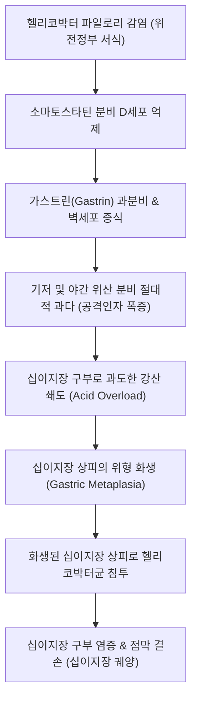
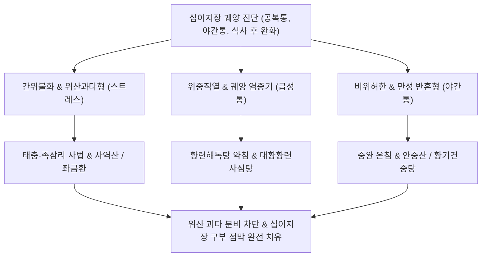

# 십이지장 궤양 (Duodenal Ulcer, DU / 十二指腸潰瘍, K26)

> **상위 분류**: [[소화기 질환]] > [[상부위장관 질환]] > [[소화성 궤양]]
> **핵심 3줄 요약 (Key Summary)**:
> - 📍 병소 부위 & 해부·병태생리: 유문륜(Pyloric ring) 직하방 1~2cm 부위인 십이지장 구부(Duodenal bulb)에 호발하는 소화성 궤양. 방어 인자 저하가 위주인 [[위궤양]]과 달리, **공격 인자([[위산]], 펩신)의 절대적 과다 분비**와 환자의 90~95%에서 양성을 보이는 **[[헬리코박터 파일로리]] 감염**이 주된 발병 기전임.
> - 🚩 전형적 임상 양상 & 3대 징후: 식후 2~3시간 뒤 위장이 빌 때 격발되는 상복부 공복통(Hunger pain) 및 한밤중 수면을 방해하는 야간통(Nocturnal pain), 음식물이나 제산제 복용 시 통증의 즉각적 경감, 궤양 악화 시 토혈·흑색변(Melena) 및 유문 협착.
> - 🛠️ 핵심 감별 검사 & 한·양방 다각적 치료 전략: 상부위장관 내시경(EGD)으로 구부 변형 및 활동성 궤양 확인, H. pylori 제균(PPI+아목시실린+클래리스로마이신 삼제요법), 중완(CV12)·양문(ST21)·족삼리(ST36) 자침 및 봉약침, [[안중산]], [[반하사심탕]], [[황련해독탕]] 투여.
> - ⚠️ 응급 의뢰 레드플래그 & 악화 요인: 십이지장 전벽 천공으로 인한 급성 복막염(판자상 복벽 강직, X-ray상 횡격막하 유리 가스), 십이지장 후벽 궤양의 위십이지장동맥(Gastroduodenal a.) 침식에 따른 대량 출혈(저혈압 쇼크) 시 즉시 응급 수술 의뢰.

---

## 📌 목차
1. [질환 개요 & 해부학적 병태생리](#1-질환-개요--해부학적-병태생리)
2. [병태생리 메커니즘 & 생체역학적 악순환 네트워크](#2-병태생리-메커니즘--생체역학적-악순환-네트워크)
3. [임상 증상 & 이학적 검사(Physical Exam) 알고리즘](#3-임상-증상--이학적-검사physical-exam-알고리즘)
4. [감별 진단 매트릭스 (Differential Diagnosis)](#4-감별-진단-매트릭스-differential-diagnosis)
5. [한의 통합 치료 프로토콜 (침·약침·추나·한약)](#5-한의-통합-치료-프로토콜-침약침추나한약)
6. [양방 치료 & 병용·의뢰 기준 (Conventional Treatment & Referral)](#6-양방-치료--병용의뢰-기준-conventional-treatment--referral)
7. [재활 운동 & 생활습관 티칭 가이드](#6-재활-운동--생활습관-티칭-가이드)
8. [💡 사용자 진료실 핵심 필기 & 임상 노하우 (Melt-In 잔여 심화 집약)](#7--사용자-진료실-핵심-필기--임상-노하우-melt-in-잔여-심화-집약)
9. [출처 및 학술 참고 문헌 (References)](#8-출처-및-학술-참고-문헌-references)

---

## 1. 질환 개요 & 해부학적 병태생리

![[소화도 궤양-20240530204013096.png|500]]
> [그림 1: ① 병태생리·내시경 — 소화성 궤양의 점막층 결손 및 십이지장 구부(Duodenal bulb) 궤양 병태도해] 점막근판을 침범하여 점막하층까지 파괴된 소화성 궤양 결손과 구부 변형 병태.

- **개념 정의 및 임상적 의의**:
  - [[십이지장 궤양]](Duodenal Ulcer, DU)은 위장에서 유문륜(Pylorus)을 거쳐 십이지장으로 유입되는 고농도 강산(위산)과 펩신에 의해 십이지장 점막이 점막근판을 넘어 괴사·탈락되는 소화성 궤양 질환이다.
  - 전 인구의 약 5~10%가 평생 동안 한 번 이상 경험하며, [[위궤양]]보다 호발 연령이 10~20세 젊은 **30~50대 남성**에서 압도적으로 호발한다.
- **해부학적 특성과 호발 부위**:
  - 궤양의 95% 이상이 십이지장의 제1부인 **십이지장 구부(Duodenal bulb, Ampulla)**에서 발생한다.
  - 십이지장 구부는 위장에서 갓 배출된 미중화 강산(pH 1~2)이 최초로 닿는 충격 완충 지대로서, 췌장액과 담즙산의 중탄산염이 분비되는 바터 팽대부(Ampulla of Vater, 제2부)보다 상부에 위치하여 생체역학적으로 산 손상에 가장 취약하다.

---

## 2. 병태생리 메커니즘 & 생체역학적 악순환 네트워크

![[소화 생병리 및 위장약-20241107162018694.jpg|500]]
> [그림 2: ② 관련 해부 구조물 — 십이지장 점막의 브루너선(Brunner's gland) 및 중탄산염 방어 기전과 위산 공격 메커니즘] 산 자극에 대항하는 점막 중탄산염 분비선과 위산 공격인자의 상호작용.

### 1) 공격 인자의 절대적 과다 (위산 과다설)
- [[위궤양]]이 방어 인자 저하에 기인하는 반면, **십이지장 궤양은 공격 인자(위산 분비능)의 절대적 증가**가 핵심이다.
- 십이지장 궤양 환자는 정상인에 비해 위저부 벽세포(Parietal cell)의 수가 1.5~2배 많으며, 미주신경 자극 및 가스트린 자극에 대한 위산 분비 반응성이 비정상적으로 항진되어 있다.

### 2) 헬리코박터 파일로리와 위-십이지장 화생 캐스케이드
- 십이지장 궤양 환자의 **90~95%에서 헬리코박터 파일로리균 감염**이 확인된다.
- 균이 위전정부(Antrum)에 서식하면서 소마토스타틴(Somatostatin)을 분비하는 D세포를 파괴하여, 위산 분비 억제 브레이크가 고장 난다.
- 이로 인해 지속적인 고산증(Hyperchlorhydria)이 발생하고, 십이지장 구부 상피세포가 산에 적응하기 위해 **위형 화생(Gastric metaplasia)**을 일으킨다.
- 헬리코박터균이 이 화생된 십이지장 점막으로 이동해 집락을 형성하면서 점막 파괴성 궤양을 완성한다.

---

## 3. 임상 증상 & 이학적 검사(Physical Exam) 알고리즘

### 1) 주요 임상 증상
- **공복통 및 야간통 (Hunger Pain & Nocturnal Pain)**:
  - 식후 2~3시간 뒤 위장이 비워지고 산만 남아 십이지장으로 넘어갈 때 명치와 배꼽 우상방에서 쓰리고 타는 듯한 통증이 발생한다.
  - **음식물이나 제산제를 섭취하면 음식물이 산을 중화시켜 수 분 내에 통증이 드라마틱하게 소실(Food Relief)**되는 특징을 보인다.
  - 환자의 약 50~80%가 새벽 1~3시경 위산의 일주기성 분비 피크로 인해 잠에서 깨는 야간통을 호소한다.
- **소화기 증상**: 속쓰림, 가슴 작열감, 구역감, 신트림(Acid regurgitation). 식욕은 대개 보존되거나 통증을 완화하기 위해 음식을 자주 먹어 오히려 체중이 증가하기도 한다.

### 2) 특수 이학적 검사 및 3대 치명적 합병증 선별
- **우상복부 압통점**: 배꼽 우측 2~3 cm 지점인 양문(ST21) 및 거궐 부위의 심부 압통.
- **3대 합병증 선별 알고리즘**:
  1. **천공(Perforation)**: 십이지장 전벽 궤양에서 호발. 돌발성 극심한 상복부 통증, 판자상 복벽 경직(Board-like rigidity), 장음 소실. 단순 흉부 X-ray상 횡격막하 유리 가스(Pneumoperitoneum).
  2. **출혈(Hemorrhage)**: 십이지장 후벽 궤양이 위십이지장동맥(Gastroduodenal artery)을 침식할 때 발생. 대량 흑색변(Melena), 토혈, 빈맥, 혈압 강하.
  3. **유문 협착(Obstruction)**: 반복된 궤양 치유와 반흔 수축으로 유문부가 좁아져 식후 수 시간 뒤 썩은 냄새가 나는 위 내용물 분출성 구토.

---

## 4. 감별 진단 매트릭스 (Differential Diagnosis)

| 질환명 | 주 통증 양상 및 식사 관계 | 호발 부위 및 연령 | 감별 핵심 포인트 |
| :--- | :--- | :--- | :--- |
| **[[십이지장 궤양]]** | **공복통, 야간통 (식사 시 완화)** | 십이지장 구부, 30~50대 | 공격인자 과다, H. pylori 95% |
| **[[위궤양]]** | **식후 30분~1시간 통증 악화** | 위소만부, 50~70대 | 방어인자 저하, 식사 시 악화 |
| **위식도 역류질환([[식도염]])** | 흉골 뒤 작열통, 앙와위 악화 | 하부식도괄약근 부전 | 식도 산도 검사, 신물 역류 |
| **만성 담낭염 / 담석증** | 기름진 식사 후 우상복부 산통 | 담낭, 여성·비만 호발 | 초음파상 담석, Murphy sign |
| **급성/만성 췌장염** | 등 쪽으로 방사되는 심한 통증 | 췌장 실질, 알코올성 | 상체 숙일 시 완화, Amylase 상승 |

---

## 5. 한의 통합 치료 프로토콜 (침·약침·추나·한약)

![[소화 생병리 및 위장약-20241107163812486.jpg|500]]
> [그림 3: ③ 치료·시술점 — 소화성 궤양의 약리 작용점 및 한의 침구·약침 복합 치료 경로] 중완(CV12), 양문(ST21), 족삼리(ST36) 자침을 통한 미주신경-장관 신경계 조절 및 위산 과다 억제 경로.

한의학에서 십이지장 궤양은 위완통(胃脘痛), 조잡(嘈雜), 비만(痞滿), 탄산(呑酸)의 범주에 속하며, 간위불화(肝胃不和), 위중적열(胃中積熱), 비위허한(脾胃虛寒), 어혈조락(瘀血阻絡)으로 변증한다.

### 1) 침구 치료
- **국소 혈위**:
  - 중완(CV12): 위의 복모혈로서 상부위장관 평활근 긴장 완화 및 미주신경 긴장 조절.
  - 양문(ST21): 십이지장 구부 투영 부위로 국소 혈류 개선 및 십이지장 경련성 통증 진통.
  - 거궐(CV14), 상완(CV13): 위 분문부 및 유문부의 역류성 긴장 해소.
- **원위 사암 침법 혈위**:
  - 족삼리(ST36), 내관(PC6): 위장 운동성 정상화 및 점막 방어 인자 촉진.
  - 태충(LR3): 간기울결(肝氣鬱結)로 인한 스트레스성 위산 서지 차단.

### 2) 약침 요법
- **황련해독탕 약침**: 중완 및 양문혈에 0.3~0.5 cc 주입하여 급성 궤양부의 화열(火熱)을 끄고 위산 과다 분비를 즉각 억제.
- **중성어혈약침**: 궤양 주변 점막 허혈 및 미세 혈전을 제거하고 육아 조직 증식 촉진.

### 3) 한약물 요법
- **간위불화 및 위산 과다 (화열형)**: [[좌금환]](左金丸) 가미방(황련, 오수유) 또는 시호소간탕을 투여하여 가스트린 과다 분비를 차단하고 속쓰림 즉각 완화.
- **비위허한(脾胃虛寒)형 (만성 야간 공복통)**: [[안중산]](安中散) 또는 [[황기건중탕]](黃芪建中湯)에 백급(白芨), 오패산(烏貝散: 오징어뼈 해표초+패모)을 가미하여 궤양면 코팅 및 통증 제어.
- **급성 출혈성 궤양 (습열어혈형)**: [[대황황련사심탕]](大黃黃連瀉心湯) 또는 삼칠근(三七根)을 배오하여 강력한 소염 지혈 효과 발휘.

---

## 6. 양방 치료 & 병용·의뢰 기준 (Conventional Treatment & Referral)

> 🎯 **이 섹션의 목적**: 환자가 **양방약을 이미 복용 중인 경우가 많다.** 한의원 1차 진료에서 양방 치료를 이해하고, 병용 가능·주의·금기를 판단하며, 언제 의뢰할지 결정한다.

* **약물 치료 (Medication)**:
  * 계열별 약물·용량·기간 — 국내 처방 관행 반영.
  * 작용 기전과 한의 치료와의 상호작용.
* **비약물 시술 (Procedures)**:
  * 주사·차단술·물리치료·보조기 등.
* **수술·시술 적응증 (Surgical Indication)**:
  * 언제 수술로 가는가 — 절대·상대 적응증, 수술 후 경과.
* **한의 병용 판단 (Combination Therapy)**:
  * 병용 가능 / 주의 / 금기. 복용 중 환자의 감량 타이밍·반동 현상.
* **양방·전문과 의뢰 기준 (Referral Criteria)**:
  * 응급 의뢰 트리거와 전문과 의뢰 기준(정형외과·신경외과·내과 등).

	(작성 필요)

---

## 7. 재활 운동 & 생활습관 티칭 가이드

- **공복 시간 관리 및 야간 간식 주의**:
  - 긴 공복 시간은 위산의 십이지장 직접 공격을 유발하므로, 식사를 거르지 말고 규칙적인 식사 시간 유지.
  - 야간통이 심하다고 해서 야식을 습관적으로 먹으면 밤사이 위산 분비가 더욱 촉진되므로, 취침 3시간 전 식사를 금하고 통증 시 따뜻한 물 한 잔으로 대체.
- **공격 인자 유발 음식 차단**:
  - 진한 커피, 탄산음료, 초콜릿, 고도주, 매운 캡사이신 음식은 위산 분비를 직접 자극하므로 엄격히 차단.
- **스트레스 이완 요법**:
  - 십이지장 궤양은 뇌-장관 신경축(Brain-Gut Axis)의 영향을 극도로 받으므로 복식 호흡 및 명상 지도.

---

## 8. 💡 사용자 진료실 핵심 필기 & 임상 노하우 (Melt-In 잔여 심화 집약)

### 1) 십이지장 궤양의 본태 및 3대 합병증 (원문 필기 정본)
- **발병 본태**: 주로 공격 인자의 증강(위산 과다)으로 인해 발생하며, 90% 이상 대부분이 **[[헬리코박터 파일로리]]균에 의한 감염**에 의해 촉발된다.
- **3대 치명적 합병증**:
  1. **출혈(Hemorrhage)**: 흑색변 및 빈혈, 토혈 유발.
  2. **유문 협착(Pyloric/Duodenal Stenosis)**: 반복 궤양 반흔으로 위 배출 장애 및 구토 발생.
  3. **천공(Perforation)**: 복강 내 급성 파열로 복막염 유발.

### 2) 임상 현장 위궤양 vs 십이지장 궤양 감별 포인트
- **환자에게 건네는 핵심 질문**:
  *"밥 먹고 나서 아프십니까(위궤양), 아니면 배가 고플 때나 새벽에 쓰려서 깹니까(십이지장 궤양)?"*
  - 십이지장 궤양 환자는 출근 전 아침 공복, 점심 전, 그리고 새벽 2시에 위산이 넘쳐 십이지장을 갉아먹을 때 통증을 호소하며, 빵 한 조각이나 우유를 먹으면 통증이 씻은 듯 사라진다고 답한다.

### 3) 한방 천연 제산 처방 비법: 오패산(烏貝散)
- 십이지장 궤양으로 인한 극심한 공복 작열통 환자에게 처방 시 **해표초(海螵蛸, 오징어뼈)** 8g과 **절패모(浙貝母)** 4g을 곱게 가루 내어 식전 30분에 온수로 복용시키면, 탄산칼슘 성분이 위산을 강력히 중화하고 패모의 진경 작용으로 양방 제산제를 능가하는 즉각적인 속쓰림 소퇴 효과를 나타낸다.

---

## 9. 출처 및 학술 참고 문헌 (References)

1. Lanas A, Chan FKL (2017). Peptic ulcer disease. *Lancet*, 390(10094):613-624. [PMID: 28242110](https://pubmed.ncbi.nlm.nih.gov/28242110/)
   - [연구 요약]: 소화성 궤양 질환의 분자생물학적 기전, 십이지장 궤양에서의 위산 과다 병태, 헬리코박터 파일로리 제균 치료의 최신 임상 지침을 체계화한 종설.
2. Malfertheiner P, Megraud F, Rokkas T et al. (2022). Management of Helicobacter pylori infection: the Maastricht VI/Florence consensus report. *Gut*, 71(9):1724-1762. [PMID: 35944925](https://pubmed.ncbi.nlm.nih.gov/35944925/)
   - [연구 요약]: 십이지장 궤양 치료와 재발 방지에서 헬리코박터 파일로리 박멸의 필수적 역할과 최신 1차 및 2차 제균 요법에 관한 국제 가이드라인.
3. Tarasconi A, Coccolini F, Biffl WL et al. (2020). Perforated and bleeding peptic ulcer: WSES guidelines. *World J Emerg Surg*, 15:3. [PMID: 31921329](https://pubmed.ncbi.nlm.nih.gov/31921329/)
   - [연구 요약]: 소화성 궤양(십이지장 및 위궤양)의 중증 합병증인 천공 및 동맥성 출혈의 응급 평가, 위험 계층화 및 비수술적·수술적 처치 알고리즘을 제시한 세계응급외과학회 가이드라인.

<!-- 보관 태그(1회용·링크오류, 필요시 복원): 십이지장 -->
