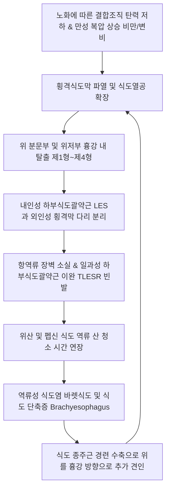

# 🩺 열공 탈장 (Hiatal Hernia, 食道裂孔ヘルニア)

> **핵심 3줄 요약 (Key Summary)**:
> - 📍 **병소 부위 & 해부·병태생리**: 횡격막의 식도열공(esophageal hiatus, T10 높이)을 지지하는 횡격식도막(phrenicoesophageal membrane)의 이완 또는 결손으로 인해 복강 내에 위치해야 할 위(stomach)의 분문부·위저부 또는 다른 복강 장기가 흉강(종격동) 내로 탈출하는 해부학적 질환이다.
> - 🚩 **전형적 임상 양상**: 제1형(슬라이딩 탈장, 95%)은 주로 하부식도괄약근(LES) 기능 상실로 인한 심와부 작열감(heartburn), 산 역류, 트림, 흉골하 통증 등 [[위식도 역류질환]](GERD) 증상을 나타내며, 제2~4형(식도주위 탈장군)은 조기 포만감, 연하곤란, 흉부 압박감 및 잠재적 위궤양(Cameron 병변) 출혈을 유발한다.
> - 🛠️ **핵심 검사 & 치료 전략**: 바륨 식도조영술, 상부위장관 내시경(역위 검사 시 헐거워진 분문부 관찰), 고해상도 식도내압검사(HRM)로 진단하며, 제1형은 생활습관 교정과 양방 PPI 또는 한의 위기상역(胃氣上逆) 변증 침·약침·한약([[반하사심탕]], [[육군자탕]]) 및 횡격막 이완 추나요법으로 보존적 조절을 한다.
> - ⚠️ **응급 의뢰 레드플래그**: 제2~4형 식도주위 탈장에서 급성 위염전(gastric volvulus) 또는 감돈(incarceration)이 발생하면 Borchardt 3징후(심와부 극통, 구역질은 하나 토하지 못함, 위관 삽입 실패)가 나타나며, 위벽 허혈 괴사 및 천공으로 패혈증에 이를 수 있으므로 즉시 응급 복강경/개복 수술을 위해 3차 상급병원 외과로 전원한다.

---

## 📌 목차
1. [질환 개요 & 해부학적 병태생리](#1-질환-개요--해부학적-병태생리)
2. [병태생리 메커니즘 & 생체역학적 악순환 네트워크](#2-병태생리-메커니즘--생체역학적-악순환-네트워크)
3. [임상 증상 & 이학적 검사(Physical Exam) 알고리즘](#3-임상-증상--이학적-검사physical-exam-알고리즘)
4. [감별 진단 매트릭스 (Differential Diagnosis)](#4-감별-진단-매트릭스-differential-diagnosis)
5. [한의 통합 치료 프로토콜 (침·약침·추나·한약)](#5-한의-통합-치료-프로토콜-침약침추나한약)
6. [양방 치료 & 병용·의뢰 기준 (Conventional Treatment & Referral)](#6-양방-치료--병용의뢰-기준-conventional-treatment--referral)
7. [재활 운동 & 생활습관 티칭 가이드](#7-재활-운동--생활습관-티칭-가이드)
8. [💡 사용자 진료실 핵심 필기 & 임상 노하우 (Melt-In 잔여 심화 집약)](#8--사용자-진료실-핵심-필기--임상-노하우-melt-in-잔여-심화-집약)
9. [출처 및 학술 참고 문헌 (References)](#9-출처-및-학술-참고-문헌--references)

---

## 1. 질환 개요 & 해부학적 병태생리

열공 탈장(Hiatal Hernia)은 횡격막에 형성된 식도 개구부인 식도열공(Esophageal Hiatus)을 통해 복강 내 장기(가장 흔하게는 위)가 후종격동(posterior mediastinum)으로 비정상적으로 돌출하는 질환이다. 고령, 비만, 임신, 만성 기침이나 변비 등으로 복압이 반복적으로 상승할 때 호발하며, 50세 이상 인구의 약 50~60%에서 발견될 정도로 매우 흔한 질환이다.

### 해부학적 4대 아형 분류 (SAGES Guidelines)
1. **제1형 (슬라이딩 탈장, Sliding Hiatal Hernia, 약 90~95%)**:
   - 횡격식도막이 원주상으로 신장·이완되면서 위식도접합부(Gastroesophageal Junction, GEJ)와 위의 분문부(cardia)가 횡격막 위 흉강 내로 함께 미끄러져 올라간 형태이다.
   - 하부식도괄약근(LES)과 횡격막 다리(crural diaphragm)의 해부학적 일치가 파괴되어 [[위식도 역류질환]](GERD)의 주된 병리적 기전이 된다.
2. **제2형 (순수 식도주위 탈장, Paraesophageal / Rolling Hernia, < 5%)**:
   - 위식도접합부(GEJ)는 정상적인 복강 내 위치(횡격막 직하부)에 고정되어 있으나, 횡격식도막 전외측 결손을 통해 위저부(fundus)만이 식도 평행 방향으로 흉강 내로 밀려 올라간 형태이다.
3. **제3형 (혼합형 식도주위 탈장, Mixed Hernia)**:
   - 제1형과 제2형이 복합된 형태로, 위식도접합부와 위저부가 모두 횡격막 상방 흉강 내에 위치한다. 대다수의 대형 식도주위 탈장이 여기에 속한다.
4. **제4형 (복합 거대 탈장, Giant Hiatal Hernia)**:
   - 식도열공의 결손이 극도로 커져 위 전체는 물론 대망(greater omentum), 횡행결장, 소장, 비장 등 복강 내 다른 장기까지 종격동으로 탈출한 상태이다.

---

## 2. 병태생리 메커니즘 & 생체역학적 악순환 네트워크

열공 탈장은 해부학적 항역류 장벽(anti-reflux barrier)의 붕괴와 흉복강 내 압력 차이가 결합되어 상부 소화관의 연동 운동과 산 청소율(acid clearance)을 파괴하는 생체역학적 악순환을 형성한다.

### 병태생리 핵심 기전
1. **항역류 이중 밸브 시스템의 붕괴**: 정상 상태에서는 내인성 평활근인 LES와 외인성 골격근인 횡격막 우각(right crus)이 정확히 같은 높이에서 맞물려 복압 상승 시 식도를 조여준다(외인성 괄약근 작용). 탈장이 발생하면 두 구조물이 공간적으로 분리되어 '두 개의 고립된 압력대(two distinct pressure zones)'가 형성되고, 역류 억제력이 상실된다.
2. **산 주머니(Acid Pocket) 포착**: 음식물 섭취 후 위 분문부 상부에 형성되는 고산성 액체 층(acid pocket)이 탈장낭(hernia sac) 내에 갇혀 연하 운동 중에도 중화되지 않고 식도로 직접 뿜어져 나온다.
3. **카메론 병변(Cameron Lesion)**: 탈장된 위벽이 횡격막 열공의 단단한 섬유성 테두리(crura)를 호흡할 때마다 마찰하면서 위 점막에 선상 미란 및 궤양이 발생하는 현상으로, 원인 불명의 만성 철결핍성 빈혈을 초래한다.

---

## 3. 임상 증상 & 이학적 검사(Physical Exam) 알고리즘

### 임상 증상 (Clinical Features)
- **제1형 (슬라이딩 탈장)**:
  - 전형적 역류 증상: 흉골 뒤 타는 듯한 작열감(Heartburn), 위산 역류(Regurgitation), 트림, 상복부 팽만감.
  - 비전형적 역류 증상: 만성 기침, 쉰 목소리, 천식 악화, 인두 이물감(매핵기), 비심인성 흉통.
  - 체위성 악화: 식후 바로 눕거나 몸을 앞으로 숙일 때 증상 급격히 악화.
- **제2~4형 (식도주위 탈장군)**:
  - 식사 중 조기 포만감(Early satiety): 탈장된 위가 흉강 내에서 팽창하여 음식 수용 공간 부족.
  - 연하곤란(Dysphagia): 흉강 내 위저부가 식도를 기계적으로 외압하여 고형식 삼킴 장애.
  - 호흡곤란 및 심계항진: 식후 거대 탈장낭이 폐와 심장(좌심방)을 압박하여 발생.
  - 잠재성 출혈: Cameron 미란성 궤양으로 인한 흑색변, 만성 피로, 빈혈.

### 진단 검사 알고리즘
1. **상부위장관 바륨 조영술(Barium Swallow, UGI Series)**:
   - 해부학적 구조 평가의 표준 검사. 위식도접합부의 위치, 탈장낭의 크기(> 2cm 시 확진), 탈장의 유형(1형 vs 2~4형), 위벽 염전 여부를 가장 직관적으로 확인.
2. **상부위장관 내시경(EGD)**:
   - 위내시경을 위체부에서 U턴하여 분문부를 올려다보는 역위 관찰(retroflexion) 시, 내시경 자루 주변을 조여주지 못하고 헐거워진 열공낭(Hill classification Grade I~IV)을 확인.
   - 점막 열상, 역류성 식도염의 중등도(LA classification), 바렛 식도(Barrett's esophagus), Cameron 궤양 유무를 평가.
3. **고해상도 식도내압검사(High-Resolution Manometry, HRM)**:
   - LES 압력대와 횡격막 수축 압력대가 2cm 이상 분리되어 이중 피크(double-hump profile)를 형성하는 것을 정량적으로 측정.

---

## 4. 감별 진단 매트릭스 (Differential Diagnosis)

| 감별 질환 | 호발 연령 및 성별 | 주요 증상 양상 | 특징적 검사 소견 | 감별 핵심 포인트 (Discriminator) |
| :--- | :--- | :--- | :--- | :--- |
| **열공 탈장 (Hiatal Hernia)** | 50세 이상, 비만 | 가슴쓰림, 식후 조기 포만감, 체위성 역류 | 바륨 조영술 상 횡격막 상방 위낭 관찰 | 횡격막 위로 위 점막 탈출 확인, Cameron 궤양 동반 가능 |
| **단순 [[위식도 역류질환]] (GERD)** | 20~60대 전 연령 | 흉골하 작열감, 산 역류 | 내시경 상 식도 점막 결손, 열공 해부구조는 정상 | 횡격막 위로의 해부학적 탈출 없음 (GEJ가 횡격막 레벨에 위치) |
| **[[협심증]] / 허혈성 심장질환** | 50세 이상, 남성 우세 | 흉골 심부 압박감, 쥐어짜는 통증 | 심전도(ST변화), 심근효소(Troponin), 관상동맥 CT | 운동·계단 보행 시 악화 및 니트로글리세린 호전, 식사와 무관 |
| **[[식도이완불능증]] (Achalasia)** | 20~40대 청장년 | 유동식 및 고형식 삼킴 곤란, 체중 감소 | 조영술 상 새부리 모양(Bird-beak), 압력검사 연동운동 소실 | 하부식도괄약근 이완 부전, 역류가 아닌 썩은 음식물 토출 |
| **식도암 (Esophageal Cancer)** | 60세 이상, 흡연·음주력 | 점진적으로 악화되는 고형식 연하곤란 | 내시경 상 궤양성 종괴, 조직생검 악성세포 | 급격한 체중 감소, 빈혈, 바렛식도 장기 병력 후 이형성 진행 |
| **[[소화성 궤양]] (위·십이지장)** | 전 연령 | 심와부 속쓰림, 공복통(십이지장)/식후통(위) | 내시경 상 점막 결손 분화구 궤양, H. pylori 감양 | 식사 타이밍과 명확한 연관, 흉강 내 탈출 소견 없음 |

---

## 5. 한의 통합 치료 프로토콜 (침·약침·추나·한약)

한의학에서 열공 탈장 및 그로 인한 역류 증상은 음식상(飲食傷), 칠정울결(七情鬱結), 또는 비위 허약으로 인해 소화관의 하향 승강(昇降) 기전이 무너져 발생하는 **위기상역(胃氣上逆), 탄산(呑酸), 조잡(嘈雜), 매핵기(梅核氣), 열격(噎膈)**의 범주로 접근한다.

> 🎯 **한의 임상 전략의 목표**:
> 1. 위장관 연동 운동을 촉진하고 위 내용물 배출 속도를 개선하여 위내압을 강하시킨다.
> 2. 식도 점막의 미세 순환을 개선하고 무균성 점막 염증을 치유한다.
> 3. 횡격막과 흉복부 근막의 과긴장을 추나요법으로 이완하여 해부학적 역류 경향을 물리적으로 완화한다.

### 1) 침구 치료 (Acupuncture)
- **주요 혈위**:
  - [[중완]](CV12): 위의 모혈(募血)이자 부회(腑會)로 위기(胃氣)를 조절하고 연동 운동 촉진.
  - [[전중]](CV17): 심포의 모혈이자 기회(氣會), 흉골 중앙에 위치하여 흉통 및 흉협부 식도 긴장 완화.
  - [[내관]](PC6): 수궐음심포경의 락혈이자 팔맥교회혈(음유맥), 미주신경 활성화를 통해 위장 역류와 오심·구토 억제.
  - [[족삼리]](ST36): 위경의 합혈, 복강 혈류 순환 개선 및 위 배출 기능 항진.
  - [[상완]](CV13) & [[거궐]](CV14): 분문부 직상방 투영 혈위로 위기상역 억제.
  - [[격수]](BL17): 팔회혈 중 혈회이자 횡격막 지배 신경 레벨(T7-T8), 횡격막 긴장 완화.
- **전침 요법(Electroacupuncture)**: 중완-족삼리, 내관-공손 간 2Hz 저주파 전침을 20분간 적용하여 하부식도괄약근의 기저압을 상승시키고 일과성 하부식도괄약근 이완(TLESR) 빈도를 감소시킴.

### 2) 약침 치료 (Pharmacopuncture)
- **주입 부위**: 전중, 거궐, 중완 및 배수혈인 격수(BL17), 비수(BL20), 위수(BL21).
- **중성어혈약침**: 흉골하 작열통과 만성 미란성 식도염 병변의 미세혈류 정체 해소, 각 혈위당 0.2~0.3cc 주입.
- **황련해독탕 약침**: 위산 과다 분비 및 식도 점막 열증(화농·발적) 완화 목적으로 전중, 거궐에 주입.

### 3) 추나요법 (Chuna Manual Therapy)
- **횡격막 수기 이완술(Diaphragm Release Technique)**:
  - 검자가 환자의 양측 늑골하연(갈비뼈 궁) 아래로 부드럽게 손가락을 접촉하여 흡기 시 저항하고 호기 시 심부로 압박하며 횡격막의 상방 긴장을 하방으로 신연.
- **흉추-늑골 가동술(Thoracic-Rib Mobilization)**:
  - 식도열공 지배 신경(미주신경 및 내장신경 T5-T9) 분절의 흉추 후만 및 늑골 기능부전을 교정하여 흉강내 음압 과다 형성을 방지.
- **위 하방 신연 기법(Visceral Manipulation for Stomach)**:
  - 좌측 늑골하 위저부 영역을 가볍게 파지하여 호기 시 골반 방향으로 완만하게 견인하는 내장기 도수치료 기법 병행.

### 4) 한약 치료 (변증별 방제)
- **간위불화·위기상역형(肝胃不和·胃氣上逆型)**: 스트레스 후 가슴쓰림, 트림, 옆구리 팽만감, 목에 이물감이 심한 경우.
  - [[반하사심탕]](半夏瀉心湯) 또는 가미소요산 합 사역산: 신개고강(辛開苦降), 평조한열(平調寒熱), 소간화위(疏肝和胃).
- **비위기허·음식정체형(脾胃氣虛·飲食停滯型)**: 조금만 먹어도 헛배가 부르고 소화가 안 되며 맑은 물이 넘어오고 대변이 묽은 경우.
  - [[육군자탕]](六君子湯) 가 [[사인]], [[백두구]], [[향부자]] 또는 [[평위산]](平胃散): 보기건비(補氣健脾), 화위강역(和胃降逆).
- **담음울체·매핵기형(痰飲鬱滯·梅核氣型)**: 목에 가래가 걸린 듯 뱉어도 안 나오고 삼켜도 안 넘어가며 가슴이 답답한 경우.
  - [[반하후박탕]](半夏厚朴湯) 또는 [[이진탕]](二陳湯) 가미: 행기개울(行氣開鬱), 강역화담(降逆化痰).

---

## 6. 양방 치료 & 병용·의뢰 기준 (Conventional Treatment & Referral)

### 1) 표준 양방 치료 (Standard Conventional Management)
- **약물 치료 (제1형 슬라이딩 탈장의 1차 치료)**:
  - 프로톤펌프억제제(PPI): Esomeprazole 20~40mg qd, Rabeprazole, Lansoprazole. 식전 30~60분 복용, 8주 투여로 식도염 치유.
  - P-CAB 제제: Tegoprazan(케이캡), Fexuprazan(펙수클루). 식사 시간과 무관하게 신속한 산 억제 가능.
  - 위장관 운동촉진제: Mosapride, Itopride 병용으로 위 배출 촉진.
- **수술적 치료 (Surgical Management, 항역류 수술)**:
  - **복강경 위저부 추벽성형술(Laparoscopic Nissen Fundoplication)**:
    - 탈장된 위를 복강 내로 원위치시키고, 식도열공 결손을 봉합(cruroraphy)한 뒤 위저부로 하부식도를 360도 둘러싸서 인공 밸브를 만들어줌.
  - **수술 적응증 (SAGES Guidelines)**:
    - 모든 증상성 제2~4형 식도주위 탈장(급성 염전·괴사 예방을 위해 준응급/정규 수술 원칙).
    - 제1형 중 약물 치료(고용량 PPI)에 반응하지 않는 난치성 GERD.
    - 바렛 식도 고도 이형성 또는 반복적인 흡인성 폐렴 동반 시.

### 2) 한의 병용 판단 및 상호작용
- **PPI 복용 중 환자의 감량(Weaning)**: PPI를 6개월 이상 장기 복용한 환자가 약을 끊으려 할 때 반동성 위산과다(rebound hyperacidity)로 증상이 급격히 악화된다. 이때 반하사심탕이나 평위산 계열 한약과 중완·내관 침치료를 병용하면서 격일 복용 -> 중단으로 테이퍼링하면 안전하게 약물을 감량할 수 있다.
- **수술 후 덤핑 증후군 및 가스 팽만 증후군(Gas-bloat syndrome)**: 항역류 수술 후 트림을 하지 못해 복부 팽만이 극심할 때 육군자탕과 이진탕 투여가 매우 효과적이다.

### 3) 양방 전문과 및 응급 의뢰 기준
- **🚨 즉각 외과 응급 전원 (급성 위염전 Gastric Volvulus 의심 시)**:
  - **Borchardt 3대 징후**:
    1. 심와부 또는 흉부의 쥐어짜는 듯한 극심한 돌발 통증.
    2. 극심한 구역질을 하나 위 내용물이 전혀 토해지지 않음(Retching without vomiting).
    3. 비위관(L-tube) 삽입 시 식도 하부에서 걸려 위 내부로 진입 불가.
  -> 위 혈관이 꼬여 급속한 위벽 괴사 및 천공, 종격동염으로 진행하므로 즉시 응급 수술 의뢰!
- **외과 정규 수술 의뢰**: 제2~4형 거대 식도주위 탈장 환자에서 식후 흉부 압박감, 지속적인 고형식 연하곤란, Cameron 궤양으로 인한 불응성 빈혈 확인 시.

---

## 7. 재활 운동 & 생활습관 티칭 가이드

### 1) 복압 증가 행동 절대 회피
- 과식, 식후 바로 눕기(최소 2~3시간 동안 좌위 유지).
- 꽉 끼는 코르셋, 보정속옷, 벨트 착용 금지.
- 무거운 물건 들기, 과도한 복근 크런치 운동, 변비로 인한 과도한 배변 힘주기 피하기.

### 2) 수면 자세 개선
- 침대 머리 쪽 다리 밑에 벽돌을 괴어 15~20cm 올리거나 쐐기형 베개(Wedge pillow) 사용.
- **좌측 측와위(Left lateral decubitus) 수면**: 해부학적으로 위 분문부가 아래로 향하고 위저부가 위로 위치하여 역류 발생 빈도가 현저히 감소함.

### 3) 횡격막 호흡 운동 (Diaphragmatic Breathing)
- 앙와위에서 한 손은 흉부에, 한 손은 복부에 얹고 흉곽의 움직임을 최소화하면서 복식호흡 시행.
- 규칙적인 횡격막 호흡은 식도열공을 감싸는 횡격막 우각 근육의 탄력을 강화하여 항역류 장벽 기능 보강에 도움을 줌.

---

## 8. 💡 사용자 진료실 핵심 필기 & 임상 노하우 (Melt-In 잔여 심화 집약)

1. **원인 모를 노인성 빈혈 환자의 숨은 원인**:
   - 60~70대 노인 환자가 어지럼증과 피로로 내원하여 혈액검사 상 철결핍성 빈혈이 확인되었으나 위·대장 내시경에서 뚜렷한 암이나 궤양이 없다고 할 때, 열공 탈장에 의한 **Cameron 병변**을 반드시 의심해야 한다. 호흡 시 횡격막에 쓸리는 분문부 점막 미란은 내시경을 역위하여 꼼꼼히 살피지 않으면 놓치기 쉽다.
2. **협심증으로 오인되는 열공 탈장 흉통**:
   - 식후 가슴 한가운데가 조여오고 숨이 차다며 내원하는 환자 중 심장내과 관상동맥 조영술에서 '정상' 판정을 받은 환자가 많다. 거대 열공 탈장은 식후 위 팽창으로 심장(좌심방)을 직접 압박하고 미주신경 반사를 유발하여 부정맥(심방세동)이나 협심증 유사 흉통을 일으킨다(Roemheld 증후군).
3. **추나요법 시 복부 과도한 압박 금기**:
   - 역류성 식도염 환자를 치료할 때 중완혈 부위를 너무 강하게 수직 압박하면 오히려 복압이 급증하여 탈장낭을 흉강으로 더 밀어올릴 수 있다. 반드시 갈비뼈 하연을 따라 횡격막을 완만하게 이완하고 흉추 신연을 선행해야 한다.

---

## 9. 출처 및 학술 참고 문헌 (References)

1. **Kohn GP, et al. (2013)**. Guidelines for the management of hiatal hernia. *Surgical Endoscopy*, 27(12):4409-4428. [PMID: 24018762](https://pubmed.ncbi.nlm.nih.gov/24018762/)

2. **Kahrilas PJ. (2008)**. Clinical practice. Gastroesophageal reflux disease. *The New England Journal of Medicine*, 359(16):1700-1707. [PMID: 18923172](https://pubmed.ncbi.nlm.nih.gov/18923172/)

---

## 관련 노트

- [[위식도 역류질환]]
- [[만성 위염]]
- [[위궤양]]
- [[십이지장 궤양]]
- [[바렛 식도]]
- [[식도이완불능증]]
- [[협심증]]
