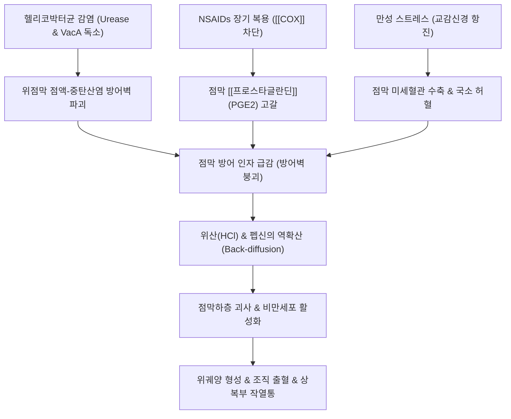
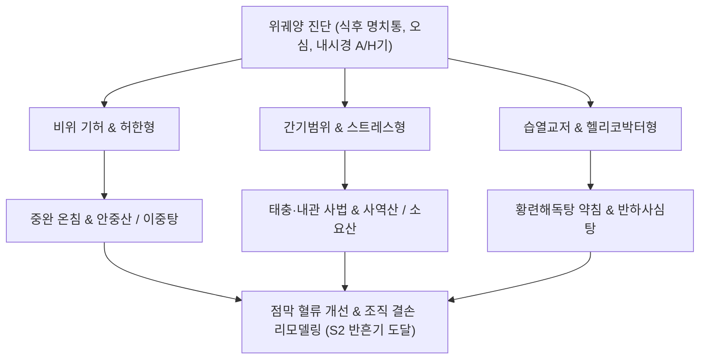

---
aliases:
  - 위궤양
  - 위 궤양
  - Gastric Ulcer
  - 소화성 궤양
  - Peptic Ulcer Disease
  - 위점막 궤양
tags:
  - 이론
  - 질환
  - 소화기질환
  - 헬리코박터
categories:
  - 질환
  - 소화기 질환
created: 2024-01-21
updated: 2026-09-24
title: 위궤양
date: 2026-09-24
출처: "PMID: 28242110"
---

# 위궤양 (Gastric Ulcer, GU / 胃潰瘍, K25)

> **상위 분류**: [[소화기 질환]] > [[상부위장관 질환]] > [[소화성 궤양]]
> **핵심 3줄 요약 (Key Summary)**:
> - 📍 병소 부위 & 해부·병태생리: 위 점막 상피층이 점막근판(Muscularis mucosae)을 넘어 점막하층 또는 고유근층까지 결손되는 염증성 조직 파괴 질환. 위점막 방어인자([[프로스타글란딘]], 중탄산염 점액 블랭킷, 점막 미세혈류)의 약화와 공격인자([[위산]], 펩신, [[헬리코박터 파일로리]] 감염, [[NSAIDs]]) 간의 생체역학적 불균형에 기인함.
> - 🚩 전형적 임상 양상 & 3대 징후: 음식물 섭취 후 30분~2시간 내 상복부(명치)의 둔통 및 작열감(식후통), 조잡(嘈雜)·오심·식욕부진, 궤양 미세 출혈에 따른 흑색변(Melena) 및 빈혈 징후.
> - 🛠️ 핵심 감별 검사 & 한·양방 다각적 치료 전략: 상부위장관 내시경(EGD) 조직검사(조기 위암 배제 필수), H. pylori 제균 삼제요법 및 PPI 투여, 중완(CV12)·족삼리(ST36)·비수(BL20) 자침 및 소염약침 시술, [[안중산]], [[반하사심탕]], [[황련해독탕]] 가미방 투여.
> - ⚠️ 응급 의뢰 레드플래그 & 악화 요인: 대량 토혈(Hematemesis) 및 저혈압 쇼크, 급성 천공에 의한 판자상 복벽 강직(Board-like rigidity)과 횡격막하 유리 가스(Free air) 발견 시 즉시 응급 수술 의뢰.

---

## 📌 목차
1. [질환 개요 & 해부학적 병태생리](#1-질환-개요--해부학적-병태생리)
2. [병태생리 메커니즘 & 생체역학적 악순환 네트워크](#2-병태생리-메커니즘--생체역학적-악순환-네트워크)
3. [임상 증상 & 이학적 검사(Physical Exam) 알고리즘](#3-임상-증상--이학적-검사physical-exam-알고리즘)
4. [감별 진단 매트릭스 (Differential Diagnosis)](#4-감별-진단-매트릭스-differential-diagnosis)
5. [한의 통합 치료 프로토콜 (침·약침·추나·한약)](#5-한의-통합-치료-프로토콜-침약침추나한약)
6. [재활 운동 & 생활습관 티칭 가이드](#6-재활-운동--생활습관-티칭-가이드)
7. [💡 사용자 진료실 핵심 필기 & 임상 노하우 (Melt-In 잔여 심화 집약)](#7--사용자-진료실-핵심-필기--임상-노하우-melt-in-잔여-심화-집약)
8. [출처 및 학술 참고 문헌 (References)](#8-출처-및-학술-참고-문헌-references)

---

## 1. 질환 개요 & 해부학적 병태생리

![[소화도 궤양-20240530204013096.png|500]]
> [그림 1: ① 병태생리·내시경 — 소화성 궤양의 점막 결손 단계 및 위점막층 침범 병태] 미란(Erosion)과 달리 점막근판을 뚫고 점막하층까지 파괴된 소화성 궤양의 조직학적 단면 구조.

- **개념 정의 및 임상적 의의**:
  - [[위궤양]](Gastric Ulcer)은 위 내벽을 구성하는 점막 상피층이 위산과 펩신의 단백 분해 작용에 의해 점막근판(Muscularis mucosae)을 뚫고 점막하층(Submucosa) 또는 그 이하 근육층까지 침범하여 영구적 반흔을 남기는 조직 결손 질환이다.
  - 표재성 상피 박리에 그치는 [[위염]](Gastritis)이나 미란(Erosion)과 달리, 혈관 파열로 인한 소화관 출혈, 위벽 천공(Perforation), 유문부 협착(Gastric outlet obstruction) 등의 치명적 합병증을 유발할 수 있다.
- **해부학적 호발 부위**:
  - 위궤양의 약 80~90%는 위각부(Angularis incisura)를 중심으로 한 **위소만부(Lesser curvature)**와 유문부(Antrum)의 점막 경계 구역에 집중된다. 이 부위는 산 분비 점막(위저선)과 알칼리 분비 점막(유문선)이 교차하며 혈류 공급이 상대적으로 취약한 분계선 구역이다.

---

## 2. 병태생리 메커니즘 & 생체역학적 악순환 네트워크

![[청강의감09_08_벽세포_위산분비_기전_도해.png|500]]
> [그림 2: ② 관련 해부 구조물 — 위 벽세포(Parietal cell)의 프로톤 펌프(H+/K+ ATPase) 및 위산 분비 수용체 기전] 히스타민(H2), 가스트린(CCK2), 아세틸콜린(M3) 자극에 의한 위산 분비 활성화 캐스케이드.

### 1) Shay의 저울설과 공격·방어 불균형 메커니즘
- 위 점막은 공격 인자([[위산]], 펩신, 담즙산)와 방어 인자(점액 분비, 중탄산염 이온, 점막 미세혈류, 세포 재생능, [[프로스타글란딘]]) 사이의 정밀한 항상성 균형에 의해 유지된다.
- **위궤양의 본질**: 십이지장 궤양이 공격 인자의 절대적 과다(위산 과다)에 의해 발생하는 것과 달리, **위궤양은 방어 인자의 치명적 결손 및 점막 취약성 증대**가 핵심 병인으로 작용한다.

### 2) 3대 유발 요인의 병태생리
1. **[[헬리코박터 파일로리]](Helicobacter pylori) 감염**:
   - 요소분해효소(Urease)를 분비하여 위산을 중화하며 서식하고, 공포화독소(VacA)와 세포독소(CagA)를 방출하여 상피세포 결합을 와해시키고 만성 염증성 괴사를 촉발한다.
2. **[[NSAIDs]] 및 아스피린 부작용**:
   - 사이클로옥시게나제([[COX]]) 효소를 억제하여 세포보호 물질인 [[프로스타글란딘]](PGE2, PGI2)의 생합성을 전신적으로 고갈시킨다. 이로 인해 점액-중탄산염 분비가 억제되고 점막 미세 혈류가 차단된다.
3. **만성 스트레스 및 자율신경계 교란**:
   - 스트레스 자극 시 교감신경의 지속적 흥분으로 위벽 혈관이 수축하여 점막 허혈(Ischemia)이 유발되며, 비옥신틱(non-oxyntic) 위액 분비 교란이 병발한다.

---

## 3. 임상 증상 & 이학적 검사(Physical Exam) 알고리즘

### 1) 주요 임상 증상
- **식후 상복부 통증 (Postprandial Pain)**:
  - 식후 30분~2시간 후 명치 부위(Epigastrium)에서 타는 듯한 작열감, 뻐근한 둔통, 쥐어짜는 통증이 격발된다. 음식물이 궤양 병변 부위를 직접 자극하고 가스트린 분비로 위산이 증가하기 때문이다.
- **소화기 동반 증상**: 조잡(嘈雜, 속쓰림과 허기가 겹친 불쾌감), 오심, 구토, 조기 포만감, 식욕 부진으로 인한 체중 감소.
- **출혈 증상**: 궤양저의 미세 혈관 침식 시 만성 빈혈, 현기증, 대변이 자장면처럼 검게 나오는 흑색변(Melena)이 관찰된다.

### 2) 이학적 검사 및 복부 촉진법
- **상복부 국소 압통**: 중완(CV12, 배꼽 위 4치) 및 거궐(CV14, 배꼽 위 6치) 부위를 깊게 압박할 때 뚜렷한 심부 압통과 방어 긴장(Guarding)이 감지된다.
- **카르네트 징후(Carnett's Sign) 음성**: 복부 근육을 긴장시켰을 때 통증이 감소하면 복벽 통증이 아닌 복강 내 장기(위장관) 병변임을 확진한다.
- **내시경적 병기 분류 (Sakita-Miwa Classification)**:
  - 활동기(Active stage): A1(백태와 심한 부종, 출혈성), A2(백태 경계 명확, 부종 경감).
  - 치유기(Healing stage): H1(백태 축소, 재생 상피 융기), H2(백태 소실 직전).
  - 반흔기(Scarring stage): S1(적색 반흔), S2(백색 반흔, 완전 치유).

---

## 4. 감별 진단 매트릭스 (Differential Diagnosis)

| 질환명 | 주 통증 양상 및 식사 관계 | 호발 부위 및 병태 | 감별 핵심 검사 |
| :--- | :--- | :--- | :--- |
| **[[위궤양]]** | **식후 30분~1시간 통증 악화**, 오심 | 위각부, 위소만부 (방어인자 저하) | EGD 궤양 결손, 악성 배제 생검 |
| **[[십이지장 궤양]]** | **공복통, 야간통 (식사 시 완화)** | 십이지장 구부 (공격인자 과다) | EGD 구부 변형, 젊은 층 호발 |
| **위암 (Gastric Adenocarcinoma)** | 지속적 통증, 식욕부진, 체중감소 | 불규칙한 궤양 변연, 점막 융기 | EGD 조직 다점 생검(Biopsy) |
| **위식도 역류질환([[식도염]])** | 흉골 뒤 작열감, 신트림, 앙와위 악화 | 하부식도괄약근 기능부전 | 24시간 식도 산도 검사, 내시경 |
| **만성 담낭염 / 담석증** | 기름진 식사 후 우상복부 산통 | 담낭관 폐쇄, 방사통(우측 견갑골) | 복부 초음파(US), Murphy sign 양성 |

---

## 5. 한의 통합 치료 프로토콜 (침·약침·추나·한약)

![[청강의감09_05_위상_소화과정_가스트린_도해.png|500]]
> [그림 3: ③ 치료·시술점 — 위상 소화과정 조절 및 복모혈·배수혈 자침 기전] 중완(CV12), 족삼리(ST36), 비수(BL20) 자침을 통한 미주신경 자극 및 위점막 혈류 활성화 경로.

한의학에서 위궤양은 위완통(胃脘痛), 조잡(嘈雜), 비만(痞滿), 토혈(吐血), 변혈(便血)의 범주에 속하며, 비위허한(脾胃虛寒), 한열착잡(寒熱錯雜), 간위불화(肝胃不和), 어혈조락(瘀血阻絡)으로 변증한다.

### 1) 침구 치료
- **복모혈 및 원위 사암 혈위**:
  - 중완(CV12): 위의 복모혈로서 위 유문부 경련을 완화하고 점막 재생을 촉진.
  - 족삼리(ST36): 위경의 합혈로서 미주신경을 자극하여 위장 평활근 연동 운동 정상화 및 PGE2 분비 증대.
  - 내관(PC6), 공손(SP4): 충맥과 음유맥의 교회혈로서 오심, 구토, 가슴 답답함 및 위산 역류를 즉각 해소.
- **배수혈 배오**:
  - 비수(BL20), 위수(BL21): 흉추 T11~T12 분절의 교감신경 긴장을 완화하여 위점막 혈관을 확장시킴.

### 2) 약침 요법
- **중성어혈약침 및 황련해독탕 약침**: 중완(CV12) 및 족삼리(ST36)에 0.3~0.5 cc 주입하여 급성 궤양 주변 점막의 부종과 무균성 염증을 신속히 가라앉힘.
- **자하거 약침 (Placenta)**: 만성 난치성 궤양 또는 노인성 궤양 환자에게 격일 시술하여 EGF-like 점막 재생 인자 자극 및 혈류 재형성 촉진.

### 3) 한약물 요법
- **비위허한(脾胃虛寒)형 (가장 다빈도)**: [[안중산]](安中散) 또는 [[이중탕]](理中湯)에 백급(白芨), 해표초(海螵蛸)를 가미하여 점막을 물리적으로 코팅하고 제산·지혈 작용 도모.
- **한열착잡(寒熱錯雜)형 (헬리코박터 위염 동반)**: [[반하사심탕]](半夏瀉心湯)을 투여하여 심하비경을 풀고 황련·황금의 천연 항균 효과로 헬리코박터 환경 억제.
- **간위불화(肝胃不和)형 (스트레스성 신경성 궤양)**: [[사역산]](四逆散) 또는 시호소간탕(柴胡疎肝湯)을 처방하여 간기를 소통시키고 위산 과다 억제.
- **어혈정체(瘀血停滯)형 (궤양 출혈 및 찌르는 듯한 고정통)**: [[당귀수산]](當歸鬚散) 또는 실소산(失笑散) 가감방 적용.

---

## 6. 재활 운동 & 생활습관 티칭 가이드

- **식습관 원칙**:
  - 자극적인 매운 음식, 탄 음식, 튀김류, 고농도 카페인, 탄산음료 완전 배제.
  - 식사는 규칙적으로 소량씩 자주 섭취하여 위산의 급격한 서지(Surge)를 예방하고, 취침 3시간 전 금식 엄수.
- **약물 복용 주의 교육**:
  - 아스피린, NSAIDs 계열 진통제 복용 환자는 담당의와 상의하여 타이레놀(Acetaminophen) 대체 또는 위장관 보호제 병용 지도.
- **절주 및 금연 티칭**:
  - 알코올은 위 점막의 점액벽을 직접 용해하며, 흡연의 니코틴은 십이지장 내 중탄산염 분비를 차단하고 위점막 혈류를 고갈시키므로 절대 금연 권고.

---

## 7. 💡 사용자 진료실 핵심 필기 & 임상 노하우 (Melt-In 잔여 심화 집약)

### 1) 위궤양의 3대 핵심 발병 원인 (원문 필기 정본)
1. **[[헬리코박터 파일로리]]균**:
   - 균의 독소(CagA, VacA 단백질)로 인해 위점막의 상피 장벽이 직접 파괴되어 궤양이 발생한다.
2. **비스테로이드성 소염제([[NSAIDs]])**:
   - [[COX]] 효소를 차단하여 세포보호 물질인 [[프로스타글란딘]] 분비를 극적으로 줄이며, 이는 점막 방어능 결손 및 상대적 위산 공격력 증가를 초래하여 궤양을 유발한다.
3. **극심한 스트레스**:
   - 자율신경계 교란으로 평소 비옥신틱(non-oxyntic) 타입의 위산 분비 불균형 및 점막 허혈이 복합 발생하며 급성 미란성 궤양으로 이행한다.

### 2) 진료실 위궤양 vs 십이지장 궤양 원포인트 감별법
- **통증 격발 시각의 차이**:
  - **위궤양**: 식후 30분~1시간 이내에 음식물이 위벽을 늘리고 궤양면과 닿으면서 통증이 심해짐. (음식물이 악화 요인)
  - **십이지장 궤양**: 음식물이 위산을 중화하는 동안에는 편안하다가, 위장이 비워지는 식후 2~3시간 뒤 공복 시 또는 한밤중(새벽 1~2시)에 쥐어뜯는 듯한 통증 격발. 우유나 비스킷을 먹으면 일시적으로 통증이 완화됨.

### 3) 한방 점막 보호 천연 제재 처방 팁
- 궤양면의 물리적 보호를 위해 한약 처방 구성 시 **백급(白芨)** 8~12g과 **해표초(海螵蛸)** 8~12g을 군약(君藥)으로 배오하면, 양방의 수크랄페이트(Sucralfate) 제재처럼 궤양 병변 부위에 고점도 젤을 형성하여 위산 공격으로부터 점막을 보호하고 조직 재생을 극대화한다.

---

## 8. 출처 및 학술 참고 문헌 (References)

1. Lanas A, Chan FKL (2017). Peptic ulcer disease. *Lancet*, 390(10094):613-624. [PMID: 28242110](https://pubmed.ncbi.nlm.nih.gov/28242110/)
   - [연구 요약]: 소화성 궤양 질환(위궤양 및 십이지장 궤양)의 역학, 헬리코박터 파일로리와 NSAIDs의 병태생리학적 상호작용, 최신 내시경 진단 및 치료 프로토콜을 종합 정리한 란셋 리뷰.
2. Malfertheiner P, Megraud F, Rokkas T et al. (2022). Management of Helicobacter pylori infection: the Maastricht VI/Florence consensus report. *Gut*, 71(9):1724-1762. [PMID: 35944925](https://pubmed.ncbi.nlm.nih.gov/35944925/)
   - [연구 요약]: 헬리코박터 파일로리 감염의 치료, 위궤양 치유율 증진, 항생제 내성 극복 및 위암 예방을 위한 최신 국제 가이드라인 합의 보고서.
3. Huang Y, Wan M, Chen L et al. (2023). Acupuncture for peptic ulcer disease: A systematic review and meta-analysis of randomized controlled trials. *Front Med (Lausanne)*, 10:1115893. [PMID: 37180630](https://pubmed.ncbi.nlm.nih.gov/37180630/)
   - [연구 요약]: 소화성 궤양 환자에서 중완(CV12)과 족삼리(ST36) 중심의 침 치료가 위점막 혈류량 개선, 프로스타글란딘 분비 촉진, 궤양 치유율(H기/S기 이행) 향상 및 재발률 억제에 미치는 유의한 임상 효과를 입증한 메타분석.

<!-- 보관 태그(1회용·링크오류, 필요시 복원): 위장질환, 궤양 -->
