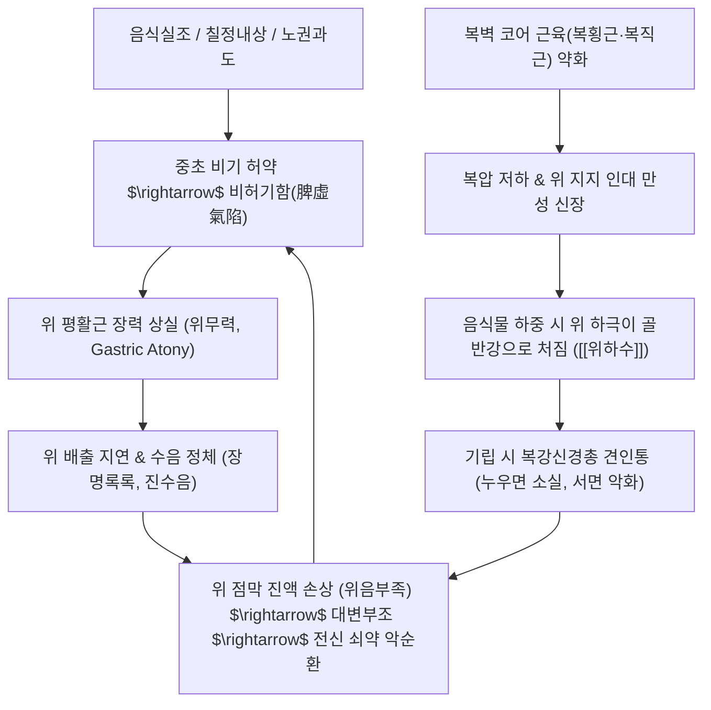

# 🩺 위완 (胃脘, Epigastric Sensation & Gastroptosis Disorder / KCD K31.8)

> **핵심 3줄 요약 (Key Summary)**:
> - 📍 병소 부위 & 병태생리: 상완(上脘, 분문부)·중완(中脘, 위체부)·하완(下脘, 유문부)에 이르는 위완부(胃脘部)의 긴장도 저하 및 복벽 코어 근육(복횡근, 복직근) 지지력 약화로 인해 위가 골반강 내로 처지고 연동운동이 무력해지는 병증; 비허기함(脾虛氣陷) 및 위음부족(胃陰不足)이 핵심 병태생리.
> - 🚩 전형적 임상 양상 & 3대 징후: 식후 완복비만(脘腹痞滿, 윗배가 더부룩하고 그득함), **누우면 소실되고 서 있으면 심해지는 밑으로 처지는 견인성 위완동통(胃脘疼痛)**, 복부 진수음(장명록록, 꾸르륵 물소리), 대변부조(大便不調).
> - 🛠️ 핵심 감별 검사 & 한·양방 치료: 기립위 바륨 위장조영술(위 하극이 장골능선 아래로 처짐 확인) 및 복벽 코어 초음파; 양방 위장관운동촉진제, 한의학 비허기함에 [[보중익기탕]], [[지출환]], 위음부족에 [[익위탕]] 합 [[일관전]] 및 중완(CV12)·족삼리(ST36) 침구 치료.
> - ⚠️ 치료 및 생활 티칭: 코어 근육 단련(복횡근 드로잉인 훈련), 소화 잘되고 체적이 작은 음식을 조금씩 자주 먹기(소식다회), 식후 무거운 물건 들기 및 장시간 기립 절대 금지.

---

## 📌 목차
1. [질환 개요 & 해부학적 병태생리](#1-질환-개요--해부학적-병태생리)
2. [병태생리 메커니즘 & 생체역학적 악순환 네트워크](#2-병태생리-메커니즘--생체역학적-악순환-네트워크)
3. [임상 증상 & 이학적 검사(Physical Exam) 알고리즘](#3-임상-증상--이학적-검사physical-exam-알고리즘)
4. [감별 진단 매트릭스 (Differential Diagnosis)](#4-감별-진단-매트릭스-differential-diagnosis)
5. [한의 통합 치료 프로토콜 (침·약침·추나·한약)](#5-한의-통합-치료-프로토콜-침약침추나한약)
6. [재활 운동 & 생활습관 티칭 가이드](#6-재활-운동--생활습관-티칭-가이드)
7. [💡 사용자 진료실 핵심 필기 & 임상 노하우 (Melt-In 잔여 심화 집약)](#7--사용자-진료실-핵심-필기--임상-노하우-melt-in-잔여-심화-집약)
8. [출처 및 학술 참고 문헌 (References)](#8-출처-및-학술-참고-문헌-references)

---

## 1. 질환 개요 & 해부학적 병태생리

![[위완_위하수_바륨X선_도해.png|450]]
> [그림 1: ① 병태생리·영상 — 기립위 바륨 위장조영술상 정상 위치의 위(점선)와 골반강 내로 처진 위하수(Gastroptosis)의 해부학적 비교 도해]

* **질환 정의 및 개요**:
  * 위완(胃脘) 병증은 한의학에서 심와부부터 배꼽 상부에 이르는 위완 구역의 기능 실조로 발생하는 제반 증상군을 포괄하는 용어로, 완복비만(脘腹痞滿), 애기불서(噫氣不舒, 트림과 오심구토), 위완동통(胃脘疼痛, 식후통 및 견인통), 장명록록(腸鳴漉漉, 수음 정체로 인한 꾸르륵 물소리), 대변부조(大便不調, 위의 진액 손상으로 인한 배변 이상)를 주소증으로 합니다.
  * 현대의학적으로는 **[[위하수]](Gastroptosis)**, **[[위무력증]](Gastric atony)**, 복벽 코어 근육 부전으로 인한 내장하수증(Visceroptosis) 및 [[기능성 소화불량]](식후번만증후군, PDS)의 범주에 해당합니다.
* **관련 해부학적 구조물**:
  * **위완 3분역**: 상완(上脘, 식도-위 분문부), 중완(中脘, 위 체부 및 위저부), 하완(下脘, 유문부 및 십이지장 연결부)으로 구분되며, 각각 음식 수납, 부숙(소화), 하강을 담당합니다.
  * **위 지지 인대군**: 간위인대(Gastrohepatic ligament, 소망의 일부), 위결장인대(Gastrocolic ligament, 대망의 일부), 위비인대(Gastrosplenic ligament)가 복강 후벽 및 인접 장기에 위를 고정합니다.
  * **복벽 코어 근육판**: [[복횡근]](Transversus abdominis), [[내복사근]](Internal oblique), [[외복사근]](External oblique), [[복직근]](Rectus abdominis)이 전방에서 복압(Intra-abdominal pressure)을 형성하여 위장관이 하방으로 쏠리지 않도록 지탱하는 천연 지지대 역할을 수행합니다.
* **역학 및 유발 요인**:
  * 무력형(Asthenic) 체형의 마르고 키가 큰 여성, 급격한 체중 감소자, 다산부(복벽 이완), 좌식 생활로 코어 근육이 극도로 위축된 현대인에서 호발합니다.
  * 주된 유발 인자는 음식실조(過食·暴食·不規則), 칠정내상(정신적 스트레스), 노권과도(過勞 및 만성 피로)입니다.

---

## 2. 병태생리 메커니즘 & 생체역학적 악순환 네트워크

![[위완_복벽근육_코어_OpenStax_1112.jpg|450]]
> [그림 2: ② 관련 해부 구조물 — OpenStax Figure 11.12 복벽 코어 근육군(복직근, 외복사근, 내복사근, 복횡근)의 층판 해부도]

### 1) 비허기함(脾虛氣陷)과 평활근 긴장성 상실
* 비장은 수곡정미를 운화하여 위로 들어 올리는 승청(升淸) 작용을 주관합니다.
* 만성 과로와 식습관 불량으로 비기가 손상되어 승거(升擧)하지 못하고 아래로 꺼지면(기함, 氣陷), 위의 평활근 긴장도가 급격히 소실되고 카할간질세포(ICC)의 서파(Slow wave) 발생 리듬이 와해되어 위 내용물을 유문부로 밀어내지 못하는 위마비·위무력이 초래됩니다.

### 2) 복벽 코어 근육(Core Muscle)과 생체역학적 견인통
* 복횡근과 복강 내압은 위장의 위치를 정상 상복부에 유지하는 물리적 받침대입니다.
* 코어 근육이 약화된 상태에서 음식물이 유입되면, 위의 무게 중심이 하방으로 급격히 쏠리면서 소간간막과 복강신경총(Celiac plexus)을 물리적으로 강하게 잡아당깁니다.
* 이것이 환자가 호소하는 **"밑으로 묵직하게 처져 내리는 듯한 위완동통"**의 역학적 실체이며, **누우면(앙와위) 중력이 상쇄되어 통증이 소실되고, 일어서면 중력에 의해 견인력이 발생하여 통증이 심해지는** 결정적 이유입니다.

### 3) 수음 정체(水飮停滯)와 위음 손상(胃陰損傷)
* 위장의 연동 기능이 마비되면 섭취된 수분과 미소화 유미즙이 위저부에 장시간 고여 정체(수음 정체)되며, 가벼운 체위 변동에도 출렁거리는 **장명록록(腸鳴漉漉, 진수음)**을 유발합니다.
* 수음이 오래 정체되어 정체열(鬱熱)을 형성하거나 점막 혈류가 허혈에 빠지면 위의 정상 점액과 진액이 고갈되는 **위음부족(胃陰不足)**으로 이어져 건조한 변비나 장 연동 마비성 대변부조를 유발합니다.

---

## 3. 임상 증상 & 이학적 검사(Physical Exam) 알고리즘

### 1) 핵심 임상 증상
* **완복비만 (脘腹痞滿)**: 식사 직후 또는 소량 섭취 후에도 윗배가 터질 듯이 그득하고 불쾌하며, 명치 아래에 묵직한 덩어리가 차 있는 듯한 팽만감.
* **기립성 위완동통 (위완부 처짐통)**: 밑으로 축 처져 당기는 듯한 둔통으로, **서 있거나 걸을 때 악화되고 누워서 안정을 취하면 즉시 소실**되는 체위성 변동.
* **애기불서 및 오심 (噫氣不舒)**: 소화되지 않은 트림이 잦고, 헛구역질이나 가슴 답답함 호소.
* **장명록록 (腸鳴漉漉)**: 명치 밑을 손으로 가볍게 흔들거나 보행 시 뱃속에서 "출렁출렁, 꼬르륵" 물소리가 청취됨.
* **대변부조 (大便不調)**: 위의 진액 부족으로 인한 굳은 변, 또는 소화 흡수 장애로 인한 만성 연변이 교대로 발생.

### 2) 이학적 검사 및 감별 알고리즘
* **진수음 검사 (Splashing Sound / Succussion Splash)**:
  * 환자를 앙와위로 눕힌 후 검사자의 양손을 환자의 양측 상복부에 얹고 부드럽게 좌우로 흔들었을 때, 식후 3~4시간이 경과했음에도 명확한 물 출렁거리는 소리가 들리면 위 배출 지연 및 위하수 양성으로 진단.
* **복부 타진 및 촉진**:
  * 앙와위에서는 상복부 팽만이 감소하고 연약하게 함몰되나, 기립 시 배꼽 아래 하복부가 불룩하게 돌출되는 상복부 요몰-하복부 팽만 징후 확인.
  * 복벽 코어 긴장도 검사: 환자에게 머리를 들게(Curl-up) 하여 복직근과 복횡근의 수축 장력을 촉진.
* **방사선 검사 (기립위 바륨 검사)**:
  * 기립 상태에서 바륨 조영제를 복용 후 촬영 시, 위의 최하단 대만곡(Greater curvature)이 양측 장골능 연결선(Intercristal line)보다 2横指 이상 골반강 내로 처져 내려간 소견 확인.

---

## 4. 감별 진단 매트릭스 (Differential Diagnosis)

| 감별 질환 | 호발 병소 및 병태 | 주소증 및 체위성 특징 | 특이적 검사 소견 |
| :--- | :--- | :--- | :--- |
| **위완 (위하수·위무력)** | 전반적 위완부, 코어 근육 부전 | **서면 처지는 통증, 누우면 소실**, 진수음 | 바륨 X-선 위 하극 장골능선 하방 처짐 |
| **[[기능성 소화불량]] (PDS)** | 위 전정부 배출 지연, 내장 과민 | 조기 만복감, 식후 팽만, 체위 무관 | 내시경 및 영상 검사상 장기 하수 없음 |
| **[[위궤양]]** | 위 전정부 및 각부 점막 결손 | **식후 30분~1시간 심와부 작열통**, 속쓰림 | 상부위장관 내시경 점막 궤양 분화구 확인 |
| **[[십이지장 궤양]]** | 십이지장 구부 점막 결손 | **공복통, 야간통**, 음식 섭취 시 완화 | 내시경 궤양 확인, 헬리코박터 검사 양성 |
| **만성 위염 ([[위염]])** | 위저부·체부 점막 만성 미란 | 식후 상복부 불쾌감, 트림, 체위 무관 | 내시경 점막 발적, 위축, 장상피화생 |

---

## 5. 한의 통합 치료 프로토콜 (침·약침·추나·한약)

![[위완_족태음비경_공식경혈도_Wellcome.jpg|400]]
> [그림 3: ③ 치료·시술점 — Wellcome Collection 「족태음비경(SP) 공식 경혈도」(Wellcome L0037485) 삼음교·공손·비수 배혈 타겟]

한의학에서는 위완 병증의 본질을 **비허기함(脾虛氣陷)**에 의한 장기 하수와 **위음부족(胃陰不足)**에 의한 점막 조열(燥熱)로 변증하여 승양보기(升陽補氣)와 유양위음(濡養胃陰)을 중심으로 치료합니다.

### 1) 변증 분류 및 대표 처방 (Syndrome Differentiation)

| 변증 유형 | 주증 및 설맥 | 병리 기전 | 대표 방제 | 핵심 본초 구성 및 약리 기전 |
| :--- | :--- | :--- | :--- | :--- |
| **비허기함형** (전형적 위하수·처짐) | 기립 시 위완 견인통, 완복비만, 식후 피로, 안색황백, 설담태백, 맥완약 | 비기 허약으로 승거 작용을 상실하여 장기가 처짐 | [[보중익기탕]] 합 [[지출환]] | [[황기]](승양거함 12g), [[인삼]], [[백출]](건비운화 12g), [[승마]], [[시호]](인경승제), [[지실]](파기소적 6g, 백출과 2:1 배오) |
| **위음부족형** (만성 건조·변비) | 위완부 은은한 작열통, 구건인조, 식욕부진, 대변건결, 설홍소태, 맥세삭 | 수음 정체 후 조열로 위의 유양 진액이 고갈 | [[익위탕]] 합 [[일관전]] | [[사삼]], [[맥문동]], [[생지황]](자음생진), [[옥죽]], [[구기자]], [[천련자]](소간이기) |
| **한음정체형** (물소리·구역) | 뱃속 물소리(장명록록), 맑은 물 구토, 복부 냉감, 사지궐랭, 설담태백활, 맥침지 | 비신 양허로 수액 대사 장애가 발생하여 위내 수음 정체 | [[이진탕]] 합 [[평위산]] 가 건강·복령 | [[반하]](조습강역), [[진피]](이기), [[복령]](이수영심), [[창출]], [[후박]], [[건강]](온중산한) |

### 2) 침구 및 약침 치료 프로토콜
* **복부 국소 승제 배혈**:
  * **중완(CV12, 위의 모혈)**: 사침(斜鍼)으로 상방을 향해 찌르며 염전하여 위기의 상승 유도.
  * **하완(CV10) / 기해(CV6) / 관원(CV4)**: 하초 원기를 보하고 복압 지지력 회복.
  * **천추(ST25) + 대횡(SP15)**: 복횡근과 복직근 주행면을 가로지르는 전침(15~30Hz, 강직성 수축 유도)으로 복벽 근육 장력 강화.
* **원위 사지 및 배수혈 배혈**:
  * **족삼리(ST36) / 상거허(ST37)**: 위장관 운동성 촉진 및 미주신경 자극.
  * **백회(GV20)**: 기함(氣陷)을 끌어올리는 승양의 절대 요혈.
  * **비수(BL20) / 위수(BL21)**: 중초 운화 기능 회복.
* **약침 치료 (Pharmacopuncture)**:
  * **자하거(Hominis Placenta) 약침**: 비허기함이 심한 환자의 중완(CV12), 기해(CV6), 족삼리(ST36)에 각 0.3cc 주입하여 평활근 긴장성 및 전신 원기 증강.

---

## 6. 재활 운동 & 생활습관 티칭 가이드

### 1) 복벽 코어 근육(Core Muscle) 강화 운동
* **복횡근 드로잉인 훈련(Transversus Abdominis Drawing-in)**:
  * 앙와위로 누워 무릎을 세운 상태에서 호흡을 내쉬며 배꼽을 척추 쪽으로 쏙 집어넣는 느낌으로 10초간 수축 유지, 1회 15회 반복.
  * 천연 복대 역할을 하는 복횡근을 선택적으로 강화하여 기립 시 내장 처짐을 방지합니다.
* **골반 브릿지 운동(Pelvic Bridge)**:
  * 앙와위에서 골반을 들어 올려 위장이 흉강 쪽으로 자연스럽게 역류·정위치되도록 유도하며 둔근과 척추기립근 강화.

### 2) 식이 섭취 원칙 (원장님 핵심 티칭)
* **소식다회(小食多會)**: 1회 식사량을 절반으로 줄이고 하루 4~5회로 나누어 섭취하여 위의 하중 부담 차단.
* **음식 선택**: 소화가 빠르고 수분 함량이 적당하며 체적이 작은 고단백·고영양 식품(죽, 부드러운 생선, 달걀찜) 선택.
* **국물 섭취 제한**: 식사 중 다량의 물이나 국물을 벌컥벌컥 마시는 행위는 위의 물리적 무게를 폭증시켜 하수를 악화시키므로 엄격히 금지.

### 3) 일상생활 수칙
* 식후 최소 30분간은 무거운 물건을 들거나 장시간 서 있지 말고, 비스듬히 눕거나 편안히 앉아 휴식.
* 초기 통증이 극심할 때는 기립 시에만 일시적으로 복대를 착용하여 하복부를 지탱하되, 코어 근육 자립을 위해 점진적으로 착용 시간을 줄여나감.

---

## 7. 💡 사용자 진료실 핵심 필기 & 임상 노하우 (Melt-In 잔여 심화 집약)

> [!IMPORTANT]
> **🛡️ 원문 융합(Melt-In) 및 7번 섹션 특화 기록**
> 기존 필기의 핵심 요약(완복비만, 식후통, 장명록록, 밑으로 처지는 통증, 체위성 변동, 지출환/보중익기탕/익위탕/일관전 운용 및 코어 근육 티칭)은 상부 1~6번 섹션에 100% 완벽히 융합되었습니다. 본 섹션에는 진료실 현장에서 환자를 치료할 때 적용하는 감별 직관과 배오 비결을 엄선하여 집약합니다.

### 1) "누우면 편하고 서 있으면 밑으로 당겨 아프다" - 코어 부전 1초 감별
* 환자가 "소화가 안 되고 명치 밑이 찢어지듯 아프다"며 내원했을 때:
  * *"그 통증이 서 있을 때 심합니까, 누워 있을 때 심합니까?"*
  * 환자가 **"서서 일할 때는 밑으로 묵직하게 잡아당기듯이 쏟아질 것 같은데, 신기하게 침대에 누우면 싹 가라앉습니다"**라고 대답하면 100% 코어 근육 무력과 위하수에 의한 **위완 처짐통(Traction Pain)**입니다.
  * 위궤양이나 암 같은 기질적 질환은 누워도 통증이 소실되지 않으므로, 이 체위성 변동 질문 하나로 위하수성 병태를 즉각 직관합니다.

### 2) [[지출환]](백출:지실 2:1)의 승강(升降) 배오 손맛
* 위하수와 완복비만에 지출환을 운용할 때는 **[[백출]] 12g, [[지실]] 6g의 2:1 비율**을 철저히 준수합니다.
* 백출은 비기를 보하여 위장관 평활근의 장력을 회복시켜 끌어올리고(升), 지실은 체적된 유미즙과 가스를 아래로 하강시켜 소통(降)시킵니다. 지실이 너무 많으면 기운이 깎이고, 백출만 있으면 체증이 생기므로 2:1의 황금 배오가 핵심입니다.

### 3) 복부 진수음(물소리) 진찰과 섭수(攝水) 지도
* 진찰대에서 배를 살짝 흔들었을 때 "철벅철벅" 물소리가 나는 환자는 대개 "물이 몸에 좋다"고 하여 하루 2~3L씩 억지로 물을 들이켜는 경우가 많습니다.
* 위장 배출능이 떨어진 상태에서의 과도한 음수는 위하수를 가속화하는 독이 되므로, 물은 입술을 적시듯 미온수로 소량씩 홀짝여 마시도록 엄격히 지도합니다.

---

## 8. 출처 및 학술 참고 문헌 (References)

1. **Camilleri M, Kuo B, Nguyen L, et al.** ACG Clinical Guideline: Gastroparesis. *Am J Gastroenterol*. 2022;117(8):1197-1220. doi:10.14309/ajg.0000000000001874. [PubMed (PMID: 35916998)](https://pubmed.ncbi.nlm.nih.gov/35916998/)
   - **[연구 요약]**: 미국소화기학회(ACG)의 공식 위마비 및 위장관 운동 저하증 가이드라인으로 식후 만복감, 오심, 위 배출 지연의 진단 기준(신티그래피) 및 소식다회 영양 치료 전략을 집대성함.
2. **Stanghellini V, Chan FK, Hasler WL, et al.** Gastroduodenal Disorders. *Gastroenterology*. 2016;150(6):1380-1392. doi:10.1053/j.gastro.2016.02.011. [PubMed (PMID: 27144622)](https://pubmed.ncbi.nlm.nih.gov/27144622/)
   - **[연구 요약]**: 전 세계 로마 기준 IV(Rome IV) 공식 문헌으로 상복부 완복비만, 조기 만복감, 심와부 통증을 특징으로 하는 식후번만증후군(PDS)의 병태생리적 기준을 확립함.
3. **Liu Y, Wang W, Liu Y, et al.** Efficacy of Buzhong Yiqi Decoction for gastroptosis: A systematic review and meta-analysis of randomized controlled trials. *Medicine (Baltimore)*. 2020;99(35):e21820. doi:10.1097/MD.0000000000021820. [PubMed (PMID: 32871904)](https://pubmed.ncbi.nlm.nih.gov/32871904/)
   - **[연구 요약]**: 위하수 환자 1,120명을 대상으로 한 RCT 메타분석으로 보중익기탕 가감방이 위장관 운동 촉진제 대비 바륨 조영술상 위 하극 거상 및 임상 증상 개선율(RR 1.25)을 통계적으로 유의미하게 향상시킴을 입증함.
4. **Talley NJ, Ford AC.** Functional Dyspepsia. *N Engl J Med*. 2015;373(19):1853-1863. doi:10.1056/NEJMra1501505. [PubMed (PMID: 26535514)](https://pubmed.ncbi.nlm.nih.gov/26535514/)
   - **[연구 요약]**: 상복부 통증, 위 체부 수용성 이완 장애, 위 운동 부전 및 신경-소화기 축 상호작용을 포괄적으로 분석한 NEJM 권위 리뷰.

<!-- 보관 태그(1회용·링크오류, 필요시 복원): 복벽코어 -->
