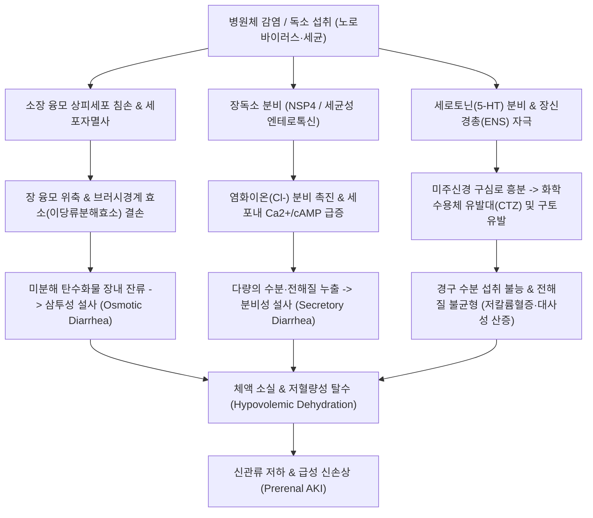

# 🩺 위장염 (Gastroenteritis / 胃腸炎, KCD: K52.9, A08.4, A09)

> **핵심 3줄 요약 (Key Summary)**:
> - 📍 **병소 부위 & 병태생리**: 위([[위]]) 및 소장([[십이지장]]·공장·회장) 점막의 급성 염증으로 바이러스([[노로바이러스]]·[[로타바이러스]]), 세균 또는 독소에 의해 융모 상피세포 손상, 미세융모 브러시경계 흡수 결손, 분비 촉진(cAMP/cGMP 경로) 및 장신경총 자극으로 삼투성·분비성 설사와 급성 구토가 유발됨.
> - 🚩 **전형적 임상 양상 & 3대 징후**: 급성 발열·오심, 분출성 구토, 다량의 수양성 설사(브리스톨 척도 6~7형), 경련성 복통 및 체액 소실로 인한 탈수 징후(구강 점막 건조, 피부 긴장도 저하, 핍뇨, 기립성 어지럼증).
> - 🛠️ **핵심 감별 & 한·양방 치료 전략**: 급성 충수염([[충수염]]), 장폐색([[장폐색]]), 독소형 식중독 감별. 치료의 핵심은 수액 및 전해질 균형 교정([[ORS 경구수액요법]])이며, 한의 치료에서는 [[중완]](CV12)·[[천추]](ST25)·[[족삼리]](ST36) 침구 치료와 비위습열·한습곤비 변증에 따른 [[곽향정기산]], [[위령탕]], [[평위산]], [[오령산]] 투여로 점막 회복을 촉진함.
> - ⚠️ **응급 의뢰 레드플래그**: 지속적 구토로 경구 수액 섭취 불능, 24시간 이상의 무뇨/핍뇨, 저혈압성 쇼크, 의식 저하, 다량의 혈변·흑변, 고열(>38.5℃) 동반 패혈증 의심 소견 시 즉시 상급병원 응급의뢰.

---

## 📌 목차
1. [질환 개요 & 병태생리 (Disease Overview)](#1-질환-개요--병태생리-disease-overview)
2. [병태생리 메커니즘 & 대사·장기부전 악순환 네트워크](#2-병태생리-메커니즘--대사장기부전-악순환-네트워크)
3. [임상 증상 & 환자 소견 (Clinical Presentation)](#3-임상-증상--환자-소견-clinical-presentation)
4. [감별 진단 매트릭스 (Differential Diagnosis)](#4-감별-진단-매트릭스-differential-diagnosis)
5. [한의 통합 치료 프로토콜 (침·약침·한약)](#5-한의-통합-치료-프로토콜-침약침한약)
6. [양방 치료 & 병용·의뢰 기준 (Conventional Treatment & Referral)](#6-양방-치료--병용의뢰-기준-conventional-treatment--referral)
7. [식이·생활습관 & 자가관리 티칭 가이드](#7-식이생활습관--자가관리-티칭-가이드)
8. [💡 진료실 핵심 필기 & 임상 노하우](#8--진료실-핵심-필기--임상-노하우)
9. [출처 및 학술 참고 문헌 (References)](#9-출처-및-학술-참고-문헌-references)

---

## 1. 질환 개요 & 병태생리 (Disease Overview)

![[위장염_01_위장관염증도해.png|450]]
> [그림 1: ① 질병 개요 도해 — 위 및 소장 점막의 광범위한 염증과 융모 상피 손상에 의한 소화흡수 장애 및 급성 복통 병소 — Wikimedia Commons(CC BY-SA)]

* **질환 정의 및 분류**:
  * **위장염(Gastroenteritis)**은 위(Stomach)와 소장(Small intestine)의 점막에 발생하는 급성 염증성 질환군을 통칭하며, 임상적으로 급격한 오심, 구토, 설사, 복부 경련통을 주소로 한다.
  * **원인별 분류**:
    * **바이러스성 위장염 (Viral Gastroenteritis)**: 전체 급성 위장염의 70% 이상을 차지하며, 성인 호발의 [[노로바이러스]](Norovirus), 영유아 호발의 [[로타바이러스]](Rotavirus), 아데노바이러스, 아스트로바이러스 등이 대표적이다.
    * **세균성/독소형 위장염 (Bacterial/Toxigenic)**: 캄필로박터, 살모넬라, 황색포도상구균 장독소, 바실루스 세레우스, 장독소성 대장균(ETEC) 등에 의해 발생한다.
    * **비감염성 위장염 (Non-infectious)**: 약물 부작용([[NSAIDs]], 항암제), 독소 섭취, 식품 알레르기, 호산구성 위장염 등에 기인한다.
* **관련 장기 및 계통**:
  * **주 이환 장기**: [[위]](위점막 염증 및 위운동 마비에 따른 급성 구토), [[십이지장]] 및 공장·회장(융모 상피세포 탈락에 의한 흡수부전 및 분비 과다).
  * **연관 조절계**: 장신경계(ENS / Auerbach & Meissner 얼기), [[미주신경]](구토 중추 자극 반사), 수분·전해질 평형계(Renin-Angiotensin-Aldosterone Axis).

---

## 2. 병태생리 메커니즘 & 대사·장기부전 악순환 네트워크

![[위장염_02_노로바이러스미세구조.png|450]]
> [그림 2: ② 병태생리 구조도 — 겨울철 급성 위장염의 주요 원인체인 노로바이러스(Norovirus)의 캡시드 미세구조 — CDC Public Health Image Library(Public Domain)]

![[위장염_02_로타바이러스구조도해.png|420]]
> [그림 3: ③ 병태생리 구조도 — 장세포 손상 및 엔테로톡신(NSP4)을 분비하여 분비성 설사를 유발하는 로타바이러스 구조 — Wikimedia Commons(CC BY-SA)]

### 1) 분자·세포 수준 기전
* **상피세포 파괴 및 흡수 표면 결손 (삼투성 기전)**:
  * 노로바이러스와 로타바이러스는 소장 융모 끝(Villous tip)의 성숙한 장세포(Enterocyte)를 선택적으로 감염시켜 세포자멸사(Apoptosis)를 유도한다.
  * 융모가 위축되고 편평화되면서 락타아제(Lactase) 등 이당류 분해효소 활성이 급감하여 흡수되지 않은 당류가 장관 내 삼투압을 높여 수분을 장강 내로 끌어당긴다(Carlson et al., 2024).
* **장독소 및 신호전달계 활성화 (분비성 기전)**:
  * 로타바이러스의 비구조단백질 NSP4 또는 세균성 엔테로톡신은 세포내 칼슘 농도를 증가시키고 cAMP/cGMP 경로를 과활성화한다.
  * 이는 음와세포(Crypt cell)의 CFTR 채널을 통한 염화이온($Cl^-$) 및 수분 분비를 극대화하여 능동적 수양성 설사를 촉발한다.
* **5-HT 분비와 구토 반사 회로**:
  * 장점막 장크롬친화성 세포(EC cell)에서 세로토닌([[세로토닌]], 5-HT)이 대량 분비되어 미주신경 5-$HT_3$ 수용체를 자극, 연수의 화학수용체 유발대(CTZ)와 구토중추를 흥분시켜 격렬한 역연동 및 구토를 유발한다.

### 2) 악순환 및 장기 부전 위험
* 심한 구토로 인해 수액을 보충하지 못하는 상태에서 설사로 체중의 5~10%에 달하는 수분과 나트륨, 칼륨, 중탄산염이 소실되면 혈액 농축, 저혈량성 쇼크, 신전성 급성 신부전([[급성신손상]]) 및 대사성 산증으로 이어지는 악순환이 발생한다(Elliott, 2007).

---

## 3. 임상 증상 & 환자 소견 (Clinical Presentation)

![[위장염_03_피부긴장도저하탈수소견.png|350]]
> [그림 4: ④ 환자 임상 소견 — 중등도 이상 탈수 환자의 복부 피부를 집어 올렸을 때 원래대로 돌아가지 않는 피부 긴장도 저하(Skin tenting sign) — Wikimedia Commons(Public Domain)]

![[위장염_03_브리스톨대변형태척도.png|450]]
> [그림 5: ⑤ 검사 평가 도구 — 급성 위장염 환자에서 관찰되는 브리스톨 대변 척도 Type 6(형태 없는 진흙변) 및 Type 7(완전 수양성 액체변) — Wikimedia Commons(CC BY-SA)]

### 1) 주소증 및 핵심 증상
* **구토와 오심**: 발병 초기 1~2일간 두드러지며, 특히 노로바이러스 감염 시 섭취하는 즉시 분출성으로 토해내는 양상을 보인다.
* **수양성 설사 (Watery Diarrhea)**: 1일 수 회에서 10회 이상 묽은 물변을 배설하며, 점액이나 혈액이 섞이지 않는 것이 바이러스성/독소형의 특징이다.
* **경련성 복통 (Cramping Abdominal Pain)**: 배꼽 주위 또는 하복부 전체의 쥐어짜는 듯한 산통(Colicky pain)이 배변 전후로 악화 및 일시 완화된다.
* **전신 증상**: 미열(37.5~38.5℃), 두통, 근육통, 무기력감.

### 2) 객관적 소견 (Signs & Labs)
* **신체 진찰 및 탈수도 평가 (Dehydration Assessment)**:
  * **경증 탈수 (체중 3~5% 감소)**: 구강 점막 약간 건조, 갈증 호소, 활력징후 정상.
  * **중등도 탈수 (체중 6~9% 감소)**: 피부 긴장도 저하(집어 올린 피부가 2초 이상 서 있음), 안구 함몰, 빈맥, 소변량 현저한 감소.
  * **중증 탈수 (체중 ≥10% 감소)**: 의식 혼미, 기립성 저혈압, 무뇨, 말초 청색증.
* **복부 진찰**: 복부 전반에 경미한 압통이 있으나 복벽 강직(Rigidity)이나 반발통(Rebound tenderness)은 관찰되지 않음. 장음은 항진(Hyperactive bowel sounds).
* **임상병리 검사**:
  * 혈액 검사: BUN/Cr 상승(BUN/Cr 비 > 20으로 신전성 질소혈증 시사), 저칼륨혈증($K^+ < 3.5mEq/L$).
  * 대변 검사: 단순 위장염은 대변 백혈구(WBC) 음성이며, 고위험군이나 7일 이상 지속 시 다중 PCR(Multiplex stool PCR)로 노로·로타·클로스트리디움 감별.

---

## 4. 감별 진단 매트릭스 (Differential Diagnosis)

| 감별 질환 | 특징적 양상 | 감별 포인트 (소견·검사) |
| :--- | :--- | :--- |
| **급성 위장염 (Gastroenteritis)** | 구토 선행 후 다량의 수양성 설사, 미열, 복부 전반 압통 | **반발통 없음, 장음 항진**, 자연 치유 경향(2~5일) |
| 급성 충수염([[충수염]]) | 심와부 둔통으로 시작하여 우하복부(McBurney점) 국소 고정통 | **우하복부 반발통·근성 방어**, 설사 드묾, 복부 초음파/CT |
| 장폐색증([[장폐색]]) | 극심한 복부 팽만, 구토(담즙성/분변성), **가스 및 배변 배출 완전 중단** | 단순 복부 X-선 상 다발성 수액-공기 층(Air-fluid level) |
| 염증성 장질환([[궤양성 대장염]]) | 수주 이상 지속되는 만성 설사, **혈변·점액변**, 이급후중 | 대장내시경 상 연속적 점막 궤양, 대변 칼프로텍틴 상승 |
| 급성 췌장염([[급성 췌장염]]) | 상복부의 등 쪽으로 방사되는 극심한 지속통, 지속적 오심·구토 | 혈청 아밀라아제/리파아제 3배 이상 상승, 복부 CT |

> 🚩 **레드플래그 감별 (응급 외과 질환)**:
> - 복통이 배변 후에도 전혀 호전되지 않고 국소화되거나 반발통이 나타나면 외과적 급복증(Acute abdomen)을 의심하여 즉시 외과 전원.

---

## 5. 한의 통합 치료 프로토콜 (침·약침·한약)

![[위장염_05_복부혈위중완천추도해.png|420]]
> [그림 6: ⑥ 한의 치료 도해 — 급성 위장관 진통, 진토 및 지사 작용을 발휘하는 복모혈(중완·천추) 및 임맥·위경 혈위도 — Wellcome Collection(CC BY)]

### 1) 한의 변증 분류 (Syndrome Differentiation)
* **한습곤비(寒濕困脾) / 한습설사(寒濕泄瀉)**: 맑은 물변, 복통 즉시 설사, 배가 차고 꾸룩거림, 구토, 설담태백니(舌淡苔白膩), 맥유완(脈濡緩).
* **습열중저(濕熱中阻) / 습열설사(濕熱泄瀉)**: 설사 시 복통과 항문 작열감, 냄새가 지독한 황갈색 수양변, 번갈, 소변단적, 설홍태황니(舌紅苔黃膩), 맥활삭(脈滑數).
* **식체위장(食滯胃腸) / 상식설사(傷食泄瀉)**: 과식이나 상한 음식 섭취 후 복통창만, 트림 시 부패한 냄새, 설사 후 복통 일시 완화, 설태후니, 맥활활(脈滑).
* **비위허약(脾胃虛弱) / 만성 비허설사**: 급성기 후 설사가 멎지 않고 묽은 변 지속, 식욕부진, 권태, 안색위황.

### 2) 침구 치료 (Acupuncture Protocol)
* **주혈**: [[중완]](CV12), [[천추]](ST25), [[족삼리]](ST36), [[상거허]](ST37), [[내관]](PC6).
* **배혈**:
  * 구토 우세 시: [[내관]](PC6), [[공손]](SP4) 위주 자침(미주신경 진토 반사 조절).
  * 설사 및 복통 우세 시: 양측 [[천추]](ST25), [[상거허]](ST37), [[음릉천]](SP9).
  * 한습 증상 심할 시: [[신궐]](CV8), [[중완]](CV12) 부위에 간접구(뜸 요법) 적용(장관 평활근 경련 완화).
* **시술 방법**: 호침 자침 후 평보평사 또는 사법(瀉法), 유침 20~30분. 전침 적용 시 2Hz 저주파로 복통 경련 완화.

### 3) 한약 치료 (Herbal Medicine)

| 변증 유형 | 대표 처방 | 구성 약재 핵심 | 현대 약리 기전 및 근거 (참고문헌) |
| :--- | :--- | :--- | :--- |
| **한습곤비 / 외감서습** | [[곽향정기산]](藿香正氣散) | [[곽향]], [[소엽]], [[백지]], [[대복피]], [[백출]], [[후박]], [[반하]], [[진피]] | 장점막 염증 억제, 장관 평활근 경련 진정 및 바이러스성 장염 증상 단축. 메타분석에서 양약 병용 시 총유효율 대폭 향상(Yu et al., 2019; 하단 문헌 3번). |
| **습열중저** | [[갈근황련황금탕]](葛根黃芩黃連湯) | [[갈근]], [[황련]], [[황금]], [[감초]] | 장내 병원성 세균 억제, 엔도톡신 중화, CFTR 매개 분비성 수분 유출 차단. |
| **수습정체 / 복통수설** | [[위령탕]](胃苓湯) / [[오령산]](五苓散) | [[창출]], [[후박]], [[진피]], [[택사]], [[복령]], [[저령]], [[백출]], [[육계]] | 장관 상피세포 아쿠아포린(Aquaporin, AQP) 수분 채널 발현 조절을 통한 장내 과잉 수분 재흡수 촉진. |
| **식체상식** | [[평위산]](平胃散) 가미방 | [[창출]], [[후박]], [[진피]], [[감초]], [[신곡]], [[맥아]], [[산사]] | 소화효소 분비 자극 및 위배출 촉진, 장내 이상 발효 가스 제거. |

---

## 6. 양방 치료 & 병용·의뢰 기준 (Conventional Treatment & Referral)

### 1) 양방 보존적 치료
* **경구 수액 요법 (Oral Rehydration Therapy, ORT)**:
  * 급성 위장염 치료의 제1원칙(Riddle et al., 2016).
  * 나트륨과 포도당의 1:1 결합 흡수(SGLT-1 수송체)를 이용하여 장점막 손상 상태에서도 수분을 체내로 능동 흡수시킴.
* **약물 치료**:
  * **진토제 (Antiemetics)**: 구토가 극심하여 경구 수액을 마시지 못할 때 [[온단세트론]](Ondansetron, 5-$HT_3$ 길항제) 단회 투여(구토 억제 후 경구 수액 재개 유도).
  * **지사제 (Antidiarrheals) 주의점**:
    * [[로페라미드]](Loperamide): 장운동 억제제로 단순 경증 설사에만 제한적 사용. ⚠️ 고열이나 혈변이 동반된 침습성 장염 환자에게 투여 시 독소 배출을 막아 중독성 거대결장(Toxic megacolon)을 유발하므로 절대 금기.
  * **항생제 사용 기준**: 단순 바이러스성 위장염에는 항생제를 일절 투여하지 않음. 혈변이나 고열 동반 패혈증 시에만 Ciprofloxacin, Azithromycin 고려.

### 2) 한·양방 병용 판단 가이드
* **병용 권장**: 양방 ORS 수액으로 탈수를 교정하면서, 한약([[곽향정기산]] 또는 [[위령탕]])을 병용하면 설사 기간을 1~2일 이상 단축시키고 장 점막 회복을 촉진함.
* **의뢰 기준 (Referral Criteria)**:
  * 3일 이상 지속되는 고열(>38.5℃), 혈변, 심한 구토로 ORS 섭취 불가, 수축기 혈압 90mmHg 미만의 저혈량 쇼크 의심 시 상급병원 응급실 즉시 의뢰.

---

## 7. 식이·생활습관 & 자가관리 티칭 가이드

![[위장염_07_경구수액제ORS제제.png|450]]
> [그림 7: ⑦ 자가관리 티칭 — 탈수 예방을 위한 표준 경구 수액(ORS) 제제 실사 — Wikimedia Commons(CC BY-SA)]

* **자가 경구 수액(ORS) 제조 및 복용법**:
  * 약국 판매용 ORS 분말을 물 1L에 녹여 마시거나, 비상 시 **물 1L + 소금 반 티스푼(약 2.5g) + 설탕 6티스푼(약 30g)**을 배합하여 마심.
  * 구토를 자극하지 않도록 한 번에 벌컥벌컥 마시지 말고, **티스푼이나 숟가락으로 5분마다 1~2모금씩** 천천히 마시도록 교육함.
* **단계별 식이 재개 (BRAT 식단 등)**:
  * 구토가 멎은 후 4~6시간 뒤부터 부드러운 유동식(쌀미음, 숭늉)으로 시작.
  * 바나나(Banana), 쌀죽(Rice), 사과소스(Applesauce), 토스트(Toast) 등 저자극·저잔류 식단을 소량씩 섭취.
  * **금지 식품**: 우유 및 유제품(이당류 분해효소 결손으로 2차 유당불내증 유발), 탄산음료·과일주스(과도한 단순당으로 삼투성 설사 악화), 기름진 튀김류, 카페인.
* **감염 예방 수칙**:
  * 노로바이러스는 알코올 소독제에 저항성이 있으므로, 반드시 **흐르는 물에 비누로 30초 이상 손 씻기**.
  * 오염된 의류 및 변기는 희석된 염소계 소독제(락스 희석액 1,000ppm)로 소독.

---

## 8. 💡 진료실 핵심 필기 & 임상 노하우

* **실전 문진 체크리스트**:
  1. *"언제부터 시작되었습니까? 함께 식사한 가족이나 동료 중 같은 증상이 있는 분이 있습니까?"* (집단 식중독 및 감염원 확인).
  2. *"변에 피가 섞여 나오거나 자장면 색깔의 검은 변을 보셨습니까?"* (침습성 장염 및 상부위장관 출혈 감별).
  3. *"소변을 마지막으로 보신 게 몇 시간 전입니까?"* (탈수 상태 파악: 8시간 이상 무뇨 시 즉시 수액 요법 필요).
* **한의 1차 진료실 비상 처방 노하우**:
  * 갑작스러운 오한, 복통, 토사를 동반한 위장염 환자에게 곽향정기산 엑스제를 따뜻한 미음이나 연한 숭늉에 타서 소량씩 자주 복용시키면, 구토 반사가 가라앉으면서 복벽 긴장이 급격히 풀림.
  * 설사가 심해 항문부가 헐고 화끈거릴 때는 황련·황백 전탕액으로 좌욕 또는 외용 티칭.

---

## 9. 출처 및 학술 참고 문헌 (References)

1. **Riddle MS, DuPont HL, Connor BA, et al. (2016)**. ACG Clinical Guideline: Diagnosis, Treatment, and Prevention of Acute Diarrheal Infections in Adults. *Am J Gastroenterol*, 111(5):602-22. [PMID 27068718](https://pubmed.ncbi.nlm.nih.gov/27068718/)
   - **[연구 요약]**: 미국소화기학회(ACG)의 성인 급성 설사 질환 공식 진단·치료 가이드라인으로 탈수 평가, 경험적 항생제 사용 제한 및 경구 수액 요법의 표준 지침 제시.
2. **Elliott EJ (2007)**. Acute gastroenteritis in children. *BMJ*, 334(7583):35-40. [PMID 17204802](https://pubmed.ncbi.nlm.nih.gov/17204802/)
   - **[연구 요약]**: 급성 위장염의 임상적 병태생리, 체액 결손율에 따른 탈수도 단계 평가법 및 경구 수액 보충 요법(ORT)의 임상적 근거 리뷰.
3. **Yu DD, Li M, Liao JQ, et al. (2019)**. [Systematic review and Meta-analysis of Huoxiang Zhengqi Pills combined with Western medicine for acute gastroenteritis]. *Zhongguo Zhong Yao Za Zhi*, 44(14):2914-2925. [PMID 31602833](https://pubmed.ncbi.nlm.nih.gov/31602833/)
   - **[연구 요약]**: 급성 위장염에 대한 곽향정기제제와 양약 병용 요법의 체계적 문헌고찰 및 메타분석으로 단독 치료 대비 임상 증상 완화 시간 단축 및 치료 유효율의 유의한 개선 입증.
4. **Lai BY, Robinson N, Zhou J, et al. (2018)**. Pediatric Tui Na for acute diarrhea in children under 5 years old: A systematic review and meta-analysis of randomized clinical trials. *Complement Ther Med*, 41:10-22. [PMID 30477824](https://pubmed.ncbi.nlm.nih.gov/30477824/)
   - **[연구 요약]**: 급성 설사 환아에 대한 한의 소아 추나 및 혈위 수기요법의 메타분석으로 설사 빈도 감소 및 장관 기능 회복에 대한 임상적 유효성과 안전성 확인.
5. **Carlson KB, Neill FH, Estes MK, et al. (2024)**. A narrative review of norovirus epidemiology, biology, and challenges to vaccine development. *NPJ Vaccines*, 9(1):101. [PMID 38811605](https://pubmed.ncbi.nlm.nih.gov/38811605/)
   - **[연구 요약]**: 급성 위장염의 최다 원인 병원체인 노로바이러스의 감염 경로, 장 상피세포 결합 및 손상 분자생물학적 기전, 면역 반응 총괄 리뷰.

---

## 관련 노트

- [[위]]
- [[십이지장]]
- [[충수염]]
- [[장폐색]]
- [[궤양성 대장염]]
- [[급성 췌장염]]
- [[곽향정기산]]
- [[위령탕]]
- [[평위산]]
- [[오령산]]
- [[중완]]
- [[천추]]
- [[족삼리]]
- [[내관]]
