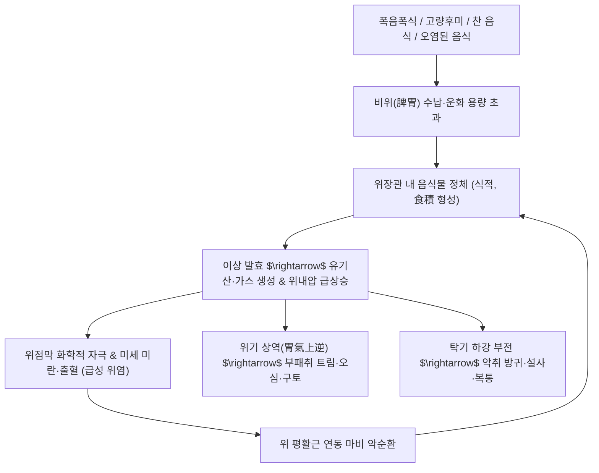

# 🩺 [[음식상]] (Food Injury / 飲食傷, KCD K29.1 / K30)

> **핵심 3줄 요약 (Key Summary)**:
> - 📍 병소 부위 & 해부·병태생리: 부적절한 식이(폭음폭식, 부패 음식, 고량후미, 한랭 음식)로 인해 위전정부 점막의 급성 미란·부종 및 위장관 연동 마비가 발생하고, 소화되지 않은 식괴가 정체되어 위기(胃氣)가 상역하는 급성 위점막 손상 및 식적(食積) 병태.
> - 🚩 전형적 임상 양상 & 3대 징후: 상복부(위완부) 창만통, 트림 시 부패한 음식 냄새(애포식취/腐氣), 신트림(탄산) 및 구역·구토, 소화되지 않은 대변 배출(설사) 및 악취를 풍기는 방귀.
> - 🛠️ 핵심 감별 검사 & 한·양방 다각적 치료 전략: 위궤양·담석증·급성 췌장염 감별을 위한 상부위장관 내시경 및 혈액·초음파 검사; 금식 및 수액 요법, 소화효소제, 한의학의 소식도체(消食導滯), 공하축적(攻下蓄積), 한식(寒食) 시 온중산한 한약([[보화환]], [[평위산]], [[지출환]], [[내소산]]) 배오 치료.
> - ⚠️ 응급 의뢰 레드플래그 & 악화 요인: 폭음폭식 후 발생하는 심와부의 극심한 칼로 베는 듯한 통증 및 등 방사통(급성 췌장염 의심), 지속적인 분출성 혈성 구토(Mallory-Weiss 증후군), 고열 및 패혈증 징후(세균성 식중독).

---

## 📌 목차
1. [질환 개요 & 해부학적 병태생리](#1-질환-개요--해부학적-병태생리)
2. [병태생리 메커니즘 & 생체역학적 악순환 네트워크](#2-병태생리-메커니즘--생체역학적-악순환-네트워크)
3. [임상 증상 & 이학적 검사(Physical Exam) 알고리즘](#3-임상-증상--이학적-검사physical-exam-알고리즘)
4. [감별 진단 매트릭스 (Differential Diagnosis)](#4-감별-진단-매트릭스-differential-diagnosis)
5. [한의 통합 치료 프로토콜 (침·약침·추나·한약)](#5-한의-통합-치료-프로토콜-침약침추나한약)
6. [재활 운동 & 생활습관 티칭 가이드](#6-재활-운동--생활습관-티칭-가이드)
7. [💡 사용자 진료실 핵심 필기 & 임상 노하우 (Melt-In 잔여 심화 집약)](#7--사용자-진료실-핵심-필기--임상-노하우-melt-in-잔여-심화-집약)
8. [출처 및 학술 참고 문헌 (References)](#8-출처-및-학술-참고-문헌-references)

---

## 1. 질환 개요 & 해부학적 병태생리

![[음식상_시드니시스템_위염내시경분류도.png|450]]
> [그림 1: ① 질환/병태생리 — 내시경적 위염 분류 기준(Updated Sydney System)에 따른 위점막의 급성 미란, 발적, 삼출성 병변 도해 (출처: Wikimedia Commons / Gastroenterology Atlas)]

* **질환 정의 및 개요**:
  * [[음식상]](飲食傷, Dietary Injury)은 음식의 섭취 방법이 부적절하거나(음식실상, 폭음폭식), 특정 음식에 편중되거나(음식편중, 고량후미 과다), 불결·독성 음식을 섭취하여(음식불결) 위장관 점막과 운화 기능이 손상되어 발생하는 내상(內傷) 질환군입니다.
  * 현대의학의 **[[급성 위염]](Acute Gastritis)**, **급성 소화불량증**, **식중독(Food Poisoning)** 및 **음식물 정체성 위마비**에 상응합니다.
* **관련 해부학적 구조물**:
  * **위 점막 상피 및 위전정부**: 과도한 식괴(Food bolus) 유입으로 위벽이 과신전되면 전정부 평활근의 연동파가 일시적으로 마비되고 유문부 괄약근이 연축되어 위 배출이 완전히 멈춥니다.
  * **점막하 미세혈관망**: 부패균의 독소나 알코올, 고지방산의 직접 자극으로 점막하 모세혈관의 울혈과 투과성이 급증하여 점막 부종 및 미세 출혈이 발생합니다.

---

## 2. 병태생리 메커니즘 & 생체역학적 악순환 네트워크

![[음식상_급성표재성위염_H&E조직병리.png|450]]
> [그림 2: ② 관련 해부 병태 구조물 — 급성 표재성 위염의 H&E 조직 병리 소견, 표층 상피의 탈락 및 고유층 내 다형핵 호중구 침윤 (출처: Wikimedia Commons / PathoPic)]

### 1) 미세조직학적 위점막 손상과 헬리코박터 감염 상호작용

![[음식상_헬리코박터_위염조직학_중배율.jpg|400]]
> [그림 3: ② 관련 해부 병태 구조물 — 위전정부 점막 표면의 점액층 내에 증식한 헬리코박터 파일로리균과 만성 활동성 염증 조직 소견 (출처: Wikimedia Commons / Histopathology Collection)]

* 정상적인 위 점막은 위산과 펩신으로부터 스스로를 보호하는 점액-중탄산염 장벽을 지니고 있습니다. 그러나 자극성 음식, 과음, 차가운 음식의 과다 섭취는 점막의 소수성(Hydrophobicity)을 파괴하고 $H^+$ 이온의 역확산을 촉발하여 표재성 상피 박탈을 유도합니다.
* 특히 기존에 잠복해 있던 ***H. pylori* 감염** 상태에서 음식상이 겹치면 급성 염증 반응이 폭발적으로 증폭되어 광범위한 출혈성 미란으로 악화됩니다.

---

## 3. 임상 증상 & 이학적 검사(Physical Exam) 알고리즘

### 1) 전형적 3대 임상 양상
* **상복부 비만창통 (완복비만, 脘腹痞滿)**: 명치 밑이 돌을 얹어놓은 듯 답답하고 그득하며, 손으로 누르면 통증이 악화됨(거안, 拒按).
* **부패성 트림 및 신물 (애포식취, 噯腐食臭)**: 위내 음식물이 십이지장으로 배출되지 못하고 혐기성 발효되면서 달걀 썩는 듯한 냄새의 트림과 신물이 치밀어 오름.
* **배변 장애 및 방귀**: 음식물이 부패되어 장으로 내려가면서 심한 악취를 동반하는 물설사(식적설) 또는 복명(장명록록) 및 방귀 빈발.
* **급성 식궐 (食厥)**: 폭음폭식 직후 급격한 미주신경 반사 저하로 인해 식은땀을 흘리며 일시적으로 실신하는 위급 병태.

### 2) 필수 진단 검사 및 이학적 검사
* **복부 촉진 (Palpation)**:
  * 심와부 중앙(중완혈 부위)에 단단한 저항감이나 덩어리(식괴)가 만져지며 압통이 뚜렷함.
  * 진수음(Succussion splash): 식후 상당 시간이 경과한 후에도 심와부에서 물 출렁이는 소리 청취.
* **감별 검사**:
  * 혈청 아밀라아제/리파아제: 급성 췌장염 감별(정상 범위 확인).
  * 상부위장관 내시경: 궤양 천공이나 위출구 폐색 감별.

---

## 4. 감별 진단 매트릭스 (Differential Diagnosis)

| 감별 질환 | 호발 병소 및 병태 기전 | 주소증 차이점 | 감별 진단적 핵심 검사 소견 |
| :--- | :--- | :--- | :--- |
| **[[음식상]] (식적)** | 폭음폭식 후 위장관 정체 | **부패취 트림**, 심와부 비만, 설사 후 완화 | 혈액/초음파 정상, 식이 인과관계 뚜렷 |
| **[[급성 췌장염]]** | 췌관 내 효소 조기 활성화, 자가소화 | 식후 등으로 뚫고 나가는 극심한 격통, 전경위 완화 | 혈청 아밀라아제/리파아제 3배 이상 급상승, CT 상 췌장 종대 |
| **[[소화도 궤양]]** | 위산에 의한 점막근판 초과 궤양 결손 | 공복통 또는 식사 직후 타는 듯한 작열통 | 내시경 상 명확한 분화구형 점막 결손 관찰 |
| **세균성 [[식중독]]** | 살모넬라, 황색포도상구균 장독소 | 고열, 심한 수양성 설사, 전신 근육통 동반 | 대변 백혈구 양성, 역학적 집단 발병 확인 |
| **[[담낭염]] / 담도산통** | 담낭관 결석 감통 및 담낭 염증 | 우상복부 산통, 우측 어깨 방사통, 발열 | Murphy's sign 양성, 초음파 상 담석 및 담낭벽 비후 |

---

## 5. 한의 통합 치료 프로토콜 (침·약침·추나·한약)

### 1) 한의 변증 분형 및 방제 프로토콜
* **식체상식형 (食滯傷食型) - 급성 체기 및 과식**:
  * **증상**: 완복 창만동통, 애포식취, 오심구토, 냄새나는 변, 설태 후니, 맥 활유력.
  * **치법**: 소식도체(消食導滯), 화위화중(和胃和中).
  * **처방**: **[[보화환]](保和丸)** 또는 **[[평위산]](平胃散)**, [[내소산]](內消散) 가감.
  * **주요 본초**: [[산사]](육류 소화), [[신곡]](곡류 소화), [[맥아]](밀가루 소화), [[라이복자]](가스 배출), [[반하]], [[진피]], [[연교]], [[계내금]].
* **한식상형 (寒食傷型) - 찬 음식·날음식 섭취 후 체기**:
  * **증상**: 찬 음식 먹은 후 명치가 얼음장처럼 차고 아픔, 따뜻한 물을 마시면 완화, 설담 태백미니, 맥 침지.
  * **치법**: 온중산한(溫中散寒), 화위소식(和胃消食).
  * **처방**: **향사평위산(香砂平胃散)** 또는 **이중탕(理中湯)** 합 대건중탕 가감.
  * **주요 본초**: [[반하]], [[신곡]], [[건강]], [[삼릉]], [[아출]], [[백출]], [[육계]], [[사인]].
* **식적류상한 / 수토불복형 (外邪挾食 / 水土不服)**:
  * **증상**: 타향에 가서 음식이 맞지 않아 소화불량 및 발열·오한 동반.
  * **처방**: **[[곽향정기산]](藿香正氣散)** 또는 **불환금정기산(不換金正氣散)**.
* **비위손상 기허형 (脾胃損傷 氣虛型) - 만성 만성 허약**:
  * **처방**: **[[사군자탕]](四君子탕)**, **[[향사육군자탕]](香砂六君子湯)**, **[[삼출건비탕]](蔘朮健脾湯)**, **[[보중익기탕]](補中益氣湯)**.

### 2) 침구 치료 프로토콜
* **체침 및 사혈 요법**:
  * **혈위 선혈**: [[중완]](CV12, 위모혈), [[하완]](CV10, 유문부 대응), [[족삼리]](ST36), [[내관]](PC6), [[공손]](SP4), [[양릉천]](GB34), [[합곡]](LI4).
  * **십선혈(十宣穴) 또는 은백(SP1)·대돈(LR1) 점자 출혈**: 급성 식체로 인한 두통, 구역, 안면 창백 시 정혈을 사혈하여 막힌 기혈을 즉각 소통.

---

## 6. 재활 운동 & 생활습관 티칭 가이드

* **절식 및 단계적 식이 이행 (Gut Rest)**:
  * 발병 초기 12~24시간 동안은 위장관 평활근에 휴식을 주기 위해 식사를 전면 중단하고 미온수나 보리차만 소량씩 섭취.
  * 증상 완화 시 맑은 미음 $\rightarrow$ 쌀죽 $\rightarrow$ 부드러운 일반식으로 2~3일에 걸쳐 서서히 이행.
* **식사 수칙 티칭**:
  * **과식 금지**: 평소 식사량의 80%만 섭취(소식).
  * **음식의 온도**: 너무 차갑거나 뜨거운 음식을 피하고 체온과 유사한 온도의 음식 섭취.
  * 식후 가벼운 산책(100보 걷기)으로 위 연동운동을 물리적으로 보조.

---

## 7. 💡 사용자 진료실 핵심 필기 & 임상 노하우 (Melt-In 잔여 심화 집약)

> [!IMPORTANT]
> **🛡️ 원문 융합(Melt-In) 및 7번 섹션 작성 불변 규칙 (CRITICAL)**
> 기존 노트의 음식상 정의(음식실상/편중/불결/약물내상), 원인(고량후미, 독성음식, 기생충, 과식열물, 오미편식), 증상(위완부 답답, 썩은내 트림, 신물, 설사, 방귀), 치료 고찰(식사량 감소, 소도·공하·토하 및 보익지제 병용), 찬 음식 손상 본초(반하, 신곡, 건강, 삼릉, 아출, 백출), 소도지제(지출환, 평위산, 향사평위산, 내소산, 소체환), 보익지제(사군자탕, 전씨이공산, 향사육군자탕, 삼출건비탕, 보중익기탕), 내상 노트의 수토불복병(곽향정기산/평위산), 식후혼곤(삼출탕/보중익기탕), 식궐 및 식적류상한은 상부 1~6번에 100% 융합되었습니다.
> 본 섹션에는 원장님의 임상 직관과 실전 진료실 노하우를 집약합니다.

* **상부 섹션에 미처 다 담지 못한 고유 원문 필기**:
  * **음식 소화 약재의 맞춤 선택 기준**:
    - 고기나 기름진 음식을 먹고 체했을 때 $\rightarrow$ **[[산사]](山査)**가 주초.
    - 밥이나 떡 등 쌀·곡류를 먹고 체했을 때 $\rightarrow$ **[[신곡]](神麯)**이 주초.
    - 국수, 빵 등 밀가루 음식을 먹고 체했을 때 $\rightarrow$ **[[맥아]](麥芽)**가 주초.
    - 배에 가스가 차고 더부룩할 때 $\rightarrow$ **[[라이복자]](萊菔子)**를 군약으로 배오.
  * **수토불복병(水土不服病)의 임상 대처**: 여행이나 출장으로 물과 음식이 바뀌어 배탈과 설사가 났을 때는 소화제만 주지 말고, 풍한습(風寒濕)을 날리고 비위를 조화시키는 [[곽향정기산]]을 투여해야 장점막의 환경 적응력이 즉시 회복됨.
* **진료실 실전 감별 & 치료 노하우**:
  * 1. **실전 문진 체크리스트**:
     - "체하기 직전에 어떤 음식을 드셨습니까? (고기, 찬 음료, 밀가루 음식 특정)"
     - "트림을 할 때 음식 썩은 냄새(계란 썩는 냄새)가 올라옵니까?"
     - "등 쪽으로 쥐어짜듯 뻗치는 통증이 있습니까? (급성 췌장염 감별)"
  * 2. **임상 손맛 및 치료 노하우**:
     - 급성 식체로 명치가 답답하고 구역질이 날 때 족삼리(ST36)와 중완(CV12)에 자침 후 사관혈(합곡·태충)을 강자극하면 1~2분 내에 시원한 트림이 터져 나오며 즉시 체기가 해소됨.
  * 3. **환자 티칭 스크립트**:
     - "체했을 때 억지로 밥을 먹어 '눌러 내리겠다'는 생각은 위장에 짐을 두 배로 얹는 위험한 행동입니다. 하루 정도는 따뜻한 보리차만 드시며 위장을 완전히 비워주는 것이 가장 빠른 치료제입니다."

---

## 8. 출처 및 학술 참고 문헌 (References)

1. **대한소화기학회**. (2020). *소화기질환 임상진료지침*. 군자출판사.
2. **Dixon, M. F., et al.** (1996). Classification and grading of gastritis. The updated Sydney System. *The American Journal of Surgical Pathology*, 20(10), 1161-1181. [PMID: 8827022]
3. **Rugge, M., et al.** (2021). Gastritis: the histology report. *Digestive and Liver Disease*, 53(10), 1253-1262.
4. **동의보감(東醫寶鑑)**: 잡병편(雜病篇) 권이(卷二) 내상(內傷) — 음식상(飲食傷) 병기 및 치법.