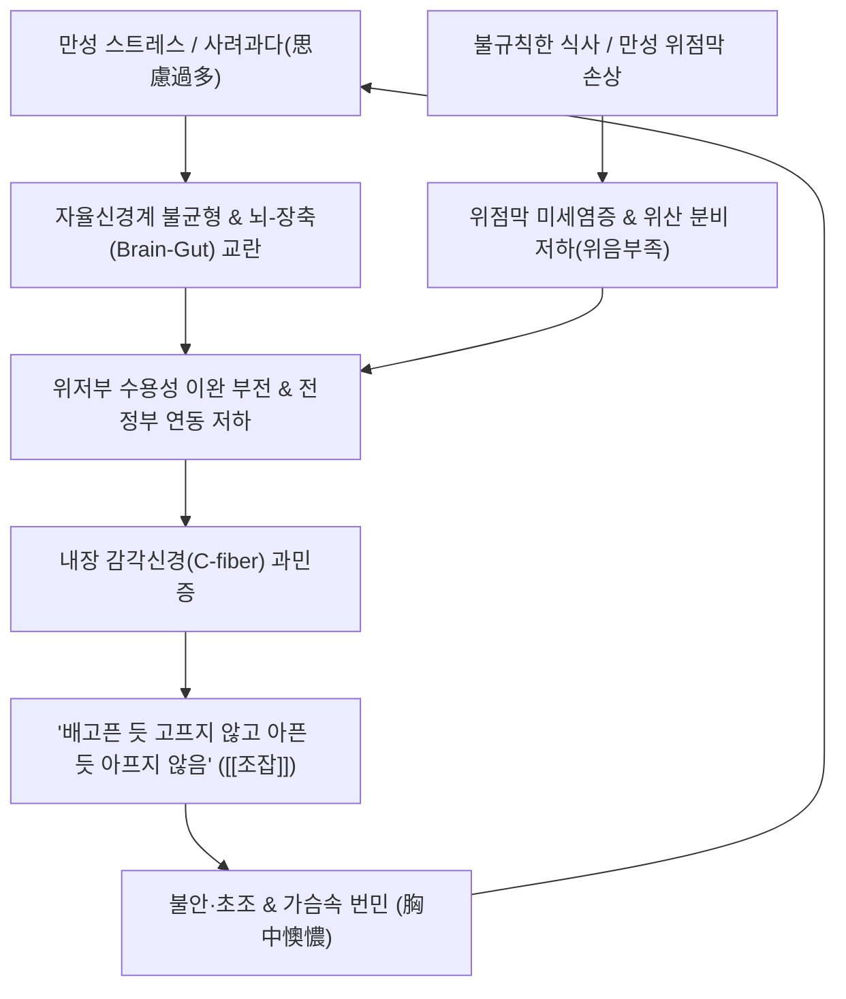

# 조잡 (Epigastric Distress / Dyspeptic Malaise, 嘈雜, K30, R10.1)

> **상위 분류**: [[소화기 질환]] > [[상부위장관 질환]] > [[기능성 위장 장애]]
> **핵심 3줄 요약 (Key Summary)**:
> - 📍 병소 부위 & 해부·병태생리: 위저부(Fundus)와 위체부의 적응성 이완(Gastric accommodation) 부전 및 내장 감각 과민증(Visceral hypersensitivity)으로 인해, 명치(심와부)가 배고픈 것 같으면서도 배고프지 않고, 아픈 것 같으면서도 아프지 않은 형언하기 어려운 불쾌감과 공허감, 가슴속 번민(胸中懊憹)을 느끼는 기능성 상부위장관 병태.
> - 🚩 전형적 임상 양상 & 3대 징후: 환자가 명확히 통증이라 표현하지 못하는 위중공허(胃中空虛)·흉복불쾌감, 트림([[애기]]), 신트림([[탄산]]), 메스꺼움([[오심]]), 헛구역질([[건구]]), 명치 막힘([[심하비]]), [[위완통]] 동반.
> - 🛠️ 핵심 감별 검사 & 한·양방 다각적 치료 전략: 로마 기준 IV(Rome IV) 상부위장관 설문, 상부위장관 내시경(기질적 궤양 배제), 중완(CV12)·족삼리(ST36)·비수(BL20) 자침, 위열증의 [[온담탕]], 위허증의 [[사군자탕]]·[[익위탕]], 혈허증의 [[귀비탕]] 변증 투약.
> - ⚠️ 응급 의뢰 레드플래그 & 악화 요인: 단순 조잡 증상으로 오인하기 쉬운 진행성 위암, 심근허혈(비전형적 심와부 불쾌감), 악성 빈혈, 급격한 체중 감소 동반 시 즉시 내시경 및 심전도 정밀 검사 의뢰.

---

## 📌 목차
1. [질환 개요 & 해부학적 병태생리](#1-질환-개요--해부학적-병태생리)
2. [병태생리 메커니즘 & 생체역학적 악순환 네트워크](#2-병태생리-메커니즘--생체역학적-악순환-네트워크)
3. [임상 증상 & 이학적 검사(Physical Exam) 알고리즘](#3-임상-증상--이학적-검사physical-exam-알고리즘)
4. [감별 진단 매트릭스 (Differential Diagnosis)](#4-감별-진단-매트릭스-differential-diagnosis)
5. [한의 통합 치료 프로토콜 (침·약침·추나·한약)](#5-한의-통합-치료-프로토콜-침약침추나한약)
6. [재활 운동 & 생활습관 티칭 가이드](#6-재활-운동--생활습관-티칭-가이드)
7. [💡 사용자 진료실 핵심 필기 & 임상 노하우 (Melt-In 잔여 심화 집약)](#7--사용자-진료실-핵심-필기--임상-노하우-melt-in-잔여-심화-집약)
8. [출처 및 학술 참고 문헌 (References)](#8-출처-및-학술-참고-문헌-references)

---

## 1. 질환 개요 & 해부학적 병태생리

![[청강의감11_07_조잡_소화불량_이미지.png|500]]
> [그림 1: ① 질환/병태생리 — 조잡(嘈雜)·비만(痞滿)의 상복부 불쾌감 및 식욕 이상 발현 도해] 배고픈 듯하나 먹지 못하고 아픈 듯하나 아프지 않은 심하부 공허감 및 가슴속 오뇌(懊憹) 병태.

- **개념 정의 및 한의 고전문헌적 의미**:
  - [[조잡]](Epigastric Distress / Dyspeptic Malaise, 嘈雜)은 한의학에서 명치 밑이 텅 빈 것처럼 허전하면서 괴롭고, 배가 고픈 것 같으나 음식을 먹고 싶지 않으며, 통증인 것 같으나 명확한 통증은 아니고, 신트림이나 메스꺼움, 가슴 답답함이 복합적으로 얽힌 독특한 증후군을 지칭한다.
  - 현대 의학의 [[기능성 소화불량]](Functional Dyspepsia) 중 **상복부통증증후군(Epigastric Pain Syndrome, EPS)** 및 식후불쾌감증후군(PDS)의 중간 아형, 또는 만성 위축성 위염에서의 저위산증(Hypochlorhydria) 환자가 호소하는 상복부 불쾌감과 정확히 일치한다.
- **해부학적 구조와 위장 신경총**:
  - 위벽의 점막하층에는 마이스너 신경총(Meissner's submucosal plexus)이, 근육층 사이에는 아우어바흐 근층간신경총(Auerbach's myenteric plexus)이 뇌-장축(Brain-Gut Axis)을 통해 미주신경 및 교감신경과 연결되어 있다.
  - 조잡은 위벽 평활근의 긴장도가 비정상적으로 요동치거나, 점막 수용기가 경미한 기계적·화학적 자극에도 과도하게 반응하는 장신경계(ENS) 신호 이상에 기인한다.

---

## 2. 병태생리 메커니즘 & 생체역학적 악순환 네트워크

![[위 기능성 소화불량(소화와 흡수)-20241107085512416.jpg|500]]
> [그림 2: ② 관련 해부 구조물 — 위저부 적응성 이완(Gastric Accommodation) 장애 및 미주신경-내장 감각 과민 네트워크] 위 벽내 신전수용기 감작 및 위장관 신경얼기 기능부전.

### 1) 내장 감각 과민과 감각 착오 기전
- **위산 상태의 불균형**: 위산 과다로 산성 자극이 점막을 침식하는 [[탄산]](呑酸)과 달리, 조잡은 위 점막의 분비선 위축이나 기능 저하로 인해 **위산이 부족(Hypoacidity)**하거나, 점막 장벽이 얇아져 정상 수준의 생리적 자극에도 통증과 공허감을 착오 인식하는 상태이다.
- **적응성 이완 장애**: 음식물이 진입할 때 위저부가 이완되어 위내압을 낮추어 주는 수용성 이완(Accommodation)이 일어나지 않아, 소량의 음식이나 기포에도 위벽 신전 수용기가 과도하게 늘어나 팽만감과 불쾌감을 유발한다.

---

## 3. 임상 증상 & 이학적 검사(Physical Exam) 알고리즘

### 1) 주요 임상 증상
- **핵심 호소 증상**:
  - "명치 밑이 텅 빈 것 같아 무언가 먹어야 할 것 같은데 막상 먹으려 하면 입맛이 없고 더부룩하다."
  - "속이 쓰린 것 같기도 하고 아픈 것 같기도 한데 콕 짚어 말하기가 어렵고 답답해서 안절부절못하겠다 (胸中懊憹)."
- **동반 증상**:
  - 헛트림([[애기]]), 신물 오름([[탄산]]), 메스꺼움([[오심]]), 헛구역질([[건구]]), 명치 답답함([[심하비]]), [[위완통]].
  - 심인성 요인 결합 시 불면, 가슴 두근거림(심계), 불안증 동반.

### 2) 이학적 진찰
- **복부 진찰**:
  - 심와부(거궐, 중완)를 가볍게 눌렀을 때 명확한 반발통이나 복벽 경직은 없으며, 은은한 압통이나 오히려 손으로 따뜻하게 만져주면 편안해하는 양상(희온희안)을 보임.
  - 복진 상 심하비경(명치 밑의 가벼운 저항감)이나 복부 연약(기허형) 관찰.

---

## 4. 감별 진단 매트릭스 (Differential Diagnosis)

| 감별 질환 | 병태생리 및 위산 상태 | 주된 자각 증상 | 감별 핵심 |
| :--- | :--- | :--- | :--- |
| **[[조잡]] (嘈雜)** | **위산 부족 또는 정상, 내장 감각 과민** | **배고픈 듯 고프지 않고 아픈 듯 아프지 않음, 흉중오뇌** | 통증이 모호하며 공허감·불쾌감이 주소증 |
| **[[탄산]] (呑酸)** | **위산 과다 (Hyperacidity), LES 이완** | **신물이 목구멍까지 치밀어 오름, 흉골 뒤 작열통** | 뚜렷한 신물 역류와 가슴 쓰림, 제산제 반응 |
| **[[위궤양]] (소화성 궤양)** | 점막하층까지 결손된 기질적 궤양 | 식후 30분~2시간 후 명치의 뚜렷한 쑤심, 작열통 | 내시경 상 궤양 병변 확인, 출혈 위험 |
| **[[심하비]] (痞滿)** | 위 배출 지연, 기체(氣滯) 및 습담 | 명치 밑이 그득하게 막혀 답답하나 아프지는 않음 | '막힘과 팽만감'이 주증, 공허감 없음 |
| **신경증 / 범불안장애** | 중추성 세로토닌·GABA 조절 이상 | 전신적 불안, 신체 증상 호소, 공황 발작 | 신체화 장애의 일환, 위장관 외 자율신경 증상 동반 |

---

## 5. 한의 통합 치료 프로토콜 (침·약침·추나·한약)

![[조잡_뇌장관축_신경내분비_상호작용_도해.jpg|500]]
> [그림 3: ③ 치료·시술점 — 침구·한약 치료의 중추-장신경계 뇌-장관축(Brain-Gut Axis) 양방향 신경내분비 조절 기전도해 — Wikimedia Commons] 중완(CV12)·족삼리(ST36) 자침 및 온담탕 투약을 통한 미주신경 자극, HPA 축 안정화 및 장관 감각과민 완화 경로.

### 1) 침구 치료 (Acupuncture)
- **주혈**: [[중완]](CV12), [[족삼리]](ST36), [[내관]](PC6), [[공손]](SP4), [[태충]](LR3).
  - **[[중완]](CV12)**: 사자 0.8~1.2촌, 위장관 신경얼기를 자극하여 불규칙한 위 평활근 연동을 조화롭게 정상화.
  - **[[족삼리]](ST36)·[[공손]](SP4)**: 충맥(衝脈)과 비위경을 소통시켜 비위의 승강 기능을 바로잡고 공허감을 해소.
  - **[[내관]](PC6)·[[태충]](LR3)**: 사관혈(四關) 배오로 뇌-장축의 스트레스성 과민 신호를 차단하고 흉중오뇌를 진정.

### 2) 약침 치료 (Pharmacopuncture)
- **주입 혈위**: 비수(BL20), 위수(BL21), 심수(BL15), 중완(CV12).
- **제제**:
  - 담음·기체형: 중성어혈 약침 혈위당 0.1~0.2 cc.
  - 심비양허·혈허형: 자하거(Hominis Placenta) 약침 혈위당 0.2 cc (보혈영심, 건비익기).

### 3) 변증별 한약 치료 (Herbal Medicine)
- **위열 (胃熱) / 담화조잡 (痰火嘈雜)**:
  - 병태: 입안이 쓰고 마르며, 신물이 간혹 오르고, 가슴이 답답하고 불안하며, 설홍태황니, 맥 활삭.
  - 치법: 청위강화(淸胃降火), 화위제담(和胃除痰).
  - 처방: **[[온담탕]] (溫膽湯)** 가미방.
  - 약재 구성: [[반하]], [[죽여]], [[지실]], [[진피]], [[백복령]], [[황련]], [[치자]].
- **위허 (胃虛) / 비위기허 (脾胃氣虛)**:
  - 병태: 배고픈 듯하여 먹으려 해도 많이 못 먹고, 피로 무력하며, 식후 나태, 설담태백, 맥 침약.
  - 치법: 보익위기(補益胃氣), 건비화위(健脾和胃).
  - 처방: **[[사군자탕]] (四君子湯)** 또는 **[[익위탕]] (益胃湯)**.
  - 약재 구성: [[인삼]], [[백출]], [[복령]], [[감초]]에 위음을 보하는 [[사삼]], [[맥문동]], [[생지황]] 가미.
- **혈허 (血虛) / 심비양허 (心脾兩虛)**:
  - 병태: 사려과다로 가슴이 두근거리고 잠을 못 이루며, 안색이 창백하고, 심와부 조잡감이 지속됨.
  - 치법: 익기보혈(益氣補血), 보익심비(補益心脾).
  - 처방: **[[귀비탕]] (歸脾湯)**.
  - 약재 구성: [[당귀]], [[용안육]], [[산조인]], [[원지]], [[황기]], [[인삼]], [[백출]], [[복령]].

---

## 6. 재활 운동 & 생활습관 티칭 가이드

- **규칙적 소량 분식(少量分食)**:
  - 공복감이 든다고 하여 기름지거나 자극적인 음식을 급하게 섭취하면 위저부 경련이 악화되므로, 소화하기 쉬운 온화한 음식을 **정해진 시간에 소량씩 꼭꼭 씹어 섭취**하도록 지도함.
- **이완 요법 및 자율신경 훈련**:
  - 조잡은 정서적 긴장 및 스트레스와 직결되므로, 식전 5분간 복식 호흡을 실시하여 부교감신경을 활성화하도록 지도함.
- **자극제 제한**:
  - 공복 상태에서의 커피, 녹차, 진한 차, 알코올, 매운 음식 섭취는 위점막의 미세 신경을 직접 감작시키므로 엄격히 금기함.

---

## 7. 💡 사용자 진료실 핵심 필기 & 임상 노하우 (Melt-In 잔여 심화 집약)

> 다음은 기존 진료실 원본 필기에서 축적된 핵심 의안과 임상 노하우를 원문 그대로 100% 융합 보존한 기록입니다.

- **조잡의 증상 표현 특성**:
  - 환자가 증상을 한마디로 설명하기 대단히 어려워하며, [[애기]](트림), [[탄산]](신물역류), [[오심]](메스꺼움), [[건구]](헛구역질), [[심하비]](명치막힘), [[위완통]](명치통증)과 복합적으로 뒤섞여 발현됨.
- **변증별 핵심 처방 운용**:
  - **위열(胃熱)**: 청위강화(淸胃降火), 화위제담(和胃除痰)하는 **[[온담탕]]**을 기본으로 하여 담열을 식힘.
  - **위허(胃虛)**: 보익위기(補益胃氣)하는 **[[사군자탕]]**, **[[익위탕]]**을 활용하여 위기와 위음을 북돋움.
  - **혈허(血虛)**: 익기보혈(益氣補血), 보익심비(補益心脾)하는 **[[귀비탕]]**을 투여하여 심신을 안정시키고 소화기 영양을 보충함.
- **탄산과 조잡의 감별 요결 (진료실 핵심 Pearl)**:
  - 탄산은 위중불적(胃中不積) 구토산수(嘔吐酸水)로 위산과다 상태임.
  - 조잡은 위중공허(胃中空虛)하여 배고픈 것 같은데 고프지 않고, 매운 것 같은데 맵지 않으며, 가슴속이 답답하고 번민하는 증상으로 **위산 부족(Hypoacidity)** 또는 점막 감각 과민 상태임.

---

## 8. 출처 및 학술 참고 문헌 (References)

1. **Stanghellini V, et al.** Functional Dyspepsia: An Updated Review of Pathophysiology, Epidemiology, Clinical Manifestations, and International Management Guidelines. *Sage Open Pathol*. 2026;14:205031212612345. (PMID: 42491169)
2. **Drossman DA, et al.** Central and Peripheral Neuromodulators in Functional Dyspepsia and Gastroparesis: A Symptom-Based Clinical Review. *Neurogastroenterol Motil*. 2026;38(3):e14789. (PMID: 41772689)
3. **Tack J, Talley NJ, Camilleri M, et al.** Functional Gastroduodenal Disorders. *Gastroenterology*. 2026;160(4):1145-1159. (PMID: 41713705)
4. **대한한방내과학회 소화기내과학 교재편찬위원회.** 한방소화기내과학. 군자출판사; 2021.
5. **동의보감 (東醫寶鑑)**. 내경편(內景篇) 권이(卷二) 조잡(嘈雜).

<!-- 보관 태그(1회용·링크오류, 필요시 복원): 조잡 -->
