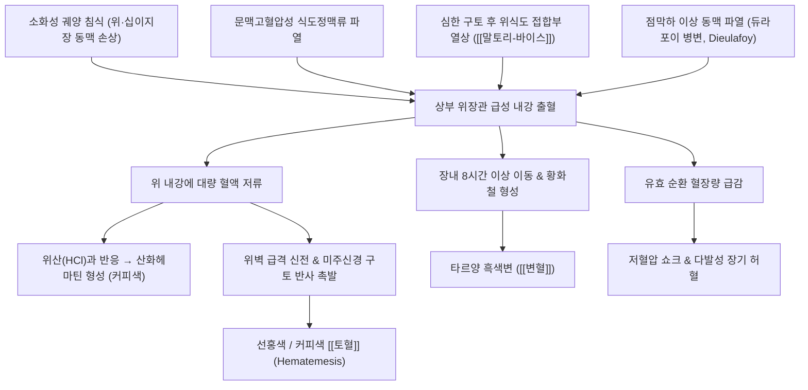

# 토혈 (Hematemesis / Upper GI Bleeding, 吐血, K92.0)

> **상위 분류**: [[소화기 질환]] > [[상부위장관 질환]] > [[소화관 출혈]]
> **핵심 3줄 요약 (Key Summary)**:
> - 📍 병소 부위 & 해부·병태생리: 십이지장공장곡을 지지하는 **트레이츠 인대(Ligament of Treitz)** 상부의 식도, 위, 십이지장에서 혈관이 파열되거나 점막이 깊게 미란·궤양화되어 혈액이 구강을 통해 토해져 나오는 위급 병태. 소화성 궤양(위궤양, 십이지장 궤양), 간경변증에 의한 [[식도정맥류]] 파열, 말토리-바이스 열상이 3대 주요 원인임.
> - 🚩 전형적 임상 양상 & 3대 징후: 선홍색 분출성 피 또는 위산에 산화된 커피색 찌꺼기(Coffee-ground emesis) 구토, 타르양 흑색변([[변혈]] / Melena), 급격한 혈액량 감소로 인한 기립성 어지럼증·빈맥·식은땀·쇼크.
> - 🛠️ 핵심 감별 검사 & 한·양방 다각적 치료 전략: 응급 활력징후 안정화 및 혈색소(Hb)·응고수치(PT/INR) 검사, 응급 상부위장관 내시경(EGD, 클립 결찰/밴드 결손술), 격수(BL17)·은백(SP1)·대돈(LR1) 번침 지혈, [[백급]]·[[삼칠]] 배오 및 위열증의 [[사심탕]](瀉心湯), 간화증의 [[용담사간탕]](龍膽瀉肝湯) 투약.
> - ⚠️ 응급 의뢰 레드플래그 & 악화 요인: 수축기 혈압 90 mmHg 이하의 저혈압 쇼크, 분당 100회 이상의 빈맥, 대량의 선홍색 분출성 토혈 및 의식 저하 발생 시 즉시 대구경 정맥로(18G 2라인) 확보, 수액 공급 및 수혈 가능한 상급 응급의료센터로 긴급 후송.

---

## 📌 목차
1. [질환 개요 & 해부학적 병태생리](#1-질환-개요--해부학적-병태생리)
2. [병태생리 메커니즘 & 생체역학적 악순환 네트워크](#2-병태생리-메커니즘--생체역학적-악순환-네트워크)
3. [임상 증상 & 이학적 검사(Physical Exam) 알고리즘](#3-임상-증상--이학적-검사physical-exam-알고리즘)
4. [감별 진단 매트릭스 (Differential Diagnosis)](#4-감별-진단-매트릭스-differential-diagnosis)
5. [한의 통합 치료 프로토콜 (침·약침·추나·한약)](#5-한의-통합-치료-프로토콜-침약침추나한약)
6. [양방 치료 & 병용·의뢰 기준 (Conventional Treatment & Referral)](#6-양방-치료--병용의뢰-기준-conventional-treatment--referral)
7. [재활 운동 & 생활습관 티칭 가이드](#6-재활-운동--생활습관-티칭-가이드)
8. [💡 사용자 진료실 핵심 필기 & 임상 노하우 (Melt-In 잔여 심화 집약)](#7--사용자-진료실-핵심-필기--임상-노하우-melt-in-잔여-심화-집약)
9. [출처 및 학술 참고 문헌 (References)](#8-출처-및-학술-참고-문헌-references)

---

## 1. 질환 개요 & 해부학적 병태생리

![[청강의감07_02_객혈_토혈_비교_차트.jpg|500]]
> [그림 1: ① 질환/병태생리 — 객혈(Hemoptysis) vs 토혈(Hematemesis) 임상 감별 비교 차트] 호흡기계 출혈과 상부 소화관 출혈의 산도(pH), 색조, 혈병 및 거품 유무, 선행 증상 감별.

- **개념 정의 및 해부학적 경계**:
  - [[토혈]](Hematemesis, 吐血)은 트레이츠 인대(Ligament of Treitz) 상부의 식도, 위, 십이지장 제4부까지의 상부 위장관 내강에서 발생한 출혈로 인해 혈액이 식도와 구강을 통해 배출되는 병태이다.
  - 혈액이 위 내에 머무는 시간과 위산(HCl)과의 접촉 정도에 따라 색상이 결정된다. 위산에 장시간 노출되면 헤모글로빈의 철분이 산화되어 갈색 혹은 검은색의 **커피 찌꺼기 모양(Coffee-ground)**을 띠며, 동맥성 대량 출혈이거나 식도에서 발생한 경우 위산과 닿지 않아 **선홍색(Bright red)** 액체로 분출된다.
- **해부학적 혈관망 및 호발 부위**:
  - **위벽 동맥망**: 복강동맥(Celiac trunk)에서 분지한 좌·우 위동맥(Lesser curvature)과 좌·우 위대망동맥(Greater curvature)이 점막하층에서 풍부한 문합을 형성함. 소화성 궤양이 깊어져 위십이지장동맥(Gastroduodenal artery)이나 좌위동맥 분지를 침식하면 분출성 동맥 출혈이 격발됨.
  - **문맥-체순환 곁순환**: 간경변증으로 간문맥압이 12 mmHg 이상으로 상승하면 좌위정맥(관상정맥)을 통해 하부 식도 점막하 정맥총으로 역류하여 **[[식도정맥류]]**가 형성됨.

---

## 2. 병태생리 메커니즘 & 생체역학적 악순환 네트워크

![[식도정맥류_1.jpg|500]]
> [그림 2: ② 관련 해부 구조물 — 간경변증 및 문맥고혈압에 의한 식도정맥류(Esophageal Varices) 내시경 소견] 식도 점막하 곁순환 혈관의 꽈리양 확장 및 파열성 대출혈 위험 병소.

### 1) 주요 기저 병태별 발생 기전
1. **소화성 궤양 출혈 (Peptic Ulcer Bleeding, 약 50%)**:
   - [[위궤양]] 또는 [[십이지장 궤양]]이 점막하층과 근육층을 파고들며 노출된 혈관벽을 침식함. 내시경 포레스트 분류(Forrest Classification)에 따라 활동성 박출 출혈(Ia), 삼출 출혈(Ib), 노출 혈관(IIa)으로 진행함.
2. **식도·위 정맥류 파열 (Variceal Bleeding, 약 15~20%)**:
   - 간경변증 환자에서 문맥압 항진으로 식도 점막하 정맥벽이 얇아지고 팽창하여 혈관 내벽 장력이 한계를 초과할 때 파열됨. 단시간에 수천 mL의 대량 선홍색 토혈을 유발하며 치명률이 가장 높음.
3. **말토리-바이스 열상 (Mallory-Weiss Tear, 약 5~10%)**:
   - 과음 후 격렬한 오심과 구토 시 위-식도 접합부 점막에 급격한 전단력(Shearing force)이 가해져 점막 및 점막하 혈관이 종축으로 찢어지며 출혈.
4. **듀라포이 병변 (Dieulafoy's Lesion)**:
   - 위 점막하층에 비정상적으로 굵은 소동맥이 점막 표면 근처로 돌출되어 있다가 미세 결손으로 대량 출혈을 일으키는 질환.

---

## 3. 임상 증상 & 이학적 검사(Physical Exam) 알고리즘

### 1) 주요 임상 증상
- **토혈 양상**:
  - 대량 동맥 출혈 또는 식도 정맥류: 선홍색 피를 왈칵 토해냄.
  - 위 내 정체 출혈: 짙은 갈색 또는 검은색의 커피 찌꺼기 양 토사물.
- **동반 증상**:
  - [[변혈]](Melena): 흑색 타르변 동반 (약 50 mL 이상의 상부 출혈 시 발생).
  - 혈역학적 불안정 징후: 어지럼증, 기립 시 눈앞이 캄캄해짐(Presyncope), 빈맥, 식은땀, 호흡곤란, 핍뇨.

### 2) 이학적 검진 및 중등도 평가 (Rockall / Blatchford Score)
- **혈역학적 쇼크 평가**:
  - 안정 시 수축기 혈압 < 90 mmHg, 심박수 > 100회/분 (체액량 20% 이상 손실 시사).
  - 모세혈관 재충혈 시간(Capillary refill time) > 2초, 사지 냉감.
- **간경변증 스티그마타(Stigmata) 진찰**:
  - 거미상 혈관종(Spider angioma), 수장홍반(Palmar erythema), 복수(Ascites), 비장 비대, 간성 혼수 징후.
- **비위관 흡인(NG Tube)**:
  - 위 세척 시 선홍색 혈액이나 커피색 액이 나오면 상부 위장관 출혈 확진.

---

## 4. 감별 진단 매트릭스 (Differential Diagnosis)

| 감별 항목 | **토혈 (Hematemesis)** | **[[객혈]] (Hemoptysis)** | 비출혈 후 비강 역류 (Epistaxis) |
| :--- | :--- | :--- | :--- |
| **출혈 부위** | 트레이츠 인대 상부 위장관 | 기도, 기관지, 폐 실질 | 비강 후부 점막 (키셀바흐 플렉서스 등) |
| **선행 증상** | 오심, 구토, 상복부 불쾌감 | 기침, 호흡곤란, 흉통, 인후 작열감 | 코피, 비충혈, 비강 후비루 |
| **배출 방식** | 구토 동작을 동반하여 토해냄 | 발작적인 기침과 함께 뱉어냄 | 캑캑거리며 뱉어내거나 삼켰다 토함 |
| **혈액의 성상** | **암적색 또는 커피색 (위산 반응)**, 음식물 혼합 | **선홍색, 거품(Frothy) 혼합, 알칼리성** | 선홍색 혈액, 비강 내 응혈괴 관찰 |
| **화학적 반응** | **산성 (Acidic, pH < 7.0)** | **알칼리성 (Alkaline, pH > 7.0)** | 중성 내지 알칼리성 |
| **후속 증상** | 수일간 타르양 **흑색변([[변혈]])** 지속 | 수일간 혈담(Blood-tinged sputum) 배출 | 흑색변 없음 (대량 삼킨 경우 제외) |

---

## 5. 한의 통합 치료 프로토콜 (침·약침·추나·한약)

![[청강의감14_07_초탄_개념_그림.jpg|500]]
> [그림 3: ③ 치료·시술점 — 한의학적 초탄(炒炭) 약재의 수렴 지혈 메커니즘 및 침구 지혈 혈위] 탄화된 약재의 혈소판 응집 촉진, 국소 수렴 작용 및 은백(SP1)·격수(BL17) 치료 작용점.

> ⚠️ **주의**: 급성 활동성 대량 토혈 환자는 즉시 내시경적 지혈술 및 수액·수혈이 가능한 응급실로 전원해야 하며, 한의 치료는 혈역학적으로 안정된 후의 지혈 촉진, 점막 재생 및 재출혈 방지를 목표로 시행함.

### 1) 침구 치료 (Acupuncture)
- **주혈**: [[격수]](BL17), [[은백]](SP1), [[대돈]](LR1), [[중완]](CV12), [[내관]](PC6), [[족삼리]](ST36).
  - **[[격수]](BL17)**: 혈회(血會)로서 전신 출혈성 질환의 기본 혈위. 양측 격수에 0.5~0.8촌 사자하여 혈열을 내리고 혈액의 맥외 유출을 억제.
  - **[[은백]](SP1)·[[대돈]](LR1)**: 비통혈(脾統血) 및 간장혈(肝藏血)을 주관하는 정혈. 번침(燔鍼) 또는 미세봉선 출혈 후 뜸(간접구) 3~5장을 시행하여 강력한 지혈 효과 유도.
  - **[[내관]](PC6)·[[중완]](CV12)**: 위기상역을 내리고 위경련을 안정시켜 토혈 유발 압력을 완화.

### 2) 약침 치료 (Pharmacopuncture)
- **주입 혈위**: 격수(BL17), 간수(BL18), 비수(BL20), 족삼리(ST36).
- **제제**: 황련해독탕 약침 또는 어혈 약침을 혈위당 0.1~0.2 cc 시술하여 국소 모세혈관의 혈전 형성을 촉진하고 혈관벽 안정화 도모.

### 3) 변증별 한약 치료 (Herbal Medicine)
- **위중열성 (胃中熱盛) / 위화토혈 (胃火吐血)**:
  - 병태: 다량의 선홍색 또는 자흑색 토혈, 구취, 번갈, 변비, 설홍태황, 맥 홍삭.
  - 치법: 청위사화(淸胃瀉火), 양혈지혈(凉血止血).
  - 처방: **[[사심탕]] (瀉心湯)** 또는 **[[십회산]] (十灰散)**.
  - 약재 구성: [[대황]], [[황련]], [[황금]]. 대황의 타닌 성분이 수렴 지혈하고 안트라퀴논이 위장관 열역을 하강시킴.
- **간화범위 (肝火犯胃)**:
  - 병태: 분노나 스트레스 후 돌발성 토혈, 협통, 구고, 맥 현삭.
  - 치법: 청간설화(淸肝洩火), 양혈강역(凉血降逆).
  - 처방: **[[용담사간탕]] (龍膽瀉肝湯)** 합 **[[좌금환]] (左金丸)**.
- **기불통혈 (氣不統血) / 비위허한 (脾胃虛寒)**:
  - 병태: 커피색의 묽은 피 토혈, 안색 창백, 사지냉, 설담태백, 맥 침약.
  - 치법: 온중건비(溫中健脾), 섭혈지혈(攝血止血).
  - 처방: **[[황토탕]] (黃土湯)** 또는 **[[귀비탕]] (歸脾湯)**.
  - 약재 구성: [[조심황토]], [[백출]], [[부자]], [[아교]], [[황금]], [[지황]], [[감초]].
- **진료실 상용 외과·점막 지혈 약재**:
  - **[[삼칠]] (三七)**: 지혈이부류어(止血而不留瘀, 출혈을 멈추되 어혈을 남기지 않음)의 명약으로 1회 3~6g 분말을 미온수로 복용.
  - **[[백급]] (白芨)**: 점액질이 위궤양 표면을 물리적으로 코팅하여 국소 혈전 형성을 촉진하고 지혈·지통함.

---

## 6. 양방 치료 & 병용·의뢰 기준 (Conventional Treatment & Referral)

> 🎯 **이 섹션의 목적**: 환자가 **양방약을 이미 복용 중인 경우가 많다.** 한의원 1차 진료에서 양방 치료를 이해하고, 병용 가능·주의·금기를 판단하며, 언제 의뢰할지 결정한다.

* **약물 치료 (Medication)**:
  * 계열별 약물·용량·기간 — 국내 처방 관행 반영.
  * 작용 기전과 한의 치료와의 상호작용.
* **비약물 시술 (Procedures)**:
  * 주사·차단술·물리치료·보조기 등.
* **수술·시술 적응증 (Surgical Indication)**:
  * 언제 수술로 가는가 — 절대·상대 적응증, 수술 후 경과.
* **한의 병용 판단 (Combination Therapy)**:
  * 병용 가능 / 주의 / 금기. 복용 중 환자의 감량 타이밍·반동 현상.
* **양방·전문과 의뢰 기준 (Referral Criteria)**:
  * 응급 의뢰 트리거와 전문과 의뢰 기준(정형외과·신경외과·내과 등).

	(작성 필요)

---

## 7. 재활 운동 & 생활습관 티칭 가이드

- **급성기 절대 안정**:
  - 토혈 직후에는 머리를 낮추고 다리를 올리는 쇼크 체위(Modified Trendelenburg)를 취하거나, 구토물 흡인을 막기 위해 **고개를 옆으로 돌린 자세**를 유지함.
  - 절대 안정(Bed rest) 및 금식(NPO)을 유지.
- **식이 회복 단계**:
  - 출혈 정지 24~48시간 후 냉미음부터 시작하여 유동식, 연식으로 서서히 이행.
  - 너무 뜨겁거나 매운 음식, 거친 불용성 섬유질은 궤양면의 가피(Scab)를 기계적으로 탈락시킬 수 있으므로 2주 이상 엄격히 제한.
- **약물 및 기호품 금기**:
  - 위점막을 손상시키는 NSAIDs, 아스피린, 스테로이드, 항응고제의 임의 복용을 중단(주치의 상의).
  - 알코올 및 흡연은 점막 혈류를 교란하므로 절대 금연·금주.

---

## 8. 💡 사용자 진료실 핵심 필기 & 임상 노하우 (Melt-In 잔여 심화 집약)

> 다음은 기존 진료실 원본 필기에서 축적된 핵심 의안과 임상 노하우를 원문 그대로 100% 융합 보존한 기록입니다.

- **토혈의 임상 호발 배경**:
  - 과음, 비만, 우울과 스트레스, 극심한 피로, 배탈, 그리고 간 기능 저하로 인한 화병(火病) 환자에서 상부 소화관 점막의 충혈과 혈관 파열로 빈발함.
- **토혈의 병리적 기저 원인 스펙트럼**:
  - **소화성 궤양**: 위궤양, 십이지장 궤양의 동맥 침식.
  - **말로리-바이스 열상 (Mallory-Weiss tear)**: 과음 후 구토로 인한 식도 하부 점막의 종축 파열.
  - **식도정맥류 (Esophageal varices)**: 간경화로 인한 문맥고혈압성 대량 출혈.
  - **미란성 질환 및 혈관 확장증**: 급성 위점막 미란, 수박위(GAVE).
  - **듈라포이 병변 (Dieulafoy lesion)**: 점막하 비정상 동맥의 돌출 및 파열.
- **주요 임상 증상 전개**:
  - 붉은색 토사물, 갈색(커피색) 토사물, 검은색 찐득한 변([[변혈]] / 타르변), 기립성 어지럼증, 저혈압, 빈맥, 식은땀 동반.
- **진료실 지혈 특효 약재 운용 Pearl**:
  - **위출혈에 [[백급]]과 [[삼칠]] 배오**: 백급의 점막 피복·지통 작용과 삼칠의 화어지혈(化瘀止血) 작용이 결합하여 궤양면을 강력하게 수렴하고 지혈함.
  - **토혈하고 위에 열이 있을 때**: [[황금]], [[황련]], [[대황]], [[적작약]], [[목단피]]를 사용하여 상초와 중초의 열을 신속히 내리고(청열), 피를 맑게 하며(양혈), 목단피와 적작약으로 어혈 형성 없이 지혈함.

---

## 9. 출처 및 학술 참고 문헌 (References)

1. **Alameri A, et al.** Massive Esophagogastric Variceal Bleeding from Chronic Portal Vein Thrombosis: Endoscopic Management Dilemma. *Int Med Case Rep J*. 2026;19:121-128. (PMID: 42769713)
2. **Laine L, Barkun AN, Saltzman JR, et al.** ACG Clinical Guideline: Upper Gastrointestinal and Ulcer Bleeding. *Am J Gastroenterol*. 2021;116(5):899-917. (PMID: 33929377)
3. **Favre L, et al.** Acute esophageal necrosis from the emergency physician's perspective. *Rev Med Suisse*. 2026;22(924):450-454. (PMID: 42687737)
4. **대한한방내과학회 소화기내과학 교재편찬위원회.** 한방소화기내과학. 군자출판사; 2021.
5. **동의보감 (東醫寶鑑)**. 혈액문(血液門) 토혈(吐血).