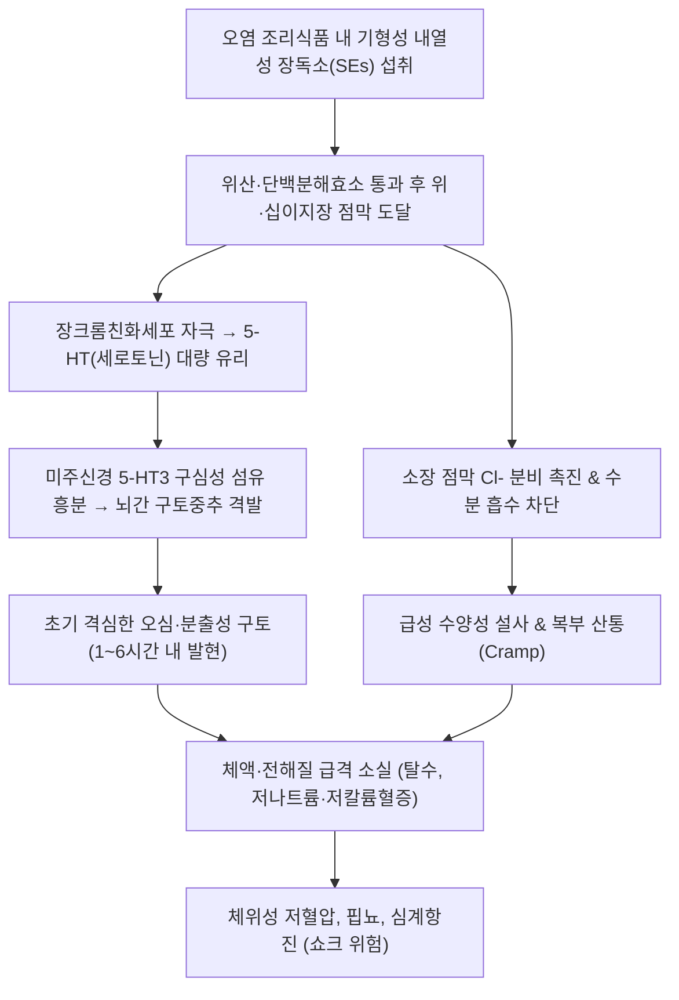

# 🩺 [[포도구균 식중독]] (Staphylococcal Food Poisoning / 葡萄球菌食中毒, A05.0)

> **핵심 3줄 요약 (Key Summary)**:
> - 📍 **병소 부위 & 병태생리**: 황색포도상구균([[황색포도알균]], *Staphylococcus aureus*)이 오염된 음식물에서 증식하며 분비한 **내열성 장독소(Staphylococcal Enterotoxins, SEs)**를 섭취하여 발생하는 전형적인 '독소형 식중독(Toxicoinfection)'. 위 및 상부 소장 점막의 미주신경 5-HT3 수용체를 흥분시켜 급격한 구토를 격발.
> - 🚩 **전형적 임상 양상 & 3대 징후**: 오염 식품 섭취 후 **1~6시간(평균 2~4시간)**의 극히 짧은 잠복기 내에 폭발적으로 분출하는 **격심한 구토(Intractable vomiting), 심와부 산통(Cramping abdominal pain), 수양성 설사**. 발열은 드물거나 미열에 그침.
> - 🛠️ **핵심 감별 & 한·양방 치료 전략**: 살모넬라·캄필로바커(염증성/발열성), 노로바이러스(24~48시간 잠복기)와 감별. 자한·탈수를 막는 **경구 수액 요법(ORS)**, 위기역상(胃氣逆上)을 다스리는 **[[곽향정기산]]**, **[[이중탕]]** 가감 및 내관·중완 자침. 항생제는 원칙적 불필요(세균 감염이 아닌 이미 형성된 독소 작용).
> - ⚠️ **응급 의뢰 레드플래그**: 지속적 구토로 인한 수분 섭취 불능, 저혈압 쇼크(SBP < 90mmHg), 핍뇨/무뇨(급성 신손상 Prerenal AKI), 심한 의식 혼미 또는 전해질 불균형(저칼륨혈증 부정맥).

---

## 📌 목차
1. [질환 개요 & 병태생리 (Disease Overview)](#1-질환-개요--병태생리-disease-overview)
2. [병태생리 메커니즘 & 대사·장기부전 악순환 네트워크](#2-병태생리-메커니즘--대사장기부전-악순환-네트워크)
3. [임상 증상 & 환자 소견 (Clinical Presentation)](#3-임상-증상--환자-소견-clinical-presentation)
4. [감별 진단 매트릭스 (Differential Diagnosis)](#4-감별-진단-매트릭스-differential-diagnosis)
5. [한의 통합 치료 프로토콜 (침·약침·한약)](#5-한의-통합-치료-프로토콜-침약침한약)
6. [양방 치료 & 병용·의뢰 기준 (Conventional Treatment & Referral)](#6-양방-치료--병용의뢰-기준-conventional-treatment--referral)
7. [식이·생활습관 & 자가관리 티칭 가이드](#7-식이생활습관--자가관리-티칭-가이드)
8. [💡 진료실 핵심 필기 & 임상 노하우](#8--진료실-핵심-필기--임상-노하우)
9. [출처 및 학술 참고 문헌 (References)](#9-출처-및-학술-참고-문헌-references)

---

## 1. 질환 개요 & 병태생리 (Disease Overview)

**[[포도구균 식중독]](Staphylococcal Food Poisoning, SFP)**은 그람 양성 구균인 **[[황색포도알균]](*Staphylococcus aureus*)**이 음식물 내에서 증식하면서 생산한 **장독소(Enterotoxins: SEA, SEB, SEC, SED, SEE 등)**를 음식물과 함께 섭취함으로써 발생하는 급성 외독소 매개 위장관 질환이다.

![[상부위장관기능장애_위해부학_OpenStax_2414.jpg]]
> [그림 1: ① 질병 개요 도해 — 황색포도상구균 장독소의 표적 장기인 위 및 십이지장 상부 위장관 해부 도해]

본 질환은 감염형 식중독과 달리, 균체가 체내에 침입하여 증식하는 것이 아니라 **이미 음식물에 만들어진 독소(Preformed toxin)를 섭취**하는 '독소 섭취형 식중독'이다. 포도상구균 자체는 열에 약하여 통상적인 조리 가열(60℃ 30분)로 사멸하지만, 균이 분비한 장독소는 **100℃에서 30분 이상 가열해도 파괴되지 않는 극도의 내열성(Heat stability)**과 위산·단백분해효소(Pepsin, Trypsin)에 대한 저항성을 지닌다. 따라서 가열 조리된 음식이라도 조리 전 오염되어 독소가 형성되었다면 식중독을 일으킨다.

![[황색포도상구균_주사전자현미경_SEM.jpg]]
> [그림 2: ① 원인 병원체 — 포도송이 모양 군집을 형성하는 황색포도상구균(Staphylococcus aureus) 주사전자현미경(SEM) 소견]

- **호발 원인 식품**: 조리자의 손(화농성 병변, 비강 보균)을 거친 후 상온에 방치된 단백질 풍부 식품(김밥, 도시락, 샌드위치, 샐러드, 마요네즈 가공품, 크림빵, 육류 및 유제품).
- **잠복기**: 섭취 후 **1~6시간(대부분 2~4시간)**으로 세균성 식중독 중 가장 빠르다.

---

## 2. 병태생리 메커니즘 & 대사·장기부전 악순환 네트워크

### 분자·세포 기전: 장독소의 신경 흥분 및 슈퍼항원 작용
1. **미주신경 자극 및 구토 중추 격발**:
   - 섭취된 내열성 장독소는 위 및 십이지장 점막의 장크롬친화성세포(Enterochromaffin cells)를 자극하여 대량의 세로토닌(5-HT) 분비를 유도한다.
   - 방출된 세로토닌은 점막하 미주신경 구심성 섬유(Vagal afferents)의 5-HT3 수용체와 결합하여 뇌간 연수의 **화학수용체 유발대(CTZ)** 및 **구토 중추(Vomiting center)**에 강력한 신호를 전달함으로써 즉각적이고 격렬한 구토 반사를 유발한다.
2. **장관 분비 항진 및 수양성 설사**:
   - 장독소는 소장 상피세포의 전해질 수송을 교란하여 염소 이온($Cl^-$)의 능동 분비를 촉진하고 나트륨($Na^+$) 및 수분 재흡수를 억제하여 장관 내 수분 저류를 일으킨다.
3. **슈퍼항원(Superantigen) 매개 면역 활성화**:
   - 일부 장독소(SEB 등)는 MHC class II 분자와 T세포 수용체(TCR Vβ)에 비특이적으로 결합하여 전신성 사이토카인(IL-1, IL-2, TNF-α) 폭풍을 유도할 수 있으나, 통상적인 식중독에서는 국소 장관 내 염증과 혈관 확장에 주로 국한된다.

![[포도구균_장독소B_결정구조_PDB.jpg]]
> [그림 3: ② 병태생리 구조도 — 내열성 장독소 B(SEB)의 3차원 결정 구조(PDB 1EWC) 및 슈퍼항원 활성 부위]

![[상부위장관기능장애_위점막분비구조_도해.svg]]
> [그림 4: ③ 신호전달 도해 — 장독소가 위장관 점막의 미주신경 구심성 수용체를 자극하여 뇌간 구토 중추를 격발하는 신경 경로 도해]

---

## 3. 임상 증상 & 환자 소견 (Clinical Presentation)

### 특징적 3대 임상 징후
1. **분출성 구토(Projectile / Intractable Vomiting)**: 물만 마셔도 바로 토해내는 격렬한 위 내용물 역류.
2. **심와부 및 배꼽 주위 산통(Colicky Abdominal Pain)**: 위장관 평활근의 격심한 경련성 수축.
3. **무열성 또는 미열 경과(Afebrile or Low-grade fever)**: 침습성 세균 감염이 아니므로 고열(>38.5℃)은 거의 동반되지 않으며, 오히려 탈수로 인한 체온 저하가 나타날 수 있음.

![[급성위염_급성미란성위염_상부위장관내시경_실측영상.jpg]]
> [그림 5: ④ 내시경 소견 — 포도구균 독소 섭취 후 급성 위점막 미란, 발적 및 충혈 소견을 보이는 상부위장관 내시경]

### 객관적 신체 검진 소견 (탈수 평가)

![[식중독_탈수징후_피부긴장도검사_SkinTurgor.jpg]]
> [그림 6: ⑤ 환자 임상 평가 — 빈번한 구토 및 수분 손실로 인한 탈수 여부를 평가하는 피부 긴장도(Skin turgor) 검사 실사]

- **구강 점막 건조 및 갈증**: 혀가 마르고 타액 분비 감소.
- **피부 긴장도(Skin Turgor) 저하**: 손등이나 복부 피부를 집어 올렸을 때 원상태로 돌아가는 시간이 2초 이상 지연됨.
- **활력징후**: 기립성 저혈압(체위 변경 시 SBP 20mmHg 이상 강하), 맥박수 증가(빈맥 > 100회/분).
- **복부 진찰**: 전반적인 복부 압통은 있으나, 반발압통(Rebound tenderness)이나 복벽 강직은 관찰되지 않음.

---

## 4. 감별 진단 매트릭스 (Differential Diagnosis)

![[식중독_중증탈수_피부긴장도저하_LowSkinTurgor.jpg]]
> [그림 7: ⑤ 임상 징후 — 중증 탈수 시 피부를 집어 올렸을 때 복원이 지연되는 텐트 징후(Tenting) 및 피부 긴장도 저하 소견]

| 감별 질환 | 원인 병원체 및 기전 | 잠복기 | 주증상 패턴 | 발열 여부 | 변의 양상 |
| :--- | :--- | :--- | :--- | :--- | :--- |
| **[[포도구균 식중독]]** | *S. aureus* 기형성 내열성 장독소 | **1~6시간** (초단기) | **격심한 구토 위주**, 심와부 경련통 | **무열 (발열 드묾)** | 수양성 설사 (경~중등도) |
| **[[바실루스 세레우스]] 식중독** (구토형) | *Bacillus cereus* 내열성 구토독소(Cereulide) | 1~5시간 | 볶음밥·쌀밥 섭취 후 급성 구토 | 무열 | 설사 드묾 |
| **[[노로바이러스 장관염]]** | Norovirus 점막 감염 | 24~48시간 | 오심·구토, 설사, 오한, 전신 근육통 | 미열~중등도 발열 (38℃ 전후) | 수양성 설사 |
| **[[살모넬라 식중독]]** | *Salmonella enterica* 점막 침습 | 12~72시간 | 발열, 복통, 이급후증(Tenesmus) | **고열 (38.5~40℃ 흔함)** | 점액변 또는 혈변 동반 가능 |
| **[[클로스트리디움 퍼프린젠스]]** | *C. perfringens* 장관 내 독소 생성 | 8~16시간 | 끓인 고기·국물 후 복통, 대량 설사 | 무열 | 심한 수양성 설사 (구토 드묾) |

---

## 5. 한의 통합 치료 프로토콜 (침·약침·한약)

![[급성위장관염_경구수액요법_ORS.jpg]]
> [그림 8: ⑥ 임상 처치 — 전해질 불균형 및 저혈량성 쇼크를 예방하기 위한 WHO 표준 경구 수액 요법(ORS)]

### 침구 치료: 강역지토(降逆止吐) & 조화비위(調和脾胃)
- **주요 혈위**:
  - **[[내관]](PC6)**: 팔맥교회혈(음유맥)이자 위기역상(胃氣逆上)을 진정시키는 구토 억제의 요혈. 수기 유침 15~20분간 사법(瀉法) 적용 시 뇌간 구토 반사를 강력 억제.
  - **[[중완]](CV12)**: 위의 모혈(募穴)로 위기(胃氣)를 조화롭게 하고 경련성 위통을 완화.
  - **[[족삼리]](ST36)**: 비위의 합혈(合穴)로 소화관 운동성을 조절하고 점막 혈류를 개선.
  - **공손(SP4), 합곡(LI4), 태충(LR3)**: 사관혈(四關穴) 배합으로 기체(氣滯)와 위경련성 산통을 즉각 진통.

### 한약 치료 (Herbal Medicine)
1. **곽란(霍亂) 및 한습조체(寒濕阻滯) 급성기**:
   - **[[곽향정기산]](藿香正氣散)**: 포도구균 식중독의 제1선 투약 방제. 방향화습(芳香化濕), 해표이기(解表理氣), 강역지구(降逆止嘔) 작용을 통해 오염 음식물로 인한 위장관 불화를 신속 진정.
   - **평위산(平胃散)** 합 **영계출감탕(苓桂朮甘湯)**: 비위의 정수(停水)와 구토, 복부 팽만감을 해소.
2. **구토 다발 후 비위허한(脾胃虛寒) 및 양기 손상기**:
   - **[[이중탕]](理中湯)** 또는 **[[오련환]](五苓散)**: 대량 구토 및 수양성 설사로 수분과 온기(陽氣)가 소모되어 손발이 차고 맥이 침미할 때, 복부를 온난화하고 수분 대사를 정상화.

---

## 6. 양방 치료 & 병용·의뢰 기준 (Conventional Treatment & Referral)

### 양방 치료 원칙
- **수액 및 전해질 교정 (Fluid Replacement)**: 질환의 치료 핵심. 경구 섭취가 가능한 경우 WHO 공식 경구 전해질 용액(ORS)을 소량씩 자주 복용시킴.
- **항생제 사용 금기**: 세균이 체내에서 감염 증식하는 것이 아니므로, **항생제(Ciprofloxacin 등) 투여는 효과가 전혀 없으며 오히려 정상 장내 세균총을 교란하므로 원칙적 금기**임.
- **진토제(Antiemetics)**: 구토가 극심하여 경구 수액 복용이 불가능할 경우에 한해 5-HT3 길항제(Ondansetron 4~8mg IV) 또는 Metoclopramide를 단기 투여.
- **지사제(Antidiarrheals) 주의**: Loperamide 등 장운동 억제제는 장관 내 잔류 독소의 배출을 지연시키므로 질환 초기에는 투여를 권장하지 않음.

### 응급 의뢰 기준 (Red Flags)
1. **중증 탈수 및 저혈량성 쇼크**: 수축기 혈압 < 90mmHg, 기립성 어지러움, 빈맥 > 110회/분.
2. **소변량 급감**: 6~8시간 이상 배뇨가 없거나 짙은 갈색 소변(Prerenal 급성 신손상 의심).
3. **의식 저하 또는 기면 상태**: 중증 전해질 불균형(저나트륨혈증, 저칼륨혈증) 의심 즉시 상급병원 응급실 전원.
4. **혈변(Hematochezia) 또는 고열(>38.5℃)**: 침습성 세균성 장염(이질, 살모넬라 등) 또는 장중첩증 감별 필요.

---

## 7. 식이·생활습관 & 자가관리 티칭 가이드

1. **초기 금식 및 미음 단계적 도입**:
   - 발병 첫 4~6시간 동안은 위장을 완전히 비우고 미지근한 이온음료나 전해질수를 숟가락으로 한 모금씩 천천히 축이듯이 섭취.
   - 구토가 멎으면 숭늉, 쌀미음, 맑은 된장국 등으로 점진적 이행.
2. **회피 식품군**:
   - 발병 후 48시간 동안은 유제품(우유, 치즈), 기름진 육류, 자극적인 매운 음식, 카페인 음료(커피), 알코올을 엄격히 제한.
3. **식품 위생 예방 수칙**:
   - 손에 상처(베인 상처, 화농성 병변)가 있는 조리자는 절대로 음식 조리에 참여하지 않도록 지도.
   - 조리된 식품은 2시간 이상 상온에 방치하지 말고 즉시 5℃ 이하 냉장 보관.

---

## 8. 💡 진료실 핵심 필기 & 임상 노하우

- **초단기 잠복기가 진단의 90%**: 단체 식사 후 "밥 먹고 2~3시간 만에 배가 쥐어짜듯 아프더니 다들 토하기 시작했다"고 하면 거의 예외 없이 포도구균 식중독이다. 잠복기 1~6시간을 확인하면 불필요한 항생제 처방을 막을 수 있다.
- **내관혈 강자극의 즉효성**: 약을 먹어도 바로 토해내는 급성기 환자에게 내관(PC6)에 사법(瀉法)으로 강자극 침을 놓고 5분간 심호흡을 유도하면 격렬하던 오심과 위 유문부 경련이 즉각적으로 잦아든다. 이후 곽향정기산 탕약을 미지근하게 소량씩 복용시키면 토하지 않고 흡수된다.
- **포도구균 독소는 끓여도 안 죽는다**: 환자들이 "음식을 팔팔 끓여 먹었는데 왜 식중독에 걸렸냐"고 의아해하는 경우가 많다. 균 자체는 죽지만 독소는 100도에서 30분 이상 끓여도 파괴되지 않는다는 점을 명확히 티칭해야 한다.

---

## 9. 출처 및 학술 참고 문헌 (References)

1. Zeaki N, et al. (2019). The Role of Regulatory Mechanisms and Environmental Parameters in Staphylococcal Food Poisoning and Resulting Challenges to Risk Assessment. *Front Microbiol*, 10:1307. [PMID 31244814](https://pubmed.ncbi.nlm.nih.gov/31244814/)

2. Fisher EL, et al. (2018). Basis of Virulence in Enterotoxin-Mediated Staphylococcal Food Poisoning. *Front Microbiol*, 9:436. [PMID 29662470](https://pubmed.ncbi.nlm.nih.gov/29662470/)

3. Xie Y, et al. (2026). A Staphylococcus aureus Foodborne Outbreak Linked to Hand-Shredded Chicken in a Corporate Canteen in Shenzhen, China. *Microorganisms*, 14(9):2044. [PMID 42700799](https://pubmed.ncbi.nlm.nih.gov/42700799/)

---

## 관련 노트
- [[황색포도알균]]
- [[급성 위염]]
- [[급성 위장관염]]
- [[식중독]]
- [[곽향정기산]]
- [[이중탕]]
- [[내관]]
