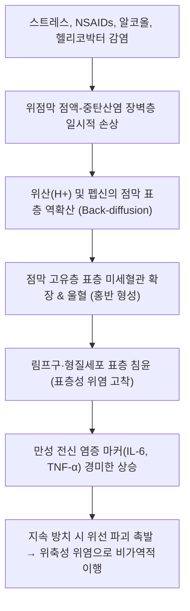

# 🩺 [[표층성 위염]] (Chronic Superficial Gastritis / 만성 표재성 위염, KCD K29.3)

> **핵심 3줄 요약 (Key Summary)**:
> - 📍 **병소 부위 & 병태생리**: 위 점막의 고유 위선(Gastric glands) 위축이나 장상피화생 없이, 염증 세포(림프구·형질세포·호중구)의 침윤이 점막 고유층의 표층(상부 1/3, 위소와 주위)에만 국한된 가장 흔한 초기 가역적 만성 위염.
> - 🚩 **전형적 임상 양상 & 3대 징후**: 대다수 무증상이나 위점막 과민성에 따른 식후 상복부 불쾌감, 심와부 조기 팽만감 및 트림, 자극성 음식(매운 음식·알코올·커피) 섭취 시 뻐근한 속쓰림.
> - 🛠️ **핵심 감별 & 한·양방 치료 전략**: 상부위장관 내시경(발적형 점막 반점 및 선상 발적 관찰), 헬리코박터 감염 검사; 양방 점막보호제·위장관운동촉진제·제산제; 한의학 간위불화(肝胃不和), 비위습열(脾胃濕熱), 식적정체(食積停滯) 변증에 따른 [[평위산]], [[반하사심탕]], [[보장건비환]] 및 중완·족삼리·내관 침구 치료.
> - ⚠️ **응급 의뢰 레드플래그**: 40세 이상에서 체중 감소, 빈혈, 흑색변(Melena), 연하곤란 등 경고 징후(Alarm signs) 동반 시 표층성 위염으로 오진하지 말고 즉시 악성 종양([[위암]]) 감별 EGD 의뢰.

---

## 📌 목차
1. [질환 개요 & 병태생리 (Disease Overview)](#1-질환-개요--병태생리-disease-overview)
2. [병태생리 메커니즘 & 대사·장기부전 악순환 네트워크](#2-병태생리-메커니즘--대사장기부전-악순환-네트워크)
3. [임상 증상 & 환자 소견 (Clinical Presentation)](#3-임상-증상--환자-소견-clinical-presentation)
4. [감별 진단 매트릭스 (Differential Diagnosis)](#4-감별-진단-매트릭스-differential-diagnosis)
5. [한의 통합 치료 프로토콜 (침·약침·한약)](#5-한의-통합-치료-프로토콜-침약침한약)
6. [양방 치료 & 병용·의뢰 기준 (Conventional Treatment & Referral)](#6-양방-치료--병용의뢰-기준-conventional-treatment--referral)
7. [식이·생활습관 & 자가관리 티칭 가이드](#7-식이생활습관--자가관리-티칭-가이드)
8. [💡 진료실 핵심 필기 & 임상 노하우](#8--진료실-핵심-필기--임상-노하우)
9. [출처 및 학술 참고 문헌 (References)](#9-출처-및-학술-참고-문헌-references)

---

## 1. 질환 개요 & 병태생리 (Disease Overview)

![[음식상_시드니시스템_위염내시경분류도.png|450]]
> [그림 1: ① 질병 개요 도해 — 개정 시드니 시스템(Updated Sydney System)에 따른 위염 분류 체계와 표재성 점막 발적의 위치도 — 자가보관도해]

* **질환 정의 및 개요**:
  * [[표층성 위염]](Chronic Superficial Gastritis, 慢性表層性胃炎)은 위 점막의 조직학적 검사상 위체부나 전정부의 고유 분비선(Gastric glands) 손상이나 점막 위축 없이, 염증성 세포 침윤이 점막 상층부(소와상피 및 고유층 표층)에 국한된 가역적 초기 염증 상태를 의미합니다.
  * 위암 발암 과정의 '코레아 연쇄(Correa's cascade)'인 **[정상 점막 → 표층성 위염 → [[위축성 위염]] → [[장상피화생]] → 이형성증 → [[위암]]]**의 가장 첫 출발점에 해당하는 병증으로, 적극적인 점막 방어 및 염증 차단 시 정상 점막으로 완전 회복이 가능합니다.
* **역학 및 유병률**:
  * 한국 성인 건강검진 상부위장관 내시경 수검자의 70~80% 이상에서 관찰될 정도로 대단히 흔하며, 사실상 현대 성인의 '생리적 위점막 반응'으로 간주되기도 합니다.
  * 헬리코박터 파일로리(H. pylori) 감염, NSAIDs 복용, 음주, 흡연, 불규칙한 식사, 정신적 스트레스가 주된 촉발 인자입니다.
* **관련 장기 및 조직**:
  * **주 이환 장기**: [[위]](Stomach) — 특히 위산과 음식물이 정체되는 전정부(Antrum) 소만부(Lesser curvature)에서 가장 호발하며, 전정부 표재성 위염이 가장 흔한 형태입니다.
  * **점막 미세구조**: 상피 표면의 점액 세포와 위소와(Gastric pits) 주위에 경미한 부종과 혈관 확장, 호중구 및 림프구 침윤이 나타납니다.

---

## 2. 병태생리 메커니즘 & 대사·장기부전 악순환 네트워크

![[음식상_급성표재성위염_H&E조직병리.png|450]]
> [그림 2: ② 병태생리 구조도 — 위선(Gastric glands)의 위축 없이 점막 고유층 표층(위소와 주위)에 단핵구 및 림프구가 침윤된 표재성 위염 H&E 조직상 — Wikipedia(PD)]

![[급성위염_위벽조직학_점막방어층_구조도해.jpg|450]]
> [그림 3: ③ 위점막 방어 장벽 구조도 — 위점액-중탄산염 장벽층과 프로스타글란딘 합성 경로 및 미세순환 방어 기전 — Servier Medical Art(CC BY)]

### 1) 점막 공격 인자와 방어 인자의 불균형
* 정상 위점막은 점액-중탄산염 젤 층(Mucus-bicarbonate barrier), 상피세포 간 치밀이음(Tight junction), 풍부한 점막 미세혈류, 프로스타글란딘(PGE2) 합성이라는 4중 방어벽을 유지합니다.
* 스트레스나 약물, 알코올로 인해 점막 혈류가 감소하고 점액 분비가 줄어들면, 위산과 펩신이 표층 상피를 자극하여 국소 히스타민 분비, 혈관 확장, 점막 발적이 발생합니다(Li et al., 2026).

### 2) 비가역적 위축성 위염으로의 진행 위험
* 표층성 위염 단계에서는 위선이 온전하여 위산 분비 능력이 정상적으로 유지되지만, 헬리코박터 감염이 동반된 채 수년 이상 만성화되면 염증이 점막 깊은 층으로 파급되어 위선 세포가 사멸하고 위축성 위염 및 장상피화생으로 이행합니다(Wang et al., 2026).

---

## 3. 임상 증상 & 환자 소견 (Clinical Presentation)

![[위염_전정부점막_조직학_H&E.png|420]]
> [그림 4: ④ 환자 임상 소견 — 표층성 위염의 주요 호발 부위인 위 전정부 점막의 조직학적 단면 실측 소견 — Wikipedia(PD)]

![[급성위염_급성미란성위염_상부위장관내시경_실측영상.jpg|420]]
> [그림 5: ⑤ 내시경 임상 영상 — 위체부 및 전정부 점막 표면의 선상 발적(Linear erythema)과 모자이크상 반점형 발적 소견 — 자가보관영상]

### 1) 주요 임상 증상
* **무증상 (Asymptomatic)**: 수검자의 과반수는 특별한 자각 증상 없이 건강검진 내시경에서 우연히 발견됩니다.
* **비특이적 소화불량 증상**:
  * 식후 명치 끝(심와부) 뻐근함, 조기 만복감, 팽만감.
  * 기름진 음식이나 음주 후 잦은 트림과 오심.
  * 공복 시 가벼운 속쓰림(위산 자극).

### 2) 객관적 내시경 소견 (Endoscopic Findings)
* **발적형 위염 (Erythematous/Exudative Gastritis)**:
  * 점막 주름을 따라 붉은 줄무늬가 보이는 선상 발적(Linear erythema) 또는 점막 표면이 얼룩덜룩 붉게 물든 반점상 홍반.
  * 점막의 광택은 유지되며 점막하 혈관망은 비쳐 보이지 않음(위축성 위염과의 명확한 차이점).
* **삼출형 위염**: 점막 표면에 하얀 백태 같은 점액성 삼출물이 얇게 덮여 있는 소견.

---

## 4. 감별 진단 매트릭스 (Differential Diagnosis)

| 감별 질환 | 내시경 특징적 소견 | 조직학적 소견 | 감별 포인트 |
| :--- | :--- | :--- | :--- |
| **[[표층성 위염]]** | 점막 표면의 선상/반점상 홍반, 점막 탄력 유지 | **위선 위축 없음**, 표층 염증 국한 | 정상 위산 분비, 가역적 병변 |
| **[[위축성 위염]]** | 점막 박소화로 **점막하 혈관망 적나라하게 투영** | **위선 위축 및 소실**, 고유층 섬유화 | 저위산증, 전암 단계, 고령 호발 |
| **[[미란성 위염]]** | 점막 표층의 융기된 궤양 전단계 결손(Erosion) | 점막근판을 넘지 않는 점막 결손 | 위출혈(흑변) 가능성, NSAIDs 연관 |
| **[[기능성 소화불량]]** | 내시경 소견상 **정상 또는 경미한 표층성 위염** | 점막 염증과 증상의 중증도 불일치 | 내장 과민성 및 장뇌축 기능부전 |
| **[[소화도 궤양]] (위궤양)** | 점막근판을 뚫고 점막하층까지 침범한 깊은 분화구 결손 | 응고괴사, 육아조직, 반흔 조직 | 명확한 백태 궤양저, 출혈/천공 위험 |

---

## 5. 한의 통합 치료 프로토콜 (침·약침·한약)

![[위염_족양명위경_공식경혈도_Wellcome_L0037487.jpg|420]]
> [그림 6: ⑦ 한의 치료 경혈도 — 비위 습열 및 간위불화 해소를 위한 족양명위경 공식 경혈도 — Wellcome Collection(L0037487, CC BY)]

* **변증 분류**:
  1. **비위불화(脾胃不和) / 식적(食積)**: 불규칙한 식사 후 복부 팽만, 트림, 설태 후니(厚膩).
  2. **간위불화(肝胃不和)**: 스트레스 후 심와부 팽만통, 잦은 한숨, 양 늑골하부 당김.
  3. **비위습열(脾胃濕熱)**: 속쓰림, 입안의 텁텁함과 쓴맛, 변비 경향.
* **침구 치료 (Acupuncture)**:
  * **주요 경혈**: [[중완]](CV12), [[하완]](CV10), [[족삼리]](ST36), [[내관]](PC6), [[공손]](SP4), [[태충]](LR3).
  * **자침 기법**:
    * 중완과 족삼리에 0.25×40mm 호침으로 직자 15~25mm 자침하여 위장관 연동운동을 정상화하고 점막 혈류를 촉진합니다.
    * 스트레스형 간위불화 환자는 태충과 내관을 배혈(사관혈 응용)하여 자율신경계를 안정시킵니다.
* **약침 치료 (Pharmacopuncture)**:
  * 중완, 상완(CV13), 족삼리에 소염약침 또는 황련해독약침 0.5cc를 분할 주입하여 점막 충혈과 미세 염증을 완화합니다.
* **한약 치료 (Herbal Medicine)**:
  * **식적형**: [[평위산]](平胃散), [[보화환]](保和丸).
  * **간위불화형**: [[시호소간산]](柴胡疎肝散), [[반하후박탕]](半夏厚朴湯).
  * **습열형/속쓰림**: [[반하사심탕]](半夏瀉心湯), [[좌금환]](左金丸).
  * **비위허약 만성형**: [[보장건비환]](保腸健脾丸), [[향사육군자탕]](香砂六君子湯).

---

## 6. 양방 치료 & 병용·의뢰 기준 (Conventional Treatment & Referral)

* **약물 치료 (Medication)**:
  * 증상이 없는 단순 표층성 위염은 약물 투여 없이 생활습관 교정만으로 충분합니다.
  * 상복부 팽만감이 동반된 경우 위장관운동촉진제(Mosapride 5mg tid, Itopride 50mg tid).
  * 속쓰림이나 산 자극 증상이 뚜렷할 경우 H2 차단제(Famotidine 20mg bid) 또는 알긴산/수크랄페이트 점막보호제 2~4주 단기 처방.
* **헬리코박터 제균 판단**:
  * 단순 표층성 위염에서는 제균 치료가 필수 급여 적응증은 아니나, 소화성 궤양 병력, 위암 가족력, 조기위암 절제 후 환자는 제균 요법 시행.
* **한의 병용 치료 이점**:
  * 제산제나 PPI를 만성 복용하면 위산 저하로 인한 장내 세균총 불균형이 초래될 수 있으므로, 초기 표층성 단계에서 한방 건비화습 약물과 침구 치료를 적용하여 양약 의존성을 예방합니다.

---

## 7. 식이·생활습관 & 자가관리 티칭 가이드

* **자극 인자 완전 배제**:
  * 카페인 음료(커피, 에너지 드링크), 고도주, 탄산음료, 매운 고추와 지나치게 짠 찌개류 섭취 제한.
* **식사 습관 교정**:
  * 꼭꼭 씹어 먹기(한 입에 20회 이상 저작)로 타액 내 소화효소와 중탄산염을 충분히 혼합하여 위벽 자극 최소화.
  * 야식 후 3시간 이내 취침 금지.
* **금연 티칭**:
  * 니코틴은 위 점막 프로스타글란딘 합성을 억제하고 십이지장-위 담즙 역류를 유발하므로 금연 필수 교육.

---

## 8. 💡 진료실 핵심 필기 & 임상 노하우

* **환자 안심시키기가 첫 번째 치료**:
  * 건강검진에서 "표층성 위염이 있다"는 말을 듣고 위암이 될까 봐 극도로 불안해하는 환자가 많습니다. "표층성 위염은 피부가 살짝 붉어졌다가 가라앉는 것과 같은 지극히 자연스러운 초기 반응이며, 위벽이 파이거나 얇아진 것이 아니므로 식습관만 잘 조절하면 완전히 정상으로 돌아옵니다"라고 설명하여 불안-소화불량의 신경성 악순환을 끊어주어야 합니다.
* **내시경 소견과 환자 증상의 불일치 주의**:
  * 내시경 상으로는 아주 경미한 표층성 위염인데 환자는 "명치가 찢어지게 아프다"고 호소하는 경우가 많습니다. 이는 점막 손상의 깊이 문제가 아니라 **내장 과민성(Visceral hypersensitivity)** 또는 **[[기능성 소화불량]]**이 본태이므로, 위염 치료제보다는 자율신경을 안정시키는 간울(肝鬱) 치법과 복부 온열 요법을 적용해야 반응이 빠릅니다.

---

## 9. 출처 및 학술 참고 문헌 (References)

1. **Li Y, et al. (2026)**. Levels of chronic systemic inflammation markers in patients with multi-stages of esophageal and gastric lesions. *Front Oncol*, 16, 1421098. [PMID 42488103](https://pubmed.ncbi.nlm.nih.gov/42488103/)

   - [연구 요약]: 정상 점막에서 표층성 위염, 만성 위축성 위염, 장상피화생 및 위암으로 이어지는 다단계 병변에서 전신 만성 염증 마커의 단계적 변화 분석.
2. **Xu H, et al. (2026)**. An Unusual Case of Streptococcus mitis-Associated Infective Endocarditis Triggered by Upper Gastrointestinal Bleeding Secondary to Superficial Gastritis. *Infect Drug Resist*, 19, 3125-3131. [PMID 42634812](https://pubmed.ncbi.nlm.nih.gov/42634812/)

   - [연구 요약]: 표층성 위염에 수반된 점막 미세 출혈이 유발한 감염성 심내막염 증례 보고 및 위장관 점막 상피 장벽 유지의 임상적 중요성 고찰.
3. **Chen Z, et al. (2026)**. Endostrat: a multicenter study of AI-assisted two-level risk stratification for gastric precancerous and early neoplastic lesion screening. *Front Med (Lausanne)*, 13, 1398721. [PMID 42729200](https://pubmed.ncbi.nlm.nih.gov/42729200/)

   - [연구 요약]: 표재성 위염과 전암성 위축·화생 병변을 다기관 내시경 영상에서 AI 기반으로 정밀 분류하는 선별 진단 체계 검증.
4. **Wang C, et al. (2026)**. miRNA-Targeted Herbal Compounds Against Gastric Precancerous Evolution in Chronic Atrophic Gastritis. *Dose Response*, 24(2), 15593258261278901. [PMID 42370342](https://pubmed.ncbi.nlm.nih.gov/42370342/)

   - [연구 요약]: 표층성 위염에서 위축성 위염 및 전암성 병변으로의 악화를 차단하는 한약재 천연 화합물의 miRNA 조절 분자 기전 분석.

---

## 관련 노트
- [[위염]]
- [[급성 위염]]
- [[만성 위염]]
- [[위축성 위염]]
- [[장상피화생]]
- [[평위산]]
- [[중완]]
- [[족삼리]]
