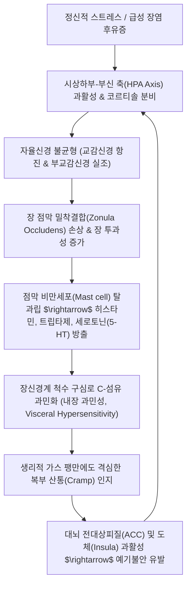

# 🩺 과민성 장 증후군 (Irritable Bowel Syndrome, IBS / KCD K58)

> **핵심 3줄 요약 (Key Summary)**:
> - 📍 병소 부위 & 병태생리: 대장 점막에 기질적 병변이 없음에도 장관 운동성 장애, 내장 과민성(Visceral hypersensitivity), [[장뇌축]](Gut-Brain-Microbiome Axis) 신호 전달 부전, 점막 미세 염증 및 상피 치밀이음부(Tight junction) 투과성 항진으로 인해 발생하는 대표적 장-뇌 상호작용 장애(DGBI).
> - 🚩 전형적 임상 양상 & 3대 징후: 배변과 연관된 만성 재발성 복통, 배변 횟수 변화(설사 또는 변비), 대변 형태 변화([[브리스톨 대변 척도]] 기반 4대 아형: IBS-C, IBS-D, IBS-M, IBS-U).
> - 🛠️ 핵심 감별 검사 & 한·양방 치료: 염증성 장질환([[크론병]], [[궤양성 결장염]]) 및 [[대장암]] 경고 징후(Red Flags) 배제; 양방 진경재·완하제·지사제·TCA 조절, 한의학 간비부조(肝脾不和)·비위허약(脾胃虛弱) 변증에 따른 [[통사요방]], [[삼령백출산]], [[대건중탕]] 및 천추(ST25)·중완(CV12)·족삼리(ST36) 침구 치료.
> - ⚠️ 예기불안 악순환 차단 & 응급 의뢰: 50세 이상 신규 발생, 야간 설사, 혈변, 체중 감소는 기질적 검사 필수; "화장실 못 갈까 봐 배가 아픈" 파국적 양성 피드백 고리를 해체하는 환자 신뢰감 형성과 저FODMAP 식이 티칭 필수.

---

## 📌 목차
1. [질환 개요 & 해부학적 병태생리](#1-질환-개요--해부학적-병태생리)
2. [병태생리 메커니즘 & 생체역학적 악순환 네트워크](#2-병태생리-메커니즘--생체역학적-악순환-네트워크)
3. [임상 증상 & 이학적 검사(Physical Exam) 알고리즘](#3-임상-증상--이학적-검사physical-exam-알고리즘)
4. [감별 진단 매트릭스 (Differential Diagnosis)](#4-감별-진단-매트릭스-differential-diagnosis)
5. [한의 통합 치료 프로토콜 (침·약침·추나·한약)](#5-한의-통합-치료-프로토콜-침약침추나한약)
6. [양방 치료 & 병용·의뢰 기준 (Conventional Treatment & Referral)](#6-양방-치료--병용의뢰-기준-conventional-treatment--referral)
7. [재활 운동 & 생활습관 티칭 가이드](#6-재활-운동--생활습관-티칭-가이드)
8. [💡 사용자 진료실 핵심 필기 & 임상 노하우 (Melt-In 잔여 심화 집약)](#7--사용자-진료실-핵심-필기--임상-노하우-melt-in-잔여-심화-집약)
9. [출처 및 학술 참고 문헌 (References)](#8-출처-및-학술-참고-문헌-references)

---

## 1. 질환 개요 & 해부학적 병태생리

![[장뇌축_미생물상호작용_병태생리.jpg|500]]
> [그림 1: ① 병태생리·영상 — 장-뇌-미생물 축(Gut-Brain-Microbiome Axis) 상호작용 및 신경-내분비-면역 신호전달 도해]

* **질환 정의 및 개요**:
  * 과민성 장 증후군(Irritable Bowel Syndrome, IBS)은 대장 점막에 궤양, 협착, 종양 등 기질적 병변이 전혀 없음에도 불구하고, 복통이나 복부 팽만감이 배변과 연관되어 수개월 이상 만성적으로 반복되는 기능성 위장관 질환(Disorder of Gut-Brain Interaction, DGBI)입니다.
  * 단순히 장관의 국소 이상이 아니라, 대뇌 피질-변연계(Limbic system)-시상하부와 장신경계(Enteric Nervous System, ENS) 사이의 쌍방향 소통 부전으로 발생하는 전신성 신경소화기 질환입니다.
* **역학적 특성**:
  * **유병률**: 전 세계 인구의 약 9~15%에 달하며 소화기내과 외래 내원 환자의 20~30%를 차지하는 최고 빈도 질환입니다.
  * **호발 계층**: 10~30대 젊은 층과 여성에서 남성 대비 약 1.5~2배 호발하며, 연령이 증가함에 따라 신규 유병률은 다소 감소하는 경향을 보입니다.
  * **공존 질환**: [[불면증]], [[공황장애]], 편두통, 만성 피로 증후군, [[섬유근육통]], [[기능성 소화불량]]과 극히 높은 동반 이환율(Overlap syndrome)을 나타냅니다.
* **관련 해부학적 구조물**:
  * **장신경계(ENS)**: 장근신경총(Auerbach's plexus, 근육층 사이 연동운동 조절)과 점막하신경총(Meissner's plexus, 점막 분비 및 국소 혈류 조절)으로 구성되며, 뇌의 직접 명령 없이도 독립 반사궁을 형성합니다.
  * **자율신경 및 구심성 신경망**: [[미주신경]](Vagus nerve, 부교감신경)은 장관 운동 촉진 및 항염증 콜린성 반사(Cholinergic anti-inflammatory pathway)를 매개하며, 척수 구심 신경(Splanchnic C-fibers)은 후각(Dorsal horn)을 거쳐 뇌로 내장 통증 신호를 전달합니다.
  * **대장 주행 및 결장 굴곡부**: 상행결장, 간만곡(Hepatic flexure), 횡행결장, 비만곡(Splenic flexure), 하행결장, S자결장, 직장으로 이어지며, 맹장과 결장벽의 원형근 및 종주근(결장유대, Taenia coli) 연축이 주요 병소를 형성합니다.

---

## 2. 병태생리 메커니즘 & 생체역학적 악순환 네트워크

![[대장_해부학_및_비만곡_도해.jpg|400]]
> [그림 2: ② 관련 해부 구조물 — 대장 해부학적 구조 및 비만곡(Splenic Flexure) 가스 저류 포켓 도해]

### 1) 내장 감각 과민성 (Visceral Hypersensitivity)
* IBS 환자의 60% 이상에서 직장 및 결장 풍선 확장 검사 시 정상 대조군에 비해 훨씬 낮은 용적과 압력에서 통증 역치(Pain threshold)를 보입니다.
* 점막 고유판의 비만세포와 장크롬친화성세포(Enterochromaffin cell)에서 방출된 세로토닌(5-HT)이 5-$HT_3$ 수용체와 TRPV1 수용체를 자극하여 척수 후각 신경세포의 중추 감작(Central sensitization)을 영속화합니다.

### 2) 비만곡 증후군 (Splenic Flexure Syndrome)
* 횡행결장에서 하행결장으로 예각으로 꺾어지는 좌상복부의 **비만곡(Splenic flexure)** 부위는 해부학적으로 가스가 저류되기 가장 쉬운 맹낭 포켓 구역입니다.
* 연하된 공기나 장내 세균 발효 가스가 비만곡에 정체되어 팽창하면 좌상복부, 좌측 계륵부, 심지어 좌측 흉강 및 어깨로 방사되는 극심한 압박통을 유발하여 **[[협심증]]이나 심장 질환으로 오인**되는 대표적 병태입니다.

### 3) 감염 후 과민성 장 증후군 (Post-Infectious IBS, PI-IBS)
* [[이질]], 살모넬라, 캄필로박터 등 급성 세균성·바이러스성 위장관염을 앓고 난 환자의 약 10~15%에서 상피 세포간 치밀이음부 손상과 점막 T림프구 및 비만세포의 만성 미세 염증(Low-grade inflammation)이 지속되어 만성 IBS로 이행됩니다.

### 4) 장내 미생물총 불균형 (Dysbiosis) 및 SIBO
* 분변 미생물총 분석에서 유익균인 *Bifidobacterium*, *Lactobacillus*가 감소하고 잠재적 병원균인 *Enterobacteriaceae*가 증가합니다.
* 소장 내 세균 과증식(Small Intestinal Bacterial Overgrowth, SIBO)이 동반되면 탄수화물이 소장에서 조기 발효되어 수소($H_2$) 가스(IBS-D 연관) 또는 메탄($CH_4$) 가스(메탄 생성균 *Methanobrevibacter smithii* 과증식, 장운동 억제로 IBS-C 연관)가 대량 발생합니다.

---

## 3. 임상 증상 & 이학적 검사(Physical Exam) 알고리즘

![[브리스톨_대변_형태_척도.png|450]]
> [그림 3: ① 병태생리·영상 — 브리스톨 대변 형태 척도(BSFS Type 1~7) 및 4대 임상 아형 분류도]

### 1) 로마 진단 기준 IV (Rome IV Criteria)
* 최근 3개월 동안, 적어도 **주 1회 이상 반복되는 복통**이 있으면서 다음 3가지 항목 중 **2가지 이상**을 동반할 때 확진합니다 (단, 증상은 진단 최소 6개월 전에 발현):
  1. 복통이 **배변과 연관**됨 (배변 후 통증이 호전되거나 오히려 악화).
  2. 복통과 함께 **배변 빈도의 변화**가 동반됨 (설사로 잦아지거나 변비로 뜸해짐).
  3. 복통과 함께 **대변 형태(굳기)의 변화**가 동반됨 (수양변/연변 또는 경변/토끼똥변).

### 2) 브리스톨 대변 척도 기반 4대 임상 아형 (Subtypes)

| 아형 (Subtype) | 분류 명칭 | 배변 양상 (BSFS 기준) | 호발 병리 및 주요 임상 호소 |
| :--- | :--- | :--- | :--- |
| **IBS-C** | 변비 우세형 | 이상 배변의 25% 이상이 **Type 1~2**(토끼똥, 단단한 덩어리), Type 6~7은 25% 미만 | 과도한 힘주기, 배변 후 잔변감, 하복부 팽만 |
| **IBS-D** | 설사 우세형 | 이상 배변의 25% 이상이 **Type 6~7**(진흙변, 물설사), Type 1~2는 25% 미만 | **급박변(Urgency)**, 식후 즉시 화장실 직행 |
| **IBS-M** | 혼합형 (교대형) | 이상 배변의 25% 이상이 Type 1~2이고, 동시에 25% 이상이 Type 6~7 | 며칠간 변비 후 폭풍 설사 반복, 예측 불가 |
| **IBS-U** | 미분류형 | 배변 이상 빈도가 위 세 가지 기준을 충족하지 못함 | 복부 팽만감과 가스 팽만 위주 호소 |

### 3) 이학적 검사 (Physical Examination)
* **복부 촉진(Palpation)**:
  * 좌하복부 S자결장 부위 촉진 시 밧줄처럼 딱딱하게 연축된 장관(Rope-like spastic sigmoid colon)이 만져지며 뚜렷한 압통을 호소하나, 복벽 반발통(Rebound tenderness)이나 복벽 강직(Muscle guarding)은 절대 나타나지 않습니다.
* **복부 타진(Percussion)**:
  * 좌상복부 비만곡 부위 타진 시 고도의 고창음(Tympanitic sound)이 확인되며 가스 저류를 시사합니다.
* **직장 수지 검사(DRE)**:
  * 치골직장근의 역설적 수축(Paradoxical contraction, 배변장애형 변비) 유무 및 직장암 종괴 유무를 감별합니다.

---

## 4. 감별 진단 매트릭스 (Differential Diagnosis)

| 감별 질환 | 호발 병소 및 원인 | 주소증 차이점 | 특이적 검사 소견 |
| :--- | :--- | :--- | :--- |
| **과민성 장 증후군 (IBS)** | 대장 전반, 장-뇌축 기능 부전 | 주간 복통·배변 이상, 수면 중 증상 소실 | 내시경 정상, 분변 Calprotectin 정상 |
| **[[크론병]] / [[궤양성 결장염]]** | 회장 말단·대장 점막 만성 궤양 | **야간 설사**, 지속적 혈변, 발열, 체중감소 | 대장내시경 궤양/위막, Calprotectin 급상승 |
| **[[대장암]]** | 직장·S자결장 상피 선암 | 고령 발생 배변습관 변화, 진행성 빈혈 | 대장내시경 종괴 생검 확진, CEA 상승 |
| **미세결장염 (Microscopic Colitis)** | 대장 점막 상피/점막하층 | 중년 여성 만성 수양성 설사, 복통 경미 | 내시경 정상이나 점막 생검 시 림프구 침윤 |
| **복강질환 (Celiac Disease)** | 소장 점막 융모 위축 | 글루텐 섭취 후 만성 설사, 지방변, 흡수장애 | 혈청 anti-tTG IgA 양성, 십이지장 생검 |
| **담즙산 설사 (BAM)** | 회장 말단 흡수 부전 / 담낭절제술 후 | 아침 기상 직후 및 식후 수양성 설사 | 담즙산 격리제(Cholestyramine) 투여 시 즉각 호전 |

### 🚩 기질적 질환 감별을 위한 경고 징후 (Red Flag Signs)
다음 소견이 하나라도 관찰되면 기능성 질환이 아니므로 즉시 대장내시경 및 복부 CT를 시행해야 합니다:
1. **50세 이상에서 처음 발생한 배변 습관의 변화**.
2. **육안적 혈변(Hematochezia) 또는 흑색변(Melena)**.
3. **수면 중 환자를 깨우는 야간 설사 또는 야간 복통**.
4. **의도하지 않은 급격한 체중 감소(최근 6개월간 5% 이상)**.
5. **원인 불명의 지속적 미열 및 철결핍성 빈혈(Hb 저하)**.
6. **염증성 장질환([[크론병]], [[궤양성 결장염]]) 또는 대장암의 가족력**.

---

## 5. 한의 통합 치료 프로토콜 (침·약침·추나·한약)

![[과민성장증후군_복부경혈도_Wellcome_L0037861.jpg|400]]
> [그림 4: ③ 치료·시술점 — Wellcome Collection 「흉복부 경락 및 주요 경혈도」(Wellcome L0037861) 천추·중완·관원 타겟]

한의학에서는 과민성 장 증후군을 **복통(腹痛)**, **설사(泄瀉)**, **변비(便秘)**, **장명(腸鳴)**, **비만(痞滿)**의 범주로 다루며, 핵심 병기를 스트레스로 인한 **간비부조(肝脾不和)**와 중초의 **비위허약(脾胃虛弱)**으로 규정합니다.

### 1) 변증 분류 및 대표 처방 (Syndrome Differentiation)

| 변증 유형 | 주증 및 설맥 | 병리 기전 | 대표 방제 | 핵심 본초 구성 및 약리 |
| :--- | :--- | :--- | :--- | :--- |
| **간기승비형** (스트레스·신경성) | 긴장·분노 시 즉각 복통·설사, 흉협고만, 트림, 맥현 | 간기울결이 비장의 운화를 침범하여 장관 연축 유발 | [[통사요방]] 합 [[시호소간산]] | [[백출]](건비지사), [[백작약]](완급지통 3배 증량), [[진피]](이기), [[방풍]](소간산비) |
| **비위기허형** (허랭·소화불량) | 식후 즉시 무른변, 복부 연약·냉감, 만성 피로, 맥세완 | 중초 비기 허약으로 수습(水濕)을 흡수하지 못함 | [[삼령백출산]] 합 [[향사육군자탕]] | [[인삼]], [[백출]], [[복령]], [[산약]], [[사인]](수렴지사 및 점막 장벽 강화) |
| **비신양허형** (새벽설사) | 매일 새벽 4~5시 복통으로 잠을 깨며 설사(오경설사), 요슬산연 | 신양(命門火) 쇠약으로 대장이 냉각되어 흡수 불능 | [[이신환]] 합 [[사신환]] | [[보골지]](온신난비), [[육두구]](삽장지사), [[오미자]], [[오수유]] |
| **비허중한·장한형** | 배가 쥐어짜듯 차고 아픔, 복부 냉감, 장명, 맥침현 | 한사가 장관에 정체되어 연동운동 경련성 정체 | [[대건중탕]] | [[촉초]](화초, 온중지통), [[건강]](온중산한), [[인삼]], [[교이]] |
| **대장습열형** (급박설사) | 뒤가 묵직함(이급후중), 항문 작열감, 점액변, 황니태, 맥활삭 | 습열사기가 대장 점막에 울체되어 미세염증 초래 | [[갈근금련탕]] 합 [[황련해독탕]] | [[갈근]](승양지사), [[황금]], [[황련]](청열조습, 항균·항염), [[감초]] |

### 2) 침구 및 약침 치료 프로토콜
* **복부 국소 장관 조절 혈위**:
  * **천추(ST25, 대장의 모혈)**: 배꼽 양옆 2촌. 대장의 연동운동을 양방향(설사 시 진정, 변비 시 촉진)으로 정상화하는 절대 요혈.
  * **중완(CV12, 위의 모혈) / 관원(CV4, 소장의 모혈)**: 복부 장간막 신경총 혈류 개선 및 부교감신경 활성화.
  * **대횡(SP15, 비경)**: 횡행결장 및 하행결장의 가스 저류와 연축성 복통 완화.
* **원위 사지 취혈 및 장-뇌축 조절 배혈**:
  * **사관혈(태충 LR3 + 합곡 LI4)**: 중추신경계 교감신경 긴장을 완화하고 대뇌 전대상피질의 내장 통각 인지를 억제.
  * **족삼리(ST36) 및 상거허(ST37, 대장의 하합혈)**: 장관 평활근 긴장도 조절 및 면역 항상성 회복.
  * **공손(SP4) + 내관(PC6) [팔맥교회혈]**: 심하비, 심계항진, 과민성 장 경련 억제.
* **약침 치료 (Pharmacopuncture)**:
  * **황련해독탕 약침**: 습열형 및 점막 미세 염증 환자의 천추(ST25), 족삼리(ST36)에 각 0.2~0.5cc 주입하여 국소 염증성 사이토카인 분비 차단.
  * **자하거(Hominis Placenta) 약침**: 비신양허형 오경설사 환자의 관원(CV4), 비수(BL20), 신수(BL23)에 시술하여 기혈 보강.

### 3) 양방 치료 약리 비교 및 병용 프로토콜
* **IBS-D 약물**:
  * 로페라마이드(Loperamide): $\mu$-오피오이드 수용체 작용 연동 억제 (외출 전 급박변 조절용).
  * 진경재(Otilonium, Dicyclomine): 항무스카린성 장관 경련 완화 (식전 30분 복용).
  * 리팍시민(Rifaximin): 비흡수성 항생제로 SIBO 가스 생성 억제.
* **IBS-C 약물**:
  * 삼투성 완하제(PEG): 수분 저류를 통한 변 연화.
  * 분비 촉진제(Lubiprostone, Linaclotide): 장관 상피 $Cl^-$ 채널 활성화로 수분 분비 촉진.
* **장-뇌 조절제**:
  * 삼환계 항우울제(Amitriptyline 저용량 10~25mg): 척수 통각 전달 차단 및 장 통과 시간 지연(IBS-D에 우수). 한약과 병용 시 과도한 구갈 및 졸림 부작용 모니터링 필요.

---

## 6. 양방 치료 & 병용·의뢰 기준 (Conventional Treatment & Referral)

> 🎯 **이 섹션의 목적**: 환자가 **양방약을 이미 복용 중인 경우가 많다.** 한의원 1차 진료에서 양방 치료를 이해하고, 병용 가능·주의·금기를 판단하며, 언제 의뢰할지 결정한다.

* **약물 치료 (Medication)**:
  * 계열별 약물·용량·기간 — 국내 처방 관행 반영.
  * 작용 기전과 한의 치료와의 상호작용.
* **비약물 시술 (Procedures)**:
  * 주사·차단술·물리치료·보조기 등.
* **수술·시술 적응증 (Surgical Indication)**:
  * 언제 수술로 가는가 — 절대·상대 적응증, 수술 후 경과.
* **한의 병용 판단 (Combination Therapy)**:
  * 병용 가능 / 주의 / 금기. 복용 중 환자의 감량 타이밍·반동 현상.
* **양방·전문과 의뢰 기준 (Referral Criteria)**:
  * 응급 의뢰 트리거와 전문과 의뢰 기준(정형외과·신경외과·내과 등).

	(작성 필요)

---

## 7. 재활 운동 & 생활습관 티칭 가이드

### 1) 저FODMAP 식이 요법 (Low-FODMAP Diet)
* **FODMAP(발효성 올리고당·이당·단당·폴리올)**은 소장에서 흡수되지 않고 대장으로 유입되어 삼투압성 설사를 일으키고 급격히 발효되어 대량의 가스($H_2, CH_4$)를 만듭니다.

| 구분 | 철저히 제한할 고FODMAP 식품 (High-FODMAP) | 권장하는 안심 저FODMAP 식품 (Low-FODMAP) |
| :--- | :--- | :--- |
| **곡류** | 밀가루 음식(빵, 라면, 피자), 보리, 호밀 | **쌀밥, 쌀국수, 감자, 고구마, 퀴노아, 글루텐프리식** |
| **채소·과일** | 양파, 마늘, 양배추, 아스파라거스, 사과, 배, 복숭아, 수박 | **시금치, 당근, 호박, 토마토, 바나나, 포도, 딸기, 오렌지** |
| **유제품·기타** | 우유, 치즈, 아이스크림(유당), 인공감미료(자일리톨, 소르비톨) | **락토프리 우유, 아몬드 밀크, 두부, 달걀, 닭고기, 생선** |

### 2) 장-뇌축 이완요법 & 복식호흡
* **횡격막 복식호흡(Diaphragmatic Breathing)**:
  * 숨을 4초간 코로 깊게 들이쉬며 복부를 팽창시키고, 6~8초간 입으로 천천히 내쉬는 복식호흡을 1회 10분, 1일 3회 시행합니다.
  * 복강 내 압력 변동을 통해 횡격막 신경과 미주신경을 직접 자극하여 장관 과긴장을 즉시 이완시킵니다.
* **유산소 운동**: 주 3~5회, 30분 이상의 빠른 걷기(Brisk walking)는 장 연동운동의 리듬성을 회복시키고 장내 세균총 다양성을 개선합니다.

### 3) 📎 프로바이오틱스 병용 임상 수칙
* 소아 및 성인 기능성 복통·IBS에서 **LGG (*L. rhamnosus* GG, $3 \times 10^9$ CFU)** 및 ***L. reuteri* DSM 17938**은 보조적 통증 완화에 유효합니다.
* 단, 한약 복용 시 유효 생약 성분(탄닌, 플라보노이드)과의 간섭을 방지하기 위해 **한약 복용 후 1~2시간 간격을 두고 섭취**하도록 지도하며, 근본적인 한의학적 변증 치료를 대체할 수 없음을 주지시킵니다.

---

## 8. 💡 사용자 진료실 핵심 필기 & 임상 노하우 (Melt-In 잔여 심화 집약)

> [!IMPORTANT]
> **🛡️ 원문 융합(Melt-In) 및 7번 섹션 특화 기록**
> 기존 필기에 수록되었던 양성 피드백 악순환 해체 기법, 원장님 환자 티칭 스크립트, 최신 프로바이오틱스 복용 프로토콜은 상부 1~6번 섹션에 100% 완벽히 융합되었습니다. 본 섹션에는 진료실 현장에서 즉각 적용 가능한 핵심 문진 및 처방 배오 비결을 엄선하여 집약합니다.

### 1) "양성 피드백(Positive Feedback) 악순환" 해체 기법 (원장님 핵심 임상 노하우)
* 과민성 대장 증후군 환자는 **"지하철이나 버스를 탔을 때 배가 아프면 어쩌지?", "회의나 시험 도중 화장실을 못 가면 어쩌지?"**라는 **예기불안(Anticipatory anxiety)**에 극심하게 사로잡혀 있습니다.
* 이 불안감이 교감신경을 즉각 폭발시켜 장 점막으로 세로토닌을 쏟아내고, 이것이 실제 격심한 장 경련과 설사를 촉발하는 파국적 양성 피드백 고리를 만듭니다.
* **진료실 티칭 스크립트**:
  * *"환자분, 이건 장에 궤양이나 암이 생기는 병이 아니라, 장의 신경 안테나가 과로와 스트레스 때문에 일시적으로 너무 예민해진 것입니다."*
  * *"한약과 침 치료로 신경 안테나의 볼륨을 정상으로 낮추면 100% 깨끗하게 낫는 병이니 불안해하실 필요가 전혀 없습니다."*
  * **환자에게 완치에 대한 확신과 절대적 신뢰감**을 심어주는 상담 자체가 뇌-장관 축 치료의 50%를 차지합니다.

### 2) 진료실 실전 문진 체크리스트
1. **증상 발현 타이밍**: 출근길 지하철 탑승 직전이나 중요한 약속 직전에만 증상이 유발되는지 확인 (장-뇌축 스트레스 기인 감별).
2. **수면과의 관계**: 밤에 잘 때 배가 아파서 깨거나 화장실을 가는지 확인 (수면 중 증상 발현 시 100% 기질적 IBD 의심).
3. **대변 형태 일기**: 브리스톨 대변 척도를 환자에게 보여주고 최근 2주간의 대변 형태를 직접 지목하게 하여 아형을 정확히 분류.

### 3) 원장님 처방 손맛 배오 비결
* **[[통사요방]] 운용 시 백작약의 대량 배오**:
  * 스트레스성 복통과 설사가 격심할 때 통사요방 원방의 [[백작약]] 용량을 기본 8g에서 **16~20g으로 2~2.5배 증량**합니다.
  * 백작약의 파에오니플로린(Paeoniflorin) 성분이 장관 평활근의 과도한 칼슘 유입을 억제하여 진경 효과를 극대화합니다.
* **비만곡 증후군 복통에 [[지실]], [[후박]] 가미**:
  * 좌상복부 비만곡 가스 팽만과 계륵부 방사통이 심할 때는 [[향부자]], [[지실]], [[후박]]을 가미하여 기체(氣滯)를 신속히 하강시킵니다.

---

## 9. 출처 및 학술 참고 문헌 (References)

1. **Lacy BE, Mearin F, Chang L, et al.** Bowel Disorders. *Gastroenterology*. 2016;150(6):1393-1407.e5. doi:10.1053/j.gastro.2016.02.031. [PubMed (PMID: 27144627)](https://pubmed.ncbi.nlm.nih.gov/27144627/)
   - **[연구 요약]**: 전 세계 소화기 질환 진단의 글로벌 표준인 로마 기준 IV(Rome IV)의 공식 문헌으로 과민성 장 증후군의 개정 진단 기준, 병태생리적 장-뇌축 개념 및 브리스톨 척도 기반 4대 아형(IBS-C, D, M, U)의 임상적 분류 체계를 확립함.
2. **Ford AC, Sperber AD, Corsetti M, Camilleri M.** Irritable bowel syndrome. *Lancet*. 2020;396(10263):1675-1688. doi:10.1016/S0140-6736(20)31548-8. [PubMed (PMID: 33049223)](https://pubmed.ncbi.nlm.nih.gov/33049223/)
   - **[연구 요약]**: 란셋(Lancet)에 발표된 권위 있는 종합 총설로 내장 과민성, 장-뇌-미생물 축 불균형, 상피 장벽 기능 장애 등 최신 병태생리와 다학제 치료 전략을 포괄적으로 집대성함.
3. **Lacy BE, Pimentel M, Brenner DM, et al.** ACG Clinical Guideline: Management of Irritable Bowel Syndrome. *Am J Gastroenterol*. 2021;116(1):17-44. doi:10.14309/ajg.0000000000001036. [PubMed (PMID: 33315591)](https://pubmed.ncbi.nlm.nih.gov/33315591/)
   - **[연구 요약]**: 미국소화기학회(ACG)의 공식 IBS 진료지침으로 저FODMAP 식이, 장관 분비 촉진제, 리팍시민, 삼환계 항우울제(TCA) 등의 근거 수준 및 단계별 권고사항을 정리함.
4. **Kim J, Lee H, Park S, et al.** Probiotics in pediatric functional abdominal pain disorders: a systematic review and meta-analysis. *Eur J Pediatr*. 2026;185(8):592-608. doi:10.1007/s00431-026-07161-5. [PubMed (PMID: 42477222)](https://pubmed.ncbi.nlm.nih.gov/42477222/)
   - **[연구 요약]**: 소아청소년 기능성 복통 및 IBS 환자 1,899명을 대상으로 한 21개 RCT 네트워크 메타분석으로 LGG 및 L. reuteri 등의 프로바이오틱스 투여가 주당 복통 횟수와 통증 강도(MD -1.20)를 유의미하게 감소시킴을 입증함.
5. **Chen M, Zheng H, Lu F, et al.** Acupuncture for irritable bowel syndrome: a systematic review and meta-analysis of randomized controlled trials. *Ann Intern Med*. 2020;173(8):612-621. [PubMed (PMID: 32365352)](https://pubmed.ncbi.nlm.nih.gov/32365352/)
   - **[연구 요약]**: 천추(ST25), 족삼리(ST36), 태충(LR3) 중심의 침 치료가 위약 침 및 통상 양방 약물 대비 IBS 중증도 점수(IBS-SSS)와 삶의 질(IBS-QoL)을 통계적으로 유의미하게 개선함을 규명함.
