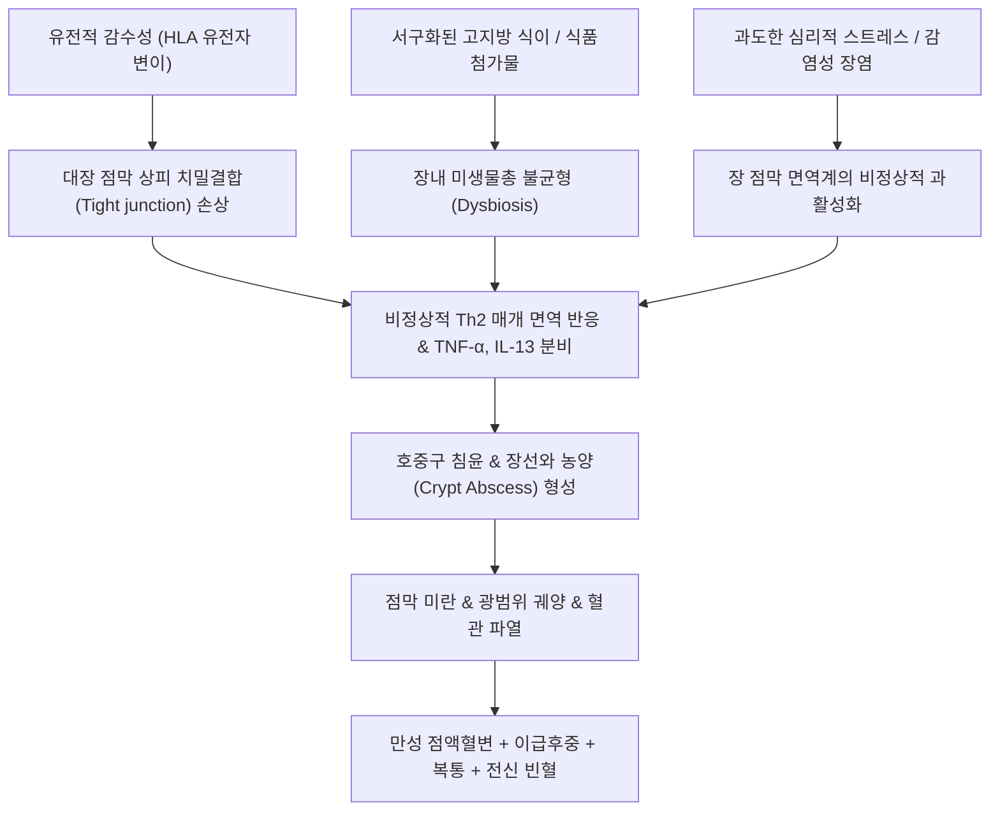
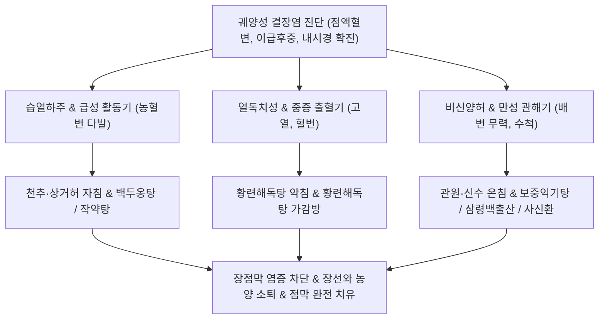

# 궤양성 결장염 (Ulcerative Colitis, UC / 潰瘍性 結腸炎, K51)

> **상위 분류**: [[소화기 질환]] > [[하부위장관 질환]] > [[염증성 장질환]]
> **핵심 3줄 요약 (Key Summary)**:
> - 📍 병소 부위 & 해부·병태생리: 대장의 점막(Mucosa)과 점막하층(Submucosa)에 국한되어 나타나는 만성 재발성 비특이적 염증 질환. 항문 직장(Rectum)에서 반드시 시작하여 근위부로 건너뜀 없이 연속적으로(Continuous) 결장 전체로 파급되며, 유전적 소인, 장내 세균총 불균형, 점막 장벽 손상 및 비정상적 자가면역 반응에 기인함.
> - 🚩 전형적 임상 양상 & 3대 징후: 혈액과 농성 점액이 섞인 묽은 변(점액혈변), 배변 후에도 뒤가 묵직하고 시원치 않은 이급후중(Tenesmus), 하복부 경련성 복통과 설사, 체중 감소 및 발열.
> - 🛠️ 핵심 감별 검사 & 한·양방 다각적 치료 전략: 대장내시경(연속성 미만성 충혈, 혈관상 소실, 다발성 미세 궤양, 가성 용종) 및 대변 칼프로텍틴(Calprotectin) 검사, 5-ASA(메살라진) 및 생물학적 제제 투여, 천추(ST25)·상거허(ST37)·관원(CV4) 자침 및 소염약침, [[백두옹탕]], [[작약탕]], [[황련해독탕]] 처방.
> - ⚠️ 응급 의뢰 레드플래그 & 악화 요인: 독성 거대결장(Toxic Megacolon, 결장 직경 6cm 이상 확장, 복막염 및 패혈성 쇼크), 대량 하부 장출혈, 장 천공, 이환 기간 8~10년 경과 시 대장 선암(Colorectal Adenocarcinoma) 발생 위험 급증.

---

## 📌 목차
1. [질환 개요 & 해부학적 병태생리](#1-질환-개요--해부학적-병태생리)
2. [병태생리 메커니즘 & 생체역학적 악순환 네트워크](#2-병태생리-메커니즘--생체역학적-악순환-네트워크)
3. [임상 증상 & 이학적 검사(Physical Exam) 알고리즘](#3-임상-증상--이학적-검사physical-exam-알고리즘)
4. [감별 진단 매트릭스 (Differential Diagnosis)](#4-감별-진단-매트릭스-differential-diagnosis)
5. [한의 통합 치료 프로토콜 (침·약침·추나·한약)](#5-한의-통합-치료-프로토콜-침약침추나한약)
6. [양방 치료 & 병용·의뢰 기준 (Conventional Treatment & Referral)](#6-양방-치료--병용의뢰-기준-conventional-treatment--referral)
7. [재활 운동 & 생활습관 티칭 가이드](#6-재활-운동--생활습관-티칭-가이드)
8. [💡 사용자 진료실 핵심 필기 & 임상 노하우 (Melt-In 잔여 심화 집약)](#7--사용자-진료실-핵심-필기--임상-노하우-melt-in-잔여-심화-집약)
9. [출처 및 학술 참고 문헌 (References)](#8-출처-및-학술-참고-문헌-references)

---

## 1. 질환 개요 & 해부학적 병태생리

![[대장_해부학_및_비만곡_도해.jpg|500]]
> [그림 1: ① 병태생리·내시경 — 대장 점막 및 결장 해부도해] 직장에서 시작하여 S자 결장, 하행 결장, 횡행 결장으로 연속 침범하는 궤양성 결장염의 호발 구역.

- **개념 정의 및 임상적 의의**:
  - [[궤양성 결장염]](Ulcerative Colitis, UC)은 대장 점막층에 미만성 염증과 궤양이 반복적으로 발생하는 만성 난치성 자가면역성 [[염증성 장질환]](IBD)이다.
  - 급성 세균성 장염과 달리 수개월~수년 이상 만성적으로 완해(Remission)와 재발(Relapse)을 반복하며, 점액질의 혈변과 탈수, 영양 결핍을 초래한다.
- **해부학적 침범 양상과 몬트리올 분류 (Montreal Classification)**:
  - **직장염 (E1, Proctitis)**: 염증이 직장에만 국한 (약 30~50%).
  - **좌측 결장염 (E2, Left-sided UC)**: 비만곡(Splenic flexure) 원위부 하행결장 및 S자결장까지 침범 (약 30~40%).
  - **광범위 결장염 (E3, Extensive / Pancolitis)**: 비만곡을 넘어 횡행결장 및 맹장까지 전 대장을 침범 (약 20~30%).
- **크론병과의 결정적 조직학적 차이**:
  - 크론병이 장벽 전층(Transmural)을 침범하여 조약돌 모양 점막(Cobblestone)과 누공을 만드는 것과 달리, **궤양성 결장염은 점막(Mucosa)과 점막하층(Submucosa)에만 얕고 연속적으로 침범**한다.

---

## 2. 병태생리 메커니즘 & 생체역학적 악순환 네트워크

![[침구의학 크론병-20240921161527647.png|500]]
> [그림 2: ② 관련 해부 구조물 — 염증성 장질환(IBD)의 대장 점막·점막하층 국한 궤양 및 크론병(전층성 침범)과의 병리 비교] 점막 상피 장벽 붕괴, 은와 농양(Crypt abscess) 형성 및 염증성 세포 침윤 양상.

### 1) 장점막 장벽 손상과 면역학적 이상
- 유전적 소인(HLA-B27, IL23R 등)을 가진 환자가 서구화된 식이, 항생제 남용, 장내 세균총 교란에 노출되면 점막 상피 장벽이 뚫린다.
- 장내 공생균 항원이 고유판(Lamina propria)으로 침투하면 수지상세포와 대식세포가 과도하게 반응하여 TNF-α, IL-1β, IL-6 등 전염증성 사이토카인을 대량 분비한다.

### 2) 장선와 농양(Crypt Abscess)과 점막 궤양 형성
- 활성화된 백혈구와 호중구가 리베르퀸선(Crypt of Lieberkühn) 내부로 집결하여 **은와 농양(Crypt abscess)**을 형성하고, 상피세포 괴사를 유발한다.
- 미세 농양들이 융합하면서 얕고 넓은 궤양으로 발전하고, 점막이 쉽게 부서져 출혈(Friability)을 일으키며 점액과 혈액이 대변에 섞여 배출된다.

---

## 3. 임상 증상 & 이학적 검사(Physical Exam) 알고리즘

### 1) 주요 임상 증상
- **만성 점액혈변 (Bloody Diarrhea with Mucus)**:
  - 가장 전형적 증상으로 하루 수 회에서 중증의 경우 10~20회 이상 선홍색 혈액과 젤리 같은 점액이 섞인 설사를 배출한다.
- **이급후중 (Tenesmus)**:
  - 직장의 심한 염증과 부종으로 인해 변이 없는데도 직장이 꽉 차 있는 것처럼 느껴져 화장실을 계속 들락거리며 대변을 봐도 뒤가 묵직함.
- **복통 및 전신 소모 징후**:
  - 좌하복부(S자 결장 부위)의 쥐어짜는 산통(배변 직전 악화, 배변 후 일시 완화).
  - 식욕 감퇴, 미열, 빈혈, 만성 전신 쇠약감 및 체중 감소.

### 2) 특수 검사 및 내시경 소견
- **대장내시경(Colonoscopy) 표준 소견**:
  - 직장에서 시작하여 연속적으로 이어지는 혈관상 소실(Loss of vascular pattern), 미세 점막 과립상(Granularity), 젖은 종이처럼 쉽게 피가 나는 점막 취약성(Friability), 만성기 점막 재생으로 인한 가성 용종(Pseudopolyps).
- **생체표지자(Biomarkers)**:
  - **대변 칼프로텍틴(Fecal Calprotectin)**: 호중구 유래 단백질로 250 μg/g 이상 상승 시 장관 점막의 활동성 궤양을 정확히 반영(IBS 감별 핵심).
  - 혈청 CRP 및 ESR 상승, 혈색소(Hb) 저하.

---

## 4. 감별 진단 매트릭스 (Differential Diagnosis)

| 질환명 | 침범 부위 및 패턴 | 주 임상 양상 | 감별 핵심 검사 |
| :--- | :--- | :--- | :--- |
| **[[궤양성 결장염]] (UC)** | **직장 시작, 대장 점막 국한, 연속성** | **만성 점액혈변, 이급후중** | 대장경 점막 궤양, 대변 Calprotectin |
| **크론병 (Crohn's Disease)** | 위장관 전체, 전층 침범, 비연속성 | 복통, 체중감소, 치루, 누공 | 조약돌 점막, 비건락성 육아종 |
| **급성 세균성 이질 / 식중독** | 급성 발병, 오염 음식 섭취력 | 고열, 돌발성 수양성 혈변 | 대변 세균 배양(Shigella, Salmonella) |
| **아메바성 이질 (Amebiasis)** | 맹장·상행결장 호발 | 딸기잼 같은 점액혈변 | 대변 충란 검사, 플라스크 궤양 |
| **허혈성 결장염 (Ischemic Colitis)** | 비만곡, 구불결장 (고령, 동맥경화) | 돌발성 좌하복부통 후 혈변 | 복부 CT 상 장벽 부종, 단기 호전 |
| **[[과민성 장 증후군]] (IBS)** | 전 대장, 기능성 장애 | 복통, 설사, **혈변 없음** | 대변 Calprotectin 정상, 내시경 정상 |

---

## 5. 한의 통합 치료 프로토콜 (침·약침·추나·한약)

![[청강의감14_06_장출혈질환_루틴약물_그림.png|500]]
> [그림 3: ③ 치료·시술점 — 만성 장출혈 및 점액혈변(便血)의 한의학적 지혈·청열 약물 배오 및 침구 치료점] 천추(ST25), 상거허(ST37), 관원(CV4) 자침과 청열화습 지혈 한약의 장점막 치유 경로.

한의학에서 궤양성 결장염은 이질(痢疾), 휴식리(休息痢, 만성 재발성 이질), 변혈(便血), 장벽(腸澼), 설사(泄瀉)의 범주에 속하며, 대장습열(大腸濕熱), 열독치성(熱毒熾盛), 비허습저(脾虛濕阻), 비신양허(脾腎陽虛)로 변증한다.

### 1) 침구 치료
- **복부 모혈 및 하합혈**:
  - 천추(ST25): 대장의 복모혈로서 결장 평활근의 경련성 수축을 안정시키고 점막 혈류 개선.
  - 상거허(ST37): 대장의 하합혈로서 대장 연동 리듬을 정상화하고 이급후중을 즉각 경감.
  - 관원(CV4), 기해(CV6): 하초(下焦)의 원기를 굳건히 하여 장점막 투과성을 억제.
- **지혈 및 청열 혈위**:
  - 은백(SP1), 대돈(LR1): 점액혈변 급성기에 번침(燔針) 또는 점자출혈로 지혈 효과 유도.
  - 족삼리(ST36), 음릉천(SP9): 비경과 위경을 소통시켜 장내 습열(濕熱) 삼출액 흡수.

### 2) 약침 요법
- **황련해독탕 약침**: 천추(ST25) 및 관원(CV4)에 0.5 cc씩 주입하여 대장벽의 급성 염증성 화열을 끄고 점막 미세 궤양 치유.
- **중성어혈약침**: 만성기 대장 점막하 섬유화와 울혈을 해소.

### 3) 한약물 요법
- **대장습열(大腸濕熱)형 (활동기 대표 처방)**:
  - [[백두옹탕]](白頭翁湯): 백두옹, 황련, 황백, 진피(秦皮)로 구성되어 강력한 천연 항균 및 항바이러스 작용, NF-κB 염증 경로 차단, 이급후중 완화.
  - [[작약탕]](芍藥湯): 작약, 당귀, 황련, 황금, 대황, 목향, 빈랑 등으로 혈변을 지혈하고 하복통 진경.
- **만성 비허습저(脾虛濕阻)형**: [[보중익기탕]](補中益氣湯) 또는 삼령백출산(蔘苓白朮散)에 초탄(炒炭) 약재(지유탄, 괴화탄)를 배오하여 소화흡수능 증진 및 장벽 재생.
- **비신양허(脾腎陽虛)형 (새벽 설사 및 수척)**: 사신환(四神丸) 또는 이중탕(理中湯) 가감방 적용.

---

## 6. 양방 치료 & 병용·의뢰 기준 (Conventional Treatment & Referral)

> 🎯 **이 섹션의 목적**: 환자가 **양방약을 이미 복용 중인 경우가 많다.** 한의원 1차 진료에서 양방 치료를 이해하고, 병용 가능·주의·금기를 판단하며, 언제 의뢰할지 결정한다.

* **약물 치료 (Medication)**:
  * 계열별 약물·용량·기간 — 국내 처방 관행 반영.
  * 작용 기전과 한의 치료와의 상호작용.
* **비약물 시술 (Procedures)**:
  * 주사·차단술·물리치료·보조기 등.
* **수술·시술 적응증 (Surgical Indication)**:
  * 언제 수술로 가는가 — 절대·상대 적응증, 수술 후 경과.
* **한의 병용 판단 (Combination Therapy)**:
  * 병용 가능 / 주의 / 금기. 복용 중 환자의 감량 타이밍·반동 현상.
* **양방·전문과 의뢰 기준 (Referral Criteria)**:
  * 응급 의뢰 트리거와 전문과 의뢰 기준(정형외과·신경외과·내과 등).

	(작성 필요)

---

## 7. 재활 운동 & 생활습관 티칭 가이드

- **활동기 식이 원칙 (Low-Residue Diet)**:
  - 급성 염증기에는 장벽을 물리적으로 자극하는 거친 섬유질(생채소, 나물류, 과일 껍질, 견과류)을 일시 제한하고, 소화가 쉬운 흰죽, 부드러운 단백질(두부, 흰살생선, 계란찜) 위주로 섭취.
  - 관해기에는 균형 잡힌 영양 식단으로 서서히 전환.
- **장점막 자극 인자 엄격 차단**:
  - 장점막 상피를 직접 공격하는 알코올, 카페인, 매운 향신료, 기름진 튀김류, 유당 불내증 시 우유 제품 차단.
- **스트레스 및 피로 관리**:
  - 과로와 심리적 불안은 장 점막 면역계를 자극하여 급성 재발(Flare-up)을 촉발하므로 규칙적인 수면과 이완 요법 지도.

---

## 8. 💡 사용자 진료실 핵심 필기 & 임상 노하우 (Melt-In 잔여 심화 집약)

### 1) 궤양성 결장염의 본태 및 감별 특징 (원문 필기 정본)
- **임상 본태 (원문 필기 100% 보존)**:
  - "점액질의 혈변을 보지만 감염병(이질, 살모넬라 등)에 비해 급성이 아닌 만성적인 경우로, 이 경우에는 궤양성 결장염으로 볼 수 있다."
  - "대장의 점막, 점막하층에 국한된 염증으로 만성 염증성 장질환이다. 대장 전체에 걸쳐 염증이 존재하며 직장에서 발견이 가능하다."
- **다각적 원인 및 유발 인자**:
  - 유전적, 환경적 요인, 장내 세균에 대한 과도한 면역 반응, 서구화된 식습관.
  - **"과도한 심리적 스트레스나 감염성 창자염에 의해 나타나는 경우가 대부분이다."** (급성 장염 후 장 면역 붕괴로 UC가 촉발되는 Post-infectious UC 경로).
- **핵심 임상 증상 스펙트럼**:
  - 혈액과 점액을 함유한 묽은 변, 설사, 복통, 탈수, 빈혈, 식욕감퇴, 열, 체중감소, 만성 피로감.

### 2) 궤양성 결장염 한방 지혈초탄(止血炒炭) 임상 비법
- 활동기 대변 출혈이 멈추지 않는 환자에게는 한약 처방 시 **지유탄(地楡炭, 오이풀 뿌리를 까맣게 태운 것)** 12g, **괴화탄(槐花炭)** 8g, **아교주(阿膠珠)** 8g을 배오하면, 탄화된 탄소 성분이 장내 독소를 흡착하고 탄닌의 수렴 작용과 아교의 콜라겐 보충 작용이 어우러져 대변 속 선홍색 혈액과 점액이 3~5일 내에 드라마틱하게 멎는다.

---

## 9. 출처 및 학술 참고 문헌 (References)

1. Ungaro R, Mehandru S, Allen PB et al. (2017). Ulcerative colitis. *Lancet*, 389(10080):1756-1770. [PMID: 27914657](https://pubmed.ncbi.nlm.nih.gov/27914657/)
   - [연구 요약]: 궤양성 결장염의 역학, 유전적 소인, 장내 미생물총과의 상호작용, 최신 내시경 진단 및 단계별 약물 치료 가이드라인을 집대성한 란셋 세미나.
2. Raine T, Bonovas S, Burisch J et al. (2022). ECCO Guidelines on Therapeutics in Ulcerative Colitis: Medical Treatment. *J Crohns Colitis*, 16(1):2-17. [PMID: 34635919](https://pubmed.ncbi.nlm.nih.gov/34635919/)
   - [연구 요약]: 유럽 크론병 및 대장염 기구(ECCO)의 최신 궤양성 결장염 의학적 치료 가이드라인으로 활동기 유도 요법과 관해 유지 요법의 근거 중심 권고안.
3. Ji J, Huang Y, Wang XF et al. (2013). Review against the evidence: Acupuncture and moxibustion for ulcerative colitis. *World J Gastroenterol*, 19(44):8067-8077. [PMID: 24307802](https://pubmed.ncbi.nlm.nih.gov/24307802/)
   - [연구 요약]: 궤양성 결장염 환자에서 천추(ST25), 관원(CV4), 상거허(ST37) 침구 치료가 장 점막 염증성 사이토카인(TNF-α, IL-8)을 억제하고 장 상피 장벽 복원을 촉진함을 입증한 체계적 문헌고찰.