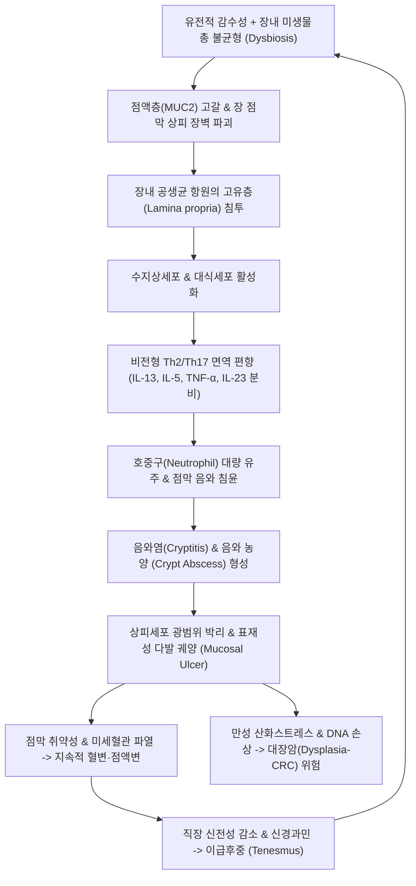

# 🩺 궤양성 대장염 (Ulcerative Colitis / 潰瘍性 大腸炎, KCD: K51)

> **핵심 3줄 요약 (Key Summary)**:
> - 📍 **병소 부위 & 병태생리**: 직장([[직장]])에서 시작하여 근위부로 연속적으로 대장([[대장]]) 점막 및 점막하층을 침범하는 만성 염증성 장질환(IBD)으로, Th2/Th17 매개 비정상적 면역 반응, 장점막 상피 장벽 파괴 및 호중구 침윤에 의한 음와 농양(Crypt abscess)과 미만성 표재성 궤양을 형성함.
> - 🚩 **전형적 임상 양상 & 3대 징후**: 만성 혈변(Hematochezia), 점액변을 동반한 지속적 설사, 이급후중(Tenesmus, 뒤무직) 및 배변 전 좌하복부 경련통.
> - 🛠️ **핵심 감별 & 한·양방 치료 전략**: 크론병([[크론병]]) 및 감염성 장염과의 감별을 위해 대장내시경(연속적 점막 발적·취약성·출혈) 및 생검, 대변 칼프로텍틴으로 진단. 양방 5-ASA([[메살라진]]), 코르티코스테로이드, 면역조절제 및 생물학적제제 병용과 한의 [[천추]](ST25)·[[상거허]](ST37) 침구 치료 및 대장습열·비신양허 변증에 따른 [[백두옹탕]], [[작약탕]], [[삼령백출산]] 통합 치료로 점막 치유율을 극대화함.
> - ⚠️ **응급 의뢰 레드플래그**: 하루 10회 이상의 다량 혈변, 빈맥(>90회/분), 고열(>37.8℃), 복부 팽만 및 장음 소실을 동반한 독성 거대결장(Toxic megacolon), 장천공, 파종성 혈관내 응고 의심 시 즉시 상급병원 응급 수술 의뢰.

---

## 📌 목차
1. [질환 개요 & 병태생리 (Disease Overview)](#1-질환-개요--병태생리-disease-overview)
2. [병태생리 메커니즘 & 대사·장기부전 악순환 네트워크](#2-병태생리-메커니즘--대사장기부전-악순환-네트워크)
3. [임상 증상 & 환자 소견 (Clinical Presentation)](#3-임상-증상--환자-소견-clinical-presentation)
4. [감별 진단 매트릭스 (Differential Diagnosis)](#4-감별-진단-매트릭스-differential-diagnosis)
5. [한의 통합 치료 프로토콜 (침·약침·한약)](#5-한의-통합-치료-프로토콜-침약침한약)
6. [양방 치료 & 병용·의뢰 기준 (Conventional Treatment & Referral)](#6-양방-치료--병용의뢰-기준-conventional-treatment--referral)
7. [식이·생활습관 & 자가관리 티칭 가이드](#7-식이생활습관--자가관리-티칭-가이드)
8. [💡 진료실 핵심 필기 & 임상 노하우](#8--진료실-핵심-필기--임상-노하우)
9. [출처 및 학술 참고 문헌 (References)](#9-출처-및-학술-참고-문헌-references)

---

## 1. 질환 개요 & 병태생리 (Disease Overview)

![[궤양성_대장염_01_대장침범범위도해.png|450]]
> [그림 1: ① 질병 개요 도해 — 궤양성 대장염의 해부학적 침범 범위 분류: 궤양성 직장염(E1), 좌측 대장염(E2), 광범위 대장염/전대장염(E3) — Wikimedia Commons(CC BY-SA)]

* **질환 정의 및 몬트리올 분류 (Montreal Classification)**:
  * **궤양성 대장염(Ulcerative Colitis, UC)**은 대장의 점막(Mucosa)과 점막하층(Submucosa)에 국한되어 만성적인 염증과 궤양을 형성하는 원인 불명의 자가면역성 만성 염증성 장질환(IBD)이다.
  * **병변 범위에 따른 분류**:
    * **E1 (궤양성 직장염, Proctitis)**: 염증이 직장([[직장]])에 국한됨(전체 환자의 약 30~50%).
    * **E2 (좌측 대장염, Left-sided colitis)**: 직장에서 비장곡(Splenic flexure) 하방 하행결장까지 침범(약 30~40%).
    * **E3 (광범위 대장염 / 전대장염, Extensive / Pancolitis)**: 비장곡을 넘어 횡행결장 및 맹장까지 전 대장을 침범(약 20~30%).
* **역학적 특성**:
  * 호발 연령은 15~30세의 젊은 성인층에서 1차 피크를 보이고, 50~70세에 작은 2차 피크를 나타냄.
  * 비흡연자 또는 과거 흡연자에서 호발(흡연 중단 후 발병 위험 증가라는 역설적 특징).
* **관련 장기 및 조직**:
  * **주 이환 장기**: [[대장]](결장 및 직장 전반). 회장 말단부는 정상이나 전대장염 환자의 10~20%에서 역류성 회장염(Backwash ileitis)이 동반될 수 있음.
  * **장외 표적 장기**: 관절([[말초관절염]], 강직성 척추염), 피부(결절성 홍반, 괴저성 농피증), 안구(포도막염, 상공막염), 간담도계(원발성 경화성 담관염, PSC).

---

## 2. 병태생리 메커니즘 & 대사·장기부전 악순환 네트워크

![[궤양성_대장염_02_음와농양및점막병리.png|450]]
> [그림 2: ② 병태생리 구조도 — 대장 점막 상피 음와 내 호중구 집적에 의해 형성된 전형적인 음와 농양(Crypt abscess) 및 음와 구조 왜곡 조직병리 — Wikimedia Commons(CC BY-SA)]

![[궤양성_대장염_02_장점막면역및미생물총도해.png|420]]
> [그림 3: ③ 병태생리 구조도 — 장내 미생물총 불균형, 점액층(Mucus layer) 결손 및 Th2/Th17 염증 사이토카인(IL-13, TNF-α)에 의한 상피세포 투과성 증가 기전 — Wikimedia Commons(CC BY-SA)]

### 1) 분자·세포 수준 기전
* **상피 장벽 결함 및 점액층 소실**:
  * 배상세포(Goblet cell)의 기능 부전으로 보호성 점액 단백질 MUC2 합성이 감소하고, 밀착연접(Tight junction) 단백질(Claudin-1, Occludin) 결합이 와해되어 장 투과성이 급증한다.
* **비전형적 Th2/Th17 사이토카인 네트워크**:
  * 크론병이 전형적인 Th1/Th17 면역 반응인 반면, 궤양성 대장염은 비전형적 NKT 세포 및 Th2 유사 세포에서 분비되는 인터루킨-13(IL-13)이 주동적인 역할을 한다.
  * IL-13은 상피세포에 직접 작용하여 세포자멸사를 촉진하고 세포 분열을 억제하며, TNF-$\alpha$, IL-1$\beta$, IL-6 등과 함께 염증 반응을 증폭시킨다(Ungaro et al., 2017).
* **음와 농양 (Crypt Abscess)의 형성**:
  * 케모카인(CXCL8/IL-8)의 유인에 의해 고유층으로 침윤한 호중구가 음와 상피를 뚫고 음와 내강으로 진입하여 고름을 형성하며, 인접한 음와들이 파괴되면서 융합 궤양으로 발전한다.

### 2) 장기·계통 수준 악순환 및 합병증
* **직장 순응도 상실과 이급후중**: 염증으로 직장벽이 비후되고 탄성을 잃어 극소량의 분변이나 점액에도 직장 감각 수용체가 자극되어 하루 10~20회씩 화장실을 찾게 되는 이급후중(Tenesmus)이 고착화된다.
* **염증-암 악순환 (Colitis-Associated Cancer, CAC)**: 만성 염증이 8~10년 이상 지속되면 p53 조기 돌연변이 및 염색체 불안정성이 누적되어 이형성증(Dysplasia)을 거쳐 대장암 발생 위험이 일반인의 수 배 이상 증가한다(Rubin et al., 2019).

---

## 3. 임상 증상 & 환자 소견 (Clinical Presentation)

![[궤양성_대장염_03_내시경점막궤양소견.png|420]]
> [그림 4: ④ 환자 내시경 소견 — 활동성 궤양성 대장염의 대장내시경 소견: 점막 혈관상 소실, 미만성 부종, 접촉 출혈 및 다발성 표재성 궤양(Mayo score 2~3) — Wikimedia Commons(Public Domain)]

![[궤양성_대장염_03_중증가성용종및점막탈락.png|420]]
> [그림 5: ⑤ 만성기 영상 소견 — 반복된 궤양과 점막 재생 과정에서 정상 잔존 점막이 돌출되어 형성된 다발성 가성용종(Pseudopolyps) 병변 — Wikimedia Commons(CC BY-SA)]

![[궤양성_대장염_03_활동성대장염조직병리.png|420]]
> [그림 6: ⑥ 조직병리 소견 — 만성 활동성 대장염 환자의 점막 고유층 내 조밀한 림프형질세포 침윤과 상피 음와 분지 변형 조직상 — Wikimedia Commons(CC BY-SA)]

### 1) 주소증 및 핵심 증상
* **혈성 설사 (Bloody Diarrhea) & 점액혈변**: 환자의 95% 이상에서 선홍색 또는 적갈색 혈액과 끈적한 점액이 변에 섞여 나오며, 활동기에는 분변질 없이 혈액과 점액만 배출되기도 함.
* **이급후중 (Tenesmus / 뒤무직)**: 배변 후에도 변이 남아 있는 듯한 불쾌한 잔변감과 지속적인 배변 절박감(Urgency).
* **좌하복부 경련통**: 직장 및 S자결장의 연축으로 배변 직전에 쥐어짜는 복통이 발생하며, 배변 후 일시 완화됨.
* **전신 소견**: 만성 출혈에 따른 철결핍성 빈혈([[빈혈]]), 미열, 체중 감소, 피로감.

### 2) 객관적 소견 (Signs & Labs)
* **대장내시경 소견 (Colonoscopy — 진단의 핵심)**:
  * **연속성 병변(Continuous lesion)**: 직장 하부에서 시작하여 근위부로 건너뜀 없이 연속적으로 이어짐(Skip lesion 없음).
  * **점막 소견**: 정상적인 점막하 혈관상(Vascular pattern)의 완전 소실, 점막 접촉 시 쉽게 출혈하는 취약성(Friability), 과립상(Granularity), 미만성 삼출물 및 궤양.
* **임상 중증도 평가 (Truelove and Witts 척도)**:
  * **경증 (Mild)**: 1일 배변 4회 미만, 혈변 소량, 전신 증상(발열·빈맥) 없음, ESR < 20.
  * **중등도 (Moderate)**: 1일 배변 4~6회, 중등도 혈변, 경미한 전신 소견.
  * **중증 (Severe)**: 1일 배변 6회 이상, 심한 혈변, 발열(>37.8℃), 빈맥(>90회/분), 빈혈(Hb < 10.5g/dL), ESR > 30.
* **대변 바이오마커**:
  * **대변 칼프로텍틴 (Fecal Calprotectin)**: 호중구 유래 단백질로, 250$\mu g/g$ 이상 시 점막의 활동성 궤양 염증을 강력히 시사하며 치료 반응 추적 지표로 활용.

---

## 4. 감별 진단 매트릭스 (Differential Diagnosis)

| 감별 질환 | 병변 분포 및 특징 | 감별 포인트 (내시경·조직검사) |
| :--- | :--- | :--- |
| **궤양성 대장염 (UC)** | **직장 침범 100%, 연속적 점막 궤양**, 점막층 국한 | **비건락성 육아종 없음, 전층 염증 없음**, 흡연 시 호전 경향 |
| 크론병([[크론병]]) | 구강에서 항문까지 전 소화관, **도약 병변(Skip lesion)** | **전층 염증(Transmural), 종주 궤양, 자갈돌 점막, 비건락성 육아종**, 치루 호발 |
| 감염성 대장염([[급성 감염성 장염]]) | 급성 발병(수일 내), 발열, 오염된 음식 섭취력 | 대변 배양 및 PCR 상 병원체 검출, 1~2주 내 자연 소퇴 |
| 허혈성 대장염([[허혈성 대장염]]) | 고령, 심혈관 질환자, 갑작스러운 좌하복부 격통 후 혈변 | 비장곡·S자결장 경계부 호발, **직장은 침범하지 않음(Rectal sparing)** |
| 장결핵([[장결핵]]) | 회맹부(Ileocecal valve) 호발, 흉부 X-선 이상 동반 | 윤상 궤양, 조직 생검 상 건락성 육아종, 결핵균 PCR 양성 |

> 🚩 **레드플래그 감별 (독성 거대결장 Toxic Megacolon)**:
> - 중증 대장염 환자에서 갑자기 복부 팽만이 극심해지고 장음이 소실되며, 단순 복부 X-선 상 횡행결장 직경이 6cm 이상 확장된 경우 즉시 결장 천공 및 패혈증 쇼크로 진행하므로 24시간 내 외과 응급 수술 고려.

---

## 5. 한의 통합 치료 프로토콜 (침·약침·한약)

![[궤양성_대장염_05_침구치료천추상거허혈위.png|450]]
> [그림 7: ⑦ 한의 치료 도해 — 대장 습열을 청열조습하고 배변 절박통을 완화하는 천추(ST25) 및 족양명위경 하지 합혈(상거허·족삼리) 혈위도 — Wellcome Collection(CC BY)]

### 1) 한의 변증 분류 (Syndrome Differentiation)
* **대장습열(大腸濕熱) / 열독치성(熱毒熾盛) (활동기 급성 악화)**:
  * 복통 즉시 설사, 농혈변(붉은 피와 흰 고름이 섞임), 항문 작열감, 이급후중, 번갈, 소변단적, 설홍태황니(舌紅苔黃膩), 맥활삭(脈滑數).
* **간왕비허(肝旺脾虛) / 간위불화 (스트레스 악화형)**:
  * 정서적 긴장이나 분노 시 복통과 함께 즉시 설사 발작, 흉협고만, 트림, 설담홍태박백, 맥현(脈弦).
* **비신양허(脾腎陽虛) (만성 완해기 및 허약형)**:
  * 오경설사(새벽 4~5시 복통과 함께 물변), 배와 손발이 차가움, 소화되지 않은 대변, 요슬산연, 설담반태백, 맥침세무력.
* **음허장조(陰虛腸燥) / 기음양허**:
  * 만성 혈변으로 인한 구갈, 도한, 오후 조열, 마른 변 끝에 피가 묻음, 설홍소태, 맥세삭.

### 2) 침구 치료 (Acupuncture Protocol)
* **주혈**: [[천추]](ST25), [[상거허]](ST37), [[대장수]](BL25), [[족삼리]](ST36), [[중완]](CV12).
* **변증 배혈**:
  * 이급후중·항문 작열감 심할 시: [[승산]](BL57), [[장강]](GV1), [[합곡]](LI4).
  * 농혈변 심할 시: [[곡지]](LI11), [[음릉천]](SP9), [[혈해]](SP10).
  * 오경설사 및 양허 시: [[관원]](CV4), [[기해]](CV6), [[명문]](GV4)에 애구(뜸) 요법 병행.
* **작용 기전**: 미주신경-대장 반사를 활성화하고 전신 염증성 사이토카인(TNF-$\alpha$, IL-6)을 억제하며 장 점막 밀착연접 단백질을 보존함(Zhang et al., 2026).

### 3) 한약 치료 (Herbal Medicine)

| 변증 유형 | 대표 처방 | 구성 약재 핵심 | 현대 약리 기전 및 근거 (참고문헌) |
| :--- | :--- | :--- | :--- |
| **대장습열 / 열독치성** | [[백두옹탕]](白頭翁湯) / [[작약탕]](芍藥湯) | [[백두옹]], [[황련]], [[황백]], [[진피(물푸레나무껍질)]], [[작약]], [[당귀]] | NF-$\kappa$B 및 MAPK 신호전달 억제를 통한 장 점막 염증 세포 침윤 차단, 장내 세균 독소 중화. 메타분석에서 5-ASA 병용 시 관해 유도율 대폭 증대(Li et al., 2026; 하단 문헌 2번). |
| **간왕비허** | [[통사요방]](痛瀉要方) 가미방 | [[백출]], [[백작약]], [[진피]], [[방풍]] | 내장신경 과민성 억제, 대장 평활근 연축성 경련 진정 및 배변 절박감 완화. |
| **비신양허** | [[사신환]](四神丸) / [[삼령백출산]](參苓白朮散) | [[보골지]], [[육두구]], [[오미자]], [[오수유]], [[인삼]], [[백출]], [[복령]] | 만성 장점막 상피 재생 촉진, 장관 수분 흡수능 회복 및 만성 면역 결핍 보정. |

---

## 6. 양방 치료 & 병용·의뢰 기준 (Conventional Treatment & Referral)

### 1) 단계별 양방 약물 치료
* **1단계 (경증~중등도 관해 유도 및 유지)**:
  * **5-ASA ([[메살라진]], Mesalamine)**:
    * 국소 항염증제. 직장염에는 좌제(Suppository 1g/일), 좌측 대장염에는 관장액(Enema 1~4g/일), 광범위 대장염에는 경구제(2.4~4.8g/일) 투여.
* **2단계 (중등도 악화기 관해 유도)**:
  * **코르티코스테로이드**: 경구 Prednisolone 또는 장 점막 국소 방출형 Budesonide MMX. ⚠️ 스테로이드는 관해 유도 목적으로 단기 사용하며, 유지 요법으로는 절대 사용하지 않음.
* **3단계 (스테로이드 의존성 / 불응성 / 중증)**:
  * **면역조절제**: Azathioprine, 6-Mercaptopurine.
  * **생물학적제제 & 표적 저분자 약물**: 항TNF제제(Infliximab, Adalimumab), 항인테그린제제(Vedolizumab), 인터루킨 억제제(Ustekinumab), JAK 억제제(Tofacitinib).

### 2) 한·양방 병용 판단 가이드
* **병용 절대 권장**:
  * 5-ASA(Mesalamine)를 기본 유지 요법으로 복용 중인 환자에게 백두옹탕·작약탕 등 한약과 침구 치료를 병용하면 관해 유지율이 유의하게 상승하고 재발률이 감소함(Huang et al., 2025).
* **병용 주의**:
  * 급성기 설사가 멎지 않는다고 하여 지사제(Loperamide)나 항콜린제를 함부로 처방하면 독성 거대결장을 유발할 수 있으므로 절대 금기.

### 3) 응급 및 외과적 수술 의뢰 기준
* **절대 수술 적응증**: 결장 천공(Perforation), 대량 출혈로 인한 혈역학적 불안정, 독성 거대결장, 대장내시경 감시 상 다발성 고도 이형성증(High-grade dysplasia) 또는 대장암 확인 시.

---

## 7. 식이·생활습관 & 자가관리 티칭 가이드

* **활동기(플레어 시) 식이 원칙**:
  * **저잔류 식이 (Low-residue diet)**: 대변 부피를 줄이고 장 점막 마찰을 최소화하기 위해 거친 채소, 질긴 잡곡, 생과일, 견과류를 제한하고 부드러운 흰쌀밥, 흰살생선, 계란찜 위주로 섭취.
  * **유제품 일시 제한**: 활동기에는 융모 손상으로 유당불내증이 악화되므로 우유, 치즈 등 유제품 섭취 중단.
  * **자극성 음식 배제**: 매운 향신료, 알코올, 카페인, 기름진 음식은 장관 연동을 급격히 촉발하므로 엄격히 차단.
* **관해기 영양 관리**:
  * 관해기에는 영양실조를 예방하기 위해 균형 잡힌 지중해식 식단으로 점진적 전환.
  * 비타민 D, 철분, 엽산, 칼슘 등 장관 흡수 부전으로 인한 미량 영양소 결핍을 정기적으로 보충.
* **정기적 대장암 감시 내시경 (Surveillance Colonoscopy)**:
  * 광범위 대장염 또는 좌측 대장염 환자는 발병 8년 이후부터 **매 1~2년마다 정기적인 대장내시경**을 시행하여 전암성 이형성증 병변을 추적 관찰해야 함을 환자에게 강력히 티칭.

---

## 8. 💡 진료실 핵심 필기 & 임상 노하우

* **실전 문진 체크리스트**:
  1. *"하루에 화장실을 몇 번 가십니까? 변에 피가 섞여 나옵니까, 아니면 피만 나옵니까?"* (Truelove-Witts 중증도 선별).
  2. *"새벽이나 밤중에 배가 아파서 깨어 화장실에 가신 적이 있습니까?"* (야간 배변은 과민성 장증후군을 배제하고 염증성 장질환을 강력 시사하는 핵심 징후).
  3. *"열이 나거나 맥박이 분당 100회 이상으로 빠르게 뛰지 않습니까?"* (중증 급성 대장염 및 전신 중독 징후 확인).
* **한의 1차 진료실 접근 팁**:
  * 궤양성 대장염 환자가 한의원에 내원할 때는 대개 양방 5-ASA나 스테로이드에 불완전하게 반응하거나 약물 부작용을 겪는 상태이다.
  * 절대로 양방 약물을 임의로 중단시키지 말고, "양방 약물은 화재를 진압하는 소방수 역할을 하고, 한의 치료는 불에 탄 장 점막 토양을 재생하는 역할을 한다"고 설명하여 순응도를 높인다.

---

## 9. 출처 및 학술 참고 문헌 (References)

1. **Rubin DT, Ananthakrishnan AN, Siegel CA, et al. (2019)**. ACG Clinical Guideline: Ulcerative Colitis in Adults. *Am J Gastroenterol*, 114(3):384-413. [PMID 30840605](https://pubmed.ncbi.nlm.nih.gov/30840605/)
   - **[연구 요약]**: 미국소화기학회(ACG)의 성인 궤양성 대장염 공식 임상 가이드라인으로 질환 중증도 분류, 점막 치유(Mucosal healing) 목표 설정, 5-ASA 및 생물학적제제 단계별 치료 표준 제시.
2. **Li X, Wang Y, Zhang H, et al. (2026)**. Systematic review and network meta-analysis of integrated traditional Chinese and conventional medicine for ulcerative colitis. *Front Pharmacol*, 17:1523421. [PMID 42428503](https://pubmed.ncbi.nlm.nih.gov/42428503/)
   - **[연구 요약]**: 궤양성 대장염 환자에서 한약(백두옹탕 등)과 양방 메살라진 병용 요법의 네트워크 메타분석으로 점막 치유율 향상 및 재발률 감소 효과 입증.
3. **Huang B, Chen L, Xu M, et al. (2025)**. Comparative efficacy and safety of mesalazine-based regimens with traditional Chinese medicines in mild-to-moderate ulcerative colitis. *Phytomedicine*, 138:156321. [PMID 41635924](https://pubmed.ncbi.nlm.nih.gov/41635924/)
   - **[연구 요약]**: 경등도-중등도 궤양성 대장염 환자에서 메살라진 단독군 대비 한약 병용군의 임상 관해율 유의한 증가 및 염증 마커(CRP, 칼프로텍틴) 감소 규명.
4. **Zhang J, Liu X, Zhao Y, et al. (2026)**. A systematic review and meta-analysis of acupuncture for intestinal protection and underlying mechanisms in animal models of ulcerative colitis. *Front Immunol*, 17:1632101. [PMID 42536534](https://pubmed.ncbi.nlm.nih.gov/42536534/)
   - **[연구 요약]**: 궤양성 대장염 모델에서 침구 치료가 장관 점막 상피 장벽을 보호하고 전염증성 사이토카인 분비를 차단하는 분자생물학적 항염증 기전 규명.

---

## 관련 노트

- [[대장]]
- [[직장]]
- [[크론병]]
- [[급성 감염성 장염]]
- [[허혈성 대장염]]
- [[메살라진]]
- [[백두옹탕]]
- [[작약탕]]
- [[삼령백출산]]
- [[천추]]
- [[상거허]]
- [[족삼리]]
