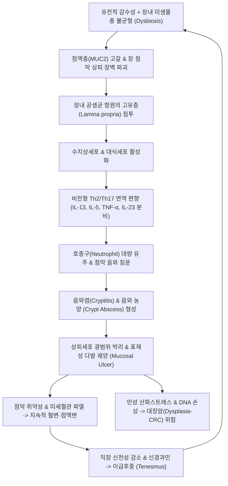
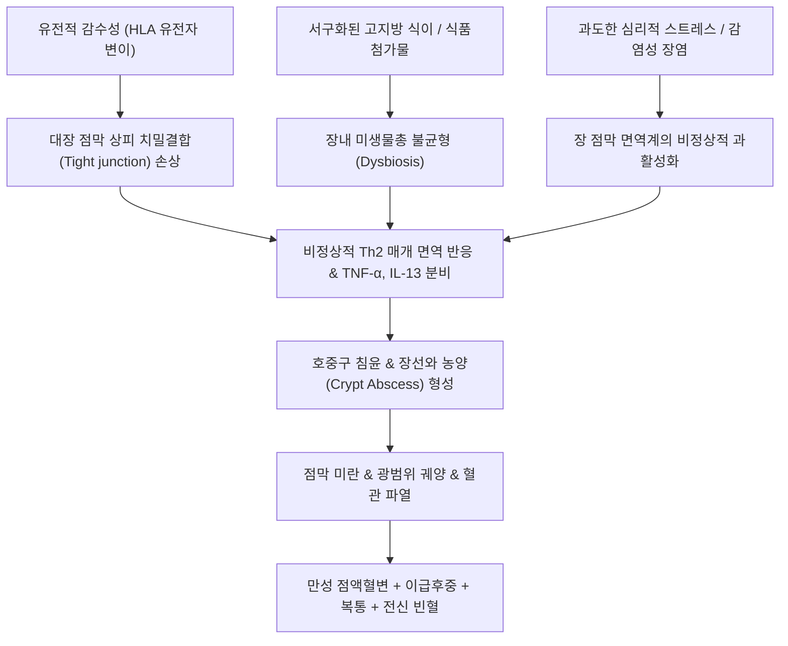
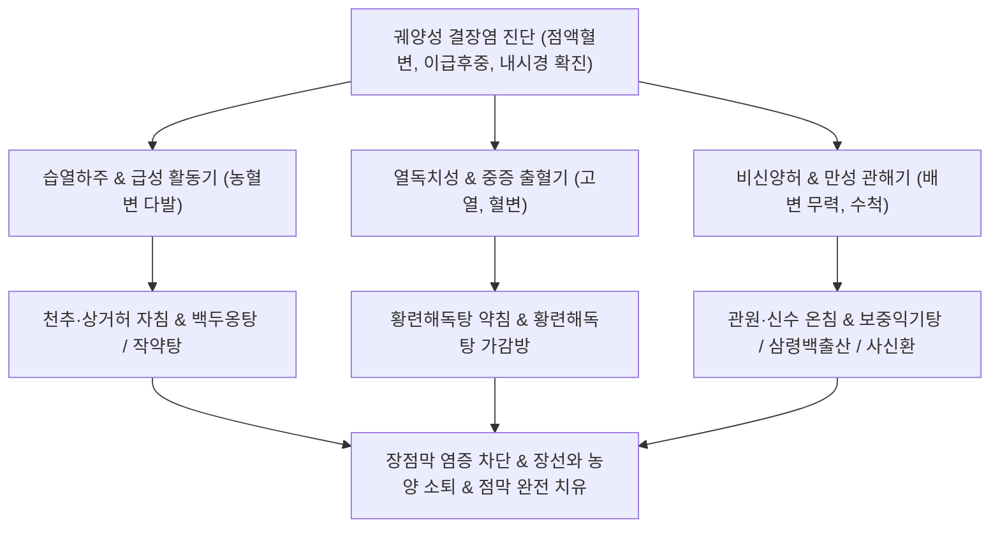

---
aliases:
  - 궤양성 결장염
---

aliases:
  - 궤양성 결장염
title: "궤양성 대장염"
created: 2026-09-25
updated: 2026-10-08
status: 완결
출처:
  - MSD 매뉴얼 (전문가용)
  - ACG Clinical Guideline (2019/2025)
분류: 질환
영역: 내과·소화기계
---

# 🩺 궤양성 대장염 (Ulcerative Colitis / 潰瘍性 大腸炎, KCD: K51)

> **핵심 3줄 요약 (Key Summary)**:
> - 📍 **병소 부위 & 병태생리**: 직장([[직장]])에서 시작하여 근위부로 연속적으로 대장([[대장]]) 점막 및 점막하층을 침범하는 만성 염증성 장질환(IBD)으로, Th2/Th17 매개 비정상적 면역 반응, 장점막 상피 장벽 파괴 및 호중구 침윤에 의한 음와 농양(Crypt abscess)과 미만성 표재성 궤양을 형성함.
> - 🚩 **전형적 임상 양상 & 3대 징후**: 만성 혈변(Hematochezia), 점액변을 동반한 지속적 설사, 이급후중(Tenesmus, 뒤무직) 및 배변 전 좌하복부 경련통.
> - 🛠️ **핵심 감별 & 한·양방 치료 전략**: 크론병([[크론병]]) 및 감염성 장염과의 감별을 위해 대장내시경(연속적 점막 발적·취약성·출혈) 및 생검, 대변 칼프로텍틴으로 진단. 양방 5-ASA([[메살라진]]), 코르티코스테로이드, 면역조절제 및 생물학적제제 병용과 한의 [[천추]](ST25)·[[상거허]](ST37) 침구 치료 및 대장습열·비신양허 변증에 따른 [[백두옹탕]], [[작약탕]], [[삼령백출산]] 통합 치료로 점막 치유율을 극대화함.
> - ⚠️ **응급 의뢰 레드플래그**: 하루 10회 이상의 다량 혈변, 빈맥(>90회/분), 고열(>37.8℃), 복부 팽만 및 장음 소실을 동반한 독성 거대결장(Toxic megacolon), 장천공, 파종성 혈관내 응고 의심 시 즉시 상급병원 응급 수술 의뢰.

---

## 📌 목차
1. [질환 개요 & 병태생리 (Disease Overview)](#1-질환-개요--병태생리-disease-overview)
2. [병태생리 메커니즘 & 대사·장기부전 악순환 네트워크](#2-병태생리-메커니즘--대사장기부전-악순환-네트워크)
3. [임상 증상 & 환자 소견 (Clinical Presentation)](#3-임상-증상--환자-소견-clinical-presentation)
4. [감별 진단 매트릭스 (Differential Diagnosis)](#4-감별-진단-매트릭스-differential-diagnosis)
5. [한의 통합 치료 프로토콜 (침·약침·한약)](#5-한의-통합-치료-프로토콜-침약침한약)
6. [양방 치료 & 병용·의뢰 기준 (Conventional Treatment & Referral)](#6-양방-치료--병용의뢰-기준-conventional-treatment--referral)
7. [식이·생활습관 & 자가관리 티칭 가이드](#7-식이생활습관--자가관리-티칭-가이드)
8. [💡 진료실 핵심 필기 & 임상 노하우](#8--진료실-핵심-필기--임상-노하우)
9. [출처 및 학술 참고 문헌 (References)](#9-출처-및-학술-참고-문헌-references)

---

## 1. 질환 개요 & 병태생리 (Disease Overview)

![[궤양성_대장염_01_대장침범범위도해.png|450]]
> [그림 1: ① 질병 개요 도해 — 궤양성 대장염의 해부학적 침범 범위 분류: 궤양성 직장염(E1), 좌측 대장염(E2), 광범위 대장염/전대장염(E3) — Wikimedia Commons(CC BY-SA)]

* **질환 정의 및 몬트리올 분류 (Montreal Classification)**:
  * **궤양성 대장염(Ulcerative Colitis, UC)**은 대장의 점막(Mucosa)과 점막하층(Submucosa)에 국한되어 만성적인 염증과 궤양을 형성하는 원인 불명의 자가면역성 만성 염증성 장질환(IBD)이다.
  * **병변 범위에 따른 분류**:
    * **E1 (궤양성 직장염, Proctitis)**: 염증이 직장([[직장]])에 국한됨(전체 환자의 약 30~50%).
    * **E2 (좌측 대장염, Left-sided colitis)**: 직장에서 비장곡(Splenic flexure) 하방 하행결장까지 침범(약 30~40%).
    * **E3 (광범위 대장염 / 전대장염, Extensive / Pancolitis)**: 비장곡을 넘어 횡행결장 및 맹장까지 전 대장을 침범(약 20~30%).
* **역학적 특성**:
  * 호발 연령은 15~30세의 젊은 성인층에서 1차 피크를 보이고, 50~70세에 작은 2차 피크를 나타냄.
  * 비흡연자 또는 과거 흡연자에서 호발(흡연 중단 후 발병 위험 증가라는 역설적 특징).
* **관련 장기 및 조직**:
  * **주 이환 장기**: [[대장]](결장 및 직장 전반). 회장 말단부는 정상이나 전대장염 환자의 10~20%에서 역류성 회장염(Backwash ileitis)이 동반될 수 있음.
  * **장외 표적 장기**: 관절([[말초관절염]], 강직성 척추염), 피부(결절성 홍반, 괴저성 농피증), 안구(포도막염, 상공막염), 간담도계(원발성 경화성 담관염, PSC).

---

## 2. 병태생리 메커니즘 & 대사·장기부전 악순환 네트워크

![[궤양성_대장염_02_음와농양및점막병리.png|450]]
> [그림 2: ② 병태생리 구조도 — 대장 점막 상피 음와 내 호중구 집적에 의해 형성된 전형적인 음와 농양(Crypt abscess) 및 음와 구조 왜곡 조직병리 — Wikimedia Commons(CC BY-SA)]

![[궤양성_대장염_02_장점막면역및미생물총도해.png|420]]
> [그림 3: ③ 병태생리 구조도 — 장내 미생물총 불균형, 점액층(Mucus layer) 결손 및 Th2/Th17 염증 사이토카인(IL-13, TNF-α)에 의한 상피세포 투과성 증가 기전 — Wikimedia Commons(CC BY-SA)]

### 1) 분자·세포 수준 기전
* **상피 장벽 결함 및 점액층 소실**:
  * 배상세포(Goblet cell)의 기능 부전으로 보호성 점액 단백질 MUC2 합성이 감소하고, 밀착연접(Tight junction) 단백질(Claudin-1, Occludin) 결합이 와해되어 장 투과성이 급증한다.
* **비전형적 Th2/Th17 사이토카인 네트워크**:
  * 크론병이 전형적인 Th1/Th17 면역 반응인 반면, 궤양성 대장염은 비전형적 NKT 세포 및 Th2 유사 세포에서 분비되는 인터루킨-13(IL-13)이 주동적인 역할을 한다.
  * IL-13은 상피세포에 직접 작용하여 세포자멸사를 촉진하고 세포 분열을 억제하며, TNF-$\alpha$, IL-1$\beta$, IL-6 등과 함께 염증 반응을 증폭시킨다(Ungaro et al., 2017).
* **음와 농양 (Crypt Abscess)의 형성**:
  * 케모카인(CXCL8/IL-8)의 유인에 의해 고유층으로 침윤한 호중구가 음와 상피를 뚫고 음와 내강으로 진입하여 고름을 형성하며, 인접한 음와들이 파괴되면서 융합 궤양으로 발전한다.

### 2) 장기·계통 수준 악순환 및 합병증
* **직장 순응도 상실과 이급후중**: 염증으로 직장벽이 비후되고 탄성을 잃어 극소량의 분변이나 점액에도 직장 감각 수용체가 자극되어 하루 10~20회씩 화장실을 찾게 되는 이급후중(Tenesmus)이 고착화된다.
* **염증-암 악순환 (Colitis-Associated Cancer, CAC)**: 만성 염증이 8~10년 이상 지속되면 p53 조기 돌연변이 및 염색체 불안정성이 누적되어 이형성증(Dysplasia)을 거쳐 대장암 발생 위험이 일반인의 수 배 이상 증가한다(Rubin et al., 2019).

---

## 3. 임상 증상 & 환자 소견 (Clinical Presentation)

![[궤양성_대장염_03_내시경점막궤양소견.png|420]]
> [그림 4: ④ 환자 내시경 소견 — 활동성 궤양성 대장염의 대장내시경 소견: 점막 혈관상 소실, 미만성 부종, 접촉 출혈 및 다발성 표재성 궤양(Mayo score 2~3) — Wikimedia Commons(Public Domain)]

![[궤양성_대장염_03_중증가성용종및점막탈락.png|420]]
> [그림 5: ⑤ 만성기 영상 소견 — 반복된 궤양과 점막 재생 과정에서 정상 잔존 점막이 돌출되어 형성된 다발성 가성용종(Pseudopolyps) 병변 — Wikimedia Commons(CC BY-SA)]

![[궤양성_대장염_03_활동성대장염조직병리.png|420]]
> [그림 6: ⑥ 조직병리 소견 — 만성 활동성 대장염 환자의 점막 고유층 내 조밀한 림프형질세포 침윤과 상피 음와 분지 변형 조직상 — Wikimedia Commons(CC BY-SA)]

### 1) 주소증 및 핵심 증상
* **혈성 설사 (Bloody Diarrhea) & 점액혈변**: 환자의 95% 이상에서 선홍색 또는 적갈색 혈액과 끈적한 점액이 변에 섞여 나오며, 활동기에는 분변질 없이 혈액과 점액만 배출되기도 함.
* **이급후중 (Tenesmus / 뒤무직)**: 배변 후에도 변이 남아 있는 듯한 불쾌한 잔변감과 지속적인 배변 절박감(Urgency).
* **좌하복부 경련통**: 직장 및 S자결장의 연축으로 배변 직전에 쥐어짜는 복통이 발생하며, 배변 후 일시 완화됨.
* **전신 소견**: 만성 출혈에 따른 철결핍성 빈혈([[빈혈]]), 미열, 체중 감소, 피로감.

### 2) 객관적 소견 (Signs & Labs)
* **대장내시경 소견 (Colonoscopy — 진단의 핵심)**:
  * **연속성 병변(Continuous lesion)**: 직장 하부에서 시작하여 근위부로 건너뜀 없이 연속적으로 이어짐(Skip lesion 없음).
  * **점막 소견**: 정상적인 점막하 혈관상(Vascular pattern)의 완전 소실, 점막 접촉 시 쉽게 출혈하는 취약성(Friability), 과립상(Granularity), 미만성 삼출물 및 궤양.
* **임상 중증도 평가 (Truelove and Witts 척도)**:
  * **경증 (Mild)**: 1일 배변 4회 미만, 혈변 소량, 전신 증상(발열·빈맥) 없음, ESR < 20.
  * **중등도 (Moderate)**: 1일 배변 4~6회, 중등도 혈변, 경미한 전신 소견.
  * **중증 (Severe)**: 1일 배변 6회 이상, 심한 혈변, 발열(>37.8℃), 빈맥(>90회/분), 빈혈(Hb < 10.5g/dL), ESR > 30.
* **대변 바이오마커**:
  * **대변 칼프로텍틴 (Fecal Calprotectin)**: 호중구 유래 단백질로, 250$\mu g/g$ 이상 시 점막의 활동성 궤양 염증을 강력히 시사하며 치료 반응 추적 지표로 활용.

---

## 4. 감별 진단 매트릭스 (Differential Diagnosis)

| 감별 질환 | 병변 분포 및 특징 | 감별 포인트 (내시경·조직검사) |
| :--- | :--- | :--- |
| **궤양성 대장염 (UC)** | **직장 침범 100%, 연속적 점막 궤양**, 점막층 국한 | **비건락성 육아종 없음, 전층 염증 없음**, 흡연 시 호전 경향 |
| 크론병([[크론병]]) | 구강에서 항문까지 전 소화관, **도약 병변(Skip lesion)** | **전층 염증(Transmural), 종주 궤양, 자갈돌 점막, 비건락성 육아종**, 치루 호발 |
| 감염성 대장염([[급성 감염성 장염]]) | 급성 발병(수일 내), 발열, 오염된 음식 섭취력 | 대변 배양 및 PCR 상 병원체 검출, 1~2주 내 자연 소퇴 |
| 허혈성 대장염([[허혈성 대장염]]) | 고령, 심혈관 질환자, 갑작스러운 좌하복부 격통 후 혈변 | 비장곡·S자결장 경계부 호발, **직장은 침범하지 않음(Rectal sparing)** |
| 장결핵([[장결핵]]) | 회맹부(Ileocecal valve) 호발, 흉부 X-선 이상 동반 | 윤상 궤양, 조직 생검 상 건락성 육아종, 결핵균 PCR 양성 |

> 🚩 **레드플래그 감별 (독성 거대결장 Toxic Megacolon)**:
> - 중증 대장염 환자에서 갑자기 복부 팽만이 극심해지고 장음이 소실되며, 단순 복부 X-선 상 횡행결장 직경이 6cm 이상 확장된 경우 즉시 결장 천공 및 패혈증 쇼크로 진행하므로 24시간 내 외과 응급 수술 고려.

---

## 5. 한의 통합 치료 프로토콜 (침·약침·한약)

![[궤양성_대장염_05_침구치료천추상거허혈위.png|450]]
> [그림 7: ⑦ 한의 치료 도해 — 대장 습열을 청열조습하고 배변 절박통을 완화하는 천추(ST25) 및 족양명위경 하지 합혈(상거허·족삼리) 혈위도 — Wellcome Collection(CC BY)]

### 1) 한의 변증 분류 (Syndrome Differentiation)
* **대장습열(大腸濕熱) / 열독치성(熱毒熾盛) (활동기 급성 악화)**:
  * 복통 즉시 설사, 농혈변(붉은 피와 흰 고름이 섞임), 항문 작열감, 이급후중, 번갈, 소변단적, 설홍태황니(舌紅苔黃膩), 맥활삭(脈滑數).
* **간왕비허(肝旺脾虛) / 간위불화 (스트레스 악화형)**:
  * 정서적 긴장이나 분노 시 복통과 함께 즉시 설사 발작, 흉협고만, 트림, 설담홍태박백, 맥현(脈弦).
* **비신양허(脾腎陽虛) (만성 완해기 및 허약형)**:
  * 오경설사(새벽 4~5시 복통과 함께 물변), 배와 손발이 차가움, 소화되지 않은 대변, 요슬산연, 설담반태백, 맥침세무력.
* **음허장조(陰虛腸燥) / 기음양허**:
  * 만성 혈변으로 인한 구갈, 도한, 오후 조열, 마른 변 끝에 피가 묻음, 설홍소태, 맥세삭.

### 2) 침구 치료 (Acupuncture Protocol)
* **주혈**: [[천추]](ST25), [[상거허]](ST37), [[대장수]](BL25), [[족삼리]](ST36), [[중완]](CV12).
* **변증 배혈**:
  * 이급후중·항문 작열감 심할 시: [[승산]](BL57), [[장강]](GV1), [[합곡]](LI4).
  * 농혈변 심할 시: [[곡지]](LI11), [[음릉천]](SP9), [[혈해]](SP10).
  * 오경설사 및 양허 시: [[관원]](CV4), [[기해]](CV6), [[명문]](GV4)에 애구(뜸) 요법 병행.
* **작용 기전**: 미주신경-대장 반사를 활성화하고 전신 염증성 사이토카인(TNF-$\alpha$, IL-6)을 억제하며 장 점막 밀착연접 단백질을 보존함(Zhang et al., 2026).

### 3) 한약 치료 (Herbal Medicine)

| 변증 유형 | 대표 처방 | 구성 약재 핵심 | 현대 약리 기전 및 근거 (참고문헌) |
| :--- | :--- | :--- | :--- |
| **대장습열 / 열독치성** | [[백두옹탕]](白頭翁湯) / [[작약탕]](芍藥湯) | [[백두옹]], [[황련]], [[황백]], [[진피(물푸레나무껍질)]], [[작약]], [[당귀]] | NF-$\kappa$B 및 MAPK 신호전달 억제를 통한 장 점막 염증 세포 침윤 차단, 장내 세균 독소 중화. 메타분석에서 5-ASA 병용 시 관해 유도율 대폭 증대(Li et al., 2026; 하단 문헌 2번). |
| **간왕비허** | [[통사요방]](痛瀉要方) 가미방 | [[백출]], [[백작약]], [[진피]], [[방풍]] | 내장신경 과민성 억제, 대장 평활근 연축성 경련 진정 및 배변 절박감 완화. |
| **비신양허** | [[사신환]](四神丸) / [[삼령백출산]](參苓白朮散) | [[보골지]], [[육두구]], [[오미자]], [[오수유]], [[인삼]], [[백출]], [[복령]] | 만성 장점막 상피 재생 촉진, 장관 수분 흡수능 회복 및 만성 면역 결핍 보정. |

---

## 6. 양방 치료 & 병용·의뢰 기준 (Conventional Treatment & Referral)

### 1) 단계별 양방 약물 치료
* **1단계 (경증~중등도 관해 유도 및 유지)**:
  * **5-ASA ([[메살라진]], Mesalamine)**:
    * 국소 항염증제. 직장염에는 좌제(Suppository 1g/일), 좌측 대장염에는 관장액(Enema 1~4g/일), 광범위 대장염에는 경구제(2.4~4.8g/일) 투여.
* **2단계 (중등도 악화기 관해 유도)**:
  * **코르티코스테로이드**: 경구 Prednisolone 또는 장 점막 국소 방출형 Budesonide MMX. ⚠️ 스테로이드는 관해 유도 목적으로 단기 사용하며, 유지 요법으로는 절대 사용하지 않음.
* **3단계 (스테로이드 의존성 / 불응성 / 중증)**:
  * **면역조절제**: Azathioprine, 6-Mercaptopurine.
  * **생물학적제제 & 표적 저분자 약물**: 항TNF제제(Infliximab, Adalimumab), 항인테그린제제(Vedolizumab), 인터루킨 억제제(Ustekinumab), JAK 억제제(Tofacitinib).

### 2) 한·양방 병용 판단 가이드
* **병용 절대 권장**:
  * 5-ASA(Mesalamine)를 기본 유지 요법으로 복용 중인 환자에게 백두옹탕·작약탕 등 한약과 침구 치료를 병용하면 관해 유지율이 유의하게 상승하고 재발률이 감소함(Huang et al., 2025).
* **병용 주의**:
  * 급성기 설사가 멎지 않는다고 하여 지사제(Loperamide)나 항콜린제를 함부로 처방하면 독성 거대결장을 유발할 수 있으므로 절대 금기.

### 3) 응급 및 외과적 수술 의뢰 기준
* **절대 수술 적응증**: 결장 천공(Perforation), 대량 출혈로 인한 혈역학적 불안정, 독성 거대결장, 대장내시경 감시 상 다발성 고도 이형성증(High-grade dysplasia) 또는 대장암 확인 시.

---

## 7. 식이·생활습관 & 자가관리 티칭 가이드

* **활동기(플레어 시) 식이 원칙**:
  * **저잔류 식이 (Low-residue diet)**: 대변 부피를 줄이고 장 점막 마찰을 최소화하기 위해 거친 채소, 질긴 잡곡, 생과일, 견과류를 제한하고 부드러운 흰쌀밥, 흰살생선, 계란찜 위주로 섭취.
  * **유제품 일시 제한**: 활동기에는 융모 손상으로 유당불내증이 악화되므로 우유, 치즈 등 유제품 섭취 중단.
  * **자극성 음식 배제**: 매운 향신료, 알코올, 카페인, 기름진 음식은 장관 연동을 급격히 촉발하므로 엄격히 차단.
* **관해기 영양 관리**:
  * 관해기에는 영양실조를 예방하기 위해 균형 잡힌 지중해식 식단으로 점진적 전환.
  * 비타민 D, 철분, 엽산, 칼슘 등 장관 흡수 부전으로 인한 미량 영양소 결핍을 정기적으로 보충.
* **정기적 대장암 감시 내시경 (Surveillance Colonoscopy)**:
  * 광범위 대장염 또는 좌측 대장염 환자는 발병 8년 이후부터 **매 1~2년마다 정기적인 대장내시경**을 시행하여 전암성 이형성증 병변을 추적 관찰해야 함을 환자에게 강력히 티칭.

---

## 8. 💡 진료실 핵심 필기 & 임상 노하우

* **실전 문진 체크리스트**:
  1. *"하루에 화장실을 몇 번 가십니까? 변에 피가 섞여 나옵니까, 아니면 피만 나옵니까?"* (Truelove-Witts 중증도 선별).
  2. *"새벽이나 밤중에 배가 아파서 깨어 화장실에 가신 적이 있습니까?"* (야간 배변은 과민성 장증후군을 배제하고 염증성 장질환을 강력 시사하는 핵심 징후).
  3. *"열이 나거나 맥박이 분당 100회 이상으로 빠르게 뛰지 않습니까?"* (중증 급성 대장염 및 전신 중독 징후 확인).
* **한의 1차 진료실 접근 팁**:
  * 궤양성 대장염 환자가 한의원에 내원할 때는 대개 양방 5-ASA나 스테로이드에 불완전하게 반응하거나 약물 부작용을 겪는 상태이다.
  * 절대로 양방 약물을 임의로 중단시키지 말고, "양방 약물은 화재를 진압하는 소방수 역할을 하고, 한의 치료는 불에 탄 장 점막 토양을 재생하는 역할을 한다"고 설명하여 순응도를 높인다.

---

## 9. 출처 및 학술 참고 문헌 (References)

1. **Rubin DT, Ananthakrishnan AN, Siegel CA, et al. (2019)**. ACG Clinical Guideline: Ulcerative Colitis in Adults. *Am J Gastroenterol*, 114(3):384-413. [PMID 30840605](https://pubmed.ncbi.nlm.nih.gov/30840605/)
   - **[연구 요약]**: 미국소화기학회(ACG)의 성인 궤양성 대장염 공식 임상 가이드라인으로 질환 중증도 분류, 점막 치유(Mucosal healing) 목표 설정, 5-ASA 및 생물학적제제 단계별 치료 표준 제시.
2. **Li X, Wang Y, Zhang H, et al. (2026)**. Systematic review and network meta-analysis of integrated traditional Chinese and conventional medicine for ulcerative colitis. *Front Pharmacol*, 17:1523421. [PMID 42428503](https://pubmed.ncbi.nlm.nih.gov/42428503/)
   - **[연구 요약]**: 궤양성 대장염 환자에서 한약(백두옹탕 등)과 양방 메살라진 병용 요법의 네트워크 메타분석으로 점막 치유율 향상 및 재발률 감소 효과 입증.
3. **Huang B, Chen L, Xu M, et al. (2025)**. Comparative efficacy and safety of mesalazine-based regimens with traditional Chinese medicines in mild-to-moderate ulcerative colitis. *Phytomedicine*, 138:156321. [PMID 41635924](https://pubmed.ncbi.nlm.nih.gov/41635924/)
   - **[연구 요약]**: 경등도-중등도 궤양성 대장염 환자에서 메살라진 단독군 대비 한약 병용군의 임상 관해율 유의한 증가 및 염증 마커(CRP, 칼프로텍틴) 감소 규명.
4. **Zhang J, Liu X, Zhao Y, et al. (2026)**. A systematic review and meta-analysis of acupuncture for intestinal protection and underlying mechanisms in animal models of ulcerative colitis. *Front Immunol*, 17:1632101. [PMID 42536534](https://pubmed.ncbi.nlm.nih.gov/42536534/)
   - **[연구 요약]**: 궤양성 대장염 모델에서 침구 치료가 장관 점막 상피 장벽을 보호하고 전염증성 사이토카인 분비를 차단하는 분자생물학적 항염증 기전 규명.

---

## 관련 노트

- [[대장]]
- [[직장]]
- [[크론병]]
- [[급성 감염성 장염]]
- [[허혈성 대장염]]
- [[메살라진]]
- [[백두옹탕]]
- [[작약탕]]
- [[삼령백출산]]
- [[천추]]
- [[상거허]]
- [[족삼리]]

## 📎 통합 이관 — 소화기 질환/03_소장·대장·복막/궤양성 결장염

> 2026-10-08 중복 통합으로 이 노트에 흡수. 원본은 `_중복통합_백업_20261008/`에 보존.

# 궤양성 결장염 (Ulcerative Colitis, UC / 潰瘍性 結腸炎, K51)

> **상위 분류**: [[소화기 질환]] > [[하부위장관 질환]] > [[염증성 장질환]]
> **핵심 3줄 요약 (Key Summary)**:
> - 📍 병소 부위 & 해부·병태생리: 대장의 점막(Mucosa)과 점막하층(Submucosa)에 국한되어 나타나는 만성 재발성 비특이적 염증 질환. 항문 직장(Rectum)에서 반드시 시작하여 근위부로 건너뜀 없이 연속적으로(Continuous) 결장 전체로 파급되며, 유전적 소인, 장내 세균총 불균형, 점막 장벽 손상 및 비정상적 자가면역 반응에 기인함.
> - 🚩 전형적 임상 양상 & 3대 징후: 혈액과 농성 점액이 섞인 묽은 변(점액혈변), 배변 후에도 뒤가 묵직하고 시원치 않은 이급후중(Tenesmus), 하복부 경련성 복통과 설사, 체중 감소 및 발열.
> - 🛠️ 핵심 감별 검사 & 한·양방 다각적 치료 전략: 대장내시경(연속성 미만성 충혈, 혈관상 소실, 다발성 미세 궤양, 가성 용종) 및 대변 칼프로텍틴(Calprotectin) 검사, 5-ASA(메살라진) 및 생물학적 제제 투여, 천추(ST25)·상거허(ST37)·관원(CV4) 자침 및 소염약침, [[백두옹탕]], [[작약탕]], [[황련해독탕]] 처방.
> - ⚠️ 응급 의뢰 레드플래그 & 악화 요인: 독성 거대결장(Toxic Megacolon, 결장 직경 6cm 이상 확장, 복막염 및 패혈성 쇼크), 대량 하부 장출혈, 장 천공, 이환 기간 8~10년 경과 시 대장 선암(Colorectal Adenocarcinoma) 발생 위험 급증.

---

## 📌 목차
1. [질환 개요 & 해부학적 병태생리](#1-질환-개요--해부학적-병태생리)
2. [병태생리 메커니즘 & 생체역학적 악순환 네트워크](#2-병태생리-메커니즘--생체역학적-악순환-네트워크)
3. [임상 증상 & 이학적 검사(Physical Exam) 알고리즘](#3-임상-증상--이학적-검사physical-exam-알고리즘)
4. [감별 진단 매트릭스 (Differential Diagnosis)](#4-감별-진단-매트릭스-differential-diagnosis)
5. [한의 통합 치료 프로토콜 (침·약침·추나·한약)](#5-한의-통합-치료-프로토콜-침약침추나한약)
6. [양방 치료 & 병용·의뢰 기준 (Conventional Treatment & Referral)](#6-양방-치료--병용의뢰-기준-conventional-treatment--referral)
7. [재활 운동 & 생활습관 티칭 가이드](#6-재활-운동--생활습관-티칭-가이드)
8. [💡 사용자 진료실 핵심 필기 & 임상 노하우 (Melt-In 잔여 심화 집약)](#7--사용자-진료실-핵심-필기--임상-노하우-melt-in-잔여-심화-집약)
9. [출처 및 학술 참고 문헌 (References)](#8-출처-및-학술-참고-문헌-references)

---

## 1. 질환 개요 & 해부학적 병태생리

![[대장_해부학_및_비만곡_도해.jpg|500]]
> [그림 1: ① 병태생리·내시경 — 대장 점막 및 결장 해부도해] 직장에서 시작하여 S자 결장, 하행 결장, 횡행 결장으로 연속 침범하는 궤양성 결장염의 호발 구역.

- **개념 정의 및 임상적 의의**:
  - [[궤양성 대장염]](Ulcerative Colitis, UC)은 대장 점막층에 미만성 염증과 궤양이 반복적으로 발생하는 만성 난치성 자가면역성 [[염증성 장질환]](IBD)이다.
  - 급성 세균성 장염과 달리 수개월~수년 이상 만성적으로 완해(Remission)와 재발(Relapse)을 반복하며, 점액질의 혈변과 탈수, 영양 결핍을 초래한다.
- **해부학적 침범 양상과 몬트리올 분류 (Montreal Classification)**:
  - **직장염 (E1, Proctitis)**: 염증이 직장에만 국한 (약 30~50%).
  - **좌측 결장염 (E2, Left-sided UC)**: 비만곡(Splenic flexure) 원위부 하행결장 및 S자결장까지 침범 (약 30~40%).
  - **광범위 결장염 (E3, Extensive / Pancolitis)**: 비만곡을 넘어 횡행결장 및 맹장까지 전 대장을 침범 (약 20~30%).
- **크론병과의 결정적 조직학적 차이**:
  - 크론병이 장벽 전층(Transmural)을 침범하여 조약돌 모양 점막(Cobblestone)과 누공을 만드는 것과 달리, **궤양성 결장염은 점막(Mucosa)과 점막하층(Submucosa)에만 얕고 연속적으로 침범**한다.

---

## 2. 병태생리 메커니즘 & 생체역학적 악순환 네트워크

![[침구의학 크론병-20240921161527647.png|500]]
> [그림 2: ② 관련 해부 구조물 — 염증성 장질환(IBD)의 대장 점막·점막하층 국한 궤양 및 크론병(전층성 침범)과의 병리 비교] 점막 상피 장벽 붕괴, 은와 농양(Crypt abscess) 형성 및 염증성 세포 침윤 양상.

### 1) 장점막 장벽 손상과 면역학적 이상
- 유전적 소인(HLA-B27, IL23R 등)을 가진 환자가 서구화된 식이, 항생제 남용, 장내 세균총 교란에 노출되면 점막 상피 장벽이 뚫린다.
- 장내 공생균 항원이 고유판(Lamina propria)으로 침투하면 수지상세포와 대식세포가 과도하게 반응하여 TNF-α, IL-1β, IL-6 등 전염증성 사이토카인을 대량 분비한다.

### 2) 장선와 농양(Crypt Abscess)과 점막 궤양 형성
- 활성화된 백혈구와 호중구가 리베르퀸선(Crypt of Lieberkühn) 내부로 집결하여 **은와 농양(Crypt abscess)**을 형성하고, 상피세포 괴사를 유발한다.
- 미세 농양들이 융합하면서 얕고 넓은 궤양으로 발전하고, 점막이 쉽게 부서져 출혈(Friability)을 일으키며 점액과 혈액이 대변에 섞여 배출된다.

---

## 3. 임상 증상 & 이학적 검사(Physical Exam) 알고리즘

### 1) 주요 임상 증상
- **만성 점액혈변 (Bloody Diarrhea with Mucus)**:
  - 가장 전형적 증상으로 하루 수 회에서 중증의 경우 10~20회 이상 선홍색 혈액과 젤리 같은 점액이 섞인 설사를 배출한다.
- **이급후중 (Tenesmus)**:
  - 직장의 심한 염증과 부종으로 인해 변이 없는데도 직장이 꽉 차 있는 것처럼 느껴져 화장실을 계속 들락거리며 대변을 봐도 뒤가 묵직함.
- **복통 및 전신 소모 징후**:
  - 좌하복부(S자 결장 부위)의 쥐어짜는 산통(배변 직전 악화, 배변 후 일시 완화).
  - 식욕 감퇴, 미열, 빈혈, 만성 전신 쇠약감 및 체중 감소.

### 2) 특수 검사 및 내시경 소견
- **대장내시경(Colonoscopy) 표준 소견**:
  - 직장에서 시작하여 연속적으로 이어지는 혈관상 소실(Loss of vascular pattern), 미세 점막 과립상(Granularity), 젖은 종이처럼 쉽게 피가 나는 점막 취약성(Friability), 만성기 점막 재생으로 인한 가성 용종(Pseudopolyps).
- **생체표지자(Biomarkers)**:
  - **대변 칼프로텍틴(Fecal Calprotectin)**: 호중구 유래 단백질로 250 μg/g 이상 상승 시 장관 점막의 활동성 궤양을 정확히 반영(IBS 감별 핵심).
  - 혈청 CRP 및 ESR 상승, 혈색소(Hb) 저하.

---

## 4. 감별 진단 매트릭스 (Differential Diagnosis)

| 질환명 | 침범 부위 및 패턴 | 주 임상 양상 | 감별 핵심 검사 |
| :--- | :--- | :--- | :--- |
| **[[궤양성 대장염]] (UC)** | **직장 시작, 대장 점막 국한, 연속성** | **만성 점액혈변, 이급후중** | 대장경 점막 궤양, 대변 Calprotectin |
| **크론병 (Crohn's Disease)** | 위장관 전체, 전층 침범, 비연속성 | 복통, 체중감소, 치루, 누공 | 조약돌 점막, 비건락성 육아종 |
| **급성 세균성 이질 / 식중독** | 급성 발병, 오염 음식 섭취력 | 고열, 돌발성 수양성 혈변 | 대변 세균 배양(Shigella, Salmonella) |
| **아메바성 이질 (Amebiasis)** | 맹장·상행결장 호발 | 딸기잼 같은 점액혈변 | 대변 충란 검사, 플라스크 궤양 |
| **허혈성 결장염 (Ischemic Colitis)** | 비만곡, 구불결장 (고령, 동맥경화) | 돌발성 좌하복부통 후 혈변 | 복부 CT 상 장벽 부종, 단기 호전 |
| **[[과민성 장 증후군]] (IBS)** | 전 대장, 기능성 장애 | 복통, 설사, **혈변 없음** | 대변 Calprotectin 정상, 내시경 정상 |

---

## 5. 한의 통합 치료 프로토콜 (침·약침·추나·한약)

![[청강의감14_06_장출혈질환_루틴약물_그림.png|500]]
> [그림 3: ③ 치료·시술점 — 만성 장출혈 및 점액혈변(便血)의 한의학적 지혈·청열 약물 배오 및 침구 치료점] 천추(ST25), 상거허(ST37), 관원(CV4) 자침과 청열화습 지혈 한약의 장점막 치유 경로.

한의학에서 궤양성 결장염은 이질(痢疾), 휴식리(休息痢, 만성 재발성 이질), 변혈(便血), 장벽(腸澼), 설사(泄瀉)의 범주에 속하며, 대장습열(大腸濕熱), 열독치성(熱毒熾盛), 비허습저(脾虛濕阻), 비신양허(脾腎陽虛)로 변증한다.

### 1) 침구 치료
- **복부 모혈 및 하합혈**:
  - 천추(ST25): 대장의 복모혈로서 결장 평활근의 경련성 수축을 안정시키고 점막 혈류 개선.
  - 상거허(ST37): 대장의 하합혈로서 대장 연동 리듬을 정상화하고 이급후중을 즉각 경감.
  - 관원(CV4), 기해(CV6): 하초(下焦)의 원기를 굳건히 하여 장점막 투과성을 억제.
- **지혈 및 청열 혈위**:
  - 은백(SP1), 대돈(LR1): 점액혈변 급성기에 번침(燔針) 또는 점자출혈로 지혈 효과 유도.
  - 족삼리(ST36), 음릉천(SP9): 비경과 위경을 소통시켜 장내 습열(濕熱) 삼출액 흡수.

### 2) 약침 요법
- **황련해독탕 약침**: 천추(ST25) 및 관원(CV4)에 0.5 cc씩 주입하여 대장벽의 급성 염증성 화열을 끄고 점막 미세 궤양 치유.
- **중성어혈약침**: 만성기 대장 점막하 섬유화와 울혈을 해소.

### 3) 한약물 요법
- **대장습열(大腸濕熱)형 (활동기 대표 처방)**:
  - [[백두옹탕]](白頭翁湯): 백두옹, 황련, 황백, 진피(秦皮)로 구성되어 강력한 천연 항균 및 항바이러스 작용, NF-κB 염증 경로 차단, 이급후중 완화.
  - [[작약탕]](芍藥湯): 작약, 당귀, 황련, 황금, 대황, 목향, 빈랑 등으로 혈변을 지혈하고 하복통 진경.
- **만성 비허습저(脾虛濕阻)형**: [[보중익기탕]](補中益氣湯) 또는 삼령백출산(蔘苓白朮散)에 초탄(炒炭) 약재(지유탄, 괴화탄)를 배오하여 소화흡수능 증진 및 장벽 재생.
- **비신양허(脾腎陽虛)형 (새벽 설사 및 수척)**: 사신환(四神丸) 또는 이중탕(理中湯) 가감방 적용.

---

## 6. 양방 치료 & 병용·의뢰 기준 (Conventional Treatment & Referral)

> 🎯 **이 섹션의 목적**: 환자가 **양방약을 이미 복용 중인 경우가 많다.** 한의원 1차 진료에서 양방 치료를 이해하고, 병용 가능·주의·금기를 판단하며, 언제 의뢰할지 결정한다.

* **약물 치료 (Medication)**:
  * 계열별 약물·용량·기간 — 국내 처방 관행 반영.
  * 작용 기전과 한의 치료와의 상호작용.
* **비약물 시술 (Procedures)**:
  * 주사·차단술·물리치료·보조기 등.
* **수술·시술 적응증 (Surgical Indication)**:
  * 언제 수술로 가는가 — 절대·상대 적응증, 수술 후 경과.
* **한의 병용 판단 (Combination Therapy)**:
  * 병용 가능 / 주의 / 금기. 복용 중 환자의 감량 타이밍·반동 현상.
* **양방·전문과 의뢰 기준 (Referral Criteria)**:
  * 응급 의뢰 트리거와 전문과 의뢰 기준(정형외과·신경외과·내과 등).

	(작성 필요)

---

## 7. 재활 운동 & 생활습관 티칭 가이드

- **활동기 식이 원칙 (Low-Residue Diet)**:
  - 급성 염증기에는 장벽을 물리적으로 자극하는 거친 섬유질(생채소, 나물류, 과일 껍질, 견과류)을 일시 제한하고, 소화가 쉬운 흰죽, 부드러운 단백질(두부, 흰살생선, 계란찜) 위주로 섭취.
  - 관해기에는 균형 잡힌 영양 식단으로 서서히 전환.
- **장점막 자극 인자 엄격 차단**:
  - 장점막 상피를 직접 공격하는 알코올, 카페인, 매운 향신료, 기름진 튀김류, 유당 불내증 시 우유 제품 차단.
- **스트레스 및 피로 관리**:
  - 과로와 심리적 불안은 장 점막 면역계를 자극하여 급성 재발(Flare-up)을 촉발하므로 규칙적인 수면과 이완 요법 지도.

---

## 8. 💡 사용자 진료실 핵심 필기 & 임상 노하우 (Melt-In 잔여 심화 집약)

### 1) 궤양성 결장염의 본태 및 감별 특징 (원문 필기 정본)
- **임상 본태 (원문 필기 100% 보존)**:
  - "점액질의 혈변을 보지만 감염병(이질, 살모넬라 등)에 비해 급성이 아닌 만성적인 경우로, 이 경우에는 궤양성 결장염으로 볼 수 있다."
  - "대장의 점막, 점막하층에 국한된 염증으로 만성 염증성 장질환이다. 대장 전체에 걸쳐 염증이 존재하며 직장에서 발견이 가능하다."
- **다각적 원인 및 유발 인자**:
  - 유전적, 환경적 요인, 장내 세균에 대한 과도한 면역 반응, 서구화된 식습관.
  - **"과도한 심리적 스트레스나 감염성 창자염에 의해 나타나는 경우가 대부분이다."** (급성 장염 후 장 면역 붕괴로 UC가 촉발되는 Post-infectious UC 경로).
- **핵심 임상 증상 스펙트럼**:
  - 혈액과 점액을 함유한 묽은 변, 설사, 복통, 탈수, 빈혈, 식욕감퇴, 열, 체중감소, 만성 피로감.

### 2) 궤양성 결장염 한방 지혈초탄(止血炒炭) 임상 비법
- 활동기 대변 출혈이 멈추지 않는 환자에게는 한약 처방 시 **지유탄(地楡炭, 오이풀 뿌리를 까맣게 태운 것)** 12g, **괴화탄(槐花炭)** 8g, **아교주(阿膠珠)** 8g을 배오하면, 탄화된 탄소 성분이 장내 독소를 흡착하고 탄닌의 수렴 작용과 아교의 콜라겐 보충 작용이 어우러져 대변 속 선홍색 혈액과 점액이 3~5일 내에 드라마틱하게 멎는다.

---

## 9. 출처 및 학술 참고 문헌 (References)

1. Ungaro R, Mehandru S, Allen PB et al. (2017). Ulcerative colitis. *Lancet*, 389(10080):1756-1770. [PMID: 27914657](https://pubmed.ncbi.nlm.nih.gov/27914657/)
   - [연구 요약]: 궤양성 결장염의 역학, 유전적 소인, 장내 미생물총과의 상호작용, 최신 내시경 진단 및 단계별 약물 치료 가이드라인을 집대성한 란셋 세미나.
2. Raine T, Bonovas S, Burisch J et al. (2022). ECCO Guidelines on Therapeutics in Ulcerative Colitis: Medical Treatment. *J Crohns Colitis*, 16(1):2-17. [PMID: 34635919](https://pubmed.ncbi.nlm.nih.gov/34635919/)
   - [연구 요약]: 유럽 크론병 및 대장염 기구(ECCO)의 최신 궤양성 결장염 의학적 치료 가이드라인으로 활동기 유도 요법과 관해 유지 요법의 근거 중심 권고안.
3. Ji J, Huang Y, Wang XF et al. (2013). Review against the evidence: Acupuncture and moxibustion for ulcerative colitis. *World J Gastroenterol*, 19(44):8067-8077. [PMID: 24307802](https://pubmed.ncbi.nlm.nih.gov/24307802/)
   - [연구 요약]: 궤양성 결장염 환자에서 천추(ST25), 관원(CV4), 상거허(ST37) 침구 치료가 장 점막 염증성 사이토카인(TNF-α, IL-8)을 억제하고 장 상피 장벽 복원을 촉진함을 입증한 체계적 문헌고찰.
