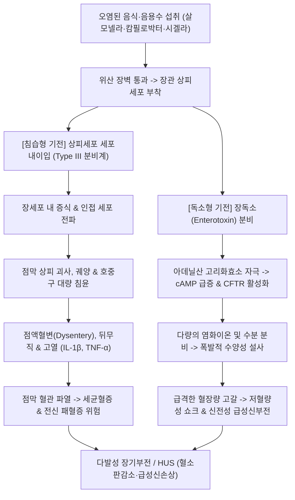

# 🩺 급성 감염성 장염 (Acute Infectious Enteritis / 急性 感染性 腸炎, KCD: A04, A02, A03, A09)

> **핵심 3줄 요약 (Key Summary)**:
> - 📍 **병소 부위 & 병태생리**: 오염된 음식·음용수를 통해 장관으로 유입된 세균([[살모넬라]], [[캄필로박터]], [[시겔라]], [[대장균]]) 및 기생충에 의해 장관 점막 상피 침습(침습형) 또는 엔테로톡신 분비(독소형)로 장관 상피 괴사, 궤양, 전해질 분비 과다 및 전신 염증 반응이 유발됨.
> - 🚩 **전형적 임상 양상 & 3대 징후**: 급성 고열(>38.5℃), 이질양 점액혈변(Dysentery), 이급후중(Tenesmus) 및 체액 급감에 의한 중증 탈수와 대사성 산증.
> - 🛠️ **핵심 감별 & 한·양방 치료 전략**: 대변 배양 및 다중 PCR로 원인균 동정. 수액 소생술을 기본으로 하되 고위험군 항생제(Ciprofloxacin, Azithromycin) 투여, 지사제(Loperamide) 절대 금기. 한의 [[곡지]](LI11)·[[천추]](ST25)·[[상거허]](ST37) 자침 및 습열사리 변증에 따른 [[갈근황련황금탕]], [[백두옹탕]], [[향련환]] 통합 치료로 병원성 독소 중화 및 장관 운동성을 정상화함.
> - ⚠️ **응급 의뢰 레드플래그**: 장출혈성 대장균(EHEC) 감염 후 미세혈관병성 용혈성 빈혈·혈소판 감소증·급성 신손상을 동반하는 용혈성 요독 증후군([[HUS]]), 패혈증 쇼크, 장천공, 지속적 무뇨증 의심 시 즉시 상급병원 응급의뢰.

---

## 📌 목차
1. [질환 개요 & 병태생리 (Disease Overview)](#1-질환-개요--병태생리-disease-overview)
2. [병태생리 메커니즘 & 대사·장기부전 악순환 네트워크](#2-병태생리-메커니즘--대사장기부전-악순환-네트워크)
3. [임상 증상 & 환자 소견 (Clinical Presentation)](#3-임상-증상--환자-소견-clinical-presentation)
4. [감별 진단 매트릭스 (Differential Diagnosis)](#4-감별-진단-매트릭스-differential-diagnosis)
5. [한의 통합 치료 프로토콜 (침·약침·한약)](#5-한의-통합-치료-프로토콜-침약침한약)
6. [양방 치료 & 병용·의뢰 기준 (Conventional Treatment & Referral)](#6-양방-치료--병용의뢰-기준-conventional-treatment--referral)
7. [식이·생활습관 & 자가관리 티칭 가이드](#7-식이생활습관--자가관리-티칭-가이드)
8. [💡 진료실 핵심 필기 & 임상 노하우](#8--진료실-핵심-필기--임상-노하우)
9. [출처 및 학술 참고 문헌 (References)](#9-출처-및-학술-참고-문헌-references)

---

## 1. 질환 개요 & 병태생리 (Disease Overview)

![[급성_감염성_장염_01_살모넬라균미세구조.png|450]]
> [그림 1: ① 질병 개요 도해 — 오염된 가금류 및 알류를 통해 전파되어 장 점막 침습 및 식중독을 일으키는 살모넬라균(Salmonella enterica)의 주사전자현미경 상 — NIAID(Public Domain)]

* **질환 정의 및 병형 분류**:
  * **급성 감염성 장염(Acute Infectious Enteritis / Enterocolitis)**은 세균, 바이러스, 원충 등에 감염되어 장관(소장 및 대장) 점막에 급성 염증과 기능 장애를 초래하는 질환이다.
  * **발병 기전에 따른 대분류**:
    * **독소형 / 비침습형 장염 (Toxigenic / Non-invasive)**:
      * 병원체가 장 상피를 침범하지 않고 분비한 장독소(Enterotoxin)에 의해 장강 내로 수분·전해질이 분비됨.
      * 대표 병원체: 비브리오 콜레라([[콜레라]]), 장독소성 대장균(ETEC), 황색포도상구균, 클로스트리디움 퍼프린젠스.
      * 특징: 다량의 수양성 설사(대변 백혈구 음성), 복통 경미, 발열 드묾.
    * **세포독소형 / 침습형 장염 (Cytotoxigenic / Invasive — 이질증)**:
      * 병원체가 회장 말단 및 결장 점막 상피세포 내로 직접 침입하여 염증성 궤양과 괴사를 유발함.
      * 대표 병원체: [[살모넬라]](Salmonella enterica), [[캄필로박터]](Campylobacter jejuni), [[시겔라]](Shigella spp., 세균성 이질), 장침습성 대장균(EIEC), 장출혈성 대장균([[EHEC]] O157:H7).
      * 특징: 고열, 심한 복통, 이급후중, 점액혈변(대변 백혈구 양성).
* **관련 장기 및 파급 조직**:
  * **주 이환 장기**: 소장 말단부(회장) 및 [[대장]](결장 점막).
  * **합병증 표적 장기**: 신장([[신장]] — 탈수성 신부전 및 Shiga toxin 유발 HUS), 신경계(Campylobacter 감염 후 길랑-바레 증후군 Guillain-Barré), 관절(반응성 관절염 Reactive arthritis).

---

## 2. 병태생리 메커니즘 & 대사·장기부전 악순환 네트워크

![[급성_감염성_장염_02_캄필로박터균구조.png|350]]
> [그림 2: ② 병태생리 구조도 — 덜 익힌 닭고기 섭취 후 침습성 혈변 및 관절·신경계 면역 합병증을 유발하는 캄필로박터(Campylobacter jejuni) 나선형 미세구조 — USDA ARS(Public Domain)]

![[급성_감염성_장염_02_시겔라이질균배양소견.png|420]]
> [그림 3: ③ 병태생리 구조도 — 극소량(10~100개)의 균체로도 대장 점막 상피를 파괴하여 세균성 이질을 일으키는 시겔라(Shigella flexneri) Endo 배지 집락 — Wikimedia Commons(Public Domain)]

### 1) 분자·세포 수준 침습 기전
* **세포내 침입과 상피 파괴 (Type III Secretion System)**:
  * 살모넬라와 시겔라는 제3형 분비계(T3SS)를 통해 이펙터 단백질을 장 상피세포에 주입하여 액틴 세포골격의 재배열을 유도한다.
  * 막 주름(Membrane ruffling)을 형성하여 세포 내로 침입한 후, 대식세포와 상피세포의 자멸사를 유도하고 염증성 카스파아제-1을 활성화하여 IL-1$\beta$, IL-18 분비를 촉진함으로써 급성 조직 괴사를 일으킨다.
* **Shiga 독소 및 혈관 내피 손상**:
  * EHEC 및 Shigella dysenteriae가 분비하는 시가 독소(Shiga toxin 1 & 2)는 세포 표면 Gb3 수용체에 결합하여 28S rRNA를 절단, 단백질 합성을 억제한다.
  * 장 점막 미세혈관 내피세포뿐만 아니라 신장 사구체 모세혈관 내피세포를 파괴하여 혈소판 혈전증, 미세혈관병성 용혈, 신부전을 특징으로 하는 **용혈성 요독 증후군([[HUS]])**을 유발한다(DuPont, 2014).

### 2) 합병증 및 악순환 고리
* 장관 방어벽이 완전히 무너지면서 장내 그람 음성 간균의 내독소(LPS)가 전신 순환계로 유입되어 내독소혈증(Endotoxemia), 전신 염증 반응 증후군(SIRS), 패혈성 쇼크로 악화될 수 있다.

---

## 3. 임상 증상 & 환자 소견 (Clinical Presentation)

![[급성_감염성_장염_03_시겔라그람염색현미경소견.png|380]]
> [그림 4: ④ 환자 검사 소견 — 대변 도말 염색에서 관찰되는 다수의 다형핵 백혈구 및 그람 음성 간균 현미경 소견(침습성 세균성 장염 시사) — CDC PHIL(Public Domain)]

![[급성_감염성_장염_03_중증콜레라탈수환자소생.png|420]]
> [그림 5: ⑤ 중증 임상 소견 — 분비성 독소형 장염(콜레라 등)으로 인한 급성 대량 체액 소실 환자의 정맥로 확보 및 수액 소생 임상 실사 — Wellcome Collection(Public Domain)]

### 1) 주소증 및 핵심 증상
* **발열과 오한**: 침습성 세균 감염 시 38.5~40℃에 달하는 고열과 전신 오한이 동반됨.
* **이질양 점액혈변 (Dysentery)**: 소량씩 자주 배변하며, 변기에 붉은 피와 끈적한 고름 점액이 가득 참.
* **이급후중 (Tenesmus)**: 대변을 보아도 시원하지 않고 항문이 빠질 듯이 아픈 뒤무직.
* **탈수 징후**: 극심한 갈증, 혀의 건조, 기립 시 실신, 핍뇨.

### 2) 객관적 소견 (Signs & Labs)
* **신체 검진**:
  * 복부 전반 및 좌·우하복부 압통, 복부 팽만.
  * 피부 긴장도 저하, 빈맥(>100회/분), 저혈압(수축기 < 90mmHg).
* **대변 검사 (Stool Examination — 확진의 열쇠)**:
  * **대변 백혈구 검사 (Fecal Leukocytes / Lactoferrin)**: 침습형 장염(살모넬라, 캄필로박터, 시겔라)에서 강력한 양성 소견.
  * **대변 배양 (Stool Culture)**: MacConkey, SS 한천 배지 등을 이용한 원인균 동정 및 항생제 감수성 검사.
  * **대변 다중 PCR (Multiplex gastrointestinal PCR panel)**: 신속 정확하게 바이러스, 세균, 독소 유전자를 동시 검출.
* **혈액 검사**: 백혈구 증가증(WBC > 15,000/$\mu L$, 좌방이동), CRP/ESR 현저한 상승, 저칼륨혈증, 대사성 산증.

---

## 4. 감별 진단 매트릭스 (Differential Diagnosis)

| 감별 질환 | 임상 양상 | 감별 포인트 (검사·역학) |
| :--- | :--- | :--- |
| **급성 세균성 장염 (Invasive)** | 고열(>38.5℃), **점액혈변, 심한 복통, 이급후중** | **대변 백혈구 양성, 대변 배양/PCR 원인균 검출** |
| 바이러스성 위장염([[위장염]]) | 구토 선행, **다량의 수양변, 미열**, 혈변 없음 | **대변 백혈구 음성**, 노로바이러스 PCR 양성 |
| 독소형 식중독(포도상구균) | 오염 음식 섭취 후 **1~6시간 내 급격한 구토** | 발열 없음, 잠복기 매우 짧음(수 시간), 24시간 내 호전 |
| 궤양성 대장염([[궤양성 대장염]]) | **수주 이상 만성 지속되는 혈변**, 이급후중 | 감염원 불명, 대장내시경 상 만성 궤양, 대변 배양 음성 |
| 장출혈성 대장균([[EHEC]]) | **열이 없거나 미열이면서 극심한 혈변·산통** | **대변 Shiga toxin 양성**, 항생제 투약 시 HUS 악화 위험 |

> 🚩 **레드플래그 감별 (용혈성 요독 증후군 HUS)**:
> - 혈변 환자에서 소변량 급감, 피부 점상출혈, 황달, 빈혈 징후가 나타나면 EHEC에 의한 HUS를 의심하고 즉시 혈소판 수치 및 신기능 검사 후 응급 투석 가능한 3차 병원 전원.

---

## 5. 한의 통합 치료 프로토콜 (침·약침·한약)

![[급성_감염성_장염_05_수양명대장경곡지혈위도.png|420]]
> [그림 6: ⑥ 한의 치료 도해 — 장관의 열독을 청열해독하고 전신 발열 및 염증을 진정시키는 수양명대장경(곡지·합곡) 혈위도 — Wellcome Collection(CC BY)]

### 1) 한의 변증 분류 (Syndrome Differentiation)
* **습열리(濕熱痢) / 습열독치 (이질 초기 고열·점혈변)**:
  * 복통 즉시 설사, 적백농혈변, 항문 작열감, 이급후중, 신열번갈, 소변단적, 설홍태황조(舌紅苔黃燥), 맥활삭(脈滑數).
* **역독리(疫毒痢) / 열독치성 (중증 급성 중독형 이질)**:
  * 발병이 맹렬함, 고열, 신혼섬어(의식 혼미), 경련, 다량의 자흑색 혈변, 설질홍강태황조, 맥홍삭 또는 침세삭.
* **한습리(寒濕痢) / 비신허한**:
  * 복통 은은, 대변 백다적소(흰 점액 우세), 배가 차가움, 구갈 없음, 설담태백니, 맥침지.
* **휴식리(休息痢) / 음허음리 (아급성·만성 이행형)**:
  * 멎었다가 다시 발작하는 이질, 피로 시 악화, 이급후중 잔존, 권태, 설홍소태, 맥세약.

### 2) 침구 치료 (Acupuncture Protocol)
* **주혈**: [[천추]](ST25), [[상거허]](ST37), [[곡지]](LI11), [[합곡]](LI4), [[음릉천]](SP9).
* **배혈**:
  * 고열 및 전신 열독 시: [[대추]](GV14), [[십선혈]](EX-UE11) 점자출혈(청열해독 및 체온 강하).
  * 이급후중 심할 시: [[장강]](GV1), [[승산]](BL57), [[중려수]](BL29).
  * 복통 경련 심할 시: [[족삼리]](ST36), [[중완]](CV12).
* **작용 기전**: 대장 점막의 국소 혈류를 개선하고 장신경계 염증을 차단하며 장관 평활근의 경련성 연축을 완화함.

### 3) 한약 치료 (Herbal Medicine)

| 변증 유형 | 대표 처방 | 구성 약재 핵심 | 현대 약리 기전 및 근거 (참고문헌) |
| :--- | :--- | :--- | :--- |
| **습열리 / 세균성 장염** | [[갈근황련황금탕]](葛根黃芩黃連湯) | [[갈근]], [[황련]], [[황금]], [[감초]] | 장내 병원균 증식 억제, 내독소(LPS) 중화 및 장관 상피 염증 반응 차단. 메타분석에서 양약 병용 시 설사 소퇴 시간 대폭 단축(Wang et al., 2024; 하단 문헌 3번). |
| **열독치성 / 적백농혈** | [[백두옹탕]](白頭翁湯) | [[백두옹]], [[황련]], [[황백]], [[진피(물푸레나무껍질)]] | 아메바 및 시겔라·살모넬라에 대한 직접적 항균 작용, 대장 점막 궤양의 신속한 상피화 촉진. |
| **복통이급후중** | [[작약탕]](芍藥湯) / [[향련환]](香連丸) | [[백작약]], [[당귀]], [[황련]], [[황금]], [[목향]], [[육계]] | "행혈즉변농자유, 조기즉후중자리(行血則便膿自愈, 調氣則後重自除)" 기전. 장관 미세순환 개선 및 장 연축 진정. |

---

## 6. 양방 치료 & 병용·의뢰 기준 (Conventional Treatment & Referral)

### 1) 양방 약물 및 보존적 치료
* **수액 요법**: 등장성 생리식염수(0.9% NaCl) 또는 하트만액(Hartmann's sol) 정맥 투여를 통한 급속 체액 소생.
* **항생제 투약 원칙 (Antibiotics Guidelines)**:
  * 경증의 비침습성 장염에는 항생제를 일절 투여하지 않음.
  * **항생제 적응증**: 고열(>38.5℃) 동반 혈변 환자, 면역저하자, 고령자, 인공관절/심장판막 치환 환자.
  * 1차 선택제: Fluoroquinolone ([[시프로플록사신]] Ciprofloxacin 500mg bid 3일) 또는 Azithromycin (500mg qd 3일).
* ⚠️ **지사제(Loperamide) 절대 금기 (Strict Contraindication)**:
  * 고열, 혈변, 침습성 세균성 장염 환자에게 장운동 억제제를 투여하면 장내 세균 및 독소 배출이 차단되어 **장 천공, 패혈증, 독성 거대결장을 유발**하므로 절대 투약 금지(Riddle et al., 2016).
* ⚠️ **EHEC 감염 시 항생제 주의**:
  * 장출혈성 대장균 감염 의심 시 항생제를 투여하면 균체 파괴로 대량의 Shiga toxin이 급격히 유리되어 HUS 발병률을 증가시키므로 수액 요법 위주로 치료.

### 2) 한·양방 병용 판단 가이드
* **병용 권장**: 양방 수액 공급 및 필요시 항생제 치료를 병행하면서, 한약([[갈근황련황금탕]] 또는 [[백두옹탕]])을 투여하면 항균 시너지 및 장 점막 보호 작용으로 임상 증상 회복을 가속화함.
* **의뢰 기준**: 혈압 저하(쇼크), 핍뇨, 소변 내 혈뇨, 황달, 지속적 고열 시 즉시 감염내과/응급실 의뢰.

---

## 7. 식이·생활습관 & 자가관리 티칭 가이드

![[급성_감염성_장염_07_장점막보호식이요법도해.png|420]]
> [그림 7: ⑦ 회복기 식이 관리 — 감염성 장염 후 장점막 상피 보호 및 장내 미생물총 회복을 위한 단계별 식이 요법 도해 — Wikimedia Commons(CC BY-SA)]

* **급성기 및 회복기 식이 원칙**:
  * **발병 초기 12~24시간**: 소화관에 완전한 휴식을 주기 위해 금식 또는 미지근한 이온음료·경구 수액(ORS)만 소량씩 섭취.
  * **증상 완화 후 식이 진행**: 묽은 쌀죽 → 진밥 → 부드러운 단백질(두부, 흰살생선) 순으로 단계적 진행.
  * **철저한 금기 식품**: 날음식(생선회, 육회), 유제품(2차 유당불내증), 자극적인 양념, 섬유질이 많은 질긴 채소.
* **식품 매개 감염 예방 수칙 (Food Safety)**:
  * **충분한 가열 조리**: 가금류, 육류, 어패류는 중심부 온도 75℃ 이상에서 1분 이상 완전히 익혀 섭취.
  * **교차 오염 방지**: 날고기를 다룬 칼과 도마는 세척·소독 전 채소나 완제품 조리에 절대 재사용하지 않음.
  * **조리 전·후 손 씻기**: 흐르는 물에 비누로 30초 이상 손 씻기 생활화.

---

## 8. 💡 진료실 핵심 필기 & 임상 노하우

* **실전 문진 체크리스트**:
  1. *"최근 3일 이내에 덜 익힌 닭고기, 생굴, 육회, 오염 가능성이 있는 지하수 등을 드신 적이 있습니까?"* (원인 병원체 추정: 닭고기→캄필로박터, 알류/가금류→살모넬라, 굴→노로바이러스/비브리오).
  2. *"변에 피나 코 같은 끈적한 점액이 묻어나오고, 변을 보고 나서도 바로 또 마렵습니까?"* (침습성 이질양 장염 확인).
  3. *"동남아, 인도 등 해외여행을 다녀오신 적이 있습니까?"* (여행자 설사 및 열대 감염병 감별).
* **한의 1차 진료실 팁**:
  * 고열과 혈변을 동반한 환자가 내원했을 때, 한의원 단독 치료만 고집하지 말고 대변 검사(배양/PCR)를 위해 내과 협진을 의뢰하고, 수액과 갈근황련황금탕 과립제를 병용 투약하면 신속한 해열과 지사 효과를 얻을 수 있음.

---

## 9. 출처 및 학술 참고 문헌 (References)

1. **Riddle MS, DuPont HL, Connor BA, et al. (2016)**. ACG Clinical Guideline: Diagnosis, Treatment, and Prevention of Acute Diarrheal Infections in Adults. *Am J Gastroenterol*, 111(5):602-22. [PMID 27068718](https://pubmed.ncbi.nlm.nih.gov/27068718/)
   - **[연구 요약]**: 미국소화기학회(ACG)의 성인 급성 감염성 설사 질환 공식 가이드라인으로 침습성 세균 장염의 진단 기준, 지사제 금기 및 항생제 적응증 명시.
2. **DuPont HL (2014)**. Acute infectious diarrhea in immunocompetent adults. *N Engl J Med*, 370(16):1532-40. [PMID 24738670](https://pubmed.ncbi.nlm.nih.gov/24738670/)
   - **[연구 요약]**: 면역기능 정상 성인의 급성 감염성 설사의 임상적 원인체 분류, 병태생리학적 침습 기전 및 전해질 수액 치료 중심의 최신 관리 전략 리뷰.
3. **Wang F, Zhang L, Liu X, et al. (2024)**. Gegen Qinlian Decoction Combined with Conventional Western Medicine for the Treatment of Infectious Diarrhea: A Systematic Review and Trial Sequential Analysis. *Complement Med Res*, 31(4):321-334. [PMID 39137735](https://pubmed.ncbi.nlm.nih.gov/39137735/)
   - **[연구 요약]**: 감염성 설사 환자에서 갈근황련황금탕과 양약 병용 요법의 체계적 문헌고찰 및 시험 순차 분석으로 해열 시간 및 설사 지속 기간 단축의 임상적 우월성 확인.

---

## 관련 노트

- [[대장]]
- [[십이지장]]
- [[위장염]]
- [[궤양성 대장염]]
- [[콜레라]]
- [[살모넬라]]
- [[캄필로박터]]
- [[갈근황련황금탕]]
- [[백두옹탕]]
- [[천추]]
- [[상거허]]
- [[곡지]]
