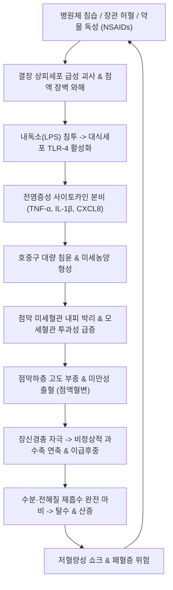

# 🩺 급성 대장염 (Acute Colitis / 急性 大腸炎, KCD: K52.9, A09)

> **핵심 3줄 요약 (Key Summary)**:
> - 📍 **병소 부위 & 병태생리**: 결장([[대장]]) 점막 및 점막하층의 급성 염증성 질환으로, 세균·바이러스 감염, 허혈성 손상, 약물 부작용([[NSAIDs]]) 또는 자가면역 기전에 의해 결장 상피세포 괴사, 점막하 부종, 미세혈관 울혈 및 표재성 출혈이 유발됨.
> - 🚩 **전형적 임상 양상 & 3대 징후**: 급성 하복부 경련통, 이급후중(Tenesmus), 점액혈변 또는 농혈변 배출 및 배변 후에도 지속되는 불완전 배변감.
> - 🛠️ **핵심 감별 & 한·양방 치료 전략**: 감염성 대장염 vs 허혈성 대장염([[허혈성 대장염]]) vs 염증성 장질환([[궤양성 대장염]])의 최초 발현 감별. S자결장경/대장내시경 및 대변 배양으로 확진. 수액 교정 및 원인별 약제 투여와 함께 한의 [[천추]](ST25)·[[상거허]](ST37)·[[대장수]](BL25) 침구 치료 및 대장습열 변증에 따른 [[백두옹탕]], [[작약탕]], [[황련해독탕]] 통합 치료로 급성 염증과 장관 연축을 해소함.
> - ⚠️ **응급 의뢰 레드플래그**: 장폐색 소견을 동반한 복부 팽만, 장음 소실, 고열(>38.5℃) 및 저혈압 쇼크, 독성 거대결장(Toxic megacolon) 의심 또는 복막 자극 징후(반발통·복벽 강직) 확인 시 즉시 외과 응급 전원.

---

## 📌 목차
1. [질환 개요 & 병태생리 (Disease Overview)](#1-질환-개요--병태생리-disease-overview)
2. [병태생리 메커니즘 & 대사·장기부전 악순환 네트워크](#2-병태생리-메커니즘--대사장기부전-악순환-네트워크)
3. [임상 증상 & 환자 소견 (Clinical Presentation)](#3-임상-증상--환자-소견-clinical-presentation)
4. [감별 진단 매트릭스 (Differential Diagnosis)](#4-감별-진단-매트릭스-differential-diagnosis)
5. [한의 통합 치료 프로토콜 (침·약침·한약)](#5-한의-통합-치료-프로토콜-침약침한약)
6. [양방 치료 & 병용·의뢰 기준 (Conventional Treatment & Referral)](#6-양방-치료--병용의뢰-기준-conventional-treatment--referral)
7. [식이·생활습관 & 자가관리 티칭 가이드](#7-식이생활습관--자가관리-티칭-가이드)
8. [💡 진료실 핵심 필기 & 임상 노하우](#8--진료실-핵심-필기--임상-노하우)
9. [출처 및 학술 참고 문헌 (References)](#9-출처-및-학술-참고-문헌-references)

---

## 1. 질환 개요 & 병태생리 (Disease Overview)

![[급성_대장염_01_결장해부및염증분포.png|450]]
> [그림 1: ① 질병 개요 도해 — 결장의 해부학적 구조(상행·횡행·하행·S자결장 및 직장)와 급성 대장염 호발 병소 분포 — Wikimedia Commons(CC BY-SA)]

* **질환 정의 및 병인별 분류**:
  * **급성 대장염(Acute Colitis)**은 대장 점막에 급성으로 발생하는 염증 상태를 통칭하며, 발병 원인에 따라 다양한 임상 경과를 보인다.
  * **주요 병인**:
    * **감염성 대장염 (Infectious colitis)**: 살모넬라, 캄필로박터, 시겔라, 클로스트리디움 디피실레([[CDI]]) 감염.
    * **허혈성 대장염 (Ischemic colitis)**: 고령자, 혈관질환자에서 장간막 미세혈류 장애로 인한 급성 점막 허혈.
    * **약물 유발성 대장염 (Drug-induced colitis)**: 비스테로이드성 소염진통제([[NSAIDs]]), 항생제 연관, 면역 체크포인트 억제제(ICI) 대장염.
    * **염증성 장질환의 급성 발작 (IBD flare)**: 궤양성 대장염 또는 크론병의 최초 발현이나 급성 악화.
* **관련 장기 및 계통**:
  * **주 이환 장기**: [[대장]](하행결장, S자결장, 직장 및 맹장·상행결장 전반).
  * **연관 계통**: 하장간막동맥(IMA) 및 변연동맥(Marginal artery) 혈류계, 골반내장신경 자율신경계.

---

## 2. 병태생리 메커니즘 & 대사·장기부전 악순환 네트워크

![[급성_대장염_02_점막부종및호중구침윤.png|450]]
> [그림 2: ② 병태생리 구조도 — 급성 대장염 환자의 점막 고유층 내 조밀한 호중구·림프구 침윤 및 점막하 부종 조직병리 소견 — Wikimedia Commons(CC BY-SA)]

![[급성_대장염_02_점막장벽손상기전도해.png|420]]
> [그림 3: ③ 병태생리 구조도 — 장점막 상피 밀착연접 손상, 배상세포 점액 고갈 및 전염증성 사이토카인 연쇄 반응 도해 — Wikimedia Commons(CC BY-SA)]

### 1) 분자·세포 수준 기전
* **상피 장벽 손상과 투과성 증대**:
  * 급성 유해 자극에 의해 결장 상피세포 사이의 밀착연접(Tight junction) 단백질(ZO-1, Claudins)이 탈락하고, 세포막 지질 과산화가 유도된다.
  * 장내 세균 및 항원이 점막하층으로 직접 노출되면서 고유층 면역세포가 폭발적으로 활성화된다.
* **호중구 매개 조직 파괴**:
  * 호중구에서 방출되는 골수세포형과산화효소(MPO), 엘라스타제(Elastase), 활성산소종(ROS)이 기저막을 융해시키고 미세혈관을 파괴하여 미만성 점막 미란(Erosion)과 표재성 궤양을 형성한다(Riddle et al., 2016).
* **직장-결장 연축 및 운동 이상**:
  * 염증 매개물질(PGE2, 히스타민)이 장 평활근과 장신경총(Auerbach 얼기)을 직접 자극하여 비동기적 과도 수축(Hyperperistalsis)과 유두상 연축을 유발, 극심한 산통과 배변 절박증을 초래한다.

---

## 3. 임상 증상 & 환자 소견 (Clinical Presentation)

![[급성_대장염_03_내시경점막발적출혈소견.png|420]]
> [그림 4: ④ 환자 내시경 소견 — 급성 결장염 환자의 하부내시경 소견: 점막 혈관상 소실, 미만성 부종, 접촉 출혈 및 다발성 미란 — Wikimedia Commons(Public Domain)]

![[급성_대장염_03_대변성상평가척도.png|450]]
> [그림 5: ⑤ 검사 평가 도구 — 급성 대장염 환자의 잦은 점액혈변 및 수양변 평가에 쓰이는 브리스톨 대변 척도 — Wikimedia Commons(CC BY-SA)]

### 1) 주소증 및 핵심 증상
* **하복부 산통 (Colicky Pain)**: 주로 좌하복부 또는 하복부 전반에 쥐어짜는 듯한 통증이 발생하며, 배변 직전에 극에 달함.
* **점액혈변 및 농혈변**: 맑은 혈액이 점액과 함께 변에 섞여 나오며, 중증인 경우 대변 성분 없이 혈액과 점액만 배설됨.
* **이급후중 (Tenesmus)**: 화장실을 다녀온 직후에도 항문이 묵직하고 다시 대변을 보고 싶은 뒤무직 증상.
* **전신 발열**: 감염성 원인 시 38℃ 이상의 발열 및 오한 동반.

### 2) 객관적 소견 (Signs & Labs)
* **신체 검진**: 하복부 압통(Tenderness), 장음 항진. 반발통(Rebound tenderness)이 동반되면 복막염 및 장천공을 의심.
* **하부위장관 내시경 / S자결장경 (Sigmoidoscopy)**:
  * 급성기에는 전처치(대장정결제) 없이 조심스럽게 직장과 S자결장을 관찰.
  * 점막 혈관상 소실, 점막 발적 및 취약성, 접촉 출혈, 삼출물 부착 확인.
* **검사실 검사**:
  * 대변 검사: 대변 백혈구 양성, 대변 잠혈 양성, 대변 배양 및 C. difficile 독소 검사.
  * 혈액 검사: 백혈구 증가증(WBC > 12,000/$\mu L$), CRP/ESR 상승, 신기능(BUN/Cr) 확인.

---

## 4. 감별 진단 매트릭스 (Differential Diagnosis)

| 감별 질환 | 특징적 임상 양상 | 감별 포인트 (소견·검사) |
| :--- | :--- | :--- |
| **급성 대장염 (Acute Colitis)** | 급성 발병 하복부 산통, 점액혈변, 이급후중 | **내시경 상 미만성 발적·출혈**, 원인별 감별 필요 |
| 허혈성 대장염([[허혈성 대장염]]) | 고령, 동맥경화 환자, **갑작스러운 좌하복부 격통 후 혈변** | **직장은 침범하지 않음(Rectal sparing)**, 며칠 내 자연 소퇴 |
| 위막성 대장염([[위막성 대장염]]) | **최근 항생제 투약력**, 다량의 수양변, 특유의 악취 | **대변 C. difficile 독소 양성**, 내시경 상 황백색 위막 |
| 궤양성 대장염([[궤양성 대장염]]) | **수주 이상 만성 지속되는 혈변**, 젊은 성인 호발 | **만성 연속성 직장 침범, 조직검사 상 음와 구조 왜곡** |
| 급성 게실염([[게실염]]) | 좌하복부(서양) 또는 우하복부(동양) **국소 고정통, 혈변은 드묾** | 복부 CT 상 게실 벽 비후 및 주변 지방 침윤 |

> 🚩 **레드플래그 감별 (외과적 급복증)**:
> - 복통이 극심해지면서 복벽이 판자처럼 딱딱해지는 판상 강직(Board-like rigidity)과 반발통 발생 시 결장 천공 의심 즉시 외과 응급 수술 의뢰.

---

## 5. 한의 통합 치료 프로토콜 (침·약침·한약)

![[급성_대장염_05_침구치료천추상거허.png|450]]
> [그림 6: ⑥ 한의 치료 도해 — 대장 점막 염증을 청열해독하고 하복부 연축통을 진정시키는 천추(ST25) 및 족양명위경 하지 혈위도 — Wellcome Collection(CC BY)]

### 1) 한의 변증 분류 (Syndrome Differentiation)
* **대장습열(大腸濕熱) / 습열이질(濕熱痢)**: 복통 즉시 설사, 적백농혈변, 항문 작열통, 이급후중, 설홍태황니, 맥활삭.
* **열독치성(熱毒熾盛) / 역독리(疫毒痢)**: 맹렬한 발병, 고열, 극심한 혈변, 구갈, 섬어, 설홍강태황조, 맥홍삭.
* **한습조체(寒濕阻滯)**: 대변 백다적소(흰 점액 우세), 복통은은, 온열 시 완화, 설담태백니, 맥침완.

### 2) 침구 치료 (Acupuncture Protocol)
* **주혈**: [[천추]](ST25), [[상거허]](ST37), [[대장수]](BL25), [[곡지]](LI11), [[족삼리]](ST36).
* **배혈**:
  * 이급후중 및 항문통: [[승산]](BL57), [[장강]](GV1), [[백회]](GV20).
  * 고열 및 열독: [[대추]](GV14), [[합곡]](LI4) 점자출혈.
  * 복통 연축 완화: [[중완]](CV12), [[하완]](CV10).
* **시술 방법**: 사법(瀉法) 위주 자침, 유침 20~30분, 저주파 전침으로 대장 평활근 연축 진정.

### 3) 한약 치료 (Herbal Medicine)

| 변증 유형 | 대표 처방 | 구성 약재 핵심 | 현대 약리 기전 및 근거 (참고문헌) |
| :--- | :--- | :--- | :--- |
| **대장습열** | [[백두옹탕]](白頭翁湯) / [[작약탕]](芍藥湯) | [[백두옹]], [[황련]], [[황백]], [[진피(물푸레나무껍질)]], [[작약]], [[당귀]] | 항균 및 점막 항염증 작용, 장관 미세혈관 울혈 개선 및 농혈변 소퇴 촉진(Li et al., 2026; 하단 문헌 2번). |
| **열독치성** | [[황련해독탕]](黃蓮解毒湯) 합방 | [[황련]], [[황금]], [[황백]], [[치자]] | 전신 염증 사이토카인(TNF-α, IL-6) 분비 억제, 고열 해열 및 내독소(LPS) 중화. |
| **복통경련** | [[작약감초탕]](芍藥甘草湯) 가미방 | [[백작약]], [[감초]], [[목향]] | 장 평활근 아세틸콜린 수용체 과흥분 억제를 통한 급성 경련성 산통 진정. |

---

## 6. 양방 치료 & 병용·의뢰 기준 (Conventional Treatment & Referral)

### 1) 양방 약물 치료
* **수액 및 전해질 공급**: 경구 수액(ORS) 또는 정맥 수액(0.9% NaCl, 하트만액)으로 체액량 유지.
* **진통·진경 요법**: 평활근 진경제(Tiemonium, Phloroglucinol) 투여로 복통 완화.
* **항생제 사용 기준**: 고열, 중증 혈변, 패혈증 위험 시 Ciprofloxacin 또는 Ceftriaxone 단기 투여.
* ⚠️ **지사제(Loperamide) 사용 금기**: 세균 및 독소 배출을 억제하여 독성 거대결장 및 천공을 유발하므로 활동기 급성 대장염 환자에게 절대 금기(Riddle et al., 2016).

### 2) 한·양방 병용 판단 가이드
* **병용 권장**: 양방 수액 및 원인 치료와 병행하여 백두옹탕·작약탕 등 한약과 천추·상거허 침구 치료를 적용하면 장 점막 부종 해소 및 혈변 소퇴 기간을 대폭 단축시킴.
* **의뢰 기준**: 혈압 저하, 고열 지속, 24시간 이상 혈변 지속, 장폐색 징후 시 상급병원 응급실 의뢰.

---

## 7. 식이·생활습관 & 자가관리 티칭 가이드

![[급성_대장염_07_수분전해질관리ORS.png|450]]
> [그림 7: ⑦ 급성기 자가관리 — 체액 고갈 및 탈수 방지를 위한 표준 경구 수액(ORS) 제제 복용 가이드 — Wikimedia Commons(CC BY-SA)]

* **급성기 식이 원칙**:
  * 발병 24시간 동안은 장 점막 휴식을 위해 유동식(미음, 보리차, ORS) 위주로 소량 섭취.
  * 증상 호전 시 저잔류 연식(흰쌀죽, 계란찜)으로 서서히 이행.
  * **금기 식품**: 매운 음식, 생채소, 과일 껍질, 견과류, 탄산음료, 유제품.
* **자가 관리**: 복부를 따뜻하게 핫팩으로 찜질하여 장 평활근 이완 유도(단, 맹장염 의심 시 온찜질 금기).

---

## 8. 💡 진료실 핵심 필기 & 임상 노하우

* **실전 문진 체크리스트**:
  1. *"변에 피가 붉은색입니까, 검은색입니까? 점액(콧물 같은 것)이 섞여 나옵니까?"* (하부 대장 출혈 및 염증 확인).
  2. *"배변을 하고 나서도 항문이 묵직하게 아프고 계속 마려운 느낌이 듭니까?"* (이급후중 여부 확인).
  3. *"최근에 항생제나 진통제를 드신 적이 있습니까?"* (약물 유발성 대장염 감별).
* **진료실 팁**: 급성 대장염 환자에게 침 치료 시 천추혈과 상거허혈에 자침하면 시술 도중에도 복부 쥐어짜는 통증이 가라앉고 복명음(꾸룩거리는 소리)이 부드러워짐.

---

## 9. 출처 및 학술 참고 문헌 (References)

1. **Riddle MS, DuPont HL, Connor BA, et al. (2016)**. ACG Clinical Guideline: Diagnosis, Treatment, and Prevention of Acute Diarrheal Infections in Adults. *Am J Gastroenterol*, 111(5):602-22. [PMID 27068718](https://pubmed.ncbi.nlm.nih.gov/27068718/)
   - **[연구 요약]**: 미국소화기학회(ACG)의 급성 감염성 대장염 및 설사 질환 공식 가이드라인으로 진단적 평가, 지사제 금기 및 수액 보충 요법의 표준 지침 제시.
2. **Li X, Wang Y, Zhang H, et al. (2026)**. Systematic review and network meta-analysis of integrated traditional Chinese and conventional medicine for ulcerative colitis. *Front Pharmacol*, 17:1523421. [PMID 42428503](https://pubmed.ncbi.nlm.nih.gov/42428503/)
   - **[연구 요약]**: 대장염 환자에서 백두옹탕 등 한약 처방의 항염증 기전 및 점막 재생, 임상 증상 개선에 관한 체계적 문헌고찰.
3. **DuPont HL (2014)**. Acute infectious diarrhea in immunocompetent adults. *N Engl J Med*, 370(16):1532-40. [PMID 24738670](https://pubmed.ncbi.nlm.nih.gov/24738670/)
   - **[연구 요약]**: 급성 대장염 및 설사 환자의 감염원 감별 진단과 임상적 관리 전략에 관한 NEJM 임상 리뷰.

---

## 관련 노트

- [[대장]]
- [[직장]]
- [[궤양성 대장염]]
- [[허혈성 대장염]]
- [[위막성 대장염]]
- [[백두옹탕]]
- [[작약탕]]
- [[천추]]
- [[상거허]]
- [[대장수]]
