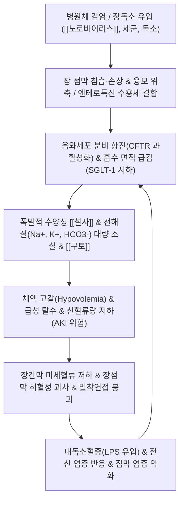

# 🩺 [[급성 위장관염]] (Acute Gastroenteritis, AGE / 泄瀉·霍亂, ICD-10 A09)

> **핵심 3줄 요약 (Key Summary)**:
> - 📍 병소 부위 & 해부·병태생리: 위 및 소장·대장 점막의 급성 감염성·독소성 염증으로, 장상피 융모 손상과 CFTR 염소이온 채널 과활성화에 따른 분비성·삼투성 [[설사]] 및 수분·전해질 급격 고갈.
> - 🚩 전형적 임상 양상 & 3대 징후: 돌발적인 수양성 설사(1일 3회 이상), 심한 오심·[[구토]], 경련성 하복부 산통 및 미열; 소아 및 고령자에서 신속하게 진행하는 탈수(Dehydration) 징후.
> - 🛠️ 핵심 감별 검사 & 한·양방 다각적 치료 전략: 임상 탈수 척도(CDS) 평가, 저삼투압 경구수액요법(Reduced-osmolarity ORS) 우선 공급, 수습정체(水濕停滯)를 조절하는 [[오령산]]·[[위령탕]]·[[곽향정기산]] 및 [[족삼리(ST36)]]·[[중완(CV12)]]·천추 침구 복합 치료.
> - <font color="#fa7e7e">⚠️ 응급 의뢰 레드플래그 & 악화 요인: 점액혈변(Dysentery), 고열(≥38.5℃), 지속성 핍뇨/무뇨, 기면·의식 저하, 기립성 저혈압 및 반발압통(복막자극징후) 시 즉시 상급병원 전원 및 정맥수액 요법.</font>

---

## 📌 목차
1. [질환 개요 & 해부학적 병태생리](#1-질환-개요--해부학적-병태생리)
2. [병태생리 메커니즘 & 생체역학적 악순환 네트워크](#2-병태생리-메커니즘--생체역학적-악순환-네트워크)
3. [임상 증상 & 이학적 검사(Physical Exam) 알고리즘](#3-임상-증상--이학적-검사physical-exam-알고리즘)
4. [감별 진단 매트릭스 (Differential Diagnosis)](#4-감별-진단-매트릭스-differential-diagnosis)
5. [한의 통합 치료 프로토콜 (침·약침·추나·한약)](#5-한의-통합-치료-프로토콜-침약침추나한약)
6. [양방 치료 & 병용·의뢰 기준 (Conventional Treatment & Referral)](#6-양방-치료--병용의뢰-기준-conventional-treatment--referral)
7. [재활 운동 & 생활습관 티칭 가이드](#6-재활-운동--생활습관-티칭-가이드)
8. [💡 사용자 진료실 핵심 필기 & 임상 노하우](#7--사용자-진료실-핵심-필기--임상-노하우)
9. [출처 및 학술 참고 문헌 (References)](#8-출처-및-학술-참고-문헌-references)

---

## 1. 질환 개요 & 해부학적 병태생리

* **질환 정의 및 분류**:
  * **정의**: 급성 위장관염(Acute Gastroenteritis, AGE)은 바이러스, 세균, 원충 또는 세균성 장독소 감염에 의해 위(Stomach), 소장(Small intestine), 대장(Large intestine) 점막에 급성 염증과 분비·흡수 기능 장애가 발생하는 임상 증후군이다.
  * **진단 기준**: 평소 배변 습관과 구별되는 묽은 변 또는 수양변(Watery stool)이 1일 3회 이상 배출되거나 대변량이 급격히 증가하며, 발병 기간이 14일 미만인 경우로 정의한다(WHO / WGO 가이드라인).
  * **분류**:
    * **임상 성상별**: 비침습성 수양성 설사(Secretory/Osmotic watery diarrhea) vs 침습성 염증성 설사(점액혈변, Dysentery).
    * **병원체별**: 바이러스성([[노로바이러스]], 로타바이러스, 아데노바이러스), 세균 침습형(살모넬라, 캄필로박터, 시겔라 등), 세균 독소형(비브리오, 황색포도상구균 장독소, 바실루스 세레우스, 독소원성 대장균), 원충성(람블편모충 등).
* **역학적 특성 (Epidemiology)**:
  * **발생률**: 전 세계적으로 연간 20억~40억 건 이상의 에피소드가 발생하며, 5세 미만 소아에서 영유아 사망 원인 2위를 차지한다. 국내 성인에서도 연간 1인당 0.5~1.2회의 유병률을 나타내는 최다발 외래 질환 중 하나이다.
  * **호발 연령 및 고위험군**: 5세 미만 소아(세포외액 비율이 높아 급속 탈수 위험), 65세 이상 고령자(갈증 중추 감수성 둔화 및 심신 기능 저하), 면역저하자, 만성 신부전 환자.
  * **계절성 패턴**:
    * **동절기(11월~3월)**: 바이러스성 위장염 다발. 특히 [[노로바이러스]]는 저온 환경 저항성이 강해 겨울철 집단 유행(식중독 발병의 70% 이상)을 주도한다.
    * **하절기(6월~8월)**: 세균성 위장관염 다발. 고온다습한 기후로 인해 살모넬라, 병원성 대장균, 장염비브리오균의 증식이 촉진되며 부패·변질된 음식 매개 감염이 급증한다.
* **관련 해부학적 구조물**:
  * **소장 점막 및 융모(Intestinal Villi & Microvilli)**:
    * 소장 상피세포(Enterocytes)의 솔가장자리(Brush border)는 영양소와 수분 흡수의 핵심 거점이다. 나트륨-포도당 공동수송체([[SGLT-1]]) 및 이당류분해효소(Lactase 등)가 집적되어 있으며, 바이러스 침입 시 융모 상단부 세포가 우선 박리·탈락한다.
  * **장음와(Crypt of Lieberkühn)**:
    * 장선 기저부의 분비세포 집단으로, [[CFTR]](Cystic Fibrosis Transmembrane Conductance Regulator) 염소이온 채널이 존재하여 관강(Lumen) 내로 Cl- 및 수분을 분비하는 기저 동력을 제공한다.
  * **장점막 장벽 및 밀착연접(Tight Junctions)**:
    * 클라우딘(Claudin), 오클루딘(Occludin), ZO-1 단백으로 구성되어 장관 내 병원체 및 내독소(LPS)의 전신 순환계 유입을 차단하는 물리적 장벽이다.
  * **자율신경 및 장신경계(Enteric Nervous System, ENS)**:
    * 부교감신경([[10. 미주신경|미주신경]])은 장관 분비와 연동운동을 항진시키고, 교감신경(복강·장간막신경총)은 혈관을 수축시키고 분비를 억제한다. 점막하신경총(Meissner's plexus)과 근층간신경총(Auerbach's plexus)은 감염 시 세로토닌(5-HT) 및 물질P(Substance P)를 유리하여 구토 반사와 격렬한 장경련 산통을 촉발한다.

![[급성위장관염_소장융모_조직.jpg|540]]
> [그림 1: ② 해부 구조물 — Wikimedia Commons 「Cross-section histology of small intestinal villi of the terminal ileum」 (CC0)]

---

## 2. 병태생리 메커니즘 & 생체역학적 악순환 네트워크



### 1) 병원체별 병태생리 기전
* **바이러스성 위장관염 ([[노로바이러스]], 로타바이러스)**:
  * 바이러스가 소장 상피세포 솔가장자리에 부착 후 세포 내 증식 → 성숙 융모 상피세포 파괴 및 융모 위축(Villus blunting) 유발.
  * 융모 탈락으로 흡수 표면적이 격감하고 이당류분해효소(Lactase) 결핍이 발생하여 관강 내 흡수되지 않은 당류가 삼투압을 높여 삼투성 설사(Osmotic diarrhea)를 일으킴.
  * 로타바이러스 비구조단백질 NSP4(엔테로톡신)는 세포 내 Ca2+ 유입을 촉진하여 음와세포의 Cl- 분비를 직접 활성화(분비성 기전 복합).

![[급성위장관염_노로바이러스_전자현미경.png|540]]
> [그림 2: ① 병태생리·영상 — Wikimedia Commons 「Norovirus EM PHIL 2172 lores」 (Public domain)]
![[급성위장관염_로타바이러스_전자현미경.png|540]]
> [그림 3: ① 병태생리·영상 — Wikimedia Commons 「Rotavirus TEM B82-0337 lores」 (Public domain)]

* **세균성 독소형 위장관염 (비브리오, ETEC, 황색포도상구균)**:
  * 콜레라독소(CT) 및 독소원성 대장균(ETEC)의 이열성 독소(LT)는 Gs 단백을 지속 활성화하여 아데닐릴 시클라아제(Adenylyl cyclase)를 영구 자극 → 세포 내 cAMP 폭발적 증가.
  * 상승된 cAMP는 음와세포의 CFTR 채널을 개방하여 Cl-와 물을 관강으로 강제 방출하고, 융모의 Na+/H+ 교환체(NHE3)를 차단하여 흡수를 원천 봉쇄(대량 쌀뜨물 변 형성).
* **세균성 침습형 위장관염 (살모넬라, 캄필로박터, 시겔라)**:
  * 회장 말단 및 결장 상피세포를 직접 뚫고 침입하여 고유판(Lamina propria) 내 대식세포 및 호중구 침윤 유발.
  * 점막 궤양, 미세농양, 미만성 출혈을 초래하여 백혈구와 적혈구가 섞인 점액혈변(Dysentery), 뒤무직(Tenesmus), 고열을 유발.

### 2) 수분·전해질 소실과 장관 항상성 붕괴
* **전해질 불균형**:
  * 장관액에는 다량의 중탄산염(HCO3-)과 칼륨(K+)이 함유되어 있어, 지속적인 다량 설사는 정상 음이온 갭 대사성 산증(Normal anion gap metabolic acidosis) 및 저칼륨혈증(Hypokalemia, 근력약화·마비성 장폐색 유발)을 초래함.
* **SGLT-1 수송체의 생리학적 보존과 경구수액요법(ORT) 원리**:
  * 대부분의 감염성 설사 상태에서도 상피세포 정단막의 Na+-포도당 공동수송체(SGLT-1)는 기능적으로 온전하게 보존됨.
  * 관강 내에 적정 몰비의 포도당과 나트륨이 동시에 존재할 때, 포도당 흡수와 연계되어 1분자의 포도당당 2분자의 Na+가 상피세포 내로 능동 유입되며, 형성된 삼투 구배를 따라 다량의 자유수분이 세포간극을 통해 수동 흡수됨(Solvent drag). 이는 수액 주사 없이 탈수를 교정하는 경구수액요법(ORT)의 절대적 생리학적 기초가 됨.

---

## 3. 임상 증상 & 이학적 검사(Physical Exam) 알고리즘

### 1) 주소증 및 임상 단계
* **초기 자극기 (발병 1~2일)**:
  * 돌발성 오심(Nausea) 및 반복성 [[구토]](Vomiting): 상부 위점막 자극 및 세로토닌 분비에 의한 연수 구토중추 반사.
  * 심와부 팽만통, 전신 근육통, 오한, 37.5~38.5℃의 미열(특히 노로바이러스 감염 시 두통 및 근육통 뚜렷).
* **분비·설사 절정기 (발병 2~4일)**:
  * 수양성 [[설사]]: 1일 5~10회 이상의 황갈색 또는 녹색 물설사.
  * 배꼽 주위 및 하복부의 간헐적 경련성 산통(Crampy abdominal pain), 고조도의 복명(Borborygmi).
  * 대장 침범 시 불완전 배변감 및 이급후중(뒤무직, Tenesmus).
* **회복기 (발병 5~7일)**:
  * 구토 소실, 설사 횟수 감소 및 무른 변으로의 전환. 장점막 효소 고갈로 인한 일시적 소화불량 및 복부 팽만 지속 가능.

### 2) 탈수 정도 평가 알고리즘 (Dehydration Assessment)

| 평가 항목 | 경증 탈수 (Mild, < 5% 체중감소) | 중등도 탈수 (Moderate, 6~9% 체중감소) | 중증 탈수 (Severe, ≥ 10% 체중감소) |
| :--- | :--- | :--- | :--- |
| **전신 상태** | 명료, 안절부절, 갈증 호소 | 기운 없음, 기면(Lethargy), 심한 갈증 | 혼미(Stupor), 기면, 구갈 인지 불가 |
| **맥박 및 혈압** | 맥박 정상, 혈압 정상 | 빈맥, 체위성 저혈압 | 핍박맥(Weak/Thready), 현저한 저혈압(쇼크) |
| **점막 및 혀** | 약간 건조함 | 매우 건조, 백태 | 바짝 마름(Parched), 구강 갈라짐 |
| **안구 및 눈물** | 정상 | 함몰됨(Sunken eyes), 눈물 감소 | 극심한 함몰, 눈물 완전 소실 |
| **피부 긴장도 (Turgor)** | 즉시 복귀 (< 1초) | 1~2초 지연 복귀 | 2초 이상 현저히 지연 (텐트 현상) |
| **모세혈관 재충혈 (CRT)**| < 2초 (정상) | 2초 지연 | > 3초 지연 (사지 말단 냉감·청색증) |
| **소변량** | 정상 또는 약간 감소 | 뚜렷한 핍뇨(Oliguria), 농축뇨 | 무뇨(Anuria), 급성 신손상(AKI) 진행 |

* **임상 탈수 척도 (Clinical Dehydration Scale, CDS)**:
  * 소아 진료 시 전신상태(0~2), 안구함몰(0~2), 구강점막(0~2), 눈물(0~2)의 4개 항목(총 0~8점)으로 정량화하여 0점(무탈수), 1~4점(경·중등도 탈수, ORS 적응증), 5~8점(중증 탈수, 정맥수액 적응증)으로 판정.

### 3) 필수 이학적 검사법 (Physical Examination)
* **복부 청진 (Auscultation)**:
  * 4분복부 전반에서 장음 항진(Hyperactive bowel sounds) 및 고조도 금속성 물소리(Splashing/Gurgling sounds) 청진. 장음 완전 소실 시 마비성 장폐색이나 천공 의심.
* **복부 촉진 및 압진 (Palpation)**:
  * 배꼽 주위 및 하복부에 미만성 압통(Diffuse tenderness) 관찰.
  * **중요 감별**: 국소 복벽 강직(Muscle guarding)이나 **반발압통(Rebound tenderness)**이 없어야 함. 우하복부 국소 압통(McBurney's sign) 양성 시 급성 충수염 감별, 반발압통 양성 시 [[복막염]] 및 장천공 응급 전원.
* **피부 긴장도 검사 (Skin Pinch Test)**:
  * 제우측 복벽 피부를 엄지와 검지로 꼬집어 수직으로 들어 올렸다가 놓아 복귀 시간 측정. 2초 이상 주름이 유지되면 체액 용적의 10% 이상 고갈 시사.
* **모세혈관 재충혈 시간 (Capillary Refill Time, CRT)**:
  * 환자의 손톱 또는 흉골 부위를 5초간 압박 후 손을 떼었을 때 모세혈관 혈류가 돌아오는 시간 평가. 2초 초과 지연 시 말초 관류 저하 및 저혈량성 쇼크 징후.

---

## 4. 감별 진단 매트릭스 (Differential Diagnosis)

| 감별 질환 | 호발 병소 및 원인 | 주소증 차이점 | 특이적 이학적 검사 및 진단 소견 | 치료 전략 차이 |
| :--- | :--- | :--- | :--- | :--- |
| **[[급성 위장관염]]** (본 질환) | 위, 소장, 대장 점막 / 바이러스·독소 | 돌발 수양성 설사, 오심, 구토, 미열, 복부 산통 | 미만성 장음 항진, 반발압통 음성, 대변 백혈구 음성 | 저삼투압 ORS 수액, 장점막 수습 조절, 보존적 요법 |
| **[[세균성 이질]]** (Shigellosis) | 결장 및 원위부 회장 / Shigella dysenteriae | 소량씩 잦은 점액혈변, 심한 이급후중, 39℃ 이상 고열 | 좌하복부 극심한 압통, 대변 현미경 검사상 다핵백혈구·적혈구 다수 | 배양 검사 후 감수성 항생제(Ciprofloxacin 등) 투여 |
| **콜레라** (Cholera) | 소장 점막 / Vibrio cholerae 엔테로톡신 | 복통·발열 없이 쏟아지는 무통성 대량 쌀뜨물 변(Rice-water) | 극단적인 피부 텐트 현상, 초급성 저혈량 쇼크, 심한 산증 | 즉각적인 대량 정맥 수액(라이저액) 및 Doxycycline |
| **[[궤양성 결장염]]** (급성 악화) | 직장 및 대장 점막 비특이적 염증 | 4주 이상 지속되는 만성 혈성 설사, 뒤무직, 야간 설사 | 빈혈, 체중 감소 동반, 대장내시경 상 연속성 미만성 궤양 | 전신 스테로이드, 5-ASA([[메살라진]]), 면역조절제 |
| **[[과민성 장 증후군]]** (IBS-D) | 장-뇌 축 기능 이상 / 내장 과감각 | 배변 후 완화되는 만성 반복성 복통, 배변 횟수 변화 | 야간 설사 없음, 체중 감소 및 발열 없음, 기질적 병변 배제 | 식이 지도(Low-FODMAP), 장운동 조절제, 스트레스 완화 |
| **클로스트리디움 디피실 감염** (CDI) | 대장 / 광범위 항생제 사용 후 C. difficile 과증식 | 항생제 복용 1~2주 후 발열, 심한 수양변, 특유의 악취 | 백혈구 증다증, 대변 C. difficile 독소(Toxin A/B) 양성 | 원인 항생제 중단, 경구 Vancomycin 또는 Fidaxomicin |
| **급성 충수염** / [[복막염]] | 맹장 충수돌기 / 분석, 림프절 비대 | 심와부 둔통으로 시작하여 우하복부로 이동하는 국소 통증 | **맥버니점 압통**, **반발압통**, 로브싱 징후 양성, 장음 감소 | 수술적 절제술(외과 응급 전원), 금식 및 항생제 |

---

## 5. 한의 통합 치료 프로토콜 (침·약침·추나·한약)

* **한의학적 병증 인식 체계**:
  * 한의학에서는 급성 위장관염을 **설사(泄瀉)** 및 **곽란(霍亂)**의 범주로 다룬다.
  * "무습불성사(無濕不成瀉)": 장관 내 수습(水濕)의 정체와 비위(脾胃) 운화 기능의 실조가 핵심 병기이다.
  * 구토와 설사가 동시에 격렬히 쏟아지며 복통이 뒤틀리는 양상은 **토사곽란(吐瀉霍亂)**으로 변증하여 긴급 화습강역(化濕降逆)을 도모한다.

### 1) 침구 치료 (Acupuncture)
* **주요 혈위 및 배혈 원리**:
  * **[[족삼리(ST36)]] & 상거허(ST37)**: 족양명위경의 합혈 및 대장 하합혈로, 장관 연동운동의 과항진을 억제하고 소장의 수분 흡수 능력을 촉진하는 양방향 조절점.
  * **[[중완(CV12)]] & 천추(ST25)**: 위의 모혈 및 대장의 모혈로, 위장관 평활근 긴장 완화, 내장통 진통, 복막혈류 개선.
  * **[[내관]](PC6)**: 수궐음심포경의 락혈로, 미주신경 자극을 통해 구토 반사를 중추성·말초성으로 신속 진정.
  * **[[합곡(LI4)]]**: 사관혈(四關穴) 배합으로 장관 경련성 산통 해소 및 기체(氣滯) 해소.
  * **음릉천(SP9) & 수분(CV9)**: 족태음비경의 합수혈 및 임맥의 이수혈로, 장내 저류된 수습(水濕)을 소변으로 유도하여 설사를 멎게 함.
* **자침 기법 및 전침 세팅**:
  * 급성 복통·구토기: 내관, 합곡에 강자극(염전사법)을 가하여 5분 내 진정 유도.
  * 족삼리-천추 혈위에 전침(2~10Hz 저주파, 연속파)을 15~20분간 적용하여 장관 상피 투과도 안정화 유도.
* **뜸 치료 (온구 요법)**:
  * 신궐(CV8) 소금뜸(격염구) 또는 관원(CV4), 중완(CV12) 온구 요법: 한습사(寒濕瀉) 환자에게 복부 온열을 가하여 비위의 양기를 북돋우고 수양성 설사를 즉각 지제(止劑).

### 2) 약침 치료 (Pharmacopuncture)
* **황련해독탕 약침 / 청호 약침**:
  * 습열설사(濕熱瀉, 발열·점액변·이급후중 동반) 시 천추, 중완 혈위에 각 0.2~0.5cc 주입하여 장점막의 염증성 사이토카인(TNF-α, IL-6, IL-1β) 발현 억제.
* **중성어혈 약침**:
  * 장간막 미세순환 부전 및 뒤틀리는 경련성 복통 호소 시 천추, 대횡 혈위에 시술하여 허혈성 통증 완화.

### 3) 추나 치료 (Chuna Manipulation)
* **주의**: 급성기 탈수가 진행 중이거나 복부 압통이 격렬한 시기에는 강한 관절 교정 수기(HVLA)를 절대 금함.
* **내장기 도수 근막 이완 기법 (Visceral Manipulation)**:
  * 앙와위에서 무릎을 굽힌 이완 체위로 복부 대동맥 박동 및 장간막 근막을 장축에 따라 완만하게 시계 방향으로 율동적 압박-이완.
* **흉요추 연접부 기립근 이완 (T5~L2)**:
  * 소화관 교감신경 전달절이 위치하는 T5~T12 흉추 방광경선 부위를 수장압박하여 척추 기립근 긴장을 완화시킴으로써 과항진된 장분비 반사 억제.

### 4) 한약 치료 (Herbal Medicine - 변증별 방제)

```markdown
1. 한습사 (寒濕瀉) / 외감성 위장염:
   - 주증: 맑은 수양변, 오한, 미열, 신체통, 오심, 복통.
   - 대표 처방: [[곽향정기산]](藿香正氣散)
   - 기전: 곽향, 자소엽, 백지가 표한(表寒)을 풀고, 반하, 진피, 후박, 창출이 내습(內濕)을 제거하여 위장 운동성 정상화.

2. 수습내정 (水濕內停) 및 수역형 구토:
   - 주증: 목이 말라 물을 마시자마자 즉시 토함(수역, 水逆), 소변량 감소, 수양성 설사.
   - 대표 처방: [[오령산]](五苓散)
   - 기전: 택사, 복령, 저령, 백출이 아쿠아포린(AQP) 수분 채널을 조절하여 세포막 수분 불균형을 교정하고 장관 내 수분을 혈관 및 소변으로 재분배.

3. 식적·습체형 복통 설사:
   - 주증: 상한 음식 섭취 후 복부 팽만, 트림 시 부패한 냄새, 설사 후 복통 경감.
   - 대표 처방: [[위령탕]](胃苓湯, 평위산 + 오령산 합방)
   - 기전: 창출, 후박의 건비화습 작용과 오령산의 이뇨삼습 작용이 결합하여 장내 저류된 식독(食毒)과 삼투성 수분을 신속 배출.

4. 습열사 (濕熱瀉) / 염증성 위장염:
   - 주증: 황갈색 악취변, 항문 작열감, 발열, 갈증, 이급후중, 맥활삭(滑數).
   - 대표 처방: [[갈근황금황련탕]](葛根黃芩黃連湯)
   - 기전: 갈근이 진액을 보존하며 표열을 풀고, 황금·황련의 베르베린(Berberine) 성분이 세균 증식 억제 및 장점막 염증 억제.

5. 한열착잡 (寒熱錯雜):
   - 주증: 명치 아래가 그득하고 답답함(심하비), 구역감, 장명, 무른변.
   - 대표 처방: [[반하사심탕]](半夏瀉心湯)
   - 기전: 반하, 건강(온비강역)과 황금, 황련(청열사화)의 한열 병용으로 위장관 협조 운동 복원.

6. 비신양허 (脾腎陽虛) / 허한형:
   - 주증: 새벽 설사(오경설사), 사지 냉감, 완곡불화(소화되지 않은 음식 배출).
   - 대표 처방: [[이중탕]](理中湯) 또는 부자이중탕
   - 기전: 인삼, 백출, 건강, 감초가 비위의 심부 체온을 높이고 점막 흡수력 재생.
```

![[급성위장관염_경구수액요법_ORS.jpg|540]]
> [그림 4: ③ 치료·시술점 — Wikimedia Commons 「Oral rehydration salts (ORS) - Packet」 (CC BY-SA 4.0)]

---

## 6. 양방 치료 & 병용·의뢰 기준 (Conventional Treatment & Referral)

> 🎯 **이 섹션의 목적**: 환자가 **양방약을 이미 복용 중인 경우가 많다.** 한의원 1차 진료에서 양방 치료를 이해하고, 병용 가능·주의·금기를 판단하며, 언제 의뢰할지 결정한다.

* **약물 치료 (Medication)**:
  * 계열별 약물·용량·기간 — 국내 처방 관행 반영.
  * 작용 기전과 한의 치료와의 상호작용.
* **비약물 시술 (Procedures)**:
  * 주사·차단술·물리치료·보조기 등.
* **수술·시술 적응증 (Surgical Indication)**:
  * 언제 수술로 가는가 — 절대·상대 적응증, 수술 후 경과.
* **한의 병용 판단 (Combination Therapy)**:
  * 병용 가능 / 주의 / 금기. 복용 중 환자의 감량 타이밍·반동 현상.
* **양방·전문과 의뢰 기준 (Referral Criteria)**:
  * 응급 의뢰 트리거와 전문과 의뢰 기준(정형외과·신경외과·내과 등).

	(작성 필요)

---

## 7. 재활 운동 & 생활습관 티칭 가이드

* **체계적 식이 섭취 단계 (Dietary Stages)**:
  * **1단계 (초기 1~12시간, 구토기)**:
    * 일체의 고형식 섭취를 중단하고 위장관을 휴식시킴. 단, 장기간의 완전 금식(NPO)은 장세포 위축을 유발하므로 구토가 진정되는 즉시 수액 공급 개시.
  * **2단계 (수분 및 전해질 재충전기)**:
    * 저삼투압 ORS 수액(물 1L + 소금 1/2티스푼[약 3g] + 설탕 6티스푼[약 25g])을 5~10분 간격으로 한두 모금씩(10~15ml) 자주 섭취.
    * ⚠️ **주의**: 시판 이온음료(포카리스웨트 등)나 탄산음료, 과일주스는 당분 함량이 높아 삼투질 농도가 350~500 mOsm/L에 달하므로, 희석하지 않고 다량 섭취 시 장내로 수분을 끌어들여 설사를 악화시킴.
  * **3단계 (점진적 식이 재개기)**:
    * 설사 빈도가 감소하면 쌀미음, 쌀죽 등 정제 탄수화물 위주의 유동식 시작.
    * 전통적인 **BRAT 식단**(Banana, Rice, Applesauce, Toast)은 단기 적용 가능하나 단백질·미량영양소가 부족하므로 24~48시간 이후 정상 식단으로 신속 복귀 권장.
  * **회복기 절대 금기 식품**:
    * 유제품(우유, 치즈, 요거트): 융모 손상으로 유당분해효소(Lactase)가 일시적 결핍되어 2차성 젖당불내증 유발.
    * 고지방·기름진 음식, 카페인(장운동 촉진 및 이뇨 유발), 알코올, 맵고 자극적인 양념.
* **개인위생 및 2차 감염 차단**:
  * **물리적 손씻기 필수**: 비누를 사용하여 흐르는 미온수에 30초 이상 손가락 사이, 손톱 밑까지 세척.
  * ⚠️ **주의**: 알코올 젤 손소독제는 지질 외피가 없는 [[노로바이러스]]를 사멸시키지 못하므로 비누와 물을 이용한 물리적 세척이 필수적임.
  * **가정 내 환경 소독**: 환자의 분변이나 구토물로 오염된 변기, 문손잡이는 가정용 락스를 50배 희석(염소 농도 약 1,000 ppm)하여 닦아내고 10분 후 물걸레질.
  * **조리 격리**: 증상이 완전히 사라진 후에도 최소 48시간(권장 72시간) 동안은 타인을 위한 음식 조리 엄금.
* **휴식 및 신체 회복 가이드**:
  * 침상 안정(Bed rest)을 유지하고 핫팩이나 온열 찜질기를 복부(배꼽 중심)에 20분씩 적용하여 복벽 긴장 및 장경련 완화.
  * 탈수로 인한 기립성 저혈압이 동반되므로 침대에서 일어날 때 천천히 3단계로 일어나는 체위 변경 티칭.

---

## 8. 💡 사용자 진료실 핵심 필기 & 임상 노하우

* **진료실 실전 감별 문진 체크리스트**:
  * 1. **배변 양상**: "변에 피나 콧물 같은 점액이 묻어나옵니까?" → 혈변이나 점액변 확인 시 세균성 이질, 캄필로박터, 염증성 장질환 의심하여 항생제 또는 상급병원 고려.
  * 2. **배뇨 상태**: "오늘 소변을 몇 번 보셨습니까? 색깔이 짙은 갈색입니까?" → 반나절 이상 무뇨이거나 짙은 갈색뇨 시 중등도 이상 탈수 및 신손상 징후.
  * 3. **음식력 & 집단 발병**: "최근 2~3일 내 생굴, 조개류, 회, 덜 익힌 닭고기, 김밥을 드셨습니까? 같이 식사한 가족 중 동일한 증상이 있습니까?" → 노로바이러스(어패류, 겨울) vs 살모넬라(계란·닭고기, 여름) 감별.
  * 4. **기저력**: "최근 다른 질환으로 항생제를 드신 적이 있습니까?" → CDI(클로스트리디움 디피실) 감별.
* **치료 순서 및 손맛 노하우**:
  * 1. **구토 우선 제어 (자침 순서)**: 환자가 구역·구토로 약을 삼키지 못하는 상태에서는 복부 치료보다 먼저 양측 [[내관]](PC6)에 사법(瀉法) 자침 후 강자극을 준다. 3~5분 내에 구역감이 가라앉는 것을 확인한 뒤 복부 중완, 천추와 하지 족삼리에 자침한다.
  * 2. **한약 분할 복용의 비결**: 구토·설사 환자에게 따뜻한 탕약 1포(100~120ml)를 한 번에 마시게 하면 위장이 자극을 받아 즉시 토해낸다. 미지근한 상태의 [[오령산]]이나 [[곽향정기산]]을 **밥숟가락으로 한 숟가락씩(10~15ml), 10~15분 간격으로 천천히 나누어 복용**시키면 구토 없이 완벽하게 흡수된다.
  * 3. **수역(水逆) 환자의 오령산 적응증 판별**: "물을 들이켜면 시원하게 넘어가지 않고 위속에서 출렁거리다가 5분도 안 되어 도로 토해냅니까?"라고 물었을 때 환자가 고개를 끄덕이면 이는 전형적인 수역증으로, 오령산 과립 또는 탕약 분할 복약 시 1~2회 복용만으로 구토가 드라마틱하게 멎는다.
* **환자 티칭 스크립트**:
  * 🗣️ *"환자분, 지금 설사가 괴롭다고 약국에서 지사제(로페라마이드 등 장운동 억제제)를 사서 바로 드시면 안 됩니다. 지금의 설사는 몸속에 들어온 나쁜 균과 독소를 밖으로 밀어내는 일종의 청소 작용입니다. 지사제로 억지로 출구를 막아버리면 독소가 장벽에 갇혀 염증이 훨씬 심해지고 패혈증으로 번질 수 있습니다. 한의원에서는 장을 마비시키는 것이 아니라, 장에 불필요하게 고인 물만 말리고(이수화습) 장 점막의 염증을 가라앉혀 자연스럽게 설사가 멎도록 치료합니다."*
  * 🗣️ *"시중에서 파는 포카리스웨트 같은 이온음료는 설사할 때 그냥 드시면 오히려 설사가 심해질 수 있습니다. 당분(설탕)이 너무 많아서 장 안으로 물을 더 끌어당기기 때문입니다. 물 1리터에 소금 반 티스푼과 설탕 여섯 티스푼을 타서 미지근하게 조금씩 자주 드시는 것이 장을 살리는 최고의 수액입니다."*

---

## 9. 출처 및 학술 참고 문헌 (References)

1. **Guarino A, Ashkenazi S, Gendrel D, Lo Vecchio A, Shamir R, Szajewska H (2014)**. European Society for Pediatric Gastroenterology, Hepatology, and Nutrition/European Society for Pediatric Infectious Diseases evidence-based guidelines for the management of acute gastroenteritis in children in Europe: update 2014. *J Pediatr Gastroenterol Nutr*, 59(1), 132-152. PMID: [24739189](https://pubmed.ncbi.nlm.nih.gov/24739189/)
   - **[연구 요약]**: 소아 급성 위장관염에 대한 유럽 소아소화기영양학회 공식 진료지침으로 저삼투압 경구수액요법(ORS)의 1차 표준 치료 권고, 지사제 남용 금지, 조기 정상 영양 공급 프로토콜을 확립함.
2. **Riddle MS, DuPont HL, Connor BA (2016)**. ACG Clinical Guideline: Diagnosis, Treatment, and Prevention of Acute Diarrheal Infections in Adults. *Am J Gastroenterol*, 111(5), 602-622. PMID: [27068718](https://pubmed.ncbi.nlm.nih.gov/27068718/)
   - **[연구 요약]**: 미국소화기학회(ACG) 성인 급성 감염성 설사 진료지침으로 수액 공급의 최우선 원칙, 무분별한 경험적 항생제 사용 제한, 혈변·고열 등 중증 징후 감별 알고리즘을 제시함.
3. **Farthing M, Salam MA, Lindberg G, Dite P, Khalif I, Salazar-Lindo E, et al. (2013)**. Acute diarrhea in adults and children: a global perspective. *J Clin Gastroenterol*, 47(1), 12-20. PMID: [23222211](https://pubmed.ncbi.nlm.nih.gov/23222211/)
   - **[연구 요약]**: 세계소화기학회(WGO) 글로벌 가이드라인으로 전 세계 역학 조사, 분비성·삼투성 병태생리 분류, 탈수 중증도에 따른 체계적 수액 치료 지침을 제공함.
4. **Hahn S, Kim S, Garner P (2002)**. Reduced osmolarity oral rehydration solution for treating dehydration caused by acute diarrhoea in children. *Cochrane Database Syst Rev*, (1), CD002847. PMID: [11869639](https://pubmed.ncbi.nlm.nih.gov/11869639/)
   - **[연구 요약]**: 코크란 메타분석 연구로 저삼투압 ORS(≤ 245 mOsm/L)가 표준 ORS 대비 정맥 수액 투여 필요성을 33% 감소시키고 대변량과 구토 발생을 유의하게 줄임을 증명함.
5. **Goldman RD, Friedman JN, Parkin PC (2008)**. Validation of the clinical dehydration scale for children with acute gastroenteritis. *Pediatrics*, 122(3), 545-549. PMID: [18762524](https://pubmed.ncbi.nlm.nih.gov/18762524/)
   - **[연구 요약]**: 급성 위장관염 환아에서 전신상태, 안구, 점막, 눈물의 4개 항목을 평가하는 임상 탈수 척도(CDS)의 신뢰도와 타당도를 전향적으로 입증함.
6. **Yu DD, Liao X, Xie YM, et al. (2019)**. [Systematic review and Meta-analysis of Huoxiang Zhengqi Pills combined with Western medicine for acute gastroenteritis]. *Zhongguo Zhong Yao Za Zhi*, 44(20), 4520-4528. PMID: [31602833](https://pubmed.ncbi.nlm.nih.gov/31602833/)
   - **[연구 요약]**: 급성 위장관염 환자 대상 RCT 메타분석을 통해 곽향정기제제 병용군이 서양의학 단독 투여군 대비 임상 유효율을 유의하게 높이고 설사·구토 완화 시간을 단축시킴을 입증함.
7. **Wu Y, Deng N, Liu J, et al. (2024)**. Unlocking the therapeutic potential of Huoxiang Zhengqi San in cold and high humidity-induced diarrhea: Insights into intestinal microbiota modulation and digestive enzyme activity. *Heliyon*, 10(13), e33765. PMID: [38975065](https://pubmed.ncbi.nlm.nih.gov/38975065/)
   - **[연구 요약]**: 한습(寒濕) 유발 설사 모델에서 곽향정기산이 유익균을 증식시키고 장내 미생물총 구조 및 소화효소 활성을 회복시켜 설사를 억제하는 약리 분자 기전을 규명함.
8. **Zhang W, Yang M, Rietz S, et al. (2022)**. Effects of Gegen Qinlian Decoction combined with Chinese herbal hot package on the expression of PCT, CRP and IL-6 in patients with acute gastroenteritis. *Cell Mol Biol (Noisy-le-grand)*, 68(5), 187-194. PMID: [35869707](https://pubmed.ncbi.nlm.nih.gov/35869707/)
   - **[연구 요약]**: 급성 위장관염 환자에서 갈근황금황련탕 복합 치료가 혈청 염증 매개 인자(PCT, CRP, IL-6)를 유의하게 억제하고 장관 점막 치유를 가속화함을 임상적으로 입증함.
9. **Alexakis LC, Konstantinou A (2025)**. Symptomatic Treatment of Acute Traveler's Diarrhea With Acupuncture at Stomach 36 (ST36) and Large Intestine 4 (LI4) Acupuncture Points. *Cureus*, 17(1), e75440. PMID: [40276412](https://pubmed.ncbi.nlm.nih.gov/40276412/)
   - **[연구 요약]**: 급성 여행자 설사 환자에서 족삼리(ST36) 및 합곡(LI4) 침 치료가 자율신경 조절을 통해 급성 복통과 설사 빈도를 신속히 경감시킴을 보고함.
10. **Ogura K, Fujitsuka N, Nahata M, et al. (2024)**. Goreisan promotes diuresis by regulating the abundance of aquaporin 2 phosphorylated at serine 269 through calcium-sensing receptor activation. *Sci Rep*, 14(1), 22695. PMID: [39609591](https://pubmed.ncbi.nlm.nih.gov/39609591/)
    - **[연구 요약]**: 오령산(Goreisan)이 아쿠아포린(AQP) 수분 채널의 인산화와 세포막 이동을 정밀하게 조절하여 세포 내외 수분 불균형을 정상화시키는 분자 약리 기전을 규명함.
11. **전국한의과대학 비계내과학교실 (2021)**. *비계내과학*. 서울: 군자출판사.
    - **[연구 요약]**: 한의학적 설사(泄瀉), 곽란(霍亂), 구토(嘔吐)의 장부변증(습열·한습·식적·비허) 체계와 침구·방제 임상 진료 표준 가이드라인 수록.
