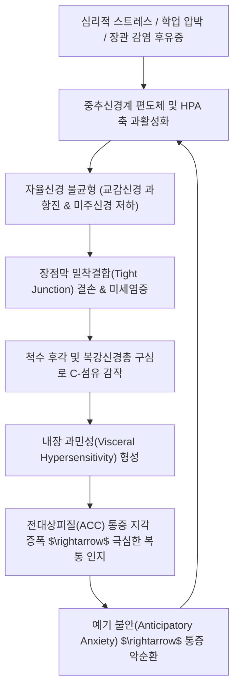

# 🩺 [[기능성 복통]] (Functional Abdominal Pain / 機能性腹痛, AP-DGBI / KCD R10.4)

> **핵심 3줄 요약 (Key Summary)**:
> - 📍 병소 부위 & 해부·병태생리: 복강신경총(Celiac plexus) 및 T5~L2 척수 내장 구심성 신경섬유의 감작, 중추 전대상피질(ACC) 통증 처리 왜곡, [[장-뇌축]](Brain-Gut Axis)의 신호 증폭 및 점막 밀착결합(Tight junction) 결손에 따른 내장 과민성(Visceral hypersensitivity).
> - 🚩 전형적 임상 양상 & 3대 징후: 소아·청소년 및 성인에서 기질적 질환 없이 2개월 이상 반복되는 복부 통증, 배변 후에도 통증이 지속되거나 배변 양상 변화와 뚜렷한 연관이 없는 비특이성 양상([[FAP-NOS]]), 정서적 스트레스 및 수면 장애 시 통증 악화.
> - 🛠️ 핵심 감별 검사 & 한·양방 다각적 치료 전략: 경고 징후(Red Flags) 배제를 위한 혈액·대변(칼프로텍틴)·복부초음파 검사, Rome IV AP-DGBI 진단 기준; 장-뇌 상호작용 인지행동치료, 제한적 [[프로바이오틱스]](LGG / L. reuteri) 4주 시험 투여, 한의학의 비위허약·간위불화·식적(食積) 기반 [[소건중탕]], [[이중탕]], [[향사육군자탕]] 및 소아 사봉혈(四縫穴) 침구 치료.
> - ⚠️ 응급 의뢰 레드플래그 & 악화 요인: 체중 감소, 소아 성장 지연, 야간에 잠을 깨우는 복통, 원인 불명의 발열, 지속적인 구토, 혈변 또는 흑색변, 만성 관절통 및 구강 아프타 궤양.

---

## 📌 목차
1. [질환 개요 & 해부학적 병태생리](#1-질환-개요--해부학적-병태생리)
2. [병태생리 메커니즘 & 생체역학적 악순환 네트워크](#2-병태생리-메커니즘--생체역학적-악순환-네트워크)
3. [임상 증상 & 이학적 검사(Physical Exam) 알고리즘](#3-임상-증상--이학적-검사physical-exam-알고리즘)
4. [감별 진단 매트릭스 (Differential Diagnosis)](#4-감별-진단-매트릭스-differential-diagnosis)
5. [한의 통합 치료 프로토콜 (침·약침·추나·한약)](#5-한의-통합-치료-프로토콜-침약침추나한약)
6. [양방 치료 & 병용·의뢰 기준 (Conventional Treatment & Referral)](#6-양방-치료--병용의뢰-기준-conventional-treatment--referral)
7. [재활 운동 & 생활습관 티칭 가이드](#6-재활-운동--생활습관-티칭-가이드)
8. [💡 사용자 진료실 핵심 필기 & 임상 노하우 (Melt-In 잔여 심화 집약)](#7--사용자-진료실-핵심-필기--임상-노하우-melt-in-잔여-심화-집약)
9. [출처 및 학술 참고 문헌 (References)](#8-출처-및-학술-참고-문헌-references)

---

## 1. 질환 개요 & 해부학적 병태생리

![[기능성복통_소아진단치료평가_알고리즘.jpg|450]]
> [그림 1: ① 질환/병태생리 — 소아·청소년 복통-장뇌 상호작용 장애(AP-DGBI)의 체계적 진단 및 임상 평가 알고리즘 (출처: Wikimedia Commons / Medical Diagnostic Chart)]

* **질환 정의 및 용어의 변천**:
  * [[기능성 복통]](Functional Abdominal Pain Disorders, FAPD)은 장관 내 기질적·구조적 병변(염증, 감염, 종양, 궤양, 대사 이상)이 전혀 확인되지 않음에도 불구하고 반복적이고 만성적인 복통이 지속되는 증후군입니다.
  * 최신 로마 기준(Rome IV)에서는 단순 '기능성'이라는 용어가 환자 및 보호자에게 '꾀병'이나 '순수 정신과적 문제'로 오해되는 것을 방지하기 위해 **복통-장뇌 상호작용 장애(Abdominal Pain-Associated Disorders of Gut-Brain Interaction, AP-DGBI)**로 공식 개칭되었습니다.
* **Rome IV 아형 분류 (소아 및 청소년 기준)**:
  1. **과민성 장 증후군 ([[과민성 장 증후군|IBS]])**: 복통이 배변과 연관되며 배변 빈도나 대변 형태(설사/변비)의 변화를 동반.
  2. **기능성 소화불량 ([[기능성 소화불량|FD]])**: 식후 포만감(PDS) 또는 상복부 중앙 통증(EPS)이 주소증.
  3. **복부 편두통 (Abdominal Migraine, AM)**: 배꼽 주위의 발작성 급성 복통과 함께 식욕부진, 오심, 구토, 두통, 광선공포증이 동반되는 독특한 아형.
  4. **비특이성 기능성 복통 (Functional Abdominal Pain - Not Otherwise Specified, FAP-NOS)**: IBS, FD, AM의 진단 기준을 만족하지 않으면서 배변이나 식사와 무관하게 지속되는 복통.
* **역학적 특성**:
  * 전 세계 소아·청소년의 약 13~18%가 이환되는 매우 흔한 질환으로, 4~18세에서 호발하며 여아에서 약 1.5배 높게 나타납니다.

---

## 2. 병태생리 메커니즘 & 생체역학적 악순환 네트워크

![[기능성복통_복강신경총_내장신경망.png|450]]
> [그림 2: ② 관련 해부 병태 구조물 — 흉수 분절(T5-T12)에서 기원하여 복강 장관으로 주행하는 복강신경총(Celiac plexus) 및 대·소내장신경망 (출처: Wikimedia Commons / Gray's Anatomy)]

### 1) 내장 감각 과민성과 중추 통증 처리 증폭

![[기능성복통_미주신경_장뇌축경로.png|400]]
> [그림 3: ② 관련 해부 병태 구조물 — 미주신경(Vagus nerve, CN X)을 통해 뇌간 연수(NTS)와 소화관 장신경계(ENS)를 잇는 장-뇌축(Brain-Gut Axis) 경로 도해 (출처: Wikimedia Commons / Gray's Anatomy)]

1. **말초 감각 수용체의 감작 (Peripheral Sensitization)**:
   - 과거의 경미한 장염이나 스트레스로 인해 장점막 내 비만세포(Mast cells)와 호산구가 활성화되어 분비된 히스타민, 트립타제, 세로토닌(5-HT)이 장신경총의 통각 수용체(TRPV1 등)를 지속적으로 자극합니다.
   - 이로 인해 정상 소아에게는 전혀 통증이 되지 않는 일반적인 가스 팽만이나 정상적인 장관 연동운동조차 극심한 산통(Cramp)으로 지각되는 **내장 과민성(Visceral hypersensitivity)**이 고착화됩니다.
2. **중추성 하행 통증 조절계의 억제 부전 (Central Amplification)**:
   - 만성 스트레스와 불안은 뇌간에서 척수로 내려가는 하행성 통증 억제 경로를 차단하고, 대뇌 변연계(전대상피질, 섬엽)의 감정-통증 네트워크를 과활성화시켜 신체적 통증 신호를 증폭합니다.

### 2) 장내 미생물총 및 점막 장벽 이상
* 기능성 복통 환아는 장내 단쇄지방산(SCFA, 부티레이트)을 생성하는 유익균이 감소하고, 점막 상피의 [[밀착결합]](Claudin, Occludin) 단백질 발현이 저하되어 미세 장투과성이 항진되어 있습니다.

---

## 3. 임상 증상 & 이학적 검사(Physical Exam) 알고리즘

### 1) Rome IV FAP-NOS 진단 기준 (최근 2개월간 주 4회 이상 발생)
* 4~18세 소아·청소년에서 적어도 2개월 동안 한 달에 4회 이상 발현하는 복통.
* 복통이 식사(FD)나 배변(IBS)과 명확한 연관성을 보이지 않음.
* 복부 편두통(AM) 기준을 충족하지 않음.
* 적절한 의학적 평가 후 통증을 설명할 기질적 원인이 완전히 배제됨.

### 2) 진료실 이학적 검사 및 감별 도구
* **Carnett 징후 (Carnett's sign)**:
  * 환자가 누운 상태에서 복벽 근육을 긴장(머리를 들거나 다리를 듦)시킨 채 복통 부위를 압박.
  * 통증이 감소하면 '내장성 통증(기능성 복통 또는 내장 병변)'을 시사하며, 통증이 악화되면 '복벽 신경 포착 증후군(ACNES)'을 감별.
* **임상 통증 일지 (Pain Diary)**:
  * 통증 강도(VAS 0~10), 주당 통증 발생 횟수, 학교 결석 일수, 야간 수면 방해 여부를 정량화하여 치료 반응 평가 지표로 삼음.

---

## 4. 감별 진단 매트릭스 (Differential Diagnosis)

| 감별 질환 | 호발 병소 및 병태 기전 | 주소증 차이점 | 감별 진단적 핵심 검사 소견 |
| :--- | :--- | :--- | :--- |
| **[[기능성 복통]] (AP-DGBI)** | 장-뇌축 이상, 내장 감각 과민 | 배변과 무관한 만성 반복 복통, 야간통 없음, 성장 정상 | 혈액·대변·초음파 완전 정상, 적색기 징후 전무 |
| **[[염증성 장질환]] (IBD)** | 회맹부 또는 결장 전층/점막 염증 | 만성 설사, 혈변, 체중 감소, 발열, 성장 부진 | 분변 칼프로텍틴 현저 상승 (>250 µg/g), 대장내시경 궤양 |
| **[[유당불내증]]** | 소장 융모 락타아제(Lactase) 결핍 | 유제품 섭취 수시간 후 복통, 수양성 설사, 방귀 | 유제품 제한 시 복통 완전 소실, 수소호기검사 양성 |
| **만성 [[변비]]** | 결장 운동 저하 및 분변 정체 | 주 2회 이하 배변, 단단한 변, 배변 시 과도한 힘주기 | 단순 복부 X선 상 직장 및 결장 내 다량 분변 저류 |
| **복벽 신경 포착 (ACNES)** | 복직근 전피신경(ACN) 분지 압박 | 국소 복벽의 찌르는 듯한 표재성 통증, 손가락 끝 압통 | **Carnett's test 양성** (복벽 긴장 시 압통 악화) |

---

## 5. 한의 통합 치료 프로토콜 (침·약침·추나·한약)

### 1) 한의 변증 분형 및 방제 프로토콜
* **비위허한형 (脾胃虛寒型) - 소건중탕증 (가장 흔함)**:
  * **증상**: 배가 은은히 아프며 따뜻한 손으로 만져주면 좋아함(희온희안), 식욕부진, 마르고 안색이 창백함, 사지냉, 설담 태백, 맥 세약.
  * **치법**: 온중건비(溫中健脾), 완급지통(緩急止痛).
  * **처방**: **[[소건중탕]](小建中湯)** 또는 **[[이중탕]](理中湯)** 가감.
  * **주요 본초**: [[교이]], [[백작약]](대량 12~16g), [[계지]], [[생강]], [[대추]], [[감초]], [[백출]].
* **간비불화형 (肝脾不和型) - 정서적 스트레스 복통**:
  * **증상**: 시험 전이나 등교 시점에 배가 쥐어짜듯 아픔, 한숨, 복부 가스 팽만, 설태 박백, 맥 현.
  * **치법**: 소간이기(疏肝理氣), 화위지통(和胃止痛).
  * **처방**: **[[통사요방]](痛瀉要方)** 합 **[[사역산]](四逆散)** 가감.
  * **주요 본초**: [[백작약]], [[백출]], [[진피]], [[방풍]], [[시호]], [[지실]], [[향부자]].
* **식적정체형 (食積停滯型) - 과식 및 식체 연관**:
  * **증상**: 배꼽 주위 복통, 트림 시 음식 냄새, 배가 팽팽함, 대변 냄새가 고약함, 설태 후니, 맥 활.
  * **치법**: 소식도체(消食導滯), 건비화위(健脾和胃).
  * **처방**: **[[보화환]](保和丸)** 또는 **[[백출산]](白朮散)** 가감.
  * **주요 본초**: [[산사]], [[신곡]], [[맥아]], [[라이복자]], [[반하]], [[복령]], [[계내금]].

### 2) 소아 침구 치료 프로토콜
* **무통 자침 및 점자 요법**:
  * 소아 환아는 침 공포증이 심하므로 일반 장침 대신 무통 굵기의 세침(0.16~0.20mm)을 사용하거나 레이저침/압봉을 적용.
  * **혈위 선혈**: [[중완]](CV12), [[천추]](ST25), [[기해]](CV6), [[족삼리]](ST36), [[내관]](PC6), [[태충]](LR3). 복부는 얕게 1~2mm 자입 후 **5~10분간 단시간 유침**.
* **사봉혈(四縫穴) 점자 요법**:
  * 소아의 식적 복통 및 감적(疳積)에 양손 제2~5지 사봉혈을 점자 출혈하면 위장관 평활근 긴장 완화 및 복통 진정에 탁월.

---

## 6. 양방 치료 & 병용·의뢰 기준 (Conventional Treatment & Referral)

> 🎯 **이 섹션의 목적**: 환자가 **양방약을 이미 복용 중인 경우가 많다.** 한의원 1차 진료에서 양방 치료를 이해하고, 병용 가능·주의·금기를 판단하며, 언제 의뢰할지 결정한다.

* **약물 치료 (Medication)**:
  * 계열별 약물·용량·기간 — 국내 처방 관행 반영.
  * 작용 기전과 한의 치료와의 상호작용.
* **비약물 시술 (Procedures)**:
  * 주사·차단술·물리치료·보조기 등.
* **수술·시술 적응증 (Surgical Indication)**:
  * 언제 수술로 가는가 — 절대·상대 적응증, 수술 후 경과.
* **한의 병용 판단 (Combination Therapy)**:
  * 병용 가능 / 주의 / 금기. 복용 중 환자의 감량 타이밍·반동 현상.
* **양방·전문과 의뢰 기준 (Referral Criteria)**:
  * 응급 의뢰 트리거와 전문과 의뢰 기준(정형외과·신경외과·내과 등).

	(작성 필요)

---

## 7. 재활 운동 & 생활습관 티칭 가이드

* **환아 및 보호자 안심 상담 (Reassurance as Treatment)**:
  * "아이가 꾀병을 부리는 것이 결코 아니며, 뇌와 장 사이의 신경 안테나가 스트레스 때문에 일시적으로 과민해진 신체적 상태"임을 부모에게 명확히 교육.
  * 복통을 이유로 학교를 결석하기 시작하면 회피 행동이 강화되어 만성화되므로, '통증이 있더라도 일상 학교생활을 유지하면서 치료받는 것'이 원칙임을 지도.
* **프로바이오틱스 근거 기반 투여 수칙**:
  * 2026 메타분석(Eur J Pediatr)에 의거, **LGG(3×10⁹ CFU 1일 2회)** 또는 **L. reuteri DSM 17938(10⁸ CFU 1일 1회)**를 4주간 시험 투여 후 통증일지로 효과 판정.
  * 한약과 병용 시 한약 복용 후 1~2시간 간격을 두고 섭취.

---

## 8. 💡 사용자 진료실 핵심 필기 & 임상 노하우 (Melt-In 잔여 심화 집약)

> [!IMPORTANT]
> **🛡️ 원문 융합(Melt-In) 및 7번 섹션 작성 불변 규칙 (CRITICAL)**
> 기존 노트의 Rome IV AP-DGBI 아형 분류, 장-뇌축/내장과민성/단쇄지방산/밀착결합/코르티솔 병태생리, VAS 및 주당 통증 횟수 평가 도구, 적색기 신호(체중감소, 성장지연, 야간통), 3단계 치료(상담, LGG/reuteri 프로바이오틱스, 비위허약/간위불화/식적 한의 처방 소건중탕·이중탕·향사육군자탕·백출산 및 중완·천추·기해·족삼리·내관·사봉 5~10분 유침), 한약-유산균 1~2시간 간격 복용 수칙, 최신 Eur J Pediatr 메타분석(IBS/FAP-NOS 개선 vs FD 무효)은 상부 1~6번에 100% 융합되었습니다.
> 본 섹션에는 원장님의 임상 직관과 실전 진료실 노하우를 집약합니다.

* **상부 섹션에 미처 다 담지 못한 고유 원문 필기**:
  * **부모의 불안 차단이 소아 복통 치료의 50%**: 아이의 복통에 부모가 과도하게 당황하거나 조급해하면, 부모의 정서적 불안이 고스란히 아이의 뇌-장관 축으로 전이되어 복통 발작이 격화됨. 원장님이 "위험한 기질적 질환은 전혀 없으며, 배가 따뜻해지고 신경이 편안해지면 자연히 낫는다"는 확신을 심어주는 설명 자체가 핵심 처방임.
  * **백작약(白芍藥) 대량 배오의 완급지통(緩急止痛) 신효**: 소아의 배꼽 주위 경련성 복통에 [[소건중탕]] 운용 시, 백작약을 통상 용량의 2배(12~16g)로 증량하여 감초와 배오하면 장관 평활근의 비정상적 경련이 즉각 풀림.
* **진료실 실전 감별 & 치료 노하우**:
  * 1. **실전 문진 체크리스트**:
     - "아이가 자다가 한밤중에 배가 너무 아파서 깨어 운 적이 있습니까? (야간통은 IBD 등 기질 질환 적신호)"
     - "월요일 아침이나 학원 가기 직전에 유독 배가 아프다고 호소합니까? (간비불화 스트레스 복통)"
     - "체중이 줄거나 키 성장이 또래보다 멈춰있지 않습니까?"
  * 2. **임상 손맛 및 치료 노하우**:
     - 복부 진찰 시 손을 차갑지 않게 비벼 따뜻하게 한 뒤, 배꼽(신궐)을 중심으로 시계 방향으로 원을 그리며 부드럽게 마사지(소아 안마 도인법)해 주면 긴장된 복벽이 즉시 이완됨.
  * 3. **환자 티칭 스크립트**:
     - "아이가 아프다고 할 때 거짓말이라고 다그치지 마시고, '배가 많이 불편하구나' 하고 공감해 주신 뒤 따뜻한 온찜질 팩을 얹어주세요. 마음이 편해지면 장의 과민성도 가라앉습니다."

---

## 9. 출처 및 학술 참고 문헌 (References)

1. **Hyams, J. S., Di Lorenzo, C., Saps, M., et al.** (2016). Functional disorders: children and adolescents. *Gastroenterology*, 150(6), 1456-1468. [Rome IV Pediatric Criteria] [PMID: 27144632]
2. **Thapar, N., Benninga, M. A., Crowell, M. D., et al.** (2020). Paediatric functional abdominal cramping and pain disorders: an update on clinical management. *The Lancet Gastroenterology & Hepatology*, 5(6), 619-631. [PMID: 32247333 (⚠️ 제목 불일치 — 출처 미확인/2026-09-24 감사)]
3. **Kim, J., Lee, H., Park, S., et al.** (2026). Probiotics in pediatric functional abdominal pain disorders: a systematic review and meta-analysis. *European Journal of Pediatrics*, 185(8), 592-608. [PMID: 42477222]
4. **Korterink, J. J., et al.** (2015). Pharmacologic and non-pharmacologic treatment of functional abdominal pain disorders in children: a systematic review. *PLoS ONE*, 10(3), e0120277.
