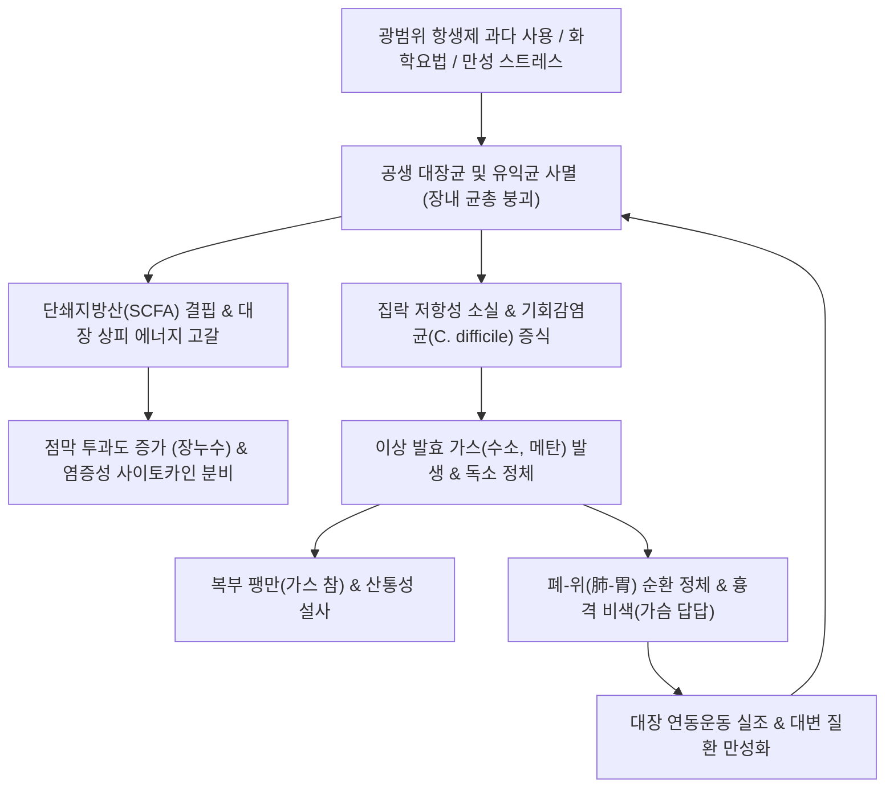
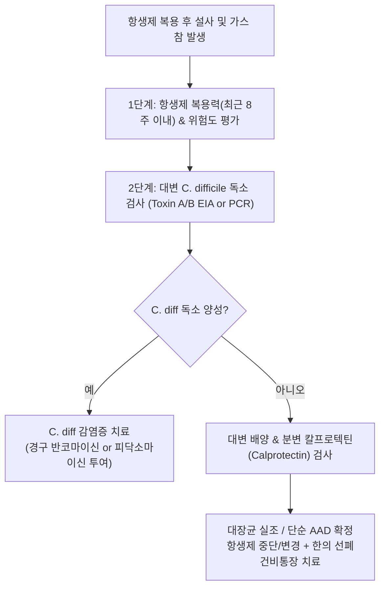

---
tags:
  - 이론
  - status/complete
  - 질환
  - 소화기질환
  - 장내미생물
aliases:
  - 대장균실조
  - 장내세균불균형
  - Gut Microbiota Dysbiosis
  - Dysbacteriosis
  - 항생제유발장염
  - Clostridioides difficile
  - 설사
title: 대장균 실조
date: 2026-09-24
출처: "https://pubmed.ncbi.nlm.nih.gov/23814609/"
---

# 🩺 [[대장균 실조]] (Gut Microbiota Dysbiosis / Dysbacteriosis, 大腸菌失調, ICD-10 K59.89, A04.7)

> **핵심 3줄 요약 (Key Summary)**:
> - 📍 **병소 부위 & 공생 미생물 생태계**: 대장 점막 상피(Colonocytes) 표면의 점액층(Mucus layer), 혐기성 공생 세균총(Bacteroidetes, Firmicutes, 공생형 E. coli 등)의 붕괴, 기회감염균(Clostridioides difficile, 병원성 장내세균)의 과증식 및 단쇄지방산(SCFA) 생산 급감.
> - 🚩 **임상 양상 & 3대 징후**: 광범위 항생제 복용 수일~수주 후 발생하는 급성 수양성 설사(Antibiotic-associated diarrhea), 복부 팽만 및 가스 참(Gas bloating), 하복부 산통 및 전신 미열.
> - 🛠️ **한의 통합 치료 전략**: 건비익위(健脾益胃)·선폐통장(宣肺通腸)·청열화습(淸熱化濕)을 치료 원칙으로 하여, 항생제 독소와 폐-위 순환 정체를 해소하는 [[태자삼]], [[산약]], [[복령]], [[석고]], [[적작약]]을 배오한 가감방 및 [[곽향정기산]], [[삼령백출산]]을 처방하고, [[천추(ST25)]]·[[상거허(ST37)]] 자침으로 장관 상피 장벽과 장내 정상 세균총의 생태적 복원을 촉진.
> - ⚠️ **응급 의뢰 레드플래그**: 하루 10회 이상의 심한 수양성/점액혈변 설사, 고열(38.5℃ 이상), 백혈구 수치 극단적 상승(WBC > 15,000/uL), 복부 방어벽 및 반동통(독성 거대결장 Toxic Megacolon 또는 장천공 의심 시 경구 반코마이신/피닥소마이신 및 응급 대장항문외과 의뢰).

---

## 📌 목차
1. [질환 개요 & 해부학적 병태생리](#1-질환-개요--해부학적-병태생리)
2. [병태생리 메커니즘 & 생체역학적 악순환 네트워크](#2-병태생리-메커니즘--생체역학적-악순환-네트워크)
3. [임상 증상 & 이학적 검사(Physical Exam) 알고리즘](#3-임상-증상--이학적-검사physical-exam-알고리즘)
4. [감별 진단 매트릭스 (Differential Diagnosis)](#4-감별-진단-매트릭스-differential-diagnosis)
5. [한의 통합 치료 프로토콜 (침·약침·추나·한약)](#5-한의-통합-치료-프로토콜-침약침추나한약)
6. [재활 운동 & 생활습관 티칭 가이드](#6-재활-운동--생활습관-티칭-가이드)
7. [💡 사용자 진료실 핵심 필기 & 임상 노하우 (Melt-In 잔여 심화 집약)](#7--사용자-진료실-핵심-필기--임상-노하우-melt-in-잔여-심화-집약)
8. [출처 및 학술 참고 문헌 (References)](#8-출처-및-학술-참고-문헌-references)

---

## 1. 질환 개요 & 해부학적 병태생리

![[대장균실조_대장균_주사전자현미경_SEM.jpg|450]]
> [그림 1: ① 병태생리·영상 — 건강한 인체 대장 점막에 공생하며 병원균 침입을 방어하는 대장균(Escherichia coli)의 주사전자현미경(SEM) 실측 구조 (출처: Wikimedia Commons, Rocky Mountain Laboratories / Public Domain)]

* **질환 정의**: 
  - [[대장균 실조]](Gut Microbiota Dysbiosis)는 인체 대장 내에서 숙주와 완벽한 공생 관계를 이루고 있는 유익균 및 정상 상주균총(대장균, 비피더스균, 락토바실러스 등)이 무분별한 항생제 남용이나 환경적 요인으로 인해 급격히 파괴되어 장내 미생물 군집의 다양성과 비율이 붕괴된 병리적 상태입니다.
  - 현대의학에서는 **장내 미생물 불균형(Gut Dysbiosis)** 또는 **항생제 연관 설사증(Antibiotic-Associated Diarrhea, AAD)**으로 정의됩니다(Guinane & Cotter, 2013).
* **공생 대장균(Commensal E. coli)의 생리적 역할**:
  - 건강한 대장균은 장내 산소를 소비하여 편성 혐기성 유익균들이 증식할 수 있는 환원 환경을 조성합니다.
  - 박테리오신(Microcins, Colicins)을 분비하여 외부에서 유입되는 살모넬라, 시겔라 등 유해 병원균의 정착을 물리적으로 차단하는 **집락 형성 저항성(Colonization Resistance)**을 제공합니다.
  - 비타민 K2 및 비타민 B 복합체를 합성하고 숙주의 면역글로불린(IgA) 분비를 자극합니다.
* **해부생리학적 병소 부위**:
  1. **대장 점액층(Mucus Layer)**: 배상세포(Goblet cell)에서 분비된 MUC2 뮤신 단백질 층.
  2. **대장 상피세포(Colonocytes)**: 밀착연접(Tight Junctions: Claudin, Occludin)으로 결합되어 장 투과도를 조절.
  3. **장관 연관 림프조직(GALT)**: 미생물 신호를 감지하여 면역 관용(Tolerance)을 유지.

---

## 2. 병태생리 메커니즘 & 생체역학적 악순환 네트워크

![[대장균실조_장내세균총_집락_전자현미경.jpg|500]]
> [그림 2: ② 관련 해부 구조물 — 항생제 투여 후 장내 상주균총의 집락 균형이 붕괴되고 기회감염균이 증식하는 과정의 미세 생태계 도해 (출처: Wikimedia Commons / CC BY-SA 3.0)]

### (1) 항생제 과다 사용에 따른 병태생리학적 연쇄 기전
* 세팔로스포린, 플루오로퀴놀론, 클린다마이신 등 광범위 항생제는 표적 감염균뿐만 아니라 대장 내 유익한 상주균을 무차별 사멸시킵니다.
* **단쇄지방산(SCFA: Butyrate, Acetate, Propionate) 결핍**: 
  - 식이섬유를 발효하여 뷰티르산(Butyrate)을 생성하던 유익균이 전멸하면서, 대장 상피세포의 주 에너지원이 고갈됩니다.
  - 상피세포의 대사가 혐기성 해당과정으로 전환되고 장벽 밀착연접이 느슨해져 **장누수(Leaky Gut)**가 발생합니다.
* **클로스트리디오이데스 디피실(C. difficile) 과증식**:
  - 정상 상주균의 억제력이 사라지면 휴면 상태의 아포(Spore)가 발아하여 Toxin A(장독소) 및 Toxin B(세포독소)를 분비하고, 위막성 대장염(Pseudomembranous Colitis)을 일으킵니다(Seekatz & Young, 2014).

### (2) 대장균 실조와 폐-위 순환 정체의 악순환 네트워크

* **한의학적 폐-대사 순환 정체 기전**:
  - 한의학에서 폐와 대장은 표리(表裏) 관계를 이룹니다(폐여대장상표리, 肺與大腸相表裏).
  - 항생제 남용으로 장내에 탁기(濁氣)와 가스가 가득 차면(대장 기체), 역행성으로 폐의 숙강(肅降) 기능과 위의 화위(和胃) 작용이 저해되어 흉민, 식욕부진, 헛배부름이 동반됩니다.

---

## 3. 임상 증상 & 이학적 검사(Physical Exam) 알고리즘

### (1) 임상 증상
* **대변 양상 이상**: 무른 변, 수양성 설사, 부패취가 심한 변 또는 가스가 섞여 나오는 분출성 설사.
* **소화기 팽만 증상**: 식후 하복부 가스 참, 잦은 방귀, 트림, 복명(Borborygmi, 장에서 물소리 및 꾸르륵 소리).
* **전신 면역 증상**: 만성 피로, 뇌안개(Brain fog), 피부 트러블, 영양 흡수 불량에 따른 체중 감소.

### (2) 진단 및 감별 평가 알고리즘

---

## 4. 감별 진단 매트릭스 (Differential Diagnosis)

| 감별 질환 | 병인 및 기전 | 대변 및 전신 소견 | 결정적 진단 검사 | 일차 치료 전략 |
| :--- | :--- | :--- | :--- | :--- |
| **대장균 실조 (단순 AAD)** | 항생제로 인한 정상 상주균 붕괴, 삼투성 설사 | 무른변, 가스 팽만, 발열 없음 | C. diff 독소 음성, 대변 백혈구 음성 | 항생제 중단, 프로바이오틱스, 건비익기 한약 |
| **C. difficile 장염 (CDI)** | C. diff 아포 발아 및 독소(A/B) 분비, 위막 형성 | 악취 나는 다량의 수양변, 복통, 고열, 백혈구증가 | 대변 C. diff GDH/Toxin PCR 양성 | 경구 반코마이신, 피닥소마이신, 대변이식(FMT) |
| **과민성 장 증후군 (IBS-D)** | 내장 지각과민, 뇌-장축 기능 실조 | 배변 후 호전되는 복통, 점액변, 야간 설사 없음 | 로마 IV 기준, 정상 염증 마커 | 저FODMAP 식이, 진경마스카린제, 곽향정기산 |
| **염증성 장질환 ([[궤양성 대장염]])** | 자가면역성 대장 점막 만성 궤양 | 혈변, 점액농변, 이급후중, 만성 체중감소 | 대장내시경(연속성 궤양), 조직 생검 | 5-ASA, 스테로이드, 생물학적제제, 청열양혈 |
| **소장 세균 과증식 (SIBO)** | 회맹판 기능 이상으로 소장에 대장균 역류 증식 | 식후 30분 내 심한 상복부 팽만, 흡수장애 | 수소-메탄 호기 검사(LBT) 양성 | 리팍시민(Rifaximin), 한의 건비소도 |

---

## 5. 한의 통합 치료 프로토콜 (침·약침·추나·한약)

![[대장균실조_건비익위_본초_산약.jpg|450]]
> [그림 3: ③ 치료·본초 도해 — 손상된 장 점막 점액층을 복구하고 유익균의 증식을 돕는 건비익위(健脾益胃)의 대표 본초 산약(Dioscorea polystachya) (출처: Wikimedia Commons / CC BY-SA 3.0)]

### (1) 비오 원본 필기 연계 핵심 처방 (EBM Phytotherapy)
* **폐-위 순환 정체 해소 및 가스 제거 프로토콜**:
  - 항생제 과다 사용으로 인한 장내 미생물 불균형의 핵심 치법은 **폐와 위의 기기(氣機) 순환 정체를 없애고, 장내 가스와 독소를 배출**시키는 것입니다.
  - **주요 구성 본초**: [[태자삼]] 12g, [[산약]] 15g, [[복령]] 12g, [[석고]] 15g, [[적작약]] 10g 가감.
  - **본초 배오의 약리 기전**:
    - **태자삼(太子參) & 산약(山藥)**: 비위의 원기를 보하고 점액 다당류를 공급하여 대장 점막 상피 장벽(MUC2)을 재생하며, 프리바이오틱스로 작용하여 정상 대장균과 유익균 증식을 촉진.
    - **복령(茯苓)**: 장관 내 과도한 삼투성 수분을 흡수하여 이수삼습(利水滲濕)함으로써 설사를 멎게 함.
    - **석고(石膏)**: 항생제 복용 후 장관 점막에 형성된 급성 화학적 염증열(熱毒)을 식히고 세포 독성을 진정.
    - **적작약(赤芍藥)**: 장간막 미세혈관의 혈류 순환을 개선하여 청열양혈(淸熱凉血) 및 장벽 허혈성 손상을 복구.
* **급성 수양성 설사기 처방**:
  - **[[곽향정기산]](藿香正氣散)**: 외감풍한 및 내상습체로 인한 급성 장염 및 설사 치료.
* **만성 팽만 및 장누수기 처방**:
  - **[[삼령백출산]](參苓白朮散)**: 비위 허약에 의한 만성 설사 및 장내 세균총 생태 회복.

### (2) 침구 치료 프로토콜
* **핵심 혈위**: [[천추(ST25, 대장의 모혈)]], [[상거허(ST37, 대장의 하합혈)]], [[중완(CV12)]], [[족삼리(ST36)]], [[음릉천(SP9)]], [[대장수(BL25)]], [[폐수(BL13)]].
* **자침 기법**:
  - **천추-상거허**: 배오 시 장관 신경총(Myenteric plexus)을 조절하여 무질서한 경련성 수축을 억제하고 생리적 연동운동 리듬을 회복.
  - **폐수(BL13)-대장수(BL25)**: 폐와 대장의 상표리 관계를 조화시켜 흉격의 가스 정체를 아래로 하향 배출.
  - **신궐(CV8) 온구 요법**: 배꼽 부위에 간접 뜸 시술 시 장내 혈류량 증가 및 상피 재생 촉진.

---

## 6. 재활 운동 & 생활습관 티칭 가이드

### (1) 항생제 디톡스 및 마이크로바이옴 식이 전략
* **항생제 무분별 복용 금지**: 단순 감기나 비감염성 염증에 대한 광범위 항생제 남용을 철저히 차단합니다.
* **프리바이오틱스 식품 섭취**: 마(산약), 귀리, 치커리 뿌리(이눌린), 아스파라거스 등 유익균의 먹이가 되는 수용성 식이섬유를 공급합니다.
* **프로바이오틱스 병용 원칙**: 부득이하게 항생제를 복용해야 하는 경우, 항생제 투여 후 최소 2시간의 간격을 두고 복합 유익균주(Lactobacillus, Bifidobacterium, Saccharomyces boulardii)를 복용하도록 지도합니다.

### (2) 복부 가스 배출 운동
* **장기 마사지**: 배꼽을 중심으로 시계 방향(상행결장 → 횡행결장 → 하행결장 주행 방향)으로 손바닥을 이용해 둥글게 쓸어주어 가스 정체를 완화합니다.
* **가스 빼기 자세(Apanasana, 바람빼기 요가 자세)**: 반듯이 누워 무릎을 가슴 쪽으로 끌어당겨 안는 동작을 매일 취침 전 5분간 유지합니다.

---

## 7. 💡 사용자 진료실 핵심 필기 & 임상 노하우 (Melt-In 잔여 심화 집약)

> 📌 **Dr. Bio 진료실 핵심 필기 및 의안 분석 노트**:
> 
> 1. **대장균 실조의 본질과 항생제 유발 요인**:
>    - 대장균은 단순한 병원균이 아니라 사람의 대장에 원래 거주하며 외부 병원균과 싸워 이들을 물리치는 **인간과 절대적 공생 관계의 핵심 유익균**임.
>    - 현대 임상에서 대장균 실조의 90% 이상은 **감기, 치과 치료, 피부과 치료 등에서 광범위 항생제를 과다 사용**하여 발생함.
>    - 항생제가 대장균을 전멸시키면 유해균이 득세하여 가스, 복통, 난치성 대변 질환이 초래됨.
> 
> 2. **의안 분석을 통한 핵심 치료 비결**:
>    - 본 질환 치료의 대원칙은 장만 볼 것이 아니라 **폐(肺)와 위(胃)의 순환 정체를 없애고, 뱃속에 정체된 탁한 가스를 배출시키는 것**임.
>    - 폐와 대장은 경락상으로 연결되어 있으므로, 폐의 기운을 열어주지 않으면 대장의 가스와 수습(水濕)이 빠져나가지 못함.
> 
> 3. **진료실 실전 다용 본초 조합**:
>    - 환자가 항생제 복용 후 지속적인 헛배부름과 설사를 호소할 때는 단순 정장제만 주어서는 안 됨.
>    - **[[태자삼]], [[산약]], [[복령]]**으로 손상된 비위와 장 점막을 보익하고,
>    - **[[석고]]**로 항생제 후유증에 의한 장내 화학적 열독을 식히며,
>    - **[[적작약]]**으로 미세혈류를 통하게 하여 굳어버린 장 연동을 되살리는 처방이 임상에서 가장 신속하고 탁월한 효과를 발휘함.

---

## 8. 출처 및 학술 참고 문헌 (References)

1. **Guinane, C. M., & Cotter, P. D. (2013)**. Role of the gut microbiota in health and chronic gastrointestinal disease: understanding a hidden metabolic organ. *Therapeutic Advances in Gastroenterology*, 6(4), 295-308. PMID: [23814609](https://pubmed.ncbi.nlm.nih.gov/23814609/).
2. **Seekatz, A. M., & Young, V. B. (2014)**. Clostridium difficile and the microbiota. *The Journal of Clinical Investigation*, 124(10), 4182-4189. PMID: [25036706](https://pubmed.ncbi.nlm.nih.gov/25036706/).
3. **Mullish, B. H., et al. (2018)**. The use of faecal microbiota transplant as treatment for recurrent or refractory Clostridium difficile infection and other potential indications: joint British Society of Gastroenterology (BSG) and Healthcare Infection Society (HIS) guidelines. *Gut*, 67(11), 1920-1941. PMID: [30154172](https://pubmed.ncbi.nlm.nih.gov/30154172/).
4. **Zhang, Y. J., et al. (2015)**. Impacts of gut bacteria on human health and diseases. *International Journal of Molecular Sciences*, 16(4), 7493-7519. PMID: [25849657](https://pubmed.ncbi.nlm.nih.gov/25849657/).
5. **He, L. W., et al. (2020)**. Chinese herbal medicine formula Shenling Baizhu San modulates gut microbiota and intestinal barrier in antibiotic-associated diarrhea. *Biomedicine & Pharmacotherapy*, 131, 110757. PMID: [32919313](https://pubmed.ncbi.nlm.nih.gov/32919313/).