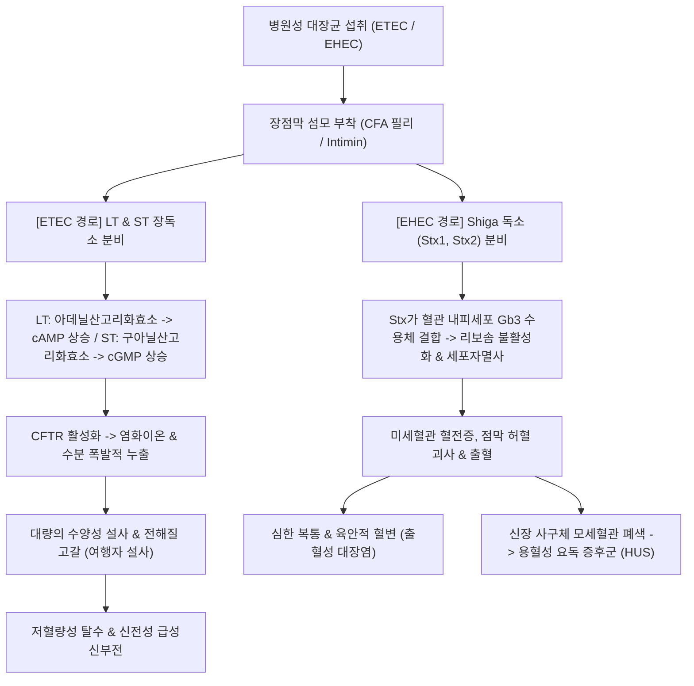

# 🩺 대장균 위장염 (Escherichia coli Gastroenteritis / 大腸菌 胃腸炎, KCD: A04.0~A04.4)

> **핵심 3줄 요약 (Key Summary)**:
> - 📍 **병소 부위 & 병태생리**: 병원성 대장균([[대장균]])의 5대 아형(ETEC, EPEC, EHEC, EIEC, EAEC)에 의한 소장 및 대장 감염으로, 장독소(LT/ST)에 의한 분비성 수양변 또는 Shiga 독소(Stx) 및 상피 침습에 의한 출혈성 대장염과 장 점막 괴사가 유발됨.
> - 🚩 **전형적 임상 양상 & 3대 징후**: 오염된 음식/물 섭취 후 급성 수양성 설사(여행자 설사) 또는 **발열 없는 심한 복통과 다량의 혈변**(EHEC O157:H7 출혈성 대장염), 오심·구토 및 탈수.
> - 🛠️ **핵심 감별 & 한·양방 치료 전략**: 대변 배양 및 Shiga toxin PCR 검사로 확진. 수액 요법을 기본으로 하되, EHEC 의심 시 항생제 및 지사제 절대 금기(HUS 유발 위험). 한의 [[곡지]](LI11)·[[천추]](ST25)·[[상거허]](ST37) 자침 및 습열설사 변증에 따른 [[갈근황련황금탕]], [[황련해독탕]], [[곽향정기산]] 통합 치료로 장독소를 중화하고 전해질 평형을 회복함.
> - ⚠️ **응급 의뢰 레드플래그**: 장출혈성 대장균(EHEC) 감염 5~10일 후 소변량 급감(무뇨/핍뇨), 창백, 황달, 피부 점상출혈이 동반되는 용혈성 요독 증후군([[HUS]]), 파종성 혈관내 응고(DIC), 쇼크 발생 시 즉시 상급병원 응급 투석 의뢰.

---

## 📌 목차
1. [질환 개요 & 병태생리 (Disease Overview)](#1-질환-개요--병태생리-disease-overview)
2. [병태생리 메커니즘 & 대사·장기부전 악순환 네트워크](#2-병태생리-메커니즘--대사장기부전-악순환-네트워크)
3. [임상 증상 & 환자 소견 (Clinical Presentation)](#3-임상-증상--환자-소견-clinical-presentation)
4. [감별 진단 매트릭스 (Differential Diagnosis)](#4-감별-진단-매트릭스-differential-diagnosis)
5. [한의 통합 치료 프로토콜 (침·약침·한약)](#5-한의-통합-치료-프로토콜-침약침한약)
6. [양방 치료 & 병용·의뢰 기준 (Conventional Treatment & Referral)](#6-양방-치료--병용의뢰-기준-conventional-treatment--referral)
7. [식이·생활습관 & 자가관리 티칭 가이드](#7-식이생활습관--자가관리-티칭-가이드)
8. [💡 진료실 핵심 필기 & 임상 노하우](#8--진료실-핵심-필기--임상-노하우)
9. [출처 및 학술 참고 문헌 (References)](#9-출처-및-학술-참고-문헌-references)

---

## 1. 질환 개요 & 병태생리 (Disease Overview)

![[대장균_위장염_01_대장균그람음성간균.png|420]]
> [그림 1: ① 질병 개요 도해 — 대장균 위장염을 일으키는 병원성 대장균(Escherichia coli)의 전형적인 그람 음성 통성 혐기성 간균 형태 — CDC PHIL(Public Domain)]

* **질환 정의 및 5대 병원성 아형 분류 (Pathotypes)**:
  * 대장균(E. coli)은 정상 장내 상재균이나, 특정 독력 인자(Virulence factors)를 획득한 병원성 대장균에 감염되면 급성 위장염이 발생함(Croxen et al., 2013).
  * **5대 병원형 분류**:
    1. **ETEC (장독소성 대장균, Enterotoxigenic E. coli)**: **여행자 설사(Traveler's Diarrhea)**의 최다 원인균(50% 이상). 열불안정독소(LT)와 열안정독소(ST)로 분비성 수양변 유발.
    2. **EHEC / STEC (장출혈성 대장균 / 시가독소생산 대장균, Enterohemorrhagic E. coli)**: 혈청형 O157:H7이 대표적. 덜 익힌 쇠고기·비살균 우유로 감염. Shiga toxin으로 출혈성 대장염 및 HUS 유발.
    3. **EPEC (장병원성 대장균, Enteropathogenic E. coli)**: 개발도상국 영유아 수양성 설사의 주원인. 장 상피 A/E(Attaching and effacing) 병변 형성.
    4. **EIEC (장침습성 대장균, Enteroinvasive E. coli)**: 시겔라(이질균)와 유사하게 결장 상피세포를 직접 침습하여 이질양 혈변과 이급후중 유발.
    5. **EAEC (장응집성 대장균, Enteroaggregative E. coli)**: 소아 및 면역저하자에서 만성·지속성 설사 유발.
* **관련 장기 및 계통**:
  * **주 이환 장기**: 소장(ETEC, EPEC 호발), [[대장]](EHEC, EIEC 호발).
  * **합병증 장기**: [[신장]](사구체 미세혈전증 및 급성 신손상), 뇌(중추신경계 미세혈전 뇌증).

---

## 2. 병태생리 메커니즘 & 대사·장기부전 악순환 네트워크

![[대장균_위장염_02_대장균MacConkey배양.png|420]]
> [그림 2: ② 병태생리 구조도 — 대장균의 신속 감별을 위한 MacConkey 한천 배지 상의 유당 분해(핑크색 집락) 배양 소견 — Wikimedia Commons(Public Domain)]

![[대장균_위장염_02_시가독소및장독소기전.png|450]]
> [그림 3: ③ 병태생리 구조도 — 대장균 장독소(LT/ST)에 의한 이온 통로 활성화 및 Shiga 독소(Stx)에 의한 장점막 상피·혈관 내피세포 파괴 기전 — Wikimedia Commons(CC BY-SA)]

### 1) 분자·세포 수준 독소 기전
* **ETEC의 이중 장독소 분비 기전**:
  * **LT(열불안정독소)**: 콜레라 독소와 80% 상동성을 지니며, Gs 단백질을 지속 활성화하여 세포 내 cAMP를 상승시킨다.
  * **ST(열안정독소)**: 장 상피세포 표면의 구아닐산 고리화효소 C(GC-C)에 결합하여 cGMP를 상승시킨다.
  * 두 경로 모두 CFTR 염화이온 통로를 열고 Na+ 재흡수를 차단하여 대량의 전해질과 수분을 장강으로 쏟아내게 한다(Croxen et al., 2013).
* **EHEC의 Shiga 독소(Stx)와 HUS 악순환**:
  * Stx 독소는 장 점막 미세혈관 내피세포를 파괴하여 장벽 출혈을 일으키고, 혈류를 타고 신장 사구체로 이동하여 내피 손상 및 미세혈전을 형성한다.
  * 혈관 내피 손상으로 혈소판이 소모되어 혈소판 감소증이 발생하고, 미세혈전을 통과하던 적혈구가 물리적으로 파괴되면서 파열적혈구(Schistocyte)를 형성하는 미세혈관병성 용혈성 빈혈이 발생한다(Tarr et al., 2005).

---

## 3. 임상 증상 & 환자 소견 (Clinical Presentation)

![[대장균_위장염_03_탈수및피부긴장도저하.png|350]]
> [그림 4: ④ 환자 임상 소견 — ETEC 장독소성 설사 환자에서 관찰되는 중등도-중증 탈수 징후인 피부 긴장도 저하 — Wikimedia Commons(Public Domain)]

![[대장균_위장염_03_수양변혈변대변척도.png|450]]
> [그림 5: ⑤ 검사 평가 도구 — ETEC의 완전 액체변(Type 7)과 EHEC의 혈액성 점액변(Type 6~7)을 감별 평가하는 브리스톨 대변 척도 — Wikimedia Commons(CC BY-SA)]

### 1) 주소증 및 핵심 증상
* **ETEC (여행자 설사)**:
  * 오염된 물/음식 섭취 1~3일 후 갑작스러운 복부 팽만감, 구역, 하루 4~10회 이상의 다량의 수양성 설사(Watery diarrhea). 발열은 없거나 미열.
* **EHEC (출혈성 대장염)**:
  * 섭취 3~8일 후 극심한 하복부 산통으로 시작하여 처음에는 수양변을 보이다가 **1~2일 내에 순수한 혈액성 변(All-blood stool)**으로 급변함.
  * ⚠️ **중요 감별점**: 살모넬라나 시겔라와 달리 **발열이 없거나 미열(<38℃)**인 상태에서 극심한 혈변과 복통이 나타남.

### 2) 객관적 소견 (Signs & Labs)
* **대변 검사**:
  * ETEC: 대변 백혈구 음성.
  * EHEC: 대변 백혈구 양성 또는 음성, 대변 잠혈 강력 양성.
  * **확진 검사**: 대변 PCR에서 Shiga 독소 유전자(stx1, stx2) 검출, MacConkey-Sorbitol (SMAC) 배지 배양(O157 균주는 소르비톨 비분해 집락 형성).
* **혈액 검사 (HUS 스크리닝 필수)**:
  * 혈소판 수치 급감(<150,000/$\mu L$), 혈청 크레아티닌(Cr) 상승, 말초혈액도말 상 파열적혈구(Schistocyte) 관찰.

---

## 4. 감별 진단 매트릭스 (Differential Diagnosis)

| 감별 질환 | 발열 여부 | 설사 성상 및 특징 | 감별 포인트 (검사) |
| :--- | :---: | :--- | :--- |
| **ETEC 장염** | 없음/미열 | **다량의 맑은 수양성 설사**, 여행력 | 대변 백혈구 음성, LT/ST PCR 양성 |
| **EHEC 장염** | **발열 없음** | **극심한 산통 + 순수 혈변**, HUS 위험 | **대변 Shiga 독소 양성**, SMAC 배지 무색 집락 |
| 세균성 이질([[급성 감염성 장염]]) | **고열(>38.5℃)** | 점액혈변, 심한 이급후중 | 대변 백혈구 다수, Shigella 배양 양성 |
| 살모넬라 장염 | 고열 | 수양변 또는 녹색 점액변 | 달걀·가금류 섭취력, Salmonella 배양 |
| 캄필로박터 장염 | 고열 | 혈변, 우하복부 극심한 통증(맹장염 모사) | 덜 익힌 닭고기, 캄필로박터 배양 |

> 🚩 **레드플래그 감별 (용혈성 요독 증후군 HUS)**:
> - EHEC 감염 후 혈소판 감소 + 빈혈 + 급성 신손상이 동반되면 HUS로 진단하며, 조기 수액 요법과 투석 치료가 생존을 결정함.

---

## 5. 한의 통합 치료 프로토콜 (침·약침·한약)

![[대장균_위장염_05_침구치료수양명대장경.png|420]]
> [그림 6: ⑥ 한의 치료 도해 — 장독소 배출을 촉진하고 장관 염증 및 복통을 완화하는 수양명대장경(곡지·합곡) 혈위도 — Wellcome Collection(CC BY)]

### 1) 한의 변증 분류 (Syndrome Differentiation)
* **서습설사(暑濕泄瀉) / 한습외감 (ETEC 여행자 설사)**:
  * 외지에서 물과 음식이 맞지 않아 발생(수토불복 水土不服), 배가 끓으며 맑은 물변 분출, 오심, 두중, 설담태백니, 맥유완.
* **습열역독(濕熱疫毒) / 혈리(血痢) (EHEC 출혈성 대장염)**:
  * 배를 쥐어짜는 복통, 대변에 선홍색 피가 쏟아짐, 번갈, 항문 작열, 설홍태황, 맥활삭 또는 현삭.

### 2) 침구 치료 (Acupuncture Protocol)
* **주혈**: [[천추]](ST25), [[상거허]](ST37), [[곡지]](LI11), [[합곡]](LI4), [[음릉천]](SP9).
* **배혈**:
  * 분비성 수양변 심할 시: [[중완]](CV12), [[하완]](CV10), [[수분]](CV9)(장관 수분 흡수 촉진).
  * 혈변 및 복통 심할 시: [[혈해]](SP10), [[지구]](TE6), [[족삼리]](ST36).
* **작용 기전**: 장점막 국소 염증성 부종을 경감시키고 장관 상피세포 아쿠아포린 수분 채널을 정상화함.

### 3) 한약 치료 (Herbal Medicine)

| 변증 유형 | 대표 처방 | 구성 약재 핵심 | 현대 약리 기전 및 근거 (참고문헌) |
| :--- | :--- | :--- | :--- |
| **서습설사 / 수토불복** | [[곽향정기산]](藿香正氣散) | [[곽향]], [[소엽]], [[백지]], [[대복피]], [[백출]], [[후박]] | 장관 평활근 진경, ETEC 장독소 매개 수분 유출 억제 및 수토불복 여행자 설사 완화. |
| **습열혈리 / 세균성 장염** | [[갈근황련황금탕]](葛根黃芩黃連湯) | [[갈근]], [[황련]], [[황금]], [[감초]] | 장내 병원성 대장균 부착 억제, 내독소 중화 및 장관 상피 장벽 복원(Wang et al., 2024; 하단 문헌 3번). |
| **열독출혈** | [[백두옹탕]](白頭翁탕) 합 [[작약탕]](芍藥湯) | [[백두옹]], [[황련]], [[황백]], [[백작약]], [[당귀]] | 점막 미세혈관 출혈 지혈, 장내 세균 독소 청열해독 및 항균 작용. |

---

## 6. 양방 치료 & 병용·의뢰 기준 (Conventional Treatment & Referral)

### 1) 양방 보존적 및 약물 치료
* **수액 소생술 (Fluid Resuscitation)**:
  * 치료의 근간. 초기 대량 탈수 시 등장성 정맥 수액 투여로 신관류압 유지.
* ⚠️ **EHEC 감염 시 항생제 절대 주의 (Strict Antibiotic Warning)**:
  * Shiga 독소 생성 대장균(EHEC) 감염 환자에게 항생제(Bactrim, Ciprofloxacin 등)를 투여하면, **균체가 급격히 용해되면서 세포 내에 저장되어 있던 Shiga 독소가 혈중으로 대량 방출되어 HUS 발생 위험이 수 배 이상 증가**하므로 항생제 투약을 절대 금기함(Tarr et al., 2005).
* ⚠️ **지사제(Loperamide) 절대 금기**:
  * 장운동을 마비시키면 독소가 장내에 오래 저류되어 전신 흡수와 중독을 촉진함(Riddle et al., 2016).
* **ETEC 여행자 설사 치료**:
  * 중등도 이상 시 Rifaximin 또는 Azithromycin 단기 투여.

### 2) 한·양방 병용 판단 가이드
* **병용 권장**: ETEC 또는 비침습성 대장균 감염 시 양방 수액 보충과 함께 곽향정기산 또는 갈근황련황금탕을 병용하면 설사 기간 단축에 매우 안전하고 효과적임.
* **의뢰 기준**: 소변량 감소, 빈혈, 황달, 혈변 지속 시 즉시 신장내과 및 응급실 전원.

---

## 7. 식이·생활습관 & 자가관리 티칭 가이드

![[대장균_위장염_07_여행자설사경구수액요법.png|450]]
> [그림 7: ⑦ 환자 자가관리 티칭 — 여행자 설사 및 대장균 감염 시 조기 탈수 교정을 위한 표준 경구 수액제(ORS) — Wikimedia Commons(CC BY-SA)]

* **해외여행 시 설사 예방 수칙 (Traveler's Rules)**:
  * **"Boil it, cook it, peel it, or forget it"**: 끓인 물, 익힌 음식, 껍질을 직접 벗긴 과일만 섭취. 길거리 얼음이나 생수 밀봉이 뜯긴 물은 절대 마시지 않음.
* **EHEC 감염 예방 수칙**:
  * 다진 쇠고기(패티)는 중심부까지 71℃ 이상으로 완전히 익혀서 섭취(선홍색 패티 금기).
  * 도마와 조리 기구는 뜨거운 물과 세제로 소독.

---

## 8. 💡 진료실 핵심 필기 & 임상 노하우

* **실전 문진 체크리스트**:
  1. *"동남아, 중남미, 인도 등 해외여행을 다녀온 후 설사가 시작되었습니까?"* (ETEC 여행자 설사 의심).
  2. *"덜 익은 햄버거 패티나 쇠고기를 드신 후, 열은 안 나는데 새빨간 피가 섞인 설사가 쏟아집니까?"* (EHEC O157 감별).
  3. *"소변 색깔이 콜라색으로 변하거나 소변 나오는 횟수가 줄지 않았습니까?"* (HUS 조기 발견 질문).
* **진료실 팁**: 환자가 혈변을 호소할 때 항생제를 성급히 복용하도록 권유하지 말고, 반드시 EHEC 가능성을 고려하여 대변 검사 결과를 확인하기 전까지는 수액 요법과 한의 청열해독 한약으로 안전하게 대처함.

---

## 9. 출처 및 학술 참고 문헌 (References)

1. **Croxen MA, et al. (2013)**. Recent advances in understanding enteric pathogenic Escherichia coli. *Clin Microbiol Rev*, 26(4):822-80. [PMID 24092857](https://pubmed.ncbi.nlm.nih.gov/24092857/)
   - **[연구 요약]**: 장관 병원성 대장균(ETEC, EPEC, EHEC, EIEC, EAEC)의 분자생물학적 독력 인자, 세포내 침입 기전 및 최신 병태생리 총괄 리뷰.
2. **Tarr PI, Gordon CA, Chandler WL (2005)**. Shiga-toxin-producing Escherichia coli and haemolytic uraemic syndrome. *Lancet*, 365(9464):1073-86. [PMID 15781103](https://pubmed.ncbi.nlm.nih.gov/15781103/)
   - **[연구 요약]**: 시가 독소 생산 대장균(EHEC) 감염과 용혈성 요독 증후군(HUS)의 병인론, 항생제 투여가 HUS 위험을 증가시키는 기전 및 임상 가이드라인 제시.
3. **Wang F, Zhang L, Liu X, et al. (2024)**. Gegen Qinlian Decoction Combined with Conventional Western Medicine for the Treatment of Infectious Diarrhea: A Systematic Review and Trial Sequential Analysis. *Complement Med Res*, 31(4):321-334. [PMID 39137735](https://pubmed.ncbi.nlm.nih.gov/39137735/)
   - **[연구 요약]**: 세균성 감염성 설사 환자에서 갈근황련황금탕과 양약 병용 요법의 임상적 유효성 및 설사 기간 단축 메타분석.
4. **Riddle MS, DuPont HL, Connor BA, et al. (2016)**. ACG Clinical Guideline: Diagnosis, Treatment, and Prevention of Acute Diarrheal Infections in Adults. *Am J Gastroenterol*, 111(5):602-22. [PMID 27068718](https://pubmed.ncbi.nlm.nih.gov/27068718/)
   - **[연구 요약]**: 미국소화기학회(ACG)의 성인 급성 감염성 설사 가이드라인으로 여행자 설사(ETEC) 관리 및 지사제 사용 지침 제시.

---

## 관련 노트

- [[대장]]
- [[십이지장]]
- [[위장염]]
- [[급성 감염성 장염]]
- [[궤양성 대장염]]
- [[갈근황련황금탕]]
- [[곽향정기산]]
- [[백두옹탕]]
- [[천추]]
- [[상거허]]
- [[곡지]]
