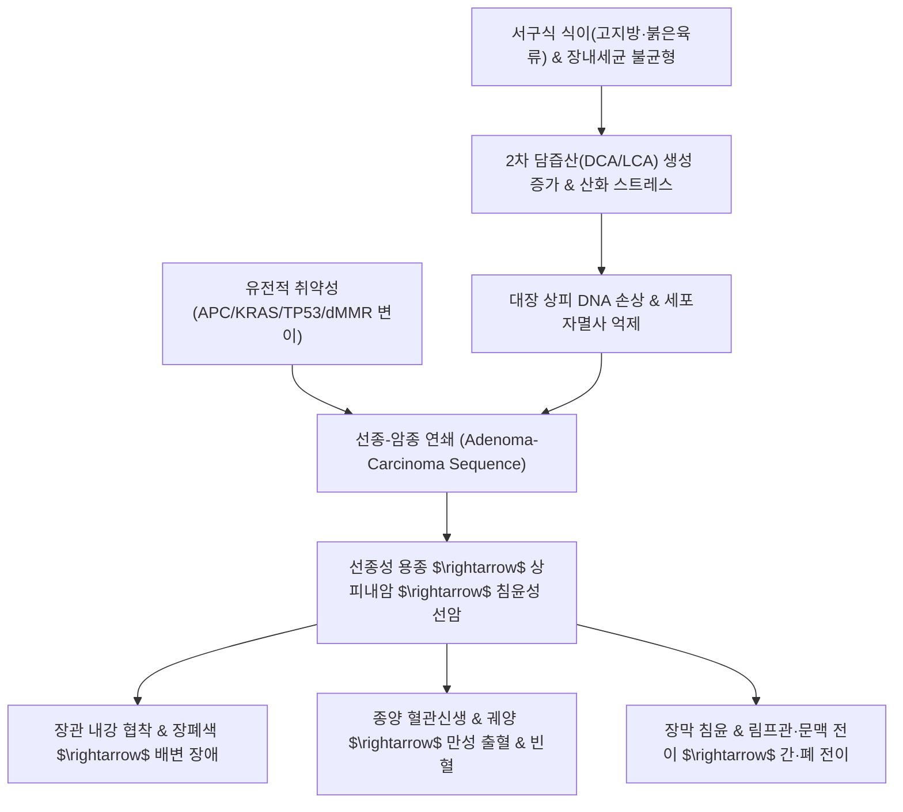

# 🩺 [[대장암]] (Colorectal Cancer / 大腸癌, KCD C18-C20)

> **핵심 3줄 요약 (Key Summary)**:
> - 📍 병소 부위 & 해부·병태생리: 맹장, 상행결장, 횡행결장, 하행결장, S상결장 및 직장 점막 상피 세포에서 기원하는 악성 종양으로, 대부분(95% 이상) [[선암종]](Adenocarcinoma) 형태를 띰.
> - 🚩 전형적 임상 양상 & 3대 징후: 배변 습관의 변화(설사/변비 교대), 잠혈 또는 육안적 혈변/점액변, 원인 불명의 철결핍성 빈혈 및 복부 종괴 촉지.
> - 🛠️ 핵심 감별 검사 & 한·양방 다각적 치료 전략: [[대장내시경]] 및 조직 생검, 혈청 종양표지자([[CEA]]), 복부 골반 CT/MRI/PET-CT 병기 설정; 근치적 수술 절제(수술 전후 항암화학요법 FOLFOX/FOLFIRI) 및 건비보신·청열해독·활혈파어 한의 암 재활 요법.
> - ⚠️ 응급 의뢰 레드플래그 & 악화 요인: 완전 장폐색(극심한 복통, 담즙성 구토, 복부 팽만), 장천공에 의한 급성 복막염 소견(판자상 복벽 경직, 반발통), 대량 직장 출혈에 따른 혈역학적 불안정(저혈압, 빈맥).

---

## 📌 목차
1. [질환 개요 & 해부학적 병태생리](#1-질환-개요--해부학적-병태생리)
2. [병태생리 메커니즘 & 생체역학적 악순환 네트워크](#2-병태생리-메커니즘--생체역학적-악순환-네트워크)
3. [임상 증상 & 이학적 검사(Physical Exam) 알고리즘](#3-임상-증상--이학적-검사physical-exam-알고리즘)
4. [감별 진단 매트릭스 (Differential Diagnosis)](#4-감별-진단-매트릭스-differential-diagnosis)
5. [한의 통합 치료 프로토콜 (침·약침·추나·한약)](#5-한의-통합-치료-프로토콜-침약침추나한약)
6. [양방 치료 & 병용·의뢰 기준 (Conventional Treatment & Referral)](#6-양방-치료--병용의뢰-기준-conventional-treatment--referral)
7. [재활 운동 & 생활습관 티칭 가이드](#6-재활-운동--생활습관-티칭-가이드)
8. [💡 사용자 진료실 핵심 필기 & 임상 노하우 (Melt-In 잔여 심화 집약)](#7--사용자-진료실-핵심-필기--임상-노하우-melt-in-잔여-심화-집약)
9. [출처 및 학술 참고 문헌 (References)](#8-출처-및-학술-참고-문헌-references)

---

## 1. 질환 개요 & 해부학적 병태생리

![[대장암_대장선암_전체조직_스캔.jpg|450]]
> [그림 1: ① 질환/병태생리 — 대장 선암종(Colorectal Adenocarcinoma)의 전체 조직 스캔 상 점막하층 및 고유근층을 침윤하는 악성 종양 궤양 병변 (출처: Wikimedia Commons / Medical Histology Collection)]

* **질환 정의 및 개요**:
  * [[대장암]]은 결장(맹장, 상행·횡행·하행·S상결장)과 직장에 발생하는 모든 악성 종양을 포괄하며, 점막 선상피(Glandular epithelium)에서 기원하는 **대장 선암종(Adenocarcinoma)**이 전체의 95% 이상을 차지합니다. 그 외 드물게 신경내분비종양(카시노이드), 위장관 기질종양(GIST), 림프종, 편평상피암(항문관 부위) 등이 발생합니다.
  * 발생 부위에 따라 **결장암(Colon Cancer)**과 **직장암(Rectal Cancer)**으로 대별되며, 해부학적 위치에 따라 수술적 접근법과 방사선 치료 적용 여부, 림프절 전이 경로가 확연히 달라집니다.
* **역학 및 통계적 특성**:
  * 전 세계적으로 암 발생률 3위, 암 사망률 2위를 차지하며, 한국에서도 갑상선암, 폐암과 함께 최상위권 발생 빈도를 기록합니다.
  * 50세 이상에서 급격히 증가하며, 최근 서구화된 식이 패턴(붉은 육류 및 가공육 다량 섭취, 식이섬유 섭취 부족)과 신체활동 저하로 인해 50세 미만의 조기 발병 대장암(Early-onset CRC) 발생률이 가파르게 상승하고 있습니다.
* **관련 해부학적 구조물**:
  * **골격 및 장기 정렬**: 골반강 내에 위치한 직장은 천골(Sacrum)의 전면 만곡을 따라 주행하며 천골신경총, 방광, 자궁/전립선 등 인접 골반 장기와 밀접하게 접촉합니다.
  * **근육 및 근막**: 대장벽의 고유근층(내윤근, 외종근-3개의 결장유두/Taenia coli 형성), 골반저를 지지하는 [[치골직장근]], [[항문거근]], 내·외항문괄약근이 배변 조절과 종양 침윤의 해부학적 경계를 이룹니다.
  * **신경 및 혈관**:
    * **동맥 공급**: 우측 대장은 상장간막동맥(SMA) 분지(회결장동맥, 우결장동맥, 중결장동맥), 좌측 대장은 하장간막동맥(IMA) 분지(좌결장동맥, S상결장동맥, 상직장동맥), 직장 하부는 내장골동맥 분지(중·하직장동맥)로부터 혈류를 공급받습니다.
    * **정맥 및 림프 환류**: 결장 및 상부 직장의 정맥혈은 문맥계(Portal vein)를 통해 간으로 유입되므로 **간 전이(Liver metastasis)**가 가장 흔하며, 하부 직장은 하대정맥(IVC)으로 직접 유입되어 간을 거치지 않고 **폐 전이(Lung metastasis)**가 초기에 발생할 수 있습니다.

---

## 2. 병태생리 메커니즘 & 생체역학적 악순환 네트워크

![[대장암_대장선암_조직학_고배율.jpg|450]]
> [그림 2: ② 관련 해부 병태 구조물 — 침윤성 대장선암의 고배율 조직 소견, 불규칙하게 증식하는 비정형 선관(Glands)과 점액 침착 및 세포 이형성 (출처: Wikimedia Commons / PathoPic)]

### 1) 다단계 발암 분자 기전 (Adenoma-Carcinoma Sequence & MSI Pathway)
1. **염색체 불안정성 경로 (Chromosomal Instability, CIN pathway, 80~85%)**:
   - 정상 상피세포에서 종양 억제 유전자인 **APC(Adenomatous Polyposis Coli)** 유전자의 불활성화 또는 소실 $\rightarrow$ $\beta$-catenin 분해 실패 $\rightarrow$ Wnt 신호전달계 과활성화로 상피세포 이상 증식(초기 선종 형성).
   - **KRAS 원발암유전자(Oncogene)** 변이 $\rightarrow$ MAPK/ERK 신호전달 항시 활성화로 세포 증식 가속화 및 세포자멸사 억제(중간/후기 선종으로 진행).
   - 염색체 18q(SMAD4 등) 결실 및 **TP53 종양 억제 유전자** 변이 $\rightarrow$ DNA 손상 복구 불가 및 침윤성 악성 선암(Carcinoma)으로의 최종 전환.
2. **미세위성체 불안정성 경로 (Microsatellite Instability, MSI pathway, 15~20%)**:
   - DNA 불일치 복구 유전자(MMR genes: MLH1, MSH2, MSH6, PMS2)의 결손(dMMR) 또는 MLH1 프로모터의 과메틸화로 인해 발생하며, 린치 증후군(Lynch syndrome)과 연관됩니다.
   - 주로 근위부(우측) 결장에서 호발하며, 저분화도 또는 점액성 암종의 형태를 띠지만 면역관문억제제(Immunotherapy)에 우수한 반응을 나타냅니다.

### 2) 생화학적·식이적 발암 촉진 메커니즘
* **지방산 및 담즙산 대사**: 육류의 동물성 포화지방 섭취 시 간에서 일차 담즙산 분비가 증가하고, 장내 혐기성 세균(Bacteroides 등)에 의해 데옥시콜산(DCA), 리토콜산(LCA) 등 독성 **2차 담즙산**으로 전환됩니다. 이는 대장 점막에 직접적인 계면활성 독성을 나타내어 세포막 파괴, 활성산소종(ROS) 발생, 상피세포 재생성 과증식을 유도합니다.
* **[[칼슘]]과 비타민 D의 점막 보호 기전**: 식이 칼슘은 이온화된 지방산 및 2차 담즙산과 불용성 칼슘염(Calcium soaps)을 형성하여 장관 내 침전시킴으로써 대장 상피에 대한 세포독성을 중화하고 상피세포 분화 촉진 및 세포자멸사를 유도하여 암 발생을 억제합니다.
* **장관 운동성 저하와 발암물질 체류**: 운동 부족과 배변 지연(만성 변비, 배변 참는 습관)은 대장 통과 시간(Colonic transit time)을 연장시켜 대변 내 발암물질(헤테로사이클릭아민, 다환방향족탄화수소 등)이 점막 상피와 접촉하는 시간을 극대화합니다.

---

## 3. 임상 증상 & 이학적 검사(Physical Exam) 알고리즘

### 1) 해부학적 발생 부위별 임상 증상 대조
* **우측 결장암 (상행결장, 맹장)**:
  * 장관 내강이 넓고 대변 내용물이 액상 상태이므로 장폐색 증상은 드뭅니다.
  * 종양의 궤양화로 인한 만성 미세 출혈 $\rightarrow$ **원인 불명의 철결핍성 빈혈**, 만성 피로, 전신 쇠약감, 숨참.
  * 우하복부에서 둔탁한 덩어리(Movable mass)가 만져지거나 소화불량, 둔통 발생.
* **좌측 결장암 (하행결장, S상결장)**:
  * 장관 내강이 좁고 대변이 고형화되는 부위이므로 **배변 습관의 현저한 변화(변비와 설사의 교대)**, 대변 굵기 감소(연필 모양 변), 장폐색 증상(복부 팽만, 산통성 복통)이 호발.
  * 육안적 선홍색 또는 암적색 혈변, 점액변 동반.
* **직장암 (Rectum)**:
  * 배변 후 잔변감(Tenesmus), 빈번한 뒤무직, 항문 통증.
  * 배변 시 선홍색 혈변(치핵 출혈로 오인하기 쉬움), 분변 실금.

### 2) 필수 진단 검사 및 병기 판정 알고리즘
* **직장수지검사 (Digital Rectal Examination, DRE)**:
  * 항문연에서 7~8cm 이내에 위치한 직장 하부 종괴를 촉진할 수 있는 가장 기본적이고 필수적인 선별 검사.
* **[[대장내시경]](Colonoscopy) 및 조직 생검**:
  * 전 대장을 직접 육안 관찰하고 의심 병변에 대한 병리 조직 생검(Biopsy)을 시행하는 확진 표준 검사. 용종 발견 시 즉시 내시경적 절제술(Polypectomy) 병행.
* **종양표지자 ([[CEA]], Carcinoembryonic Antigen)**:
  * 선별 검사로는 민감도가 낮으나, 수술 전 병기 예측, 예후 평가, 수술 후 재발 모니터링의 핵심 지표.
* **TNM 병기 분류 (AJCC 8th Edition)**:
  * **Stage I (T1-2, N0, M0)**: 종양이 점막하층 또는 고유근층에 국한.
  * **Stage II (T3-4, N0, M0)**: 고유근층을 넘어 장막하층 침윤 또는 인접 장기 침범, 림프절 전이 없음.
  * **Stage III (Any T, N1-2, M0)**: 국소 림프절 전이 동반.
  * **Stage IV (Any T, Any N, M1)**: 간, 폐, 복막 등 원격 장기 전이.

---

## 4. 감별 진단 매트릭스 (Differential Diagnosis)

| 감별 질환 | 호발 병소 및 병태 기전 | 주소증 및 임상 양상 차이 | 감별 진단적 핵심 검사 소견 |
| :--- | :--- | :--- | :--- |
| **[[대장암]] (Colorectal Cancer)** | 결장 및 직장 상피 선암종, 고령 호발 | 배변습관 변화, 혈변, 체중 감소, 빈혈, 종괴 촉지 | 내시경 상 불규칙 궤양성 종괴, 조직생검 상 악성 선암 확진, CEA 상승 |
| **[[치핵]] (Hemorrhoids)** | 항문 쿠션 조직의 울혈 및 점막 탈출 | 배변 시 통증 없는 선홍색 분출성 출혈, 종괴 탈출 | 항문경/직장경 상 치핵총 울혈 확인, 대장 점막은 완전 정상 |
| **[[궤양성 대장염]] (Ulcerative Colitis)** | 직장에서 시작하여 근위부로 연속 침범하는 염증 | 재발성 점액혈변, 심한 뒤무직, 발열, 젊은 연령층 호발 | 내시경 상 연속적이고 미만성의 점막 발적, 취약성, 위용종 관찰, 음와농양 |
| **[[게실염]] (Diverticulitis)** | 결장벽 외번 게실 내 분변 저류 및 감염 | 좌하복부(S상결장) 급성 극심한 복통, 발열, 압통 | 복부 CT 상 결장벽 비후 및 게실 주위 연부조직 염증 침윤, 복막 자극 징후 |
| **[[과민성 장증후군]] (IBS)** | 장관 운동성 및 내장 감각 과민의 기능성 질환 | 배변 후 완화되는 복통, 복부 팽만, 변비/설사 교대 | 내시경, 혈액검사 등 기질적 이상 전무, 혈변·체중감소·빈혈 등 경고 증상 없음 |

---

## 5. 한의 통합 치료 프로토콜 (침·약침·추나·한약)

![[대장암_파혈소적_본초_아출.jpg|400]]
> [그림 3: ③ 한의 치료/본초 — 파혈행기(破血行氣) 및 소적지통(消積止痛)의 핵심 항암 본초인 아출(Curcuma zedoaria)의 절편 생약 규격품 (출처: Wikimedia Commons / Medical Herb Specimen)]

### 1) 한의 변증 분형 및 방제 프로토콜
* **습열온결형 (濕熱蘊結型)**:
  * **증상**: 복통, 복부 팽만, 농혈변, 후중감(뒤무직), 항문 작열감, 구갈, 설태 황니, 맥 활삭.
  * **치법**: 청열이습(淸熱利濕), 해독화어(解毒化瘀).
  * **처방**: **갈근황금황련탕(葛根黃芩黃連湯)** 합 **백두옹탕(白頭翁湯)** 가감.
  * **주요 본초**: [[황련]], [[황금]], [[백두옹]], [[진피]], [[패장초]], [[백화사설초]].
* **어혈저체형 (瘀血阻滯型)**:
  * **증상**: 복부 국소의 찌르는 듯한 고정성 자통, 야간통 심화, 복부 종괴 촉지, 피부 갑착, 설암자/어반, 맥 세삽.
  * **치법**: 활혈화어(活血化瘀), 파혈소적(破血消積), 연견산결(軟堅散結).
  * **처방**: **격하축어탕(膈下逐瘀湯)** 합 **비아환(肥兒丸)** 가감.
  * **주요 본초**: [[아출]], [[삼릉]], [[단삼]], [[적작약]], [[도인]], [[홍화]], [[별갑]].
* **비신양허형 (脾腎陽虛型)**:
  * **증상**: 만기 환자 혹은 항암화학요법 후 극심한 전신 쇠약, 오한지냉, 사지무력, 오경설사(새벽설사), 설담반, 맥 침세무력.
  * **치법**: 온보비신(溫補脾腎), 건비익기(健脾益氣).
  * **처방**: **사신환(四神丸)** 합 **이중탕(理中湯)** 가감.
  * **주요 본초**: [[보골지]], [[육두구]], [[오수유]], [[오미자]], [[인삼]], [[백출]], [[건강]], [[부자]].
* **기혈양허형 (氣血兩虛型)**:
  * **증상**: 안색 창백, 현훈, 심계, 식욕부진, 체중 극소화, 자한, 설담홍, 맥 세약.
  * **치법**: 보익기혈(補益氣血), 건비양위(健脾養胃).
  * **처방**: **십전대보탕(十全大補湯)** 또는 **귀비탕(歸脾湯)** 가감.

### 2) 침구 및 약침 치료 프로토콜
* **체침 및 전침 요법**:
  * **혈위 선혈**: [[천추]](ST25, 대장모혈), [[대장수]](BL25, 대장유혈), [[족삼리]](ST36), [[상거허]](ST37, 대장하지합혈), [[관원]](CV4), [[기해]](CV6), [[태충]](LR3), [[합곡]](LI4).
  * **자극 방법**: 만성 허증 및 림프부종/소화장애 완화에는 평보평사 또는 보법 적용, 복통 완화 시 천추-상거허에 2~10Hz 연속파 전침을 인가하여 장관 연동운동 정상화.
* **항암 약침 요법**:
  * **산삼약침 / 건칠약침**: 면역세포(NK cell, T cell) 활성화 및 종양미세환경 억제를 목적으로 관원, 기해, 대장수 혈위에 각 0.5~1.0cc 주입.
  * **황련해독탕 약침 / 봉약침(주의)**: 급성기 습열성 염증 및 복강 내 유착 완화를 위해 천추, 족삼리에 점적 주입.

---

## 6. 양방 치료 & 병용·의뢰 기준 (Conventional Treatment & Referral)

> 🎯 **이 섹션의 목적**: 환자가 **양방약을 이미 복용 중인 경우가 많다.** 한의원 1차 진료에서 양방 치료를 이해하고, 병용 가능·주의·금기를 판단하며, 언제 의뢰할지 결정한다.

* **약물 치료 (Medication)**:
  * 계열별 약물·용량·기간 — 국내 처방 관행 반영.
  * 작용 기전과 한의 치료와의 상호작용.
* **비약물 시술 (Procedures)**:
  * 주사·차단술·물리치료·보조기 등.
* **수술·시술 적응증 (Surgical Indication)**:
  * 언제 수술로 가는가 — 절대·상대 적응증, 수술 후 경과.
* **한의 병용 판단 (Combination Therapy)**:
  * 병용 가능 / 주의 / 금기. 복용 중 환자의 감량 타이밍·반동 현상.
* **양방·전문과 의뢰 기준 (Referral Criteria)**:
  * 응급 의뢰 트리거와 전문과 의뢰 기준(정형외과·신경외과·내과 등).

	(작성 필요)

---

## 7. 재활 운동 & 생활습관 티칭 가이드

* **유산소 운동 및 골반저근 운동**:
  * **유산소 보행 운동**: 매일 30~40분씩 중강도 걷기는 대장 연동운동을 자극하고 인슐린 저항성을 개선하여 대장암 재발률을 최대 30~40% 낮춥니다.
  * **케겔 운동 (골반저근 강화)**: 직장암 수술(저위전방절제술) 후 발생하는 배변 실금 및 빈변증(LARS, Low Anterior Resection Syndrome) 예방을 위해 골반저근 수축-이완 훈련 시행.
* **식이영양 및 장내세균총 최적화 티칭**:
  * **식이섬유 충분 섭취**: 하루 25~30g 이상의 수용성·불용성 식이섬유(채소, 해조류, 통곡물) 섭취로 대변 부피를 형성하고 장 통과 시간을 단축시켜 발암물질 배출 촉진.
  * **칼슘 및 비타민 D 보충**: 칼슘(우유, 멸치, 짙은 잎채소)과 비타민 D 섭취로 장 점막 세포 독성 물질(담즙산염) 중화.
  * **붉은 육류 및 가공육 엄격 제한**: 소고기, 돼지고기, 햄, 소시지 등 고온 조리 시 발생하는 헴철(Heme iron) 및 니트로소 화합물 억제.

---

## 8. 💡 사용자 진료실 핵심 필기 & 임상 노하우 (Melt-In 잔여 심화 집약)

> [!IMPORTANT]
> **🛡️ 원문 융합(Melt-In) 및 7번 섹션 작성 불변 규칙 (CRITICAL)**
> 기존 노트의 병리적 정의(대장 선암종, 림프종, 육종, 편평상피암), 원인군(지방 섭취, 칼슘/비타민D 부족, 발암물질, 운동부족, IBD, 유전), 칼슘의 담즙산염 침전 기전, 운동 부족 및 배변 참는 습관의 병리적 영향, 의안 분석(습열, 풍한, 어혈), 한·양방 유기적 통합치료 고찰은 상부 1~6번 섹션에 100% 융합되었습니다.
> 본 섹션에는 원장님의 임상 직관과 실전 진료실 노하우를 집약합니다.

* **상부 섹션에 미처 다 담지 못한 고유 원문 필기**:
  * **해부학적 발생 위치별 명명 체계**: 결장암(상행/횡행/하행/S상결장암)과 직장암의 명확한 구분 및 장관 해부도 기반의 병소 특정.
  * **배변 참기(대변 저류)의 병리성 고찰**: 단순 운동 부족뿐 아니라 장기간 분변을 배출하지 않고 참는 습관 자체가 대장 내강 압력 상승과 독성 2차 담즙산과의 접촉 시간을 절대적으로 증가시키는 핵심 촉발 인자임을 지적.
* **진료실 실전 감별 & 치료 노하우**:
  * 1. **실전 문진 체크리스트**:
     - "대변의 굵기가 최근 연필처럼 가늘어지거나, 배변 후에도 시원하지 않고 뒤가 묵직한 잔변감이 지속됩니까?"
     - "치핵 출혈로 생각하여 방치하고 계시지 않습니까? (특히 50세 이상에서 선홍색 출혈이라도 반드시 대장내시경 이력을 확인해야 함)"
     - "원인 모르게 어지럽고 쉽게 피로하며 계단을 오를 때 숨이 차십니까? (우측 결장암의 무증상 철결핍성 빈혈 감별)"
  * 2. **암 재활 치료 순서 및 손맛 노하우**:
     - 수술 직후 회복기에는 복강 내 장폐색(Ileus) 예방을 위해 족삼리(ST36)와 상거허(ST37)에 자침 후 간헐적 득기 자극을 부여.
     - 항암화학요법(FOLFOX)으로 인한 말초신경병증(CIPN) 환자는 수족 말단의 팔풍혈(EX-UE9), 팔사혈(EX-LE10)에 온침 및 약침 병행 시 저림 완화 효과 탁월.
  * 3. **환자 티칭 스크립트**:
     - "대장암 수술과 항암치료가 끝났다고 치료가 완료된 것이 아닙니다. 대장 점막을 손상시키는 담즙산과 노폐물을 빠르게 배출하기 위해 하루 1.5L 이상의 수분과 섬유질 섭취, 그리고 식후 30분 걷기를 평생의 습관으로 만드셔야 합니다."

---

## 9. 출처 및 학술 참고 문헌 (References)

1. **대한대장항문학회**. (2020). *대장항문학 (제4판)*. 군자출판사.
2. **대한종양내과학회**. (2021). *임상종양학 (제3판)*. 군자출판사.
3. **Brenner, H., Kloor, M., & Pox, C. P.** (2014). Colorectal cancer. *The Lancet*, 383(9927), 1490-1502. [PMID: 24107293]
4. **Kuipers, E. J., Grady, W. M., Lieberman, D., et al.** (2015). Colorectal cancer. *Nature Reviews Disease Primers*, 1, 15065. [PMID: 27189416]
5. **Dekker, E., Tanis, P. J., Vleugels, J. L., et al.** (2019). Colorectal cancer. *The Lancet*, 394(10207), 1467-1480. [PMID: 31631858]
6. **Qi, F., Zhao, L., Zhou, A., et al.** (2015). The advantages of using traditional Chinese medicine as an adjunctive therapy in the whole course of cancer treatment. *Evidence-Based Complementary and Alternative Medicine*, 2015, 959654. [PMID: 25787906]